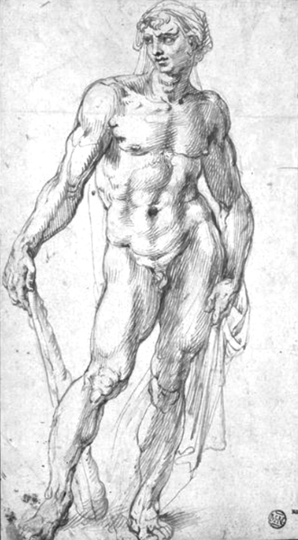

# INTRODUCTION 引言

10x Is the Opposite of What You’ve Been Told 10x 与你被告知的相反

◆ ◆ ◆

*“What the caterpillar calls the end of the world, the master calls a butterfly.” “毛毛虫称之为世界末日的东西，大师称之为蝴蝶。”*

**— RICHARD BACH - 理查德·巴赫**

At age 17, Michelangelo became fixated with secretly obtaining and dissecting human cadavers. 17 岁时，米开朗基罗开始痴迷于秘密获取和解剖人类尸体。

“Violating a corpse” was a crime punishable by death in Florence, Italy, in 1493. “侵犯尸体”是 1493 年意大利佛罗伦萨的一项可判处死刑的罪行。

“And if one were willing to risk it? How could it be gone about? Watch the poverty fields for burials?” he asked an elderly friend, Marsilio Ficino, whose father had been a prominent doctor. Ficino could not believe what he was hearing. ”如果有人愿意冒险吗？怎么会这样呢？守穷田葬？“他问他的一位老朋友马尔西利奥·菲奇诺，他的父亲是一位著名的医生。费奇诺简直不敢相信自己的耳朵。

“My dear young friend, you cannot conceive of yourself as a grave robber.”^(1) “我亲爱的年轻朋友，你不能想象自己是一个盗墓贼。 ^(1)

But Michelangelo was desperate. 但米开朗琪罗绝望了。

Indeed, he *would* rob graves to get bodies if he could find no other option. 的确，如果没有其他选择，他会去盗墓取尸体。

Learning anatomy was essential to his aim. 学习解剖学对他的目标至关重要。

He’d just begun working on his first life-sized, three-dimensional sculpture: a nine-foot Hercules. 他刚刚开始制作他的第一个真人大小的三维雕塑：九英尺高的大力士

Prompted by the recent death of his sponsor and mentor, Michelangelo planned to do the project to memorialize Lorenzo di Piero de’ Medici. 由于赞助人和导师最近去世，米开朗琪罗计划做这个项目来纪念洛伦佐·迪·皮耶罗·德·美第奇。

Before attempting this Hercules, he’d done many smaller sculptures. None three-dimensional. And none he’d ever been directly paid for. This was his first major project with a professional mindset. He was no longer thinking or operating like a novice or an amateur. 在尝试这个大力士之前，他做了许多较小的雕塑。没有三维的。他从来没有直接支付。这是他第一次以专业的心态参与重大项目。他不再像一个新手或业余爱好者那样思考或操作。

He convinced the foreman of the Florence Duomo Cathedral to sell him an old block of marble that had been sitting unused in the cathedral courtyard. He used most of his savings from working in the Medici palace the previous two years—five golden florins—to buy the marble. 他说服佛罗伦萨大教堂的工头卖给他一块旧大理石，这块大理石一直放在大教堂的院子里。他用了前两年在美第奇宫工作的大部分积蓄--五个金弗罗林--买下了这颗大理石。

After Lorenzo’s death, Michelangelo had been forced to move back home with his poverty-stricken father, who was skeptical about his son becoming an artist and hoped he’d go into business instead. 洛伦佐去世后，米开朗基罗被迫搬回家与他的贫困的父亲，谁是怀疑他的儿子成为一个艺术家，并希望他去做生意。

In order to earn his father’s blessing, he lied about his project, saying he’d been commissioned to make a sculpture and that the commissioner had already purchased the marble. He’d also said he would be paid a small amount each month while completing the project. This was a risky lie—if the project didn’t pay off, Michelangelo would likely have to concede to his father’s wishes of giving up his dream. 为了赢得父亲的祝福，他对自己的项目撒了谎，说他被委托制作一个雕塑，而专员已经买下了大理石。他还说，在完成这个项目的同时，他每个月会得到一小笔钱。这是一个冒险的谎言--如果这个项目没有得到回报，米开朗琪罗很可能不得不向他父亲的愿望让步，放弃他的梦想。

After setting up a spot in the Duomo workshop, Michelangelo began modeling a Hercules out of beeswax. He quickly concluded that he lacked requisite skill to create anything reflecting the true human form. 米开朗琪罗在大教堂的工作室里设立了一个地方，开始用蜂蜡为大力神建模。他很快得出结论，他缺乏必要的技能来创造任何反映真实人类形态的东西。

“How can I establish a figure, even the crudest outline, if I don’t know what I’m doing? How can I achieve anything but surface skin sculpture, exterior curves, outlines of bones, a few muscles brought into play? Effects. What do I know of the causes? The vital structure of a man that lies beneath the surface, and that my eye can’t see? How can I know what creates, from within, the shapes I see from without?”^(2) “我怎么能建立一个数字，即使是最粗糙的轮廓，如果我不知道我在做什么？除了表面的皮肤雕塑，外部的曲线，骨骼的轮廓，几块肌肉的发挥，我还能做什么呢？效果。我知道什么原因？一个人的生命结构，隐藏在表面之下，而我的眼睛看不到？我怎么知道是什么从内部创造了我从外部看到的形状？“ ^(2)

He determined that the only way he’d be able to draw and sculpt the human form with living vibrancy would be to study the intricacies and functions of the body directly—outside and in. 他决定，唯一的方法，他将能够绘制和雕刻的人的形式与生活的活力将是研究的错综复杂和功能的身体直接内外。

Where could he find available corpses? 他到哪里去找尸体？

The dead of the rich were buried in family tombs—he couldn’t get those. 有钱人的尸体都埋在家族的坟墓里--他弄不到。

The dead of the middle class were surrounded with religious ritual—that wouldn’t work. 中产阶级的死者被宗教仪式所包围--那是行不通的。

Which dead in Florence were unwatched and unwanted? Only the very poor, the orphaned, and the beggars. These people were taken to hospitals when they were sick. Specifically, church hospitals with free beds. 佛罗伦萨的哪些死者是无人看管和不受欢迎的？只有穷人、孤儿和乞丐。这些人生病时被送往医院。特别是有免费床位的教会医院。

Michelangelo now had to take another big risk if he was going to complete his ambitious project. Indeed, getting caught messing with corpses would, at the very the least, get him placed in prison. The worst case was that he could be sentenced to death. 米开朗琪罗要想完成这个雄心勃勃的计划，现在又得冒一次大风险。的确，如果被抓到摆弄尸体，至少会被关进监狱。最坏的情况是他可能被判处死刑。

The charity hospital in Florence, Santo Spirito, claimed the largest free guesthouse. Michelangelo began awkwardly sneaking around Santo Spirito to discover where the dead were kept. He found the morgue where bodies were wrapped and held until their burial. He began slipping inside late at night and leaving before sunrise. When his candle began to flicker, Michelangelo knew the monks who baked the daily bread would be nearby soon. 佛罗伦萨的慈善医院 Santo Spirito 声称是最大的免费宾馆。米开朗琪罗开始笨拙地在圣神教堂附近鬼鬼祟祟地寻找死者的存放地点。他找到了停尸房，尸体在那里被包裹起来，直到埋葬。他开始在深夜溜进去，在日出前离开。当他的蜡烛开始闪烁时，米开朗琪罗知道，每天烤面包的僧侣们很快就会来到附近。

For the next several months, he taught himself human anatomy by dissecting dozens of corpses. He obsessed over the details—how the muscles flexed, the veins pumped, and tendons stretched. He held and cut into every organ. After a while, he became used to the smell of cadavers. He was intrigued that people could be so different, yet their brains looked and felt so similar. 在接下来的几个月里，他通过解剖几十具尸体自学了人体解剖学。他痴迷于细节肌肉是如何弯曲的，静脉是如何跳动的，肌腱是如何伸展的。他抓住并切开了每一个器官。过了一会儿，他习惯了尸体的味道。他很好奇，人们可以如此不同，但他们的大脑看起来和感觉如此相似。

Back home, he sketched what he learned. Anatomy, more than anything else, became Michelangelo’s discipline and mastery.^(3) To quote a future pupil of his: 回到家里，他把学到的东西画了下来。解剖学，比其他任何东西都重要，成为米开朗基罗的纪律和精通。 ^(3) 引用他未来的学生的话：

“Through dissection Michelangelo studied every known animal, and did so many human dissections that it outnumbers that of those who are professional in that field. This is a considerable influence that shows in his mastery in anatomy that is not matched by other painters . . . He worked on so many human anatomies that those who have spent their lives at it and made it their profession hardly know as much as he does.”^(4) “通过解剖，米开朗基罗研究了每一种已知的动物，并且做了如此多的人体解剖，以至于超过了那个领域的专业人士。这是一个相当大的影响，显示在他的掌握解剖学是不匹配的其他画家。. .他研究了如此多的人体解剖学，以至于那些毕生致力于此并以此为职业的人几乎没有他知道的那么多。” ^(4)

Michelangelo developed the skill and confidence to finish his Hercules. Conceptualizing and planning the design, he sketched version after version, to get a feel for Hercules’ posture and emotions. 米开朗琪罗培养了技巧和信心来完成他的大力士。概念化和规划设计，他绘制了一个又一个版本的草图，以感受赫拉克勒斯的姿势和情感。

Rather than creating an outspread figure as was typical of the hero, with wide legs and arms on the hips, Michelangelo designed a closed and compact figure closer to the Greek concept. His knowledge of anatomy inspired him to depict Hercules’ power as a uniting force between torso and limbs. Clothed in only a small loin skin, the bare-chested and strong Hercules leaned on his massive wooden club. 米开朗琪罗没有创造出典型的英雄式伸展的人物形象，腿和手臂都很宽，放在臀部，而是设计了一个封闭而紧凑的人物形象，更接近希腊的概念。他的解剖学知识启发他将赫拉克勒斯的力量描绘成躯干和四肢之间的联合力量。只穿着一小块腰部皮肤，赤裸着胸膛，强壮的赫拉克勒斯靠在他巨大的木棍上。

Drawing of Michelangelo’s statue of Hercules.^(5) 米开朗基罗的赫拉克勒斯雕像的图纸。 ^(5)

Michelangelo built a rough clay model, continually moving the weight and stance to find the best position. Knowing the interaction between mass and tension, he showed flexed back muscles in response to the extended arm on the club. Tendons stretched and contracted as the figure leaned. Ligaments strained. The hips and shoulder pivoted. 米开朗基罗制作了一个粗糙的粘土模型，不断移动重量和姿势，以找到最佳位置。知道质量和张力之间的相互作用，他展示了弯曲的背部肌肉，以响应球杆上伸展的手臂。随着身体的倾斜，肌腱也在伸展和收缩。韧带拉伤。臀部和肩膀旋转。

All of this the artist could project with conviction and confidence because he understood human anatomy. 这位艺术家能够满怀信心地展示这一切，因为他了解人体解剖学。

He used a flat stick to gauge how deep to cut to reach neck depth, armpit depth, the slope of the torso, the bended knee. He chiseled close to the surface like a plow cutting through a field. After penetrating the weathered outer skin of the Seravezza marble, his chisel found an interior like soft sand, the milky-white shavings disintegrating between his fingers. As he went further below the surface, the marble quickly became hard as iron, requiring all his strength to achieve his desired forms. 他用一根扁平的棍子来测量要切多深才能达到脖子的深度，腋窝的深度，躯干的倾斜度，弯曲的膝盖。他紧贴着地面凿凿，就像犁在田里犁地一样。他的凿子穿透了塞拉维扎大理石风化的外皮，发现里面像柔软的沙子，乳白色的刨花在他的手指间崩解。随着他深入地下，大理石很快变得坚硬如铁，需要他用尽所有的力量才能达到他想要的形状。

He nearly ruined his block of marble. He’d cut too deeply to free the neck, and now his strong chisel on the emerging shoulder muscles sent stressful vibrations into the head. If the marble cracked at the narrow point, Hercules would lose his head. 他差点毁了他的大理石。他切得太深了，无法解放脖子，现在他在肩膀肌肉上的强有力的凿子向头部发出了压力的振动。如果大理石在狭窄的地方裂开，赫拉克勒斯就会失去他的头。

Luckily, the head held and didn’t crack. 幸运的是，头部没有破裂。

To put the level of detail he wanted into every millimeter of Hercules, Michelangelo forged several fine-edged tools. Each blow of his hammer had equally distributed force as though it was his fingers rather than the chisels cutting through the crystals. Every few moments, he stepped back and circled the marble, wiping away the new layer of dust. He examined the work from a distance and then squinted to view it up close. 为了让赫拉克勒斯的每一毫米都达到他想要的精细程度，米开朗琪罗锻造了几件锋利的工具。每一锤的力量都是均匀的，仿佛是他的手指在切割水晶，而不是凿子。每隔几分钟，他就后退一步，绕着大理石转一圈，擦掉新的一层灰尘。他从远处看了看这件作品，然后眯着眼睛近距离观看。

He made several other mistakes—such as making several blows chipping away the front section of Hercules. But he’d left himself enough spare marble at the back to push the entire figure deeper into the block than he’d planned. 他还犯了其他几个错误，比如几次击打都把大力神的前部削掉了。但是他在后面留下了足够的备用大理石，可以把整个人物推入比他计划的更深的块中。

His progress became faster. The anatomy of the marble began matching his clay model: the commanding chest, ripped forearms, and thighs like tree trunks. 他的进步越来越快。大理石的解剖结构开始与他的粘土模型相匹配：威严的胸部，撕裂的前臂，和像树干一样的大腿。

He carved carefully yet eagerly, using the hand drill to form nostrils and ears. With his finest-edged chisel, he rounded cheekbones, slowly twirling his hands with the slightest touch to give the eyes a clear, piercing look. 他用手钻仔细而又急切地雕刻着鼻孔和耳朵。他用他最锋利的凿子，把颧骨磨圆，慢慢地用最轻微的触摸旋转他的手，给予眼睛一个清晰，尖锐的外观。

As the project neared completion, he worked longer hours, forgetting to eat, and falling into bed exhausted. 随着项目接近完成，他工作的时间延长，忘记吃饭，累得躺在床上。

Once finished, word spread about the Hercules. 一旦完成，赫拉克勒斯的消息就传开了。

Michelangelo was offered 100 golden florins—a large sum of money for a common Florentine—by the Strozzi family who wanted it in their palace courtyard. 斯特罗齐家族向米开朗琪罗提供了 100 金弗罗林--这是一个普通佛罗伦萨的大数目--他们想要把它放在他们的宫殿庭院里。

When Hercules was finished, it was the spring of 1494 and Michelangelo was 19 years old. 赫拉克勒斯完成时，是 1494 年春天，米开朗基罗 19 岁。

To sculpt Hercules at the level he aspired, Michelangelo developed mastery of human anatomy to a degree no other sculptor ever had or would. Aiming for what seemed impossible, he made many mistakes, got serious and focused, took risks, and ultimately completed a tangible project that was beyond noteworthy. 为了将赫拉克勒斯雕刻成他所渴望的水平，米开朗基罗对人体解剖学的掌握程度达到了其他雕塑家从未有过的程度。为了实现看似不可能的目标，他犯了许多错误，变得严肃和专注，冒着风险，最终完成了一个有形的项目，这是值得注意的。

Michelangelo was not born a great artist. He became one and then ultimately reached legendary levels by continually pursuing what I call *the 10x process*. 米开朗基罗并非天生就是伟大的艺术家。他成为了一个，然后通过不断追求我所谓的 10 倍过程最终达到了传奇水平。

He set out to do something far beyond anything he’d ever done, and also something innovative and non-linear to the preestablished standard or norm of his field. To complete the project at the level he desired required a full-on transformation of not only his skills and creativity, but also of his commitment, convictions, and identity. 他开始做一些远远超出他以前做过的事情，也是一些创新的和非线性的，以他的领域预先建立的标准或规范。要想达到他想要的水平，他不仅需要他的技能和创造力，还需要他的承诺、信念和身份的全面转变。

He had to risk a great deal to even attempt his 10x project. 他不得不冒很大的风险，甚至尝试他的 10x 项目。

He was required to learn and develop unique knowledge and perspectives, such as the intricacies of human anatomy and how to craft a life-sized and believable human statue. 他被要求学习和发展独特的知识和观点，例如人体解剖学的复杂性，以及如何制作真人大小的可信的人体雕像。

Completing and selling the Hercules left him a *qualitatively different* person from his former 17-year-old self who began the project. 完成并出售大力神给他留下了一个与他开始这个项目的前 17 岁的自己完全不同的人。

After selling the Hercules, he was now *mentally and emotionally* a different person, with radically extended skills and more confidence than his former self. But also, professionally, he was *positioned* far differently than his former self. He now had the reputation of having done something significant, which led people to become more interested in him as a person, but also led to others wanting to commission more of his work. 卖掉大力神后，他在精神上和情感上都变了一个人，拥有了比以前更丰富的技能和更自信的自我。但在职业上，他的定位与他以前的自己大不相同。他现在有了做了一些有意义的事情的名声，这导致人们对他这个人更感兴趣，但也导致其他人想要委托更多的工作。

How did Michelangelo achieve such an impossible breakthrough? 米开朗基罗是如何实现如此不可能的突破的？

In psychology, there’s an increasingly crucial concept, *psychological flexibility*, which is defined as the ability to respond to obstacles successfully and in a way that is congruent with personal standards.^(6) Essentially, psychological flexibility is moving toward chosen goals even when it’s emotionally difficult. You acknowledge and accept your emotions, but they don’t control you. 在心理学中，有一个越来越重要的概念，心理灵活性，它被定义为成功应对障碍的能力，并且以符合个人标准的方式。从本质上讲，心理上的灵活性是朝着选定的目标前进，即使在情绪上很困难的时候。你承认并接受你的情绪，但它们无法控制你。

Becoming more psychologically flexible enables you to expand and grow emotionally, and to live a more committed and congruent life, even when it’s hard.^(7,8,9) 在心理上变得更加灵活，可以让你在情感上得到扩展和成长，并过一种更加坚定和和谐的生活，即使是在艰难的时候。 ^(7,8,9)

How does this work? 这是怎么回事？

A core aspect of psychological flexibility is *viewing yourself as a context*, rather than viewing yourself as content.^(10,11,12) This enables you to not overly identify with your thoughts and emotions, since you’re not your thoughts and emotions. Instead, you’re the context of your thoughts and emotions, and as you change the context, the content changes as well. 心理灵活性的一个核心方面是将自己视为一个情境，而不是将自己视为内容。 ^(10,11,12) 这让你不会过度认同你的想法和情绪，因为你不是你的想法和情绪。相反，你是你思想和情绪的背景，当你改变背景时，内容也会改变。

When you view yourself as a context, rather than as content, then you are far more flexible and adaptive. Just as you can change the furniture or remodel a house, you can expand and transform yourself. By expanding yourself as a context—which involves a great deal of emotional development—you’re enabled to handle the complexity of bigger obstacles and opportunities without being overwhelmed. You can be humble yet resolved as you innovate new pathways toward increasingly exciting and compelling goals. 当你把自己看作一个背景，而不是内容，那么你就更加灵活和适应。就像你可以改变家具或改造房子一样，你可以扩展和改造自己。通过将自己扩展为一个情境--这涉及到大量的情感发展--你能够处理更大的障碍和机遇的复杂性而不会被淹没。你可以谦虚但坚定地为你创造新的道路，朝着越来越令人兴奋和引人注目的目标。

Michelangelo was incredibly flexible. He continually envisioned grander and more profound visions, and he evolved himself emotionally and also in skills and abilities to realize his impossible visions. By doing so, he expanded his freedom and agency—*the quality* of who he was and how he lived fundamentally improved with each 10x jump he made, which was continuous throughout his life. 米开朗基罗非常灵活。他不断地设想更宏伟、更深刻的愿景，他在情感上以及技能和能力上不断地发展自己，以实现他不可能实现的愿景。通过这样做，他扩大了他的自由和能动性--他每跳 10 次，他的素质和他的生活方式都从根本上提高了，这贯穿了他的一生。

Michelangelo didn’t stop at Hercules. 米开朗基罗并没有止步于赫拉克勒斯。

With his new confidence and skills, he began his next 10x jump, which started with the carving of a small cupid statue quickly purchased for 200 florins by Cardinal Raffaele Riario of Rome. Riario was so inspired by the piece that he invited Michelangelo to move into his palace and work for him full-time.^(13) 有了新的信心和技能，他开始了下一次 10 倍跳跃，从雕刻一个小丘比特雕像开始，罗马红衣主教拉斐尔·里亚里奥很快以 200 弗罗林的价格购买了这座雕像。里亚里奥被这件作品所启发，邀请米开朗基罗搬进他的宫殿，为他全职工作。 ^(13)

Leaving Florence, where he’d grown up and spent his entire life, Michelangelo arrived in Rome on June 25, 1496, at the age of 21\. He quickly located a large piece of marble and began his most ambitious project yet. By the spring of 1497—eight or nine months later—the artist completed a life-sized statue of the Roman wine god, *Bacchus*, holding a vine of grapes at his side with a small child-satyr eating the grapes from behind. 米开朗琪罗在佛罗伦萨长大，并在那里度过了他的一生，他于 1496 年 6 月 25 日抵达罗马，当时他 21 岁。他很快找到了一大块大理石，开始了他迄今为止最雄心勃勃的项目。到了 1497 年春天--八九个月后--艺术家完成了一个真人大小的罗马酒神巴克斯雕像，他身边拿着一棵葡萄藤，一个小山羊从后面吃葡萄。

The banker, Jacopo Galli, who lived across the street from Cardinal Riario, became friends with Michelangelo and purchased the *Bacchus* for his courtyard. Galli helped Michelangelo get the commission to carve a *Pietà* statue for St. Peter’s Cathedral in November 1497. 银行家雅格波·加利（Jacopo Galli）住在里里奥红衣主教的对面，他与米开朗基罗成为了朋友，并买下了酒神作为他的庭院。加利帮助米开朗琪罗获得委托，为圣. 1497 年 11 月的彼得大教堂

A sculpture depicting the Virgin Mary grieving over the body of Jesus, the *Pietà* took two years to complete. Michelangelo wanted this piece to be perfect and he pushed his creative and sculpting abilities to otherworldly heights. 这座雕像描绘了圣母玛丽为耶稣的身体悲伤，花了两年时间完成。米开朗基罗希望这件作品完美，他将自己的创造力和雕塑能力推向了超凡脱俗的高度。

Unlike any of the many other *Pietàs* at the time, he wanted Mary, not Jesus, to be the central figure. Rather than the middle-aged mother of a man in his 30s, Michelangelo reflected Mary as she would have looked as a young and radiant virgin mother. She holds and mourns over her now dead Savior-son. The beautiful body of Christ, mostly exposed, displays Michelangelo’s hard-earned mastery of human anatomy. 与当时其他许多 Pietàs 不同，他希望玛丽，而不是耶稣，成为中心人物。米开朗琪罗并不是一个 30 多岁男人的中年母亲，而是把玛丽塑造成一个年轻而容光焕发的处女母亲。她抱着她现在死去的救世主的儿子哀悼。基督美丽的身体，大部分暴露在外，显示米开朗基罗来之不易的人体解剖学。

The completion of the *Pietà* was the culmination of another 10x jump for Michelangelo. 《圣母玛利亚圣母玛利亚》的完成是米开朗基罗又一次 10 倍跳跃的高潮。

Now 24 when he returned to live in Florence, he was not the same man who had left his hometown three years earlier. He’d lived abroad, met influential people, and completed two next-level projects—the *Bacchus* and *Pietà*. To this day, the *Pietà* is considered one of the greatest artistic masterpieces *of all time*. 现在 24 岁的他回到佛罗伦萨生活，已经不是三年前离开家乡的那个人了。他在国外生活过，结识了一些有影响力的人物，并完成了两个更高层次的项目--酒神和圣母玛利亚。直到今天，《圣母玛利亚圣母玛利亚》被认为是有史以来最伟大的艺术杰作之一。

Michelangelo’s skills, creativity, and confidence following the completion of the *Pietà* were incomparably beyond where he was after his Hercules. It would almost be insulting to compare the two statues—they are in different stratospheres of quality, depth, and impact. Like comparing fast food to fine dining, or in this case, like comparing fine dining to the best meal *ever* crafted. 米开朗琪罗完成《圣母玛利亚》后的技巧、创造力和自信，都远远超出了他在《大力神》之后的水平。将这两座雕像进行比较几乎是一种侮辱，它们在质量、深度和影响力上处于不同的平流层。就像把快餐比作美食，或者在这种情况下，就像把美食比作有史以来最好的一餐。

In early 1501, Michelangelo began what would be his next 10x jump. 1501 年初，米开朗基罗开始了他的下一次 10 倍跳跃。

Already four statues into a 15-statue commission for the Cathedral of Sienna, he learned the Overseers of the Office of Works of Florence Cathedral (the *Operai*) were seeking a sculptor to complete their giant David statue. 已经有四尊雕像进入了西耶纳大教堂的 15 尊雕像委员会，他了解到佛罗伦萨大教堂工程办公室的监督员正在寻找一位雕塑家来完成他们的巨大大卫雕像。

The 17-foot piece of marble had been sitting in the Florence Duomo courtyard incomplete and baking in the Mediterranean sun for more than 40 years. It had been abandoned and damaged by two separate sculptors decades earlier. 这块 17 英尺高的大理石已经在佛罗伦萨大教堂的庭院里不完整，在地中海的阳光下烘烤了 40 多年。几十年前，它被两个不同的雕塑家遗弃和损坏。

Michelangelo wanted this project more than anything else. 米开朗基罗想要这个项目胜过其他任何东西。

He saw it as a huge opportunity—a *10x opportunity*. 他认为这是一个巨大的机会，一个十倍的机会。

He believed he could do something special with the David. Now 26, Michelangelo convinced the *Operai* that he was the sculptor to complete the David.^(14) 他相信他可以用大卫做一些特别的事情。现年 26 岁的米开朗基罗说服歌剧院相信他是完成大卫雕像的雕塑家。 ^(14)

Unlike the many other David sculptures of his era—including Donatello’s—Michelangelo chose not to depict David standing victorious over Goliath’s severed head. He chose not to reflect David as a small and feminine character, as he was often portrayed. Michelangelo reflected on and studied David’s interaction with King Saul, in the book of Samuel, when young David convinced Saul that he could go up against the giant, Goliath. Reading about David who *wrested and killed lions and bears*, Michelangelo saw David as the perfect man. 与他那个时代的许多其他大卫雕塑不同--包括多纳泰罗的雕塑--米开朗基罗选择不描绘大卫站在胜利的歌利亚的头颅之上。他选择不像经常被描绘的那样，把大卫描绘成一个小而女性化的角色。米开朗基罗在撒母耳记中反思并研究了大卫与扫罗的互动，当时年轻的大卫说服扫罗，他可以对抗巨人歌利亚。米开朗基罗阅读到了大卫的故事，他把大卫看作是一个完美的人。

Rather than depict him *after* his great victory over the giant, Michelangelo would depict David *just before* the courageous encounter. His left hand over his shoulder holding his sling and right hand down by his side holding a stone, David’s face would express apprehension yet resolution. 米开朗琪罗没有描绘他战胜巨人之后的情景，而是描绘了大卫在勇敢遭遇之前的情景。大卫的左手扛在肩上，右手拿着一块石头，他的脸上流露出忧虑和决心。

For nearly three years, Michelangelo pored over David. 米开朗基罗近三年来一直在研究大卫。

And David transformed Michelangelo—*completely*. 大卫彻底改变了米开朗基罗。

When finished in early 1504, David was immediately recognized as a masterpiece. Michelangelo was just 29 years old. 当 1504 年初完成时，大卫立即被认为是一个杰作。米开朗基罗当时只有 29 岁。

Michelangelo was paid 400 florins for the David statue, his biggest fee up until that point. A council of the most influential artists and politicians of the time came together to decide where the David would stand. It was placed in front of the Palazzo Vecchio—the town hall of Florence. David became the symbol of Florentine independence and liberty. Literally a turning point for the entire city, David renewed Florence’s courage and pride, and the people and the city began prospering greatly. 米开朗基罗为大卫雕像支付了 400 弗罗林，这是他迄今为止最大的一笔费用。当时最有影响力的艺术家和政治家组成的理事会聚集在一起，决定大卫的立场。它被放置在佛罗伦萨市政厅--旧宫的前面。大卫成为佛罗伦萨独立和自由的象征。这是整个城市的转折点，大卫重新焕发了佛罗伦萨的勇气和自豪感，人民和城市开始大大繁荣。

With the completion of the David, Michelangelo’s fame rivaled that of Leonardo da Vinci. Having improved his abilities by another 10x level, he was given commissions by leaders of nations and governments. 随着《大卫》的完成，米开朗琪罗的名气与列奥纳多·达·芬奇不相上下。他的能力又提升了 10 倍，得到了各国领导人和政府领导人的委托。

In 1505 while working on his *Battle of Cascina* painting—which would be paired with Leonardo da Vinci’s *Battle of Anghiari* for the council chamber of the Palazzo Vecchio—he was forced to abandon the project. The newly elected Pope Julius II commissioned Michelangelo to build the Pope’s tomb. 1505 年，他在创作《卡斯希纳战役》（Cascina 战役）时，被迫放弃了这一计划，这幅画将与芬奇的《安吉亚里战役》（Battle of Anghiari）搭配，用于韦基奥宫的理事会厅。新当选的教皇尤利乌斯二世委托米开朗基罗建造教皇墓。

You don’t say no to the Pope. 你不能拒绝教皇。

Michelangelo moved to Rome and got to work. 米开朗基罗搬到罗马开始工作。

Three years later—in 1508—the Pope asked him to paint the Sistine Chapel, which he completed in 1512 at age 37. 三年后，也就是 1508 年，教皇要求他画西斯廷教堂，他在 1512 年完成了这幅画，当时他 37 岁。

Throughout his life, Michelangelo continued to take on projects far beyond—*impossibly beyond*—his skill level. Most people are afraid to commit fully to the 10x process because it inevitably requires letting go of your current identity, circumstances, and comfort zone. 在米开朗基罗的一生中，他继续从事远远超出--不可能超出--他的技能水平的项目。大多数人都不敢完全投入 10 倍的过程，因为这不可避免地要求你放弃当前的身份、环境和舒适区。

Going 10x means you’re living based on the most intrinsic and exciting future you can imagine. That 10x future becomes your filter for everything you do, and most of your current life can’t make it through that 10x filter. 10 倍意味着你生活在你能想象的最内在和最令人兴奋的未来之上。10 倍的未来成为你做任何事情的过滤器，而你现在的生活大多数都无法通过 10 倍的过滤器。

What got you here won’t get you there. 让你在这里的东西不会让你在那里。

To quote the actor Leonardo DiCaprio, “Every next level of your life will require a different you.” 引用演员列奥纳多·迪卡普里奥的话：“你生活的每一个下一个阶段都需要一个不同的你。”

## 10x Is Simpler, Easier, and Better than You’ve Been Taught 10 x 比你教过的更简单、更容易、更好

*“But what about the quality of the work? It was in the marrow of his bones to create only the finest he could produce; to create far beyond his abilities because he could be content with nothing that was not new, fresh, different, a palpable extension of the whole of the art. He had never compromised with quality; his integrity as a man and an artist was the rock on which his life was built. If he split that rock by indifference, by giving less than the exhausting best of himself, if he were content merely to get by, what was left of him?” “可是工作的质量呢？他骨子里只会创造出他所能生产的最好的东西;创造远远超出他的能力，因为他可以满足于任何不新鲜的，新鲜的，不同的，整个艺术的明显延伸。他从不在质量上妥协;他作为一个人和艺术家的正直是他一生赖以生存的基石。如果他因漠不关心而劈开了那块石头，因为他没有尽自己最大的努力，如果他仅仅满足于勉强度日，那他还剩下什么呢？“*

**— IRVING STONE, *THE AGONY AND THE ECSTASY*^(15) - 欧文 Stone，The Agony AND THE Excastasy ^(15)**

History’s greatest artists and entrepreneurs understand the difference between 10x and 2x thinking. 历史上最伟大的艺术家和企业家都明白 10 倍和 2 倍思维的区别。

You might be thinking: What about people who don’t ever make a 10x leap? 你可能会想：那些从来没有实现 10 倍飞跃的人呢？

Most people reach for just a little bit more—a promotion, a little more money, a new personal record. Going for incremental progress is a *2x mindset*, which at a fundamental level means you’re *continuing* or *maintaining* what you’re already doing. You’re letting *the past* dictate what you do and how you do it. 2x is linear, meaning you’re striving to double output by doubling effort. Do more of the same, just faster and harder. 大多数人只会追求更多一点升职、多一点钱、新的个人记录。追求渐进式的进步是一种 2 倍的心态，从根本上说，这意味着你在继续或保持你已经在做的事情。你让过去决定了你做什么和你怎么做。2x 是线性的，意味着你正在努力通过加倍的努力来使产出翻倍。做更多相同的事情，只是更快更努力。

2x is exhausting and soul-defeating. 2x 是令人疲惫和沮丧的。

It’s extremely difficult to put the pedal to the metal and grind away for inches of progress. 这是非常困难的把踏板放在金属和研磨了几英寸的进展。

By contrast, 10x is so big and seemingly impossible that it immediately forces you out of your current mindset and approach. You can’t work 10x harder or longer. Brute force and linear methods won’t get you to 10x. 相比之下，10 倍是如此之大，似乎不可能，它立即迫使你摆脱当前的心态和方法。你不能再努力 10 倍或更长时间。蛮力和线性方法不会让你达到 10 倍。

10x has become a trendy concept thrown around in entrepreneurial, financial, and self-help circles. Yet, most people radically misunderstand what 10x means and what it can do. In fact, most people understand 10x *literally* and *exactly backward*. 10x 已经成为创业、金融和自助圈中流行的一个时髦概念。然而，大多数人根本上误解了 10x 的含义和它能做什么。事实上，大多数人从字面上理解 10 倍，确切地说是向后的。

Because most people have it backward, they struggle manifesting 10x in their lives. They get stuck in a 2x mindset. But even more, their quest for 10x leads them to seek the wrong thing, an endless race *for more*. 因为大多数人都是落后的，他们在生活中挣扎着表现出 10 倍。他们陷入了 2x 的心态。但更重要的是，他们对 10 倍的追求导致他们寻找错误的东西，一场无休止的追求更多的比赛。

**10x isn’t about more. *It’s about less.* 10x 并不是更多。是关于更少的。**

Michelangelo understood this clearly. When the Pope asked about the secret of his genius, particularly in regard to the statue of David, Michelangelo explained, “It’s simple. I just remove everything that is not David.” 米开朗基罗清楚地明白这一点。当教皇问及他的天才之处，特别是大卫雕像的秘密时，米开朗基罗解释说：“这很简单。我只是删除所有不是大卫的东西。”

Going 10x is the simplification of your focus down to the core essential. Then you remove everything else. 10 倍是将你的重点简化到核心要素。然后你把其他的东西都拿走。

Steve Jobs was the master of *extreme simplification*, which is the essence of innovation. 史蒂夫·乔布斯是极端简化的大师，这是创新的精髓。

When designing the iPod, he removed all aspects of owning music that people didn’t want and provided technology that made the experience of music *10x better and easier*. Rather than having to go to the store and spend $12–15 for a full album when you really just wanted one song, now you could simply and easily purchase only the songs you wanted and have them all pocket-size in one easy place. No more lugging around hundreds of CDs containing 80 percent or more of songs you don’t even like. 在设计 iPod 时，他去除了人们不想要的音乐的所有方面，并提供了使音乐体验更好、更容易的技术。而不是去商店花 12 -15 美元买一张完整的专辑时，你真的只想要一首歌，现在你可以简单而容易地只购买你想要的歌曲，并把它们都放在一个容易的地方。不用再拖着数百张 CD，其中包含了 80%或更多你甚至不喜欢的歌曲。

**Just as 10x isn’t about more but less, 10x is also not about quantity. *It’s about quality.* 正如 10 x 不是关于多而是少，10 x 也不是关于数量。这是质量问题。**

It’s not the quantity of work he did that makes Michelangelo legendary, but the almost unfathomable *quality* of what he did. Each time Michelangelo went 10x, he reached a near godly level of mastery and expression. 米开朗琪罗之所以成为传奇，并不是因为他的作品数量，而是因为他所做的几乎深不可测的品质。米开朗琪罗每提高 10 倍，他的掌握和表情都达到了近乎神的水平。

Sure, he did a lot. A ridiculous amount, actually. But so do a lot of people. Many are busy yet unproductive. They do a lot but ultimately achieve little. 当然，他做了很多。事实上，一个荒谬的数额。但很多人也是。很多人都很忙碌，但没有生产力。他们做了很多，但最终却收效甚微。

10x is a qualitative difference from before and after, a wholesale innovation and upgrade. 10 x 是前后的质的差异，是一次批发的创新和升级。

10x is the equivalent of going from crawling to walking; from not knowing the alphabet to reading; from living in your parent’s basement to living on your own; from being awkward and shy to being a bold and emotionally intelligent leader. 10 x 相当于从爬行到行走;从不认识字母表到阅读;从住在父母家的地下室到自己住从笨拙和害羞转变为勇敢和情商高的领导者。

10x is tantamount to going from horse and buggy to a car. You may be in the same genre—such as transportation—but you’re not comparing apples to apples. A non-linear change has taken place. It’s fundamentally a *qualitative shift*, more than a quantitative one. The transformation occurs by operating from a seemingly impossible and imagined future, and takes you in a non-linear and radically different direction and approach than what you (and everyone else) have been doing up to this point. 10 x 等于从马和马车到一辆汽车。你们可能属于同一个行业，比如交通行业，但你们不是在拿苹果和苹果进行比较。发生了非线性变化。从根本上说，这是一个质的转变，而不是量的转变。转变发生在一个看似不可能的、想象中的未来，并带你走向一个非线性的、与你（和其他人）到目前为止所做的完全不同的方向和方法。

2x is a focus on quantity. You just add a zero and do more of what you’re doing. It’s linear and non-creative. It’s brute force, not higher intelligence and leverage. 2x 是注重数量。你只要加上一个零就能做更多的事。它是线性的，没有创造性的。这是蛮力不是更高的智力和杠杆。

The most fundamental qualitative change is internal, your *vision and identity*. By changing these, everything else you’re doing simultaneously changes as well. You take your internal and emotional evolution and externalize that in the form of refined standards and results. 最根本的质变是内在的，你的愿景和身份。通过改变这些，你正在做的其他事情也会同时改变。你把你的内在和情感的演变和外在的形式细化的标准和结果。

10x becomes your perceptual filter for everything you do. 10x 成为你所做的一切的感知过滤器。

Everything becomes either 10x *or* 2x. 一切都变成了 10x 或 2x。

Anything that’s not 10x doesn’t meet the filter and gets released from your attention. According to constraint theory, the greatest human bottleneck is attention. Our attention is our most finite resource, even more finite and valuable than our time. Indeed, the quality and depth of our attention determines the quality of our time. Most people’s attention is scattered, tugged, and seemingly never *right here and right now*. 任何不是 10x 的东西都不符合过滤器，并从你的注意力中释放出来。根据约束理论，人类最大的瓶颈是注意力。我们的注意力是我们最有限的资源，甚至比我们的时间更有限、更有价值。事实上，我们注意力的质量和深度决定了我们时代的质量。大多数人的注意力都分散了，被拉扯着，似乎从来没有在此时此地。

Going 10x means your attention is directly on *far less*, but it’s insanely more potent and impactful because it’s focused rather than spread thin. 增加 10 倍意味着你的注意力会直接集中在少得多的地方，但它更加有力和有影响力，因为它是集中的，而不是分散的。

**Finally, 10x is not about any specific outcome. *It’s about the process.* 最后，10x 不是关于任何具体结果的。这是关于过程。**

10x is a capability. 10x 是一种能力。

It’s an operating system you deploy for: 这是一个您部署的操作系统：

*   Dramatically expanding your vision and standards 大幅扩展您的视野和标准
*   Simplifying your strategy and focus 简化您的战略和重点
*   Identifying and removing non-essentials 识别和删除不必要的
*   Developing mastery in unique areas 在独特领域发展精通
*   Leading and empowering others who excitedly share your vision 领导和授权那些兴奋地分享你愿景的人

10x is *the vehicle* for transforming yourself and your life. 10x 是改变你自己和你的生活的工具。

Every time you commit to 10x, that commitment takes you on a journey. That journey is the peeling away of more layers of the onion, discovering the essence of who you are. Each layer you peel away is the letting-go of your former self, transforming you increasingly into your truest self. 每次你承诺 10 倍，这个承诺都会带你踏上一段旅程。这段旅程是剥下更多层洋葱，发现你是谁的本质。你剥离的每一层都是对你以前的自我的释放，使你逐渐变成最真实的自我。

Committing to 10x and transforming yourself *frees you*. 承诺 10 倍，改变自己会让你自由。

There are two levels of freedom—surface-level freedom and higher-level freedom. Surface-level freedom is external and more measurable. This is “freedom from”—where you’re freed from ignorance, poverty, and slavery. But there is a more abundant kind of freedom that is *internal and qualitative*. This is “freedom to”—which is where you take full ownership over your life.^(16) 有两个级别的自由-表面级别的自由和更高级别的自由。表面自由是外在的，更可测量。这就是“自由”--你从无知、贫穷和奴役中解脱出来。但还有一种更丰富的自由，那是内在的和质的。这就是“自由”--这是你完全拥有自己的生活的地方。 ^(16)

Higher-level freedom requires commitment and courage. You choose your standard and live based on that standard, regardless of the associated risks or costs. No one can give you this higher-level freedom. A matter of conscious choosing, *freedom to* is purely internal. You could have all the external freedoms imaginable and yet not be free. 更高层次的自由需要承诺和勇气。你选择你的标准，并根据该标准生活，而不考虑相关的风险或成本。没有人能给予你这种更高层次的自由。一个有意识的选择问题，自由纯粹是内在的。你可以拥有所有可以想象的外在自由，但却不是自由的。

10x is the means, and *freedom is the end.* 10 x 是手段，自由是目的。

Every time you go 10x, you consciously choose to live your life at a particular level or standard, no matter how abnormal or seemingly impossible. *You* chose the standard. You commit to it. You live as *you choose*, transforming yourself and your world through your commitment. 每一次你去 10 倍，你有意识地选择生活在一个特定的水平或标准，无论多么不正常或似乎不可能。你选择了标准。你要坚持下去。你按照自己的选择生活，通过你的承诺改变你自己和你的世界。

The top entrepreneurial coach in the world and co-founder of Strategic Coach, Dan Sullivan, discovered four fundamental freedoms that 10x people seek: 全球顶级创业教练兼 Strategic Coach 联合创始人丹·沙利文（Dan Sullivan）发现了十倍人追求的四项基本自由：

*   Freedom of Time 时间自由
*   Freedom of Money 金钱自由
*   Freedom of Relationship 关系自由
*   Freedom of Purpose^(17) 目的自由 ^(17)

Freedom is fundamentally qualitative and internal. You must choose it and embrace it. No one can give it to you or take it away. 自由本质上是质的和内在的。你必须选择它并拥抱它。没有人能把它给你或拿走。

Michelangelo expanded his four freedoms throughout his life. Freedom was the infinite game he lived, and he played finite games to further expand his internal freedom. Every time he went 10x by committing to and completing a seemingly impossible project, his freedoms expanded. 米开朗基罗一生都在扩展他的四种自由。自由是他生活的无限游戏，他玩有限游戏来进一步扩大他的内在自由。每一次，他通过承诺并完成一个看似不可能的项目，以 10 倍的速度前进，他的自由就扩大了。

His time was spent on better things and was valued more by himself and others. Thus, his *Freedom of Time* continually increased. 他的时间花在了更好的事情上，更被自己和他人看重。于是，他的时间自由度不断提升。

He got bigger commissions, and those hiring him would give him lodging, pay for his materials, pay for servants, and pay for assistants to help him complete the projects. His *Freedom of Money* grew and stopped being a hindrance to how he lived and what he did. 他得到了更大的佣金，雇佣他的人会给他提供住宿，支付他的材料，支付仆人的工资，支付助手的工资，帮助他完成项目。他的金钱自由增长，不再是他如何生活和他做什么的障碍。

He became well-known to the extent that the Pope hired him for projects that changed Michelangelo’s life and the direction of history and culture. His *Freedom of Relationship* continually expanded with each 10x jump—to the point where he had increasing access to nearly anyone he wanted, and where highly influential people regularly sought him out. 他的名声大噪，以至于教皇雇用他从事改变米开朗基罗生活和历史文化方向的项目。他的人际关系自由度随着每 10 倍的跳跃而不断扩大，以至于他几乎可以接近任何他想要的人，而且有影响力的人经常找他。

Freedom of relationship facilitates *Freedom of Purpose* because relationships open and close doors. Through a relationship, you can make non-linear and 10x jumps in options and opportunity, such as the person who gets the leadership role because he knows the person who owns the company. Those who despise this reality don’t understand the four freedoms and are limited by that fact. Rather than argue with reality, learn the rules so you can shape it to your wishes. 关系的自由促进了目标的自由，因为关系的大门打开和关闭。通过一段关系，你可以在选择和机会上做出非线性和 10 倍的跳跃，比如那个人因为认识拥有公司的人而获得领导角色。那些蔑视这个现实的人不了解四个自由，并被这个事实所限制。与其与现实争论，不如学习规则，这样你就可以根据自己的意愿塑造它。

Michelangelo’s freedom of purpose reached an almost unbelievable level where he did projects that literally changed the direction of cultures, countries, and economies. With each 10x jump, his chosen and clarified purpose in life became dramatically bigger and more meaningful. How he defined his life exponentially expanded. 米开朗基罗的自由目标达到了一个几乎令人难以置信的水平，他所做的项目实际上改变了文化、国家和经济的方向。每跳 10 倍，他选择和明确的人生目标变得更大，更有意义。他如何定义他的生活呈指数增长。

Expanding your freedom is the ultimate purpose of the entrepreneur’s journey, and there really is no end to how much freedom you can have or create. 扩大你的自由是企业家旅程的最终目的，你可以拥有或创造多少自由是没有止境的。

Expanding your freedom is what Dr. James Carse would call the “infinite game,” which is about continually transforming yourself and the game you’re playing, and never getting caught or stuck within any finite game or set of rules.^(18) 扩展你的自由是博士。James Carse 称之为“无限游戏”，它是关于不断地改变你自己和你正在玩的游戏，永远不会陷入任何有限的游戏或规则中。 ^(18)

Being 2x means you’re stuck in a finite game—a situation, perspective, objective, identity, etc. You’re not expanding your freedom to be, do, and have. You’re caught up in fear and paralysis. You’re maintaining the status quo of who you now are and what you’re now doing. 成为 2x 意味着你陷入了一个有限的游戏--一个情境、视角、目标、身份等等。你没有扩大你的自由去生存，去做，去拥有。你陷入了恐惧和瘫痪。你在维持你现在是谁和你现在在做什么的现状。

10x is playing the infinite game of expanding your freedom. 10 x 是在玩扩大你自由的无限游戏。

Freedom isn’t cheap, though. It requires brutal honesty with yourself and others, which is terrifying yet liberating. There are no half-measures or half-commitments with 10x. To achieve freedom of purpose, you must let go of everything that isn’t 10x in your life. This is hard because most of your time is likely caught up in 2x work. 自由并不便宜。它需要对自己和他人残酷的诚实，这是可怕的，但解放。10 倍没有半措施或半承诺。为了实现目标的自由，你必须放弃生活中不属于 10 倍的一切。这很难，因为你的大部分时间都花在了 2x 工作上。

Going 10x is the stripping away of everything that’s not “the David” of your core self and highest purpose. 去 10 倍是剥离一切不是你的核心自我和最高目标的“大卫”。

## My 10x Journey 我的 10x 旅程

This is a book for people interested in 10x level growth and transformation—and how you can achieve that for yourself. 这本书是为那些对 10 倍增长和转变感兴趣的人准备的，以及你如何才能实现这一目标。

I know this because I’ve experienced 10x transformations myself. 我知道这一点，因为我自己也经历过 10 倍的转变。

Many times. 很多次了

My name is Dr. Benjamin Hardy and I’m the writer of this book, along with my collaborator and primary co-author, Dan Sullivan. 我的名字是博士。本杰明·哈代和我是这本书的作者，沿着我的合作者和主要合著者丹·沙利文。

While I was pursuing my PhD in organizational psychology, my research focused on entrepreneurial courage and transformational leadership.^(19,20) In my research, I uncovered a radically novel concept, which I called *the point of no return*, that identified a core difference between wannabe entrepreneurs and successful ones. The point of no return is the moment of full commitment, wherein your identity and energy shift from avoiding what you fear to fully approaching what you most want. I also found how the most powerful leaders transform those who follow them, elevating their identity and behaviors to dramatically higher levels. 当我在攻读组织心理学博士学位时，我的研究重点是创业勇气和变革型领导力。在我的研究中，我发现了一个全新的概念，我称之为“不归路”，它明确了想要创业的人和成功的人之间的核心区别。不归路的关键是完全承诺的时刻，在这个时刻，你的身份和能量从避免你害怕的东西转变为完全接近你最想要的东西。我还发现，最有影响力的领导者如何改变追随者，将他们的身份和行为提升到更高的水平。

While completing my PhD program—from 2014 to 2019—in addition to doing my research and getting my education, my blog posts were read by over 100 million people and were regularly published on platforms like *Forbes, Fortune,* and *Psychology Today*. For three years—from 2015 to 2018—I was the number one most read writer on the massive blogging platform [Medium.com](http://Medium.com), based in Silicon Valley. I also published my first major book, *Willpower Doesn’t Work*, in 2018,^(21) and grew my online training business to seven-figures. 从 2014 年到 2019 年完成我的博士课程，除了做我的研究和接受我的教育，我的博客文章被超过 1 亿人阅读，并定期发表在福布斯，财富和心理学今天等平台上。从 2015 年到 2018 年的三年里，我是硅谷大型博客平台 Medium.com 上阅读量最大的作家。我还在 2018 年出版了我的第一本主要著作《意志力不起作用》， ^(21) ，并将我的在线培训业务增长到七位数。

Since completing my PhD in 2019, I’ve published another five books, three of which are co-authored with legendary entrepreneurial coach Dan Sullivan. Collectively my books have sold hundreds of thousands of copies and are quickly becoming staples in the business and psychology space. 自 2019 年完成博士学位以来，我又出版了五本书，其中三本是与传奇创业教练丹·沙利文合著的。我的书总共卖出了数十万册，并迅速成为商业和心理学领域的斯台普斯。

My wife and I have also made several 10x jumps. In 2015 during the first year of my PhD program, we became foster parents of three siblings, ages 3, 5, and 7\. Over the next three years, Lauren and I fought the foster system in court, and in February of 2018, we were miraculously granted adoption. One month after the adoption, Lauren became pregnant with twin girls who were born in December of 2018. 我和我的妻子也做了几次 10 倍的跳跃。2015 年，在我博士课程的第一年，我们成为了三个兄弟姐妹的养父母，年龄分别为 3 岁、5 岁和 7 岁。在接下来的三年里，劳伦和我在法庭上与寄养制度作斗争，2018 年 2 月，我们奇迹般地获得了收养。收养一个月后，劳伦怀上了 2018 年 12 月出生的双胞胎女孩。

Yes, in 2018, we technically went from zero to five kids. 是的，在 2018 年，我们从 0 个孩子到 5 个孩子。

10x transformation. 10 倍变换。

We’ve since had our sixth and final child, our epic and smiley boy Rex. 从那以后，我们有了第六个也是最后一个孩子，我们的史诗般的笑脸男孩雷克斯。

There are many more 10x’s I’ve experienced that I could talk about. But that’s not the point. The point is that since the first time I experienced 10x in my life, I wanted to understand the intricacies of the process. Thus, over the past decade, I’ve excitedly studied the psychology and application of 10x growth and transformation. 还有很多我经历过的 10x，我可以谈谈。但这不是重点。关键是，自从我第一次经历了 10 倍在我的生命中，我想了解这个过程的复杂性。因此，在过去的十年里，我兴奋地研究了 10 倍增长和转化的心理学和应用。

My study led me to the work of Dan Sullivan, who over the past 50 years has personally coached more high-level entrepreneurs than anyone living today. His company, Strategic Coach, is the premier entrepreneurial coaching company in the entire world. Over the past 35 years, more than 25,000 high-level entrepreneurs have participated in the Strategic Coach Program. 我的研究让我看到了丹·沙利文的工作，在过去的 50 年里，他亲自指导的高级企业家比当今任何人都多。他的公司 Strategic Coach 是全世界首屈一指的创业教练公司。在过去的 35 年里，超过 25，000 名高层次企业家参与了战略教练计划。

I started studying Dan’s work in 2015 when I was first starting my own entrepreneurial endeavors, and while I was also researching entrepreneurial courage academically. Dan’s teaching blew my mind and influenced my own 10x jumps as an author and entrepreneur, enabling me to build a seven figure company from nothing in just a few years. 我在 2015 年开始学习丹的工作，当时我第一次开始自己的创业努力，同时我也在学术上研究创业勇气。丹的教学让我大吃一惊，也影响了我作为一名作家和企业家的 10 倍跳跃，使我能够在短短几年内白手起家建立一家七位数的公司。

My love and appreciation of Dan’s teachings led me to collaborate with him, which has led to this and our two other books, *Who Not How* and *The Gap and The Gain*.^(22*,*23) As with our previous books, this book is written from my own perspective and in my own words. Using Dan’s language, “I’m the ‘Who’ that wrote this book because no one else could have or would have.” 我对丹的教导的热爱和欣赏使我与他合作，这导致了这本书和我们的另外两本书，《谁不是如何》和《差距与增益》。 ^(22*,*23) 和我们以前的书一样，这本书是从我自己的角度，用我自己的话写的。用丹的语言来说，“我是写这本书的‘谁’，因为没有其他人可以或将有。

Even still, Dan’s teachings form the foundation of this project. 即使如此，丹的教导构成了这个项目的基础。

Dan is truly a master. 丹是真正的大师。

His ideas and thinking are so unique and counterintuitive that they fly in the face of conventional wisdom. Take for example, the notion that getting 10x bigger results is actually *easier* than going for 2x. 他的想法和思想是如此独特和违反直觉，他们飞在面对传统智慧。例如，获得 10 倍大的结果实际上比获得 2 倍更容易。

When Dan’s entrepreneurs initially hear this idea, they scratch their heads in disbelief. Then Dan unravels radically simple yet profound insights and perspectives, making the truth of this concept so clear it can’t be misunderstood. 当丹的企业家们最初听到这个想法时，他们难以置信地挠头。然后丹展开了简单而深刻的见解和观点，使这个概念的真理如此清晰，不能被误解。

Between Dan’s five decades of working directly with tens of thousands of outlier entrepreneurs and helping them go 10x, and my background in entrepreneurial and exponential psychology, we provide a perspective of 10x in this book that’s unlike anything presented on this wildly popular and even more wildly misunderstood topic. 在丹 50 年的直接与数万名离群企业家合作并帮助他们达到 10 倍的水平之间，以及我在创业和指数心理学方面的背景之间，我们在本书中提供了一个 10 倍的视角，这与这个广受欢迎、甚至被广泛误解的话题上提出的任何观点都不同。

To bring the truth of 10x to you in this book—making it simple, mind-expanding, embarrassingly obvious, and immediately applicable—I delved down countless veins of the psychological literature, interviewed Dan for several hours, interviewed dozens of Dan’s top entrepreneurs whose stories have never been seen before now, and transformed my own life inside-and-out to prove the concepts. 为了在这本书中把 10 倍的真相带给你--让它简单、开阔思想、尴尬地显而易见、立即适用--我钻研了无数心理学文献的脉络，采访了丹几个小时，采访了几十位丹的顶级企业家，他们的故事从未被人看到过，并从里到外改变了我自己的生活来证明这些概念。

When I initiated the collaboration with Dan in 2018, it was an experiment. I believed that by sharing Dan’s ideas in the form of mainstream business books, that people’s lives could be changed. I also believed high-level entrepreneurs that meet the requirements of Strategic Coach would realize the power and depth of Dan’s teachings and join Strategic Coach for continued and systematic 10x growth. 当我在 2018 年开始与 Dan 的合作时，这是一个实验。我相信，通过以主流商业书籍的形式分享丹的想法，人们的生活可以改变。我还相信，符合 Strategic Coach 要求的高层次企业家会意识到 Dan 教导的力量和深度，并加入 Strategic Coach，以持续和系统的 10 倍增长。

Our experiment worked. 我们的实验成功了。

Our initial 10x ambition was explicitly stated in the introduction of *Who Not How*, our first book together. I wrote that our goal in writing that book was transforming the lives of hundreds of thousands of readers in addition to directly leading 500+ growth-oriented entrepreneurs to join Strategic Coach for direct training. 我们最初的 10 倍目标在《谁不是如何》的介绍中明确提出，这是我们合作的第一本书。我写道，我们写这本书的目标是改变数十万读者的生活，并直接带领 500 多名以成长为导向的企业家加入 Strategic Coach 进行直接培训。

Less than two years since the publication of *Who Not How*, both of those objectives have been achieved. The book quickly became a cult classic and perennial seller in the entrepreneurial space, and high-level entrepreneurs are joining Strategic Coach on the daily in reaction to the liberating gut-punch of Dan’s teaching displayed on the silver platter of my writing. 《谁不是如何》出版不到两年，这两个目标都实现了。这本书很快成为创业领域的经典和常年畅销书，高层企业家每天都加入战略教练，以回应丹的教学在我的写作银上展示的解放内脏。

Our collaboration has produced a qualitative 10x transformation in both of our lives and businesses. 我们的合作为我们的生活和业务带来了质的 10 倍转变。

At our new 10x level, we’ve recently re-imagined our next 10x jump, which is publishing dramatically better books that reach millions of readers and directly lead 5,000+ world-class entrepreneurs seeking 10x growth and freedom to join the Strategic Coach program. By joining Strategic Coach, these entrepreneurs receive direct access to the well from which this and our other books were drawn. 在我们新的 10 倍水平上，我们最近重新设想了下一个 10 倍跳跃，即出版更好的书籍，覆盖数百万读者，并直接引导 5，000 多名世界级企业家寻求 10 倍增长和自由加入战略教练计划。通过加入 Strategic Coach，这些企业家可以直接接触到这本书和我们其他书的来源。

## How This Book Will Change Your Life 这本书将如何改变你的生活

*“Anything that is alive is in a continual state of change and movement. The moment that you rest, thinking that you have attained the level you desire, a part of your mind enters a phase of decay. You lose your hard-earned creativity and others begin to sense it. This is a power and intelligence that must be continually renewed, or it will die.” “任何有生命的东西都处于不断变化和运动的状态中。当你休息的那一刻，认为你已经达到了你想要的水平，你的一部分思想进入了衰退阶段。你失去了来之不易的创造力，其他人开始感觉到它。这是一种必须不断更新的力量和智慧，否则它就会消亡。”*

**— ROBERT GREENE^(24) - 罗伯特·格林 ^(24)**

I was recently sharing the ideas in this book over a steak dinner with some friends and watched as the scales over their eyes began to fall off. They shook their head in disbelief, realizing how much of their lives were stuck in 2x mode. 我最近在一次牛排晚餐上和一些朋友分享这本书中的想法，看着他们眼睛上的鳞片开始脱落。他们难以置信地摇了摇头，意识到自己的生活有多少时间被卡在了 2 倍模式。

It became absurdly obvious they were needlessly maintaining so many situations, projects, and people that were 2x, not 10x. 很明显，他们不必要地维护了这么多情况、项目和人员，而不是 10 倍。

They were operating out of need not want; scarcity not abundance; security not freedom. 他们的行动是出于需要而非匮乏;匮乏而非富足;安全不是自由。

“We have to let go of [so and so client/project],” my friend said to his business partner—who was wolfing down a bite of his 32 oz. tomahawk steak—as he heard me sharing the principles you’re about to learn in this book. “我们必须放弃（某某客户/项目），”我的朋友对他的生意伙伴说，他正在狼吞虎咽地吃下他的 32 盎司。战斧牛排--他听到我分享你将要在这本书中学到的原理。

Here’s the most surprising truth about this book. Counterintuitively, 10x is much, much easier than 2x. 这是关于这本书最令人惊讶的事实。与直觉相反，10 x 比 2x 容易得多。

It’s much simpler than 2x. 比 2x 简单多了。

But “easy” and “simple” aren’t exactly what they seem. To quote American author T.S. Eliot, “A condition of complete simplicity. . . costing not less than everything.”^(25) 但“简单”和“简单”并不完全是他们看起来的那样。引用美国作家 T.S.艾略特，“一个完全简单的条件。. .成本不低于一切”。 ^(25)

To go for easy and simple, you’ll have to let go of everything in your life that is needlessly hard. More specifically, you’ll have to let go of everything you don’t truly want. 为了简单而简单，你必须放下生活中不必要的困难。更具体地说，你必须放弃所有你并不真正想要的东西。

10x filters-out literally everything that isn’t 10x, which is most things in your life. 10 倍过滤掉所有不是 10 倍的东西，这是你生活中的大多数东西。

If you’re willing to commit and let *everything* go that you don’t really want, then your life will be infinitely easier, simpler, and more successful than it’s ever been. 如果你愿意承诺并放弃你并不真正想要的一切，那么你的生活将比以往任何时候都轻松、简单、成功。

Is this scary? 这很可怕吗？

Yes. 是的，我知道

Does it require 100 percent commitment? 是否需要 100%的承诺？

Absolutely. 当然了

But like ripping off a Band-Aid, the hardest part is thinking about it. The shock factor may be real, but once you make the decision, everything changes. How you do anything is how you do everything. 10x becomes your filter and norm. 但就像撕下创可贴一样，最难的部分是思考它。震惊因素可能是真实的，但一旦你做出决定，一切都变了。你怎么做事就是你怎么做事。10x 成为你的过滤器和标准。

In this book, you will learn what 10x is and why it’s the most natural, exciting, and powerful way to live. You’re going to see yourself and the world entirely differently. 在这本书中，你将了解 10x 是什么，以及为什么它是最自然、最令人兴奋和最强大的生活方式。你会以完全不同的方式看待自己和世界。

You’re going to see your potential and every decision you make differently. 你会看到你的潜力和你所做的每一个决定都是不同的。

Before you finish reading this book, you’ll imagine and clarify highly unique and personal 10x jumps that will transform your life. You’ll make 10x your new standard and identity, filtering-out past aspects of yourself that are 2x and holding you back. 在你阅读这本书之前，你会想象和澄清高度独特和个人化的 10 倍跳跃，这将改变你的生活。你将使你的新标准和身份的 10 倍，过滤掉你过去的 2 倍和阻碍你。

There’s no end to 10x. 10x 没有尽头。

There’s no end to freedom. 自由没有尽头。

It’s an inside game. 这是一个内部游戏。

It’s an infinite game. 这是一个无限的游戏。

It’s a game you can play again and again. 这是一个你可以一次又一次玩的游戏。

Only you can decide how far you’ll go. Only you can decide how much you’ll transform into the truest expression of yourself and life’s purpose. 只有你能决定你会走多远。只有你自己能决定你将在多大程度上转化为你自己和人生目标的最真实的表达。

If you decide to go 10x from where you are now, your 10x future self will be a different person than you are now. In a short time, you’ll have freedoms you can’t presently fathom. The 10x value and quality of your time, money, relationships, and purpose will seem *impossibl*e to you now but will be completely normal to your 10x future self. 如果你决定从你现在的位置走 10 倍，你未来 10 倍的自我将是一个与现在不同的人。在很短的时间内，你将拥有你目前无法理解的自由。你的时间、金钱、人际关系和目标的 10 倍价值和质量对现在的你来说似乎是不可能的，但对你未来 10 倍的自己来说却是完全正常的。

Every time you commit to 10x, you’ll be required to go through the same process. **In the first chapter** of this book, you will learn the details of this 10x process. You’ll begin to see exactly why 10x and 2x are direct opposites, and why 10x is far easier, simpler, and more exciting than 2x. This process is highly imaginative, strategic, and practical. 每次你承诺 10x，你都需要经历同样的过程。在本书的第一章中，您将学习到这个 10 倍过程的细节。你将开始明白为什么 10x 和 2x 是直接的对立，为什么 10x 比 2x 更容易、更简单、更令人兴奋。这一过程具有高度的想象力、战略性和实用性。

**In the second chapter**, you’ll learn how to commit to 10x and transform yourself and your identity through that commitment. This is the emotional aspect of the 10x process, which is where the rubber meets the road. Having 10x goals is one thing. But making 10x *your standard*, now that’s a different ball game, one that takes pure commitment and courage. That’s a game that will transform your entire life if you’re serious about it, but it’s also the only way to expand yourself and be free. Thus, you’ll learn to make 10x your standard and say “No” to increasingly great things, sharpening and refining your filter and identity. 在第二章中，你将学习如何承诺 10 倍，并通过这种承诺来改变自己和你的身份。这是 10x 过程的情感方面，这是橡胶遇到道路的地方。10x 目标是一回事。但是把 10 倍作为你的标准，现在这是一个不同的游戏，一个需要纯粹的承诺和勇气的游戏。这是一个游戏，将改变你的整个生活，如果你认真对待它，但它也是唯一的方式扩展你自己和自由。因此，你将学会把自己的标准提高 10 倍，对越来越伟大的事情说“不”，强化和完善你的过滤器和身份。

**In the third chapter**, you’ll learn the difference between wanting and needing. To go 10x, you shift all of your energy away from a “needing” perspective of life and the world. You don’t need to go 10x, *you want to*. The highest form of freedom is based on want, not need. Choosing what you want takes radical honesty, commitment, and courage. This is how you begin peeling away the layers and getting to the root and core of who you are. The more honest you get with yourself, the more you’ll clarify and develop your Unique Ability, which is your superpower as a person and entrepreneur, and it’s completely unique to you. Avoiding your Unique Ability leads to a life of frustration and mediocrity. Opening yourself up and developing your Unique Ability takes vulnerability, commitment, and courage—it’s like climbing a mountain and jumping off a cliff at the same time. The more layers you peel away by going 10x, the more you become your own version of the David, and the more valuable and purposeful your life will be. 在第三章中，你将了解想要和需要之间的区别。要达到 10 倍，你就把所有的精力从生活和世界的“需要”角度转移开。你不需要去 10 倍，你想去。最高形式的自由是基于欲望，而不是需要。选择你想要的东西需要彻底的诚实、承诺和勇气。这就是你如何开始剥离层层，并找到你是谁的根本和核心。你对自己越诚实，你就越能澄清和发展你的独特能力，这是你作为一个人和企业家的超能力，它对你来说是完全独一无二的。逃避你的独特能力会导致你的生活充满挫折和平庸。敞开心扉，发展你的独特能力需要脆弱，承诺和勇气--这就像爬山和跳崖的同时。 你通过 10 倍剥离的层次越多，你就越成为你自己版本的大卫，你的生活就越有价值和目标。

**In the fourth chapter**, you will be shown a different perspective of your own past, enabling you to better see and appreciate all the 10x jumps you’ve already made. You’ll connect the key dots that brought you to this point and use that throughline to lay out the next qualitative and non-linear 10x jumps your soul is most calling for. You’ll learn how to normalize 10x so that it becomes an increasingly natural way to live—seeing and feeling it through both your past and your future. 在第四章中，你将看到一个不同的视角来看待你自己的过去，让你更好地看到和欣赏你已经完成的 10 倍跳跃。你将连接到这一点的关键点，并使用贯穿线布局下一个定性和非线性的 10 倍跳跃你的灵魂是最需要的。你将学习如何将 10 倍标准化，使它成为一种越来越自然的生活方式--通过你的过去和未来来观察和感受它。

**The fifth chapter** will help you shift out of the linear and quantitative model of time that is taught in public education and continued in most of corporate America. This model is based on the industrial factory model of the 19th century and is radically ineffective for 10x growth and transformation. You’ll learn the time system Dan has developed over decades to help his entrepreneurs become 10x and often 100x more productive, happy, and successful. Rather than operating in quantitative time, you’ll learn to leverage time *qualitatively*, wherein you have far more flow, fun, and transformation. You’ll be less scheduled. Your time will be less thinly-sliced and fragmented. You’ll have bigger and wider blocks of freedom for deep work, active recovery, and peak experiences. 第五章将帮助你摆脱线性和定量的时间模型，这种模型是在公共教育中教授的，并在美国大部分企业中继续使用。这种模式基于 19 世纪的工业工厂模式，对于 10 倍的增长和转型来说根本无效。您将了解 Dan 在过去几十年中开发的时间系统，以帮助他的企业家提高 10 倍甚至往往是 100 倍的生产力、快乐和成功。而不是在定量的时间中操作，你将学会定性地利用时间，在那里你有更多的流动，乐趣和转变。你的日程会少一些。你的时间将不再那么薄和碎片化。你将有更大更宽的自由块来进行深度工作、积极恢复和巅峰体验。

**The sixth chapter** takes all the building blocks of the previous chapters and challenges you to create a Self-Managing Company, where you create a culture of freedom. You’ll have a self-managing and self-multiplying team to handle *all aspects* of your business. As a Transformational Leader, you’ll be *totally free to embrace* the few things that matter most—innovating, strategizing, visioning, collaborating, evolving. Your vision will become so compelling and exciting that the right people will see multiple 10x futures for themselves in your vision. You’ll equip everyone around you to be better leaders and evolve beyond their current roles, leading them to bring on new “Whos” and free themselves up for the next stage of 10x growth. This is *Unique Ability Teamwork*. This is how you have an operating system of 10x all around you, while your own personal life gets simpler, slower, deeper, and more powerful. 第六章采用了前几章的所有构建模块，挑战你创建一个自我管理的公司，在那里你创建一个自由的文化。您将拥有一个自我管理和自我倍增的团队来处理您的业务的各个方面。作为一个变革型领导者，你可以完全自由地接受最重要的几件事情--创新、制定战略、愿景、协作、发展。你的愿景将变得如此引人注目和令人兴奋，合适的人将在你的愿景中看到自己的多个 10 倍未来。你将装备你周围的每个人成为更好的领导者，并超越他们目前的角色，带领他们带来新的“谁”，并释放自己，以迎接下一阶段的 10 倍增长。这是独一无二的团队合作。这就是你如何拥有一个 10 倍的操作系统，而你自己的个人生活变得更简单，更慢，更深刻，更强大。

Are you ready to go 10x? 你准备好 10 x 了吗？

Let’s begin. 我们开始吧.