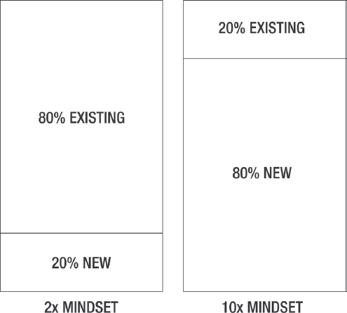

# CHAPTER 1 第一章

# THE SURPRISING SIMPLICITY OF 10x GROWTH 10 倍生长的惊人简单性

Why the 2x Mindset Is the Enemy of Results 为什么 2x 心态是结果的敌人

◆ ◆ ◆

*“The road to hell is paved with the pursuit of volume. Volume leads to marginal products, marginal customers, and greatly increased managerial complexity . . . Hard work leads to low returns. Insight and doing what we want leads to high returns . . . Strive for excellence in few things, rather than good performance in many . . . It is not shortage of time that should worry us, but the tendency for the majority of time to be spent in low-quality ways . . . The* 80/20 *principle says that if we doubled our time on the top 20 percent of activities, we could work a two-day week and achieve 60 percent more than now.”* “通往地狱的道路是用追求量铺成的。数量导致边际产品、边际客户，并大大增加管理复杂性。. .辛勤工作导致低回报。洞察力和做我们想做的事情会带来高回报。. .在少数事情上追求卓越，而不是在许多事情上追求卓越。. .我们应该担心的不是时间短缺，而是大部分时间被花在低质量的方式上的趋势。. .“80/20 原则说，如果我们在前 20%的活动上的时间增加一倍，我们可以每周工作两天，并且比现在多出 60%。

**— RICHARD KOCH^(1) - 理查德·科赫 ^(1)**

*“If you wanted to improve your profits by ten percent, how would you do it?” “如果你想提高百分之十的利润，你会怎么做？“*

I once attended marketing expert Joe Polish’s entrepreneur mastermind group, where he presented this and several other questions. 我曾经参加过营销专家乔·波兰的企业家策划小组，在那里他提出了这个问题和其他几个问题。

After taking 5 to 10 minutes to think through Joe’s questions, we had a group discussion. Dr. Alan Barnard, one of the world’s leading experts on constraint theory and decision-making, happened to be in the group that day. 在花了 5 到 10 分钟的时间思考乔的问题后，我们进行了小组讨论。艾伦·巴纳德博士是世界上最顶尖的约束理论和决策专家之一，那天碰巧也在小组里。

“This is actually a really bad question,” stated Dr. Barnard. He then continued: “这实际上是一个非常糟糕的问题，”博士说。巴纳德他接着说：

“There are literally infinite things I could do to grow my profits by ten percent. The goal isn’t big enough to create focus and specificity. If, however, you asked, ‘If you wanted to grow your profits by ten times, how would you do it?’ that would be a much better question because there are likely to be very FEW, maybe even only ONE way to create 10x growth. Indeed, almost nothing you’re currently doing would get you there. To separate the signal from the noise, you need to make the goal big enough to weed-out most paths or strategies. Impossible goals help you identify the ONE or FEW conditions that have the highest possible upside. Those are the areas to focus your scarcest resource - your limited attention on.” “我可以做无数的事情来使我的利润增长 10%。目标不够大，不足以创造重点和具体性。然而，如果你问，‘如果你想让利润增长十倍，你会怎么做？'这将是一个好得多的问题，因为有可能很少，甚至可能只有一种方法来创造 10 倍的增长。事实上，你现在所做的几乎没有什么能让你到达那里。为了将信号与噪声分离开来，你需要把目标定得足够大，以便剔除大多数路径或策略。不可能的目标帮助你识别一个或几个条件有最大的可能的好处。这些是你最稀缺的资源--你有限的注意力--的领域。”

To make a goal effective, you’ve got to test its outer-limits. Push it out as far as you can. Only once you make your goal *impossible* will you stop operating based on your current assumptions and knowledge. You’ll be *open to new ideas*, and you’ll entertain different paths that you’ve never considered.^(2) 为了使一个目标有效，你必须测试它的外部极限。尽你所能把它推出去。只有当你使你的目标成为不可能时，你才会停止基于你当前的假设和知识的运作。你会接受新的想法，你会接受你从未考虑过的不同道路。 ^(2)

Operating non-linearly based on past assumptions and norms: *2x.* 基于过去的假设和规范进行非线性操作：2 倍。

Operating non-linearly based on an exciting and seemingly impossible vision: *10x.* 基于一个令人兴奋且看似不可能的愿景进行非线性操作：十倍。

Dr. Barnard encourages people to make their goal so big that they believe it’s impossible. 博士。巴纳德鼓励人们把他们的目标定得如此之大，以至于他们相信这是不可能的。

For instance, if an entrepreneur wants to make $1,000,000 profits in the next 12 months, Dr. Barnard asks, “Do you believe that’s possible?” 例如，如果一个企业家想在未来 12 个月内赚取 100 万美元的利润，Dr.巴纳德问：“你相信这是可能的吗？“

The entrepreneur answers, “Yes.” 企业家回答：“是的。”

“What about making $10,0000,000 profit in the next 12 months,” Dr. Barnard suggests. “Do you believe that’s possible?” “那么在未来 12 个月内赚取 10，000，000 美元的利润呢？”巴纳德建议。“你相信这可能吗？“

“I don’t think so,” the entrepreneur responds. “我不这么认为，”企业家回答。

“That goal,” Dr. Barnard presses, “It would be impossible, unless. . ? What conditions need to be true for $10,000,000 profit in the next 12 months. Then ask yourself how can you create these ‘unless’ conditions to make the impossible, possible.” “这个目标，”博士。巴纳德说：“这是不可能的，除非。.？在未来 12 个月内，什么样的条件才能达到 10，000，000 美元的利润。然后问问自己，你如何创造这些‘除非’条件，让不可能的事情变成可能。

The entrepreneur lists conditions that need to be present for that impossible goal to become believably possible. 企业家列出了让这个不可能的目标变得可信的可能所需要的条件。

Dr. Barnard points out those conditions and strategies are where the entrepreneur should focus if they want the highest return on time and energy. Everything else they’re doing is noise. 博士。巴纳德指出，如果企业家想要在时间和精力上获得最高回报，他们应该关注这些条件和策略。他们所做的一切都是噪音。

Seemingly impossible or massive goals are highly practical because they immediately separate what works from what won’t, illuminating the few paths that have the greatest efficacy. 看似不可能或庞大的目标是非常实用的，因为它们能立即将有效的和无效的区分开来，照亮了少数几条最有效的路径。

Small goals are unable to clarify effective pathways because they are too marginal or linear from your current location. 小目标无法明确有效的路径，因为它们与你当前的位置过于边缘化或线性化。

This is a fundamental reason why 10x goals and vision are simpler, easier, and more practical than 2x goals. With a 2x goal, there are too many potential pathways to reach the desired destination. This creates paralysis-by-analysis and makes it extremely difficult to know where to focus your best energy and effort. 这就是为什么 10 倍目标和愿景比 2 倍目标更简单、更容易、更实用的根本原因。有了 2 倍的目标，就有太多的潜在途径来达到所需的目的地。这就造成了分析的瘫痪，让你很难知道该把最好的精力和精力集中在哪里。

Conversely, with a 10x goal, only a limited number of strategies or paths will work. 相反，如果目标是 10 倍，那么只有有限数量的策略或路径会起作用。

Take my son Kaleb for example. He’s an avid tennis player and wants to play in college. Recently, his coach asked, “Why don’t you just go for professional?” 以我儿子 Kaleb 为例。他是一个狂热的网球运动员，想在大学里打球。最近，他的教练问他：“你为什么不去职业？”“

Surprised, Kaleb had never thought that was a possibility. 卡莱布惊讶，他从来没有想过会有这种可能。

Driving home from practice, Kaleb and I discussed what his coach had said. “What if you committed to going for professional, would that change anything about what you’re doing now?” 训练结束后开车回家，卡莱布和我讨论了他的教练说的话。“如果你承诺去专业，这会改变你现在所做的事情吗？“

“Maybe,” he replied. “也许吧，”他回答。

“Do you think your current trajectory would get you to pro?” “你觉得你现在的轨迹能让你成为职业选手吗？“

“No.” “没有。”

“If we went for pro, do you think we could find a path for that?” “如果我们去职业，你觉得我们能找到一条路吗？“

“Probably.” “大概吧。”

“Do you think it would be different from a college path?” “你觉得和大学路有什么不同吗？“

“Yeah.” “嗯。”

The goal determines the process. 目标决定过程。

“The only way to make your present better,” said Dan Sullivan, “is by making your future bigger.” 丹·沙利文说：“唯一能让你现在变得更好的方法就是让你的未来变得更大。”

Chunking-up the goal to its next quantum level up and making it 10x bigger forces you to find different pathways to get where you want to go. You ask different questions to different people. 将目标块到下一个量子水平，并使其大 10 倍，迫使你找到不同的路径来到达你想去的地方。你问不同的人不同的问题。

There are many paths to 2x or linear progress, which is one reason it’s ineffective and overly complex to go 2x. There are few paths leading to 10x, making the goal simple and highly effective. Again, *almost nothing* will work for 10x, which is why it’s so useful. 有很多途径可以达到 2 倍或线性进展，这也是 2 倍效率和过于复杂的原因之一。有几个途径导致 10 倍，使目标简单和高效。同样，几乎没有任何东西可以用于 10x，这就是为什么它如此有用。

There are many coaches in the Orlando area where we live that could likely get Kaleb to the college tennis level. However, there are extremely few coaches that could realistically guide Kaleb to the pro level. 在我们居住的奥兰多地区有很多教练，他们可能会让卡莱布达到大学网球水平。然而，很少有教练可以现实地指导卡莱布到职业水平。

If we committed to the pro level, we’d have to change Kaleb’s training process dramatically. 如果我们致力于职业水平，我们将不得不戏剧性地改变卡莱布的训练过程。

Ironically, Kaleb’s best chance at even reaching his college goal would be chunking-up his goal to the pro level, because at least then we’d start being far more discerning and pickier about everything he’s doing. In other words, the easiest way to get 2x growth is by going for 10x, because 10x forces you to stop almost everything you’re doing, which is ultimately a waste of time anyway. As the old Norman Vincent Peale quote states, “Shoot for the Moon. Even if you miss, you’ll land among the stars.” 具有讽刺意味的是，卡莱布达到大学目标的最好机会就是把他的目标提升到职业水平，因为至少这样我们会对他所做的一切变得更加挑剔和挑剔。换句话说，获得 2 倍增长的最简单方法是 10 倍，因为 10 倍迫使你停止几乎所有你正在做的事情，这最终是浪费时间。正如诺曼·文森特·皮尔（Norman Vincent Peale）所说：“为月球射击。就算你失手，你也会落在群星之中。”

The same is true of 10x and 2x. 10x 和 2x 也是如此。

If you’re shooting for 2x, you probably won’t land much farther from where you are now and you’ll exhaust enormous energy grinding inches forward. There’s not enough distinction to force clarity about which direction to go. There’s also not enough difference to discern what among the many things you’re now doing is ultimately a waste. 如果你的目标是 2 倍，你可能不会在离你现在的位置更远的地方着陆，你会消耗巨大的能量在向前磨几英寸。没有足够的区分来迫使人们明确应该走的方向。也没有足够的差异来辨别你现在做的许多事情中的哪些最终是浪费。

10x separates the signal from the noise. 10x 将信号与噪声分离。

Almost nothing works for 10x growth, which means if you take it seriously, you’ll have to be a lot more honest about everything you’re now doing. You’ll also have to be far more choosey about the paths you take forward, because only an extremely limited set of approaches or conditions have any connection or efficacy for such a transformation. 几乎没有任何东西可以实现 10 倍的增长，这意味着如果你认真对待它，你必须更加诚实地对待你现在所做的一切。你还必须对你采取的前进道路更加挑剔，因为只有极其有限的一组方法或条件才能与这种转变有任何联系或效力。

In psychology, *pathways thinking* is an attribute of high-hope people—those who are highly committed to specific goals. These high-hope people are continually learning and iterating their process and path toward their goal. They take feedback from hitting obstacles and not achieving their goals to learn and get better and to adjust their path.^(3,4,5,6,7,8,9) 在心理学中，路径思维是一种高期望的人的特征，即那些高度致力于特定目标的人。这些充满希望的人不断地学习和迭代他们的过程和路径，以实现他们的目标。他们从遇到障碍和没有达到目标中获得反馈，以学习和变得更好，并调整自己的道路。 ^(3,4,5,6,7,8,9)

When an objective has a large spectrum of possible pathways or solutions, then it’s not a useful tool. Goals are a filtration-tool, filtering the signal from the noise, clarifying where to focus for the highest impact. 当一个目标有大量可能的途径或解决方案时，它就不是一个有用的工具。目标是一种过滤工具，从噪声中过滤信号，明确关注哪里才能产生最大的影响。

10x is simple. Very few paths will get you there. 10x 很简单很少有路径可以让你到达那里。

The higher and more specific your goals and standards become, the fewer options you have—which counterintuitively, actually makes them *easier* to achieve. Bigger and more specific goals immediately axe almost everything you’re now doing, making all sorts of space for exploring and scanning much better options. 你的目标和标准越高、越具体，你的选择就越少，这与直觉相反，实际上使它们更容易实现。更大、更具体的目标立即削减了你现在正在做的几乎所有事情，为探索和扫描提供了更好的选择空间。

If you want a really nice house, you have fewer options for furniture. The more specific you get about what you want, the fewer designers there may be who fit your desires. Conversely, if you have “low” or non-specific standards for your house, then there are seemingly endless options for furniture. 如果你想要一个真正好的房子，你有更少的选择家具。你对自己想要的东西越明确，符合你愿望的设计师就越少。相反，如果你对你的房子有“低”或非特定的标准，那么家具似乎有无穷无尽的选择。

When you’re trying to solve highly complex and particular problems, you’ll need a specialist, not a generalist, to solve your problem. You can’t just go to any doctor to reach optimal health. 当你试图解决高度复杂和特殊的问题时，你需要一个专家，而不是通才，来解决你的问题。你不能随便去看医生就能达到最佳的健康状态。

Almost everything is noise. 几乎一切都是噪音。

Almost everything you’re now doing is a distraction from 10x. 你现在做的几乎每件事都是从 10x 中分心。

## The 10x vs. 2x Framework: 10x 与 2x 框架：
Why 10x and 2x Are Literally Opposites 为什么 10x 和 2x 实际上是相反的

*“If we didn’t have ambition—some big goal we are after—how would we know what little things, what distractions, to say no to?” “如果我们没有野心-一些我们追求的大目标-我们怎么知道什么小事情，什么分心，说不？“*

**— RYAN HOLIDAY^(10) - 瑞安假期 ^(10)**

How could it be that top performing entrepreneurs get better results by taking a simpler, although counterintuitive, path? 表现最好的企业家怎么可能通过走一条更简单但有悖常理的道路来获得更好的结果呢？

Only by living with a 10x frame of reference do you become highly critical of everything you place your time and energy on. 只有生活在 10 倍的参照系中，你才会对你投入时间和精力的每件事变得高度挑剔。

Having a 10x mindset means you know and understand that to accomplish more, you must actually do and focus on increasingly *less*. 拥有一个 10 倍的心态意味着你知道并理解，要完成更多的事情，你必须实际上做，并专注于越来越少的事情。

You know that working more hours does not equate to better results, but on the contrary, working more hours usually means you’re grinding your wheels on not innovating your thinking enough. 你知道工作时间越长并不意味着更好的结果，但恰恰相反，工作时间越长通常意味着你在思考上没有足够的创新。

Working too many hours means you’re living 2x, not 10x. It means you’re focused on effort, not transformation. 工作太多的时间意味着你的生活是 2 倍，而不是 10 倍。这意味着你专注于努力，而不是转化。

Economists and statisticians have clarified a crucial and well-understood concept for this exact phenomenon: the *80/20 Rule* or *Pareto Principle*, which specifies that 80 percent of consequences come from 20 percent of the causes, asserting an unequal relationship between inputs and outputs. 经济学家和统计学家已经为这一现象阐明了一个至关重要且广为人知的概念：80/20 规则或帕累托原则，它规定 80%的后果来自 20%的原因，断言投入和产出之间的不平等关系。

Bluntly, 20 percent of your focus is producing 80 percent of your best and most desired results. This “20 percent” consists of the activities you do and particular relationships you have. Just a few things you’re investing in are making up almost all the results. Conversely, 80 percent of your focus is producing a mere 20 percent or less of your best results, meaning you’re investing lots of time and energy into stuff that’s literally holding you back, greatly. 坦率地说，你 20%的注意力产生了你 80%的最佳和最期望的结果。这“20%”包括你所做的活动和你所拥有的特定关系。仅仅是你投资的几件事情就构成了几乎所有的结果。相反，你 80%的注意力只产生了 20%或更少的最佳结果，这意味着你投入了大量的时间和精力在实际上阻碍你的事情上。

But here’s where it gets interesting. There is a crucial distinction that hasn’t been clearly spelled-out until now. 但有趣的是有一个关键的区别，直到现在还没有被清楚地拼写出来。

The all-important question, if you’re someone who wants to live a meaningful and intention life, is: *How do you distinguish the 20 percent that matters and the 80 percent that doesn’t?* 如果你是一个想过有意义和有目的的生活的人，最重要的问题是：你如何区分 20%的重要性和 80%的不重要性？

There are two things you must do, and most people stop only after the first. However, if you only stop after the first step, then you likely won’t be able to separate the 20 from the 80\. The first step is necessary, but not sufficient. 有两件事你必须做，大多数人只在第一件事之后才停止。然而，如果你只在第一步之后停止，那么你可能无法将 20 和 80 分开。第一步是必要的，但还不够。

So, what is the first step? 那么，第一步是什么？

In order to clarify what matters from what doesn’t, you need to *specify your goal*. 为了明确什么是重要的，什么是不重要的，你需要明确你的目标。

Without knowing your goal, it’s impossible to find an effective path forward. In Lewis Carroll’s children’s book *Alice’s Adventures in Wonderland*, Alice asks the Cheshire Cat which way she should go when she reaches a fork in the road. 不知道你的目标，就不可能找到有效的前进道路。在刘易斯·卡罗尔的儿童书《爱丽丝梦游仙境》中，爱丽丝问柴郡猫当她走到岔路口时应该走哪条路。

“That depends a good deal on where you want to get to,” said the Cat. “这在很大程度上取决于你想去哪里，”猫说。

“I don’t much care where—” said Alice. “我不在乎在哪儿--”爱丽丝说。

“Then it doesn’t matter which way you go,” said the Cat. “那么你走哪条路都无所谓了，”猫说。

Without a clear goal, you can’t define the 20 percent that will effectively get you there and the 80 percent that’s taking you some other direction. Even still, when a goal isn’t much different from your current position, then you won’t need to change much to get there. Thus, you won’t need to separate the 80 from the 20, because when the destination or transformation is minor, then very little needs to change about what you’re now doing. This makes it difficult to pin-point where to focus your efforts and change and also stops you from identifying the 80 percent you’re still maintaining that isn’t serving you. 如果没有明确的目标，你就无法定义 20%的目标能有效地帮助你实现目标，而 80%的目标能把你引向其他方向。即使如此，当一个目标与你现在的职位没有太大的不同时，你也不需要做太多的改变就能达到目标。因此，您不需要将 80 和 20 分开，因为当目标或转换是次要的时，那么您现在正在做的事情几乎不需要改变。这使得你很难确定你的努力和改变在哪里，也阻止了你识别你仍然保持的 80%对你没有服务。

Small goals don’t require 80/20 thinking, because small goals don’t require much adjustment from your current approach. 小目标不需要 80/20 的思考，因为小目标不需要从你目前的方法中进行太多的调整。

Thus, the second requirement for separating the 20 percent that matters and the 80 that’s taking you some other way is setting *much* bigger goals. This goes straight to the research on decision-making and hope we’ve just covered, including some of Dr. Barnard’s crucial insights on impossible goals. Only by stretching your goal far enough out can you parse-out the 80 percent of your current activities and focus that won’t get you there. 因此，将重要的 20%和 80%区分开来的第二个要求是设定更大的目标。这就直接涉及到决策的研究，希望我们刚刚已经涵盖了，包括一些博士巴纳德对不可能实现的目标的重要见解。只有把目标延伸得足够远，你才能解析出你目前 80%的活动和关注点，而这些都不会让你达到目标。

Only when you make the goal big enough—10x bigger—does it become absurdly and even comically obvious which strategies, relationships, or behaviors won’t work (the 80 percent). 只有当你把目标定得足够大--大 10 倍--你才会明白哪些策略、关系或行为不会奏效（80%）。

© 2022\. The Strategic Coach Inc. All rights reserved. © 2022.战略教练公司保留所有权利。

This brings us to the 10x vs. 2x framework developed by Dan Sullivan. 这让我们看到了 10 x vs。由 Dan Sullivan 开发的 2x 框架。

Put simply, if you’re going for 2x growth, then you can keep or maintain 80 percent of your *existing* life, or what you’re now doing. And in fact, when you’re going for 2x or linear growth, that’s exactly what you’re doing. 简而言之，如果你要追求 2 倍的增长，那么你可以保持或维持你现有生活的 80%，或者你现在正在做的事情。事实上，当你追求 2 倍或线性增长时，这正是你所做的。

2x is operating from the past, primarily continuing the path you’ve already been on. 2x 从过去开始运作，主要是延续你已经走的道路。

2x is linear. You’re not doing anything radically different. You’re mostly just trying to do more of what you’re now doing with as few changes as possible. 2x 是线性的。你并没有做任何完全不同的事情。你主要只是尝试做更多的你现在正在做的事情，尽可能少的改变。

10x is the opposite of 2x. 10x 与 2x 相反。

Going for 10x requires *letting go of 80 percent* of your current life and focus and going all-in on the crucial 20 percent that’s relevant and high-impact. 要达到 10 倍，就需要放弃你目前生活中 80%的时间，把注意力集中在关键的 20%上，这 20%是相关的和高影响力的。

Every time you go 10x, this same process will occur. It applies every time you make a 10x jump, no matter how many 10x jumps you’ve made to this point. This framework is the foundation of 10x or 2x thinking: in order to achieve 10x, you cannot rely on your past self’s thinking. 每次 10 倍，都会发生同样的过程。它适用于每次你做 10 倍跳跃，无论你已经做了多少次 10 倍跳跃。这个框架是 10x 或 2x 思维的基础：为了达到 10 倍，你不能依靠过去的自己的思维。

What got you here won’t get you there. 让你在这里的东西不会让你在那里。

To go 10x from where you now are, only 20 percent will scale. The rest will be filtered out. Only by clarifying and identifying with your 10x vision will it become obvious the 80 percent that is holding you back. 从现在的位置增加 10 倍，只有 20%的人会扩展。其余的将被过滤掉。只有通过澄清和认同你的 10 倍愿景，才能清楚地看到 80%的阻碍了你。

10x is *fundamentally and qualitatively different* from what your life looks like now. It’s a complete transformation, not simply re-arranging the furniture. 10 x 与你现在的生活从根本上和定性上都不同。这是一个彻底的转变，而不是简单地重新布置家具。

Everything in your world, including yourself, will look different at 10x. 你的世界里的一切，包括你自己，在 10 倍的时候看起来都不一样了。

Dan Sullivan has helped countless entrepreneurs double down on their 20 percent and let go of their 80 percent. One of the thinking tools he has his entrepreneurs utilize in Strategic Coach is to identify the top 20 percent of their current clients—the ones that provide 80 percent of the revenue and excitement—and draw a line separating the top 20 percent from the bottom 80 percent. Dan Sullivan 帮助无数企业家在 20%的资金上加倍投资，同时放弃 80%的资金。他让他的企业家在 Strategic Coach 中使用的思维工具之一是找出他们当前客户中最高的 20%--提供 80%的收入和刺激的客户--然后画一条线，将最高的 20%和最低的 80%分开。

“What would happen if you immediately eliminated the bottom 80 percent? How long would it take you to get back to your current level of revenue?” “如果你立即淘汰最底层的 80%，会发生什么？你需要多长时间才能恢复到目前的收入水平？“

After they consider the question, a common answer from Dan’s entrepreneurs is “Between two to three years.” 在他们考虑这个问题之后，丹的企业家们的一个共同答案是“在两到三年之间”

That’s not very long. 那不是很长。

It’s actually crazy how short that is, considering many of these entrepreneurs spent decades building their companies. 考虑到这些企业家中的许多人花了几十年时间建立自己的公司，这实际上是多么的短暂。

A funny and popular meme describes why focusing on the top 20 percent is easier than maintaining the 80 percent: 一个有趣而流行的模因描述了为什么关注前 20%比保持 80%更容易：

**The $500 client:** “I just feel as though with this investment I am about to make in you, that we should understand how our lives are about to change and I need the results and you need to bring them, I am entrusting you with our livelihood and our lives.” 500 元客户：“我只是觉得，我即将在你身上进行的这项投资，我们应该理解我们的生活即将发生变化，我需要结果，你需要带来它们，我委托你与我们的生计和生活。

**The $50,000 client:** “Money sent, thanks.” 50，000 元的客户：“钱寄来了，谢谢。”

10x people are easier than 2x people. 10x 人比 2x 人更容易。

Take Carson Holmquist, for instance. Carson is the co-founder and CEO of Stream Logistics, a construction transportation company he started in 2012 at 26 years old. Stream Logistics provides transportation and logistics (i.e., trucks and trailers) for construction companies. 以卡森 Holmquist 为例。卡森是 Stream Logistics 的联合创始人兼首席执行官，他于 2012 年 26 岁时创办了一家建筑运输公司。Stream Logistics 提供运输和物流（即，卡车和拖车）用于建筑公司。

From 2012 to 2017, Stream Logistics grew quickly, going from 3 to 30 team members. It was around this time that Carson joined Strategic Coach to further understand how he could help his company go 10x from where it was. One of the first things he learned was that in order to go 10x, he needed to make his company self-managing to free himself up to innovate, strategize, and evolve himself and his thinking. 从 2012 年到 2017 年，Stream Logistics 快速增长，团队成员从 3 人增加到 30 人。大约在这个时候，卡森加入了 Strategic Coach，以进一步了解他如何帮助他的公司从现在的情况提高 10 倍。他学到的第一件事是，为了达到 10 倍，他需要让他的公司自我管理，以解放自己来创新，制定战略，发展自己和他的思维。

At that point in time, Carson was working 50 hours per week and was involved *in all aspects of this business.* Admittedly, he was micro-managing and realized he was the bottleneck that literally everything in the business had to pass through. 当时，卡森每周工作 50 小时，参与了这项业务的各个方面。诚然，他是微观管理者，并意识到自己是业务中所有事情都必须经过的瓶颈。

Carson was busy but non-productive. 卡森很忙碌，但没有生产力。

Listening to Dan’s 10x teachings, he saw how he was holding the team back from effectively growing and working autonomously without him. 听了 Dan 的 10 倍教导，他看到了他是如何阻碍团队在没有他的情况下有效成长和自主工作的。

He was also holding himself back because his time and attention were too absorbed in the day-to-day details of his business. He was dealing with constant and daily urgent battles such that he didn’t have any time to think about the future of the company. 他也在克制自己，因为他的时间和注意力太集中在日常事务的细节上。他每天都在应付不断的紧急战斗，根本没有时间去考虑公司的未来。

Dan Sullivan sees entrepreneurs falling into this trap all the time, warning them that tightly scheduled entrepreneurs cannot transform themselves. Dan Sullivan 看到企业家们一直陷入这种陷阱，警告他们，日程紧凑的企业家无法自我转型。

2x is working *in* the business. 10x is working *on* yourself and working *on* the business. 2X 在做生意。10x 是在为自己和为业务工作。

2x is trying to optimize the horse and buggy, getting millimeters and inches for your efforts. 10x is stepping back and inventing the car, like Henry Ford did, where you’re getting miles for the same efforts. 2x 是试图优化的马和马车，得到毫米和英寸为您的努力。10x 是退一步，发明汽车，就像亨利福特一样，你可以通过同样的努力获得里程。

Without transforming himself, his vision, and his thinking, Carson was repetitiously grinding away in 2x-mode. 卡森没有改变自己，他的视觉，他的思维，他重复地在 2x 模式下研磨。

Carson invested the next 18-24 months into hiring and training a new leadership team to take over everything he was doing. By 2019, Stream Logistics had grown to around 40 team members and was entirely self-managing. 卡森在接下来的 18-24 个月里投入了一个新的领导团队来接管他所做的一切。截至 2019 年，Stream Logistics 已发展到约 40 名团队成员，并完全自我管理。

Carson had *nothing* on his schedule. 卡森没有他的日程表。

He entirely freed himself up to begin dissecting his company, evolving himself as a person and leader, and re-thinking the direction of the company. 他完全解放了自己，开始剖析他的公司，使自己成为一个人和领导者，并重新思考公司的发展方向。

That year, he joined the highest-level program within Strategic Coach, the *Free Zone Frontier* program, which teaches entrepreneurs how to think 100x bigger by forming unique collaborations and competition-free niches. Carson learned one of Dan’s higher-level models, *Who Do You Want to Be a Hero To?*^(11) The idea is simple—clarify with precision the exact types of people you want to work with, who also appreciate and value what you do most. 那一年，他加入了 Strategic Coach 最高级别的项目--自由区前沿项目，该项目教导企业家如何通过形成独特的合作和无竞争的利基市场，将思维扩大 100 倍。卡森学习了丹的一个高级模型，你想成为谁的英雄？这个想法很简单--精确地阐明你想和哪类人一起工作，他们也欣赏和重视你所做的事情。

Carson thought hard about this and started reflecting on the different types of clients he had. He dug into the numbers and accounting in his business and realized there were two separate types of clients they worked with at Stream Logistics, which Carson categorized as “Routine Freight” clients and “High Stakes Freight” clients. 卡森认真思考了一下，开始思考他拥有的不同类型的客户。他深入研究了他的业务中的数字和会计，意识到他们在 Stream Logistics 工作的客户有两种不同的类型，卡森将其归类为“常规货运”客户和“高风险货运”客户。

At that time, in 2019, the Routine Freight clients made up 95 percent of their clientele. By Routine Freight, these were the projects that were, well, *routine*, meaning there was nothing crazy or unique about the needs of these clients. Mostly, these clients just wanted their equipment moved from point A to B via a logistics and transportation company. This was where Stream Logistics spent most of their time, working with clients that wanted a simple and ubiquitous service. 当时，在 2019 年，Routine Freight 的客户占其客户总数的 95%。通过常规货运，这些项目是，嗯，常规，这意味着这些客户的需求没有什么疯狂或独特的。大多数情况下，这些客户只是希望他们的设备通过物流和运输公司从 A 点移动到 B 点。这是 Stream Logistics 花了他们大部分时间的地方，与那些想要简单而无处不在的服务的客户合作。

Thinking through it, Carson saw the writing on the wall. There was nothing extremely unique Stream Logistics provided to these routine clients. Sure, they provided a very high-quality service—above the quality of most of their competition, which was vast. Yet, these routine clients weren’t overly focused on quality. They didn’t have specific needs or challenges. Because there was so much competition in the construction logistics space, everything ultimately came down to price. Whoever gave the best price got the business. Thus, it was a constant race to the bottom. 想到这里，卡森看到了墙上的字迹。对于这些普通客户来说，流物流并没有什么特别的东西。当然，他们提供了非常高质量的服务--高于大多数竞争对手的质量，这是巨大的。然而，这些普通客户并不过分注重质量。他们没有特殊的需求或挑战。因为建筑物流领域竞争激烈，一切最终都归结为价格。谁出价最好，谁就能得到生意。因此，这是一场持续的赛跑。

These clients weren’t loyal to Stream Logistics. Sure, they liked Stream. But if they found a better deal, they’d take it. 这些客户对物流公司并不忠诚。当然，他们喜欢 Stream。但如果他们找到更好的交易，他们会接受的。

While dissecting his business and thinking bigger picture, Carson also realized that the company’s growth would continue being linear with their current model. Although they’d grown fast to that point, their growth had been steadily plateauing, reaching a ceiling or cap for how much more they could do with their particular model. 在剖析他的业务和思考更大的前景时，卡森也意识到公司的增长将继续与他们目前的模式保持线性。虽然他们成长很快，但他们的成长一直稳定，达到了上限或上限，他们可以做多少与他们的特定模型。

The company had grown fast because they hired fast. If they wanted to grow their revenue by 20 percent, they’d need to add 20 percent more team members to operate and handle the various projects and workloads. That was the only way they could continue growing with their current model and focus. 这家公司发展得很快，因为他们招聘得很快。如果他们想将收入增长 20%，他们需要增加 20%的团队成员来操作和处理各种项目和工作负载。只有这样，他们才能以现在的模式和专注力继续成长。

The reason for their linear growth became obvious—they weren’t providing high-leverage and niche services. Almost all of their service was broad to broad clients. 他们线性增长的原因变得显而易见他们没有提供高杠杆率和利基服务。他们几乎所有的服务都是面向广大客户的。

In reflecting on his High Stakes Freight clients, Carson saw that these made up only 5 percent of their clientele but accounted for 15 percent of the company’s profits. These were also the clients that appreciated Stream Logistics services the most, paid the most money, and were the most exciting clients to work with for the team and company. 在反思他的高风险货运客户时，卡森发现这些客户只占客户总数的 5%，但却占公司利润的 15%。这些客户也是最欣赏 Stream Logistics 服务，支付最多的钱，也是团队和公司最令人兴奋的客户。

High Stakes had highly complex, specific, and challenging logistics and transportation needs. With these particular clients, everything needed to be perfect—the shipment had to be at the exact place at the exact time in the exact way. The consequences were “high stakes” if the logistics and transportation wasn’t perfect. 高风险有着高度复杂、具体和具有挑战性的物流和运输需求。对于这些特殊的客户，一切都需要完美--货物必须在准确的时间以准确的方式在准确的地点。如果物流和运输不完善，后果是“高风险”。

Sometimes, these types of logistical situations require more than five oversized load trailers, police escorts to surround the load while traveling on roads and free-ways, etc. It can get dicey and intense. 有时，这些类型的后勤情况需要超过五个超大的负载拖车，警察护送以包围负载，同时在公路和高速公路上行驶等。它会变得危险和激烈。

Carson believed that if Stream Logistics *shifted all of their future efforts* to High Stakes Freight clients, as a company, they could do something unique and special. He also knew that the profitability of working with these clients was asymmetrical and non-linear, meaning that by adding 5 percent more effort, you don’t get 5 percent more return but 15 percent or more. For every dollar you invest, you get three or more back. For every minute you invest, you gain five. Thus, by focusing all future energy on these types of clients, he believed the profitability of the company would grow exponentially. 卡森相信，如果 Stream Logistics 将他们未来的所有努力转移到高风险货运客户，作为一家公司，他们可以做一些独特和特别的事情。他还知道，与这些客户合作的盈利能力是不对称和非线性的，这意味着，通过增加 5%的努力，你不会获得更多 5%的回报，而是 15%或更多。你每投资一美元，你就能得到三美元或更多的回报。你每投资一分钟，你就能获得五分钟。因此，如果将未来的精力都集中在这类客户身上，他相信公司的盈利能力会成倍增长。

He presented the idea of focusing all efforts on High Stakes Freight clients and putting *no efforts* into adding anymore Routine Freight clients to his team. 他提出了将所有精力集中在高风险货运客户上的想法，而不把任何努力增加更多的日常货运客户到他的团队。

Initially, the team resisted the idea. 最初，团队拒绝了这个想法。

It made logical sense to them what Carson was explaining. They already knew that the High Stakes Freight clients were their best, most profitable and exciting clients and projects. But the idea of abandoning 95 percent of their clients and 85 percent of their profits seemed too risky. 卡森的解释对他们来说是合乎逻辑的。他们已经知道，高风险货运客户是他们最好的，最有利可图的和令人兴奋的客户和项目。但放弃 95%的客户和 85%的利润的想法似乎太冒险了。

The sales reps particularly resisted the idea, as focusing on High Stakes Freight clients would dramatically cut their call lists from about 300–400 active prospects down to maybe 30–40\. The sales reps couldn’t see how they could realistically make a living with so few prospects, even knowing they made more money with each High Stakes prospect. 销售代表特别抵制这个想法，因为专注于高风险货运客户将大幅削减他们的电话名单，从大约 300-400 活跃潜在客户下降到 30-40。销售代表无法看到他们如何能够切实地与这么少的前景谋生，即使知道他们赚了更多的钱与每个高风险的前景。

It took six months for the team to fully buy in and for the company as a whole to make the shift to *100 percent energy and focus* on High Stakes Freight clients. For the first few months, Carson would catch the sales reps continuing to call Routine Freight prospects, trying to get more business there. He’d encourage them to stop and to focus their efforts solely on the High Stakes Freight. 该团队花了六个月的时间才完全接受，整个公司才转变为 100%的能源，并专注于高风险货运客户。在最初的几个月里，卡森会抓住销售代表继续打电话给常规货运前景，试图在那里获得更多的业务。他会鼓励他们停下来，把精力集中在高赌注货运上。

By focusing more of their efforts on High Stakes Freight prospects, a few things happened. First, as an entire team, they realized there were way more of these types of clients than they initially believed. And the specific needs of these clients were more complex than they previously thought. 通过将更多的精力集中在高风险货运前景上，发生了一些事情。首先，作为一个完整的团队，他们意识到这类客户比他们最初想象的要多得多。这些客户的具体需求比他们以前想象的要复杂得多。

As the sales reps got more and more High Stakes Freight sales, they saw the power of quality over quantity. For Routine Freight clients, the profit was $260-280 per shipment. With the High Stakes Freight clients, the profit was $700+ per shipment, sometimes multiples of that. 随着销售代表得到越来越多的高风险货运销售，他们看到了质量超过数量的力量。对于日常货运客户，每批货物的利润为 260 -280 美元。与高风险货运客户，利润是 700 美元以上每批货，有时是倍数。

In 2019, *95 percent* of Stream Logistics’ clients were Routine Freight. 2019 年，Stream Logistics 95%的客户是常规货运。

At the present writing, October 2022, *less than 25 percent* of their clients are Routine Freight. 截至目前，2022 年 10 月，他们的客户中只有不到 25%是常规货运。

Over the past 2.5 years, they have put no energy into adding new Routine Freight clients. They maintain the ones they have but won’t fight to keep them. 在过去的 2.5 年里，他们没有投入任何精力来增加新的日常货运客户。他们保留他们拥有的，但不会为保留他们而战。

In 2019, Stream Logistics had an annual revenue of $22 million. 2019 年，Stream Logistics 的年收入为 2200 万美元。

In 2022, Stream Logistics will have an annual revenue exceeding $36 million. 到 2022 年，Stream Logistics 的年收入将超过 3600 万美元。

But more importantly, Stream Logistics as a company is over 4x more profitable than they were in 2019, and they haven’t had to add any new team members. 但更重要的是，Stream Logistics 作为一家公司的盈利能力是 2019 年的 4 倍多，而且他们不必增加任何新的团队成员。

They still have around 40 employees. 他们仍然有大约 40 名员工。

By focusing their energy on High Stakes Freight clients, their team is less spread thin and strapped. Carson told me they can still grow another 50-100 percent in profitability with the current team without needing to add any additional team members. 通过将精力集中在高风险货运客户上，他们的团队就不那么分散和拮据了。卡森告诉我，他们仍然可以在现有团队的基础上再增加 50%-100%的盈利能力，而不需要增加任何额外的团队成员。

“We’ve shifted to a quality over quantity mindset,” he told me. “我们已经转变为一种重质量重于数量的心态，”他告诉我。

Higher quality, less quantity. 质量更高，数量更少。

10x is qualitative, not *quantitative*—it’s about different and better, not more. The more different and better you are for a highly specific type of person, the more asymmetric the upside in everything you do. 10x 是定性的，而不是定量的，它是关于不同和更好的，而不是更多。对于一个高度特定的人来说，你越与众不同，越优秀，你所做的每件事的好处就越不对称。

Stream Logistics has far fewer clients than it previously did but is making almost 2x more revenue and almost 4x more profits, in just 2.5 years. Stream Logistics 的客户比以前少得多，但在短短的 2.5 年内收入增加了近 2 倍，利润增加了近 4 倍。

Moreover, the future is enormously bigger and more exciting with their new model and focus. 此外，随着他们的新模式和焦点，未来将更加广阔和令人兴奋。

Back in 2019 when the business was mostly built around Routine Freight clients, the team was getting pretty complacent. By doing mostly routine tasks, they’d reached a level of efficiency and weren’t being challenged much. However, when they shifted to High Stakes Freight clients, which are all unique and highly challenging, the operations team was being tested again and learning and growing like they did when they were first starting. 早在 2019 年，当业务主要围绕日常货运客户建立时，团队变得相当自满。通过做大多数常规任务，他们已经达到了一定的效率水平，并且没有受到太多的挑战。然而，当他们转向高风险货运客户时，这些客户都是独特的和极具挑战性的，运营团队再次受到考验，并像他们刚开始时一样学习和成长。

Research shows that in order to activate a flow and high-performance state, a given task requires three things: 1) clear and specific goals, 2) immediate feedback, and 3) the challenge is above and outside the current skill-level.^(12,13,14,15) 研究表明，为了激活流和高性能状态，给定的任务需要三件事：1）明确而具体的目标，2）即时反馈，3）挑战超出当前技能水平。 ^(12,13,14,15)

One of the reasons “flow” has been so thoroughly studied in extreme sports like rock climbing, motocross, and snowboarding is that these activities are “high stakes.” The consequences for failure are immediate and sometimes deadly. The challenge-to-skills ratio is insane, wherein the athletes continue pushing the boundaries far beyond what had previously been considered “possible.” “心流”在攀岩、越野摩托车和滑雪板等极限运动中被如此彻底地研究的原因之一是这些活动“高风险”失败的后果是直接的，有时甚至是致命的。挑战与技能的比率是疯狂的，其中运动员继续推动的界限远远超出了以前认为的“可能”。

Despite being the same size, the whole team at Stream Logistics is qualitatively different and better than they were 2.5 years ago. 尽管规模相同，但 Stream Logistics 的整个团队在质量上有所不同，比 2.5 年前更好。

Like comparing Michelangelo’s *Hercules* with his *Pietà*, you really can’t make the comparison. They are in two totally different worlds of quality, focus, and depth. 就像把米开朗琪罗的大力神和他的《圣母玛利亚》相比较一样，你真的无法做出比较。他们处于两个完全不同的质量、重点和深度世界。

Since Carson’s team is entirely self-managing, and since their team continues evolving and becoming *10x better* and more specific in what they offer to increasingly quality clients, there is constant innovation happening in the company. They’re continually learning what their clients need and investing in new ways to provide unique and top-of-line service for these types of clients. 由于卡森的团队完全是自我管理的，并且由于他们的团队不断发展，在为越来越高质量的客户提供的服务方面变得更好和更具体，因此公司不断创新。他们不断地了解客户的需求，并投资于新的方式，为这些类型的客户提供独特和顶级的服务。

For instance, one challenge with moving huge loads, such as the apartment modules, is getting access to trailers big enough to move the loads. Thus, Carson’s team is in the process of having 75 massive new trailers built to alleviate this constraint, making their service even more unique and valuable. 例如，移动诸如公寓模块的巨大负载的一个挑战是获得足够大以移动负载的拖车。因此，卡森的团队正在建造 75 辆大型新拖车，以缓解这种限制，使他们的服务更加独特和有价值。

10x simplifies. 10x 简化。

2x keeps things complex and muddled. 2x 使事情变得复杂和混乱。

When you make 10x your target, 80 percent of your current clients and relationships become impediments. Also, 80 percent of your current activities, habits, and mindsets become impediments. 当你把目标提高到 10 倍时，你现有的客户和关系中有 80%会成为障碍。此外，你目前 80%的活动、习惯和心态都会成为障碍。

Letting go of the 80 percent *isn’t easy*, because the 80 percent is your comfort zone. To go 2x, you can keep 80 percent of your comfort zone. You only need to make minor and subtle tip-toe adjustments along the way to go 2x. Letting go of the 80 percent may feel as extreme as literally killing something you love. As Jim Collins put it in *Good to Great*: 放弃 80%并不容易，因为 80%是你的舒适区。要达到 2 倍，你可以保持 80%的舒适区。你只需要在前进的道路上做一些细微而微妙的调整，就可以达到 2 倍。放弃这 80%的人可能会感觉像杀死你所爱的东西一样极端。正如 Jim 柯林斯在《Good to Great》中所说的：

 “Good is the enemy of great . . . The good-to-great companies did not focus principally on what to do to become great; they focused equally on what not to do and what to stop doing. . . If you have a cancer in your arm, you’ve got to have the guts to cut off your arm.”^(16) “善是伟大的敌人。. .从优秀到伟大的公司并不主要关注如何成为伟大;他们同样关注什么不做和什么不做。. .如果你的手臂有癌症，你必须有勇气切断你的手臂。 ^(16) 

Once you define the 10x jump you most want, you’ll quickly distinguish the 20 percent from the 80 percent. When you eliminate the 80 percent, 10x growth becomes organic and accelerated. 一旦你定义了你最想要的 10 倍跳跃，你将很快区分 20%和 80%。当你消除了 80%，10 倍的增长就变成了有机的和加速的。

Going all-in on your 20 percent makes you and your life 10x better, simpler, and more exciting. 把你的 20%全部投入到你和你的生活 10 倍更好，更简单，更令人兴奋。

**What about you? 那你呢？**

*   What is your 20 percent that if you went all-in on, you’d become 10x more valuable and impactful? 你的 20%是多少，如果你全力以赴，你会变得 10 倍的有价值和影响力？
*   What are the few things you do and the few people you work with that produce most of your success and excitement? 你所做的少数几件事和和你一起工作的少数几个人，使你获得了最大的成功和兴奋？
*   What is your 80 percent that is keeping you grinding away, and ultimately a distraction for your biggest future jumps? 你的 80%是什么让你一直在努力，并最终分散了你未来最大的飞跃？

## How to Make Continuous 10x Jumps and Create Exponential Freedom 如何连续 10 倍跳跃并创造指数自由

*“A 2x goal would involve doing the same things you’re doing now, only more of them. But a 10x goal jumps you out of that, beyond that. 10x requires operating in an entirely different way that bypasses the stresses and complications of a 2x goal.” “一个 2 倍的目标将涉及做你现在正在做的事情，只是更多。但是一个 10 倍的目标会让你跳出这个目标，超越这个目标。10x 需要以一种完全不同的方式操作，从而绕过 2x 目标的压力和复杂性。*

**— DAN SULLIVAN^(17) - DAN SULIVAN ^(17)**

In 1983, one year after getting married, Linda McKissack and her husband, Jimmy, took out a massive loan to start a restaurant similar to *Dave and Busters*. Jimmy had worked in the restaurant business for nearly a decade and felt he could succeed. After a year of running the business, the market crashed, taking the business down with it. 1983 年，结婚一年后，琳达·麦基萨克和她的丈夫吉米拿出了一笔巨额贷款，开办了一家类似戴夫和巴斯特的餐厅。吉米在餐饮业工作了近十年，觉得自己能成功。经营了一年的业务后，市场崩溃了，业务也随之下滑。

They had to sell it for $600,000 less than they owed on it, and from one night to the next, they went from having no money to now being $600,000 in debt. 他们不得不以比欠下的 60 万美元的价格卖掉它，从一个晚上到下一个晚上，他们从没有钱到现在负债 60 万美元。

Linda was in her early 20s and had zero business background. She didn’t even know what the word “economy” meant. But she knew they were in a bad situation financially, and she felt the stress because Jimmy wasn’t sleeping at night. He told her, “I don’t want to go to bed because bankers call in the morning so when I go to bed, it becomes morning too soon.” 琳达 20 出头，没有商业背景。她甚至不知道“经济”是什么意思。但她知道他们的经济状况很糟糕，她感到压力，因为吉米晚上睡不着觉。他告诉她，“我不想睡觉，因为银行家早上打电话来，所以当我上床睡觉的时候，早上太早了。

Then Jimmy got really vulnerable and honest with Linda. 然后吉米变得很脆弱而且对琳达诚实。

“I need your help.” “我需要你的帮助。”

“You know I’m a hard worker. In our family, one job isn’t enough, we always have two,” she replied. “你知道我是个勤奋的人。在我们家，一份工作是不够的，我们总是有两份，”她回答说。

“A mentor of mine once told me a long time ago that if you want to make a lot of money, real estate is the way to do it,” he said. 他说：“我的一位导师很久以前就告诉我，如果你想赚大钱，真实的地产就是你的出路。”

Growing up, Linda had never lived in a home that was owned. 在成长过程中，琳达从来没有住过一个属于自己的房子。

“I don’t even know what real estate is. How do I go into real estate?” she asked. “我甚至不知道什么是真实的地产。我如何进入真实的地产？“她问道。

“You take some of your college credits, take a test, and go get a license,” he told her. “你拿了一些大学学分，参加考试，然后去拿执照，”他告诉她。

So that’s what Linda did. 琳达就是这么做的。

She got licensed as a real estate agent and began her business. In the beginning, it started slow and wasn’t making much money at all. Her first year she made $3,000 gross revenue. Jimmy said of her $3,000 first year that it was “real gross.” 她获得了真实的地产经纪人执照，开始了她的生意。一开始，它起步缓慢，根本赚不了多少钱。第一年，她的总收入为 3,000 美元。吉米说她第一年的 3,000 美元是“真实的的恶心。”

Two years into being an agent, in 1986, Linda started attending real estate seminars in California. Speakers would go on stage who were running real estate businesses that blew her mind. Within a year of going to seminars and advancing her mindset, network, and training, she was doing about 30 real estate transactions and making around $40,000 in commission revenue annually in her business. 1986 年，琳达开始在加州参加真实的地产研讨会。演讲者会上台，他们经营着令她震惊的真实的地产企业。在参加研讨会、提升自己的思维方式、网络和培训的一年内，她完成了大约 30 笔真实的地产交易，每年在她的业务中赚取大约 4 万美元的佣金收入。

One thing she noticed while listening to the successful real estate agents at the seminars was that the top agents in big cities had their own personal assistants. This was intriguing to her because none of the agents in her own city had an assistant. 她在研讨会上听成功的真实的地产经纪人讲述时注意到的一件事是，大城市的顶级经纪人都有自己的私人助理。这对她来说很有意思，因为在她自己的城市里，没有一个特工有助理。

Within a year of attending the seminars, Linda pulled the trigger and became the first agent in her city with her own assistant. This was both exciting and terrifying. Although her business was growing, she didn’t know how she would pay the assistant’s $350 per week salary. 参加研讨会不到一年，琳达扣动了扳机，成为她所在城市第一个有自己助理的特工。这既刺激又可怕。虽然她的生意在增长，但她不知道该如何支付助理每周 350 美元的薪水。

Quickly, Linda felt the incredible freedom of no longer doing all the detail work, which she both hated and was terrible at. Her assistant handled all the paperwork, logistics, scheduling, etc. 很快，琳达感到难以置信的自由，不再做所有的细节工作，她既讨厌，又可怕。她的助手处理所有的文书工作、后勤、日程安排等

Linda had freed herself from literally dozens of hours per week of “job work”—her then 80 percent—that drained her energy and wasn’t the linchpin of her biggest results. Releasing her 80 percent created a surge of commitment and excitement to go all in on her 20 percent, which was working directly with people who either wanted to list and sell houses or people looking to buy houses. 琳达已经从每周几十个小时的“工作”中解放出来了--她当时的 80%--这些工作耗尽了她的精力，也不是她取得最大成果的关键。释放她的 80%创造了一股承诺和兴奋的浪潮，全力以赴地投入她的 20%，这是直接与那些想要上市和出售房屋的人或寻求购买房屋的人合作。

This surge of commitment and excitement came from a few psychological sources. 这种热情和热情的高涨来自于一些心理来源。

Firstly, by making the commitment and hiring her assistant, she now had to figure out how to increase her revenue such that she could confidently pay her assistant. Necessity is the mother of invention. The needed supply always follows psychological demand—when the “why” is strong enough, you’ll find the “how.” 第一，她既然答应了，雇了她的助理，那么她现在就得想办法增加收入，让她有信心给她的助理发工资。需要是发明之母。所需的供给总是跟随心理需求--当“为什么”足够强大时，你就会找到“如何”

Dan Sullivan regularly says, “Nothing happens until *after* you commit.” Dan Sullivan 经常说：“在你承诺之前，什么都不会发生。”

Only after you’re committed are you in a psychological position (i.e., felt necessity) to find or create solutions and pathways to higher levels of productivity. This was precisely what I found in my research on *point of no return*.^(18) After a person’s perceived point of no return—which was the moment of commitment often involving financial investment—their focus, motivation, and insights skyrocketed. As one entrepreneur I interviewed in my research told me, “It’s like I become Neo in the Matrix and can dodge bullets.” 只有在你承诺之后，你才处于心理状态（即，（感到必要）寻找或创造提高生产力的解决方案和途径。这正是我在研究"不归路“时发现的。当一个人感觉到了没有回报的时刻--这是一个承诺的时刻--通常涉及金融投资--他们的注意力、动机和洞察力急剧上升。正如我在研究中采访过的一位企业家告诉我的，“这就像我变成了黑客帝国中的 Neo，可以躲避子弹。”

This also makes sense in light of the growing body of research on hope, described earlier in this chapter.^(19,20,21,22) A core aspect of hope is *pathways thinking*,^(23) meaning highly hopeful people continually adjust their pathway until they ultimately find and create a way to their goal, even in the direst of circumstances.^(24) 鉴于本章前面所述的关于希望的研究日益增多，这也是有道理的。 ^(19,20,21,22) 希望的一个核心方面是路径思考， ^(23) 意味着充满希望的人不断调整他们的路径，直到他们最终找到并创造一条通往目标的道路，即使在最可怕的情况下。 ^(24)

The second surge Linda got by hiring her assistant, in addition to the boost she got by committing, was that now her mind and time were freed up to focus on her 20 percent, which excited her. She became greatly relieved from what psychologists call *decision fatigue*^(,25,26,27) which occurs when you’re making numerous decisions and task switches regularly. By outsourcing literally hundreds or even thousands of micro-decisions and tasks each day to her assistant, such as answering and writing emails, writing up contracts, finding specific information, answering calls, etc., Linda’s mind and attention both relaxed and expanded dramatically. 琳达雇佣了她的助理，除了承诺带来的提升之外，第二次高潮是，现在她的思想和时间都被解放出来，专注于自己的 20%，这让她很兴奋。她从心理学家所说的决策疲劳中得到了极大的缓解，这种疲劳发生在你经常做很多决定和任务切换的时候。通过每天将数百甚至数千个微决策和任务外包给她的助理，比如回复和撰写电子邮件、撰写合同、查找特定信息、接听电话等琳达的思想和注意力都放松了，大大地扩大了。

Hiring her assistant was one decision that simultaneously freed her from hundreds or thousands of daily decisions that wore out her energy and willpower and bogged down her attention. She could excel in the few areas that excited her and was mentally free of busyness. 雇用助理是一个同时让她从成百上千的日常决定中解脱出来的决定，这些决定消耗了她的精力和意志力，并使她的注意力陷入困境。她可以在少数几个让她兴奋的领域表现出色，精神上也不忙。

Within a year of having her assistant, Linda doubled her revenue. 在有了助理之后的一年内，琳达的收入翻了一番。

Her first assistant eventually became overwhelmed with all the tasks required of her, especially with the rapid growth the business experienced that year. Consequently, Linda and her assistant divided up the tasks of the role and had the assistant choose the aspects of her job she loved. Then, they hired another assistant to take over the rest. 她的第一助理最终被她所需要的所有任务弄得不知所措，尤其是在那一年业务的快速增长下。因此，琳达和她的助理分工了角色的任务，让助理选择她喜欢的工作方面。然后，他们又雇了一个助手来接手剩下的工作。

With the second assistant, the revenue doubled again the next year. 有了第二助理，第二年收入又翻了一番。

“Every time we hired an assistant, our business doubled the next year,” Linda told me. 琳达告诉我：“我们每雇一个助理，第二年我们的生意就会翻一番。”

Linda continued going to seminars and further found that the top agents specialized even further, hiring other agents to take aspects of the business they didn’t love. Linda didn’t love working with the buyers but totally loved listing new properties. She decided she’d become a top listing agent and hire a buyers’ agent to handle the buyers. 琳达继续参加研讨会，并进一步发现顶级代理商更专业化，雇用其他代理商从事他们不喜欢的业务。琳达不喜欢和买家一起工作，但完全喜欢上市新物业。她决定成为一个顶级的上市代理人，并聘请一个买家代理人来处理买家。

“The listings are where all the leverage is,” Linda told me, “Because all my listing could sell in a single day. By working with the buyers, though, I could only do one sale at a time. So, becoming the top listing agent gave me tons of leverage.” “上市是所有杠杆的地方，”琳达告诉我，“因为我所有的上市可以在一天之内出售。不过，通过与买家合作，我一次只能做一笔销售。所以，成为顶级上市代理给了我大量的筹码。”

She hired a buyers’ agent who she passed all her buyers off to, and they split the commission 50–50\. This was a huge relief for Linda, because working with buyers took up an enormous part of her day. By hiring a buyers’ agent, she immediately freed-up another couple dozen hours per week, which she previously spent working directly with the buyers. 她雇了一个买家经纪人，她把所有的买家都交给了他，他们平分佣金。这对琳达来说是一个巨大的解脱，因为与买家一起工作占据了她一天中很大一部分时间。通过聘请买家经纪人，她立即每周又腾出几十个小时，以前她直接与买家合作。

Freeing herself from the 80 percent of detail and busy work with one and then two assistants was a huge jump for Linda. 把自己从 80%的细节中解放出来，和一个，然后两个助理一起忙碌，这对琳达来说是一个巨大的飞跃。

Freeing herself from the 80 percent working with buyers to delve into the 20 percent—solely listing properties—was Linda’s next big jump. 把自己从 80%的人与买家合作中解放出来，深入研究 20%的人--单独上市的房产--是琳达的下一个飞跃。

By focusing on her 20 percent and listing more and better positioned properties, her business grew so much that she hired another buyers’ agent and eventually another after that. She also hired a marketing person to expand the reach of their business even more. 通过专注于她的 20%和列出更多和更好的定位房，她的业务增长如此之多，她聘请了另一个买家的代理，并最终在那之后另一个。她还聘请了一位营销人员，以扩大他们的业务范围。

Linda made 10x jumps by increasingly applying Who Not How.^(28) Rather than staying caught in the 80 percent she didn’t love, she invested in “Whos” to handle the 80 percent, as well as to organize and manage increasing aspects of her business. Dan and I wrote an entire book called *Who Not How*, which I strongly suggest you read or re-read. Who Not How is a fundamental principle you’ll need to master if you want to make 10x a way of life. You can’t go 10x by getting stuck in the endless “Hows” of running a business. 琳达通过越来越多地应用“谁不是如何”来实现 10 倍的跳跃。 ^(28) 而不是停留在她不喜欢的 80%中，她投资于“Whos”来处理 80%，以及组织和管理她业务的越来越多的方面。丹和我写了一整本书，叫做《谁不是怎样》，我强烈建议你读一读或重读。如果你想让 10 倍成为一种生活方式，你必须掌握一个基本原则。你不能通过陷入无休止的经营企业的“怎么样”来达到 10 倍。

You need Whos, not Hows, to go 10x. 你需要谁，而不是如何，去 10 倍。

As Linda got more and better Whos on her team, and as she focused on an increasingly concentrated 20 percent that excited her, her business exploded. She was leading a powerful team and continually expanding her vision of what she could do. 随着琳达的团队中有越来越多更好的 Whos，随着她专注于越来越集中的 20%让她兴奋，她的业务爆炸了。她领导着一个强大的团队，不断扩大她的视野，她能做什么。

She began investing in her marketing and branding, and became extremely well-known throughout her city. 她开始投资于她的营销和品牌，并在她的城市变得非常有名。

By 1992, Linda was the number one real estate agent in her city. Her business had gone more than 10x since 1986\. She was now doing over $500,000 in commission revenue. 到 1992 年，琳达是她所在城市的头号真实的地产经纪人。自 1986 年以来，她的业务增长了 10 倍以上。她现在的佣金收入超过 50 万美元。

Despite experiencing rapid growth, Linda was also starting to get frustrated with her current brokerage. Not only did they take a huge chunk of her earnings—*20 percent*, which was now over $100,000—they also continually put roadblocks in the way of the growth she wanted. 尽管经历了快速增长，琳达也开始对她目前的经纪业务感到沮丧。他们不仅拿走了她收入的很大一部分--20%，现在已经超过了 10 万美元--他们还不断地在她想要的增长道路上设置障碍。

Linda wanted to monopolize the real estate market in her city. She wanted everyone in her city to think of her when they thought of real estate. But her brokerage told her she couldn’t use her own phone number in her marketing. She couldn’t put her own name on the signs in front of the houses she was listing. 琳达想垄断她所在城市的真实的地产市场。她希望她所在城市的每个人在想到真实的地产时都会想到她。但她的经纪人告诉她，她不能在营销中使用自己的电话号码。她不能把自己的名字写在她要上市的房子前面的牌子上。

Her brokerage was *being 2x* and stuck in the past way of doing things. Ironically, the brokerage also wanted Linda to stay 2x herself. Her 10x mindset was threatening the status quo and her company did everything they could to box in Linda’s innovation and expansion. 她的经纪人是 2 倍，卡在过去的做事方式。具有讽刺意味的是，经纪人还希望琳达自己保持 2x。她的 10 倍心态正在威胁着现状，她的公司尽一切努力阻止琳达的创新和扩张。

The term for someone like Linda, who has a 10x mindset in a 2x organization or industry, is *Rate-Buster*.^(29,30) This expression originated in factory work when a pieceworker radically outproduced the established norm leading to extreme opposition by fellow workers who feared the rate-buster’s high productivity may either lead to a reduction in the piece rate or in a higher expectation of required output. 对于像琳达这样的人来说，在一个 2 倍的组织或行业中有 10 倍的心态，这个术语是费率克星。 ^(29,30) 这个表达起源于工厂的工作，当时计件工人的生产远远超过了既定的标准，这导致了同事的极端反对，他们担心降低利率的高生产率可能会导致计件工资的降低或对所需产出的更高期望。

No one likes the rate-buster because the rate-buster makes them look bad and establishes a new standard and norm. 没有人喜欢这种降价手段，因为降价手段让他们看起来很糟糕，并建立了一个新的标准和规范。

The rate-buster makes the 2x people around them uncomfortable. 这一速度杀手让他们周围的 2 倍人感到不舒服。

*Why do they need to achieve so much? 为什么他们需要实现这么多？*

*Why are they always pushing against the status quo? 为什么他们总是反对现状？*

*Why don’t they just let things be? 他们为什么不顺其自然呢？*

Interestingly, entire organizations and industries, despite claiming they want growth, can get defensive against rate-busters who may be the very linchpin to going 10x. Even still, when you’re operating at 2x your objective isn’t to evolve but to maintain. 有趣的是，整个组织和行业，尽管他们声称他们希望增长，但可以防御可能是关键的利率破坏者，以达到 10 倍。即使如此，当你以 2 倍的速度运行时，你的目标不是进化而是维持。

When you’re 2x, you don’t want to rock the boat. You don’t want to face hard truths in the mirror. You’re committed to your 80 percent, which is your comfort zone, culture, and habitual way of operating. 当你是 2x，你不想摇船。你不想在镜子里面对残酷的事实。你致力于你的 80%，这是你的舒适区，文化和习惯的操作方式。

That same year, while Linda was bumping her head against the ceiling of her 2x situation, the real estate company Keller Williams was going throughout the United States recruiting all the top agents in each city. They knocked on Linda’s door and made a compelling offer that excited Linda. 同年，当琳达在她的头上撞到她的 2 倍情况的天花板时，真实的地产公司凯勒威廉姆斯正在全国各地招募每个城市的所有顶级经纪人。他们敲了琳达的门，提出了一个令人信服的提议，这使琳达兴奋不已。

One of the benefits of shifting to Keller Williams was that they had a cap on what they took from each agent, which at the time was $21,000\. Rather than penalizing growth as her brokerage did, Keller Williams incentivized growth. 转移到凯勒威廉姆斯的好处之一是，他们从每个经纪人那里得到的钱有一个上限，当时是 21000 美元。凯勒·威廉姆斯没有像她的经纪公司那样惩罚增长，而是激励增长。

Linda decided to join Keller Williams despite having to walk away from 52 of her current listings, because those listings were owned by her old brokerage, not her. At that point, Linda was already paying her broker over $100,000 annually in her commissions. She knew she’d quickly make the money back from the 52 lost listing lots more on top by shifting over to Keller Williams. 琳达决定加入凯勒威廉姆斯，尽管她不得不离开她目前的 52 个房源，因为这些房源是她的旧经纪公司所有的，而不是她。在这一点上，琳达已经支付给她的经纪人超过 10 万美元的佣金每年。她知道她会很快从 52 个失去的上市更多的钱转移到凯勒威廉姆斯。

Even still, 48 of those listings ended up telling the old broker that “if she’s leaving, we’re leaving with her.” She ended up completing those 48 under Keller Williams. 即便如此，其中 48 个房源最终还是告诉老经纪人“如果她要离开，我们也会和她一起离开。”她最终在凯勒·威廉姆斯的带领下完成了 48 项任务。

Over the next six years—from 1992 to 1998—the Keller Williams franchise (i.e., single office housing dozens of agents) which Linda worked at went from being insignificant and unknown in her city to becoming the top producing real estate office in the city. Linda also became the #1 agent in all of Keller Williams *throughout the country*, doing 200–300 transactions yearly and making over $800,000 in commission revenue. 在接下来的六年里，从 1992 年到 1998 年，凯勒·威廉姆斯（Keller Williams）的特许经营权（即，琳达工作过的一间办公室（有几十个经纪人）从她所在的城市微不足道和默默无闻，成为该市生产最好的真实的地产办公室。琳达也成为了凯勒威廉姆斯全国范围内的第一代理商，每年做 200-300 笔交易，佣金收入超过 80 万美元。

That year, in 1998, the woman who owned the franchise Linda worked at decided not to renew her franchise. She wanted to move on to a different company. This led Gary Keller, the owner of Keller Williams, to directly reach out to Linda and Jimmy. He told them: 那一年，也就是 1998 年，拥有琳达工作的特许经营权的女人决定不再续签她的特许经营权。她想换一家公司。这使得凯勒·威廉姆斯的老板加里·凯勒直接联系了琳达和吉米。他告诉他们：

“I think you guys are the next likely owners of a Keller Williams franchise. With the previous owner going to Century 21, that frees up this territory to be owned by someone new.” “我认为你们是下一个有可能拥有凯勒威廉姆斯专营权的人。随着前主人去了 21 世纪，这将解放这块领土，由新的人拥有。

After a few months of temporarily being closed due to the change in ownership, Linda and Jimmy re-opened the same Keller Williams franchise but this time as the owners, not as agents working within it. 经过几个月的暂时关闭，由于所有权的变化，琳达和吉米重新开放了相同的凯勒威廉姆斯专营权，但这一次作为业主，而不是作为代理人在其中工作。

By this point, Linda had already gone 10x several times: from growing herself as a solo real estate agent to getting her first assistant, then several assistants, and eventually hiring other agents and a marketing team. 到了这一点，琳达已经跑了好几次 10 倍：从成长为一个独立的真实的地产经纪人，到得到她的第一个助理，然后几个助理，最后雇用其他经纪人和营销团队。

Each time she let go of her 80 percent to pursue her next-level 20 percent, she was going through the process of a 10x jump. 每一次，当她放下 80%的力量去追求下一个级别的 20%时，她都在经历 10 倍的跳跃过程。

Each time she did this process, she did so by getting more capable Whos on her team while she herself became uniquely skilled in her increasingly niche 20 percent. 每次她做这个过程，她都是通过在她的团队中获得更多有能力的 Who，而她自己在自己日益增长的 20%的利基领域变得独一无二。

Now, being a franchise owner of Keller Williams represented the beginning of a new 10x for Linda. This was a new level with new possibilities. This new context and 10x zone shifted her previous 20 percent of listing properties to her 80 percent, which she’d mostly let go of to reach her next 10x. 现在，作为凯勒威廉姆斯的特许经营权所有者代表了琳达新的 10 倍的开始。这是一个新的水平，有新的可能性。这个新的背景和 10 倍区域将她之前的 20%的上市房产转移到了 80%，她大部分时间都放弃了，以达到下一个 10 倍。

Her new 20 percent became recruiting all of the best agents around the city and building a powerful culture in her franchise. Rather than getting commissions solely on her own business, she’d now get commissions for every commission in her franchise. She continued some of her own listing work to be in the trenches and remain a leader-by-example among those led. 她新的 20%成为招募所有最好的经纪人在城市和建立一个强大的文化在她的专营权。而不是仅仅从她自己的业务上获得佣金，她现在可以从她的特许经营中获得佣金。她继续她自己的一些上市工作，在战壕中，并保持一个领导者中的榜样。

Even still, more and more of her time became dedicated to teaching and training other agents her best mindsets and methods and helping them to grow their businesses as she had. She was increasingly becoming a leader and a total giver, and this attracted tons of incredible talent to join her office. Her teaching had validity and relevance because she was teaching from her own experience, not just theory. 尽管如此，她越来越多的时间致力于教授和培训其他代理人她最好的心态和方法，并帮助他们像她一样发展业务。她越来越成为一个领导者和一个总的给予者，这吸引了大量令人难以置信的人才加入她的办公室。她的教学具有有效性和相关性，因为她是从自己的经验，而不仅仅是理论。

Over the next 18 months—from 1998 to 1999—they grew rapidly and even opened a second office 30 minutes from the first office. Growing meant being a rate-buster in the city and altering the perceptions many of the agents held. For example, the average office usually maxed out at about 30 agents. Linda shattered the myth that with more agents there’d be more competition and thus less growth for each agent, showing that with a bigger office the agents got access to better training and resources. It wasn’t a zero-sum game. Success is created. Her zest, Transformational Leadership, and culture attracted dozens of new agents and top talent. 在接下来的 18 个月里，从 1998 年到 1999 年，他们迅速发展，甚至在距离第一家办公室 30 分钟路程的地方开设了第二家办公室。成长意味着成为城市中的一个利率破坏者，并改变许多代理人的看法。例如，平均办公室通常最多约 30 名特工。琳达打破了这样一个神话，即随着更多的代理人，竞争会更激烈，因此每个代理人的增长会更少，这表明随着更大的办公室，代理人可以获得更好的培训和资源。这不是一个零和游戏。成功是创造的。她的热情、变革型领导力和文化吸引了数十名新经纪人和顶尖人才。

In 1999, Linda got another call from Gary Keller. He told her about an opportunity to start a new region up in Ohio, Indiana, and Kentucky, where she’d become an owner of the entire region, which she’d grow to consist of having *dozens* of offices. 1999 年，琳达接到加里·凯勒的另一个电话。他告诉她有机会在俄亥俄州、印第安纳州和肯塔基州开创一个新的地区，在那里她成为了整个地区的所有者，她将发展成拥有数十个办事处。

Becoming a regional owner would make her direct partners with Gary Keller. She’d split the royalties of every transaction throughout the entire region 50-50 with Gary. 成为一个地区所有者将使她与加里凯勒直接合作。她和加里平分整个地区每笔交易的版税。

This became Linda’s next *10x opportunity*. 这是琳达的下一个 10 倍机会。

But it would require her to start flying up to Ohio, Kentucky, and Indiana regularly to recruit new franchise owners throughout the region, and then help those new franchise owners get their new offices off-the-ground by recruiting solid agents to join the office. 但这将要求她开始定期飞往俄亥俄州，肯塔基州和印第安纳州，在整个地区招募新的特许经营者，然后通过招募可靠的代理人加入办公室，帮助这些新的特许经营者获得他们的新办公室。

She’d need to let go of her current 20 percent, which became her 80 percent given the next 10x jump. She hired her brother-in-law, Brad, who’d been a successful sales manager for several companies and wanted to be in real estate to manage her businesses. 她需要放弃她目前的 20%，这成为她的 80%，如果下一个 10 倍跳跃。她聘请了她的姐夫布拉德，谁曾是一个成功的销售经理，为几个公司，并希望在真实的地产管理她的业务。

Linda told Brad, “Hey, how about you join my team and run my company. We will pay you a base salary to run it, plus you’ll have incentives and get percentages of what you grow it to. This will free me up to get on a plane and fly up to Ohio, Kentucky, and Indiana.” 琳达对布拉德说：“嘿，你加入我的团队，经营我的公司怎么样。我们会支付你一个基本工资来运行它，加上你会有激励和获得你成长它的百分比。这将使我腾出时间坐上飞机，飞往俄亥俄州、肯塔基州和印第安纳州。

For the next 8 months, Brad shadowed Linda and watched everything she did, from listing houses to closing deals to recruiting talent and building up the culture of her offices. 在接下来的 8 个月里，布拉德跟踪琳达，观察她所做的一切，从上市公司到完成交易，再到招聘人才和建立她的办公室文化。

They also transitioned the mindset of her clients, helping them get comfortable working with Brad rather than Linda directly. They called him her “Listing Partner.” Initially, some of her clients were concerned about working with someone besides her. But over time, they stopped worrying about it because the level of service was the same. 他们还改变了客户的心态，帮助他们与布拉德而不是琳达直接合作。他们叫他“上市合伙人”起初，她的一些客户担心与她以外的人合作。但随着时间的推移，他们不再担心这一点，因为服务水平是一样的。

This is a core Who Not How obstacle that causes many people to stumble, whether in real estate or any form of entrepreneurship—believing others can’t do your job for you. Also, believing your clients need you and only you to be the one manually performing the job. This is a myth born of fear and ignorance. When you test it, and *let your Who take over and fully own the how*, you re-train both yourself and your customers to see you and your work differently, and better. It becomes less about Whos doing it and more about the end result. Overtime, the 10x clients will love you for evolving and growing yourself and the 2x clients will leave, bothered, because you disrupted their status quo and comfort zone. 这是一个核心的“谁不知道如何”的障碍，使许多人绊倒，无论是在真实的地产还是任何形式的创业-相信别人不能为你做你的工作。此外，相信你的客户需要你，只有你是一个手动执行工作。这是一个源于恐惧和无知的神话。当你测试它，并让你的谁接管并完全拥有如何，你重新培训你自己和你的客户，以不同的方式看待你和你的工作，更好。它变得越来越少关于谁做它，更多的是关于最终结果。随着时间的推移，10 倍的客户会喜欢你的发展和成长，而 2 倍的客户会离开，烦恼，因为你打破了他们的现状和舒适区。

Linda fully handed her company to Brad in early 2000 and started spending lots of time in Ohio, Kentucky, and Indiana. Initially, this was a financial step-back, because now she was paying Brad a large salary to run the business. 琳达在 2000 年初把公司完全交给了布拉德，并开始在俄亥俄州、肯塔基州和印第安纳州呆了很多时间。起初，这是一个经济上的倒退，因为现在她支付布拉德一大笔薪水来经营公司。

“It was a step back to step way forward,” Linda told me. “这是一个后退一步，向前一步，”琳达告诉我。

Hiring Whos to free-up your 80 percent isn’t a cost, but a massive investment in yourself and your business. This is another major Who Not How obstacle stopping many from 10x growth—the belief that hiring talented and capable Whos is a cost they can’t afford to make, rather than an investment they can’t afford not to make. It’s an investment because it frees you up to concentrate on a more high-impact 20 percent, which enables non-linear returns on investment. It’s also an investment in you because now the 80 percent gets done by someone who loves the work that has become old to you. The results get done in a more systematic way without you having to think or worry about it. 雇佣 Who 来释放你 80%的资金不是成本，而是对你自己和你的企业的巨大投资。这是阻止许多人实现 10 倍增长的另一个主要障碍--他们认为雇用有才华、有能力的人是他们负担不起的成本，而不是他们负担不起的投资。这是一项投资，因为它可以让你把精力集中在更高影响力的 20%上，从而实现非线性投资回报。这也是对你的一种投资，因为现在 80%的工作都是由一个热爱你已经过时的工作的人完成的。结果以一种更系统的方式完成，而无需你去思考或担心。

Getting the first person to open a franchise was a bear. It took Linda *over three years* to get the first franchise up and running in Ohio. Her whole focus during those three years was finding and recruiting the right people to start the franchises with. To do this, she taught classes and seminars throughout the first city she would grow, Columbus, Ohio. She made tons of phone calls to top agents, helping them see the vision and possibilities. She spoke with all of the biggest lenders in Columbus, seeing who were the biggest and best players they were working with. 让第一个开特许经营权的人是一只熊。琳达花了三年多的时间才在俄亥俄州建立并运行第一家特许经营公司。在这三年里，她的全部重点是寻找和招募合适的人来开始特许经营。为了做到这一点，她在她成长的第一个城市--俄亥俄州哥伦布市--讲授课程和研讨会。她给顶级特工打了大量电话，帮助他们看到愿景和可能性。她与哥伦布所有最大的贷款人交谈，看看谁是他们合作的最大和最好的球员。

During those three years, she wasn’t making any money directly from her efforts, and was in fact investing large portions of her own income to keep it going. But she knew this was an opportunity worth investing in, and that the long-term payoff would be 10x or 100x bigger than had she remained where she was at. She knew that to succeed at this next level, as with each of her previous levels, that she’d need to evolve herself and her capabilities. She needed to become *10x better and more capable* at her new 20 percent, which stretched her greatly. 在这三年里，她并没有直接从自己的努力中赚到钱，实际上是把自己的大部分收入投入进去维持下去。但她知道这是一个值得投资的机会，长期回报将是她留在原地的 10 倍或 100 倍。她知道，要想在下一个阶段取得成功，就像她以前的每一个阶段一样，她需要进化自己和她的能力。她需要在新的 20%的时候变得更好，更有能力，这让她非常紧张。

Transforming herself through her 10x jumps excited her. It’s what she lived for. And every time she did it, she became freer and more expanded as a person, with qualitatively better and more time, money, relationships, and overall purpose. 通过她的 10 倍跳跃改变自己让她兴奋。这是她活着的目的。每一次她这样做，她就变得更自由、更广阔，拥有更好的质量和更多的时间、金钱、人际关系和整体目标。

Once she finally got someone to start a franchise, Linda helped the new franchise owner build out the franchise by recruiting top producing agents to join the office. Linda’s primary role from there was simply supporting and encouraging the new franchise owner to go and grow it, since they were now invested and had great financial incentive to succeed as well. 一旦她终于找到人开始一个特许经营，琳达帮助新的特许经营者建立特许经营权，招募顶级生产代理加入办公室。琳达在那里的主要角色只是支持和鼓励新的特许经营权所有者去发展它，因为他们现在投资了，并有很大的经济激励来成功以及。

After the first one, Linda became quicker and better at getting more and more franchises started with better-fitting partners. After getting the first three franchises up in Columbus, she moved on to to Indianapolis and then to Dayton. She progressively got better and faster at getting multiple franchises up in a particular city or territory, popping up more and more offices throughout her region. 在第一个之后，琳达变得更快，更好地获得越来越多的特许经营权与更合适的合作伙伴开始。在哥伦布获得了前三个特许经营权后，她搬到了印第安纳波利斯，然后搬到了代顿。她在一个特定的城市或地区建立多个特许经营权方面变得越来越好，越来越快，在她的地区出现了越来越多的办事处。

Her 20 percent was recruiting the right franchise partners, helping them get up and going, and stabilizing the office by helping recruit the initial top agents to support the office. She’d also provide ongoing training and support to all of her franchise owners, helping them overcome challenges, setbacks, and obstacles, and continually raising their mindsets for what they could be and do. 她的 20%是招募合适的特许经营合作伙伴，帮助他们振作起来，并通过帮助招募最初的顶级代理商来支持办公室来稳定办公室。她还为所有特许经营者提供持续的培训和支持，帮助他们克服挑战、挫折和障碍，并不断提高他们的心态，他们可以做什么。

In 2011, Linda hired a regional team to replace her, who would find new people to start and build-up franchises within the region. Since then, Linda’s 20 percent shifted to continually expanding herself as a leader and training her regional team, helping them become better leaders themselves. Like Michelangelo, Linda has continually made 10x jumps as a person. Obviously and importantly, no two people’s 10x jumps will look the same. Even still, the core principles and process will always be there. 2011 年，琳达聘请了一个地区团队来取代她，该团队将寻找新人在该地区开始和建立特许经营权。从那以后，琳达的 20%的人转向了不断扩大自己作为领导者的地位，并培训她的地区团队，帮助他们自己成为更好的领导者。和米开朗基罗一样，琳达也能连续跳 10 倍。显然，也是重要的，没有两个人的 10 倍跳跃看起来是一样的。即使如此，核心原则和过程将永远存在。

Each 10x jump brings you closer to becoming world-class within that 20 percent. Then, leveraging the growth and freedoms you’ve now created, you make another seemingly impossible next jump. 每跳 10 倍，你就能在这 20%内更接近成为世界级。然后，利用你现在创造的增长和自由，你可以进行另一次看似不可能的跳跃。

Every time you go 10x by letting go of a previous 80 percent and going all-in on a new, more expansive 20 percent, you become more of a master, innovator, and leader. Over time, with enough 10x jumps, you increasingly become the leader to other leaders, wherein you’re directly influencing fewer people but the overall impact and ripples of your influence spread exponentially. 每一次，当你放弃之前的 80%，并全力以赴投入新的、更广阔的 20%，你就更像一个大师、创新者和领导者。随着时间的推移，有了足够的 10 倍跳跃，你越来越成为其他领导者的领导者，在那里你直接影响的人越来越少，但你的影响力的整体影响和涟漪呈指数级传播。

At the writing of this book in 2022, Linda’s business has expanded to two regions spread throughout Ohio, Indiana, and Kentucky, with 28 active offices and over 5,000 active real estate agents within those 28 offices. 在 2022 年撰写本书时，琳达的业务已扩展到俄亥俄州、印第安纳州和肯塔基州的两个地区，在这 28 个办事处内拥有 28 个活跃的办公室和超过 5,000 名活跃的真实的地产经纪人。

In talking about passing her business to Brad in 1999 and then passing off regional leadership to her regional team, Linda told me, “By letting go of that, and being willing to go all-in on growing and developing regions, I now have an organization that, in 2021, did over $14 billion in revenue.” 在谈到 1999 年将她的业务交给布拉德，然后将地区领导权交给她的地区团队时，琳达告诉我，“通过放弃这一点，并愿意全力投入增长和发展中地区，我现在拥有一个在 2021 年收入超过 140 亿美元的组织。

As a shared owner of both her regions and each of the franchises within those regions, Linda gets a piece of every single one of those transactions. 作为她的两个地区和这些地区内每个特许经营权的共同拥有者，琳达从这些交易中得到了一部分。

*Fourteen billion dollars* in gross revenue is gargantuan when compared to the $3,000 gross revenue she did her first year as a real estate agent! 140 亿美元的总收入是巨大的，相比之下，她做了她的第一年 3,000 美元的总收入，她做了一个真实的地产经纪人！

She’s 10x’d the overall revenue of her business more than six times since she started her real estate career. 自从她开始她的真实的地产生涯以来，她的公司总收入是她的六倍多。

Each of those 10x jumps first involved a *qualitative shift* within Linda, wherein she expanded her vision and her identity of who she could be. Then, with her elevated vision, she made a qualitative and non-linear shift in her focus and strategy, focusing on her new 20 percent and letting go of her then 80 percent. 这 10 倍的跳跃中的每一次都首先涉及到琳达内在的质的转变，她扩展了她的视野和她的身份，她可以成为谁。然后，随着她提高的视野，她在关注点和策略上做出了质的、非线性的转变，专注于自己新的 20%，而放弃了 80%。

Her first non-linear shift and 20 percent focus was becoming a real estate agent and letting go of attending college classes, which she was doing part-time when Jimmy’s Dave and Busters-like restaurant went bust. 她的第一个非线性转变和 20%的重点是成为一名真实的地产经纪人，放弃上大学课程，当吉米的戴夫和巴斯特斯一样的餐厅破产时，她正在做兼职。

Then the 20 percent narrowed as she got better and more experienced as an agent, letting go of administrative tasks. Then letting go of working directly with buyers. Then letting go of listing, which had been her bread-and-butter for huge 10x jumps. Then she let go of building out, recruiting, and leading her own franchises. Now, she even mostly let go of going out and recruiting and directly supporting new franchise partners. 然后，随着她作为一名特工变得更好、更有经验，放弃了行政任务，这 20%的比例缩小了。然后放弃直接与买家合作。然后放弃上市，这一直是她的面包和黄油巨大的 10 倍跳跃。然后，她放弃了建设，招募，领导自己的特许经营权。现在，她甚至大部分时间都放弃了出去招募和直接支持新的特许经营合作伙伴。

As a shared owner of both regions she’s built, Linda gets a piece of every single one of the transactions in her business, which now does over $14 billion in revenue! 作为她所建立的两个地区的共同拥有者，琳达在她的业务中每一笔交易都得到了一部分，现在该业务的收入超过 140 亿美元！

Her personal annual income has gone up 10x again and again, from four figures, to five, to six, and now to high seven. Not only that, her overall net worth over these years has grown 10x several times as well. Over the three decades of working in the real estate industry, she and Jimmy were also investing in their own properties, which came to include full-on corporate buildings. Her net worth is now approaching nine figures. 她的个人年收入一次又一次地增长了 10 倍，从四位数，到五位数，再到六位数，再到现在的七位数。不仅如此，这些年来，她的整体净资产也增长了 10 倍。在真实的地产行业工作的 30 年里，她和吉米还投资了自己的房产，其中包括全面的公司大楼。她的净资产现在接近九位数。

Linda made these 10x jumps by following the 10x process. She elevated and expanded her vision to seemingly impossible levels, utilized her vision to zero-in on the core 20 percent that would get her there, and let go of the 80 percent that would keep her where she’s at. 琳达通过遵循 10 倍的过程完成了 10 倍的跳跃。她将自己的视野提升到了看似不可能的水平，利用自己的视野，将自己的视野集中在 20%的核心上，而将 80%的核心放在让她在那里。

She did this again and again, and continues doing so today. 她一次又一次地这样做，今天还在继续。

Each 10x jump is non-linear from the last. 每一次 10 倍跳跃与最后一次是非线性的。

Each 10x jump transforms and evolves Linda dramatically, enabling her with more specialized and unique capability and wisdom. Moreover, each 10x jump also enables her to have dramatically more and better of each of the four freedoms: time, money, relationships, and purpose. 每一次 10 倍的跳跃都会使琳达戏剧性地转变和进化，使她拥有更专业和独特的能力和智慧。此外，每 10 倍的跳跃也使她能够在四个自由度中获得更多和更好的每一个：时间、金钱、人际关系和目的。

Before interviewing Linda for this book, I had her read a really rough initial draft. Here’s what she said: 在为这本书采访琳达之前，我让她读了一个非常粗略的初稿。她是这么说的

“When I look at it, I see my whole life’s trajectory. I’m like, ‘Oh my gosh! I had no idea this is what was happening!’ Also, it makes so much sense how you’re explaining it, that 2x is so much harder. I tell my agents all the time, ‘Why won’t you let go of what you have to go get something bigger?’ But realtors especially just want to hang on to what they’re working on. It’s just so limiting. . . This book is just so good! Because no one really gives you the fundamentals of a path to 10x. They just talk about 10x. And it’s a hard concept. Honestly, it’s always been a hard concept for me and others to get our arms around. In the real estate world, people are like, ‘Oh my, the 2x was so hard! Now you want me to do 10x?!’ So they see it like, ‘Gosh, you’re asking me to do something when this was already so hard.’ They don’t realize that 10x is something totally different. 2x was just the launching pad to 10x, where you’re now doing something totally different than you were before, and you’ve let go of what you were previously doing to go all-in on something bigger.” “当我看着它时，我看到了我整个人生的轨迹。我就像，‘哦，我的天哪！我不知道发生了什么事！'而且，你解释它的方式很有意义，2x 要难得多。我总是告诉我的经纪人，‘你为什么不放弃你必须去得到更大的东西？'但房地产经纪人尤其想抓住他们正在做的事情。太局限了。. .这本书太好了！因为没有人真正给你一条通往 10 倍的路的基本原理。他们只是谈论 10 x。这是个很难理解的概念。老实说，这一直是一个很难的概念，我和其他人得到我们的手臂周围。在真实的地产界，人们会说，'哦，天哪，2 倍太难了！现在你想让我做 10 倍？！'所以他们认为，'天哪，你还要求我做一些事情，而这已经是如此艰难。他们没有意识到 10 x 是完全不同的东西。 2x 只是 10 x 的发射台，在那里你现在做的事情与你以前完全不同，你已经放弃了你以前做的事情，去做更大的事情。“

Linda nailed it. 琳达搞定了。

This concept of “10x” has never been spelled-out and distilled in such clear-cut and accurate terms until this book. “10 x”这个概念从来没有被如此清晰和准确的术语拼写和提炼，直到本书。

In each chapter of this book, you will learn the most simple, clear, repeatable, and actionable path to going 10x in your life again and again. 在本书的每一章中，你都将一遍又一遍地学习到最简单、最清晰、最可重复、最可行的路径，使你的生活达到 10 倍。

You will gain the knowledge and tools for continually expanding and clarifying your desired 10x jump, as well as how to hone in on your 20 percent again and again. 你将获得知识和工具，不断扩大和澄清你想要的 10 倍跳跃，以及如何磨练你的 20%一次又一次。

You will learn to continually strip away your 80 percent and embrace higher and higher levels of personal freedom, wherein you become the most powerful version of yourself—your own Unique version of “The David.” 你将学会不断地剥离你的 80%，拥抱越来越高的个人自由，在那里你成为最强大的自己-你自己的独特版本的“大卫”。

## Chapter Takeaways 第四章要点

*   Seemingly impossible goals are more practical than possible goals because impossible goals force you outside your current level of knowledge and assumptions. 看似不可能的目标比可能的目标更实际，因为不可能的目标会迫使你超越当前的知识水平和假设水平。
*   Very few pathways create 10x. With genuine reflection, a 10x target spotlights the few pathways—the high-leverage strategies and relationships—with extreme upside. 很少有途径产生 10 倍。经过真正的反思，10 倍的目标凸显了少数几条具有极端优势的路径--高杠杆策略和关系。
*   10x goals enable you to clearly identity the 20 percent of things and people in your life that are producing most of your results, and the 80 percent of things and people in your life that are holding you back. 10 倍目标让你能够清楚地识别出你生活中 20%的人和事，它们给你带来了大部分的结果，以及 80%的人和事，它们阻碍了你的发展。
*   Going for 2x growth means you can keep 80 percent of your existing clients, roles, behaviors, and mindsets. Only minor tweaks are needed. 追求 2 倍的增长意味着你可以保留 80%的现有客户、角色、行为和心态。只需要做一些小的调整。
*   Going for 10x growth means you must eliminate 80 percent of your existing clients, roles, behaviors, and mindsets. 10x requires a full-scale transformation of yourself as well as everyone and everything around you. 10 倍的增长意味着你必须消除 80%的现有客户、角色、行为和心态。10 x 需要你自己以及你周围的每个人和一切的全面转变。
*   2x is linear—to continue growing requires more effort. It’s working harder, not smarter. It’s quantitatively focused—you’re just doing more of what you’re now doing without respect to quality, uniqueness, or transformation. 2 倍是线性的-要继续增长需要更多的努力。它更努力，而不是更聪明。它是定量的--你只是在做你现在正在做的事情，而不考虑质量、独特性或转变。
*   10x is non-linear—enormous growth does not require more effort, but often requires less, but better. It’s *qualitatively* focused—you’ve elevated your vision and focus such that you’re now transforming the value and impact of what you do for increasingly specific people. 10 倍是非线性的--巨大的增长不需要更多的努力，但往往需要更少，但更好。这是定性的专注--你已经提高了你的视野和专注度，这样你就可以改变你为越来越特定的人所做的事情的价值和影响。
*   Every time you make a 10x jump, you do so by letting go of your current 80 percent and going deeper into a more powerful and concentrated 20 percent. Letting go of your 80 percent generally involves hiring Whos to take over your 80 percent, and to systemize and organize what is repeatable so you can innovate what isn’t repeatable. 每次你跳 10 倍时，你都是通过放开你目前的 80%，深入到更强大、更集中的 20%。放弃你的 80%通常包括雇用 Who 来接管你的 80%，并系统化和组织可重复的东西，这样你就可以创新不可重复的东西。
*   Every time you go 10x by letting go of the 80 percent and going all-in on your desired 20 percent, you dramatically increase your quality and quantity of your freedoms as a person—which are time, money, relationships, and purpose. 每一次，当你通过放弃 80%而全力以赴地投入你想要的 20%而提高 10 倍时，你就极大地提高了你作为一个人的自由的质量和数量--即时间、金钱、人际关系和目标。
*   To get additional resources on clarifying your next 10x jump, visit [www.10xeasierbook.com](http://www.10xeasierbook.com) 要获得更多的资源来说明您的下一个 10 倍跳跃，请访问 www.10xeasierbook.com