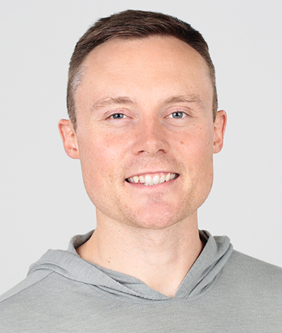

# About Dr. Benjamin Hardy 关于本杰明·哈代博士

Dr. Benjamin Hardy is an organizational psychologist and is the world’s leading expert on the psychology of entrepreneurial leadership and exponential growth. His PhD research focused on entrepreneurial courage and transformational leadership. Before completing his PhD, he wrote for Medium where his blogs were read by over 100 million people, published his first major book, *Willpower Doesn’t Work*, and ran a seven-figure online training business. Since finishing his PhD in 2019, Dr. Hardy has published five additional books, including three co-authored with the legendary entrepreneurial coach, Dan Sullivan. His books have sold hundreds of thousands of copies and he is a sought-after teacher and speaker at corporate and entrepreneurial events as well as Fortune 500 companies. He and his wife, Lauren, are the parents of six children and live in Orlando, Florida. 博士。Benjamin 哈代是一位组织心理学家，也是世界领先的企业家领导力和指数增长心理学专家。他的博士研究重点是创业勇气和变革型领导。在完成博士学位之前，他为 Medium 写了一篇文章，他的博客被超过 1 亿人阅读，出版了他的第一本重要著作《意志力不起作用》，并经营着一家七位数的在线培训公司。自 2019 年完成博士学位以来，博士哈代还出版了五本书，其中三本是与传奇企业家教练丹·沙利文合著的。他的书已售出数十万册，他是企业和创业活动以及财富 500 强公司的抢手教师和演讲者。他和妻子劳伦是六个孩子的父母，住在佛罗里达州奥兰多。

[www.benjaminhardy.com](http://www.benjaminhardy.com)

[www.futureself.com](http://www.futureself.com)