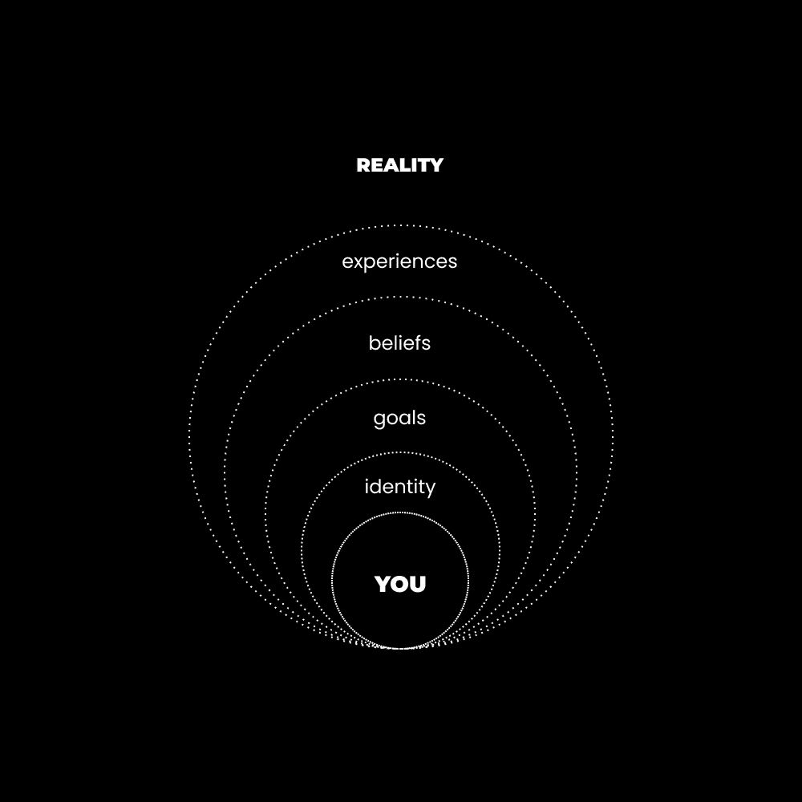

# NPC 的路径（如何不成为平庸之辈）

> 原文：[`thedankoe.com/letters/the-path-of-the-npc-how-to-not-end-up-mediocre/`](https://thedankoe.com/letters/the-path-of-the-npc-how-to-not-end-up-mediocre/)

你从出生以来就在模仿别人。

这就是你在社会中学习如何操作的方式。

这可能导致两条路径：

### 1) NPC 的路径

NPC，或非玩家角色，是一个受其编程奴役的个人。

他们从不质疑自己的信念（你知道，那些强加在他们身上并且他们没有抗争就接受的信念）。

他们从不寻求改变。

去学校、找工作、65 岁退休的默认路径是他们唯一的大目标。

他们从不进入未知领域。

他们的生活变得无聊、机械和动物性。他们从未发现生活中新的潜力。即使他们发现了，也会吓得他们回到舒适的洞穴中。

### 2) 主角的路径

主角是一个对未来有明确愿景、自我生成的目标以实现它，并且他们每天必须采取不可协商的行动的个人。

他们意识到传统的职业路径会导致你在 99%的人口中观察到的相同平庸的生活方式。

他们明白他们必须为自己的生活承担责任。

他们明白他们无权得到任何东西。他们必须无论胜算如何都要创造成功。

**提醒**：正如你所知，独行者冲刺（建立你的一人企业基础）将于 15 日开始。[在此报名](https://sprints.digitaleconomics.school)。

## 你是主观现实中的视角容器

现实是视角，而你是一个视角容器。

NPC 和主角因为他们的视角而以这种方式在现实中移动。

你的视角是通过条件化随着时间的推移形成的。

条件化 = 你用你的心智处理的信息随着时间的推移重复，直到这些思维过程变得自动化。

视角和身份紧密相连。

乔·迪斯彭萨有一句话：

“你的个性创造了你的个人现实。”

你的身份（你对自己的感觉）影响三个主要事情：

+   你的视角或世界观

+   你从那个视角如何看待情况

+   由于两者

NPC 的视角是封闭的，局限于强加在他们身上的社会目标。

NPC 与他们在意识中注册的信念、思想和想法认同。

由于他们的“普通乔”身份，他们会感到被拉去做一些与那个身份相符的事情。

他们将：

+   结交类似的朋友

+   改变他们的外部形象（以适应）

+   消费电影、媒体和信息来强化那个身份

所有这些都使他们的思维局限于某些问题和生活中潜力的可能性。

对于 NPC 来说，问题通常涉及支付账单、在公司的权力阶梯上提升自己的职业生涯，以及为退休存一些钱。

他们消费的大部分信息将是消极的、两极分化的、吸引注意力的，使他们陷入束缚。

对社会来说，最危险的威胁是那些不依赖它的人。

从那个被条件化的观点出发，NPC 将那样解释情况和机会。

当有人向他们展示一个商业机会，比如创立个人品牌时，他们的脑海中会充满父母、学校和新闻机构编程进去的借口和防御机制。

当有人鼓励他们关注自己的健康时，他们会用新闻给他们提供的任何叙事来攻击它，以保护自己。

了解你的心理编程是你的职责。

这就是如何成为你故事中的主角。

你必须意识到并努力改变在一个赞美平庸的社会中你被条件化的身份。

改变你是困难的，没有人能为你做到这一点。

这需要意图和努力。

## 智能模仿过程（成为主角）

为了开始培养成功的心态，你必须：

+   为更高的生活质量设定新的目标

+   沉浸在将条件化新观点的信息中

+   取得进步，并注意它对你生活产生的积极影响。

从最重要的开始：

你的身心、精神和财务。

像健美运动员这样的重视健身的人会做出导致更高生活质量的选择。

这已经融入了身份

他们会吃健康的食物，进行训练，并避免对他们的进步有害的情况。

这同样适用于重视建立业务、传播善良和机智而明智的头脑的人。

他们所做的选择导致更多的能量、更少的财务压力，以及从智力发展中获得更深的满足感。

大多数人都会认为他们应该尝试停止复制、模仿或被信息所条件化。

这是不可能的。

模仿是你学习的方式。

NPC 和主角之间的区别在于后者以明智或有意识的方式模仿。

他们*意识到*自己在模仿什么以及它如何影响自己的生活。

NPC 将模仿群体并走上相同的道路。

主要角色将模仿他们认为成功的人，这与他们想要创造的未来相一致。

### 第一步）创造一个你可以成长的观点。

观点即是现实。

如果你想要创造自己的现实，你必须创造一个新的观点。

你创造的观点将为你提供一个视角，通过这个视角来观察你当前的情况。

通过有意识的练习，“你”会成长到这个观点。

回答这些问题：

+   我的理想一天是什么样的？

+   我想要做什么作为我的人生工作？

+   我想要如何影响人们的生活？

+   我想要看起来和感觉如何？

+   我需要采取哪些价值观和习惯才能让这些变为现实？

从那里，练习在日常生活中以你未来自我的视角行事。

起初这会很困难，但你会开始注意到你可以采取行动的问题和机会。

### 第 2 步）选择 3-5 个你渴望成为的“导师”。

*你成为你所消费的东西，所以消费* *与* *你想成为的人相符*。

通过写下 3-5 个改变你**自己**观点的人的名字来简化这个过程。

你推荐给每个人的最喜欢的书是什么？写下作者的名字。

你无法停止观看的 YouTube 博主、播客或博主是谁？每次他们发布内容时都会“震撼你的心灵”的那个人？

你跟随哪些社交媒体账户，让你想，“他们是怎么说得这么完美的？”

因为……事情就是这样……并不是每个人都这么想。只有你。这些“导师”的组合和**联系**是你创造自己独特领域、观点和内容的方式，这让你与众不同。

再次阅读你最喜欢的书的第一章——我保证你的大脑会亮起来。

### 第 3 步）成为一个疯狂科学家。

好的生活是一系列实验。

你不能从别人那里复制它。你必须尝试、失败，并收集使你个人生活伟大的碎片。

NPC 接受摆在他们面前的东西。

主要角色会积极面对自然界中反映出的试错，这促进了进化和成长。

当你沉浸在导师的信息中并朝着目标努力时，遵循科学过程。

+   **研究**——不要无目的地消费内容。收集它以应用于你的目标。

+   **测试**——不要把建议或信息当作法律。测试它是否适合你的情况。

+   **实验**——不要对一种方法过于教条。尝试不同的饮食、商业模式和宗教意识形态，直到每个真理在中间变得模糊不清。

+   **发现**——注意与你的目标一致的结果模式。

+   **记录**——写下让你取得成果的东西。这是你可以出售或利用的有价值信息。

当你把生活当作一个项目来对待时，它就会变得有利可图。

个人品牌只是你在公众中发现自己并获得对你所做研究的报酬。

### 第 4 步）创造或被创造。

NPC 和主要角色之间的主要区别在于创造。

NPC 是通过多年的无意识条件反射创造的。

主要角色是通过多年的有意识条件反射（他们选择自己的输入）创造的。

没有人能逃避条件反射。

这正发生在你周围。

这封信正在对你进行条件反射。希望是朝着好的方向发展。

现代世界是创造还是被创造。

选择权在你（在每天的每一毫秒）。

享受你的周末。

– 丹

P.S. 独立创业者冲刺活动将于 5 月 15 日开始。

如果你希望用我的品牌和高效的内容系统来构建你的一人企业基础，[请在此处查看](https://sprints.digitaleconomics.school)。

数字经济的价格也将从那天起翻倍。你可以在同一页面上找到它。
