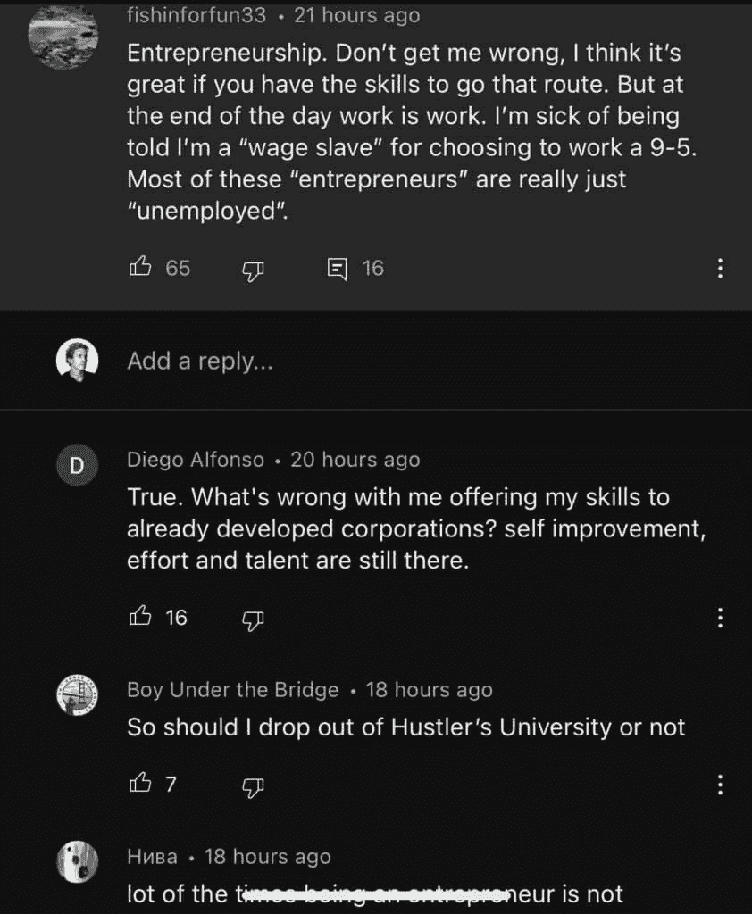

# 自我提升者正在在线创造自己的职业生涯（这是如何做到的）

> 原文：[`thedankoe.com/letters/self-improvers-are-creating-their-own-career-heres-how/`](https://thedankoe.com/letters/self-improvers-are-creating-their-own-career-heres-how/)

醒来。

睡过头 4 次。

盯着你的手机。

从床上滚下来。

做咖啡。

坐在交通中。

8 小时令人不满的工作。

再次坐在交通中。

和你的“重要”另一半争吵。

散步遛宠物。

看电视。

睡着。

重复。

这应该让你感到害怕。

这就是 95%的人的状态。

即使那些每天都在努力逃离的人也无法做到。

我尽我所能避免朝九晚五的生活。

我从 18 岁到 22 岁都在创业，一分钱都没赚。（但这是度过时间的极好方式）。

当我找到一份工作时，上面的列表就是我的生活状态。

我无法控制我每天 10 小时的结构。

无论我是否愿意，所有的事情都围绕着我的工作。

在我过去 3-4 年的创作者生涯中，我意识到一些事情：

+   创业是唯一适合长期逻辑思考者的路径。

+   人类从时间开始就一直在消除劳动工作（我们正站在完全消除的边缘）

+   创作者经济是新的经济形态。如果你没有个人品牌，你就会失去一切。就像那部《黑镜》剧集“鼻涕虫”，但却是好事。

+   明智的人会因为做自己喜欢的事情而得到报酬（向艾伦·瓦茨致敬，因为他领先时代）。

未来属于自我提升者。

那个对自己的未来负责，并成为周围人价值源泉的人。

当在公共场合做这些时，几乎不可能不得到报酬。

这就是我们今天要讨论的内容。

## “创业被高估了”

我那天在 YouTube 上刷视频时，一条帖子引起了我的注意。

它问道：“有哪些事情每个人都喜欢，但你认为被高估了？”

有关于旅行的评论，

但这一条引起了我的注意：

 

我不会撒谎，一开始这让我很恼火。

人们怎么能不明白创业是掌控自己生活的唯一途径呢？

而完全的控制是唯一通往可持续享受的途径？

但找到适合你的“完美”工作越来越困难，这种工作能让你持续利用所有使生活美好的内在驱动力（好奇心、激情、目标、自主性和精通）。

几件事情让我印象深刻：

**人们讨厌他们不理解的事物**。

他们只看到了创业者生活的 5%，就假设这已经足够得出结论并关闭他们的思维。好奇心在这一刻消失了。

他们认为创业被高估了，因为他们不是创业者。

**“我厌倦了** **被称为** **工资奴隶。”**

对不起，但你的感受不是现实。

如果你被解雇了，无法支付账单，你被迫为了生存而工作。你没有选择。无论你是否喜欢被称为那样，你本质上都是一个工资奴隶。

不仅如此，大多数人都没有意识到幕后正在发生的剥削。通过留在你的掠夺性朝九晚五工作中，你正在使血汗工厂工人的剥削得以实现，并积极阻止人类进化。（当然，并非所有情况都是如此。想想你为谁工作）。

**“我提供我的技能给已经发展起来的公司有什么问题？”**

没什么。

但为什么让你获得的技能受到重复性和收入上限的职业的影响？

为什么不利用你独特的兴趣，并将这些技能卖给一个发达公司作为一项业务呢？

那么，你不是某个生产效率指标的奴隶，创造你自己的系统，接受更多客户，以更少的工作量赚取 5 倍于工作的收入。

所有这些，一如既往地，都回到了由社会条件塑造的狭隘视角。

或者，他们对创业有一个狭隘的看法。

**“你付给一个人 50 美元来逃离矩阵，这不是这样工作的。”**

我不在乎泰特或他的产品，但 50 美元的时间检验过的可销售技能比 40,000 美元过时的学位去“矩阵”中接受培训要好。

**企业家不会回到朝九晚五的工作。**

我从未听说过有人放弃成功的创业项目去回到朝九晚五的工作。但我经常听到朝九晚五的人为了更好的生活而离开他们的职业生涯。

**“你总是很忙。”**

不，你不是。

创业的全部意义在于减少你工作的量，并优先考虑生活中的美好事物。如果你整天都在工作，那并不是因为你是一个企业家，而是因为你缺乏自我管理技能。

我每天工作 4 小时（大多数时候）并在那里切断自己。因为我知道我的工作质量提高了。

**创业心理学。**

我们的前辈在他们部落中是企业家。

你的心理也没有被设计成停滞不前。

你可以做自己想做的事情，但我相信任何人的最终目标都是创业。

为什么？因为你的心理需要进化以满足需求。它需要不断增长的挑战，而实际上并没有“赢得游戏”。

在企业权力阶梯上，你不可避免地会到达一个挑战不再存在的点。你变得顺从、舒适，并习惯了平庸的生活（而你可能会*认为*这就是它应有的样子）。

在未知和创业中的深刻和有意义的谎言是你潜入海洋深处的潜艇。

**工作占据了你生活的约 25%。**

如果你不去创造一个职业，你将被分配一个。

如果你对你所做的工作没有热情，那么你生命中的 25%就没有热情。大多数人对于他们生命中的其他 75%也没有热情。

我们的职业生涯、目标或使命是我们如何以有影响力的方式与现实相结合。它使我们避免疯狂。

坦白说，我们不可能将整个生命都投入到呼吸、身体或自然的冥想实践中。我们必须保持平衡，但我们的注意力必须与现实相结合，以防止心态混乱。

朝九晚五是一块垫脚石。

我对朝九晚五没有异议，但它是一种手段，而不是目的。

利用你的工作来获得技能、知识和地位，这样你才能创造你想要的东西。

## 劳动的消解

> 如果真的发生，真正的 AI 奇点不会像科幻故事中那样突然出现末日场景。真正的发生方式——这可能是不可避免的——是作为人类劳动的逐渐侵蚀[pic.twitter.com/gHXoKjZjfk](https://t.co/gHXoKjZjfk)
> 
> — 零 HP 洛夫克拉夫特 🦅🐍 (@0x49fa98) [2023 年 4 月 3 日](https://twitter.com/0x49fa98/status/1643016730187386880?ref_src=twsrc%5Etfw)

亚里士多德谴责体力劳动对身体和灵魂有害。

古希腊人认为工作是生活中必要的部分。但仅仅作为一种手段，为了休闲、创造力和沉思，他们认为这是幸福的钥匙。

没有工作，休闲就失去了意义，反之亦然。

生活开始失去平衡和对比。

体力劳动并不总是坏事。但为了生存或地位而完成无意义的任务，使你与机器人或动物没有区别。

必须有一种掌握感来支撑我们创造有意义工作的努力。

你的目的是你接受的痛苦的来源。

首先，奴隶被分配了大部分体力劳动。

然后，像拖拉机、风车和自助结账这样的工具进一步减轻了负担。

现在，大多数员工都被困在他们的格子间里，执行与他们本性相悖的重复性任务。

我的信念是人类已经进化到不需要人类做“脏活”的程度。

自动化和人工智能在近年来取得了飞跃性的发展。

关于这一点，已经有许多末日预言，但我只看到从中来的好处。

劳动力工作的下降需要创造性工作和知识工作的上升。

从麦肯纳的话中：“思想只能走语言铺就的道路。”

如果我们要扩大可能性的极限，我们必须创造渗透文化并影响语言的知识、思想和信仰。这样，集体思想才能扩展，指数级进步才能实现。

在我看来，工作的未来属于创造性的人。

写作者。

演讲者。

设计师。

创作者。

我们认为人工智能会“取代”的每一个人。

相反，人工智能将作为一种工具，让创造性的人能够突破界限。

要做好这一点，工作是必要的，但休息和娱乐由于大脑的默认模式网络而更为重要：

> “默认模式网络（DMN）是一系列相互连接的部分，当人们停止专注于外部任务时就会激活，并从外向型认知转变为内向型认知。”

简而言之，当你不专注于工作时，大脑会更加活跃。

当我们作为人类，既重视工作又重视休息（不是红酒和泡泡浴类型的休息，而是健身房和散步类型的休息），我们为新颖的想法做好准备。

通过互联网的力量，集体知识增加，我们的思维能力也随之发展。

为了实际操作：

你现在有机会追求有意义的工作，这些工作可以唤醒现代社会长期忽视的大脑部分。

人类可以用激情探索现实，提高他们的技能组合，并实现自我实现。

工作的未来属于自给自足、自我教育和那些追求自动化和 AI 带来的创造机会的人。

未来是关于平衡，而不是过度工作。

未来是关于成为人类，而不是机器人。

[数字文艺复兴](https://thedankoe.com/become-a-digital-renaissance-man-and-join-the-new-rich/)已经到来。

## 创作者经济是新的经济。

我已经谈论这个话题有一段时间了，但[Matt Mic](https://twitter.com/themattmic)写了一个令人难以置信的帖子，为我的理论带来了全新的视角。

我的理论是[工作与教育的未来](https://thedankoe.com/the-future-of-the-creator-economy-my-bold-prediction/)将是每个人都会拥有自己的创作者业务（或为创作者工作），这些业务将作为公立学校。

我将总结 Matt 的帖子中的要点，并加上我自己的评论和结构，[但你可以在这里阅读它。](https://twitter.com/themattmic/status/1643236796522700801)

首先，我们需要退后一步，意识到社交媒体有多么重要。

它确实可能是有毒的，但这是个人选择消费该内容的结果。社交媒体是我生活（以及大多数创作者的生活）中一个难以置信的补充（它很少有毒）。

人类是社会性生物。社交媒体通过媒体消除了社会化的障碍。

媒体是我们学习的方式。

媒体是我们获取新信息的方式。

媒体是我们传达我们业务价值的方式。

媒体占据了我们的生活的大部分。它创造了一种社会结构，人们依赖它来维持文明像现在这样运作。

P.S. 我使用 Notion 模板和系统教授所有这些，在[数字经济学](https://digitaleconomics.school)。这是一门关于未来创作者品牌、内容、产品创造和推广的硕士课程。

### 社交媒体的三层结构

平台构成了数字媒体的第一层。

苹果和谷歌创造了我们手中的大多数技术，以及我们在办公室中的技术。他们为社交媒体奠定了基础。

第二层是像 Facebook、Instagram、YouTube 和 Twitter 这样的应用程序。

这些应用捕获了与平台层相同的价值，因为它们拥有数十亿每月活跃用户和数万亿美元的价值。

在过去的十年里，一个新出现的第三层已经出现：

创作者。

就像应用本身一样，像 Rogan 这样的大型创作者将在下一个十年中获得数十亿粉丝，并产生数万亿美元。

创作者通过捕获大众关注、形成社区、分发媒体和产生收入，正在“原子化”社交网络所做的事情。

### 人类的需求

随着自动化和人工智能的指数级增长，人们从人类那里获取媒体内容是合情合理的。

个人品牌。

根据他们的兴趣进行教育、娱乐和激励的人。

除非我们重写集体心理（在过去的几百年里变化不大），否则这是不可避免的。人们会被人们吸引，而不是机器人。

虽然机器人在减少劳动力和提高人类创造力方面有其位置。

### 我的哲学

商业是自我的一种延伸。

它是你目的的载体。

你的目的会演变，你必须解决你生活中的表面问题，以实现你最深层的目的。

这里的模式是永恒的市场（那里资金流动最多）。

健康、财富和人际关系。

通过互联网获取必要的技能和知识来解决你自己的问题。

以免费内容和付费产品的形式传授你所学的知识。

通过这样做，你不仅创造了一个独立的收入来源，而且获得了巨大的社会影响力。

我已经广泛地写了关于这个话题，但获取信息的最佳组织化方式是从我 YouTube 上的[一人企业系列](https://youtube.com/playlist?list=PLB4ePXk6nBaeG3fD13NaRMsRsEc2iCsV4)中获取。

## 创作者盈利方法

一旦你已经[建立了一个受众](https://2hourwriter.com)，或者即使你没有，也有许多方式可以盈利，但我会按优先级在这里列出。

### 1) 自由职业、辅导或家教

要从一开始就盈利，你需要一个服务。

当你没有足够的流量来赚取收入时，建立数字产品、会员或软件是不可持续的。

当你为 500-1000 美元创建一个最小可行产品时，你可以使用直接接触策略来销售你的产品。

一旦你取得了一些成果并提高了价格，你每月只需要 2-3 个客户就能赚取超过美国平均工资的收入。

你不需要一个庞大的受众和每月 500 个产品销售来产生收入。

你创造了什么服务？我在这里写了关于创建[最小可行产品](https://thedankoe.com/the-best-online-business-model-to-make-1-million-in-2023/)的文章。

简而言之，提升自己，并创建你在旅途中想要的东西。

从你购买的产品中汲取灵感，以实现你的自我实现。

然后，帮助他人做同样的事情。

### 2) 小组与课程

一旦你有一个小型的受众和客户成果，你可以将这些成果转化为一种小组式课程。

这样，你仍然可以：

+   收取更高的价格

+   保持可持续的收入

+   不需要大量的客户

基于群体的课程是一个有固定时间框架的常规课程，包括有帮助的团体电话会议和社区来解答问题。

然后，当时机成熟并且你拥有更大的受众时，你可以将其转变为一个完整的自学课程。

### 3) 建立你想要的一切

现在你有了分销和杠杆，你可以真正地销售任何你想要的东西。

+   想要开始一个服装品牌？请随意。

+   想要销售一个像补充品线这样的实体产品？那就这么做吧。

+   想要放弃一切并建立一个实体健身房或咖啡店？那就去做吧。

你有资源让任何商业模式都行之有效。

你的声誉很高。你有社会资本。而且你的数字产品每月能带来 50,000 到 200,000 美元的收入。

当然，这是在 3-4 年的时间尺度上。

就这样，你创造了你自己的职业生涯。

通过在数字市场上学习、创造和销售，你消除了曾经存在于物理世界中的障碍。

未来是光明的，任何想要利用这个机会的人都有能力做到。

商业中的永恒市场是：

+   健康

+   财富

+   人际关系

+   幸福

这些都是人们将面临直到世界尽头的问题。

解决你自己的问题。

记录解决方案。

分享给他人。

获得报酬。

– 丹·科
