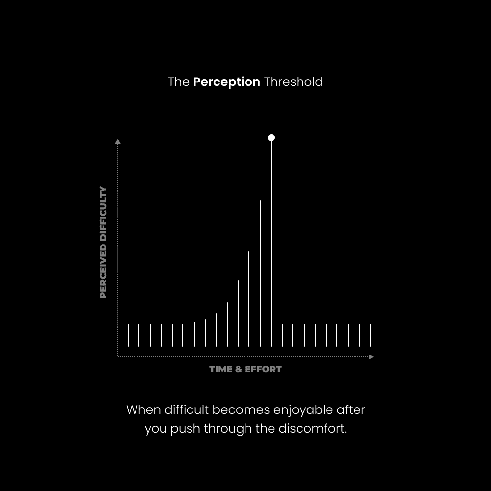

# 生活艰难，习惯它（心灵掌控之道）

> [`thedankoe.com/letters/life-is-hard-get-used-to-it-the-way-to-mental-mastery/`](https://thedankoe.com/letters/life-is-hard-get-used-to-it-the-way-to-mental-mastery/)

*舒适是一种不持久的心态，人类喜欢称之为家园*。

有趣的是，我们越是将自己困在这个我们拒绝离开的心理之屋中，就越不舒服。

唯一通往真正舒适的道路是通过*达到一个对生活呈现的不可避免的不适感到舒适的心态**。

**问题是这样的：**

当人们面对不适时，他们的自动反应是逃避，而不是战斗。

我们可能不会逃离物理情况，但我们试图奔向过去经历的心理舒适。

这造成了紧张，除非这种紧张得到解决，否则它会比应有的时间更长地存在。

*这个问题的结果是分心，感觉“迷失”，陷入困境*。

我们不知道接下来该追求什么，因为我们缺乏不适随着时间的推移所提供的清晰度。

当我们处于这种“迷失”或混乱的心态中时，我们无法超越最初的问题。

为什么？因为它正迫不及待地想要被解决。

心灵决定了我们如何与现实互动。

心灵居住着视角之屋，感知之屋，行为之屋。

从上到下，大多数人持有狭隘的视角，这导致了对情况的负面看法，并决定了他们的无意识行为。

目标是以优雅和艺术的方式度过生活。

也就是说，无论心灵如何想要解释情况的困难，都要与当下合一。

当你：

+   以开放的心态对待生活，拓宽你的视角

+   获得接受现状的力量

+   享受进步带来的喜悦

你意识到你被卖了一个谎言。

传统道路不是通往美好生活的道路。

要做到这一点，你需要理解一些事情。

## 三种视角

期望与现实之间的空间创造了紧张，这导致了痛苦。

我热爱哲学，但很快意识到理论必须与实践相结合。

知识必须以多种方式与现实接触，以确定其有效性。

一个哲学家可以整天进行思辨，但他们能经营一个企业吗？

当他们失去 10 万美元时，他们会如何反应？

当你[开始写作内容](https://2hourwriter.com)，获得一个粉丝，但失去五个更多？

他们能创造、保持并培养一段关系吗？

或者他们只是在猜测如何创造一个好的，并将其推广为“最佳路径”给那些向他们学习的人？

当他们的狗死了呢？他们的父母呢？

行动必须与言语一致。

一个体重超重的健康专家是一个难以信任的人的明显例子，但任何人都可以躲在匿名的在线档案后面。

最好的哲学是建立在现实基础上的，并且是个人化的。

我想提供 3 个观点来帮助你意识到减少期望与现实、概念与经验、以及什么是和什么不是之间的差距的重要性。

### 期望 VS 现实

期望是信念，我们的信念往往是无意识的，并且在我们生活中被条件化进我们的头脑中。

期望是对未来的投射。

这是假设“应该”或“将会”发生某事。

西方孩子经常被告知他们“应该”成为一名医生、工程师或其他高薪职位。

孩子们被告知他们“将会”在星期天去教堂，他们相信了。

期望使你的思维局限于一个可预测的未来，并阻止我们打开心扉去接受可能的未来。

从这种狭隘的心态出发，我们的视角是有限的。

由于我们的视角是有限的，我们对形势的认识也是有限的。

由于认识不准确，我们常常做出不利于我们理想未来的选择。

选择很重要，它们是一砖一瓦地构建你的未来的。

让我们以炎热的天气和桑拿为例来看一下。

当人们想到在炎热的天气外出时，他们会抱怨，因为他们的期望使他们的思维局限于一个负面结果。

当人们想到去桑拿时，这是有意的。通常与一个有意义的结果相一致。

情况的现实是相同的，但期望不同，这导致了前一种情况中的痛苦。

在一个更实际的情况下，让我们看看一个责任重大的人想要创业的情况。

+   他们看到那些责任较轻的人，在 6-12 个月内就展现出了他们的商业成功。

+   他们没有考虑到他们的具体情况，就持有那种期望。

+   他们思考为什么不能做同样的事情，以及生活是如何不公平的（因为他们有工作、孩子和配偶）。

他们未能面对现实。

事实上，他们在责任较轻的时候没有抓住机会去创业，这是可以的。事情无法改变，你越早接受现实，就越早能够开始进步。

因为一旦他们接受现实，他们就可以从一个新的角度，一个更可持续的角度去接近那个目标。

他们可以寻找一致的导师、教育和策略，这将导致同样的成功，但时间跨度更长。

另一个选择是成为你期望的奴隶，永远达不到那个目标，知道这是可能的，但抱怨自己无法实现同样的成就。

### 概念 VS 经验

概念只能从经验中创造出来。

这种误解的典型例子是上帝、宇宙，或者你想要称之为的更高力量。

宗教人士附着于上帝的概念，但未能意识到它是一种经验。这个概念只是那种经验的象征性表示。

差别在于知道和理解。

概念使你能够知道，体验使你能够理解。

知识是现实之上的一个层面，理解是人类意识的一个内在方面。

也就是说，你可以打扫房间，你可以打扫得很好，即使你不想打扫。

概念是必须与现实接触才能体验的指南。

现实是体验，如果你在关注的话，那就是全部。

人们喜欢概念化，因为他们可以在不前进到世界中去解决（内部和外部）问题的情况下进行概念化，这些问题会导致更不肤浅和反应性情绪体验。

### 什么是 VS 什么不是

“就是这样”是你一生中会听到的最深刻的陈述，但很少有人意识到它的深度。

在“是什么”和“不是什么”之间做出区分是缩小期望与现实、概念与经验之间差距的绝佳方式。

现在的瞬间，就在你面前的是什么。

你手中的哑铃的难度是现实。期望它应该很容易并不是。

为自己建立声誉的斗争是经验。你心中对充实生活的概念并不是。

如果你想要开始这段通向长期成功的旅程，请报名参加[数字经济学大师班](https://digitaleconomics.school)。

现在，我并不是说期望、概念和“不是什么”是坏的。

主要问题是消极的期望，那些“知道”并阻止你采取行动的概念，以及无法与“是什么”合一的能力。

### 重点

在所有这些视角中，重点是：

当生活困难、压倒性或你对未来的绝望感时，期望与现实之间存在不协调。

你头脑中的信念、想法或思想与面前展开的当下时刻不匹配。

因为你给了它们太多的关注，它们就优先于并掩盖了你的感官感知。

一个是外在的建设，另一个是内在的真理。

随意将“打扫房间”替换成任何给定活动。

## 思维水平

> 没有任何问题可以从创造它的同一意识水平上得到解决。 —— 阿尔伯特·爱因斯坦

问题被编码在系统中，很少有人能看清它们究竟是什么。

问题引发了期望与现实之间的差距，只有当你能缩小这个差距时，那个问题才变得容易解决。

但是，为了解决那个问题并缩小那个差距，你必须达到一个新的思维水平。

我们将“思维”定义为你如何与现实互动。

在这种意义上，思维是视角。

将视角想象成一个包含所有期望、信念、想法、技能、经验、潜能等的领域。

这个视角越宽广，你的思维水平就越高，就越难抓住一个期望、信念、技能等。

随着你解决每一个问题，生活的感知难度会降低，你的心灵层次会提升。

你面临的问题的程度是你当前个人发展阶段的最佳指标。

你能解决的问题的程度，就是你能为他人解决的问题的程度。

意味着，通过承担不断增长的挑战水平来发展自己，你将获得更多的经验。

你面临的挑战将需要你多次缩小期望与现实之间的差距，每次这样做，你都会得到一个教训。

这种经历可以转移到商业领域，因为产品解决的是问题，所以你的经验越高，你的业务就越有利可图。

必须有一个平衡，因为你不可能在你连每天坚持走 10 公里的习惯都无法维持的情况下尝试攀登珠穆朗玛峰。

## 生活在你的边缘——心灵掌控之道

> 当你开始打开自己，生活在自己的极限边缘时，你最深层的目的将逐渐开始显现。在此期间，你将经历一层又一层的目的，每一层都越来越接近你最深层的完整目的。 —— 大卫·迪达

为了达到新的心灵层次，你必须遇到问题。

你不能坐以待毙，反复做同样的事情，而不考虑个人进化。

你必须生活在技能和挑战的边缘。

在你解决问题时，你提高你的心灵层次。

为了解决问题，你必须提高你的技能水平。

### 1) 追求一个具有挑战性的目标

这几乎是我每一封通讯中的教训。

你需要一个你每天都在为之努力的目标。

一个能引导你走向理想未来的目标，即使你不知道那个未来是什么。

我可以假设这涉及到一个健康的身体、充裕的银行账户和繁荣的人际关系（追求这些目标的结果是内心的平静，而不一定是实现它们）。

这个目标将会实现，你将不得不设定一个新的目标（可能一开始并不明确），以防止自己陷入后续的困境。

### 2) 保持对当下困难的意识

你与“挣扎”、“困难”或“艰难”这些词相关联的判断、含义和词汇是什么？

它们是否导致了对压力未来的强迫性思考？

也许它们导致了对过去错误的回忆……一个导致恐惧到无法行动的程度？

或者可能是两者的混合，让你陷入焦虑的漩涡？

再次强调，这些只是你心中的期望、概念和“不是”。

这些不是现实，现实包括挣扎、困难和艰难。你无法逃避它们。这需要对当下时刻的彻底接受。

### 3) 达到感知阈值的临界点

<picture fetchpriority="high" decoding="async" class="wp-image-1064"></picture>

如果你遇到了写作瓶颈…

如果你已经跑了 5 公里的 30 分钟…

如果你正在进行最后一次 365 磅深蹲...

如果你犹豫不决是否发布你的第一篇内容...

如果你已经冥想 45 分钟，而你的大脑在恳求你去查看通知...

思想和情感会涌入你的脑海，而“唯一的出路就是通过”。

你必须*训练*你的疼痛耐受能力，因为当你坚持足够长的时间以在任何情况下达到“跑步者高潮”时，魔法就会发生。

**感知阈值**是经过一段时间的挣扎后的临界点，*曾经困难的事情由于你对情况感知方式的转变而变得毫不费力*。

*期望融入现实之中*。

*概念融入经验之中*。

*不存在的东西融入存在之中*。

这可能需要 5 分钟，也可能需要 1 小时，对于那些无法立即解决的问题，可能需要数年。

混沌是清晰的前提，而清晰是这个世界上最强大的燃料。

### 4) 达到新的思维层面

跨越感知阈值迫使你放大到一个更高的思维层面，或者超越狭窄状态的更全面视角。

从这个层面来看，你可以准确地感知你之前的问题，并看清它的本质。

[“没有写作想法”成为了一个愚蠢的借口。](https://2hourwriter.com)

不完成最后一次重复 – 那将带来最大的收益 – 变成“我只是有点娇气，坚持下去。”

不发布你的第一篇内容变成，“如果我这么做，它就会变成习惯，我就会一生陷入当前的状况，这与我的愿望相反。”

深深的满足感是结果。

– 丹

**本周发生了什么**

我只有一件事要告诉你。

Modern Mastery 2.0 已启动并正在建设中。

更少的膨胀，更少的混乱，更多的价值，更多的个性化帮助。

在 200 多篇文章和培训中，我们将添加更多课程，成为未来工作的教育平台。

YouTube 课程、设计、编辑、视觉构图、营销、产品构建以及你需要的所有东西。

[如果你感兴趣，读者可以在这里以 5 美元的价格加入。](https://modernmastery.co/letter)
