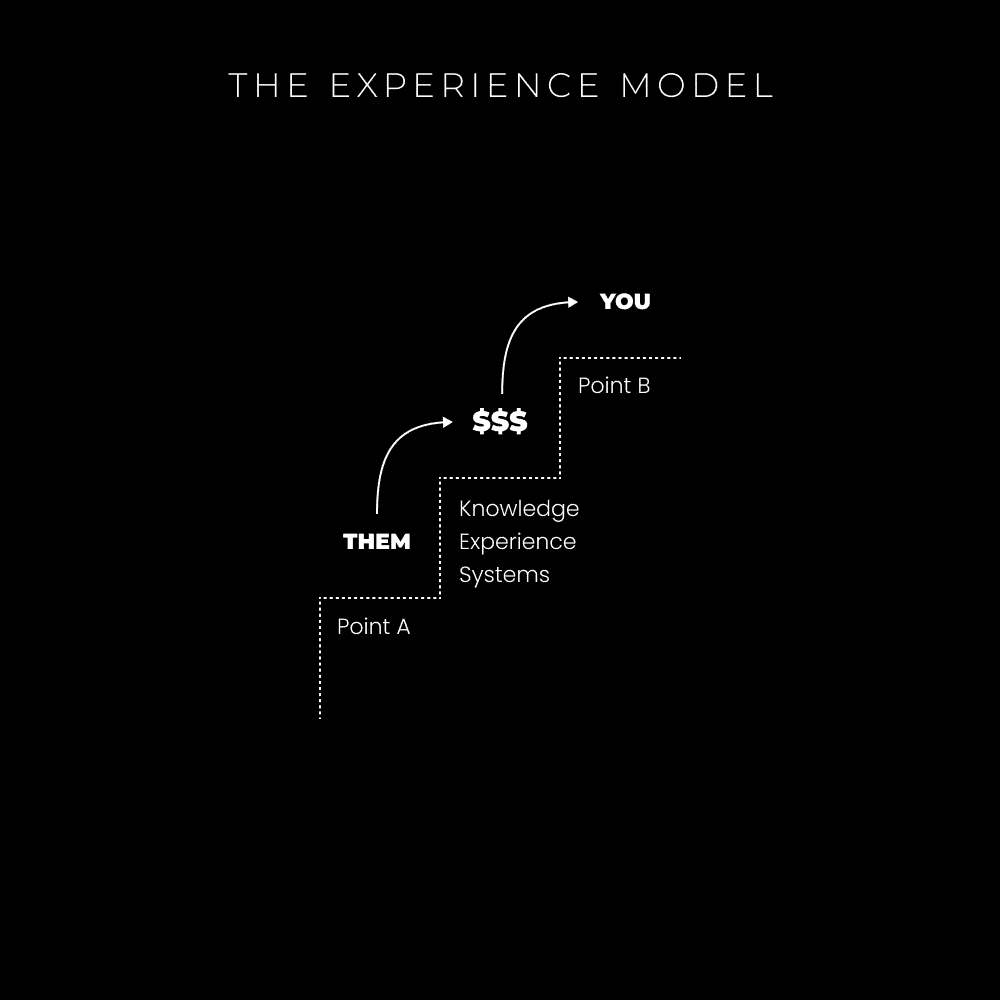

# 2023 年最佳在线商业模式，赚取一百万美元

> [`thedankoe.com/letters/the-best-online-business-model-to-make-1-million-in-2023/`](https://thedankoe.com/letters/the-best-online-business-model-to-make-1-million-in-2023/)

这可能是自我提升领域最受欢迎的话题。

这类帖子总是做得很好：

+   2023 年最佳副业

+   2023 年最佳在线商业模式

+   如何在 2023 年变得富有并停止那么贫穷！！！（请现在点击，否则你将会有 10 年的坏运气！）

我也对最后一个例子感到厌倦。

所有这些视频、帖子文章都缺少一个关键方面：

**在线商业的宏观概述**。

他们专注于技术技能、模型和推广策略，以尽可能快地赚钱。

和往常一样，这没有什么错。

我只是在这里提供新的视角，开阔你的思路。

问题在于**每个人**都想要快速的结果。

**每个人**。

我也做过（现在还在做）。

我在这里告诉你，这可能不会奏效，即使奏效了，在接下来的 3 个月内也不会持续，因为你正在与其他缺乏工作目的的底层竞争者作斗争。

因为他们处于一种生存状态，这使他们甚至无法考虑[他们的**一生之工作**](https://thedankoe.com/the-rise-of-the-value-creator-a-new-career-path/)。

类似于目前正在进行的短形式内容和代笔写作的竞争。

我收到了 100 多条私信和邮件，都是关于同样的沃尔玛质量视频字幕（你只需要学习真正的软件——不是 CapCut——并停止试图走捷径，兄弟们）。

人们不在乎变得更好，他们在乎赚钱。

这是一个残酷的错误。

尽管如此，我也经历了和其他人一样的阶段。

大多数人都这么做。

所以，把这当作你在商业旅程中的意识种子。

如果你正用最新的策略追逐快速的钱，你大约还有 3-6 个月的时间需要转型、放弃，或者优先考虑成为最好的。

## 最佳商业模式是什么？

最佳商业模式是一个真正的商业模式。

不是副业。

不是免费的在线调查。

不要把你的每周零花钱投资到加密货币中。

一个企业必须创造收入。你需要现金流。

无论算法变化和趋势如何，企业都有能力扩展、转型并在市场上定位自己。

将有一半的短形式内容的人会失业，因为他们不懂营销（这里我说的不是表面知识，而是深入的经验）。

**金钱是社会生命的源泉**

就像你的手如果血液停止流动就会死亡一样，你的企业也会死亡，因此你的目标感也会消失。

目标是超越你自身的东西。

如果你没有赚钱，那就意味着你没有用你所能提供的价值为社会做出贡献。

商业是你赚钱的方式，因此它也是你为社会做出贡献的方式，因此它是你生活中一个有效的目标。

业务是你价值的载体，没有更多。

在线调查、规定性的商业模式（如短形式内容机构）和大多数工作都是无灵魂的。

**一个业务有一个提议和流量来源**

这是一个超越商业的普遍原则。

提供的内容=价值

流量=人

你需要将一个有价值的产品或服务放在一群想要购买的人面前。

就像在音乐节外摆一个热狗摊，旁边有一群喝醉的人走过。

或者，在约会中，把自己放在一个你的理想伴侣可能存在的环境中，这样你实际上就有机会找到约会对象。

如果你有一个提议，但没有流量，你为什么还在抱怨没有销售（或约会）？

**动态流量来源**

我不是很喜欢把自己放在一个框子里，我对[创作者经济作为一种生活方式](https://thedankoe.com/the-future-of-the-creator-economy-my-bold-prediction/)持乐观态度。

不论你是否想创业或成为创作者，它都是*新经济*。

因此，个人品牌是“一刀切”流量来源的近似物。

个人品牌是你如何成为细分市场[你](https://thedankoe.com/the-most-profitable-niche-is-you-how-to-create-your-niche/)并消除竞争的方式。

在个人品牌下：

+   你不必依赖广告。

+   你可以谈论任何你想说的话（[如果你在你的内容中穿插与你的提议相关的信息](https://thedankoe.com/dont-get-replaced-by-ai-how-to-write-authentic-content/））

+   你不必长期依赖冷接触。

+   你建立观众群体，这样你就可以做任何你想做的事情。

+   当你停止手动工作时，你的业务不会死亡。

+   你不会被限制在特定的细分市场，就像 Zuby 不仅谈论政治，还制作音乐和销售健身计划（大多数人无法摆脱需要吸引客户的稀缺心态，因此他们的内容感觉有限且无聊）。

此外，你还能遇到志同道合的人，环游世界，并真正享受你的工作。

我刚从去看 Joey Justice 和 Justin Scott 的旅行回来。你不会在日常生活中找到我们之间的对话。

我不想说服你这一点，因为你最终会得出这个结论。

**教训：**

个人品牌应该被视为你提议的基础流量来源。

当人们知道你的名字时，付费广告的权威性会提高。

向你的观众进行冷接触会使他们愿意与你交谈（他们实际上会回应）。

如果你理解内容是关于价值而不是关于特定主题，你可以随时进行转型。

换句话说，你根据想法而不是主题来写内容，并从相关目标或问题的角度阐述这些想法。主题有助于产生想法。

没有人关心这个话题，他们关心的是任何事物如何使他们的生活受益。

## 经验模型

我过去多次讨论过个人品牌策略，所以我就不多说了。

相反，我想更多地关注提案的创建。

大多数人认为他们需要：

+   完美的客户画像

+   完美的系统、课程或辅导结构

+   一个拥有完善供应链管理的精美实物产品

+   前期成果（当你需要真正与某人合作以取得成果时）

事实上，*你需要比那些落后一步的人知道得更多。*

参见：术语“信息时代”和“注意力经济”。知识为王。

这世界上的一切都经过发展阶段。

无论是对地球及其季节变化、社会进步，还是你达到生活中的新水平，这都不重要。

商业也不例外，如果你还没有开始，你不可能在两周内达到 10 级并每年赚 100 万美元。

这似乎是常识，但大多数人都是因为人性、社交媒体标题和集体快速解决问题的思维模式而设定这样的期望。

我们必须从小处着手。

### 最小可行提案

我之前在[《一人企业模式信件》（The One Person Business Model letter）](https://thedankoe.com/the-one-person-business-model-how-to-monetize-yourself/)中简要地谈过这一点，但我想给你一些更详细的内幕信息。

一个最小可行提案围绕一个***单一***技能或兴趣。

收取高额费用需要时间、经验和跨学科技能的获取，同时在实际世界中构建（而不是仅仅阅读关于如何与他们合作的内容）。

用你的单一技能或兴趣，你立即就能将其转化为相关的自由职业、辅导、咨询或家教提案。

当我说“技能”时，我指的是任何类似的东西：

+   邮件营销

+   网页设计

+   营销文案

+   Facebook 广告

+   品牌设计

+   来自[$100 万美元技能栈](https://thedankoe.com/the-1-million-dollar-skill-stack-learn-in-this-order/)的其他任何内容

当我说“兴趣”时，我指的是任何类似的东西：

+   健康和健身

+   性能和生产力

+   个人发展和灵性

+   人际关系或约会

这些都是技能，是的，但我想在这里区分一下，以帮助我们界定我们正在讨论的内容。

**快速打包你的提案**

有了一项技能，这应该是相当明显的。

你可能会销售网站设计、着陆页设计、邮件营销、销售页面文案，或者像个人横幅、个人照片和电子书封面设计这样的品牌设计服务。

从本质上讲，你可以参加一个入门级课程，观看一些 YouTube 视频，并开始销售（记住，你在这里不是试图收取天价费用……*你必须发展你的提案，你不能发展不存在的东西*）。

任何人都可以快速掌握这些技能之一，并开始通过个人品牌吸引客户。

我过去写过很多关于这个的信，但在[现代精通](https://modernmastery.co/letter)中有 10+门课程和 180+策略来帮助你做到这一点。或者我的个人系统[数字经济学](https://digitaleconomics.school)大师班，以产品化自己。

**对于辅导、咨询或辅导服务**

首先，理解这个普遍原则：

+   目标（你的客户想要达到的地方）

+   路径（你独特的引导方式）

+   问题（他们现在正在挣扎的事情）

简而言之，这就是营销的全部。

你正在销售一种*转变*，要么是你自己实现的，要么是你帮助他人实现的，要么是你想开始帮助他人实现的。

**记住**：*自由职业者通过与客户合作来积累经验。他们中的大多数都没有自己的业务来首先自己完成。他们只是学习技能，然后开始向理想客户销售。你不需要有先前的成果就可以开始……因为通过帮助自己**或**帮助他人，你就能获得成果。*

咨询和顾问服务相当明显，你帮助他们处理兴趣，如健身、生产力或他们生活中的其他事情。

对于辅导服务，你将**教授**他们技能，而不是为他们做。想象一下，你就像一对一地引导他们通过课程一样。

+   教他们如何撰写电子邮件通讯

+   教他们如何编辑 YouTube 视频

+   教他们如何撰写社交媒体内容

+   教他们网页设计或图形设计

这是一种替代自由职业的选择。你教他们而不是为他们做。

这对于针对初学者非常有效。更多的人应该提供辅导服务（如果你是初学者或中级，我会提供辅导服务并跳过自由职业带来的痛苦……这也有助于你撰写关于任何你想在内容中向初学者介绍的内容）。

你得到的结果更容易转移到数字产品/课程中。

你之所以这样做，而不是作为初学者开设课程，是因为：

+   你可以收取更高的费用（并在几个客户之后将价格提高到$2,500+）

+   你没有受众（流量）来带来持续的课程销售

+   你还不知道什么能带来结果（即使你认为你知道，你也不知道），这就是为什么你一对一工作并在过程中完善。

+   你可以使用直接外联方法或[不同的策略](https://digitaleconomics.school)来获取客户

简而言之，与十个$100 的销售相比，做出$1000 的销售“更容易”。

你开始意识到你完全控制着自己的收入。

这很解放。

咨询、顾问或辅导服务包括以下几点：

**1) 你将要教授或帮助他们的事情的结构。**

想想他们现在在哪里（点 A）以及你帮助他们实现什么（点 B）。

现在，创建一个软性大纲，列出他们需要学习和做的事情。

这不必变成一个课程，因为你将在电话中引导他们了解所有内容。

大多数教练、顾问等都在销售直接来自他们课程或书籍的教学项目。

是的，完全一样，因为那是他们获得结果的方法。区别在于一对一的帮助和责任感。

**如果你想很好地组织你的教学：**

+   定义 A 点是什么（他们目前的位置和遇到的问题）

+   定义 B 点是什么（你能够帮助他们达到的理想生活状态）

+   前往目的地的路径——一本书的章节或课程中的模块——你可以使用他人的书籍或课程来获取灵感，以确保你不会遗漏任何内容。

+   按照你的想法填写。如果你愿意，可以结合多个兴趣……你不必局限于一个特定的兴趣，与他人相同。想想一本书是如何综合多个教学以得到一个结果的。

**2) 每周通话以回答问题并教给他们需要知道的内容。**

我建议出售一包 4 次通话。每周一次。

你将教给他们确切需要知道的内容，并回答他们可能有的任何问题。

从 4 次通话开始，因为这让你在开始时可以收取更高的费用。

并且，你可能无法在一次通话中就帮助他们达到他们期望的结果（B 点）。

4 次通话让你能够创造一个比“我会与你进行一次咨询通话，帮助你解决你遇到的任何问题”更有吸引力的报价。

你正在推广一种转变。

**3) 每周行动项目与文本访问**

每次通话后，你应该告诉他们确切应该做什么。

你可以为他们创建工作表、任务或项目来完成。

如果你正在销售健康指导，让他们每天早上跟踪他们的食物并称体重。

如果你正在销售设计辅导，让他们创建一个社交媒体设计的第一个版本。

你应该有一种方式在通话之外与他们沟通，比如在 Telegram、WhatsApp 上，或者只是用手机发短信。

**开始时收费 500-1000 美元**

对于单一技能的自由职业服务或 4 次通话套餐（辅导、咨询或教学），你将从 500 美元开始，在最初的几位客户之后增加到 1000 美元，并在完成此课程的过程中继续改进你的报价。

更好的是，我建议免费帮助人们。

如果你是一位创作者，并且正在[与其他创作者建立联系](https://thedankoe.com/how-to-network-with-millionaires-and-build-a-name-for-yourself/)，可以免费提供给他们几次通话。

随着你们双方的成长，他们的推荐信价值将增加。

当我有 100 万粉丝时，我 500 粉丝时的推荐信价值数万美元。人们会购买产品，仅仅是因为他们看到我的名字与它相关联。

*来自创作者的推荐信是宝贵的资产*。

不要只试图捕获大鱼，因为你急需钱。

慢慢来，稳扎稳打。

**你可以选择扩展客户业务或产品化**

当你在扩大你的品牌、获得客户成果并通过技能获取（永不停止学习）来完善你的报价时……你有两个选择。

1.  创建一个更有吸引力的报价并提高你的价格。

1.  将你的课程转变为基于班级的课程，并利用你的受众来推动它（仅适用于辅导、咨询或家教）

我当然推荐第二个选择。

这给你带来更多空闲时间，更少的压力，以及更多的杠杆作用。

利用利用利用。

主要的缺点是，你需要持续扩大你的受众来推动班级。这很困难，但比起陷入 feast or famine 自由职业周期，它绝对值得。

然后，一旦你的班级取得成果和推荐信，你就可以进一步将其产品化为一门自学课程。

现在，你不必做任何工作，可以花你的空闲时间来构建更高回报的项目。

正如我们在上一封信中讨论的那样，你让你的市场变得不那么饱和。

创作者经济不会饱和。

**规模扩大至一百万**

如果：

+   你不会因为一个低薪的报价而停滞不前

+   你继续扩大你的追随者（是的，这是可能的，不要停滞不前，也不要把社交媒体知识不足的责任归咎于算法）

+   你在进化，你的报价在进化，你在增加收入的同时减少了你在工作上花费的时间

我采取的这条路是通过个人品牌、数字产品和无尽迭代来实现的。

我（考虑到一些先前的经验）用了 3 年时间。

希望我的内容能帮助你更快地达到那里。

– 丹
