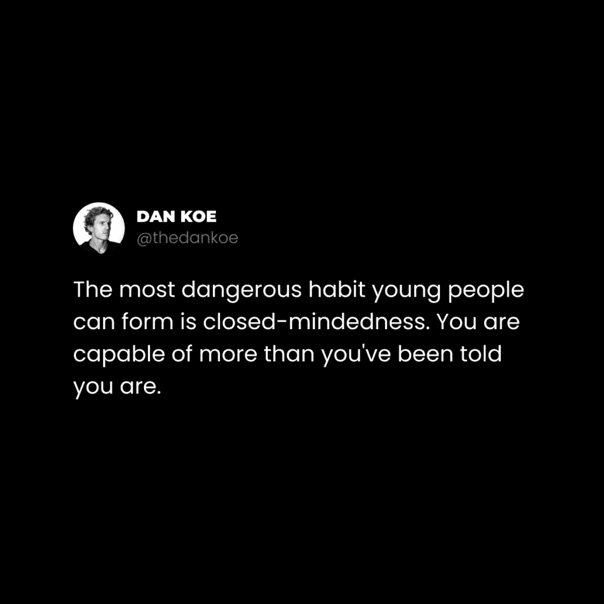

# 分散注意力是 21 世纪最大的陷阱

> 原文：[`thedankoe.com/letters/distraction-is-the-greatest-trap-of-the-21st-century/`](https://thedankoe.com/letters/distraction-is-the-greatest-trap-of-the-21st-century/)

中世纪，也被称为“黑暗时代”，是一个充满战争、无知、饥荒和瘟疫的时代。

那些发生在现代文明之后的事情——文艺复兴时期。这是一个文化、政治和经济复兴的时代，孕育了我们今天所知的许多思想者、艺术家和科学家。

历史总是重复，数字黑暗时代已经在我们中间。

但，地平线上有光明。

数字黑暗时代是一个分散注意力、闭塞性和廉价多巴胺的时代。

我们已经失去了那些给个人带来对未来确定性信念的系统。

此外，如果我们不承担起创造自己目的感的责任，我们就会分散注意力，以维持我们剩下的那点理智。

拥有一个你创造的愿景，能让你对自己的生活有掌控感。这是一个能激发你当前行动的目的。

这个愿景为你呈现了一个目标层级，随着你获得实现这些目标所需技能的挑战性逐渐增加。

这就是如何创造一个无尽的良好多巴胺来源。

一个有意识的个人创造的愿景迫使你集中你的思想。

专注的头脑是享受生活乐趣的源泉。

没有愿景，你不可避免地成为系统的奴隶。[`thedankoe.com/the-focus-formula-how-to-take-control-of-your-life/`](https://thedankoe.com/the-focus-formula-how-to-take-control-of-your-life/)

你会回避思考你的未来，因为它似乎痛苦、无望且不确定。

因此，你会在一些事情中找到慰藉：

**1) 社会机器**

前往学校、找到工作并快乐退休的清晰路径很有吸引力。因此，你放弃了选择和做你想做的事情的自由。

**2) 短暂的愉悦**

深入内心，我们知道我们并没有做出正确的选择。

这很痛苦。

因此，我们用无休止的滚动、情景喜剧狂热和只持续几秒钟就很好吃的食物来麻木我们的思想——因为如果你的未来已经确定，你还需要发挥最高效能吗？

**3) 现代分散注意力**

分散注意力不仅仅是数字化的。

它们是你愿景中所有不与之相符的事物。

如果你没有愿景，你将如何从无意义的事物中筛选出重要的事物？

这些分散注意力的催化剂是你自己。你的身份。

你被告知要学习什么、思考什么和做什么。

你没有质疑它，而是接受它作为事实。

因此，你的思想集中在所有强化那个身份的事物上，并受到任何不认同的事物威胁。

这三个都可以归纳为一件事情，21 世纪最大的陷阱：

闭塞性。

## 闭塞性的迹象

思想狭隘是无法在任何情况下超越你狭隘观点的能力。

如果你只从消极的角度看待那个情况，那就更糟了。

让我们以社交媒体评论区为例。

有多少人会完全错过别人所说内容的要点，为了自己的利益进行解读，并留下一个与原始信息毫不相干的评论？

就像当你阅读一个两极分化的政治帖子，感到被冒犯，并方便地忽略他们的观点，因为它与你的观点不一致时。

你可能没有意识到你的观点不是绝对真理，他们的也不是。而且，如果你寻求理解两者，你将逐步走向一个和平且富有创造性的解决问题的生活。

人们没有意识到这些简单、无意识行为背后的深度。你正在毁灭你的生活。如何？因为你没有创造它。没有有意的行动，唯一的路就是向下。

不仅这是思想狭隘的，而且还容易分心。

人们无法将他们的心灵集中在整体结果上，相反，他们只会挑选他们看到的，开始争论，并最终一无所获。

这又是快速解决问题的思维方式的体现。

你在自己的头脑中“赢得游戏”，获得做这件事的廉价多巴胺，并强化这个坏习惯……做得越多，就越难打破。

宇宙是一首无限的歌曲。Uni-verse. 一首歌曲。

歌曲是故事的象征。故事构成了游戏的结构。

所有理解都是隐喻性的，心灵通过将符号编织成故事来理解世界。

构成你对生活理解的不容忽视的高潮、低谷、推动、拉扯、阴和阳。

其中大部分*无法*用言语表达。

语言是有用的，但极其有限。

正因如此，游戏的结构能够有序地组织我们的思维，并让我们进入心流状态。

从本质上讲，思想狭隘是假设你所认为的故事，而不是它实际的样子。

如果你认为别人的话可以插入你头脑中正在运行的故事，那你将面临一段糟糕的时光。

因此，让我们开始扩展你的思维。

所有这些都不是一夜之间发生的。

这是一个将无意识变为有意识，并在数周、数月和数年内纠正你行为的过程。

让我们回顾一下几个常见的特质，这些特质表明了思想狭隘。

我将留给你在日常生活中的自我意识。

当你开始意识到这一点时，我鼓励你慢慢地用我们在下一节中讨论的策略来纠正你的行为。

意识带来改进。改进带来意识。

### 1) 假设和期望

大多数人都是行走中的分心者。

他们*确实是*分心。他们的身份让他们无法看到真理。

你的现实由你的条件所决定。

也就是说，你的身份承载着你的观点。你的观点承载着你的信念、思想和经验，你将其视为真理。对大多数人来说，这种观点或世界观与你的父母、文化和社会是共享的。

这些是你认为可能性的限制。

如果你只知道学校、工作和退休，你的行为就会随之而来。

你的编程是世界的一个网络，充满了对世界的硬编码假设和期望。

除非你能超越它们，否则你注定要过一种受他人强加的限制的生活。

抛开那个…*你强加给自己的限制*。

### 2) 自私视角

除了当下时刻，每个人都在按照一个特定的目标行事。

这个目标可以是意识到的、潜意识或无意识的。

大多数人都是无意识的，他们以有利于他们生存的方式行事。而且，如果人类在概念层面上生存，他们会以加强他们根深蒂固的信念、假设和期望的方式行事。他们会以证实他们的自我形象的方式行事。

你如何在现实世界中找到这一点？

这并不难。

看任何政治帖子。

有多少人会在评论中争论另一边的错误？有多少人愿意为了他们的信仰而死？

共和党人将捍卫他们的政治立场为最佳，因为他们是共和党人。

每个自由职业者都会捍卫他们的商业模式为最佳，因为他们是自由职业者。

每个基督徒、穆斯林和无神论者都会捍卫他们的信仰体系为最佳，因为他们是那个信仰体系。

人们没有意识到这些人也是人。

他们经历了不同的文化、社会或甚至商业训练过程，这些过程在他们的脑海中根植了信念。

在他们的心理、身体、财务和精神环境中，这些信念为他们最好的*身份*服务。

如果你想要一个更全面的真理版本，你必须能够将你的意识转移到他们的脑海中。你必须证明自己是错的。

一切都是相对的，你必须明白，在某些国家，你的信仰可能会让你被物理杀死。

他们不在乎你认为自己是多么“正确”。

从宇宙的角度来看，每个人都是对的，每个人都是错的。

### **3) 直译解释**

当我说“消失 6 个月来提升自己”时，你是如何理解这个陈述的？

你认为我实际上是在告诉你消失吗？

或者你认为我是在用隐喻来写更有影响力的文章？

无论你是否是基督徒，当你阅读圣经时，你认为诺亚在洪水期间是否带着每种动物的 2 只动物上了一个巨大的方舟？

也许他做了，也许他没有做，这就是重点。

专注。

理解这些文字所指的*本质、教训或真理*。

请，为了所有神圣事物的爱，不要给我发关于我写作中错别字的消息。

同样的故事。

专注。

### 4) 未能抓住重点

这类似于对文字的直译解释。

网络喷子以故意忽略任何给定帖子的重点而闻名。

他们专注于与整体信息无关的一件事。

你不会从一首歌中抽取一段歌词，单独播放，并期望它有意义。

单一宇宙（一首歌）是一样的。

不要因为专注于故事的一部分而错过生活的要点或其多维度方面。

你人生中的低谷是更大图景的一部分。

如果你看不到它，你的思维缺乏秩序，将会吞噬你。

### 5) 视觉回避

我们几乎在每一封信中都讨论了为你的人生制定愿景。

这是故意的。

你的愿景不会瞬间清晰。你需要持续的提醒。这样，你可以反思最近的经验，开始朝着更好的生活方向前进。

问题是，有些人完全避免这种思考。

每个人都知道，他们内心深处都有更大的能力。

但是，实现这种潜力的路径并不清晰，而清晰的反面是混乱。

为了掩盖这种困惑，他们用短暂的快乐来分散自己的注意力。

即时的满足感现在感觉很好，但以后会伤害。

按照你的目标行动现在会受伤，但以后会感觉很好。

打开开关。

## 打开你的心扉——放大视角的艺术

> 清空你的思维。无形无状，像水一样。你把水倒入杯子，它就变成了杯子。 —— 李小龙

每个人都知道那个引用，但有多少人坐下来质疑它，让它充满他们的思维，以获得洞察力？

大多数人只是读一读，认为他们“赢得”了陈词滥调理解游戏，为了快速的多巴胺刺激，就关闭了他们的思维，不再深入思考。

顶峰体验似乎是由两种类型的专注引起的：

1.  专注于你面前的事情，**行动**。

1.  极端开放的专注，什么都抓不住，**存在**。

全有或全无。

理解这些是意识的顶峰**状态**。如果你有世俗的责任，这些状态很难维持，甚至不可能维持。

在这种意义上，当你的注意力集中在与你的未来愿景一致的目标层级上时，这种狭隘的思维方式可能是有用的。你与一项任务“合一”。你的思维中没有想法，因为没有什么可想的。你只是做。

因此，从最极端的意义上来说，开放思维就是超越所有形式、限制和干扰，与宇宙合一，而不是与任务合一。

在这种状态下，你不会抓住想法。你是隐藏在多层自我之下的沉默观察者。

开放思维是分阶段的。

以下是一些例子（不分先后）：

**阶段 1**）你认为宗教是救赎的唯一途径。

**阶段 2**）你认为宗教是心灵控制。

**阶段 3**）你认为从隐喻的角度解释，宗教有深刻的真理。

在商业中，这类似：

**阶段 1**）你认为自由职业是最好的商业模式。

**阶段 2**）你认为大多数商业模式都是骗局。

**阶段 3**）你认为所有商业模式都包含可以用来改进与你兴趣相符的模式的真理。

哦，看看那个，[一门提供我如何做到这一点的视角的课程](https://digitaleconomics.school)。

我们都知道一些已经采取并认同了这些观点的人。

有些人比其他人更开放。

而那些经过过滤的，会导致更少的痛苦和更多的成功。

开放心态的好处是显而易见的：

深度的智慧、提高的创造力、减少的反应性、满足的人际关系、新颖的内容想法，以及像艺术般地处理可能会引起两极分化的领域，如政治等。

那么，让我们深入探讨一些实际步骤来打开你的心扉。

并且，一如既往地，请记住这一点不是立即发生的。在这里，快速改变你的思维方式是违背初衷的。

这是一个**终身**的实践。

意思是，如果你想得到开放心态的结果，它必须成为你身份的一部分。

如果你不能每天都这样做，那你为什么要做？

### 1) 批判性思维 101

在直接经验过滤之前，将所有思想、想法和观点都保持在可能性的领域内。

你不必立即证明某件事是对是错。

你可以让你心中的想法去沉淀，而不必认同任何一方的论点。

### 2) 向更全面的身份努力

你的身份容纳了你的观点。

你的观点容纳了你的信念。

你的信念影响你的思想、情感和行为。

因此，如果我们采取一个超越我们的身份，我们的思维就会相应地开放。

这就是如何发展你的自我。

如果自我为了生存而工作，而我们认同的是人类，那么我们将采取行动来保护人类。

我对此并不 100%确定，但我相信这就是一些人当他们称自己为上帝时所意味着的。我们这里不是在谈论基督教的上帝观念。我们在这里谈论的是 Brahman（梵）、绝对、源头、无限、心灵（不是大脑）或宇宙。

就像这样去想。

如果你在一个运动队，比如“雪鸟队”，那么你会认同自己是一个雪鸟。那个队的精神形成了一个集体自我，为你的比赛提供动力。那种精神也被转移到认同那个队的球迷身上。

这同样适用于认同企业工作、宗教或家庭。

小心，保持清醒，当你的身份影响世界时，及时解决问题。某些认同会关闭或打开你的心扉。

**请注意：我们是在心灵或精神上认同，而不是在物理性或智力上。**

如果你想要认同为某种超限定的东西，比如一个烤面包机或 Apache 攻击直升机，请随意。或者，回到“故意错过要点”的上一节。当然，如果目的是幽默，那是有用的。

如果你就是宇宙，而你确实如此，那么你那些微不足道的人类问题就会失去它们的重量。而且，你可以从更好的角度看到政治、文化和甚至全球的创造与毁灭。

识别为宇宙的意义是什么？

不是为了贵族、地位或任何其他突然出现在你脑海中的自私追求，显然，而是通过提高你的决策能力，使其对你自己有益。

也就是说，超越你的生存。仔细思考从一个表面上的愉悦干扰跳到另一个。

你的生活工作将如何影响世界的思想？

如果你喜欢啤酒，你能开一家啤酒厂并将这种热情转移到你的顾客身上吗？

如果你喜欢哲学，你能开始在线写作并将你的理解传达给他人吗？

从宇宙的角度来看，这是繁殖，或者创造。你通过精神传递痴迷，因为人类已经超越了（并包括）物质。

物质当然很重要，但在我们的生活中，它只是总重要性的一小部分。

这听起来很棒，但我们如何发展自己来实现这一点？

### 3) 收集意识

这需要几十年，我只能从经验中谈谈。

我不是一个全能的大师，来告诉你确切该做什么。

这是我理解的水平以及我正在努力实现的目标。

要收集意识，你需要理解形成优越身份的多个视角。

你需要*转移意识*并寻求理解，而不是评判。

就像捕食者可以将意识转移到猎物上并预测它们的下一步行动。如果它们犯了一个错误？甚至更好，这就是你随着时间的推移理解的方式。

如果动物能这样做，你也能。营销人员、作家和创作者必须经常这样做。

将你的意识转移到你的读者身上，他们是否会喜欢、参与和分享你的内容？或者你需要重写它？

我在[2 小时作家](https://2hourwriter.com)中从更实用的角度教授这一点。

将你的意识转移到挡住你的司机身上，他们是否在赶时间？如果他们的母亲在医院呢？或者他们应该只关心你舒适驾驶的自私需求？

专注于大局，而不是细节。当然，你不可能知道每个人对某个情况的看法。

但是，你可以理解他们的行为，注意模式，并观察结果。我们想要理解*经验*，无论它是否可以用言语表达。

当然，你不能通过寻求理解他们的观点来学会说某人的语言。我们在寻求的是*本质*，而不仅仅是人类的存在。就像“力量”在文化、社会、动物、科学和宇宙中的体现。

当你将健美运动员作为一个身份来研究时，他们对食物的看法与普通人不同。

他们不需要思考拒绝垃圾食品。他们只是因为这样做能带来对他们目标最优的结果而这么做。

一个成功的商人不需要考虑在商业上保持一致性。这只是他们所做的事情。

宇宙不需要考虑一颗星星或一个行星爆炸，因为在宏伟的格局中，其他东西正在形成。

这是我希望你自我思考的事情。

从识别为最高版本的自己开始。这应该与你的愿景相一致。

研究那些已经做了你想做的事情的人。

### 4) 暂停并质疑

一个挑战：

研究任何领域你信念的完全相反之处。

如果你是一名素食主义者，研究食肉动物。

如果你是一名自由职业者，研究创作者。

如果你是一名基督徒，研究无神论者。

通过试图证明自己错误的方式来处理情况。

能够做到这一点的人将把他们的进步提升到顶峰。

这很困难，你将体验到一种自我反应。

你的心灵将与你所暴露的信念进行一场想象中的战斗。

你会感到受到威胁。从信念中战斗或逃跑。人类很有趣。这是你的自我概念为了生存而工作的方式。

当你意识到这种反应时，质疑它。

质疑是你学习的方式。

选择你在商业、宗教甚至健康方面不同意的事情，并解决以下问题。

当更多问题出现时，继续质疑。

+   我能从这种情况中学到什么？

+   他们正在努力实现什么目标？

+   这是否与我的目标一致？如果不一致，这重要吗？

+   他们是从什么背景下说出这些话的？

+   他们所说的*本质或教训*是什么？

+   我能否将他们信念的某个方面融入我的信念中？

随着时间的推移，这些应该会产生一些惊人的洞见。

### 5) 思考宏观，行动微观

你是一个观点的载体。

无论你是否意识到，你的行为都会对世界产生影响。在你的物理生命尺度上，这可能会积累很多。

当你打开心扉，持有更全面的视角时，你的行动也必须相应地改变。

思考大局，忘记琐碎的细节，然后行动。

获取真正知识的*唯一*途径是通过犯错误。

知识是无限的，在相对世界中，没有人会绝对正确，只有相对的。

你的工作是犯错误，纠正它们，并让人类在漫长的岁月里不断进步，而不仅仅是你的短暂一生。

思考更大。

请不要以这封信结束你的旅程。

如果你想要打开你的心扉，你将不得不改变你的思维习惯。

你必须设定一个寻求真理的意图——即使它对你没有好处——并将开放的心态作为你生活中的一种持续实践。

你们每个人最高版本的自己都是开放的。

尝试拓展你的思维，体现那个身份。

让你的行为逐渐反映出这一点。

– 丹·科

**本周发生了什么**

第一个数字经济学冲刺将于二月中旬开始。我们将在 14 天内为你创造一个独特的利基市场，撰写 20 多篇基础内容，并对你品牌的未来有更清晰的了解——你可以通过成为数字经济学的一部分来确保你的位置。

[>> 加入数字经济学](https://digitaleconomics.school)

在《现代精通》中，我发布了一个针对创意人士（如设计师）的客户获取策略，这有助于你在建立观众的同时。

[>> 读者可以以$5 的价格加入](https://modernmastery.co/letter)

上周发布了 2 个 YouTube 视频。一个是关于《4 小时工作日》，另一个是关于如何对你的生活进行重置。

[>> 在这里观看视频](https://youtube.com/c/DanKoeTalks)
