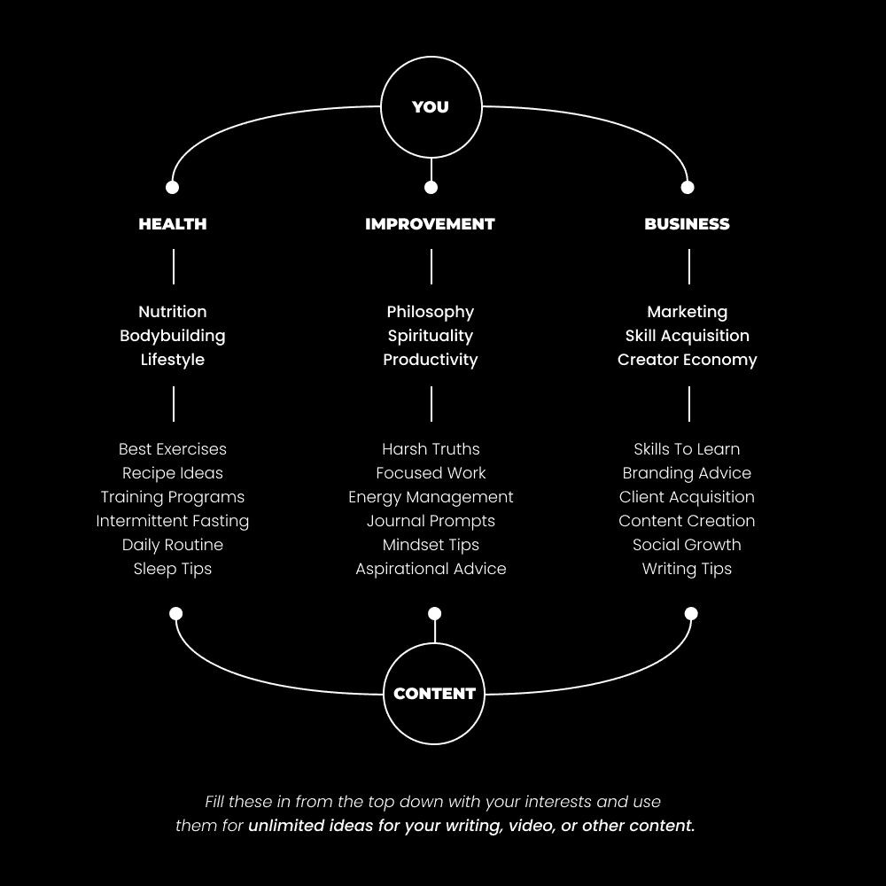
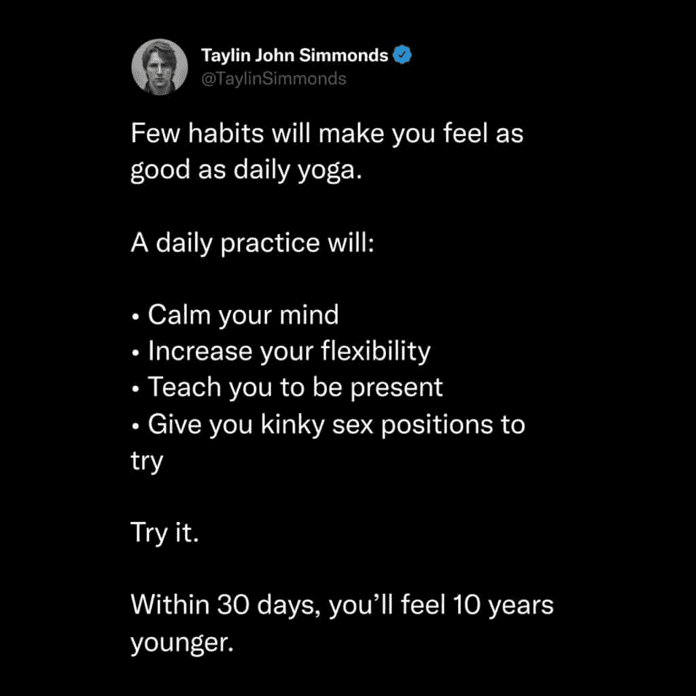

# 如何撰写真实内容（社交媒体增长 101）

> [原文链接](https://thedankoe.com/letters/dont-get-replaced-by-ai-how-to-write-authentic-content/)

*人们想要跟随人类*。

他们不想跟随一个带人脸的搜索引擎。

并且，随着 ChatGPT 的兴起和未来语言 AI 的迭代，真实性比以往任何时候都更重要。

每个人都渴望人与人之间的联系，而社交媒体并没有提供这种联系。

你可以，这将导致比你想象的更大的权威。

根据我的预测，真实性将是未来一代创作者的差异化因素（这就是为什么我谈论哲学、自我意识和其他真正让你在商业中脱颖而出的非商业话题）。

我直接和间接地与超过 5000 名创作者合作过，这是他们一次又一次遇到的问题。

*这似乎是最令人难以承受的问题*。

创作者不知道如何将他们自己融入他们的内容中。

这让人们在没有开始变得好之前就放弃了。

即使你坚持下去，如果你不展示你是谁以及你从哪里来，你与机器人有什么区别？

更糟糕的是，试图融入多个兴趣的人不知道如何以促进增长、权威和参与度的方式进行写作。

在我们深入组织你的主题、撰写内容和将一个想法变成 10 个之前，这里有一些信誉：

我 3 年前开始作为一个创作者。

我在开始的时候推出了一个产品，大多数人都会警告不要这样做。

当我的产品与网页设计相关时，我写了我想要写的一切，比如情绪管理和自我提升。

我在这里穿插了一些关于网页设计的推文（可能每两天一次？），因为我知道这很重要。

对于担心货币化的人来说，最重要的是：

随便谈谈你想要谈论的任何话题，当你计划推广时，就多谈谈那个话题。

这就是那么简单。

嗯，有点。

经验将教会你比我能教给你的更多。

**在我们深入之前：**

第一次独立创业者冲刺活动将于 2 月 7 日开始。

在 14 天内，我们将建立你在特定领域的信心，创建 20 多个基础内容作品，并为你的创作者品牌制定零成本增长策略。

[>> 如果感兴趣，请在此处查看](https://sprints.digitaleconomics.school)

## 你的主题树

如果你不知道写什么，[阅读关于将自己变成特定领域的最后一封信](https://thedankoe.com/the-most-profitable-niche-is-you-how-to-create-your-niche/)

在那封信中，我们概述了你的生活故事，并将其转化为书籍章节。

哪些技能和兴趣将帮助你创造你理想中的未来？

对于那些已经在路上的人，你有什么技能、兴趣和专业知识帮助你实现了你的目标？

理解非盈利兴趣同样可以帮助你实现目标。

如果你的理想未来是和平而不担心金钱…

听起来精神层面是解决所有这些问题的方法，而不是金钱。所以，不要犹豫，包括你热爱谈论的事情。

一个额外的优势是，你对这个兴趣的热情将在你的内容中体现出来。

这些就是我们将要用于我们内容的东西。

### 选择 2-3 个你想要撰写的兴趣或技能

这些应该已经在你的脑海中。

我在这里帮不上太多忙，因为我不是你。

如果你没有想要撰写的兴趣，你需要设定一个目标，开始追求它，并学习什么能帮助你达到那里。

### 扩展与分解

大多数人从超具体的兴趣开始，比如“生物力学运动疗法”，然后因为对此感兴趣的人很少而感到压力。

更进一步，他们再次感到压力，因为他们觉得如果不谈论那个具体的事情，他们的整个货币化潜力就会付诸东流。

不是它的工作原理，朋友。放大视角。

假设我的兴趣是：

+   网页设计

+   举重

+   精神层面

从这些推文中，我希望将它们扩展到它们所在的总体市场。

网页设计 = 在线业务或一般商业。

举重 = 健身或一般健康。

精神层面 = 自我实现或提升。

现在我们有了 3 个我们可以在其中移动的广泛市场，我们想要将它们分解成主题和子主题。

这种方法的美丽之处在于：

如果你想要通过像“生物力学运动疗法”这样的兴趣赚钱，你可以吸引对健康感兴趣的人。

然后，你可以慢慢提高他们对生物运动的意识，并教育他们为什么它很重要。

*你不应该只* *吸引那些对你的主要兴趣了如指掌的人**。他们为什么要从你这里购买？

用这 3 个兴趣，拿一个笔记本，像这样分解它们：

<picture fetchpriority="high" decoding="async" class="wp-image-993"></picture>

你的任务是覆盖这个整个领域，用 6-12 个月的所有长度的内容。

这就是你的品牌认知是如何形成的。

### 记住社会杠杆的 3 个支柱

在我们开始创建内容之前，我们希望平衡我们撰写的风格。

社会杠杆的 3 个支柱是增长、真实性和权威性。

你的内容，在 1-2 个月的时间尺度上，应该触及这些中的每一个。

如果你没有在成长，就转变方向。

如果你没有实现销售，就转变方向。

如果你没有获得忠实的粉丝，就转变方向。

随着你获得更多*现实世界*的反馈，进行迭代。即使内容很糟糕，你也必须发布。

## 如何撰写 3 篇权威内容作品

我们将为这些内容撰写推文。

为什么？因为推文是任何平台上高绩效帖子的完美长度和结构。

我的 LinkedIn 帖子、Instagram 帖子、Reels、TikToks 以及其他所有内容都是基于我的推文。

我们将首先在你赚钱的主要兴趣上建立权威，也就是那个让你赚钱的兴趣。

我们将以“营销”为例。

在以下任何例子中，你都可以：

+   将它们变成论坛或时事通讯以增加权威

+   将列表中的任何一点重新制作成单独的帖子

+   将它们复制粘贴到其他平台

+   将它们用作短视频、 reels 或 TikToks 的脚本

让我们深入探讨。

### 可操作的原则

简单，列出初学者可以采取的可操作步骤。

这有助于你在某个领域建立权威。即使是对高级的人来说，他们也会跟随你，因为他们理解基本原理的重要性。

对于所有这些，请记住，你应该遵循钩子 > 正文 > 结论的结构。

> 你的内容很糟糕，因为你没有：
> 
> – 吸引读者的兴趣
> 
> – 刺激他们的问题
> 
> – 与他们的问题相关
> 
> – 给他们一个有价值的解决方案
> 
> 人类心理学总会战胜你认为会起作用的东西。
> 
> 清晰，而非花哨。

我正在现场写这些，所以它们不会完美，但请和我一起做。

选择你主要感兴趣的一个领域，制作一个吸引人的钩子，提供可操作的价值，并优雅地总结。

练习使完美。

### 话题的重要性

大多数人不在乎你写什么，因为他们不理解其重要性。

所以，不要收拾行李并责怪系统...

教他们为什么它很重要。

*这就是你让你的兴趣对其他人来说有趣的方法。*

让他们意识到它如何影响他们的生活。

> 营销是你能学到的最伟大的技能。
> 
> 为什么？
> 
> – 它与任何其他技能相匹配
> 
> – 它教你人类心理学
> 
> – 它帮助你将一个利基兴趣货币化
> 
> 只有傻瓜才会期望在不学习将滚动浏览者变成顾客的技能的情况下赚钱。

这里有一个很好的例子，我从 Twitter 上的 Taylin Simmonds 那里借鉴过来的：

<picture decoding="async" class="wp-image-994"></picture>

尝试一下。

你的主要话题为什么重要？

它是如何影响你的生活的？

为什么其他人应该关心？

自我反思，并就此写一篇帖子。

### 指出常见错误或问题

在你的话题上建立权威的一个好方法是指出不良建议、常见错误或问题。

这表明你有经验，并且你想要帮助你的读者。

> 停止写过于具体的内容。
> 
> 作为初学者，你应该专注于增长。
> 
> – 使你的写作更具亲和力
> 
> – 关注一个共同的问题
> 
> – 从高层次讨论话题
> 
> 如果只有少数人愿意分享你的内容，不要期望增长。

这引出了我的下一个建议。

## 如何最大限度地发挥你的写作潜力

初创创作者在看到内容创作的整体图景上会有所困难。

你并不是每发一篇帖子都旨在立即销售。

你的帖子不是销售页面（但了解如何写销售页面可以帮助你的帖子）。

当你审视你的写作时，它应该很明显，是否会被社交媒体上滚动浏览的普通人分享。

如果不是这样，你在这个利基领域没有增长策略，你如何期望增长？

分享是自然品牌增长的引擎。

放大视野，意识到随着时间的推移，你的内容将向人们介绍你所能提供的东西。

当时机到来，如果你有这个技能，他们会从你这里购买。

### 扩展你的内容

从我上面写的推文中，它们是否具有权威性？

是的。

它们会吸引潜在客户（假设我在我的内容之外还有更多价值可以找到）吗？

是的。

它们是否如此具体以至于不会被人分享？

不。

这是你在漏斗顶部社交媒体上必须达到的平衡。

然后，当你将他们带到你的通讯、吸引物和产品销售页面时——那就是你需要尽可能具体的地方。

如果你的内容看起来像初学者不会分享，就缩小一层范围并重新写。

### 研究最佳内容结构

在我们开始写除了列表之外的内容之前，我建议你研究一下好的内容是什么样的。

我个人使用[TweetHunter](http://tweethunter.io/?via=thedankoe)（一款软件）和 Twemex（一款 Chrome 插件）来快速查看我喜欢的账号的顶级内容。

你也可以通过输入以下内容使用 Twitter 的高级搜索来完成此操作：

*from:thedankoe min_faves:1000*

将你的 Twitter 搜索栏。

只需将我的用户名换成别人的，并将最小点赞数改为你想要的任何数字。

沉浸在那个内容中，并把它作为你自己的训练轮。

你使用哪些主题来练习？

### 重新利用你的列表式内容

你上面写的列表有多个要点，可以将其转换成独立的内容。

这些列表也可以变成一个帖子、轮播图或通讯的提纲。

（我强烈推荐这样做，以建立更多的权威性）。

现在，让我们专注于写另一篇短文。

从我们上面写的第一条推文开始，第一个要点是“吸引读者的注意力。”

如果我拿我这条有 9,000 个赞的高绩效推文结构：

<picture decoding="async" class="wp-image-992"></picture>

然后，我可以写一条新的推文：

最大的数字技能是捕捉、保持和传递注意力的价值。

这可能更好，但我知道那一个会做得很好。

如果你遵循这些确切步骤，并使用你的所有兴趣，你会发现所有这些内容写作的东西都很简单。

总结：

+   你可以，也应该，将你的兴趣融入其中，使你的品牌更真实。

+   创建一个你可以通过写作在 6-12 个月内掌握的主题树。

+   写多个列表式内容，以在你的主要兴趣领域建立权威

+   如果你认为你的内容不会被分享，就扩展你的写作。

+   研究最佳内容结构，将它们作为训练轮，并从你已经写过的内容中扩展

这就是你开始内容创作所需的一切。

在下一封信中，我们将讨论如何在不花一分钱的情况下分享这些内容。

希望你们喜欢这篇，我的朋友们。

我们很快就会联系。

– DK

**当我准备好时我能如何帮助你**

Solopreneur Sprints 活动将于 2 月 7 日开始。我们将共同创建你的细分市场，撰写 20 多篇内容，并制定增长策略，以便你最终可以全职从事这项工作。

[在此处报名，费用为 150 美元。](https://sprints.digitaleconomics.school)

2 小时作家课程在实用环境中教你高影响力的创意写作。我帮助你构建你的内容生态系统，并在众多创作者中脱颖而出。

[在此处报名 2 小时作家课程。](https://2hourwriter.com)

Modern Mastery 是一个涵盖所有营销、销售、个人发展和绩效的私人社区。立即获得策略库的访问权限，在 Discord 中获得个性化帮助，以及更多。

[读者可以花 5 美元加入。](https://modernmastery.co/letter)
