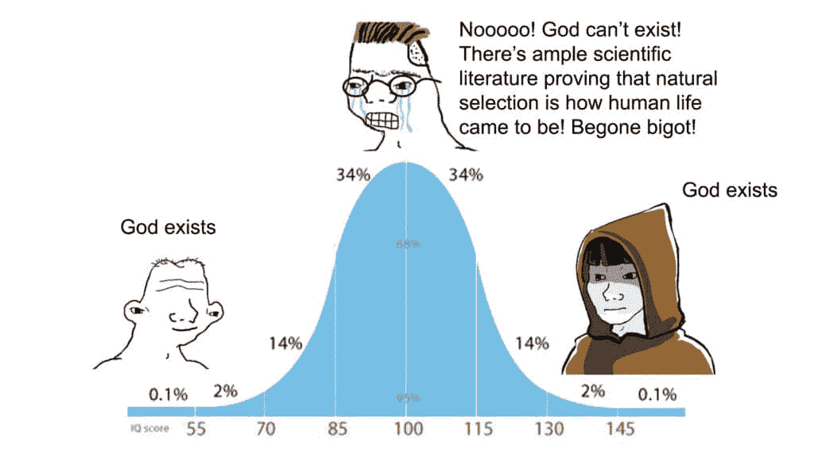

# 一位恢复中的无神论者的信息（如何找到上帝）

> 原文：[`thedankoe.com/letters/a-message-from-a-recovering-atheist-how-to-find-god/`](https://thedankoe.com/letters/a-message-from-a-recovering-atheist-how-to-find-god/)

我已经避免写这封信很长时间了。

我从未感到“准备好”，现在仍然没有，但我知道写下来会帮助我澄清我的想法。

我希望这些想法能对你有所帮助。

宗教就像政治一样，当人们不同意你的观点时，他们会有一种无意识的情绪反应，他们会说出从小就灌输给他们的预先编程的话语。

更糟糕的是，宗教和政治给一个不确定的未来带来了确定性。从心理学的角度来看，这就是为什么人们将他们的自由思考外包给这些意识形态结构；为了整理他们的思想，防止陷入混乱。

当一个人的观点受到威胁时，他们会像被蛇抓住的老鼠一样有生理上的生存反应。

因此，他们像以前一样加强了自己的身份认同，封闭了自己对真理（这是讽刺的），并且永远不会超越发展前的非理性阶段。

我鼓励你在阅读这封信时保持开放的心态，如果你做不到，请取消订阅。我不是要求你接受我的信仰，我是要求你挑战你自己的信仰。

我是一个后圣徒，有些人把这种意识形态称为“摩门教”。

每个星期天，我都会穿上黑色的长裤，一件纯白色的衬衫，以及我最喜欢的父亲给我的领带。

这一切始于主日学校，那里的 12 岁以下的孩子会唱赞美诗，如“我是上帝的孩子”，然后从圣经或摩门经中学习课程。

12 岁时，男孩们成为执事。14 岁时，成为教师。16 岁时，成为牧师。在圣职中承担着越来越大的责任。

我们去寺庙旅行，为死者施洗，并参加“神学院”；在送往公立学校之前，有一个小时的宗教教育。

在教堂里，我有很好的经历，比如童子军和与之相关的为期一周的多季节冒险活动。有一些令人难以置信的人信仰这个体系，但我总是怀疑。

当你质疑它们而不害怕你可能会找到的东西时，这些教义在逻辑、科学或现实方面都没有意义。

在教堂的日子里，我有幸能够使用互联网。

我让我的好奇心带我深入基督教、天主教、穆斯林，甚至无神论等意识形态的兔子洞，以便了解它们究竟是什么。

我和高中朋友们去他们各自的教堂，保持开放的心态，观察和质疑。

我能够注意到模式，但它们仍然缺乏意义。当时，我对每个哲学问题的相同笼统答案并不满意：

“只需有信仰。”

我有一种感觉，如果我一生都持有相同的信仰，那对我不会有好处。

并且在过去的 10 年里观察我的前教会成员（感谢 Facebook），我证明了自己是正确的。

## 自我发展与前理性谬误

按顺序，神论者、无神论者和灵性主义者之间的区别是自我发展。

在这封信的其余部分，将“自我”和“自我”视为同义词。

你不是消除你的自我，而是将其发展到与现实的统一。

你不是通过试图回答“我是谁？”这个不可能的问题来发展你的自我，而是通过问“我不是谁？”这个问题，直到你只剩下纯粹的意识。

在我寻找意义的旅程中，我发现了三个令人难以置信的资源：

+   苏珊·库克·格雷特（Susan Cook Greuter）的《自我发展九阶段》（The 9 Stages Of Ego Development），由 Actualized.Org 总结([link](https://youtu.be/J3hNosyyXRA))

+   肯·威尔伯（Ken Wilber）的人类意识进化 AQAL 模型

+   个人、组织和社会的螺旋动力学进化模型

这些都是映射个人和集体心理发展的模型。

在一封信中提炼出太多内容是不可能的，所以我鼓励你在自己的时间里去探索它们。

但是，肯·威尔伯（Ken Wilber）的一个模型有助于解释精神发展的阶段。

这被称为前理性谬误。

简而言之，想想去年流行的钟形曲线梗：

如果你正在寻找意义、理解和上帝的方向上感到困惑，这个模型可以帮到你。

前理性谬误不仅适用于宗教，也适用于任何领域的发展。

它指出，人们常常将前理性发展阶段误认为是后理性阶段，因为两者都不代表理性阶段。

我们以宗教为例，最容易说明这个概念的方式是信仰上帝。

圣经基督教徒对上帝的概念与神秘主义者对上帝的概念大相径庭。

从外面看，他们看起来像是在说同样的话，因为他们不是无神论者。

他们并不相同，让我们来分析一下原因：

### 前理性阶段

对于这封信，我们将以基督教为例，因为这是我最极端形式的经验。

但是，这可以应用于任何意识形态，无论是宗教还是非宗教。

我看到这些模式在商业中也有所反映。

就像互联网上的某些区域相信“最佳”的外展、内容或品牌策略，而没有改进的余地。

事实上，最发达的个人会采用原则，经历各个阶段，并创造出自己的方法来看到任何领域指向的期望结果。对于商业来说，是金钱；对于宗教来说，是意义；对于健康来说，是健康。

如果你不对自己的信念提出质疑，你就会关闭自己对新发现、创新以及将真正进步带给你的生活和世界的事物。

这个前理性阶段的个人、组织和社会最好被描述为“圣经敲击者”。

这个阶段的灵性非常物质化。

他们认为天堂和地狱是“你”（这是一个概念，自我）被赋予处女或被火烧的实实在在的地方。

任何形式的反馈都被视为威胁。

他们用自从被灌输那个信仰体系以来一直在重复的同样的话进行攻击。

真正的问题是这个阶段的人们关闭了他们通往更高发展阶段的大门。

他们不能以现实本身来观察和解释现实。

注意：我并不旨在将任何宗教意识形态描绘成坏的。通过研究可以找到深刻的真理。问题是人们相信这些真理局限于理解这些真理的一个视角。

### 理性阶段

理性阶段是我所熟悉的。

这是典型的无神论者，他们拒绝任何关于更高力量的观念。

他们依赖科学发现来区分什么是真实的，什么不是。根据这个阶段，如果不能科学证明，就不是真的。

这是虚假怀疑开始占据主导地位的阶段。

无神论者“质疑一切”，正如他们应该做的，但未能质疑他们自己的信仰。相反，他们囤积可以用来反驳上帝存在的辩论信息。

他们可以看到前理性阶段的明显缺陷，但没有打开他们自己的思想去认识自己的缺陷。他们认为他们已经做到了，这就是阻止他们更深入的原因。

这里要理解的一点是，大多数人都会经历这三个发展阶段。

如果你处于理性或前理性阶段，你不会立即跳到下一个阶段。这需要时间和自我发展。

### 超理性阶段

在超理性阶段，对上帝的信仰回归，但不是天空中一个男人的静态形象。

这就是东方哲学、神秘主义以及与精神相关的标签发挥作用的地方。

我不想对这个阶段不公，因为它很难向那些缺乏高级理解能力的人解释（这并不是侮辱，我也不认为这个阶段的人在其他方面“高于”其他人，这无关地位，这不是关于地位）。

相反，我将尝试指向上帝。我鼓励你将这作为一种方式，让你在日常生活中注意到并理解这种更高的力量。

## 如何找到上帝

> 认识自己的人就认识了上帝。 —— 克莱门特·亚历山大

首先，让我们区分一下“概念”和“现实”。

一个概念是我们心中认为静止的现实的一个方面。

它们是有用的，但不是法则。现实如河流般流淌，概念是这条河流的快照。

这引入了佛教的“无常”原则。

也就是说，没有任何东西可以被心灵孤立并保持静止。一个思想、观念、概念、意识形态、人、物品、社区、情感以及我们用心灵处理并期望保持不变的其他任何东西。

例如，我们如何解释我们所看到的东西是由我们当时的角度决定的，而我们的角度又受到我们心态的影响。

自我意识持续着这个问题。它不想改变。

如果我生气，对商业经验很少，我看到一个亿万富翁关于金钱的帖子……你可以猜到结果。

我会在我的脑海中形成一个关于那个亿万富翁的概念（在阅读他们的一篇帖子之后），并用我的信念来巩固这个概念。

“他有个有钱的父母。”

“他运气好，我永远做不到那样。”

“他为什么不把钱捐给慈善机构？他不富有吗？”

即使你没有说出这些话，你的自我意识也会。

自我意识创造了障碍、限制和虚构的故事，这些故事掩盖了现实。它通过填补自我意识试图构建的静态图像的空白，阻止你看到事物的本来面目。

事实上，你对你所认识的人的全部看法都是基于他们生活中贡献的 0.0000000000001%的一篇帖子。

*每个人都渴望自由，这是重要的。*

有些人会说它是更高力量的内在声音。

所有这些自由，当涉及到心灵时，都是通过采取更高视角而消解的障碍。

当你采取更高的视角时，你就可以开始看到事物的本来面目。

这就是所有精神教诲的教训。

### 上帝的模式

Teotl、梵、无限、源头、宇宙等等都是对上帝的不同视角。

在阿兹特克哲学中，Teotl 被定义为，“一个单一的、赋予生命的、永恒的自我生成和自我再生的神圣力量、能量或力量。”

简而言之，这就是“精神”。

佛教中的“梵”被定义为，“所有现象背后的终极实在……梵无形，却是可见现实中所有形式的诞生地。”

无限或源头是那些选择以这种方式理解上帝的人常用的其他常见透镜。

它们都指向同一件事，而这件事不能被捕捉和孤立为一个宗教意识形态。

我的意思是……它可以，并且已经做到了，但随着上个世纪人们逐渐开始开放思想，这些结构受到了质疑，而且有很好的理由。

### 宇宙

我最喜欢的展示这种无形力量的方式是通过宇宙的透镜。

宇宙 = uni-verse = 一首歌。

一首无限的歌曲，有高低起伏、多件乐器的和声、上升动作、高潮、下降动作和合唱。

这种模式反映在人类的意义构建中。

人类通过故事来理解世界，我们变得着迷于游戏，因为它们是具有互动挑战的故事，这些挑战缩小了我们的注意力。

问题是我们试图在没有考虑大局的情况下，独立地理解音符、歌词、乐器或音乐家。

如果你孤立故事的一部分，尤其是负面的一部分，你将会过得不好。除非你退后一步，看到在你眼前展开的故事。

让我们回顾一下雨水的自我生成和自我再生的故事：

想象一下海洋或一大片水域。太阳的热量蒸发水分，将其分成许多微小的水滴。

这些水滴上升并重新统一成云。这些云逐渐变大，并最终统一成更大的云。

很快，云中的水滴会统一，直到它们足够重，可以再次降落到地球。

雨水形成水坑，填满溪流，并在其他生态过程中发挥作用。

最终，随着时间的推移，雨水会回到海洋，这个过程会重复。

这不是一种局部性的分裂与统一现象。

**它是无限的**。

你心中的思想在分裂与重组，我们称之为创造力。

在人类历史上，种族曾经分裂，现在正在重新统一。

从宇宙的角度来看，你对这件事的看法并不重要，我的看法也是如此。

种族的障碍被质疑和对抗，直到人们能够与任何他们愿意的人交配。当然，这并不是这一切背后的驱动力。

在不久的将来，我们所有人的皮肤可能都会变成人类感知的那种浅棕色，种族这个概念将合并成一种。

那么，你的人生篇章呢？你经历了高潮和低谷。你获得了朋友，也失去了朋友。你改变了，即使你的心灵仍然附着于过去的自我形象。

我鼓励你注意这些模式，无论你在哪里都能注意到，即使是在做早餐、写书或上厕所时。

这就是你在日常生活中找到上帝的方式。通过超越表面，欣赏你机械预设行为背后的深度（是的，这些机械行为可能是赞美上帝表面形象，这似乎与目的相悖）。

注意局部、整体以及它们如何在物理地球上共同起舞，并在集体意识中产生涟漪。

### 上帝的实用性

你可能正在问，“这对我的人生有何实际意义？”

一，因为这不是“你的”生活。

这不是关于你自私狭隘的视角。你本应超越这一点，打开你的心扉。

二，这难道不令你着迷吗？你感知到的平凡、“正常”行为背后的深度？

在物质、地位和言语的表面之下，还有更多。

你是更大事物的一部分，这只能通过精神来感知。

通过这样做，它揭示了我们所珍视的概念、信仰和理想并非静止不变的。

当我们认同这些心理构建的实体，并将它们视为不变的，我们将陷入情感上的麻烦，这会阻碍个人和集体的进步。

开放的心态与宇宙同行，而封闭的心态则强迫宇宙随着他们流动。

如果思想狭隘是真正进步的障碍，那么思想开放的人有责任提升他们。

你可以养成最有益的习惯之一就是玩心理积木。

与一个想法、思想或问题坐下来，并跟随呈现出来的联系。

保持对自我中心的干扰保持警惕。

这就是你在没有任何外部工具或指南的情况下练习创造力、正念和深度思考的方法。

在文化、社会和个人存在的层面上，最大的问题是与意识形态的认同。

人类将想法分组为应该是不分割的思想统一体。

我们不留任何分裂和统一的余地。我们不留任何给上帝的空间。

– 丹·科

### 当你准备好时，这是我能如何帮助你

第一次独立创业者冲刺将在 3 天后开始。如果你想建立你一个人的企业的基础，学习撰写 20+基础内容，并了解为了可持续增长确切应该做什么，请查看。

[在此报名 $150。](https://sprints.digitaleconomics.school)

如果你想要学习一种可以自由职业、获得社交媒体工作或为自己建立声誉的防经济衰退技能，学习高影响力说服性写作。

[报名参加 2 小时作家课程。](https://2hourwriter.com)

如果你想要一个志同道合的社区和 200+商业、健康和绩效策略的图书馆，请查看现代精通。

[读者可以以 $5 加入。](https://modernmastery.co/letter)
