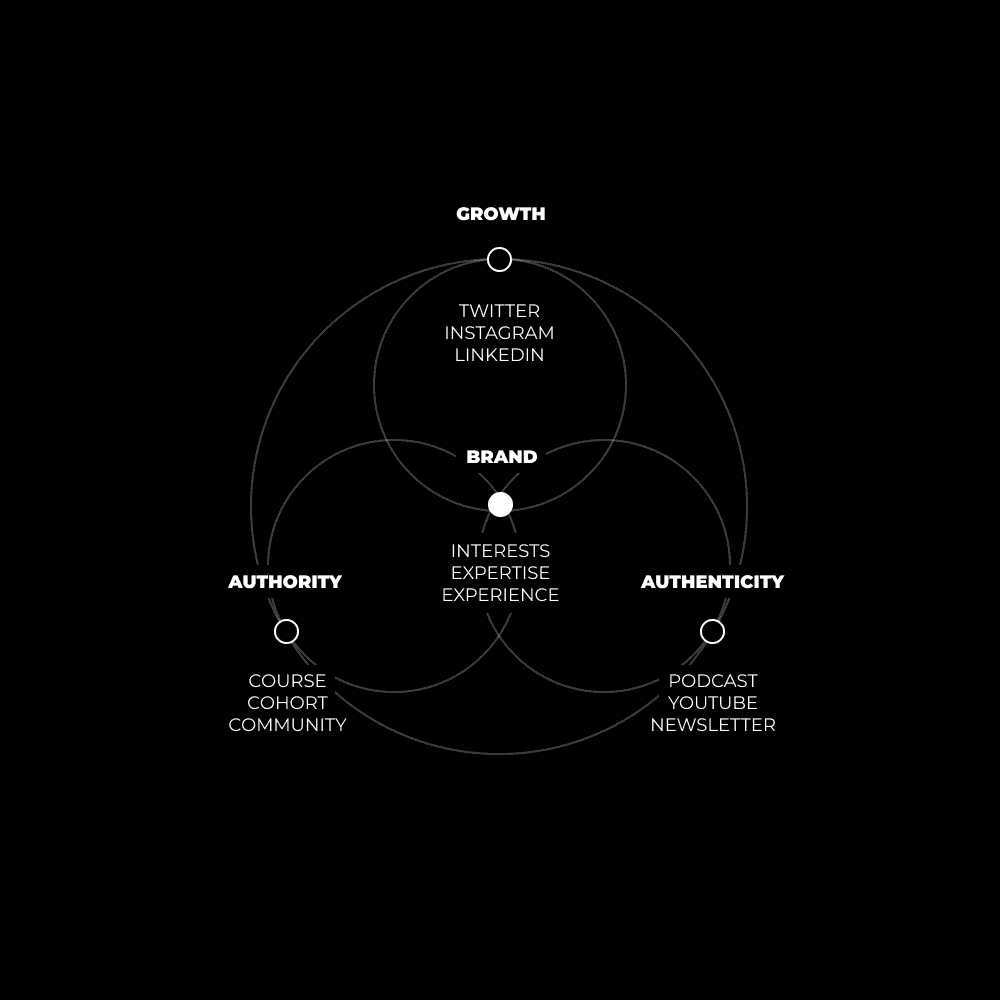
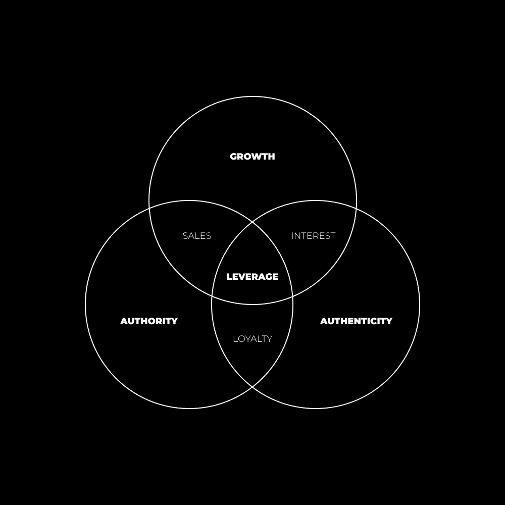

# 一人企业路线图（99%的创作者都会犯这个错误）

> 原文：[`thedankoe.com/letters/the-one-person-business-roadmap-99-of-creators-make-this-mistake/`](https://thedankoe.com/letters/the-one-person-business-roadmap-99-of-creators-make-this-mistake/)

在我们开始之前：这封信是单人企业系列中的一封信。这里还有更多。

[一人企业模式（如何产品化自己）](https://thedankoe.com/the-one-person-business-model-how-to-monetize-yourself/)

[价值创造者的崛起（通才与自我提升者的职业道路）](https://thedankoe.com/the-rise-of-the-value-creator-a-new-career-path/)

[我作为创作者希望知道的 11 个见解](https://thedankoe.com/11-insights-i-wish-i-knew-to-grow-my-one-person-business/)

[你脑中有价值 10 万美元的产品](https://thedankoe.com/you-have-100000-of-knowledge-trapped-in-your-brain/)

最后，所有这些只是一些有趣的帖子。它们是有价值的，是的，但真正的价值在于我精炼的系统，这些系统维持着我这个小小的单人企业，每月能带来±10 万美元的收入。

如果你想有一个包含这些系统的 Notion 仪表板来管理你的业务（包括品牌、内容、产品、营销和推广的全面教育），那么你可能喜欢数字经济学。

[通过在此处报名，为新经济产品化自己。](https://digitaleconomics.school)

* * *

如果你正在建立一个单人创作者企业，请注意。

我已经在这个游戏中玩了 3 年了。

我看到过大小账户从地图上消失。

我看到过小账户每月赚 10K 美元。

我看到过大账户每月赚 1000 美元。

大多数人看到这些会认为其中之一是坏的。

他们应该坚持高价位的服务，永远手头没有足够的时间，或者获得很多粉丝，但永远赚不到足够的钱来生存。

单干创业者的谜题中有一个关键部分，没有人谈论。

当大多数人认为你必须牺牲时间或金钱时，我要告诉你，你可以两者兼得。

如何？

数字杠杆。

让我描绘一下我的意思。

我有超过 500K 的粉丝和良好的声誉，我可以：

+   几乎联系任何人，甚至是名人，并得到回应。

+   推广一个产品、服务或信息，使其达到我粉丝数量的 10 倍以上。

+   通过战略性地投资时间或金钱，在特定范围内增加或减少我的收入。

如果我必须在 24 小时内赚 50K 美元，我有这样的杠杆去做。见鬼，如果我真的努力，我可以在 24 小时内赚到 10K 美元，而不欠任何人任何恩惠或金钱，但我可能不得不跨越一些道德障碍。这感觉不好。

在特殊场合，比如黑色星期五周末，我的小创作者企业创造了 13.9 万美元的收入。

这并不是一直以来的选择，当然在我拥有大量追随者之前也不是一个选择。

JK Molina 谈论了“点赞不是现金”的观点，这是真的，但仅有现金并不能作为杠杆。

现在，当然，就像我谈论的任何事物一样，这取决于目标。

如果你想要围绕你的兴趣创造内容，而不是雇佣员工，并解锁大量时间和金钱……这对你来说正是如此。

如果你的目标不同，不要让一些闪亮的截图分散你雕刻自己道路的注意力。

## 心理垄断

> 互联网使得八亿人成为垄断者。 —— 纳瓦尔

为了简化，你的“个人品牌”基于你从生活中想要得到什么。

你正在*引导*你的*追随者*走向的地方。

每个人都有相同的欲望。

它们都围绕着永恒的市场：

+   健康

+   财富

+   人际关系

+   奖励：幸福

前三项是基于生存或实现（参见：马斯洛的需求层次理论）。

最后是基于超越（参见：马斯洛需求层次理论的下一阶段，他在去世前计划完成）。

这些市场是存在燃烧问题的地方。那些相关、有利可图且长盛不衰的问题。每个人都有或明显或潜意识的目标与这些市场相关。

现在，我们不想成为一个普通的“个人品牌”，我们想要成为一个个人垄断。

“你作为创作者的长期成功取决于你创造的占据集体意识一小部分的心理垄断。”

“不可替代”是一个好词。

我们如何变得不可替代？

通过追求你的真正好奇心。

这就是让你与众不同的原因。

如果你在这个星球上是独一无二的“你”，你的*独特领域*已经确立。

但是，大多数人无法持续追求他们的好奇心。

为什么？

因为他们的注意力正被其基本心理需求所操控。

自我实现是过上美好生活的需求，而非欲望。

“你的未来不是与他人竞争，而是与你的分心大脑竞争。”

意味着，一个卓越的未来属于那些能够掌握自己的生存、追求真正的好奇心，并将所学传承下去的人。

所以：

1.  提升自己

1.  解决你自己的问题

1.  掌握你的生存

1.  记录你的旅程

1.  追求你的好奇心，并让自己与众不同。

你如何做到这一点是独一无二的。

如果你的目标是财务自由，你的道路将不同于他人。你的*故事*是你成为独特领域的标志。

如果我和你通过不同的技能、兴趣和通过奋斗学到的教训实现了财务自由，我们会有一个截然不同的故事要讲述。

这个故事对我们下一代来说很有价值，对你的品牌成功至关重要。

为什么这很重要？

因为这正是我们在这里要做的事情。

实现自我，超越自我。

传承你的教训。

“帮助他人更快地达到那里。”

为人类做好事，并得到回报。

如果足够的人这样做，想象一下你可以帮助创造一个什么样的世界。

如果更多的人解决了他们的基本生存需求，他们就会为创造性问题解决腾出空间。

*通过追求好奇心来实现创造力、创新和发现，将引领我们进入下一个阶段的进化，无论它可能是什么*。

## 分发 = 自由

> 建立分发渠道，然后建立你想要的任何东西——杰克·巴彻

“分发”，从创作者企业的角度来看，是指你可以发送到产品、服务或互联网缝隙的**潜在流量**。

有 3 种类型的分发：

*建立、借用和购买*。

你可以通过扩大互联网内容受众来**建立**分发渠道。然后，你可以（并且应该）通过“去平台化”你的受众来更进一步。

你通过将你的受众引导到社区或通讯中来**去平台化**。这些可以是免费的或付费的。

社交媒体平台可以随时消失。你的账户可能会被暂停，你可能会被取消，或者你可能只是足够讨厌社交媒体以至于离开。

但是，他们无法从你那里夺走平台外社区或电子邮件列表。而且，这些是你的最忠实读者，所以无论如何，最好给他们提供最大的价值和关注。

你可以通过利用其他人的受众、社区或通讯来**借用**分发渠道。

你可以成为他们的播客嘉宾并推广你的产品。

或者，你的想法可以如此独特，以至于他们在播客中提到你，即使你不在那里。他们可以在他们的帖子、通讯中甚至有时在完整的书籍中给予你的想法认可。

这是你最终想要玩的游戏。让你的想法如此具有传染性，以至于你的分发渠道无需任何人工努力就能持续增长。

让你的想法在人们的脑海中自由生长。

你可以通过许多不同的方式**购买**分发渠道。

支付广告的多种选择是显而易见的，但不是最有力的。

你可以在播客、通讯和 YouTube 视频中购买赞助位置。

你还可以购买付费分享，如转发、Instagram 故事，甚至 YouTube 视频中的“观看下一个”位置。对于那些想知道的人，我最近的 YouTube 增长是突如其来的（但我并不反对尝试它）。

最后一个，付费增长，是我最喜欢的，因为它通常会导致大量积极参与的人跟随你。你不需要告诉他们跟随你，他们会因为你的内容好而跟随。这会随着时间的推移而累积，并与“建立”的分发渠道交叉。

对此的常见反对意见是“作弊”，这通常是由那些不在创作者游戏中的人发出的。如果你的品牌、内容或产品不好，你将无法增长、销售或被视为任何形式的权威。

购买的流量会放大你在游戏中已经拥有的结果、想法和时间。

那张图片是我当前的分发网络。

我在多个平台上拥有 50 万以上的粉丝，4 万以上的时事通讯订阅者，以及一个能够让我舒适地资助我想要的生活方式的产品组合。

有太多人忘记了一件事：

你的受众不仅仅是*你的*受众。

*网络效应*非常强大。

我不仅有机会接触到我的粉丝。

我有机会接触到每一个跟随我的人的粉丝——其中许多人都是微型名人或拥有 10 万以上受众的人。

我还有机会接触到那些通过数字或口头分享我内容的人。

此外，我还有机会接触到我每个粉丝的“粉丝”。当然，程度较小。

重点是，如果（1）我保持一致性（2）我优先考虑那些能够持久存在的创意想法，我的想法就有可能触及互联网上的任何 45 亿人。

我有 50 万粉丝，我有间接接触 10 倍于潜在流量的机会。对于较小的粉丝群也是如此，他们只是没有意识到这一点。

### 不需要时间的产品

我们将在下一节讨论你应该专注于哪种产品或服务风格，但让我们先理解这一点：

*你的收入、生活方式和自由受限于你的产品完成所需的时间量。*

预计未来十年内，62%的劳动岗位将受到自动化的威胁，因此，收入最高的个人将是那些优先考虑出售他们知识的人。

当你拥有大量的分发渠道，但只有需要你宝贵时间的服务时，这不会很有趣。

如果你没有在睡觉时可以销售、履行和维护的产品，那么当你从其他人提及你的想法（如播客）中获得流量时，你就是在浪费金钱（以及更多的杠杆作用）。

**另一件事：**

你帮助的人越多，你拥有的杠杆作用就越大。

如果人们深入研究你深刻、有价值且可操作的想法、系统和建议，你将拥有更多的精神空间。

只出售高价值指导、自由职业或咨询的人没有这种力量。

就像你将永远记住你最喜欢的书的作者一样。

书籍、数字产品和高价值的长篇内容，其潜在影响比为少数人提供自由职业或指导服务要大。

你对世界的影响越大——你吸引的注意力越多——你拥有的杠杆作用就越大。

## 互联网内容是精神空间上的思想战争。

大多数单人业务初学者没有看到内容本身的价值。

这不是关于吸引注意。

这不是关于获得最多的粉丝。

这不是关于拥有最多的互动。

这关乎有价值的思想。

有价值的思想 = 相关、易懂，并且可操作到无需个人努力就能传播的程度。

你向世界推出的具有颠覆性观点越多，你占据的精神空间就越大。

大问题：

从其他创作者那里窃取高绩效的想法是一种常见（且好的）建议。

我经常这样做。

我从以下地方窃取想法：

**高绩效的 YouTube 视频** – 去一个你渴望成为的频道，并按最受欢迎的视频进行筛选。

**Medium 文章** – Medium 的算法会根据你的兴趣为你提供内容。你只需浏览一下首页，就能获得一些令人难以置信的想法。

**热门推文** – 使用 Twemex 或 TweetHunter，你可以筛选任何账户的推文，并查看他们最高绩效的内容。

这些是一些常见的例子。问题是缺乏平衡、测试，以及通过直接经验将这些想法转化为自己的。

我在[2 小时作家](https://2hourwriter.com)中更多地讨论了这一点。

现在，让我们了解你旅程的演变。

就像生活中的所有领域一样，都有发展阶段。

这些阶段根据他们的技能、结果和经验，为他们提供了一定的一系列机会。

第 1 阶段的创作者无法像第 3 阶段那样发送一封电子邮件就能即时赚取 5 万美元。他们也无法 DM 任何人并得到回应，或在他们 DM 中有选择商业机会的自由，或者有三个月不露面的自由，因为他们没有客户需要服务。

你可以通过持续推动你所知领域的边界来发展自己和你的业务。[（https://thedankoe.com/become-a-free-thinker-if-you-want-creative-business-success/）]

**前言**：所有这些阶段都是基于我多年的观察而构建的。它们不是一成不变的，并不适用于所有人。而且，这主要适用于那些没有以前商业成功作为起点的一个人的创作者业务。

### 第 1 阶段创作者（低杠杆）

这就是每个新创作者的起点。

社交媒体增长是有模式的。这些阶段将帮助你更好地理解它。

大多数人认为他们无法扩大受众，但他们看看他们最喜欢的创作者的内容，知道他们有同样的知识，却没有意识到社交媒体是一种可以通过练习和坚持像其他任何技能一样学会的技能。

在你的创作者旅程的第 1 阶段，以下是你需要关注的内容：

**1) 高绩效内容**

你需要了解哪些类型的内容实际上能带来增长。

你不能只是开始发布你想要发布的内容，并期望它做得好，因为你聪明且富有艺术感。

如果你没有成长，这不是读者的错，因为他们不理解你的写作，而是你的错，因为你没有用一种可理解的方式写作。

研究流行的推文、病毒性内容和吸引眼球的标题。沉浸在其中，分析它们为什么有效，并开始在你自己的内容中测试你所学到的。

**2) 内容模板作为训练轮**

几乎每个社交媒体课程都有你可以遵循的内容模板。将这些作为训练轮使用。

这里是一个我每天都会重复使用的模板。现在，以结构化、可分享和可理解的方式写作对我来说是第二本能：

> 当我说这些时，请相信我：
> 
> – 每天写下你的目标
> 
> – 将它们精炼成小任务
> 
> – 每天优先处理每个任务
> 
> 这将使你实现目标变得容易 100 倍。
> 
> 依赖你的记忆并不可靠，周围都是各种干扰。
> 
> — 丹·科伊 (@thedankoe) [2020 年 5 月 29 日](https://twitter.com/thedankoe/status/1266299534893711360?ref_src=twsrc%5Etfw)

当你在学习高绩效内容时，要注意它的结构。

吸引点 > 价值 > 结论。

练习将这些想法插入其中。

**3) 短形式增长与想法验证**

推特、Reels、TikToks、短片、Instagram 帖子以及 LinkedIn 帖子都是短形式内容的风格。

在开始时，应将社交媒体平台视为“漏斗顶部”的增长机制。你总是可以开始测试权威和真实性风格的内容，但你必须成长。

如果你能够掌握短形式，当需要发展到第二阶段和第三阶段时，你将有一个坚实的基础。

**如果你陷入这个阶段会怎样？**

你最终成为一个拥有众多粉丝但零忠诚度的品牌。

如果你有一天消失了，没有人会问自己“嘿，丹去哪了？”

他们对参与和基本建议的迷恋导致了一个低变现潜力的账户。

完全控制你的收入、生活方式和所接受的机会不是一种选择。

他们出于稀缺感行事，因为他们还没有通过自我发展掌握生存。

### **第二阶段创作者（中等杠杆）**

一旦你达到大约 10,000 名粉丝，你应该觉得自己已经掌握了整个社交媒体增长游戏。

你不必等到这个阶段才开始变现，我实际上建议不要等待（[链接](https://thedankoe.com/the-one-person-business-model-how-to-monetize-yourself/)），但真正的钱将在这里产生。

> 在拥有 500 名粉丝时，我一个月有 3000 美元的收入。
> 
> 在拥有 10,000 名粉丝时，我一个月有 10,000 美元的收入。
> 
> 在拥有 50,000 名粉丝时，我一个月有 50,000 美元的收入。
> 
> 在拥有 20 万名粉丝时，我一个月有 150,000 美元的收入。
> 
> 如果这让你感到震惊，那就好。
> 
> 如果它没有，那就太好了。
> 
> 希望这能帮助他们突破限制性的金钱观念。
> 
> — 丹·科伊 (@thedankoe) [2022 年 11 月 27 日](https://twitter.com/thedankoe/status/1596895970519924738?ref_src=twsrc%5Etfw)

如果你没有达到每名粉丝 1 美元的收入，你可以提升自己的技能以达到这个基础水平。

**1) 学习直接回应**

直接回应营销或文案写作的目的是说服人们立即转化。销售和优惠创建也被归入此类——值得研究。

这种技能是让人们像亚历克斯·霍莫齐一样在免费赠送一切之前变得富有，而他们通过免费赠送一切来实现品牌化。你应该免费赠送一切，但通过多年的长形式内容。将可操作点汇总成一个付费产品（[链接](https://thedankoe.com/you-have-100000-of-knowledge-trapped-in-your-brain/)）。

这与像贾斯汀·威尔士这样的社交媒体空间中的许多人一样。他们从一项服务业务开始，阅读像惠特曼的《Ca$hvertising》这样的直接回应书籍，即使他们转向更“真实”的声音——广告原则仍然构成了他们的营销和内容。

通过学习直接回应，你可以在更深的层次上理解买家心理，并将在你的产品、转化和基本收入上看到显著的提升。

**2) 打造高价值产品**

当你拥有 10,000 到 80,000 名追随者时，没有高价值产品，你在这个游戏中没有足够的时间赚取大钱。

（我说这些是基于在没有先前商业经验的情况下开始创作者业务的情况）。

这就是围绕你的兴趣和技能集进行自由职业、咨询或指导发挥作用的地方。我谈论了在这里创建[最小可行产品以迭代](https://thedankoe.com/the-one-person-business-model-how-to-monetize-yourself/)。

在这个阶段，你有足够的流量——以及希望有足够的技能——每月吸引 4+个客户，每个客户 2500-5000 美元。

所有这些数字都是基于你真实技能水平（由实际经验支持，而不是你认为你所在的技能水平）的**估计**。

专注于取得成果，完善你独特的系统，并准备好向第三阶段发展。

顺便说一句，我在 Modern Mastery 中为这里讨论的每一件事都有策略和路线图。[读者可以以 5 美元的价格加入](https://modernmastery.co/letter)。

**3) 深入长篇内容领域**

到现在为止，你已经成长到足够了解哪些推文、帖子或想法做得好。

你想要开始剖析这些想法，并在它们背后创造深度。

你通过将经过验证的想法转化为长篇播客、通讯或 YouTube 视频来实现这一点。

你在这些想法背后创造的深度将把追随者变成铁杆粉丝。而且，你将找到新的方法来接近这些想法，开始创造你的心理垄断。

我建议从一份通讯开始。

长篇内容不会消失。你可以堆叠 20+份通讯，并在以后将它们用于其他平台。

**如果你陷入这个阶段怎么办？**

你又回到了另一个朝九晚五的工作。

你已经掌握了生存技能，但还没有深入你的好奇心。

你有足够的客户来维持生计，但没有足够的时间利用你建立起来的杠杆。

### **第三阶段创作者（高杠杆）**

许多人没有达到这个阶段。

为什么？

因为没有生存技能、自我发展和跨学科学习是不可能的。

人们陷入了“一件事”的思维定式（在开始时这并不坏），建立了一个高价值客户周期，并且不追求互补的兴趣和技能。

**1) 产品化，建立网络，并利用成果**

到现在为止，你可能已经创建了一个产品。如果是这样，做得好。

但是，到现在为止，你肯定应该从你的服务中获得一些成果。

你已经迭代了你的结果获取系统，获得了更好的结果，现在可以到处利用这些结果。

我的建议：

+   使用你获得结果的方法和系统

+   将其重新定位为更广泛的受众（入门级）

+   使用你的成果作为初始的社会证明，以实现六位数的启动

如果你想了解更多关于将你的知识产品化的信息，[我在这里写了关于它](https://thedankoe.com/you-have-100000-of-knowledge-trapped-in-your-brain/)。

通过拥有高粉丝数和好主意获得的社会证明可以使你进入其他大玩家的门槛。

给他们发私信。尽你所能帮助他们。最终，你将拥有 5-10 个可以依赖的密友，他们可以帮助你在跨平台增长和商业机会上取得成功。

**2) 精炼你的想法并多元化**

上面的图形说明了我的分销网络有三个关键领域：增长、真实性和权威性。

成长来自短篇内容。

权威来自产品或服务的成果。

真正性来源于长篇大观念的融合。

当然，它们都是相互重叠的。权威和真实性可以应用于短篇内容等。

在第一阶段，80%以上的内容应该专注于增长。

在第二阶段，你开始围绕你销售的产品或服务融入更多权威内容。你开始用长篇内容尝试真实性。

在第三阶段，是时候加倍投入你的最佳想法，并利用它们在其他平台上增长。

我通过以下方式在 Instagram 和 LinkedIn 上快速成长：

+   与那些平台上的大账户取得联系

+   向他们展示我（在我的追随者中）的价值和游戏中的时间

+   提供服务、股份或金钱的交换，以帮助我以最优化方式增长

我已经有了已经表现良好的内容。

因此，当我带着一个稳固的增长策略接近一个新平台时……我所要做的就是使用我过去的内容，将其展示在我的网络网络面前，并快速增长。

**3)** **优先考虑** **长篇内容**

一旦你达到高收入和高粉丝数，是时候将重点放在成为一个融合者上了。

当然，你可以在一开始就做这件事，但这是对你品牌未来非常重要的地方。

这最好用长篇内容来完成。

简而言之，你：

1.  追求你感兴趣的事物

1.  研究那些兴趣的*大局观念*

1.  根据你的经验注意模式

1.  用长篇内容连接这些点

1.  创建你自己的概念、流程和哲学版本

1.  从那些长篇内容中提取片段用于你的短篇内容

这就是商业变得极其令人满足的地方。

这就是我如何创造了我自己的“个人企业”概念，它为所有这些提供了新颖的方法。其他人一直在谈论个人企业，但这是通过一个平淡无奇的视角，并不很有趣。

我还命名了一些过程，如智能模仿、未知和战术压力。

这来自于将我的任何兴趣——比如哲学、神经生物学和精神——应用到商业中。我对所有这些领域都有足够的了解，可以注意到共同的模式。

### 总结一下

> 关于方法可能有成千上万种，但原则却很少。掌握原则的人可以成功地选择自己的方法。 —— 哈灵顿·艾默生

这整封信都是基于原则的**我的**方法。

不要把它当作定律。

这显然不是做生意的唯一方式。

尝试新事物，进行实验，并创造你自己的做事方式。

这封信的主要教训应该是我一直宣扬的东西。

永不停歇地学习。

永不停歇地建造。

永不停歇地进化。

分心和舒适是唯一可能阻碍你的事情。

自我实现 > 自我货币化 > 自我超越。

– 丹·科

**本周发生了什么**

数字经济现在对公众开放。你可以随时报名。 *此外，你可以免费访问数字经济 101（一个迷你课程）*。如果你对使用我经过 3 年创作者经验提炼的**系统**进行产品化感兴趣，请考虑报名完整课程。

[查看数字经济](https://digitaleconomics.school/)

在 YouTube 上，我发布了一个视频，展示了我是如何记住我所学的每一件事。这是快速学习新技能并获得实际成果的最佳方式。本周，我将发布一个关于如何将你头脑中的知识转化为盈利产品的视频。

[在此订阅并观看](https://youtube.com/c/DanKoeTalks)

在《现代精通》中，我发布了一篇关于“如何将多个兴趣‘细分’”的培训。

[读者可以以 5 美元的价格加入](https://modernmastery.co/letter)。

如果你想查看我的免费工具、顶级产品或之前的信件——[访问我的网站](https://thedankoe.com)。
