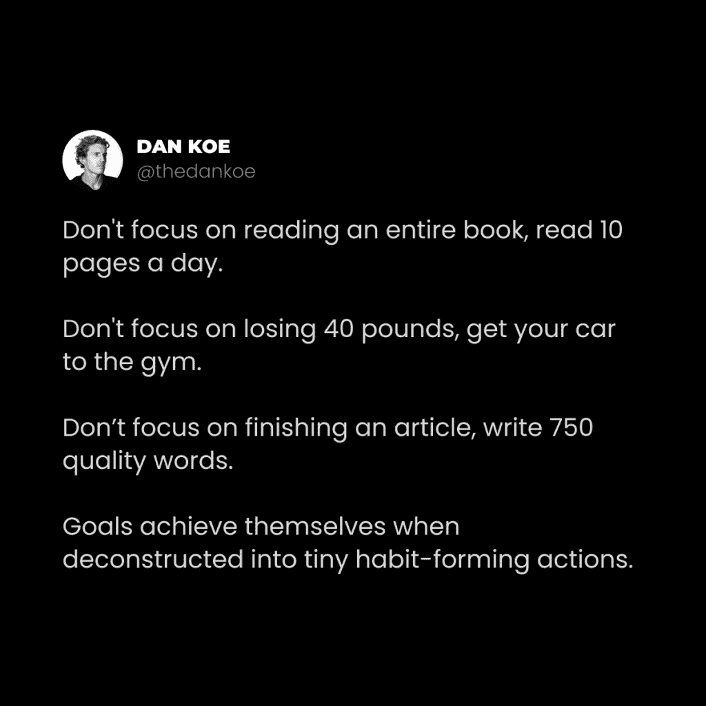

# 《4 小时工作日》（专注工作改变了我的人生）

> 原文：[`thedankoe.com/letters/the-4-hour-workday-focused-work-changed-my-life/`](https://thedankoe.com/letters/the-4-hour-workday-focused-work-changed-my-life/)

快速更新：

数字经济学现在对公众开放。你可以随时报名（而不是等到 2 月份）。

你还可以免费下载《数字经济学 101》。这是一门迷你课程，帮助你了解新经济。

如果你对我的 3 年创作者经验中提炼出的*系统*感兴趣，并想通过这些系统产品化自己，请考虑报名。

[查看数字经济学。](https://digitaleconomics.school)

* * *

当我在大学里试图成为一名健身 YouTube 博主（真是奇怪）时，我记得看到 Tim Ferris 的一本流行书的标题。

《4 小时工作周》。

我从未读过这本书，但出于某种奇怪的原因，我把它理解为“4 小时工作日”。

4 小时工作日的想法在我大学期间以及我众多的商业失败中一直萦绕在我心头。

潜意识中，我做出了决定，限制每天工作 4 小时。

*这本身就改变了我的人生方向*。

为什么？

**首先**，我认为超过 4 小时的工作都是一个问题。

很少有人这样做。大多数人将这种生活方式标签为“不可能”，然后它就真的变得不可能了。

这迫使我动脑筋寻找一个创造性的解决方案来消除、系统化或自动化低效工作。

在商业中，这意味着外包、产品化或建立更多杠杆——所以我就是这么做的。

我在社交媒体上成长，摆脱了耗时客户工作，并将我的产品化，以便它们可以在我睡觉时销售（利用我建立的优势）。

到目前为止，我正在加班。

> 4 小时工作日是一种祝福，但有时你需要 16 小时的全神贯注、忘了吃饭的马拉松来看到你能建造什么。
> 
> — DAN KOE (@thedankoe) [2021 年 11 月 30 日](https://twitter.com/thedankoe/status/1465612082112602112?ref_src=twsrc%5Etfw)

在过去的 3 年里，我 90%的日子里每天工作不到 4 小时。

最近，我的收入达到了新的月度高点，但用 4 小时工作是无法维持的。

此外，我开始构建一个需要更多我注意力的新软件。

但，你可以确信，我一直在思考如何以创造性的方式减少我花费的时间（同时保持我所建立的价值）。

**其次**，正如我们在这些信件中所做的那样，它远不止“4 小时的专注工作”。

那么，让我们深入探讨一些哲学、进化心理学，以及它们为什么对工作的未来——特别是在新的数字经济中——很重要。

然后，在信件的结尾，我们将探讨我关于专注工作的 10 条戒律。

**前言**：如果你没有 4 小时可以投入到你的生意中，你可以将这些原则应用到你的当前工作中……或者在你用于经营生意的 1-2 小时里。

## 利用我们的不同之处

有许多事情使人类区别于其他生物。

就像我们在概念层面上生存，而动物在物理层面上生存一样。（你不会看到一条蛇因为不同意你的观点而感到威胁。）

但是，一直让我着迷的一个区别是人类的*关注深度*。

在心理学中，有任务积极网络和默认模式网络。

当我们的关注点缩小到一系列外部目标或任务时，任务积极网络就会“启动”。

这对生产力很有帮助。

当我们的关注点转向内部并扩展以允许更多的想法和观点在我们的意识中注册时，默认模式网络就会启动。

这对创造力很有帮助。

（记住这些，稍后使用）。

但是，这个神秘的焦点光谱也有负面方面。

就像当你专注于一个问题，它就会扩展并占据你的注意力。这会关闭你的思维，对潜在的创造性解决方案视而不见。一个小问题很快就会成为你的整个世界。

或者，当你打开你的关注焦点并保持多个想法在你的意识中。

如果这些想法没有连接、排序，或者根本说不通——就会陷入混乱。你可能会陷入一个令人沮丧、焦虑的恶性循环，难以超越你创造的困境。

这种现象不仅仅发生在心里。

我们的身体会随之而动。

你可以通过用指尖触摸某物来缩小、收缩或加深你身体的关注焦点。

你可以通过自信地打开身体来打开、扩展或拓宽你身体的关注焦点。

就像我们扔飞镖能击中靶心一样，我们也可以朝着我们未来的愿景采取行动。

那就是如果技能、清晰度和意识都在那里，使那个愿景成为现实。因为那可能会让你感到不知所措，导致拖延。

最后再举一个例子：

我们可以缩小或拓宽我们的视角或世界观。

我们可以根据我们如何处理一个情况而“开放心态”或“封闭心态”。

你可以打开你的思想，接受工作 4 小时或更少的时间——或者你可以放弃，找借口，把责任推给所有人，除了你自己，直到你这样做。

## 生存系统

> 由于系统随着时间的推移会崩溃，除非它们变得更加高效，进化被迫作用于我们。我们不能停下来停留在原地；即使为了保持静止，我们也必须前进。——米哈伊·契克森米哈伊

作为人类，我们有一种对更多事物的自然渴望。

我们*必须*不惜一切代价生存下去。

进化反映了这一点。

用我们独特的思维，我们建立系统来帮助生存。

挑水、耕田需要大量的能量，所以我们建立了系统来高效地利用这些能量。

（灌溉系统、拖拉机以及为了使这些事情成为可能而必须建立的每一个系统）。

系统层层叠加，使我们的思维更加高效。我们越来越擅长“投资”我们的精神能量。

让我向你介绍宇宙的最高法则：

*熵*。

有些人称之为“自然的税”。

简而言之，熵是系统中无序的度量。

随着时间的推移，维持系统所需的能量会分散，系统就会陷入混乱（除非添加高质量的能量）。

就像图书馆与你的家庭藏书相比。

图书馆是有系统的。

它使用能量高效地按字母顺序排列、组织，并使书架上的书籍更容易让读者找到。

图书馆有工作人员维护这个系统，有一天，我们可能会创造一个能更好地完成这项工作（同时节省像时间、金钱和图书馆管理员的脑力带宽）的机器人。

你的家庭藏书可能是有组织的，但当你拿出一本书时会发生什么？你阅读后是否会放回原处？当你再拿出两本书时会发生什么？

你有没有一个系统来减轻维护个人图书馆的心理成本？

你是否已经足够使用这个系统来发现问题、解决问题，并将系统刻入你大脑的神经网络——以至于它变成了习惯？

书可能会放在你房子的不同房间里，你的书架变得无序。

没有一个好的系统来有序地组织意识，不断增长的能量需求来整理书架将导致焦虑、压倒性和压力。

**这与专注工作和生产力有什么关系？**

如果你没有系统化你的成功之路，你就不会实现它。

你的生产力系统是你将在时间推移中使其更加高效的许多系统之一。

生产力是关于尽可能快地从 A 点到 B 点。

就像你的家庭书架一样，如果你没有为你的工作建立系统，你将无法应对面前的任务。

当你感到压倒时，如果你没有为你的心灵建立系统，那种压倒的强度会增加。

现在熵已经控制了你的生产力，可能会导致一周的情绪和懒惰的下降螺旋……没有人希望这样。

## 四小时哲学——我专注工作的十诫

人类在概念层面上生存。

我们有建立系统的欲望，以生存于我们创造的心理结构中——自我就是其中之一。

我们对某个概念产生依恋，将其作为我们身份的一部分，从而为痛苦腾出空间。

这并不总是件坏事。

你有一个自我。

你有自我。

除非你打算成为一名僧侣（根据我所读，他们仍然会经历类似的世俗斗争……我们永远无法了解他们的心态，所以谁知道呢。最好是亲自实验）否则我们必须利用这些知识来为我们自己谋利。

如果你与成功和将你引向成功的项目的一个积极版本松散地认同：

*你将会有建立系统来帮助这些概念存活的愿望*。

如果你为你的未来创造一个愿景，你将无意识地努力维持那个愿景。

如果你创造一个能帮助你实现那个愿景的项目，你将努力维持那个项目。

如果你创造一个每天自动决定为 4 小时的项目，你将努力维持那个身份。

为什么？因为如果你不能生存于让你成为你的那些事物，那么你就不再存在。

“死亡”的概念，我们无法体验，让我们充满了恐惧。

我们可以选择转化那种恐惧，或者成为它的奴隶。

因此，让我们采取一种元方法来提高生产力。

通过以下步骤，你可以开始构建一个生产力系统，让你能够实现成功的愿景。

**1) 为什么是 4 小时？**

概念性系统需要精神能量来繁荣。

从个人经验、科学研究和我在生产力领域度过的时光中的轶事来看… 3-4 小时是精神能量消耗的最佳点。

一些研究表明，5-6 小时是上限。

但是，3-4 小时的超级专注为你的工作创造了一个截止日期，这进一步缩小了注意力范围，有助于减少分心。

以 4 小时为目标开始。

**2) 愿景与身份**

这是另一封信，我们之前已经讨论过，但你需要一个 MVV。

一个最小可行愿景。

你第一次可能不会对此有绝对的清晰度。

写出以下内容（尽可能具体和详细）：

+   你想成为谁

+   你想为工作做什么

+   你想住在哪里

+   你理想的一天是什么样的

+   你将如何为人类做出贡献

+   你将围绕自己的人（网络和社交圈）

随意回答更多出现在脑海中的问题，以保持意识流的连贯性。

当你的行动开始习惯性地与你的愿景一致时，你的性格发展也会随之而来。

**3) 概述 3 个杠杆移动任务**

这取决于具体情况。

你将不得不获得达到你商业发展下一阶段所需的任务的宏观理解。

作为一位创作者，阅读这篇[个人企业路线图](https://thedankoe.com/the-one-person-business-roadmap-99-of-creators-make-this-mistake/)，了解作为初学者、中级或高级创作者应该执行什么。

这里是我当前商业阶段的一些杠杆移动任务：

1.  **撰写内容** – 我每天早上都会写我的通讯。这篇写作被分解并用于所有平台（这是在[2 小时作家](https://2hourwriter.com)，一个内容创作的*高效系统*)。

1.  **生成流量** – 当你在某个平台上开始时，增长并不是自动发生的。由于我在领英上的受众最小，所以我与人们建立联系，让他们看到我的内容。

1.  **推广我的产品** – 在所有平台上保持一致的流量，我每天直接或间接地推广我的优惠（所有这些都在[数字经济学](https://digitaleconomics.school)中系统化）。

这确保了我的业务持续增长，可持续的销售也在不断进行。

这也有助于将这些具体化，比如“写 1000 个字”。

我每天早上都会写时事通讯的一个部分。我知道该给谁发消息和私信。我每天推广我的产品一次。

这些对我来说是可量化的。

*根据你的愿景、商业模式和经验水平，哪些可量化的任务会产生最大的进步？*

**4) 对那些任务有清晰的了解**

每周几次，你将不得不交换推动任务以产生清晰的任务。

每个星期日和星期一，我会用写时事通讯的时间来规划和研究。

在下午，我会消费与我兴趣相关的内容。这是为了产生想法。

在晚上（有时是早上）我会详细规划我要完成的事情。当我醒来时，我的心思已经放在那个计划上了。

我在我的[Fill Empty Use 框架](https://thedankoe.com/the-3-part-daily-routine-for-maximum-productivity/)中讨论了这种平衡。

在有系统化好想法的供应下，我在规划和撰写时事通讯时没有摩擦。

*你如何利用一周中的 1-2 小时来为自己设定无缝的工作会议？*

**5) 时间块和休息**

在开始之前，在它成为习惯之前，将这些时间块放在你的日历上并设置提醒。

这是你可以测试的事情。

我发现，对我来说，90 分钟专注和 15-30 分钟休息是最佳平衡点。

我会在这段时间内处理我的优先任务，进行短暂的散步，然后直接回到工作，再专注 90 分钟。

如果你愿意，你可以将这些 90 分钟的时间块安排在一天中的任何时间。

但是，要注意，当世界醒来时，分心的事情会更多。

**6) 操作截止日期**

截止日期会缩小你的注意力。

窄化注意力（对你有清晰度可以达成的结果）增加了进入心流状态的可能性。

心流状态就像是专注工作的氮气。

总共 4 小时的工作时间和 90 分钟的时间块可能足够，但你还可以进一步约束你的注意力。

放一些具体的东西在赌注上，并让每个人都知道。

如果我设定了一个产品发布日期并接受预售付款，那么与产品发布相关的所有事情都没有完成的可能。

发挥创意。*你如何给你的工作添加一个真正的截止日期？* 这可以是长期或短期的。

**7) 操作环境**

你的环境必须有利于你的工作会议。

在工作之前，我有明确的步骤来描述我醒来后要做什么：

+   刷牙和洗澡

+   散步和喂狗

+   做咖啡和写作

这有助于在工作会议之前减少决策疲劳和分心的可能性。

在工作期间，我的环境被精心设计，以缩小我对当前任务的注意力：

+   清晰的工作空间

+   好耳机和无歌词的音乐（如 dubstep，复杂性通过“调出”和不听歌曲来缩小注意力）

+   没有物理物品——比如我的手机或提醒——会打断我的注意力。

*你如何操纵你的环境来保存精神能量，以便优先处理任务？*

**8) 在干扰之前醒来**

干扰是你生产力系统中熵的起点。

你给干扰的机会越多，你陷入拖延症恶性循环的可能性就越大。

这是我最有效的生产力建议：

*提前 1-2 小时起床。*

即使你是夜猫子（利用你困倦的开放性思维进行创造性工作，而不是技术性工作）。

尽管你“允许”忽略消息和不碰手机…

没有人会发短信、打电话或试图联系你。仅此一项就能防止你陷入社交应用。

**9)** **优先考虑** **休息**

没有高质量的休息，就没有高质量的工作。就这么简单。

但正如我们在我的平衡日常安排信中讨论的那样：

“休息”并不意味着 Netflix、红酒和泡泡浴。

休息=通过非工作相关的活动（如）恢复精神能量：

+   去健身房

+   去散步

+   与朋友社交

+   阅读一本好书

+   尝试一项新爱好

任何不支持平庸或廉价多巴胺习惯的东西。

与此相关的重要事情：

当你的 4 小时工作时间结束时，停止工作。

停止。没有借口。

打破“需要”加班的习惯。

如果你不能这样做，因为你的业务会爆炸，那将是一个问题。

修复它（用系统）。

**10) 使你的系统更高效**

如果你有很多工作，以至于你不能工作 4 小时或更少（假设你想要），那么这又是一个问题。

问题需要创造性和系统化。

即，优先考虑休息的另一个原因，以便你的大脑中的默认模式网络可以帮助解决问题。

你将不得不实施解决方案，并随着时间的推移进行测试和改进。

如果因为客户工作我无法工作少于 4 小时，那么我必须：

+   建立更大的受众群体

+   创建一个不需要我时间的产品

+   促销和改进该产品，直到可持续。

+   利用我新获得的空闲时间承担更少的客户

你会正确地假设这不是立即发生的。要有耐心。

所以，最后一个问题：

什么阻止你每天工作 4 小时，你能做什么来改变这一点？

在你能够更聪明地工作之前，你必须更努力地工作。

在你不认为它是工作之前，你必须更聪明地工作。

**11) 奖励：利用数字工具**

一旦你有足够的钱投资自动化软件，你应该这么做。

使用像 TweetHunter 这样的软件批量安排内容。

在 Notion 中列出、组织和完善你的系统。

当出现问题时，例如电子邮件处理时间过长，寻找如何释放这部分时间的具体知识——不要只是接受你的命运。

*与其分心，不如与您心中最紧迫的问题保持一致**学习**。*

**对我的挑战**

记下这些诫命并执行。

不要只是阅读而不应用这些信息。

对于那些将生活方式调整为这个方向的人来说，4 小时工作日是完全可能的。

如果您充分利用互联网（而不是让它利用您），它是一个不可思议的工具。

– 丹·科

**本周发生了什么**

数字经济学现在对公众开放。您可以随时报名。*此外，您可以免费访问数字经济学 101 课程*。如果您对使用我 3 年创作者经验中精炼的*系统*来产品化自己感兴趣，请考虑报名。

[查看数字经济学](https://digitaleconomics.school)

如果您只想获得内容系统（例如，我如何创建我的通讯 > 线程 > 和可重用的推文），请报名参加 2 小时作家课程。这是数字经济学的一部分（并且如果您想升级课程，里面有一个折扣码可以减去课程费用）。

[报名参加 2 小时作家课程](https://2hourwriter.com)

在现代精通中，我为那些感觉必须坚持一件事的人发布了一篇关于如何“缩小多个兴趣点”的培训。乔伊也发布了一篇关于“如何恢复对您神经系统控制”的文章，以实现最佳表现。

[读者可以以 5 美元的价格加入](https://modernmastery.co/letter)
