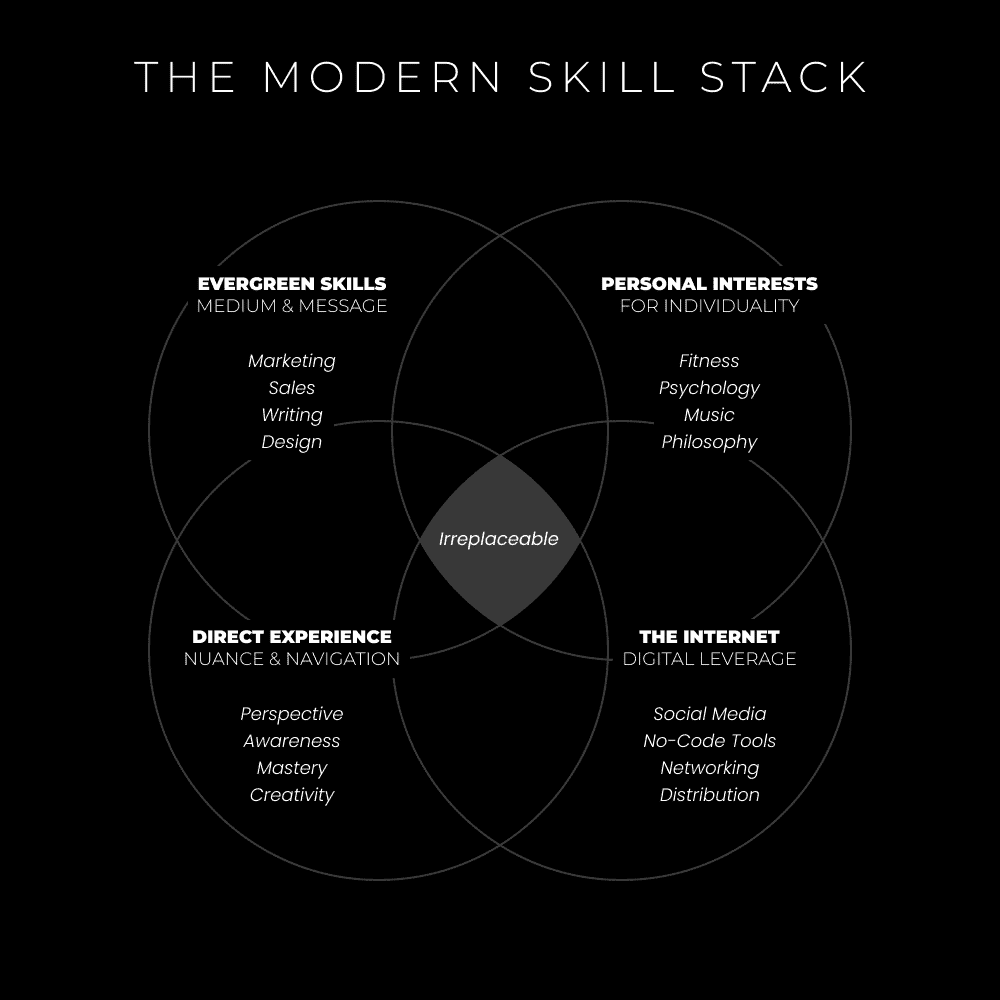

# 一百万美元的技能堆叠（按此顺序学习）

> [`thedankoe.com/letters/the-1-million-dollar-skill-stack-learn-in-this-order/`](https://thedankoe.com/letters/the-1-million-dollar-skill-stack-learn-in-this-order/)

从我能记事起，我就对学习着迷。

是的，甚至在我每天玩 3-6 小时电子游戏的时候。

我*总是*抽出时间来学习。其中很多时间都牺牲了我的学校作业或工作质量——但不知何故，我总是知道知识获取会得到回报。

起初，我以为我对学习的渴望是“闪存效应”。

你知道……每个人都警告过的“危险”事情。

但是，如果我的痴迷爆发是真正的“闪存效应”，我就不会像现在这样。

我的道路引导我走向了作为一个青少年时无法想象的事情。现在，我要与你分享这条道路（但以一种简化的方式，没有道路上的颠簸）。

在过去的 10 年里，我着迷于：

+   健身

+   营养

+   搜索引擎优化（SEO）

+   网页设计

+   网络开发

+   平面设计

+   数字艺术

+   社交媒体

+   内容写作

+   市场营销与销售

+   写作与漏斗

+   神经科学

+   哲学

+   精神层面

+   自我提升

+   这个列表太长了，所以我在这里截断……但还有更多。

每个痴迷都持续了大约 1-3 个月。

当然，我不会只专注于学习一件事。如果在我沉迷于写作时，一个营养播客引起了我的兴趣，我仍然会去听。

十年后的结果？大多数人告诉你不可能做到的事情。即使他们没有字面意义上说这是不可能的，他们也暗示了这一点。

不可能达成的成就：

*把热爱的事情变成职业。*

从一项技能跳到另一项技能并没有阻止我在一开始就赚取收入。不要陷入这样的思维定式，认为你在旅途中早期就无法替代你的收入（[如果你在现实世界中，在真实的人面前学习。）](https://thedankoe.com/how-i-remember-everything-i-learn/)

首先，让我们不要把“闪存效应”和技能堆叠混淆。

技能堆叠 > 成为专家 > 因害怕饱和、自动化或其他任何导致分心的借口而无所作为。

技能堆叠让你能够为市场上几乎任何紧迫问题构建一个创造性的解决方案。

我可以比专业机构获得更好的结果，仅仅因为我对这个领域的认识更全面。

我知道 A 将如何影响 B，B 又将如何影响 C，以此类推，直到字母表结束（以及从宇宙的角度来看字母表是如何有意义的。）专家们倾向于理解 A 如何影响 B，但当涉及到 C 时……事情开始变得模糊，这导致结果有限，即使这些结果对于接受者来说可能已经足够好了。

我们将在文章末尾讨论为什么是这样，但首先，我们必须了解要学习哪些技能（以及学习的顺序）。

## 为盈利堆叠常青技能

如果你关注以成功为导向的社交媒体账户，你可能被要求学习某些技能。

“开始一个代理机构！”

“学习 Facebook 广告！”

“开始打造个人品牌！”

这不是坏建议，但我想要提出一种不同的方法。

那么，让我们退一步，从元的角度来看。

对于盈利性，你将用价值交换价值（以金钱、时间、社会影响力、信息或专业知识的形式）。

你将与其他人类交换这种价值。

在所有事情中，人性与心理学占据至高无上的地位。

因此，我们需要三件事：

**1) 有价值的信息** – 一种与他人沟通的方式，相关、易懂或可操作。

**2) 分发媒介** – 一种将你的有价值信息展示给人们的方式（否则没有人会看到你的价值）。

**3) 以结果为导向的技能** – 一种将 1 和 2 中吸引的人进行转变的方式。

信息、媒介和适用性。

这些都是相互影响并增强彼此的技能。没有其中之一，你不会得到结果。这就是为什么需要 6 个月以上才能感觉自己知道自己在做什么。你不能仅仅学会一项技能并期望人们来找你（然后从你这里购买）。

### 信息

人们，尤其是创作者，往往忽略了这样一个事实：人们可以对他们感兴趣任何事情。

自我意识和反思在这里是关键。

如果你对一个奇怪的话题感兴趣，你是如何对它产生兴趣的？你生来就有那种兴趣吗？当然不是。那么，你如何让其他人感兴趣并吸引足够大的观众群体，从而从中谋生？

如果你的话没有引起别人的共鸣，那不是他们的错，而是你的错。

你要么：

+   从高级水平（当市场 95%的人都是初学者时）进行发言。

+   不懂说服。你必须回答或暗示回答“对我有什么好处？”这个问题。

+   没有抓住他们的注意力，也没有向那个注意力传达有价值的信息。

对于最后一个要点，“价值”并不总是意味着可操作。

价值可以通过内容创作的关键支柱来描述。

教育、娱乐和激励。

娱乐对某些人来说与教育一样有价值。

而且，“娱乐”并不意味着幽默。一个引人注目的统计数据或有趣的事实可以吸引注意力，也可以是娱乐。学习新事物是一种娱乐形式。

如果你想要制作有价值的信息，需要研究两种技能：

**1) 营销** – 为特定的人创造一个引人注目、相关且有价值的信息。

**2) 销售** – 一个让人们意识到他们的问题并为他们的问题提供解决方案的过程。注意，你并不只是针对那些自动意识到你所做的一切的人。这是一个过程。

销售也可以与讲故事同义。

它们都意味着通过以独特的方式克服问题来实现转变。

为了简洁起见，这封信不会详细介绍每一个技能，那在一个信件中是不可能完成的。

但，在最后一部分，我将向你展示如何最好地学习这些技能。

如果你想要我用来创建和推出盈利性产品的营销和销售系统，请[查看数字经济学](https://digitaleconomics.school)。

### 媒介

在生活中，纪律=自由（向 Jocko 致敬）。

在商业中，分销=自由。

在互联网业务中，分销来自媒体和代码的结合。

编程是一项伟大的高价值技能，尤其是当它与营销知识相结合时。

构建软件、在线分发它，并通过营销真正吸引用户，这是一套超凡的技能组合。大多数程序员只知道技术方面，但不知道人文方面。

然而，在座的许多人正在走创意路线。

在这种情况下，请记住，你将需要对你选择的软件的技术知识。

你将不得不学习无代码工具（如网站构建器、课程平台、笔记应用和组织工具）以最大化你的技能组合的效果。

你上面的信息是导致参与、影响和销售的原因。

但如果你没有分销的媒介，显然人们看不到那条信息。

*这就是我过去犯的错误。我太专注于完美我的产品或服务了。*

结果？

当然，没有销售。我没有计划用过于花哨的网站、标志和三个月的“工作”来吸引对我的自由职业服务的*流量*。

而且，我没有任何数据。我在没有测试的情况下盲目地创建产品（内容和受众）。

现在，在这封信中，我们采取了一种元方法。

你通过增长漏斗顶部的社交媒体渠道来建立分销。

我们在[《一个人的商业路线图》](https://thedankoe.com/the-one-person-business-roadmap-99-of-creators-make-this-mistake/)中讨论了分销和杠杆。

这可以是任何一种，但我建议初学者从允许你控制增长的社交平台开始。

YouTube、播客和博客都很好……但它们需要时间来建立。我会把它们留到你的旅程中后期。把它们当作建立权威的平台，让它们随着时间的推移而成长。

在开始时，我强烈推荐 Twitter、Instagram 或 LinkedIn……Twitter 是我的最爱。你需要的唯一技能是写作[《2 小时作家》](https://2hourwriter.com)，同时学习其他技能。

这些“增长”社交平台的原则是相同的。你需要：

+   一个有价值的消息

+   关注那条信息

+   一致地努力让内容得到分享

+   一个看起来应该有 100 万粉丝的品牌

旨在快速增长的华丽策略是很好的。但，最好专注于创建能在任何平台上吸引粉丝的内容。

因此，分发你信息的*媒介*在社交媒体平台之前。

写作和演讲。

这些都是分发你信息的媒介。

当与营销和销售结合时，你得到的是文案写作和有说服力的演讲。

这是我所有社交媒体增长的基础。书写的通讯稿是 YouTube 的脚本。书写的推文是 Reels 的脚本（并且可以复制粘贴到所有其他平台。）

在[2 小时作家](https://2hourwriter.com)中，我展示了我是如何写一篇长篇通讯稿，将其分解成吸引人的推文，并将这些写作内容分发到所有平台的。

我所有的社交媒体增长都基于我的写作。

演讲排在第二位（这是基于书面脚本）。

其他帮助说明这一信息的技能排在第三位。

因此，开始写作以阐明你的信息。在社交媒体上建立分发。然后在你准备好时练习演讲。

### 以结果为导向的技能

到现在为止，我们明白你需要一个吸引人、有价值且具有说服力的信息，并配以一个分发媒介。

这就是你需要的一切，但你可以通过具体应用这些技能来提高这些技能。

+   邮件营销

+   销售成交

+   图形设计

+   视频制作

+   动画

+   网页设计

简而言之，你学习如何*应用*媒介和信息——无论是自己的还是他人的业务——通过技术。

每个企业都需要特定的技术来吸引互联网上的客户。

当你理解这些部分如何工作时，你可以通过这项技术提供具体的结果。

你可以写一些吸引更多客户的电子邮件。

你可以创建出吸引更多关注者的图形。

你可以制作出更能吸引注意力的视频。

当你将营销、销售和沟通与一种可以用于满足每个人需求的具体技术相结合时，你就能解锁一个新的力量层次：

金钱、关注者、声誉、机会、自由和整体地位。

## 为个性堆叠个人兴趣

在这些信件中，我谈论了将自己变成一个利基市场并建立个人品牌。

但是，这也适用于你试图向不同的客户形象、个人或企业销售时。

通过个人品牌，你的兴趣是你独特之处。

当你有一个销售提案时，你的兴趣帮助你缩小销售对象的范围。

如果我对健身感兴趣，我会吸引对健身感兴趣的人。这意味着，我可以向他们介绍我的其他兴趣。

由于我了解健身界，我对我的目标客户了解很多。我可以拼凑出一个针对健身教练的提案，并帮助他们获得更好的结果。而且，这听起来比为了钱而与一个你讨厌的企业合作更有趣。

如果我已经通过谈论健身（而不是仅仅业务）来吸引健身人群，那么我的目标受众就是我的受众。

我的兴趣是健身，所以我将相关内容融入其中，让自己更加独特。

我的目标客户是健身教练，他们通过我的健身内容被吸引。由于他们在我受众中，我可以教育并销售他们我的与业务相关的提案。

看看这是怎么工作的？

许多人害怕将他们的兴趣融入一个专注的品牌中。

**“如果它没有获得良好的参与度怎么办？”**

那就不会那么有趣了。你没有击中相关的痛点，以及他们为什么应该关心。任何人都可以对任何事情感兴趣。

扩展话题，与初学者水平对话。

（是的，这仍然会吸引高级水平的人。我在健身方面很先进，但仍然需要提醒基本原理，所以我消费基本的健身内容。）

**“如果我的销售额没有增加呢？”**

你是不是在每一条帖子中都进行艰难的推广？不。

在 5 年的时间尺度上，如果你的 20%帖子是关于一个特定兴趣，你真的认为这会影响到整体收入吗？

**提示**：它不会，而且如果有什么的话，它还可能因为你不像其他人那样过度专注于一件事情而带来更多的销售。

**“如果我的兴趣与让我赚钱的事情无关怎么办？”**

发挥创意。把它作为帮助人们理解的一种方式。

就像我谈论创作者像 DJ 一样。

我喜欢电子舞曲音乐，但这与商业无关。所以我记录常见的模式，并用它使商业更有趣。

## 为细微差别和导航堆叠经验

没有发生任何事情，然后所有事情都发生了。

当你走在精通的道路上，不是一项技能，而是一个领域……你的生活，你将多次经历这个教训。

在乔治·莱昂纳德的书《精通》中，精通是“通过练习，最初困难的事情逐渐变得更容易、更愉快的过程。”

这与即时满足相反——这就是为什么没有行动就很难内化的原因。

我不会在这里宠爱你，给出立即奖励的精确步骤。

然而，我将向你提供这条道路所需的元技能。

你的工作：

在这条路上，将这些牢记在心。

当事情变得困难时，提醒自己这是过程的一部分。

通过坚持下去，你将经历短期的强烈进步。深入其中。享受它们。

### 构建爆发

帮助你学习上述技能的 2 个技能是*快速学习*和*快速执行*。

结合起来，我们可以将这些技能视为一个整体：

构建。

我为此写了一整封信，[你应该读一读](https://thedankoe.com/how-i-remember-everything-i-learn/)……或者看看。

简而言之，这里是你该做的：

+   **选择一个要仿效的项目。** 这应该包括你试图学习的技能。

+   **开始构建你自己的版本。** 为你的项目创建一个大纲，并构建直到你遇到障碍。

+   **寻求具体知识。** 当你遇到障碍时，学习那个特定现实世界情况所需的技能。这有助于你摆脱可以通过经验学习的废话。

+   **额外提示：边教边学。** 教学将识别你的知识差距，这意味着你可以寻求更具体的知识。

我最喜欢的将这封信中学到的所有东西整合起来的方式是建立一个单人企业。

为什么？

对我来说这是显而易见的，但对那些还没有开始的人来说不是。

你可以在自己的业务中练习所有提到的**技能**。

写作、演讲、营销、销售，以及设计、视频或电子邮件等互补技能。

你撰写内容、销售页面和推广。

你推广自己的[最小可行报价](https://thedankoe.com/the-one-person-business-model-how-to-monetize-yourself/)（或联盟产品，你不必拥有自己的产品）并获取数据以改进。

你设计你的个人资料图片、横幅、产品资产等等。

你的个人业务成功取决于你在建立过程中学习的能力。

然后，有了这个技能栈，你可以为几乎任何在线业务创造一个无法抗拒的报价……或者只是货币化你在路上所建立的东西。

### 关注你的视角

*50 年的 1%是 6 个月*。

6 个月只是开始。

如果你走在掌握之路上，你将一生都在这条路上。

当你超越表面生活的局限，你最终可以看到掌握之路所呈现的深度、乐趣和反思。

我之前提到，闪亮物体综合症并不是一件坏事。

“坏”的闪亮物体是那些让你偏离正道的东西。

学习一项可以补充你现有技能的新技能并不坏。

你的技能会累积，没有人能从你那里夺走它们。

当一个分散注意力的因素在你的意识中注册，并且你*允许*你的注意力集中在其上时，你关闭了你对技艺深度的思考。

分散注意力只是暂时的障碍。

因为一旦你开始了，你总是会回到它那里，因为这是你在这个生活中实现你想要的东西的唯一方式。

这里最重要的模式是：

没有事情发生，然后所有事情都发生了。

掌握是一个缓慢的或没有进展，然后是进步指数级飞跃的循环过程。

在商业中，在持续努力 6 个月后，第一次指数级飞跃发生了。这之后会伴随着巨大的阻力。你会觉得自己好像没有任何进展。

放大视角。

注意到几个月的潜在绝望是旅程的一部分。

没有人说过你不应该感觉良好（或不好）。

没有人说过这会容易（或困难）。

没有人说过你应该富有（或贫穷）。

那些是你心中持有的期望。

看到它们之外。

### 渐进式地意识到领域

我们所讨论的一切都是指导，直到通过直接经验得到巩固。

“没有事情发生，然后所有事情都发生了”这句话直到你真正体验它之前，只是一个让人感觉良好的说法。

当你学习一项技能时，一个意识领域就会围绕它展开。

就像黑暗房间中的一支蜡烛。

这让你能够看到下一步，并导致下一个技能，进一步拓宽你的意识领域。

蜡烛变成了两支。

然后，三个、四个，以此类推。

很快，你就能导航大部分曾经是黑暗的房间。

*如果没有发生（拼凑成混乱的碎片），那么一切都会发生（一个碎片到位，形成一个你可以理解的图像）。*

这个“意识领域”是你可以帮助他人、构建创造性解决方案和规划你旅程的地方。

承诺走这条道路。

堆叠常青技能（媒体、信息和结果）

将个人兴趣堆叠（以展现个性）

堆叠经验（以展现细微差别和导航）

给自己 20 年，而不是 2 周。

**– 丹·科**

当你准备好时，[访问我的网站](https://thedankoe.com) 获取免费工具和产品，以构建你掌控的生活。
