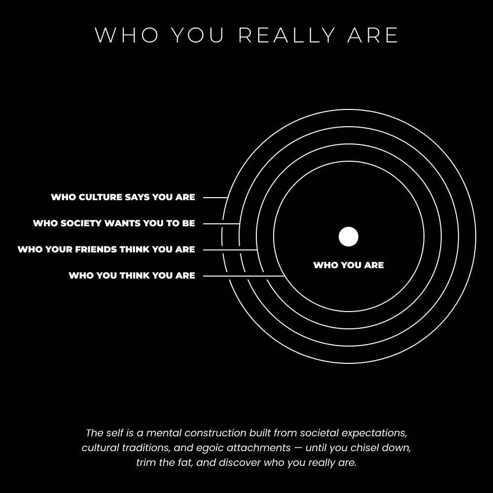

# 独处的力量（如何成为你自己）

> 原文：[`thedankoe.com/letters/the-power-of-being-alone-how-to-be-yourself/`](https://thedankoe.com/letters/the-power-of-being-alone-how-to-be-yourself/)

“做你自己！”

这些建议有多烦人？

想要开始写作？做你自己吧！

想要开始打造个人品牌？做你自己吧！

想要赢得一场热恋？做你自己吧！

这是一条好建议，但不是针对大众的。他们不明白“做你自己”真正意味着什么。为什么？

因为他们是另一个人，他们通过那个视角看待世界，而不是他们自己创造的视角。

他们去上学，并无意中采纳了性格特征、坏习惯以及在这个生活中可能性的观念。

他们带着新的开始进入大学，但再次经历了一轮条件反射，再次在他们身上叠加了一层。

他们找到了一份工作，并接受了公司的目标作为自己的目标。无意识的不一致导致了恐惧、绝望，以及灵魂的死亡，留下了一个机器人般的、动物般的、生活在永恒生存状态下的肉体。一个外部世界的奴隶。

当外部与内部相一致，即当你设定的目标与你真正的自己相一致时，无意识会将资源发送到你的意识中，以更快地执行这些目标。

无意识的大脑每秒可以处理 1100 万比特的信息，而意识的大脑只有 40-50 比特的信息。想象一下你还有多少未被开发的潜力。你所需要做的就是挖掘它。

在之前的信件中，我们讨论了体力劳动、专业化和用时间赚钱是不可持续的。

执行特定任务的机器人只是机器人。它们正在被自动化，左右两边都在进行。

未来属于那些能够利用他们的创造力的人。他们的思维力量。

但是，如果你试图利用由外部世界创造的大脑，你将只是加入了一场不同的老鼠赛跑。

我们希望拥有原创性、个性和智慧。

我们希望拥有能够改善人们生活的愿景。

这就是我们今天要讨论的。让我们深入探讨。

## 存在即关系

> 在一个没有眼睛的世界里，太阳就不会发光。在一个没有柔软皮肤的世界里，岩石就不会坚硬，在一个没有肌肉的世界里，它们就不会沉重。存在即关系，而你正正好处在中间。 —— 阿兰·瓦茨

*在一个没有他人的世界里，自我将不存在。*

*你的身份——或者说“自我”——只有在你将自己与周围的一切区分开来时才能存在。*

这正是灵性、非二元论和佛教所指的方向。他们的目标是让你意识到自我并非与宇宙分离，它就是宇宙。

这些教义的目标，以及整体的启迪，是痛苦的终结。

当你未能认识到生命的无限智慧（互联性）时，痛苦就会发生。当你未能抽离出来，看到大局时，痛苦也会发生。

***当你从比较的角度看待世界时，痛苦就会发生。*** 你会放大自我与他人的差异。

***当你从连接的角度看待世界时，乐趣就会发生。*** 你会抽离出来，形成一个整体的观点。你强调相似之处，为什么这些很重要，并欣赏连接一切、未被训练的眼睛视为分离的智慧。

这在很多精神教义中被称为“爱”，尽管我觉得这个术语让现代世界感到困惑，这就是为什么我使用“乐趣”和“欣赏”这两个词。

> 幸福的两大步骤：
> 
> 专注于重要的事情。
> 
> 从其他所有事物中抽离出来。
> 
> — 丹·科伊 (@thedankoe) [2022 年 5 月 2 日](https://twitter.com/thedankoe/status/1521057414203727873?ref_src=twsrc%5Etfw)

当你专注于那些不重要的事情时，你的思维也会变得专注，这意味着它是封闭的。你阻止你的思维看到比占据你意识内容的东西更远。

狭窄的焦点对于追求有意义的目标时，如生产力、目的等，是非常好的，但这对大多数人来说并不适用。

大多数人处于一种由压力引起的持续狭窄（收缩）的专注状态。一个消极的想法出现在他们脑海中，就会占据他们所有的注意力。他们看不到这个想法本身之外的东西。这个想法变成了他们的世界，而世界的重要性也随之消失。

这与“做你自己”有什么关系？

这里是我前几天写的一条推文：

> 人们喜欢说“做你自己”，但往往忘记，到达这个不再做自己的点，需要你的一生。
> 
> 要重新编程你的大脑，使其从一致的真实性出发行动，可能需要数千个小时。
> 
> — 丹·科伊 (@thedankoe) [2022 年 10 月 25 日](https://twitter.com/thedankoe/status/1584837675877638147?ref_src=twsrc%5Etfw)

你看，自从你来到这个世界的那一天起，你的意识思维一直在解释它接收到的感官信息，并将其存储在记忆中。

这对于在现实世界中操作是必要的，但这种方式不是疯狂吗？我们如何共享同一种语言？我们如何拥有特定的职业道路去追求？我有许多问题。我们可能生活在一个完全不同的现实中，我敢说地球上两极的人们就是这样，我们只是不理解他们的观点。

重点是，当你 18 岁时，“你自己”已经被你的环境塑造。人类是习惯的动物，随着时间的推移，你的大脑会形成沟壑，就像大峡谷的水一样，称为神经网络。

通过社会、文化和社交的熏陶，如果你没有意识到这一点，你对“做自己”将毫无控制力。

你实际上是你所处的外部世界的产物。

社交媒体创造了过度社交的问题，坦白说，社交会让你变得愚蠢。当一个缺乏自信的头脑接触到成千上万自信的思想、建议和观点时，你的大脑会试图依附于那些。

很快，你会发现自己在模仿你所处的回音室。你会思考别人的想法，而不是自己的想法。

我觉得很多人会对长时间与朋友相处的想法感到不适，但他们会登录社交媒体（成千上万的“朋友”告诉你该做什么），表现得好像这没什么不同，或者更糟。

***我并不是说任何这些都是不好的，也没有立即的解决方案。我只是在传播意识，这是改进的第一步。你不能改善你不知道的东西。你不能去除你不知道的东西。***

不要盲目相信我这里所说的。

在你本周的行动中，试着发现自己变成了另一个人。

注意你选择的词汇，如果你想要使用这些词汇。

注意你做出的决定，以及这些决定是否受到他人（在线或线下）的影响。

如果他们的决定受到他人影响，这些决定对你的目标或他们的目标是否有益？钱流向了哪里？

“谁编写了你头脑中的软件，你确定你想要它在那里运行？” —— 推特（和注意力）大师埃隆·马斯克

## 独处的力量（如何做自己）

*如果你从未与自己独处，你就无法做自己。*

就像所有事情一样，这需要平衡。平衡并不意味着平分秋色。平衡意味着有意识地努力防止任何极端占据主导地位。

如果你想要在这个世界上留下印记，你必须让自己暴露在他人面前。你必须为他人提供最大的价值。

过度社交的问题：你的思想、写作和工作都不独特、原创或新颖。这意味着，你将得到与所有人相同的结果。

这对于知识工作者、价值创造者以及任何不想用金钱换时间的人来说尤为重要。时间和体力劳动是一条死胡同（这并不意味着它不是初学者的可行选择）。你必须通过创意想法、解决方案和内容来赚取收入。

当你发布的信息与你所在领域的每个人都一样时，你将如何做到这一点？

如果你想要逆转社交媒体的影响，跟上你朋友圈中最时髦的笑话，或者遇见你认为比你更好的人（因此采纳他们的性格特点）——你必须**抽出时间独处**。

“如何才能做到‘做自己’的第一步是什么？”

优先考虑自己。

做自私。

> 无私需要自私的价值观：
> 
> – 自制力
> 
> – 自立
> 
> – 自我反思
> 
> – 自我教育
> 
> – 自我意识
> 
> – 自雇
> 
> – 自我管理
> 
> 当你依赖他人生存时，你不可能无私。
> 
> — 丹·科伊 (@thedankoe) [2022 年 10 月 28 日](https://twitter.com/thedankoe/status/1585981967199240192?ref_src=twsrc%5Etfw)

我意识到我在那个清单中遗漏了一个重要的点：**自我实验**。

主动去“弄清楚”。

*不要把你的健康外包给便利。*

*不要把你的思考外包给社交媒体。*

*不要把你的职业生涯外包给教育系统。*

把你的生活当作一个科学项目。科学的本质是试错。尝试一切，淘汰不奏效的。做你自己的个人教练。做你自己的商业导师。做你自己的治疗师。

你在独处时做什么？

这里是我最喜欢的几种清晰、批判性和深入思考的方法：

### 1) 进行一次沉思式散步

如果你每天至少不进行一次散步，你甚至是在听我说话吗？你在做什么，兄弟/姐妹？这不仅仅关于“走你的步数”。这是关于：

+   活得更久

+   有创造性的想法

+   压力调节（以防止无意识的狭隘关注）

+   远离屏幕

+   为听那本你一直推迟的书留出一个无干扰的时间块

+   写内容（当你散步时，想法会流得更好）

你想我继续说吗？我可以再列出 10 个理由。

GO. ON. A. WALK.

但是，当你这样做的时候，要思考。

在脑海中保留一个想法，让你的思维与之共舞。让思想触发思想。坐下来观察。让你的注意力如此之广，以至于你的感官领域中的每一件事都轻柔地保持在你的意识中。全神贯注于所有 5 个感官，让你的潜意识接管。

+   思考你的愿景。

+   思考你想要成为的人。

+   思考为什么你不是你想要成为的人。

+   思考你是谁，以及你是否创造了那个身份（如果不是，是谁创造了？）

+   思考你在阅读中印象深刻的观点。

+   思考你为什么持有特定的信念，以及这些信念是否让你关闭了进一步探索的大门。

深入挖掘。不要让自我在强迫性的消极思维循环中把你困住。质疑。

当你的思维陷入僵局时，移动。

**2) 每周自我反思**

没有人确切知道他们未来想要什么。这实际上是做不到的。下一秒可能发生的可能性是无限的。

我们可以“猜测”一个使命、愿景和目标来指引我们走向积极的方向——如果我们自己创造它们，而不是被分配——这些对引导我们很有帮助。

但是，你只知道事情发生时会发生什么，一旦发生，我们往往会忘记它，并重复无意识的错误。

自我反思让你能够绝对确定你的行为是否有利于你的未来。

我喜欢把它想成是“做任何你想做的事的艺术。”

你必须做你想要的事情，即使是因为肤浅的原因，也要进行自我反思，以意识到你行为的不利影响。

*你永远不会做出完美的决定。你只是越来越擅长做出不完美的决定。*

**3) 写作以澄清你的思想**

> 如果你能够思考、说话和写作，你绝对是致命的。没有什么可以阻挡你。
> 
> ——乔丹·彼得森博士 (@jordanbpeterson) [2021 年 11 月 30 日](https://twitter.com/jordanbpeterson/status/1465735961279700993?ref_src=twsrc%5Etfw)

很少有想法能够保持在“心中最上层”。

你的意识大脑只能处理一定量的信息。它只能在其意识中保持特定数量的内容。

意味着，你思考的、阅读的以及想要记住的大部分事情都无法得到太多关注。你必须将它们记下来，并用书面文字澄清你头脑中的想法。

> 如果你没有想法，就去阅读。
> 
> 如果你有了想法，但无法表达，就去写作。
> 
> 如果你有了想法，并且有清晰的表达能力，就去构建。
> 
> ——DAN KOE (@thedankoe) [2022 年 10 月 25 日](https://twitter.com/thedankoe/status/1584932451251519490?ref_src=twsrc%5Etfw)

现在，我是一个效率的粉丝。

所以如果你计划[建立一家单人企业](https://thedankoe.com/the-one-person-business-model-how-to-monetize-yourself/)，你吸引客户的方式将通过写作。

你所仰望的每个人，无论他们是否喜欢将自己视为作家，或者从你那里购买东西，他们都是作家。

写作是你为未来的数字化发展建立杠杆的方式。

写作为了清晰和为了收入相结合，这难道不是很有道理吗？

如果你想要了解如何做，请查看[《2 小时作家》](https://2hourwriter.com)。

**4) 质疑自我意识构建的故事**

这一切都不容易。它极其困难。

也不利于它听起来如此神秘。这不是一个“30 天内赚一百万的步骤系统”。

这是一场外部游戏。它是人类构建的，而且蓝图是现成的。

这是一个内心的游戏。你将不得不在多年中与自我意识进行舞蹈、战斗和斗争。我已经在这个游戏中进行了 10 多年，它永远不会结束（但确实会变得容易）。除非你选择退出外部游戏成为僧侣，否则它是无限的。很少有人感到这种吸引力，我也不认为这是必要的，因为战斗正是使故事变得有趣的原因。

在你日常生活中，注意你的思维会走向何方。

这种练习在社交媒体上最容易进行。

当你在 Twitter 上滚动时，注意你的思维会如何与所读的帖子开始对话。它从何而来创造出这样的故事？为什么它会让你生气或高兴？你对这个虚构故事中的哪些方面表示同意或不同意？

从你所阅读的帖子（或生活中你所看到的任何事物）中提取其本质。

注意你的思维如何填补空白，创造出自己的画面。

当你意识到这一点时，尽量退后一步。获得元视角，并欣赏现状本身。

**– 丹·科**

**本周发生了什么**

最新发布的 YouTube 视频《一个人商业模式（如何产品化自己）引起了极大的轰动。它的分析数据比我的先前视频高出 10 倍。我认为我们终于到达了“没有发生什么，然后一切发生”的旅程中的关键时刻。

[在这里观看](https://youtu.be/BZ2nSULolKI)

在现代精通课程中，我们与 Max Bernstein 一起举办了一个研讨会，讨论如何让你的想法留在读者的脑海中。我将亲自将写作技巧融入到我的过程中。

[读者可以以 5 美元的价格加入](https://modernmastery.co/letter)

数字经济学这门课程已经取得了良好的开端，共有 130 多名学生参与。我非常期待看到我们能为那些利用自己的兴趣和个性在互联网上建立优势的每个人带来什么样的成果。
