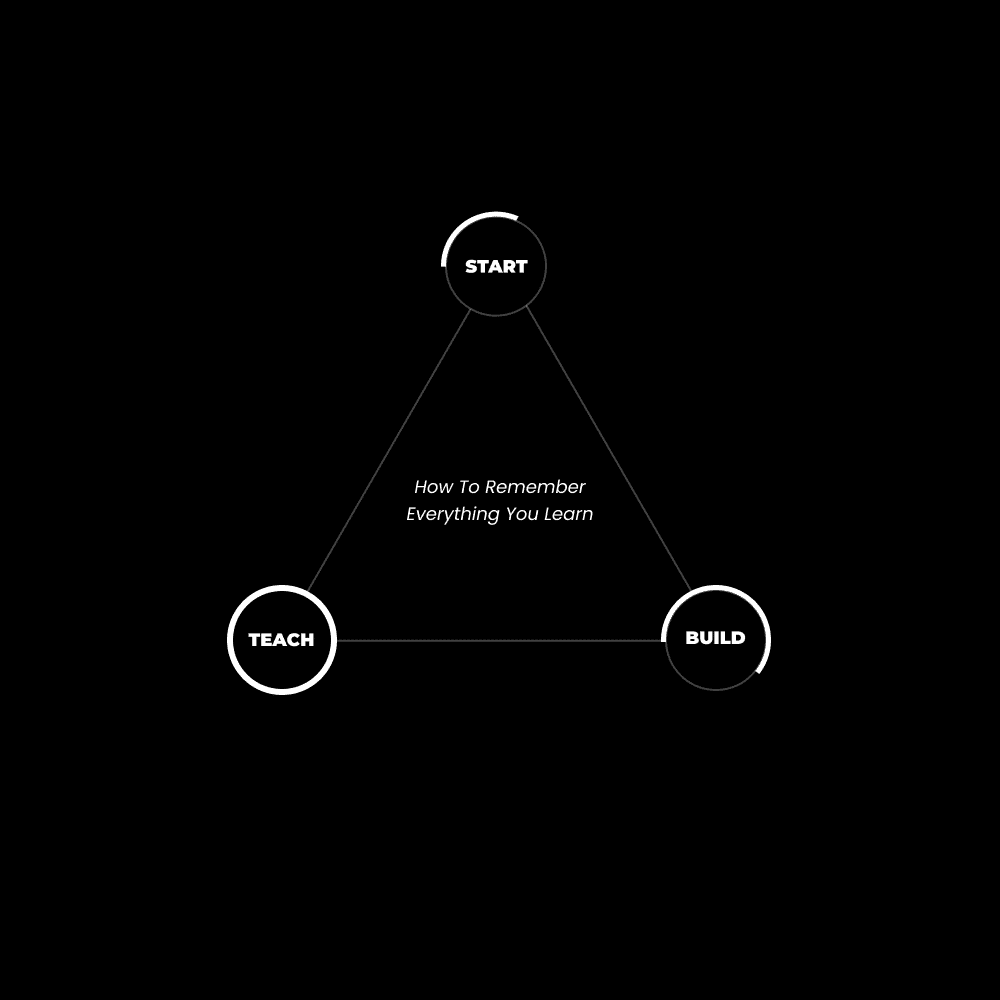

# 我是如何记住我所学的每一件事的

> 原文：[`thedankoe.com/letters/how-i-remember-everything-i-learn/`](https://thedankoe.com/letters/how-i-remember-everything-i-learn/)

如果你和我一样，你喜欢研究深奥的概念。

但是，存在一种不和谐。

你感觉你永远无法像你最喜欢的作者、演讲者，甚至你在社交媒体上关注的人那样深刻、有洞察力或具有影响力。

作为一名因在大学停车场吸烟大麻而被逮捕的 18 岁年轻人，我冒险阅读了 Eckhart Tolle 的《当下的力量》。

我仔细阅读。

我练习了冥想。

我向上帝（作为一个叛逆的青少年，我已经关闭了自己对这个概念的可能性）的概念敞开心扉。

那本书彻底改变了我。它缓解了我对可能被定罪为重罪的担忧。它帮助我冷静下来，对我不同意的人不那么容易反应。

我并没有记住那本书的所有内容，但我比在学校被“告诉”读的其他任何书都多学到了 10 倍。

为什么我会记住那本书的那么多内容？

**1) 有一个目标**

我非常重视目标设定，无论你是否将其写下来。

当我阅读这本书时，它完美地符合我生活中的情况。

我处于人生中的最低谷。我要么因为吸食大麻而面临上法庭的可能，并可能被定罪为重罪，要么交出 10,000 美元参加替代项目，每周都要随机尿检。

作为一名即将进入大学二年级的 19 岁年轻人，这显然让我感到恐慌。我没有钱，而且我绝对不可能告诉我的父母。

因此，当《当下的力量》被推荐给我时，我有了将它的教诲应用于我当前生活阶段的**意图**。

我愿意做任何事情——以极其开放的心态阅读——以使教诲改变我的心态。

**2) 真正的好奇心**

我第一次从 Matt Ogus 那里听说这本书。

对于那些不了解 YouTube 健身黄金时代的黄金时代的人来说，Matt Ogus 是原始健身博主之一。

他是我渴望成为的人。我的第一位数字导师（而且他甚至不知道这一点）。

他在视频中多次推荐这本书，我对了解整个“灵性”话题产生了真正的兴趣。

我通常不会读这本书，但我信任 Matt，就像我确信你们中的一些人信任我一样。

好奇心迫使我放慢阅读速度，细致入微，并努力理解所说的话——特别是在难以理解的部分。

**3) 缩小执行差距**

> 一个人可以培养的最伟大的技能是缩短想法与执行之间的时间。
> 
> — DAN KOE (@thedankoe) [2022 年 5 月 5 日](https://twitter.com/thedankoe/status/1522144576768823296?ref_src=twsrc%5Etfw)

现在，当我阅读这本书时，如果有需要练习的东西，我会立即放下书。

我记得坐在门廊上，喝着咖啡，试图调动我的所有 5 个感官，并做多次冥想练习。

由于想法在我脑海中很新鲜，所以更容易注意到像冥想这样无形的东西是否有效。

意识到它在起作用，使这个想法在我脑海中更加稳固。

我有*直接经验*来支持这个想法。

我将这些建议与现实联系起来。

有一个意图、真正的好奇心和减少执行差距是保留更多所学内容的绝佳方式——但我们可以做得更好。

这些年，我发现了 10 倍提升我所选择阅读、研究或学习的能力的方法。

## 你在建造什么？

**实践**（名词）——*实践，与理论相区别*。

现代问题在于信息的丰富。

我们喜欢囤积理论、教条和事物的概念理解，而没有直接经验。因为这意味着我们必须做一些我们觉得不舒服的事情，而我们已经习惯了这种舒适感。

生活不是这样运作的，没有人想成为 Instagram 评论中的“那个人”。你知道，那个给出一本书的举重（或商业）建议，同时看起来他从未在距离杠铃（或客户）10 英尺范围内的人。

在大多数领域，你会发现真正的专家很少需要指导。他们利用科学、理论和建议达到中级阶段，但一旦进入高级阶段，就会认识到直觉和直接经验胜过一切。

除了发帖，我不再登录社交媒体。我不想听起来傲慢，但 99.99%的建议都不适用于我。它所做的只是让我在心理、身体、财务和精神训练上自我怀疑。我的实践，这是由我的个人哲学支持的，是通过经验锻造的。

那么，我们如何平衡实践与理论？

**通过成为建造者**。

也就是说，总是有一个项目与你在学习的理论保持一致。

当我学习 Photoshop 时，我开始观看关于如何使用软件的无数教程。这只会让我陷入教程地狱。

当是时候创造一些东西时，我一无所有。

我不得不通过特定的教程来补充我所构建的内容。

一旦我意识到我从这种学习风格中保留了多少——有一个项目来应用我的知识——我就完全转向了这种方法。

如果我想学习如何建立网站，我不会先开始学习。我会选择一个软件来建立网站，然后观看一个关于如何建立网站的长时间教程。

我不会完全遵循教程，因为我不想创造相同的东西。我学习了我在学习的内容，并*努力*创建自己的网站。这种努力使我的大脑准备好“锁定”这个教训。

现在，为什么这种方法有助于保留信息？

**1) 强制同步**

新颖性、模式识别以及两者都涉及的多巴胺对于学习至关重要。

当我们的祖先注意到新事物时，他们会记住它，尤其是当它与他们的生存相一致时。

就像他们经过一个他们已经看过很多次的裸露的灌木丛，这意味着它没有什么新意，它对他们的生存没有帮助。但是当它长出新浆果时，他们会注意到它是新的，并且*记住*它有浆果，因为它可能在他们的生活中某个时刻有所帮助。

当你开始以项目构建为目标时，你的思维会扩展，注意到有助于该项目生存的事物。

就像《当下的力量》对我生活中情况的适用性。这些教训在我的意识中留下了印记。这种新颖发现的多巴胺给了我立即实施的兴奋感。

如果你没有注意，你就不会*看到*。

有一个项目让你集中注意力，让你看到你通常不会看到的东西。

这不仅仅是一个学习技巧，它是一个生活质量的技巧，我们将在下一节中将其提升 10 倍。

**2) 灵感行动法则**

> 我只在灵感来临时才写作。幸运的是，它每天早上 9 点准时到来。 — 威廉·福克纳

每个人都知道他们在灵感的驱使下表现得更好。

人们喜欢在健身房锻炼胸部之前观看“最佳胸部锻炼”视频。

我喜欢在我坐下来写作之前阅读那些激励我的作者。

有一个项目，你会被诱惑按照它来学习。

如果你正在创业，你自然会倾向于获取那些能给你带来创业灵感的资讯。

*但你要开始构建那个该死的企业*。

**3) 专业知识**

如果你已经关注了这封通讯一段时间，你应该知道我是这些建议的粉丝：

*先行动，再学习*。

当你开始时，*即使你不知道自己在做什么*，你也会遇到问题。

这些问题将引发挣扎，并让你的大脑准备好学习。

这些问题也会给你一些具体的研究内容。

你不会盲目学习，没有上下文，也不会从那些不教你如何做*确切*你想做的事情的人那里学习。当你盲目学习时，你会获得太多的信息脂肪。就像当你尝试增肌时做脏增肌比做瘦增肌…最终你会感到迟钝、疲惫和昏昏欲睡，以至于要减掉脂肪。

不要问问题。不要盲目学习。开始构建一些东西，然后询问或研究来解决出现的具体问题。

然后重复十年。

## 你是项目 — 将一切联系起来

> 如果你想要学得更快，就不要开始学习。
> 
> – 制定项目大纲
> 
> – 开始构建
> 
> – 在路上学习
> 
> 太多人陷入了教程地狱，堆积了无用的知识，就像大脑雾一样。
> 
> 开始 > 遇到问题 > 寻找具体知识来解决它。
> 
> — 丹·科伊 (@thedankoe) [2022 年 11 月 11 日](https://twitter.com/thedankoe/status/1591086400685891588?ref_src=twsrc%5Etfw)

让我们更进一步。

建构帮助你保留更多知识。

但教学帮助你保留更多。教学是另一种将你在构建过程中获得的经验锁定的方式。

那么，为什么不将两者结合起来，从而创造一个充满意外、同步和良好多巴胺的生活呢？

我们通过将*你*变成项目来实现这一点。

这意味着全面的发展。

个人发展不仅仅来自自我提升，还来自你对世界产生的影响。

换句话说，你的事业。

或者对于那些“共鸣”于“事业”这个词的人，用你的生活工作、你的使命或你计划如何让世界比离开时更好的方式来替换它。

自私与无私的两极性。

提升自己，然后帮助他人提升。按下电梯，留下一条供他人跟随的小径。

*记录你的旅程，以便其他人可以更快地进化。*

*尽你的一份力，提升集体意识。*

*这就是“事业”的含义，然而许多人错误地将其视为一些吸干人们生活的巨型企业。*

我已经这样做过（并帮助成千上万的人）将他们自己转变为一个企业，这样他们就可以研究他们的兴趣，传承他们的发现，并利用他们的建造者和教师的天性获得创造性收入。

那么，让我们将我们所学的一切归纳为 6 个步骤：

**1) 设定一个意图**

设定一个目标。创造一个目的。思考你的“为什么”。无论你如何定义它。

有意向改善你的生活，实现你的潜力。

这使你的注意力集中在未来，同时鼓励你将精力投入到那个愿景中。你所引导的能量来自于你的日常行动。

你所消费的一切开始为你提供动力。

**2) 安排一个创意时段**

每个人都知道他们应该为专注的工作安排时间，但是什么激发了这种专注的工作？

如果你是一个有创造力的人，你会在空闲时间寻找灵感吗？还是你在“创造”时已经处于空杯状态？

你重视创造力的自发性，还是你是受制于有规律的工作和生产力应用的奴隶？

我不是告诉你摆脱常规、效率和生产力。我是在告诉你，这只是拼图的一个部分。

每天安排 30 分钟的散步。

在这次散步中，你可以：

+   听与你意图相关的有声书或播客

+   思考你的未来，让你的大脑解决这些问题

+   让你自己远离那些会阻止你进入非创造状态的分心事物。

当你将你的注意力从外部转移到内部时，默认模式网络（一个心理学术语）就会发挥作用。这时，你的大脑开始咀嚼你已消费的信息，将新的发现带到你的意识中。（与生活在[压力引起的狭窄关注](https://thedankoe.com/the-cure-to-caring-what-people-think/)状态相反）。

**3) 创建一个笔记系统**

我可以写一本关于正确记笔记的整本书，所以在这里写它，不如下载我的免费记笔记系统（以及 7 天挑战，以最有效地使用它）。

你会在你的笔记中写下什么？

任何能够*推动*你构建努力的信息、洞察或发现。

当你的心思专注于未来的目标时，你的意识范围就会扩大。你开始从噪音中过滤信号，无论你是否感觉到。

就像当你第一次发现一辆车时。你从未真正关注过它，但你喜欢它的外观。然后，就像魔法一样，你开始注意到这辆车无处不在。

我的友人兼编辑德万自从吉普牧马人上市以来就讨厌它，现在他每天都要诅咒般地看到它们 3 到 4 次。

想象一下，如果你喜欢改善你的思想、身体和财务状况——你将开始每天发现机会（这些机会通常会从你的鼻子底下溜走）。

**4) 构建你生活的每一个方面**

> 你没有看到进步，因为你过于沉迷于完美的最终结果，而不是创造它的过程。
> 
> — 丹·科伊 (@thedankoe) [2022 年 11 月 11 日](https://twitter.com/thedankoe/status/1591070525585084417?ref_src=twsrc%5Etfw)

你必须明白你是在*构建*。

独自一人建造一座豪宅需要多长时间？

20 年？一生？

这正是关键所在。

爱上无限游戏。

尝试所有你感兴趣的事情。然后加倍投入你认为自己可以为之终身奋斗的事情。是的，这需要时间、实验和 6-12 个月的耐心。

如果你不喜欢这个听起来，就坐下来想想其他选择是什么。我敢打赌你甚至更不喜欢那个听起来。

摆脱即时满足的心态。你必须每天积极地构建你的生活。

从 30-60 分钟开始。

你在那段时间里做什么？

去健身房。为了数字杠杆和收入而写作。在构建过程中遇到问题时，如果你不清楚问题所在，就进行自我教育。

*如果你不腾出时间来构建，你* *就会被分配* *为别人构建时间。*

**5) 教授你所知**

正如我们讨论的那样，构建是与你试图构建的生活相一致，保留特定知识的一种了不起的方式。

为了保留你所学到的更多内容，让我向你介绍*辅导效应*。

简而言之，这就是“教学相长”。

当你将真正的好奇心与构建项目相结合，然后教授你所学的知识时，你比任何其他方法都能提高你的表达能力。

显然，我最喜欢的将这些全部概括的方式是进入数字竞技场。

雇主是根据你的公开简历（社交媒体账户）来招聘的。你可以教授你所学的知识，以建立数字杠杆，形成观众。当你准备好时，你可以创建一个产品或服务，将你的兴趣转化为收入。

当你教授你的激情时，你会在日常生活中开启一个新的意外发现水平。

**6) 将其变成你的人生事业**

> 你生活中可能发生的意外发现，你的**幸运面**，与你做你所热爱的事情的程度以及有效传达给的人数成正比。 —— 贾森·罗伯茨

工作是生活的一个必要部分，对于大多数人来说，它占据了他们清醒时间的大部分。

对于许多人来说，这项工作缺乏兴趣。他们选择了为他们铺好的传统道路，生活在轻微的压力状态中（这对你的创造性问题解决非常糟糕）。

这是你想要的吗？

如果要保持工作和休息的双重性——也就是说，“退休”是一个你仍然会从事**某事**的梦想——你愿意将你生命的 70%消耗在做一些你讨厌或甚至稍微不喜欢的事情上吗？

不是吗？我会这样做。

+   研究你感到被吸引去研究的课题。

+   不要分心。让它把你深深拉入发现的兔子洞。

+   理解这一点：**持续的好奇心+兴奋=激情**

+   练习用我们在这里讨论的一切来维持那种激情。

+   记下你的发现，构建一个项目，并开始教授他人。

我多次讨论过[通过单人企业产品化自己](https://youtu.be/BZ2nSULolKI)以及[成为价值创造者](https://youtu.be/RuFjY1MV4LM)。

许多人没有意识到的是，**产品最初是项目。**

如果你自己是**项目**，当你将自己公之于众时，你就变成了人们愿意投资**产品**。

先将自己项目化，然后再将自己产品化。

现在，明白你不需要在产品完美时才推出市场，那是一个不可能的目标。

创业者推出 MVPs。最小可行产品。一个提供足够价值以收费、推出并随着时间的推移持续改进的项目。

**你是你生命的工作。**

你的最小可行产品是在出生时创造的。

推出，构建，教学。

—— 丹·科

**本周发生了什么**

首先，如果你希望将这封信中讨论的所有内容结合起来——数字经济学课程开放报名至 11 月 23 日。这仅适用于硕士课程。

[如果你想确保作为价值创造者的未来，请在此加入。](https://upgrade.digitaleconomics.school)

上周，我发布了一个关于我在开始我的单人企业时希望知道的 11 件事的 YouTube 视频。明天，我将发布“独处的力量”，这将帮助你成为你真实的自我。

[在这里观看。](https://youtube.com/c/DanKoeTalks)

在现代精通中，我们从一开始就在构建受众时讨论了如何从中获利（而不是等到某个想象中的关注者数量时才开始赚钱）。在上周，我们的会员数量增长了超过 250 人。Discord 的活跃度比以往任何时候都要高。本周，我将发布一篇关于“广泛特定性的艺术”的培训。换句话说，如何让你的利基兴趣对大量的人产生兴趣（这样你实际上可以通过你的内容获得参与和增长）。

[读者可以以 5 美元的价格加入。](https://modernmastery.co/letter)
