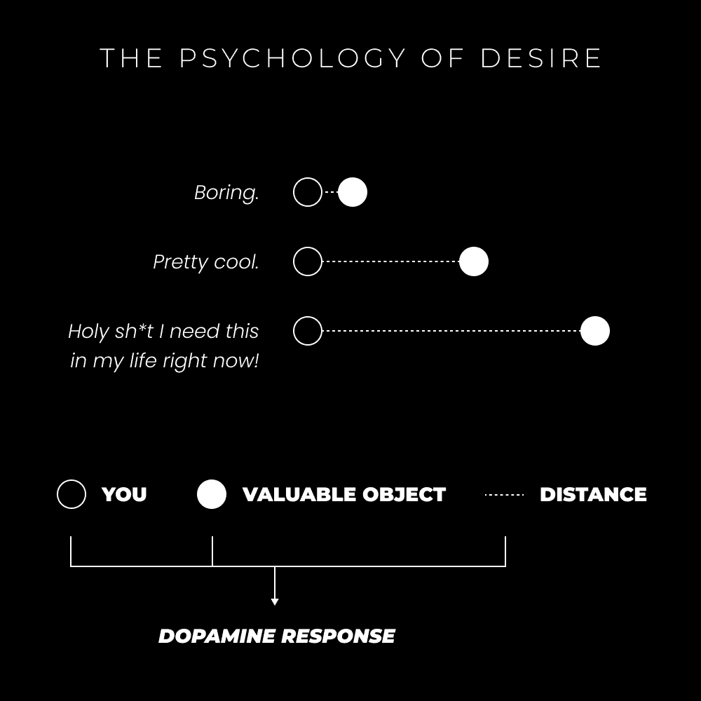

# 低成本多巴胺阻止你成为高价值

> 原文：[`thedankoe.com/letters/how-cheap-dopamine-prevents-you-from-becoming-high-value/`](https://thedankoe.com/letters/how-cheap-dopamine-prevents-you-from-becoming-high-value/)

嘿***，***你*****必须**成为一个**高价值个体**！

如果这是一条推文，它将获得 10,397 个赞。

如果我问你成为“有价值”意味着什么，你能否告诉我？

是不是获得了一定数量的技能？

是你如何结合那些技能的吗？

是那些技能为接受价值的人带来的结果吗？

那辆法拉利的价值如何？也许人的价值？那个 NFL 拉拉队长对你来说比街上刚刚经过的那个女人更有价值吗？

你看，没有人**真正**知道价值方程式的答案。

我也不认为有人花时间将“价值”这个词赋予意义。

所以，让我们回答这个古老的问题：

价值是什么？

## 价值心理学

> 在你的大脑中，下界由一些化学物质管理——被称为神经递质——它们让你体验满足感并享受你此时此刻拥有的东西。但当你将注意力转向上界的世界时，你的大脑依赖于一种不同的化学物质——一个单一的分子——它不仅让你超越手头的领域，还激励你追求、控制和拥有你立即无法触及的世界。它驱使你寻找那些遥远的东西，无论是物质的东西还是你看不见的东西，比如知识、爱和力量。——更多分子的分子

从外部角度来看，价值是由多巴胺决定的。

这就是我们按照传统标准将某物标记为有价值的做法，对吗？

我们有一种受文化和社会条件影响的观点，感知外部刺激，并成为那种欲望感觉的奴隶。

那些豪华汽车、劳力士手表、模特和海滩上的六块腹肌（那里的水有点太蓝了）。

问题是，多巴胺是欲望分子，而不是快乐分子。

欲望及其强度取决于**某物离你有多远**。

当然，多巴胺有许多其他决定因素，比如新奇、期待和复杂性——但我们在这里讨论的是价值。

当我们看到我们没有的东西时，我们会误解它。

我们假设它比它仅仅因为居住在我们的超个人空间中更有价值——而其他神经递质管理的是个人空间（你拥有的东西）。

作为教训，记住你的大脑会欺骗你，让你认为某物有价值，当你与它之间存在差距时。

当你关闭那个差距并拥有你曾经认为有价值的东西时，它很快就会失去光泽。

换句话说，那个甜甜圈广告看起来很棒，直到你咬第一口。之后，多巴胺反应急剧下降。

你还记得你第一次得到新车时有多喜欢它吗？

你一周后还喜欢它吗？（这是一个陷阱问题，这取决于你如何管理推动你大脑的神经递质。如果你对汽车有当下的欣赏，它可以在你的眼中保持其感知价值）。

多巴胺是燃料，不是价值决定因素。

## 感知、营销和华丽

营销人员对此了如指掌：

> 如果你想掌握营销，就要掌握感知。
> 
> 一个更好的产品总会输给人们认为更好的产品。
> 
> — 丹·科伊 (@thedankoe) [2022 年 5 月 28 日](https://twitter.com/thedankoe/status/1530479498872889344?ref_src=twsrc%5Etfw)

就像任何创作者、影响者或周五晚上出去的普通乔一样。

当你和你渴望之间的差距影响你对某物的投射价值时，人们可以操纵差距另一边的价值。

营销人员润色他们的产品。

影响者润色他们的品牌。

平均的乔装打扮后穿上他们最好的花衬衫，抹上发胶，喷上那款新香水（承诺吸引更多女性！），然后出门过夜。

这不是一件坏事。

我会争辩说这是一场必须玩的游戏，但常常被滥用。

如果我连用我的外表吸引别人的注意都做不到，那么我发展到有价值的地步又有什么意义呢？

就像写内容一样。

你可以在两个不同的推特帖子中拥有相同的价值，但影响参与度的关键在于钩子。

我和许多代笔作家是朋友。

一个人直接复制了相同的帖子“正文”，交换了“钩子”，但差异却是数百万的曝光量和 20,000 多个赞。

这太疯狂了。

这个教训是，如果你已经发展了内在价值，但你的外在价值不可取……那么很少有人会接触到你存在的深度、品牌或创作。

第二个教训：

成为多巴胺商人，但履行你展示的华丽。

桥接差距，因为如果你不这样做，那就叫诈骗。

## 深度 VS 外观

真正的价值需要时间的积累。

这是一个普遍原则，也是我每周开始时写这些通讯的原因之一。

如果我想我的推文或其他内容真正有价值（而不仅仅是重复别人的话），我必须**从深度开始**。

我先写通讯，然后将其浓缩成简短、有力、能引起欲望的推文。

我在[2 小时作家](https://2hourwriter.com)中教授这个过程（以及高影响力数字写作/内容的真正基础）。

就像作者可以凭借最基本的内容获得成千上万的赞一样。原因在于他写了一整本书，提供了独特的视角、信誉和详尽的想法。

詹姆斯·克莱尔可以发一条关于“习惯”的推文，超越任何做同样事情的账户。我想知道为什么。

如果你致力于在商业或人际关系中“提供价值”，你不能提供一个空空如也的礼物。

如果你只专注于冰山一角的工作，你无法期待取得任何有价值的进步。你必须创造深度。

冰山一角 = 多巴胺

冰山深处 = “向下”神经递质，当外部光泽消失后，你可以*欣赏*到的东西。

如果你想维持任何满足的关系，你的外部表现应该有多年自我发展的支撑。

你的短篇内容应该有长篇内容、直接经验或研究作为支撑，以展示短篇内容背后的深度。

你的产品或服务应该有外观（期望的结果），但同时也必须具有深度（客户结果），使其作为一对有意义。当外观给感知者带来多巴胺冲击时，差距必须被弥补。

如果你的产品或服务的外观与深度不匹配，那就被称为骗局。

外观与深度之间的差距越大，你未能满足多巴胺的需求就越多，这被称为操纵。

当然，这一切都需要时间。我们在这里谈论的是超级有价值的东西。当你是一个初学者时，你必须从小处着手并证明你的价值。

即使你购买了一门教你如何达到那里的课程，你也无法跳过从 1 级到 100 级的经验，你仍然需要付出努力并直接体验这些教诲。

总结一下，要知道价值创造是一场终身游戏。

如果你没有致力于尽可能多地*创造*价值，我的猜测是，你正在做相反的事情——从一切事物中吸取价值，却毫无回报。

翻转开关。

— 丹·科

### 本周发生了什么

新的 YouTube 视频，“为什么对失败的恐惧正在摧毁你的未来”刚刚上线。

[在这里观看。](https://youtube.com/c/DanKoeTalks)

周一发布了一期播客，名为“如何从你的生活与事业中获得你想要的东西”。

[在这里收听。](https://open.spotify.com/episode/51jGwfmpJGpqohtMJCF11o?si=691e0b20cb9c4260)

在《现代精通》中，我发布了一个视频，展示了我是如何使用免费软件设计 Instagram 和 LinkedIn 滚动图的。

[读者可以以 5 美元的价格加入。](https://modernmastery.co/letter)
