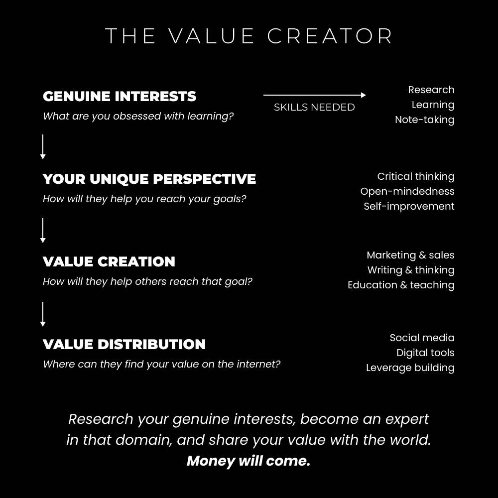
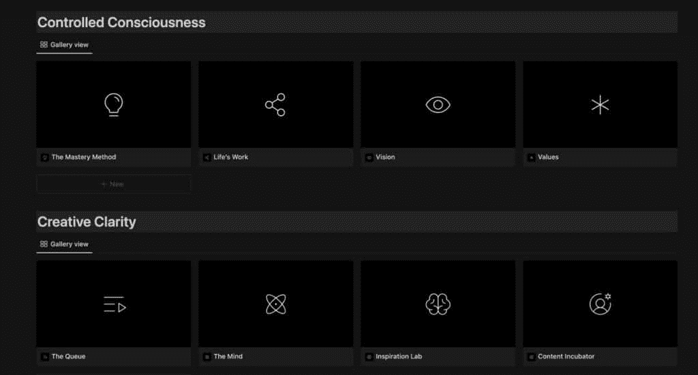

# 价值创造者的崛起（一条新的职业道路）

> 原文：[`thedankoe.com/letters/the-rise-of-the-value-creator-a-new-career-path/`](https://thedankoe.com/letters/the-rise-of-the-value-creator-a-new-career-path/)

工作状态正在改变。

事情正在数字化，这是众所周知的事实。

雇主是根据你在网上分享的内容、你的公开简历来招聘的，这是众所周知的事实。

当人们失去对传统教育的信任，转而求助于互联网创作者来教授他们实现个人和职业成功所需技能时，这是众所周知的事实。

> 在线课程受到了不好的评价。
> 
> 事实是，我们需要更多来教育人们现代技能，这些技能在信息时代人们实际上可以使用。
> 
> 为工业时代设计的 19 世纪教育体系已经不再适用。
> 
> 去中心化的价值创造者是解决方案。
> 
> — 丹·科伊 (@thedankoe) [2022 年 10 月 15 日](https://twitter.com/thedankoe/status/1581308449253638144?ref_src=twsrc%5Etfw)

客户工作（如自由职业）是每个人的首选。一方面，因为他们没有意识到其他低启动成本的机遇。另一方面，因为每个人都高呼“学习一项技能，出售一项技能”，这已经深入他们的脑海。当他们意识到自己又陷入了一个有固定收入的朝九晚五的工作中时，这通常会导致反效果。作为一个人的企业，劳动力是无法扩展的。

即使如此，还有一件事很多人都会忽略。当前自由职业的状态有 90%是由使用软件来管理人们业务方面的人组成的。

网页设计师使用模板和网站构建工具。电子邮件营销人员使用写作模板和自动化工具。虽然这可能在短期内带来收益，但随着技术的持续快速演变（同时将权力重新交到个人手中），这种模式在未来几年内将无法持续。

最高收入的自由职业者并不是因为这项工作而获得报酬。他们是因为*他们如何使用他们心中已经开发出的价值来使用工具*而获得报酬。他们拥有特定的知识，使他们能够以创造性的方式使用软件，从而获得非凡的结果。

当然，有些人可以在 Instagram 上安排帖子，并支付软件费用以帮助增长（如与其他账户互动），但如果你的内容糟糕？如果你的转化漏斗糟糕？如果你的产品糟糕？你将无法成功。随着我们超越物质，智力发展的重要性正在增加。

这已经酝酿已久。

作为人类，我们创造了工具、解决方案和技术，使我们的生活变得更轻松。犁使农业变得更简单。鞋子使城市生活变得更简单。软件使商业变得更简单——自动化已经取代了大量的劳动力工作，并且不会停止，直到人类天性的懒惰使物理生活变得简单。是的，这些都伴随着后果，但你有资格评判宇宙如何选择在一生中进化吗？

下一个阶段是用我们的思维进行构思、建设和盈利，以进入人类进化的下一个阶段。过去需要数千美元和一支程序员团队才能完成的事情，现在只需花费 10 美元订阅一个着陆页构建软件就能实现。不要低估这种力量。

在过去的几封信中，我们讨论了一人企业模式。

这一篇关于[如何产品化自己](https://thedankoe.com/the-one-person-business-model-how-to-monetize-yourself/)，还有一篇[如何从生活中的问题中找到并获利](https://thedankoe.com/if-you-are-valuable-turn-yourself-into-a-business-with-5-repeatable-steps/)。

在这封信中，我想向你介绍我称之为**价值创造者**的概念。

为那些不想成为典型互联网营销人员的知识好奇者提供一条新的职业道路。为那些重视独立、自力更生，并完全控制自己赚多少钱、工作多少以及做什么的人提供一条职业道路。

简而言之，价值创造者是这样的人：

+   用他们的思维而不是时间来赚钱（这样他们就可以作为一个一人企业而不会限制他们的收入）。

+   通过写作、视频和其他互联网内容研究他们的痴迷，提炼他们的学习成果。

+   通过数字产品（或如果你愿意，也可以是实体产品）的形式获得聚合知识和经验的报酬。

+   重视教育他们的受众（而不是发布梗图、制造戏剧或其他类似的事情）。

价值创造者是这样的人：他们致力于自己的兴趣，将其作为一生的使命去探索，并以教育的方式提炼信息。

这为什么重要？因为我们需要充满激情的人成为各自领域的大师。还有谁会去做这件事？政府（与学校系统紧密相连）会在技术淘汰整个工作领域时培养课程吗？不，他们将是第一个构建这项技术的人，这样他们就能赚更多的钱。

最后，创作者经济中的“价值”空间非常小。每个人都专注于花哨的噱头和廉价的娱乐。我们需要能够以令人兴奋的方式教育下一代的人——因为学校课程无法跟上细分领域的进步。

## **通过痴迷探索现实的未知角落**

这不是从消费者到创作者的转变。

这关乎从消费者到研究员的转变。

成为“消费者”意味着无意识地消费信息。

成为“研究员”意味着有意识地消费信息。

<picture fetchpriority="high" decoding="async" class="wp-image-829"></picture>

价值创造者用他的头脑赚钱，而不是用他的时间。这意味着，他最大的资产是信息、想法和知识，这些让你兴奋地醒来并分享来自你研究发现的发现。

如果你遵循[我的单人商业模式（货币化自己）的观点，](https://thedankoe.com/the-one-person-business-model-how-to-monetize-yourself/)那么你能帮助最多的就是*你自己*。

你的细分市场是*你自己*。

你的品牌、内容和提供的产品都基于你的目标、兴趣和个人经验。

这是一个全面的方法，让你能够以你热爱的方式谋生。你正在开启成为你痴迷领域内专家，从而成为一个高价值个体的可能性，以获得报酬。你为什么要从其他任何事情中创造一个企业呢？商业曾经、应该，并且将回归为自我的一种延伸。

所有这些都听起来很棒，但*如何*进行有效的调研呢？

通过意识探索现实的未知方面。你看，现实是无限复杂、相互联系和基于视角的。

当大多数人只是在生活的表面航行时，那些能够深入到他们*所见*之外的人，才是能够开启他人无法理解的创造潜能的人。

在[数字经济](https://digitaleconomics.school)中，我谈论了商业是自我实现的载体。深入挖掘你热爱研究的兴趣，这是你了解自己、生活以及你打算用你的发现来服务的人的方法。对我来说，商业是将不切实际变为实际的中介。它是一种给进入你大脑的每一件事添加意图和用途的方式。

但你该如何探索这个现实的裂缝呢？

通过将整体分解为部分。（然后，你将这些部分重新组合成一个全新的整体，这就是创造力。）这就是世界上每一件事的本质。一个思维单位。意识的产物。一个*东西*。既是整体也是部分。原子、分子、细胞、生物体。都是整体的一部分，同时自身也是整体。人类、卧室、公寓综合体、城市、州、国家、星球、星系。一切都在无限地相互连接，向上、向下、向左、向右。这就是意识。看到你眼前所没有的东西。这需要你对现实本身的准确感知。你越封闭、越容易反应过度、越容易快速判断，你在这个空间（或任何空间）成功的机会就越小。

*意识创业*是你成为价值创造者的方式。

让我们使这更加实际一些。

### **1) 选择你的痴迷**

首先，不要寻求外包任何这些事情。你必须采取探险者的心态。没有人能告诉你*你*痴迷于什么。

*如果你不知道，就试试。如果你不尝试，你就永远不会知道*。

尝试*一切*。

去当地书店买一本“呼唤”你名字的书。

所有这些“用你的头脑赚钱”的东西都不是按部就班的、可预测的，也不能用言语来描述。你必须学会信任你的直觉。

如果你需要一个起点：

+   查看你的浏览器历史记录

+   看看你最近观看的视频

+   看看你自然消费来学习的东西（顺便说一句，分心不是自然的）

+   看看你的生活，看看你在哪个领域进步最大

你为什么不把这些东西变成一个业务，这样你就可以为做你已经在做的事情而得到报酬呢？

*“明智的人因做自己喜欢做的事情而得到报酬。”*

### **2) 从所有角度进行研究**

创作者们的一个大问题是，他们陷入了一种意识形态，这阻止了他们保持独特性。他们闻到了“真理”的气息，并将其作为他们整个品牌（和身份）的一部分。他们无法巧妙地导航有说服力的论点，因为他们相信他们的方式是唯一的方式。

健康和健身行业就是这里想到的。

当大多数人订阅了特定的饮食和训练模式（如食肉动物和力量举）时，你必须理解现实是由无限的角度组成的。无限的观点。

观点是以目标为基础的。个人的目标决定了特定的建议对他们是否有价值。如果你真正想帮助人们，你必须帮助他们根据他们的目标在你的现实世界中导航。

或者，如果你正使用*你的*目标作为你的品牌，你将从这个角度讨论话题。你研究你的兴趣以帮助你朝着目标前进——这就是你吸引特定、志同道合的追随者的方式。

意味着你需要以开放的心态接触所有关于这个问题的观点，以开始形成你独特的信息。

1.  跟随那些你不同意的人

1.  购买一本关于基础知识的畅销书

1.  购买提供相反见解的书（不同的饮食、不同的宗教、不同的心态技巧）

1.  多听一些长篇内容而不是短篇内容（因为短内容是为了让你产生情感反应而精心制作的，而不是为了教育你）。

让自己不可能看不到全貌。简而言之，沉浸在你着迷的事物中。

每天了解它。取消关注任何不谈论它的人。有意识地努力让自己尽可能多地接触到你选择的空间中的信息。这将为你提供创造力。

### 3) 记下想法，发现

当你研究你的着迷之处并成为该领域的专家时，应该不可能不记下有趣的信息。

如果你需要帮助，以下是你需要寻找的内容：

+   **你可以用于你发布的内容或你创造的产品中的想法、轶事或经验**（这样你可以保持人们的注意力，永远不会写不出东西）

+   **“金块”般的信息，能激发你的兴奋**（这样你就可以激发他人的兴奋）

+   **以新的方式思考你以前从未想过的话题**（这样你可以改变他人对这一话题的看法）

理解，除非你积极研究你的痴迷，否则这对你来说没有任何意义。

通过遵循这 3 个步骤，你已经成功地开始将你的兴趣的“整体”分解成“部分”。

这是你接下来要做的（很重要）。

## **简化复杂主题将是下一个世纪最伟大的技能**

这就是大多数自助领域的人停止的地方。他们囤积有价值的信息，并关闭自己，拒绝真正的学习。

你必须*应用*你所学的。

你不是通过阅读关于写作的文章来学习如何写作的。

你不是通过阅读关于骑自行车的课程来学习如何平衡骑自行车的。

但是，通过价值或知识创造，你不会在物理上应用你所学的。你必须**沉思、思考、写作，形成一个有价值的连贯信息**。

下一步绝对至关重要：

将你的创作、写作和内容放在公共市场上，这样你就可以直接对你的工作进行反馈。你必须吸引一个受众。我最喜欢的方式当然是社交媒体。

老师比学生学到的更多，建立受众为你提供了杠杆、流量和社区，这将为你的一生奠定基础。

现在，我们可以整天讨论受众建设，但你可能会想，“每个人都能建立受众吗？”让我们快速了解一下：

1.  社交媒体上的每个人都在跟随 400-1000+人。是的，甚至创作者也在。

1.  不要忘记网络效应，所有那些 400-1000 人也在跟随那么多人，那些人也一样。你的受众不仅仅是跟随你的人有多少。

1.  你只需要 1000 个真正的粉丝和一个好的产品组合，就能吸引 6 位数以上的收入。

1.  我可以整天处理这个反对意见……简而言之，如果你认为市场已经饱和，你完全错了（如果你已经做了 3-6 个月，你就不会这样想了）。

价值创造使你能够应用你所学的任何东西。你日常经验中的本质（或教训）可以用作引人入胜的写作、视频甚至产品的动力 – 就像我不喜欢我买的任何计划，所以我创建了自己的来通过谈论我的兴趣建立受众来销售。

然而，你必须理解，其他人不会对你想说的感兴趣。这使得大多数人想要放弃。

你必须以其他人*认为*有价值的方式打包你的发现，并以一个个人媒体公司的形式分发它们。

> 单人多元化媒体公司是新的现代企业。
> 
> 发展一个社交渠道，建立一个大型的电子邮件列表，然后提供多个价格点的多种产品：
> 
> – 订阅
> 
> – 赞助
> 
> – 指导
> 
> – 附属
> 
> – 课程
> 
> – 等等。
> 
> 小型业务。大收入。
> 
> — Justin Welsh (@thejustinwelsh) [2022 年 10 月 2 日](https://twitter.com/thejustinwelsh/status/1576564200062832646?ref_src=twsrc%5Etfw)

互联网是代码和媒体。

媒体是你分发价值的方式，代码是让媒体存在的方式。作为一个个人企业，你可以支付无代码软件的费用，并将所有精力集中在分发有价值的媒体上。

让我们使这个方法实用。

你如何以有价值的方式打包你获得的知识？

### 1) 选择一个媒体平台

我更喜欢 Twitter。

+   你可以发布你想要的任何内容（在你将它们发布到其他平台之前测试你的想法）。

+   它是基于写作的，这意味着你不需要是一个住在泰国、在海滩上啜饮椰子的 10/10 模特。

+   它就像一个论坛，你可以更快地找到人。

+   转发按钮是一个低摩擦的分享功能，这就是你获得关注者的方式（对于初学者来说，其他平台更难增长）。

+   你可以截取你的推文以在其他平台上增长（这是其他人都在做的事情）。

在 Twitter 上增长的基本原则很简单。

+   每天发布 1-3 次帖子（并开始处理你的“失败”）

+   如果你拥有不到 1000 个关注者，专注于在回复和私信中与其他人建立联系，以利用*他们的*受众。

+   拥有一个*可点击*的头像，这样人们就知道你是一个创作者。

+   使用你生活中的大目标或你谈论的 3 个兴趣作为你的个人简介（你将引导人们走向何方，他们将通过你独特的兴趣如何获得？）

+   根据你的故事和个人经验编写线程（但确保你有一个会分享它的网络，这样它就可以半病毒式传播）。

从初学者的教育内容开始。让它具有可操作性。这是每个人在开始时（在任何平台上）增长的方式，市场中的 95%都是初学者。在你为自己建立名声之前，不要试图表现得过于聪明或睿智。

### 2) 学习如何吸引注意力

注意力是 21 世纪的货币。

但别担心，你不需要成为一个油滑的销售员就可以加入社交媒体派对。

> 创业是找到艺术与营销之间独特平衡的过程。
> 
> 如果你过于偏向“艺术”一边，你最终会成为一个挨饿的艺术家。
> 
> 如果你过于偏向“营销”一边，你最终会成为一个油滑的销售员。
> 
> 你不能忽视其中任何一个。
> 
> — 丹·科伊 (@thedankoe) [2022 年 10 月 14 日](https://twitter.com/thedankoe/status/1580908539073253380?ref_src=twsrc%5Etfw)

这是一个外观与深度、多巴胺与“此时此刻”神经递质如血清素和催产素之间的较量。

你必须先吸引注意力，然后才能交付你承诺给予注意力的价值。没有人想被认为是一个骗子、点击诱饵骗子或肤浅的陈词滥调传播者。我们将在第 4 步中解决这个问题。

在[数字经济学](https://digitaleconomics.school)中，我们深入探讨了吸引注意力的心理学，但这里有一些原则，这样你就可以现在就开始了。

**问题** - 每一个好故事都是通过从读者面临的问题开始来吸引注意力的。它开启了一个好奇心循环，使他们想要找到解决方案。问题是人类行为的基础。

**数字** - 在你浏览社交媒体时，具体的数字是一种模式中断。“我读了 347 本自我提升书籍，所以你不必”是一个例子。

**统计学** - 类似于数字，统计学可以很好地设定场景。“97%的人口注意力有所下降，这是如何解决你的问题的例子”可能需要一些改进，但你看到了它的力量。

如果你想学习吸引注意力的艺术，开始沉浸在大标题、Twitter 线程钩子和其他社交媒体帖子中。让你的潜意识充满创造力，然后去散步，让想法涌入你的意识（准备好你的[笔记捕捉系统](https://digitaleconomics.school) :)）

开始*研究*而不是消费。分析人们帖子成功的原因，而不仅仅是漫无目的地滚动。

这是我能给你的最佳技巧。

意识。

### 3) 将自己视为理想读者

当有人正在为所创造的价值建立读者群或受众时，常见的建议是针对你的理想客户写作。

在一人公司中，*你*是你的细分市场。你是你的客户形象。你是你的品牌、内容和产品。

我让人们在数字经济学中完成[迈尔斯-布里格斯性格测试](https://www.16personalities.com/)，这样他们就能更好地了解自己。当你了解自己时，你可以给自己写信。测试结果就是你的客户形象。

现在，你该写什么？

+   如果你正经历困难时期，给自己提供建议，并将其写在你“公开日记”上。

+   给过去的自己提供克服你所面临问题的建议，但要更快。

+   给未来的自己以鼓励，以实现你试图实现的目标。

这些只是你可以创造内容的许多方法中的一部分，但它们是很好的（且易于访问）起点。

### 4) 优先考虑深度和清晰度

每个星期天，我都会概述一周的时事通讯。

这份时事通讯被用作 YouTube 脚本（我实际上是从手机上读这篇帖子给摄像机听，然后编辑掉停顿）。

之后，我可以将主要观点浓缩成 Twitter 线程、Instagram 轮播图或标题、LinkedIn 帖子等等。

我也可以浏览时事通讯来生成推文想法，然后跨平台转发（如果你关注我，你每天都会看到这个…但你是否有意识呢？）。我还把我的最佳推文读给摄像机听，用于 reels、短片和 TikToks。

为什么从时事通讯开始？

因为深度。

深度是你建立权威的方式。

如果你是一个价值创造者，我现在就可以告诉你，只写短形式的内容只会导致痛苦和缺乏权威。当然，对于追求快速现金的电商品牌来说，这是有效的… **但如果你想做你认为无法货币化的东西（比如灵性）？** 深度不是一种选择。它是一个优先事项，也是你有效货币化的唯一途径。

每周一开始就概述我的通讯简报，我给自己一个可以咀嚼的大想法，当我散步、在健身房或其他形式的“休息”时，这个想法可以激活我大脑中的默认模式网络（创造力的关键）。

每当一个想法闪现在我的脑海中，我都会打开手机上的大纲并将其写下来。这使得我永远不会遇到写作障碍。

你怎么写通讯简报？

+   根据你的推文或其他你知道会做得好的内容（比如你最喜欢的 YouTube 视频博主最受欢迎的视频）选择一个表现优异的主题。

+   从一个个人经历或故事开始，说明你面临与该主题相关的问题。

+   提供克服那个问题的具体步骤。

这就是你开始所需的一切，如果你想变得复杂或做得更久，也可以。我写长通讯简报是因为我喜欢它。心理上的益处远远超出了商业领域。

说到这里，数字经济学课程将在一周多一点的时间内开始。

我有一个完整的 Notion 仪表板，其中包含我们刚刚讨论的（以及更多）所有系统的内容，这样你就可以每天用 2-4 小时管理你的整个个人业务。

这里是 Notion 仪表板内部 30%的内容（这些内容都包含使商业变得容易的系统）：

<picture decoding="async" class="wp-image-834"></picture>

在 60 天内，我们掌握个人品牌建设、内容创作、创建你的产品（无论经验如何），并制定营销策略，这样你就可以立即开始盈利。

我已经对这个课程进行了 3 年的迭代。这些信息能带来结果，经过时间的考验，并能帮助你跳出创作者的竞争。

如果你对这个感兴趣，[在这里了解更多并考虑报名](https://digitaleconomics.school)。

我们从 26 日开始！

最后，感谢你阅读这周的来信。我希望你从中获得了很多收获。

– 丹·科
