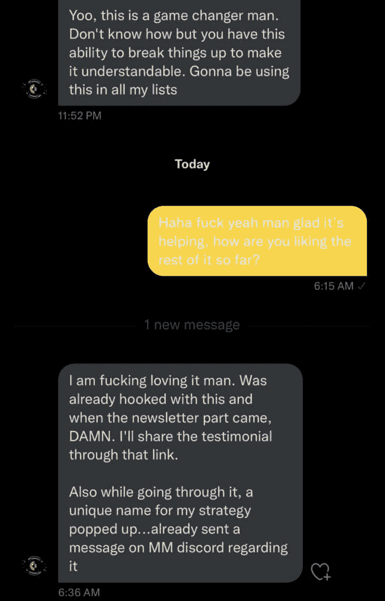

# 如何从生活中获得你想要的东西

> 原文：[`thedankoe.com/letters/how-to-get-what-you-want-out-of-life/`](https://thedankoe.com/letters/how-to-get-what-you-want-out-of-life/)

现代教育体系擅长一件事：

**将人们培训成可替代的工作**。

这是我上大学之前的一个认识。我知道，即使我上了大学，找到适合我的正确职业并不意味着毕业就结束了。

如果我想赚足够的钱来消除金钱带来的问题，我有两个选择：

选项 1：

+   爬上企业梯子

+   用我的技能为别人的业务建树

+   为了更高的薪水，牺牲我的欲望和时间

选项 2：

+   创造自己的梯子

+   用我的技能建立自己的业务

+   为了实现我的目标，牺牲我的空闲时间

当然，我在这里是在夸张。

我已经自雇 3-4 年了，我对大多数事情都感到**极度**脱节。我对企业工作有一种扭曲的认识，并且对此非常清楚。

从我所看到的，很少有工作能有一丝自我雇佣的好处。

充足的休息、追求内在的目标层次、而不是坐在人造的蓝光前 8 小时、追求精通以及随之而来的深刻满足感……等等。

为了赚取可预测的金额，人类的心理、健康和实现自我价值的**基本需求**被置于次要位置。

当好的多巴胺来自于追求你自己的生存、追求你设定的目标以及在你选择的技能上达到精通时，这并没有什么意义——不是有人愿意帮你走向他们的目标。

你如何防止或逃避这种现实？

技能获取、建立创造性的收入来源，以及采纳自给自足的价值。

但还有更多。

**互联网已经使竞争更加公平**。

所有经验水平的人都在解决他们自己的问题，学习新技能，并以吸引人的方式在线发布他们的发现。

这一举多得。

+   通过经验学习建立杠杆技能（如写作、说服和其他与建立品牌相关的可销售技能）

+   建立数字杠杆（追随者、网络和永远存在于线上的数字房地产）

+   研究他们真正想要追求的兴趣（并通过组织他们的想法和在线发布来了解它们）

+   帮助那些在他们后面 1-2 步的人（因为人们正在失去对“系统”的信任，并希望从人类那里学习）

现代教育状况正在我们眼前发生变化。

就像比特币一样，教育将继续去中心化。

创作者成为了新的教师。

消费者成为了新的学生。

## 新的教育体系

> 当前的教育体系不会为工作的未来做好准备。
> 
> — 丹·科伊 (@thedankoe) [2022 年 7 月 12 日](https://twitter.com/thedankoe/status/1546816648199507969?ref_src=twsrc%5Etfw)

事实上，我要教给你的就是旧的教育体系。

在政府支持的学校出现之前，我们是如何学习的？

来自我们的父母、社区和经验。

我们触碰到火，哭了几分钟，并了解到生活意味着风险。有些是可控的，有些是自我欺骗和幻觉的产物。

作为没有预期路径可走的人类（为了完美融入我们构建的社会），我们追求好奇心，从经验中学习，并寻找能帮助我们加速独特路径的导师。

我们把一切都搞反了。

从我们小时候起，我们就被训练成：

+   取悦他人，并按表现评分（而不是我们真正学到了什么）

+   满足社会的需求和欲望（因为接受别人的意识形态比创造我们自己的生活方式要容易）

+   将我们的思维限制到怀疑的程度，“这就是全部了吗？”

这是一场灾难。

去上学，按照别人告诉你的去做，获得学位，被训练成一份可替代的工作，拥有固定的收入，这决定了你在社会中的价值…

不质疑任何事情，只看到眼前的东西，不要比我做得更好！我说我想对你最好…但这只是为了证明我无意识的行动，这些行动发出了相反的信号。

新的教育体系不依赖于社会。

它依赖于你。

自我教育是答案，但没有人知道如何自我教育…这正是重点。

## 5 步让你掌握自己的教育

<picture fetchpriority="high" decoding="async" class="wp-image-746"></picture>

我们还没有进入另一个文艺复兴时代。

思想、信息和建议无处不在。

人们正在失去对宗教、政府和强制意识形态的信任。

这使我们陷入永久的焦虑和不确定状态。秩序已经丧失，我们的心灵遭受了冲击。

在过去，宗教教义和接受的文化标准为我们提供了追求目标的外部等级制度。它为我们带来了秩序。我们不必*思考*未来会怎样。这是一件好事，也是一件坏事。

现在，我们必须自己动手。以下是方法：

**1) 认识自己**

> 如果你不知道你想要什么，了解你不想什么，然后朝相反的方向努力。
> 
> — 丹·科伊 (@thedankoe) [2022 年 6 月 15 日](https://twitter.com/thedankoe/status/1537030087874420738?ref_src=twsrc%5Etfw)

你想要你未来的什么？

你将如何到达那里？目标是什么？

你为什么要达到那里？对你来说什么才是重要的？

在接下来的一个星期里，思考你的[愿景、目标和价值观](https://youtu.be/h8BrVhksQw8)，然后内化这些下一步。

**2) 追求你的好奇心**

3 件事：

+   潜在的实用性

+   潜在的创造力

+   潜在的愉悦性

这些是你构建盈利技能堆栈时应该寻找的东西。

是的，*堆叠*。不是单一技能。

这就是大多数创意人士出错的地方。你不能整天创作艺术并希望有人以你的方式看待它。

如果你想要追求一项艺术技能，那很好，去做吧，但你必须开放地提供这种技能，以帮助他人得到他们想要的。

写作、营销、销售。

学习这些。这会给任何你选择学习的技能带来实用性。

享受过程？这是自然而然的事情。尝试新事物。把东西扔到墙上。

**3) 开始一个个人项目**

> 你可以整天读书和听建议，但除非你应用并体验这些教诲，否则这一切都没有意义。
> 
> — 丹·科伊 (@thedankoe) [2021 年 12 月 30 日](https://twitter.com/thedankoe/status/1476483719653376003?ref_src=twsrc%5Etfw)

项目是有力量的。

第一，它们让你摆脱了教程地狱，那种让你误以为自己在取得进步的无尽学习循环。

第二，它们迫使你构建一些在现实世界中具有功能的东西。

关键词：*构建*。

第三，它们教你如何追求好的多巴胺来源。你可以取得进步，变得着迷，并感受到所有伟大的企业家所谈论的能量。

[撰写通讯稿](https://2hourwriter.com)并揭示你写作中的不足之处。

为你的品牌创建一个横幅，并被迫研究你可以用来创建这些图像的工具。

将你去年想到的“百万美元”应用想法发展起来。你不可能在 YouTube 上找不到“如何构建应用”的教程，做一些调查，然后花几个月时间真正去做。

不要让你的思想欺骗你。

**4) 寻求具体知识**

> 失败，然后学习。
> 
> 先行动，再提问。
> 
> 先移动，再转向。
> 
> 如果你的脚没有踩在油门上，那么一个装满油的坦克、地图上的方向和手握方向盘只是一厢情愿的想法。
> 
> — 丹·科伊 (@thedankoe) [2022 年 8 月 21 日](https://twitter.com/thedankoe/status/1561282467243466753?ref_src=twsrc%5Etfw)

构建一个项目会暴露你不知道的东西。

在开始之前试图学习一切只会推迟这个过程。

当你遇到障碍时，找到解决方案。

购买一门课程，观看 YouTube 视频，向你在社交媒体上关注的某人提出具体问题，加入一个社区，总的来说……只是参与一个讨论你兴趣的数字空间。

这就是这种“新教育体系”的美丽之处。

你不需要花大价钱就能得到你需要的答案。一切都在那里。人们只是不知道该查找什么，因为他们还没有开始一个项目，失败，并且没有理由去查找具体的东西。

*创作者是新教授，但教授的信息是教授们直到下一次课程更新之前都无法教授的**。

**5) 将你的项目公开**

> “给我一个立足点，一个足够长的杠杆，我就能移动世界。” —— 阿基米德

互联网给任何人提供了建立杠杆的机会。

+   个人网站

+   在社交媒体上写作和教育

+   建立受众和接受支付

+   托管、管理和分发你的项目

世界各地的程序员已经为多年。

如果人们学会了规则，玩好游戏，并成为“竞技场上的男人”，大多数人都可以做他们想做的事情。

我想要你知道的一件事：

如果你没有支持你的人，你永远不会因为热爱的事情而得到报酬。

互联网让你可以接触到任何有 Wi-Fi 连接的人（如果你有策略和进入他们面前的知识）。

在公共场合构建你的项目。谈谈你的旅程。激励他人。并获得使它成功的必要反馈。

（记住，没有反馈也是一种反馈。如果某件事不起作用，放弃显然不是解决办法。）

到下次见面时，我的朋友们。

— 丹·科

**本周发生了什么**

《两小时作家》现已上线！我们取得了令人难以置信的启动，昨天有 800 多名学生获得了访问权限。今天早上开始收到了一些好评：

<picture decoding="async" class="wp-image-743"></picture> <picture decoding="async" class="wp-image-744"></picture> <picture loading="lazy" decoding="async" class="wp-image-745"></picture>

如果你想使用我的写作和内容系统，可以考虑看看。

[加入两小时作家。](https://2hourwriter.com)

在现代精通中，个人品牌大师本人[Sana](https://twitter.com/sanathemonster)发布了“如何与顶级创作者合作”，这是在社交媒体上成长和遇见你所仰慕的人的关键。

我们也安排了本周三的品牌研讨会。我们将拆解个人资料，并教你如何最好地在线展示自己。

[读者可以以 5 美元的价格加入 MM。](https://modernmastery.co/letter)

一段关于我从零开始建立写作业务的 9 个步骤的新 YouTube 视频刚刚上线。

[在这里观看新视频。](https://youtu.be/N8U5bzSD65Q)
