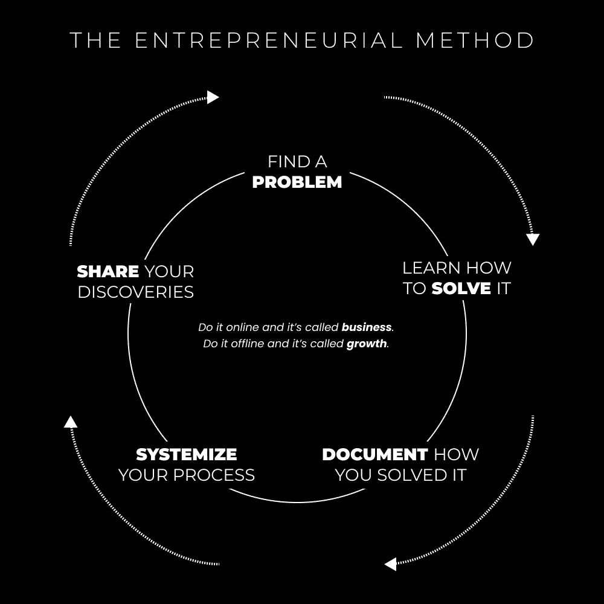

# 如果你很有价值，就开始一家一人公司吧。

> 原文：[`thedankoe.com/letters/if-you-are-valuable-turn-yourself-into-a-business-with-5-repeatable-steps/`](https://thedankoe.com/letters/if-you-are-valuable-turn-yourself-into-a-business-with-5-repeatable-steps/)

自力更生是我的一项价值观。

我会争辩说，这是推动我做的事情的驱动力。

当人们会说类似的话：

***“是时候扩大你的业务了！你需要开始招聘！你为什么不做广告？***“

我加倍投入于建立需要我投入更少时间的数字资产、杠杆和产品。

***“你必须继续做客户工作。高价值项目才是关键，兄弟！”***

我在转型为顾问后停止了自由职业。我将我的顾问业务转变为一个混合项目。这个混合项目现在是一个小组。

每一次迭代都增加了提供的价值，同时减少了我的投入时间，这样我就可以专注于建立更多的杠杆（比如写我的书和在多个平台上成长——这并不是作为初学者你应该关注的事情）。

***“你需要全力以赴地做 TikToks 和短视频！未来就在那个方向。”***

所以我加倍投入于长篇[通讯、播客和 YouTube 视频。](https://2hourwriter.com)

经验教训：如果你想“做自己喜欢的事情”，不要陷入短内容陷阱。专注于创造深度和权威。这就是人们愿意为之付费的。

（这仅限于商业。在我的个人生活中，我甚至更加固执。）

我为自己做的最伟大的事情就是忽略所有人的建议。我不在乎雇佣某人修复我业务的一部分，*我想自己解决这个问题。*

固执？是的。

耗时？是的。

（好吧，差不多吧，我在用创意工作赚得第一笔钱后大约花了 3 年时间才达到现在的位置。这比 4 年的学位时间还要少。不可预测性是吓跑人们的原因。）

我是否比其他任何自由职业者都学到了更多，并且享受其中的每一刻？是的。

我坚持我对未来的愿景（正如我总是鼓励你们做的）：

+   每天工作 3-4 小时，直到我生命的最后一刻。

+   建立我想建立的一切并获得报酬的灵活性

+   有足够的钱来无忧无虑地生活。建立一个价值十亿美元的公司对我来说没有吸引力。

+   有足够多的时间去追求生活中的重要事物，如精神、自我发展和培养真实的人际关系。

+   不依赖任何人（无论是员工还是我网络中的人）来促进我的个人和职业成长

当然，一开始可能不可能，但这就是重点。这是一个需要在 5-10 年内实现的愿景。你必须攀登一人企业阶梯的每一级。

这就是我们在这里要讨论的。

## 商业作为自我延伸的一部分

> 互联网使得八亿个垄断成为可能。
> 
> — Naval (@naval) [2020 年 11 月 29 日](https://twitter.com/naval/status/1332968723133517825?ref_src=twsrc%5Etfw)

人类能做得比任何其他生物更好的事情是：

1) 有一个想法

2) 使其成为现实

通过意识、注意力和专注力，我们获得了构建、创造和制造的能力。

*这难道不让你感到震惊吗？*

我们可以有一个愿景，聚集资源，并一层层地构建我们居住的世界。无论是非物质的还是物质的：

语言、建筑、技术、产品、服务、营销活动、文化、社会、学校体系、科学、哲学等。

*似乎我们在地球上的角色就是解决本地问题。* *知道问题具有系统性，而非个人性，以及解决本地问题会导致解决全球问题，甚至宇宙问题**。

任何人都可以做到这一点。

问题是什么？

限制性信念、编程思维和缺乏自信阻碍了大多数人。

在工业革命之前，每个人都曾是企业家。我们会寻找维持我们生活所需的资源。

> 每个人都是内容创作者。
> 
> 有些人只是将他们脑海中的内容分享给世界，从中获益。
> 
> — 丹·科伊 (@thedankoe) [2022 年 6 月 21 日](https://twitter.com/thedankoe/status/1539176803931242502?ref_src=twsrc%5Etfw)

由于从一开始就满足了众多基本需求，以及美元的创造，事情已经发生了变化。

我们祖先的心理在现代环境中被囚禁。就像一个在格子间里的猴子，由于缺乏内在动力（以及与这种动力相关的神经递质）而随着时间的推移在心理上逐渐分解。

为什么会发生这种情况？

文化和社会的熏陶。我们被熏陶去依赖除了自己之外的一切。

我们在学校被根据表现和遵守规则来评分。我们服从我们的父母，并且很可能不加质疑地采纳了他们的信念体系。即使那些质疑过的人，仍然有一些残留的无意识影响他们可能取得的进步。

答案是什么？

在所有方面都实现自给自足。

主权、个人责任、自我意识、自信、自我教育、自我利益，以及一套你可以为之努力、从中学习并传承经验（足够多以至于你可以从中获得收入）的价值、目标和优先级。

这就是单人创作者企业建立的基础。

**你的品牌** **（你的业务** **的展示方式**）** 是从你的目标愿景中创造出来的。你在建造什么？你正在引导人们走向何方？

**你的内容** **（你吸引人们关注你的品牌的方式）** 是从你正在精炼的兴趣和技能中创造出来的，以实现你的愿景和目标。你的目的是在教育、娱乐和激励你的自我发展旅程中。领导者吸引追随者。

**你的产品** **（你通过价值获得报酬的方式）** 是从你对现实的映射中创造出来的。也就是说，一个人们可以使用它来更快地解决问题的过程、系统或工具。那些你固执地想要解决，最终导致你拥有独特视角和解决方案的问题。

最有利可图的细分市场是*你自己*。

作为一位神圣的创造者，你的工作是取得进步，接触新想法，并*使用*这些想法来推动人类进步。

通过传递加速你追随者学习的工具，世界将继续按照应有的方式发展。

我倾向于相信社交媒体就是为了这个原因而创造的。全球沟通的问题得到了解决，可能是为了钱，但产生了没有人能想象的影响……也就是说，有一个想法被实现，开辟了在无限可能性领域建立新事物的空间。

*你会尽你的一份力吗？*

## 企业家方法（明白了吗？就像科学方法？）

<picture fetchpriority="high" decoding="async" class="wp-image-762"></picture>

大多数人手头都有丰富的信息、技能和经验。

唯一没有改进自己生活任何方面的人（是他们自己没有改进）。

*每个人都是企业家，有些人选择在公众面前展示他们的价值。*

对于那些还在我身边的人，这里有一个将你自己变成企业的 5 个步骤循环：

### 1) 发现问题

所有故事、营销和产品都围绕着解决问题。

*“床边有一个冷点。”*

如果这是故事的开头，那就意味着有问题。它开启了一个好奇心循环，让人们想要了解更多。

问题是人类行为的根源，无论是真实的还是虚构的。它们是导致前进进步的原因。[创造力是关于*创造*最佳解决方案，或者提供最大清晰度。](https://thedankoe.com/how-to-make-money-as-a-creative-on-the-internet/)

不喜欢你现在的处境？这时多巴胺出现，让你对自己的豪华汽车和豪宅的欲望感到满意。

不喜欢你的外表？想要赚更多的钱？

你对解决这些问题后生活会是什么样子不感到好奇吗？

无论问题是什么，不要否认或给它贴标签。要进入它。

向着那些欲望前进。这是你唯一能发现你是否真正想要它们的方法。

当然，你会发现那不是你想要的，但唯一的其他选择就是原地不动。

是的，你可以也应该享受当下，当你需要的时候它就在那里。但压抑你的欲望不会带来任何好事，或者任何事。

你必须消除这种业力，[更接近揭示你真正的目的。](https://thedankoe.com/how-to-profit-from-solving-your-own-problems/)

### 2) 尝试不同的解决方案

> 系统、绝对和硬性建议有其位置，但它们剥夺了你“弄清楚”问题、自我实验和得出自己结论的能力（这是你成为真正的专家的方式）。
> 
> — 丹·科伊 (@thedankoe) [2022 年 8 月 17 日](https://twitter.com/thedankoe/status/1559926188897976328?ref_src=twsrc%5Etfw)

解决问题的最糟糕方式是只研究一个视角，并将其视为教条。

就像做生意一样。

如果你开始研究如何解决你的金钱问题，并且只选择从教一个商业模式的人那里学习，你就是在自毁前程。

你的工作是汇集多个视角，让真相在中间积累。

从这些视角的交叉中，你会注意到模式。

这些模式是你需要关注的。它们是推动结果的杠杆原理，也是创意发挥的地方，比如连接点、做出新的发现，以及拥有你真正记得的解决方案。

假设你研究了 3 种不同的视角（商业模式）来解决金钱问题：

1.  自由职业代笔写作

1.  开始一个电子商务品牌

1.  开始一个营销机构

你会注意到这些模式：

+   你需要一个吸引正确人群的引人注目的品牌

+   你需要有价值的内容，以建立权威并得到分享

+   你需要一个人们真正想要（并且能够得到你所说的结果的）提议

+   如果你没有通过内容建立受众，你需要一个获取客户的策略（如广告、SEO、赞助帖子等）

+   你需要理解人类行为，并将其应用于我们列出的所有事情

从那里，你可以选择最适合你的商业模式。你的重点将放在基础之上，你将比那些陷入战术的人增长得更快。

### 3) 记录你是如何解决的

如果我能回到过去，我会改变的一件事是比现在更早地开始建立受众。人们很难认真对待这个建议，因为他们看到的只是一个巨大的差距。

人们看到我有数十万的关注者，就到此为止了（[不准确的认识可能会伤害你的决策](https://thedankoe.com/5-ways-to-learn-10x-faster/))。

他们看不到的是，我只是一个普通的家伙。

+   我在我的生活中识别了一个金钱问题

+   我曾经是一个年轻、贫穷的大学生，名下不到$0

+   我坚持自由职业来解决那个问题

+   我看到了结果，并在网上[写下了它](https://2hourwriter.com)

+   我以减少客户工作时间为代价，调整了我的品牌

+   我忽略了常见的商业建议，质疑了人们告诉我如何做事的方式，并通过遵循步骤#2 创造了盈利的提议

+   我继续玩受众增长的游戏，现在人们认为我是一种名人

我试图告诉你的就是，你必须走进竞技场。仅此一项就会为你打开一个全新的世界。之后，就是保持在这个竞技场上了。

**旁白**：最近有人问我是否应该开始建立受众。他们问这需要多长时间，是否值得。我的朋友，告诉我。*如果你打算（并且享受）余生都做这件事，时间长短又有什么关系呢？*

即使你缺乏经验。如果你没有那些成果，你不必写关于“作为自由职业者赚取六位数”的文章。然而，你可以教育人们你正在自由职业的技能，并谈论你在发展自由职业业务中学到的东西。

当学习的人比他们领先一步时，人们学得最好，而不是领先十步。（我们都知道跳过九步会怎样，快速致富计划警告！）

这不仅建立了权威，使吸引客户变得容易 10 倍，而且你正在为你的真实自我建立声誉。

### 4) 提炼成可复制的流程

我在商业上为自己做的最好的事情就是固执和自力更生。

我会购买课程和指导策略，但将它们作为指南，而不是法律。没有教学是完全正确的，大多数系统都可以得到改进。

但是，我永远不会雇佣别人为我做这项工作。我想创造我自己的写作、网站、着陆页、产品、电子邮件营销、促销和其他一切。

如果你雇佣别人为你做这件事，你将错过可以转化为可盈利的现实的实际经验。

再次强调，这就是为什么我总是强调*通过实践学习*，或者进入竞技场并真正地做一些事情。

一旦你有了知识（通过直接经验）和结果，你可以自我反思，并教别人如何更快地做到这一点。

这时，免费咨询、内容和帮助就派上用场了。你必须测试这个过程，看看它是否能带来结果。

然后，你要求提供推荐信，完善你的流程，开始收取更多费用，重复，一旦你建立了流量课程（通过内容、受众增长和建立电子邮件列表），就进行产品化。

个人成长 = 商业成长，但只有在你在网上发布内容时。

### 5) 帮助那些想要被帮助的人

*生活的意义是什么？*

从我在尝试解决这个问题时看到的模式（看我在那里做了什么？），归结为两件事：

**1) 提升你的意识**

这究竟意味着什么？

这意味着你正在积极地探索现实，未知。你正在解决你自己的问题（这些问题扭曲了现实），取得进步，并直接意识到现实呈现的教训、洞察力和模式。

你正在使未知变为已知。无意识变为有意识。不可预测变为可预测。无意义变为有意义。

你满足了你的基本生存需求（参见：马斯洛的需求层次理论），这样你就可以从一个非需求状态帮助世界。真实性。

然后，你可以继续进行第二步。

**2) 提升集体意识**

从本质上讲，你传递你的现实地图，以便其他人可以更快地导航。

这是提升你自己的意识的一个特征，因为你将越来越少地贡献于虚假信息的传播，同时影响那些频繁与你互动的人。

当涉及到商业，并且互联网已经成为一种现象时，你可以通过在网上分享你的经验来加速这种“集体意识提升”。

你通过免费内容和付费产品帮助人们解决金钱、关系、健康和幸福问题。

内容是地图的碎片。

产品是整个地图。

人们愿意为聚合、便利和速度付费。（如果你不相信这一点，我知道你还没有开始你的生意）。

问题是，你只能帮助那些想要被帮助的人。

如果某人还没有达到解决问题的经验水平，以至于这个问题在你意识中有所体现，那么你的教学对他们来说就没有意义。

并且，你必须接受人们讨厌他们不理解的东西。等待来自边线的负面评论！

我将以这句话结束：

> “智慧之口紧闭，只对理解之耳开放。”
> 
> 《基巴尔颂》

周六愉快。

*丹·科*

### 本周发生了什么

新的 YouTube 视频发布，名为*如果你对自己的未来不确定，这个视频适合你*。

[在这里观看。](https://youtube.com/c/DanKoeTalks)

一档播客介绍了你的大脑是如何运行生命游戏的超级计算机（以及如何玩好这个游戏的实用见解）。我还有两个播客已经录制完毕，准备发布啦 🙂

[在这里收听。](https://open.spotify.com/episode/7EYNhtS8V9nKf5nFu7Dg2v?si=da61ea21ce42478b)

在《现代精通》中，我发布了《如何建立人脉、成长并获得关注你的内容（无需购买股份）》的文章。如果你没有投资资金，这个策略将帮助你作为新手成长。

[读者可以加入，只需 5 美元。](https://modernmastery.co/letter)

***如果你需要更高级的帮助，请查看以下免费和付费产品。***
