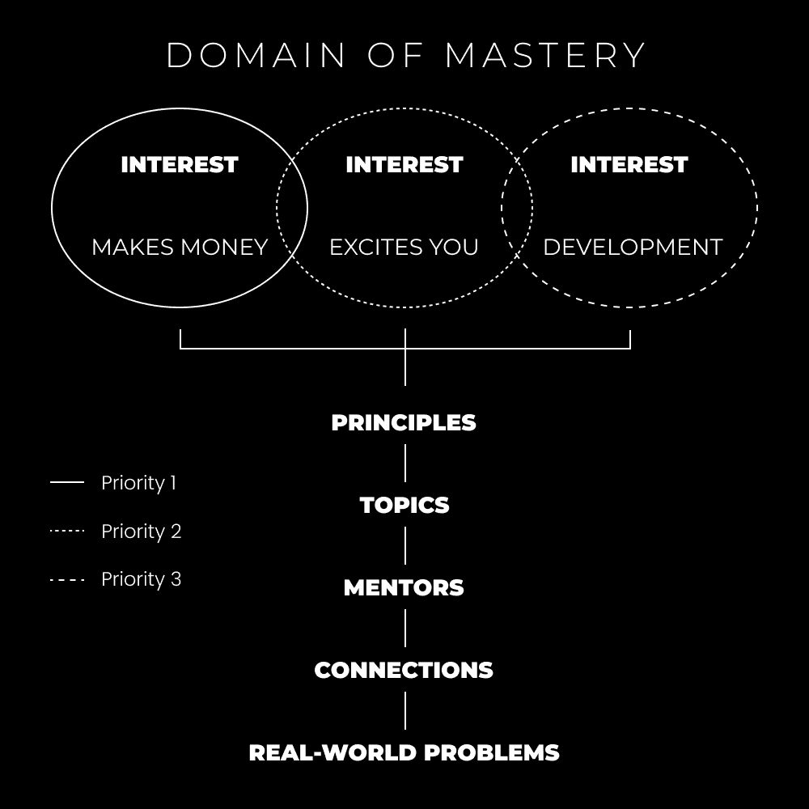
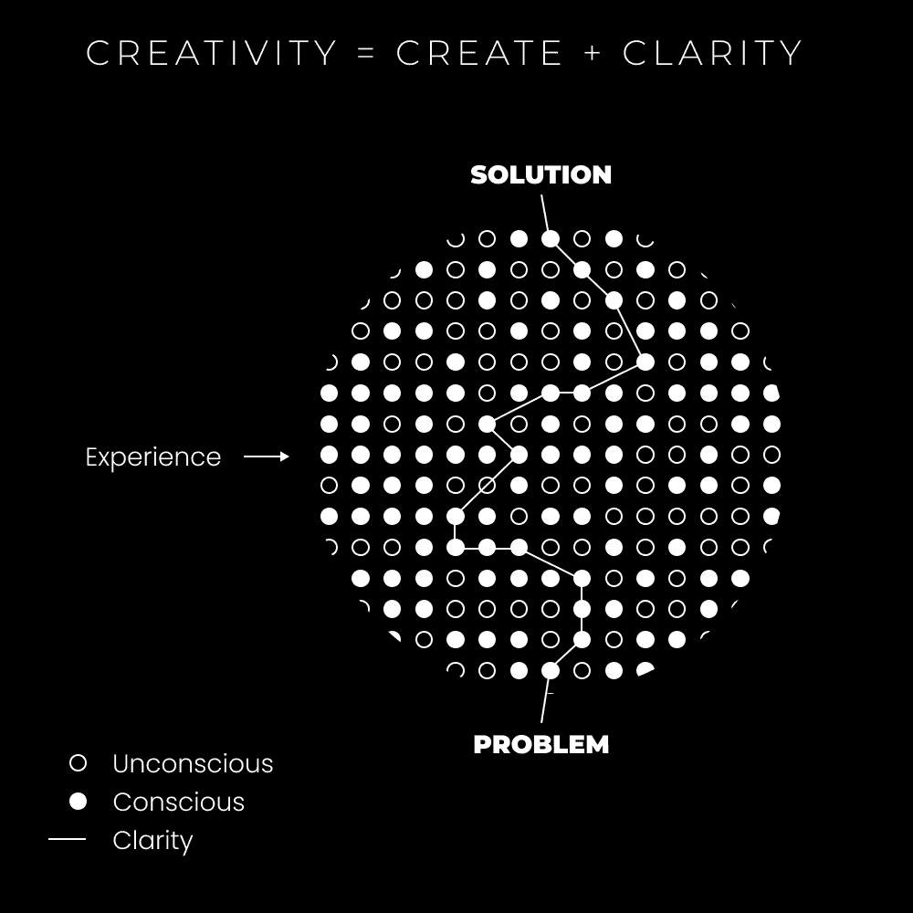

# 如何发现（并追求）你的人生使命

> 原文：[`thedankoe.com/letters/how-to-discover-and-pursue-your-lifes-work/`](https://thedankoe.com/letters/how-to-discover-and-pursue-your-lifes-work/)

社会是一种集体幻觉。

**问问自己这个问题：**

*你在成长过程中是如何判断什么是真什么是假的？*

意味着，你是如何解释那些编程你心中复杂系统的正面或负面反馈的？这导致你的无意识决策、思维模式、你如何感知现实，以及构成你直接体验的一切。

系统从“不好”中学习，并加倍投入“好”的方面，以固化与人类生存相关的神经网络。

再次提出问题，从你出生的那一刻起，你是如何判断什么是真什么是假的？

你从你的父母、学校体系、大众媒体、可能还有大学，以及其他社会结构，如宗教组织那里学习，对吧？

再次问，当你父母长大时，他们是如何判断什么是真什么是假的？

你的学校老师是如何判断什么是真什么是假的？大学教授？被大量操纵并倾向于大学水平信息的谷歌搜索结果？也许维基百科？由大学和那些上过大学的人创建，由大学生用来创建将在谷歌其他地方出现的论文？

如果你质疑你的信念足够多，你最终只会得到游戏的碎片。你最终会理解，我们用语言可以理解的一切都是人类构造，它们没有绝对真理的基础。

这些构造是锚定你的心灵到现实的东西。这些构造创造了我们无意识地构建进的游戏。

当你意识到这个游戏时，你可以学会如何赢得它。

当你不知道这个游戏时，你只是另一个构造。一个锚点，帮助玩家导航并赢得游戏。一个 NPC。

**看到**：键盘战士、政治狂热分子、圣经敲击者、当天的戏剧性事件，以及其他被许多人的心灵所关注的人（通常是通过媒体），要么在他们中引起情感反应（消费者、无意识、无意识、无思维等），要么被用作避免的反馈（创作者、有意识、有意识、有思维等）。

思考这个问题。你可能并不像你想象的那样独特。我并不把自己排除在外。没有人被排除在外。

## 脱离条件化路径

很少看到有人过着充满激情、充满活力的人生。

很少看到有人愿意“整天工作”。

构建、写作、沉思、好奇、体验、深入未知，以及冥想那些让他们夜不能寐的问题。

必须有所改变。

如果你的未来是社会教育和条件的结果，那么可以肯定地说，你将拥有与其他人相同的未来。坦白说，*这听起来并不那么吸引人*。

> 如果你迷失了方向，答案是教育。
> 
> 如果你受过教育，答案是行动。
> 
> 如果你正在行动，答案是持续性。
> 
> — 丹·科伊 (@thedankoe) [2022 年 3 月 29 日](https://twitter.com/thedankoe/status/1508796620569206784?ref_src=twsrc%5Etfw)

当你开始追求自己的道路时，你会感到迷茫。

任何有价值的事情都是不可预测的。没有一条固定的路径。你不能期望有，因为如果有，学校就会教授。收入最高的人不是那些被社会构建的职业训练的人。任何人都可以做到。这就是你成为“机器上的齿轮”的方式。

你之所以在读这封信，是因为你有一种（好的）对生活中更多事物的渴望。你想要弥合工作和生活之间的差距。你想要在你全力以赴追求的领域过上充满活力、充满激情和深刻满足的生活。

我可能无法给你一条通往更多金钱、激情和满足感的确切路径——但我可以给你一个大致的指南。

在人生的新道路上迈出第一步，你需要的是*教育*。

精确地说，是自我教育。你必须恢复你孩童般的好奇心，深入感受它，并让它引导你度过一生。有些人会用直觉、你的“召唤”、你的目标或其他任何指代挖掘你内心智能声音（每个人生来都有的）的词语。

一个好的开始是回想你的童年。你对任何事物有自然的亲和力吗？你是否倾向于特定的兴趣？有些人可能对声音有轻微的倾向，使他们想进入音乐领域。

我最近意识到，我长期以来一直在压抑我的好奇心。作为一个青少年，我痴迷于像弗兰克·杨这样的怪人，一个精神健身者，他会谈论意识和其他神秘话题。我想假装我理解他在说什么，但实际上我没有。

如果我深入那个兴趣，它就会为我的好奇心开辟新的探索路径：

+   我如何从中获得收入？如果我痴迷于解决这个问题一年——它就会发生。

+   意识工作如何帮助健身？或者反过来呢？瑜伽呢？它对身体健康之外还有什么好处吗？

+   如果有任何营养方案，会帮助提高我的意识水平吗？

另一个反思——我一直致力于避免企业生活，并“做我喜欢的事情”谋生。我知道这并非不可能，那么为什么不把我的生命奉献于找出答案呢？

深入研究——我是指真正深入（随着时间的推移）——某个特定兴趣，这是你追求一条真正独特路径的方式。

如果你选择了电子邮件营销，你的好奇心可能会把你引向 1000 个不同的方向。你将不得不学习文案写作、电子邮件营销软件、序列、社交媒体来增长通讯录等。*所有这些再次为你的好奇心探索开辟了新的道路*。

你的好奇心最终会引导你到一个似乎与你最初选择兴趣完全不相关的东西。这使你与追求固定路径的众多个体区分开来——[给你提供信息杠杆，你可以为此收取大价钱。](https://thedankoe.com/the-future-of-work-will-be-play/)

> 我们生活在一个无限杠杆的时代，真正的智力好奇心所带来的经济回报从未如此之高。
> 
> — Naval (@naval) [2017 年 6 月 21 日](https://twitter.com/naval/status/877321503896854528?ref_src=twsrc%5Etfw)

你能看出仅仅养成自我教育的习惯（当然还有执行）如何引导你走向想要的生活吗？*这是对永远不依赖任何事物但依赖自己来实现潜能的简单承诺*。

金钱不再是可选择的。对金钱的需求被编码在系统中。我们不再住在棚屋里或自己狩猎食物。我们的心理仍然是相同的——为了生存而设定——但我们的生活环境却完全不同。

你应该首先开始教育自己的是那种最终能帮助你赚钱的技能。这可以是任何东西，但通常可销售技能是最好的选择（而且入门级信息在网上很容易找到）。我们稍后会更多地讨论这一点。

主宰领域要求你选择 3 个兴趣点。这些可以在任何时候改变。这些只是追求你好奇心的起点。通过研究这些并提高你的技能集，你正在深入未知。你正在让自己接触到学校不会教给你的信息。

大多数人不懂的是，为了成为某一领域的专家，你必须成为万事通。如果你想在这个领域有所创新，你必须深入到意识的冰山之下。一个没有心理学深厚知识的健康教练无法获得客户成果。他们会认为这是一个卡路里摄入问题，而根本问题是社会条件和习惯形成。

成为专家是可以训练的。我们并不是试图去做别人可以被训练去做的事情。

当你深入这些兴趣时，你会意识到它们都指向同一个东西——那就是生活本身。宇宙是一个巨大的心智。一个由复杂和创造性的系统组成的网络。

这里有一些提示，帮助你开始好奇心探索：

**1) 学习原则**

当你学习 Photoshop 时，除了知道如何导航软件外，你只需要知道几件事——原则。

选择、遮罩和调整层。

当你理解了这些，你几乎可以创造出你需要的一切（除非项目需要更多）。

这几乎适用于任何事物。当你理解了原理，你就可以完成该领域所需完成的大部分工作。

**2) 寻找“导师”**

当我说寻找导师时，我的意思是找到一个你能从中学习的声音一致的人。有些人可能被这封通讯的哲学或精神方面所吸引，尽管我谈论的是商业。

你可能或可能不会从那些只谈论商业的人那里得到有用的信息。

寻找书籍、社交媒体账户、播客主持人、YouTube 博主以及你能找到的任何关于你感兴趣主题的信息。如果他们的教导对你没有影响，找到另一个声音一致、你能理解（并且乐于学习）的导师。

**3) 开始一个现实世界项目**

我总是建议开始建立一个个人品牌，在网上发布你的学习成果。如果你想要看到真正的进步，[仅此一项就能迫使你理解赚钱的技能](https://open.spotify.com/episode/5DdgoAufTrFF6tzd4B6zXy?si=fae0ddd202224a05)。文案写作、营销、说服、销售等都是发出有影响力信息并将你的兴趣转化为收入所必需的。

记住，仅通过学习你能学到的东西是有限的。如果你想开拓新的思维路径去探索，你必须应用你所学的知识。

如果你只是把东西记在脑子里，你将会陷入一个循环，反复学习同样的事情，却无法提升到下一个层次。你需要真实的反馈。

**4) 注意寻找联系**

这引出了我们的下一个观点，但一旦原理在你脑海中稳固下来，并且你正在积极地努力/失败于你的现实世界项目——你将开始在日常生活中识别出模式。

创作内容给生活带来了全新的乐趣。模式识别增加了大脑中的多巴胺水平（因为你正在*狩猎*以生存）。你开始认识到以前从未认识到的东西——因为它们现在实际上有用途了。

当你有一些可以应用你的日常经验的东西时，你开始欣赏生活所能提供的深度——比如在网上写内容。

所有这些都属于[智能模仿过程](https://thedankoe.com/how-to-copy-your-way-to-success-instead-of-mediocrity/)——简而言之，沉浸在一个有利于你目标的环境中，并坚持不懈地消除那些不利于你发展的干扰。

**旁白：**我的免费[7 天成为天才挑战](https://7daystogeniusideas.com)将帮助你以独特的方式研究、剖析并记录你对兴趣的见解。这就是你如何产生无限的内容想法，将你的创造力提升 10 倍，并通过更深入地探索你的专长领域来提升你的意识。

私人社区，现代掌握（Modern Mastery），将帮助你创作引人入胜的内容，扩大受众，并货币化你的知识（就像你看到其他人那样做，但认为他们比你更有经验）——[科伊信件读者可以在此加入，只需 5 美元](http://www.modernmastery.co/community/modern-mastery-hq-special)。

## 经验模型

肯·威尔伯——可能是最清醒的人——谈论了发展**状态**和**阶段**。

状态是暂时的。

阶段是永久的（或者说几乎是永久的）。

你可以在商业上有一个高收入月份——这是一个状态——但它可能不会每月都保持。

但是，如果你将你的商业杠杆发展到几乎不可能每月收入低于 2 万美元的程度，那就是一个阶段。

你可以进入心流状态，或者你可以发展到持续处于心流状态的程度（参见：开悟）。

你可以有一阵子的创造力爆发，或者你可以发展到拥有一个基本的创造力水平。

这对大多数特质、技能和生活的领域都是真的。

让我们把它想象成一个视频游戏。

你可以得到增强和加成——这些状态可以让你暂时表现得更好。

或者，你可以增加你的经验值（XP），为你的天赋树添加分数，解锁你不知道在低级阶段存在的游戏新阶段。

这强调了自我发展的重要性。这是不可避免的。如果你想在一个低技能劳动力工作不断被淘汰的世界中成功——[自我发展、持续技能获取和心智扩展是不可避免的。](https://thedankoe.com/how-to-make-money-as-a-creative-on-the-internet/)

这也是为什么我建议“发展”是你的掌握领域（Domain Of Mastery）中的一个兴趣点。

特别是认知或心理发展。

> 你大部分的问题都源于心理局限和障碍。
> 
> 如果你想要掌握生活的所有领域，心理掌握必须排在你的首位。
> 
> — 丹·科伊 (@thedankoe) [2021 年 12 月 4 日](https://twitter.com/thedankoe/status/1467169084806778882?ref_src=twsrc%5Etfw)

在我们继续前进之前，还有一件事：

当你最大化一个特定的特质时，你就停止了吗？

当然不是，你继续前进到下一个特质，并努力将其最大化。

更不用说，为了最大化任何特定的特质，你需要在相关的特质上取得某种形式的进步。

这也是为什么一些不健康的商人会遭受痛苦。他们在财务上很富有——但他们缺乏身体、心理和精神财富。

这也是为什么一些独裁者会腐败。他们在沟通和领导力的多个发展阶段上超越了——但他们的道德发展落后很多。

现在，这一切如何与商业相关？

随着你深入你的掌握领域，它将要求你进行一定程度的认知发展以达到下一个“阶段”。

当你达到这个第一阶段时，你就准备好开始货币化了。

你的任务是帮助人们比你更快地达到这个发展阶段。

你可以通过[出售一个创意解决方案](https://thedankoe.com/how-to-make-money-as-a-creative-on-the-internet/)来实现这一点，这将帮助某人更快地导航你的道路。

有趣的是——通过帮助他人达到你所在的发展阶段（无论是免费还是付费），你被迫组织信息并建立联系。

这就是为什么在线写作如此强大的原因。你必须努力组织信息（或整理意识）以便传达给他人。

教师比学生学到的东西更多。

这将为你更快地达到下一个发展阶段腾出空间。

当你将你所理解的一切打包并托管在数字世界中——你再也不用担心它了。你可以在此基础上构建。迭代。

通过在 2-3 年的时间里持续这样做，你将突破新的发展阶段，帮助他人达到那里，并在生活中获得深深的满足感。

## 发现你的人生使命

如果你正在阅读这篇文章，我假设你不知道你的人生使命是什么。

没有人能告诉你那是什么。没有人能告诉你如何确切地找到它。没有人能帮助你发现你的人生使命。这不是我的。这不是你教授的。这不是你父母的。这不是任何其他将它的欲望和需求投射到你身上的实体。这取决于你拥抱“锻造自己的道路”和多年探索中拼凑“人生使命拼图”的必然不确定性。

我不能给你一个清晰的发现它的路径。这正是它的美。只有你通过持续的自我发展，将你的信息传播到世界上，并在你的创作上进行迭代，直到完美的想法突然出现在你的脑海中（只是为了你继续迭代和精炼你认为你的人生使命是什么）。

然而，有一些问题你可以开始思考，以激发你的大脑。

根据乔·迪斯彭萨的说法：

> 思考构建了你大脑中的电路，为体验做准备。

意思是，如果你有意识地积极扩展你的意识，寻找你的人生使命，你就能找到它。我“找到”我的使命是在去年，在我概述了一本我一直想写的书之后。我无法解释那种感觉。

在此之前，这里有两个问题供你冥想：

1.  你想在世界上解决什么大问题？那个让你夜不能寐的问题。

1.  你想在生活中解决什么大问题？那个你知道在阻碍你的问题。

如果你想要更进一步——如果你能有一个关于世界的任何问题得到解答并亲手递送到你手中，那会是什么问题？从这里开始吧。

这就是如何作为一个人发展自己。

你开始提问以揭示问题。

你通过自我教育和自我发展来解决这些问题。

你通过追求你真正的好奇心（你的精通领域）来发现你可以为他人解决的问题。

一旦你解决了足够的问题，你将达到新的发展阶段。

现在，你可以帮助那些在你之下一个阶段的人以创造性的方式解决同样的问题。

如果你能够坚持这条道路（一旦开始，几乎不可能停止），你将理解这封信的每一个方面。

这里有一些我看到人们遇到的问题，这些问题阻碍了他们的成长：

+   他们不认真对待自己或他们的信息。他们过于害怕外界的评判，这稀释了他们的信息，并且他们陷入了发展的某个阶段。

+   他们过于关注金钱。一开始这没问题，但随着时间的推移，会导致你在自己建立的工作中缺乏意义和满足感。它变成了另一种朝九晚五的工作，而不是你的人生事业（工作与生活的结合，以获得更深层次的满足感）

+   他们看不到持续自我发展的价值（或者他们拒绝发展那些支撑其他方面的重要方面）。因此限制了他们的个人、创造力和职业潜力。

总结一下：

选择 3 个你真正感兴趣的领域。

通过书籍和在线内容，从你兴奋想要学习的和谐声音开始研究它们。

建立一个真实世界的项目，不要压制出现的问题。你将需要在某个时候改变。随着你的发展，你将失去生活中的一些人和事物。

如果你坚持非传统的道路超过 6 个月——你将在深层次、内心深处理解失败是不可能的。

— 丹·科

**本周发生了什么**

一个关于如何利用互联网提供的无限杠杆作为创意人士赚取收入的 YouTube 视频刚刚上线。

[在这里观看新视频](https://youtu.be/V_oZNWJKPZI)

2 个播客上线了（每个只有 10 分钟）。其中一个能帮你节省多年因他人引起的情绪动荡和困扰。另一个将揭示赚取你想要那么多钱的途径。

[在这里收听](https://open.spotify.com/show/3lZRG3LCFZxKkQVSsCwoyN?si=053aec9ad5f4459b) 或者在你选择的播客平台上搜索“Koe Cast”。

达科塔·罗伯逊在 Modern Mastery HQ 进行了培训。我们提供了如何作为自由职业者进入推特代笔的建议。

[Koe Letter 读者可以以 5 美元的价格加入 MM](https://modernmastery.co/letter)
