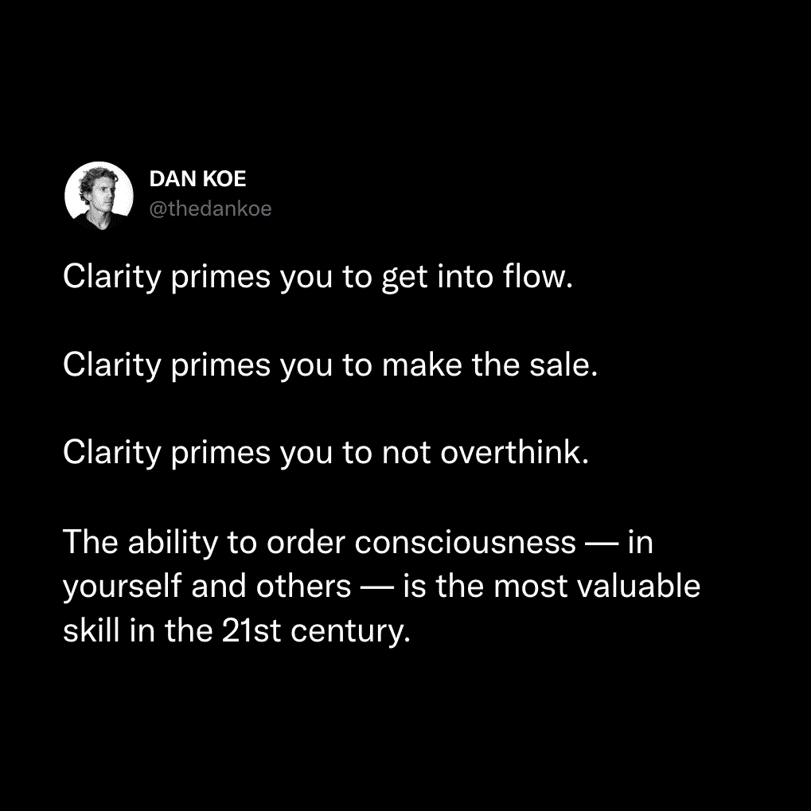
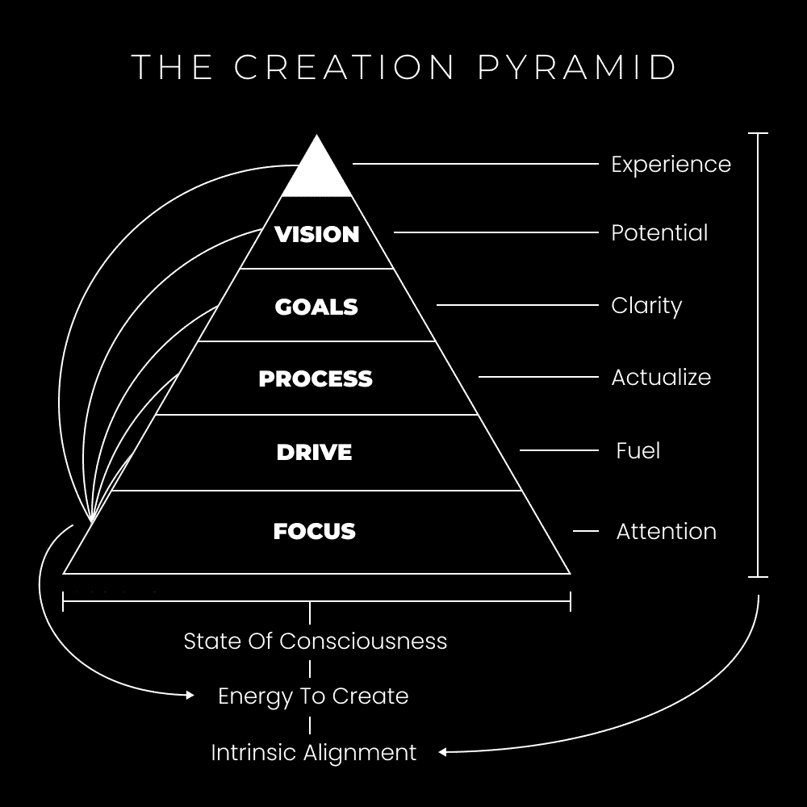
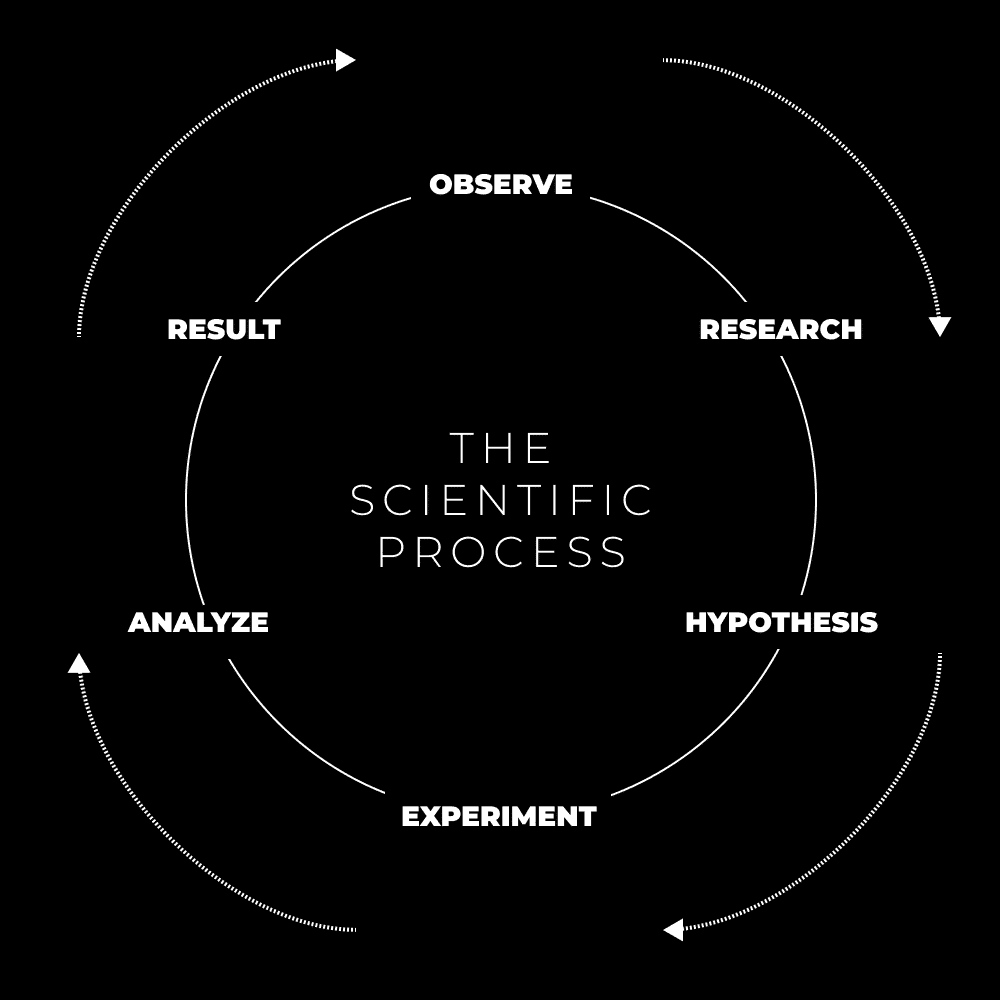
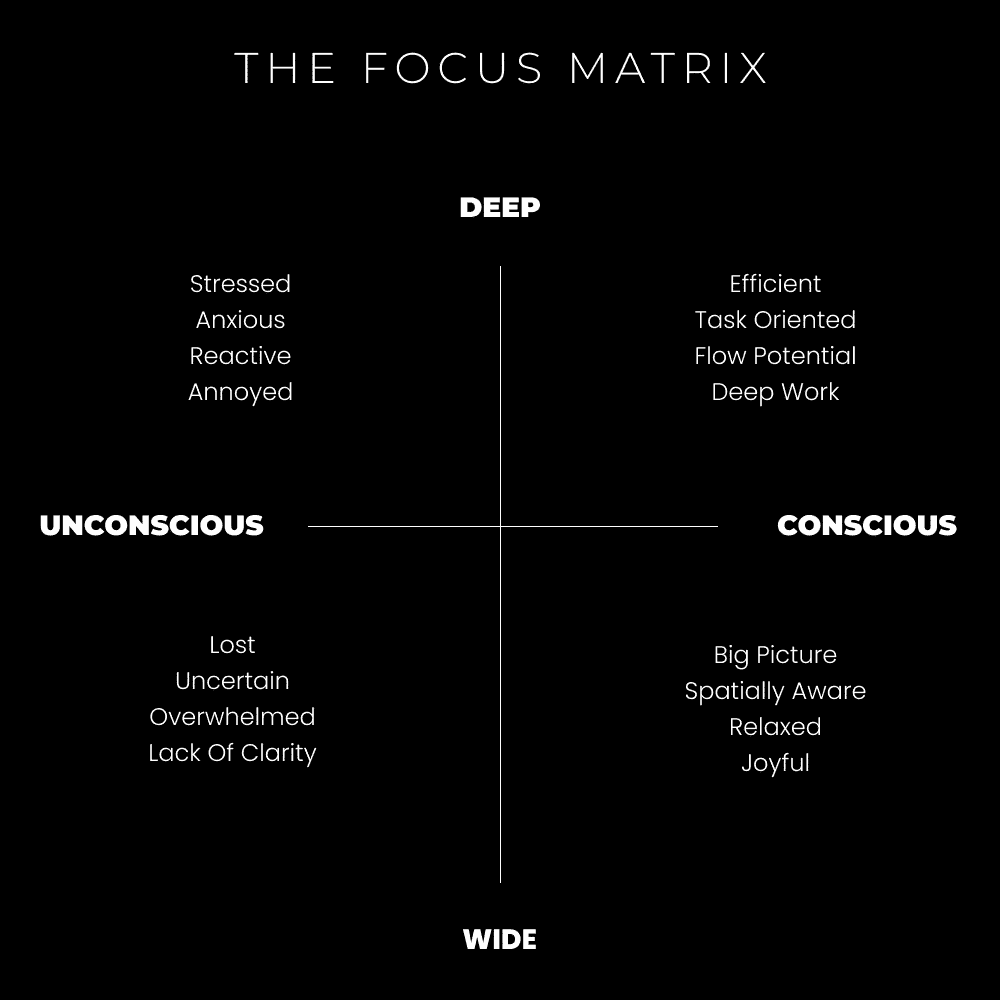
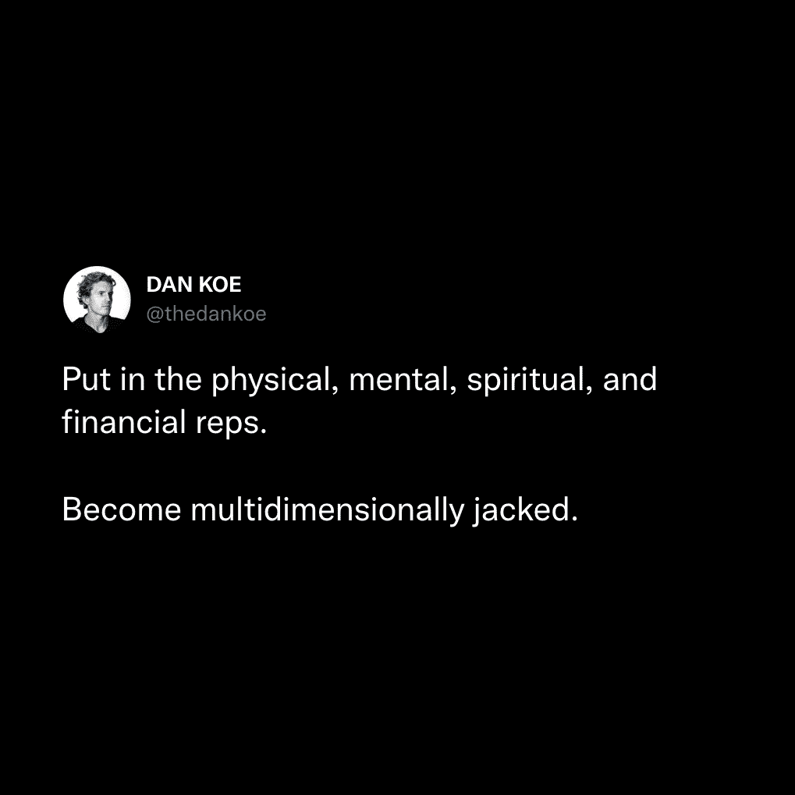

# 如何在最短的时间内创造一个有意义、有钱、有影响力的人生（尽可能快）

> [`thedankoe.com/letters/how-to-create-a-life-of-meaning-money-impact-as-fast-as-humanly-possible/`](https://thedankoe.com/letters/how-to-create-a-life-of-meaning-money-impact-as-fast-as-humanly-possible/)

如果我能把我的所有进步归功于一件事——那将是**清晰度**。即对意识进行排序的能力。清晰度使专注变得无缝，我们都知道在信息时代这一点有多么重要。

在我还是个孩子，不到 12 岁的时候，我会随身携带一个笔记本。那种你会在学校购物时买的“大学规则”笔记本。但这个不是用来上学的。这是我画奇怪怪物、机器人以及任何我年轻大脑能想象到的东西的地方。

这些画通常形状相同。一个有身体、手臂、腿和头的人形生物。有时我会让他们肌肉发达，有时又瘦又像外星人，有时有角，有时有光环。

随着我长大，我停止了绘画，但保留了这个笔记本。不是想象的人物，而是为我的未来写下了想象场景。如果你愿意，这是一个愿景板。一个我需要采取的步骤的地图。我会把这些贴在我电脑上面的墙上。每当我特别懒惰的时候，我的愿景就会直面我——提醒我我为什么在这里。

## 将梦想（或噩梦）变为现实

意识产生意识。思想产生思想。想法产生想法。项目产生项目……我可以继续说下去。

重点：如果你没有首先想象它，你就不能为自己创造一个未来的现实。

反之，如果你首先想象了它（或体验了它），你才能创造一个消极的当下现实。

特斯拉——这家公司——如果车轮、马车、马车、电和汽车在它之前出现，它就不会存在。

这引发了我们作为物种可能面临的最大问题。当然，我们是我们唯一经历它的，因为我们是我们唯一有认知能力去体验它的物种。

我在谈论心理时间或线性时间的概念。这是大问题。回忆一个熟悉的过去——你之前物理上经历过的事情——并且有相同的熟悉思想。这些思想将你的过去经验拉入当下。你实际上有相同的感官体验。你就是你过去的自己。

当你重复这些想法、情绪和经历时——你的大脑通过神经网络将这些模式固化。这就是习惯和常规形成的方式。这些在无意识中是危险的。你仍然是过去的那个人。一次又一次地活出同样的消极思想和感官体验。我们必须学会如何编程（内部）或被编程（外部）。**创造或被创造**。

未来的情况也是一样。你将注意力投射到基于你过去经验的可预测的未来，并对其感到焦虑。再次，你会在现在感受到这些经历，这意味着你在整个无意识的生活中并没有改变。

对于这些，每个都有特定的神经网络。一个是你老板造成的压力，一个是为了洗澡，一个是你回家后与配偶争吵。随着时间的推移，这些变得越来越无意识和灾难性。

大多数人醒来后，立即将注意力投射到一个有压力的未来，这是由于他们的编程。他们醒来时是过去的自己，有着每天早上都有的相同的负面感官体验。

解决这个问题的唯一方法就是深入未知。思考新的思想。接触新的想法。沉浸在一个有利于成长的环境中（我的战术压力概念）。建立导致积极潜在现实的项目。采取你被告知是“有风险”的不熟悉行动——因为说这些话的人没有经历过“风险”本身。

90%以上的人口都是一种行动上的矛盾。他们在自动化的“安全”和“确定”的道路上生活——在我们不断变化的世界中，这充满了最大的风险和不确定性。

## 21 世纪最重要的技能

我们已经了解到，心灵可以引起很多问题。这是因为心理熵——心灵倾向于混乱和无序。如果你[了解如何导航这些阶段](https://thedankoe.com/if-you-feel-lost-understand-these-3-phases-of-life/)，这并不坏。它们可以非常有益。然而，解决方案是*清晰性*。有序的意识。以非常直接的方式组织信息，使其生动起来的能力。从心灵到物质。

没有人知道他们生活中想要做什么。没有人把这看作是一种祝福。不知道自己想要什么意味着你可以在无限的未知潜力中创造自己想要的东西。我们将在未来的信件中更深入地探讨量子领域的科学。只需知道，未知是所有潜力的存在之地。如果已知，那么这种潜力已经实现了。你需要打破习惯，以你已知、熟悉和可预测的自我，在你的已知、熟悉和可预测的生活中生活。

现在，明白这是一个很大的话题。金字塔上的一切都值得有自己的信件。人们已经为金字塔的各个方面写了整本书。该死，我甚至正在写一本关于它的书。我们不可能在一篇帖子中理解这一切。所有未来的和过去的帖子都包含了这个内容。

在这封信中，我们专注于命令意识为自己创造一个积极的现实。以下是实现这一目标的步骤：

**1) 物质 VS 非物质体验**

> “我不是发生在我身上的事，我是我选择成为的人。” —— 卡尔·荣格

不要从唯物主义的角度来解读这句话。从非物质、经验的角度来思考。你现在是选择成为的那个人。就在现在。在这个非常时刻。在非物质世界中没有需要跨越的鸿沟。

当你进入最佳体验或心流状态时，你正在体验你渴望的感官体验。你不在乎那辆豪华车、房子或生活方式。*你关心它给你带来的感觉或体验*。

你现在就可以实现那种体验。

**不为人知的观点**：“假装做到你做到”是极好的建议。

从物质的角度来看，这让你看起来像是一个骗子。从非物质的角度来看，没有假装。你已经成为了那个人。物质世界会迎头赶上。

**2) 创建一个清晰的愿景**

我们如何进入未知？通过我们的大脑的力量来可视化我们想要吸引和通过意图努力实现的潜在现实。

有趣的事实：“意图”来自拉丁语 *intentionem*（主格 *intentio*）“伸展，拉紧，努力，努力；注意力”，来自 *intendere* “转向某人的注意力”，字面意思是“伸展”。

当你带着意图行动（在创造金字塔中的驱动者）——*你通过注意力向某个目标伸展*。

许多人 *说坏话* 关于“吸引力法则”，但可以这样想：通过一致和具体的可视化，你正在设定你的焦点。当你练习专注于你的愿景（而不是你的老板让你有压力）时，你开始解构你大脑中的无意识思维模式。

另一个例子：如果你相信你可以在网上赚钱（因为你对自己的愿景有清晰的认知），你将开始注意到赚钱的机会。*就像当你看到你以前没见过的某种车时*——然后你到处都能看到它。你正在积极地打开你的心扉，注意新的、未知的事物，并将这些经历“吸引”到你的生活中。

[通过具体说明你希望你的未来看起来如何](https://thedankoe.com/how-to-finally-stop-caring-what-other-people-think/)——你可以开始进入那种能量。

能量？像振动一样？你是什么意思？

你有没有“期待”去度假，并在那个当下感到兴奋？这就是我的意思。环境持有能量。自然持有能量。一切事物都持有能量。某种能量的频率是信息。我们的头脑处理和组织信息。停止从唯物主义的角度思考所有这些。

[如果你想有一个引导你完成所有这些的免费计划表，可以使用我的。](https://shop.thedankoe.com/planner)

**3) 将你的愿景逆向工程为目标**

创建目标的目的不是专注于它们，而是提供更多的清晰度并证明它是可以实现的。*如果你想的话，可以将其视为微观愿景。* 它们只是在这里提供额外的能量来源，以便在实现愿景的时候能够执行一个过程。

这里的一切都是可变的。这就是为什么这是一个如此庞大且难以解决的问题。我正在努力保证在一个成功被保留给理解《创造金字塔》的 1%的世界中取得成功。

我是如何做的呢？根据你试图创造的规模，将其分解为 3 个目标。如果你试图创造一个更好的生活，要考虑长远。写下 10 年目标、1 年目标和月度目标。

现在，我们可以通过执行一个特定的过程来完成这些任务、里程碑、检查点或“微观愿景”。

**4) 开始测试一个过程**

将所有这些阶段视为一个实验。除非你测试特定的部分，否则你不知道什么会产生结果。科学家们不会一开始就提出一个可复制的、能产生结果的过程。这可能需要几周、几个月甚至几年。

耐心、信仰和顺从在这里是必要的。你正在创造一个以前没有人创造过的现实。如果你想回到“安全”、“可预测”和“传统”的生活道路，请随意。如果不这样，就敞开心扉接受失败。

你每天可以执行哪些杠杆移动行动来实现你正在努力吸引和创造的现实的月度、年度、十年甚至终身愿景？

如果这部分让你感到焦虑，你需要自我教育并练习以提高你的技能。如果你感到无聊，你需要增加挑战。

**5) 利用内在驱动力**

好奇心、激情、目标、灵感以及意图都是你可以用来提高工作质量的工具。

这些因素都会影响你大脑中的多巴胺和其他神经化学物质。当你通过好奇心追求[获得灵感](https://thedankoe.com/how-to-copy-your-way-to-success-instead-of-mediocrity/)时，你会做得更好。当你有一个强烈的理由或目标时，你会做得更好。这些都是你可以随时利用的能量来源。

这些应该是内在的激励因素，而不是外在的。

**6) 控制 & 引导你的注意力**

这值得一篇完整的文章。现在，理解你可以从金字塔的任何级别获取能量。这些都是释放创造能量的选项。

注意力给予和接收能量。我们处理来自频率的信息，但只有当注意力被给予时，我们才能处理它。

当你给予无意识的注意力给消极能量——比如想象在工作中与老板的紧张场景——你就触发了那个能量源。存在能量的交换，你*感觉到*那种能量被浪费了。

通过管理你的注意力，你可以释放出能量，将最大努力投入到你的愿景中。

当你不确定时，将你的注意力集中在当下。扩展你的意识。打开你的焦点。并触碰到未知所持有的无限潜力和积极性。

**示例分解：**

你对未来愿景的一个方面是利用创意技能组合赚取 6 位数。我们可以更具体一些，你也应该这样做，但让我们将其分解为目标：

+   10 年目标：通过销售设计教程的内容赚取 6 位数（每月 2250 美元的 4 个客户或 99 美元课程的 84 次销售）

+   1 年目标：通过图形设计辅导赚取 60,000 美元并规划一门课程

+   1 个月目标：获得一位价值 1,000 美元的咨询客户

现在我们需要一个过程来专注于实现这一点：

+   每天发布 3 条推文来建立权威和公众简历

+   给与我帖子互动的 10 个人发私信，并运行他们通过[私信外联软脚本](https://modernmastery.co/community/modern-mastery-hq-special)

+   每天为你的产品或服务进行一次时间线推广

现在，利用某些内在驱动力。更好的是，通过我的[免费创意流程](https://7daystogeniusideas.com/)将其融入你的日常习惯中。

通过每天留出 1 小时来执行这一过程，进一步框架化你的焦点。

## 成为多维度强健的人

创造金字塔不仅是为了让你自己的生活变得更好。它可以应用于你个人和职业生活的各个方面。

*开始一个新项目？*

为其制定愿景，通过目标设定获得清晰度，减少采取行动的摩擦，并集中注意力。

*如何建立更好的关系？*

为你想要与你的重要他人互动的方式制定愿景，明确如何实现这一点，并框架化你的注意力。

*用个人品牌开始在线业务？*

**这就是你创建品牌的方式。**

你的愿景是你帮助他人达到的期望结果。达到那里的目标是你教育受众的内容。你的动力是吸引志同道合的人。吸引注意力和框架化受众的焦点是你帮助他们克服障碍的方式。

奖励：创建一个由你喜欢的图片组成的愿景板。我喜欢黑白摩天大楼（我以前梦想着住在大城市，黑白就是我的风格），你能在我的品牌中看到这一点吗？

你想要传达的感觉是什么？你希望通过环境、个人资料图片、颜色以及其他人类通过注意力处理的信息形式传达什么？这关乎体验。

创建产品或服务也是如此。期望的结果是什么？他们如何达到那里？你引导他们经历的过程是如何产生结果的？他们能否集中精力并真正实现这些结果？你让他们感到无缝吗？

下次你在任何维度（心灵、身体、精神、商业等）感到迷茫时，参考创造金字塔以获得清晰并创造你想要生活的现实。

— 丹·科

**本周发生了什么**

我为未来的全职创意人士、营销人员和独立创业者开设的学校——数字经济学——将于 6 月 14 日开始。 [价格在 3 天内上涨 100 美元。](https://digitaleconomics.school)

一段新的 YouTube 视频上线了，介绍了如何“复制和窃取”成功的方法。[在这里观看。](https://youtu.be/ShdG7cgGA2M)

一档播客上线了，主题是如何产生内容想法，而不在乎别人的看法。[在这里收听。](https://open.spotify.com/episode/0kMCOBqwgApt8m1QgAObvj?si=ac2ae5bf13bb4840)

在 MMHQ 内部——我发布了用来获得我的第一个 1,000 名粉丝的增长策略（无需与其他人互动）。个人品牌大师 Sana 发布了人们常犯的 15 个真实性错误。[Koe Letter 读者可以以 5 美元的价格加入。](https://modernmastery.co/letter)
