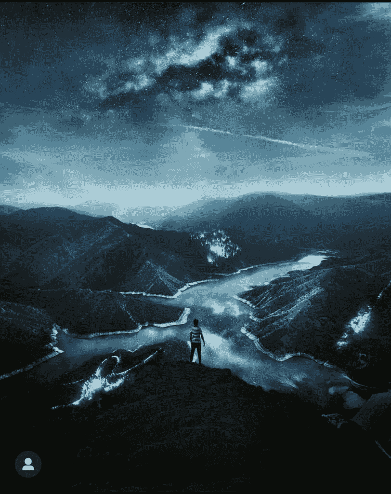
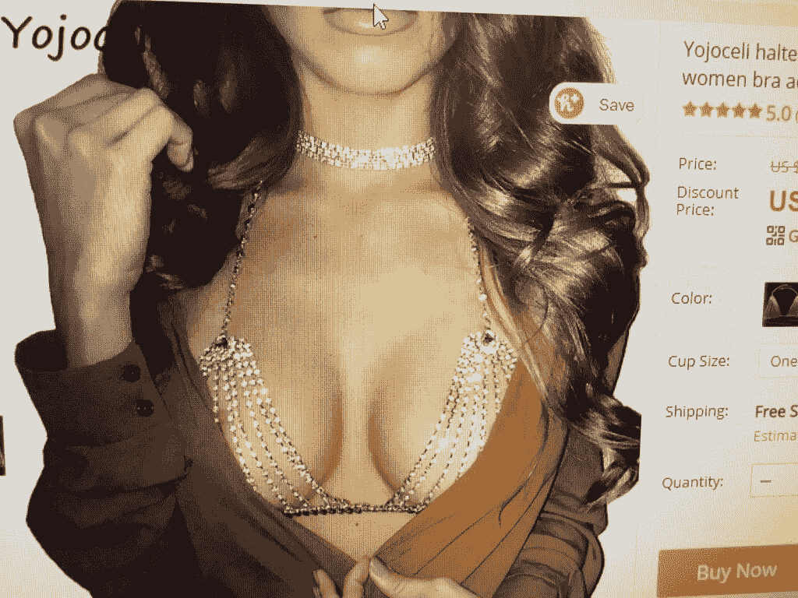
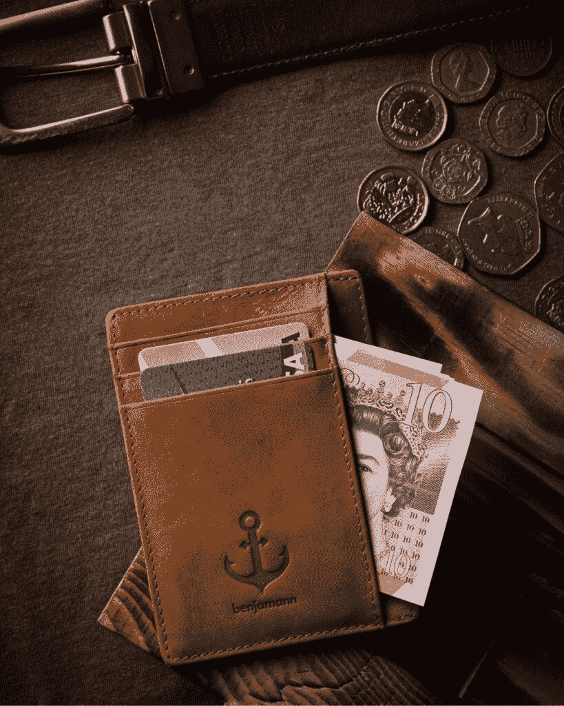
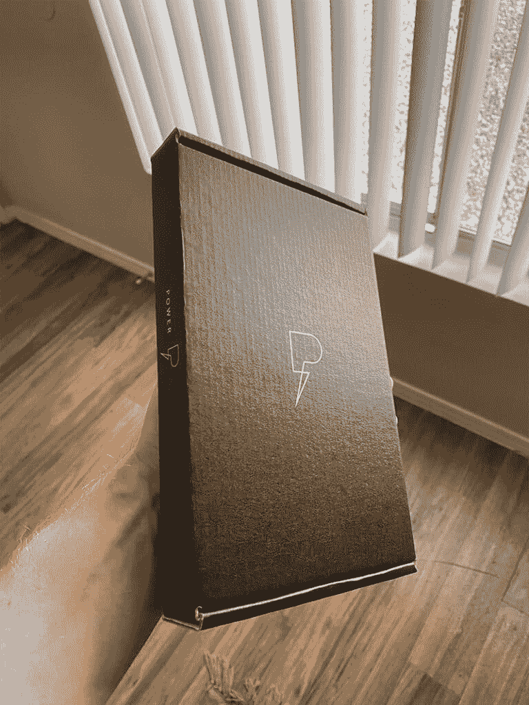

# 我尝试了 7 种在线商业模式失败（并将其转变为全职创意收入）

> 原文：[`thedankoe.com/letters/i-failed-at-7-online-business-models-and-turned-it-into-a-full-time-creative-income/`](https://thedankoe.com/letters/i-failed-at-7-online-business-models-and-turned-it-into-a-full-time-creative-income/)

我从小就非常警觉。

我知道一定有更好的生活方式。

好像我每转一个弯，都能看到人们都*不快乐*。

对他们的职业、老板、配偶、孩子、同事、自我、早晨、夜晚、一切都不满意。

这可能只是我接触到的环境或我的大脑所倾向的，但某种东西让我想避开这种“默认”的生活方式，就像避开瘟疫一样。

抱怨我手中的牌不会改变我的未来。

把事情掌握在自己手中是唯一的选择。

我将我 20 岁以下的年轻生活奉献给了个人责任、自我教育和追求主权。

如果每个人都被告知要观看新闻、上大学、找工作、65 岁退休，并按他们所说的去做——这不会导致每个人都得到相同的结果吗？

这不是导致全球不快乐的根源吗？

唯一的选择是：**做与他人完全相反的事情**。

当每个人都盯着电视时，我则把目光投向了在线教育者。

当每个人都下班后坐在沙发上时，我则直接去健身房。

当每个人都让有毒的主流新闻充斥他们的头脑时，我则阅读关于灵性和实现我全部潜能的书籍。

## 我存在的祸害：传统的职业道路

我真正兴奋想做的事情之一就是上大学。我知道这将给我一个机会去尝试新事物，结识新朋友，最终：

延迟我建立可持续收入来源的时间。

当我踏上 ASU 校园的那一刻，我知道我已经开始计时了。

这是生死存亡的时刻。我必须学习[在没有工作的情况下赚钱所需的技能](https://digitaleconomics.school)，否则就会和所有人一样。如果我要找工作，我知道 8 小时的工作日以及耗能的工作将几乎没有时间让我摆脱这份工作。

我决心尝试不同的商业模式。

在大一那年，我和住在离我宿舍三扇门远的朋友一起开始了健身 YouTube 频道。

我们制作了健身视频、教育视频和食物挑战（[就像我做的这个未列出的 10000 卡路里挑战](https://youtu.be/4UXTyg81u0c)）。

几个月后，我们决定放弃。在大一这一年，除了参加派对、玩电子游戏、学习平面设计、市场营销、电影和其他课程以了解我真正感兴趣的事物外，我没有做太多其他的事情。

大约在那个时候，我和我的朋友们因为在我们宿舍楼对面的停车场吸大麻而被逮捕。我不得不和那位不太友好的警察一起坐车，留下我的指纹，并让他审问我大麻的来源（这是一个有趣的故事，我们下次再讲）。

这是我人生中的一个重要转折点。我忘记了避免传统职业道路的目标。当我回家过暑假时，我在邮件中收到了法院的一封信，给了我两个选择：

1.  去法院，为我的案件辩护，并可能成为一个被定罪的罪犯

1.  为了一个需要每周在杯子里尿检 3-6 个月的程序支付大约 5000-10000 美元

这让我非常害怕。我把信藏起来，不让父母知道，并在沉默中处理我的情绪困扰。

这是我购买《当下的力量》这本书的时刻，作者是 Eckhart Tolle。我目不转睛地盯着页面，希望它能减轻我的一些痛苦——它确实做到了。这是那些我真正不再在乎的时刻之一。我放手了。无论会发生什么，都会发生。

我重新找回了那条开辟自己道路的动力，又开始制作 YouTube 视频（头部讲话视频，有点像当时的 Elliot Hulse），并且在路上继续学习关于灵性的知识。

就像尝试过的每一个其他商业模式一样，它并没有成功。

## 失败，失败，再失败

在大学二年级时，我开始学习摄影。我疯狂地观看 YouTube 视频来教育自己，用暑假的工作收入买了一台相机，拍摄了我能拍摄的一切。市中心的摩天大楼，长途跋涉后的风景，自然界的微距摄影。

我并不真的喜欢拍照，我真正热爱的是编辑。这个认识让我陷入了一个 Photoshop 学习的兔子洞，到了大学三年级，我决定在 Instagram 上发布一些我的编辑作品。

我一次粘在电脑前 6-8 个小时，努力实现我脑海中的一些超现实图像。这些是一些结果：

<picture fetchpriority="high" decoding="async" class="wp-image-579"></picture> <picture decoding="async" class="wp-image-580"></picture> <picture decoding="async" class="wp-image-581"></picture> <picture loading="lazy" decoding="async" class="wp-image-582"></picture>

这些大多是股票图片的混搭，一些是我的照片（比如建筑和飞机）。

我从未计划从这个中赚钱——但最终我在 Instagram 上获得了大约 2500 名关注者。几个月后，我对整个数字艺术感到厌倦，但它教会了我图形设计、视觉叙事的重要性，并让我对在社交媒体上通过优质内容成长的可能性有了新的认识。

如果我现在有那样的意识，我就能轻易地创建一个课程，教人们如何制作这些组合。

那年，我还尝试了更多的商业模式。

**1) Facebook 广告代理机构**

我购买了一个课程，它教会了我如何吸引客户、创建 Facebook 广告以及如何为本地企业做广告。

在发送了大约 50 封冷邮件并且 2-3 次销售电话后，我放弃了，没有签下任何客户。

**2) 派对服装一件代发商店**

我在二年级的时候参加了我的第一次派对，并接触到了整个 EDM 场景（这就是我为什么对 dubstep 如此着迷，用于专注工作和健身房音乐）。我像自己的手掌一样了解这个行业，并知道市场上需要时尚（且简约）的服装。尤其是在“音乐节季节”。

我购买了一个电子商务课程，它教会了我品牌、文案写作、Shopify 以及如何找到“好的产品”。

我运用了之前在 Facebook 广告方面的知识，投入了大约~$100 的广告费用，并成功卖出了一件闪亮的胸罩（哈哈）。

<picture loading="lazy" decoding="async" class="wp-image-583"></picture>

第一个在线收入感觉太棒了，但当我看到人们要等 30 天才能从中国发货的产品时，我感觉自己像垃圾一样。

**3) 自由职业网页设计**

这就是事情变得复杂的地方。在高三那年，我和其他 6 个男生住在一所老兄弟会房子里。是的……一栋房子里有 6 个男生。有两间主卧室，人们分着住。

我参加了一个关于网站开发的入门课程，这让我进入了生活的新阶段。我喜欢编程。我逃课，学习 Udemy 课程，参加免费的编程课程，并在大约一个月内学完了整个大学课程。我 95%的课程都没去上，但仍然是那个班级的顶尖学生。

我非常喜欢它的部分原因是我知道我可以利用这项技能自由职业，并且至少能找到一份工作，无论我是否毕业。

我尝试了自由职业，联系了朋友和家人，建立了一些作品集网站，并签下了一些便宜的客户（总共赚了大约$500）。

**那是在高三那年——*我的时间正在流逝***。

我必须做出一些成绩，否则就得屈服于“找一份真正的工作”的命运。

**4) 两个电子商务品牌**

我决定将我的品牌、网站开发、平面设计和广告技能结合在一起，创建一个真正的品牌。

我知道开发者整天都盯着屏幕——而那时正是蓝光眼镜开始流行的时候——所以我给我爸爸打了电话。

*“嘿，爸爸……有个问题想问你……我能借几千块钱吗？我保证会还你，这是我的整个致富计划，有道理吧？”*

我爸爸可能认为我疯了，但他相信我，这是我真正感激的——不是很多人有这样的机会。**我无法浪费它**。

我寻找完美的产品，订购了它们，等待了 30 天它们才出现，用我的摄影技巧拍了产品照片，并开始支付广告和有影响力者的推荐。

这是我的一张广告图片：

是的。那是一只刺猬。它的名字叫 Momo。尽管它外表刺猬，但非常可爱。结果它生病了——经过多次尝试用注射器喂食它——它最终去世了。

永别了，Momo。

眼镜很棒。我为这个产品感到自豪。但此时我只是在浪费钱在广告上。我了解到有影响力者的推广，支付了一个表情包页面来发布广告，结果评论里的人都叫我小丑。这让我很受伤，我又一次放弃了。

这引发了我人生中的另一个重大低谷，类似于我被逮捕的时候。

我浪费了我爸的钱，刷爆了我的第一张信用卡，看不到任何希望。我注定要失败。

唯一合理的选项是接受我的命运，使用我之前学到的编程技能，并选择 B 计划找工作。

幸运的是，我很快就得到了一份网页设计工作。这是一份轻松的工作，让我了解了运营网页设计公司真正需要什么。我在那里利用空闲时间尝试吸引客户，并取得了一些成功。

现在我有了收入，我决定尝试另一个电子商务品牌。这次是简约钱包（我和我的朋友们至今仍在使用，它们质量上乘。）

我甚至投资了很多专业产品图片：

 

再次……没有做成任何销售，浪费了钱，也厌倦了这一切。

这是我全力以赴做自由职业者的时刻。

在所有这些过程中，我还尝试了一个 SEO 代理机构，内容营销代理机构，并且还在尝试为我能接触到的一切寻找客户，主要是网页设计。

我直到现在所发展的一切技能都不会让我失望。

## 没有什么是有意义的，然后一切又都有意义。

尽管我有一份收入不错的的工作，但我的内心小孩仍在尖叫着要实现我的承诺。

我可能无法完全避免工作，但我在其他生活责任开始堆积之前，确实可以摆脱它。

我走进当地企业，再次联系我的网络，尝试 LinkedIn 的潜在客户开发，以及尝试其他一切。

我每个月能从这个渠道吸引 2-3 个客户，每个客户 1500-2500 美元。

当我更多地了解我帮助的企业（主要是服务型企业）时，我学到了一些关于电子邮件营销和文案写作的知识。

我调整了我的提议，并开始创建简单的服务漏斗。

一个着陆页、注册和电子邮件序列，这将为像承包商、律师、会计师、害虫控制以及任何其他已经获得线索但希望将更多线索转化为电话和客户的任何人预订电话。

这是我开始提高我的价格的时候（因为这是一个更具体的提议，效果更好）。

我收取$2500-$5000 来设置这个漏斗。我构建这个漏斗比构建一个完整的网站花的时间还少。

再次强调，这有点模糊，但这是我开始辞去工作的时候。

这并没有像我想象的那么令人兴奋……

几个月后，我转向 Twitter，开始发布内容，并在尝试在那里获得网页设计/漏斗客户的同时规划了一个自由职业产品。这时，我的细分市场转向了创作者、教练和自由职业者。我了解他们，喜欢与他们合作，并能为他们带来一些惊人的成果。

在过去的 4 年里，我构建了产品，调整了我的品牌，测试了不同的提议，现在我们就在这里。

这里有一个软时间表：

+   我达到了六位数的自由职业收入。

+   我构建了我的自由职业产品，扩大了我的受众群体，并开始通过信息产品每月额外赚取约 ~$3,000。

+   我创建了一个教授网页设计的配套产品。

+   我在 Twitter 上达到了 10,000 名关注者，并创建了一个关于我在 Twitter 上如何增长和吸引客户的产品（这个课程包现在在 MMHQ 内——[Koe Letter 读者可以以$5 的价格加入](https://www.modernmastery.co/community/modern-mastery-hq-special)）。

+   我推出了一款实物计划表，厌倦了实物产品电子商务和从我家发货，因此推出了免费数字版本（The Power Planner）。

<picture loading="lazy" decoding="async" class="wp-image-596"></picture> <picture loading="lazy" decoding="async" class="wp-image-597"></picture>

+   我在数字产品销售中达到了六位数。

+   我将我的自由职业提议转向了营销咨询提议——因为创作者喜欢自己做事，这也释放了更多时间。

+   我构建了 Modern Mastery HQ。

+   我达到了第一个$50K 的月收入，并且作为一个个人企业，我每年稳定收入$300-$500K。

+   Modern Mastery 增长到 1000 名成员

+   我已经停止了咨询，并将于 6 月 14 日（不到两周！）推出[Digital Economics](https://digitaleconomics.school)——我的快速技能获取、受众建设、内容创作等学校。

没有什么发生。然后一切就发生了。

我们将在下一期 Koe Letter 中讨论这种业务进展（如果你是刚开始，我会做些什么不同）。

## 7 个从十年失败中快速学到的教训

我从这次旅程中学到了许多教训，但以下是我认为最有影响力的几个：

**1) 什么都没有意义，然后一切都有意义**

我将让这条推文为生活的悖论发声：

> 完美的想法总是在一段迷失感之后出现。一开始什么都不明白，然后一切又都变得有意义。这是循环的，也是不可避免的。享受这个过程。
> 
> — 丹·科 (@thedankoe) [2022 年 6 月 2 日](https://twitter.com/thedankoe/status/1532291439828271104?ref_src=twsrc%5Etfw)

**2) 解决问题**

任何事都是可能的。真的。你手头有无穷的机会和教育资源。你可能没有看到，因为你还没有打开你的心扉去接受那种可能性。

永远不要停止学习。你应该**始终**有一个你在做的项目，同时也在学习如何构建这个项目。这样你才能快速学习。

**3) 不要害怕重新开始**

生活还在继续。如果你正在尝试建立的业务没有带来结果（而且你觉得自己一辈子都不想这样做），那么就选择另一条路。

尝试新事物。和一些朋友一起喝醉，并突然意识到你下一步需要做什么（带着一点盐分笑吧 lol）。

**4) 接受不确定和未知之路**

值得拥有的东西都是不可预测的。如果你在阅读这篇文章，你不是注定要走那条每个人都走的传统道路。你知道这一切都有更多——而且我希望我已经让你对生活中更多的可能性敞开心扉。

不确定性会在你的脑海中占据主导地位，*很多*。接受这一点。肌肉是通过阻力、紧张和充分的恢复来塑造的。

**5) 尝试一切**

购买书籍。遵循社交媒体上的建议。尝试所有可想象的企业模式。在线发布内容。

你的任务是找到你热爱解决的问题，你热爱谈论的话题，以及它们如何交汇。这就是你开始发现你人生工作的方法。

**6) 给予、给予、给予**

在开始时，免费工作。为自己建立项目。为你的朋友建立项目。为想象中的企业建立项目。与人通话。在推特上建立人脉。

无所保留地分享你所有的价值，不要期待得到回报。好事终将到来。

**7) 射出你的箭——然后再次射出**

除了你自己，没有任何东西能阻止你展示自己。

习惯被拒绝。

最坏的情况会怎样？你不得不再次尝试？你得到另一个宝贵的教训？你变得对你射击的目标更加准确？

射。

感谢您阅读——希望这为您的生命带来了一些灵感。

灵感是强大的。

不要浪费它。

— 丹·科

**本周发生了什么**

一段关于如何停止在意他人看法的新 YouTube 视频已上线。

[在此观看。](https://youtu.be/Sl0AvS8WJ54)

一档关于细分市场和创造你自己的现实的播客已上线。

[在此收听。](https://open.spotify.com/episode/1ud7ipZwgV6V7ZwcOowUAA?si=0b59823975684cf5)

一项新的挑战，一篇关于创作者真实性的文章，以及本月在 MMHQ 与达科塔·罗伯逊一起进行的关于开设代笔业务培训被安排在内。

[加入这里只需 5 美元。](https://modernmastery.co/community/modern-mastery-hq-special)

我的快速掌握现代技能、品牌建设和创建内容生态系统的学校将于 6 月 14 日开始。

[在此处抢购 11 日前的折扣名额。](https://digitaleconomics.school)
