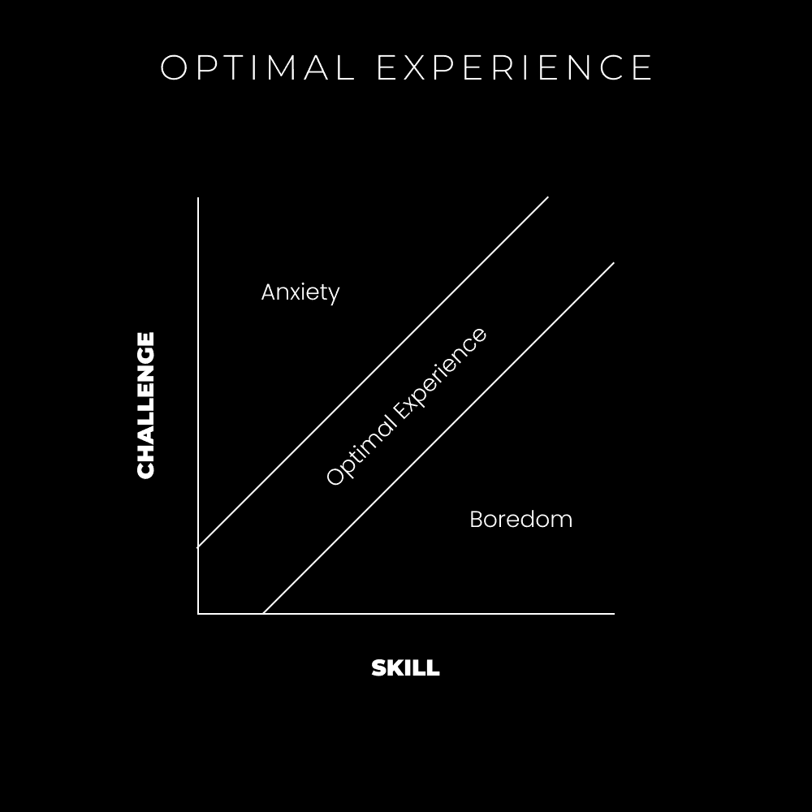
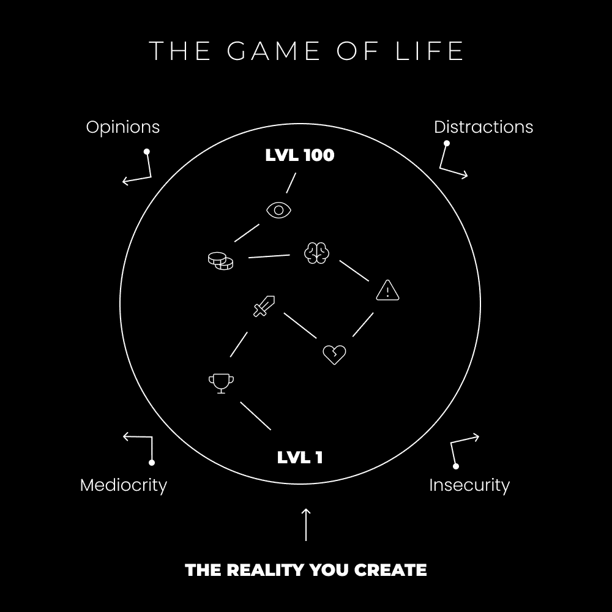

# 如何最终停止在意他人的看法

> 原文：[`thedankoe.com/letters/how-to-finally-stop-caring-what-other-people-think/`](https://thedankoe.com/letters/how-to-finally-stop-caring-what-other-people-think/)

作为一个孩子，电子游戏让我着迷。我记得我恳求妈妈给我买我的第一款“评级 M”游戏《使命召唤：现代战争》，因为我的所有朋友都已经开始玩了。她妥协了。我整夜喝着胡椒博士饮料，在赛前大厅里诅咒孩子们，凌晨 2 点就睡觉——只是为了在上学前一个小时再玩一局。

你可以称我为上瘾。更确切地说，*沉迷*。

随着时间的推移，我组装了我的第一台 PC。一个有趣的小爱好，为我打开了可以玩的游戏的新世界。英雄联盟和魔兽世界是我的最爱。似乎有 5 年的时间，我每晚都粘在屏幕前（在健身房之后！这是我的“奖励”）。

我不会是那种告诉你停止玩电子游戏的人。我玩得很好——而且我认为玩它们对我的生活是一种净收益。我不再玩了——但有很多经验教训可以从中吸取。

## 我们为何会沉迷

我们为何会对游戏如此沉迷？有几个原因。

大脑渴望秩序。它厌恶混乱。人类追求一个[目标层次](https://shop.thedankoe.com/planner)以维持心理秩序。这可以是意识到的或无意识到的。分配的或创造的。领导和操纵者都知道这一点。企业工作场所有日常目标、周目标、年目标和分配给你的个人目标。这减少了你需要每天做什么的不确定性。文化和政治有目标。政治领导人让你支持他们对世界的愿景，阐明他们将如何实现这一点（目标），并要求你投票。

想要增加更多火力吗？使用讲故事。正如我们在之前的信件中讨论的，[所有理解都是隐喻性的](https://thedankoe.com/how-to-copy-your-way-to-success-instead-of-mediocrity/)。基于故事。一件事必须发生在另一件事之前。这个单词必须在这个单词之前，这样这个单词对你才有意义。一个目标必须发生在另一个目标之前，这样它才有意义。理解人们谈论的视角——隐喻性的世界——这样其他内容才有意义。也就是说，你需要理解故事的背景。接下来是什么？上升行动。然后是主人公和反派之间的战斗。然后是下降行动和解决。

当我们不理解某事时，我们的头脑会填补故事中的空白。这被称为假设。你没有拼图的一块，所以根据你的经验想象它。这是危险的，通常也是无用的。这是对你真正重要的事情的干扰。

这导致了痴迷。当我们对某件事感到不太理解时——我们有一种弄清楚它的冲动。为了弄清楚它，我们需要揭开其余的故事。我们想要了解之前、之后以及中间发生了什么。

## 转移痴迷——极端成功的关键与不在乎别人的看法

阿诺德着迷了。沃尔特·迪士尼着迷了。埃隆·马斯克也是。乔·罗根也是。他们关心别人对他们有什么看法吗？他们关心那些称他们疯狂的人吗？不。他们极度专注于实现他们热爱的想法，不管短期回报如何。

对我来说，痴迷标志着有序的意识。一种难以分散的清晰状态。有些人称之为心流，有些人称之为临在。我们可以整天给它贴上标签，但现实中——它只是感觉很好。

> “要做出原创的贡献，你必须对某件事有非理性的痴迷。” —— 纳瓦尔·拉维坎特

你想理解什么故事？什么是你感到兴奋的冰山一角？深入挖掘它。这是大多数人出错的地方。他们拒绝给自己探索机会之冰山的机会。

最近的一个例子。我遇到了一个艾伦·瓦茨的两部分讲座，名为“你就是上帝”。这激发了我的兴奋。这是一个吸引我注意力的新颖观点。什么？我是上帝？这怎么可能？所以，我并没有像发展初期的大多数人（[前理性阶段和理性阶段](https://thedankoe.com/why-choosing-a-niche-is-stupid-for-intelligent-people/)）那样对新的想法关闭我的思想，而是剖析了它。我必须拼凑起这个故事。是什么让他说出这样的话？横向和纵向的提问。从那时起，我已经听了这个讲座 10 多次，注意到了他在我消费的其他内容中的教诲（比如 Actualized.org 关于上帝意识的讲座），能够建立联系（模式识别），并且至少获得了一些形式的理解。

我仍然不完全理解它，但这其中的乐趣，不是吗？我们是否能够探索我们痴迷的冰山上的每一寸？

现在，所有这些痴迷的事情都很棒，但我们如何才能在正确的方向上痴迷？一个能导致极端成功的方向？

> “跟随你的痴迷，直到一个问题开始出现，一个影响尽可能多的人的、庞大而具有挑战性的问题，你感觉非解决不可或死不瞑目。” —— 朱斯蒂娜·马斯克

在我看来，痴迷与心流状态相关联。那些自然对事物产生痴迷的人，随着时间的推移进入心流状态，并将其称为痴迷。进入心流状态是一门科学。我想介绍给你两件事。

**1) 史蒂文·科特勒的 5 个内在驱动力**

5 个内在驱动力是好奇心、激情、目的、自主性和精通。我们之前已经讨论过这个问题——但我想要将你的注意力引向“目的”这个驱动力。

你通过追求你的好奇心并在好奇心的交汇处建立联系来培养激情。当这些“交汇点”获得现实世界的实用性时，目标就产生了。你想要在世界上解决什么大问题？你的好奇心如何解决这个大问题？不知道？没关系，现在你有东西要研究，有兔子洞可以钻。

我的目的是结束人类的苦难。这在我心中点燃了一团火。我通过研究哲学、商业、灵性和其他一些能让我传播我的信息的事情来实现这一点。我对这件事着迷。随意的意见毫无意义，因为我可以把我的注意力重新集中在我的目标上。这是关键。

**2) 米哈伊·契克森米哈伊的流模型**

追随痴迷有一个渐进的过程。它是挑战和技能的平衡。

你可以在任何时刻进入心流状态的各个层次。你需要一个期望的结果，对如何达到那里的清晰认识，以及与你技能相匹配的挑战。

<picture fetchpriority="high" decoding="async" class="wp-image-554"></picture>

最佳体验

如果你正在追求一个特定的目标（期望的结果），而旅程又无聊，你需要增加挑战。如果旅程让你焦虑，你需要提高你的技能。你可以通过互联网的自我教育来实现这一点。

这很快就会变得有意义。

**Mid Koe Letter Plug**: 如果你想获取 170+社交媒体增长、货币化、品牌建设、营销、销售和绩效策略——加入 MMHQ 内的 1000+成员。[Koe Letter 读者可以以$5 的价格加入](http://modernmastery.co/community/modern-mastery-hq-special)。

## 在你想要生活的世界中创造你想要玩的游戏

<picture decoding="async" class="wp-image-553"></picture>

生命游戏

游戏是一种结构化的故事。这就是我们为什么如此热爱它们。游戏为你提供了一种结构化的、以目标或任务为导向的方式去实现期望的结果——故事的幸福结局。

如果你将其视为游戏，那么一切事物都是游戏。游戏意味着规则、技能、挑战和里程碑。我们可以有意识地创造这些。这就是你预测痴迷并给自己一些值得关注的东西的方法。也就是说，一些值得关心的事情，这样你就可以停止关心那些不重要的事情。

当正确执行时，他人的意见、现代的干扰、个人的不安全感以及潜在的平庸将不复存在。它们最初之所以存在，仅仅是因为你给了它们你的关注。

人类是神圣的创造者。当我们连接到最佳体验、心流或当下时，我们为创造打开了空间。

让我们创造自己的游戏：

### **创造你的现实**

作为人类，我们创造自己的现实。你的现实基于你的视角和感知。这就是我们理解非理性的方式。一切都是标签、符号、词语和解释连在一起的故事。一切都是虚构的——因为唯一存在的是当下。心理时间——过去和未来——只是你记得的故事的一部分。你意识到的那些时间点。在那个时间点，你拥有的 70 亿分之一视角。

如果你想让任何情况对你有利——改变你的视角，到一个你可以创造有利情境的地方。视角是相机，感知是镜头。大多数人都有一个三脚架上的相机，镜头模糊。他们不会移动他们的相机或尝试让镜头清晰。这导致他们无法看清实际情况。

假设你在一个繁忙的咖啡馆里看到一个人很吸引人。你的心思会飘向哪里？我保证它将是从一个错误的角度出发，一个对你没有帮助的角度。你的大脑会开始找借口。

“如果她拒绝了我，而且每个人都注意到了？那会很尴尬。”

“如果她有男朋友呢？我甚至不应该冒险。”

想象中所有的借口都会涌入你的脑海。注意这些想法，暂停，深呼吸，看看实际情况。如果你向女孩表白而她拒绝了你，那么情况就结束了。每个人都有自己的小世界。他们不会在五秒钟后还关心这件事，你很可能再也见不到他们了。

这适用于任何事。害怕在镜头前说话并发布到网上？最坏的情况会是什么？有人在评论区叫你“白痴”？那个评论战士没有自己的生活要过吗？

不要让一个评论成为你的整个世界。放大视角。获得观点。

### **创造你的角色**

> “我不是我所经历的事情，而是我选择成为的人。” —— 卡尔·荣格

在许多视频游戏中，你做的第一件事就是创建你的角色。你想要扮演的那个角色。你认为最能玩好游戏的那个角色。拿出笔和纸，这里事情变得重要起来。

根据我的经验，停止玩游戏的唯一方法就是赢得游戏。如果你想在社会媒体上取得初步的成功——你需要玩游戏。一旦你有了足够的杠杆——一旦你达到最高等级——你可以做任何你想做的事。

+   你角色的满级版本是什么样的？

+   那个角色将发展哪些技能和特质？

+   那个角色能赚多少金币？

你对未来的愿景（期望的结果）是什么？到达那里的步骤（目标与清晰）是什么？

### **编写你的故事**

生活就像章节和阶段一样展开。

如果你想象一下你的生活故事正在被书写，现在正在书写的是什么？你处于哪个章节？你是主角还是反派？你在战斗什么？你是否站在胜利的一方？这个故事是从哪个角度来写的？你是否过于在意在咖啡馆向女孩表白？如果是的话，你是否救赎了自己？

> “幸福是力量增强的感觉——阻力正在被克服。” —— 尼采

故事是我们创造生活意义的方式。意义存在于斗争、战斗、克服的阻力中。

你是打算为了赢而玩，还是为了帮助他人赢而玩？你是打算追求你自己的角色故事线，还是打算成为另一个角色故事线中的 NPC？这一切都在你的掌控之中。

### 赢得游戏

一切都是游戏。

社交媒体增长、在线业务、自信、自我提升、技能获取等。一切。

你通过学习规则、机制和原则开始游戏。

你通过保持对内在目标层次结构的关注来玩游戏。

你通过实现那些目标，获得经验（XP），以及最大化你角色的期望特质来赢得游戏。

没有绕过这个问题的方法。你要么玩游戏，要么被游戏玩。

你唯一停止游戏的方式就是赢得游戏。

— 丹·科

### 本周发生了什么

数字经济学创始人定价已上线 —— [还剩 11 个名额。](https://digitaleconomics.school) 这是一个为期 30 天的密集小组，旨在建立你的品牌，实施我的快速内容系统，并确保你在数字经济中的未来。

我们在 MMHQ 进行了内容心理学培训。这是一堂 1.5 小时的大师课，讲述如何吸引注意力，构建长篇和短篇内容，以及我的 APAG 文案框架，用于撰写无需模板的引人入胜的内容。[Koe Letter 读者可以以 5 美元的价格加入。](https://www.modernmastery.co/community/modern-mastery-hq-special)

一档关于如何进入心流状态以及如何将好奇心转化为生意的播客上线了。[在此收听。](https://open.spotify.com/episode/7p8tPvPrwT6dhQfszvYJh8?si=85aaf8da89014e0a)

一段关于创意工作未来以及如何通过追求你真正的好奇心发财的 YouTube 视频刚刚上线。[在此观看。](https://youtu.be/oNV08CLn6zI)
