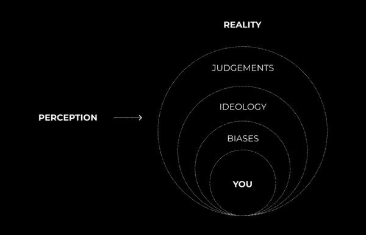
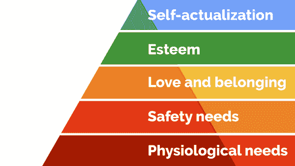

# 我自我洗脑变得自信

> 原文：[`thedankoe.com/letters/i-brainwashed-myself-into-being-confident/`](https://thedankoe.com/letters/i-brainwashed-myself-into-being-confident/)

这不会是一本冥想指南。这不会是我告诉你给你的生活中添加更多物质东西。这不会是一个“快速技巧或黑客”。 

这是一个你必须理解的概念系列。

这份通讯本可以命名为：

*“如何快乐。”*

*“过上好生活的唯一需要。”*

*“如何生活。”*

这个概念对于在现代世界中导航至关重要。在你阅读的过程中，请慢慢来。做笔记并练习。

这需要时间。你的一生都在被文化培养成不快乐的状态。这可能需要几年——或者一个投降的时刻——来解除你头脑中植根的消极性。

我们将从阿兰·瓦茨的一句话开始：

> *一个总是思考的人除了思考之外没有其他东西可以思考。因此，他失去了与现实的联系，生活在幻觉的世界中。我所说的思考特指“头骨中的喋喋不休”……永无止境和强迫性的词语重复……计算和权衡。*
> 
> *我并不是说思考是坏事。和其他所有事情一样，适度地思考是有用的。一个好的仆人，但一个坏的主人——而且所有所谓的文明民族都越来越疯狂和自我毁灭。通过过度的思考，他们失去了与现实的联系。*
> 
> *我们大多数人宁愿要金钱而不是有形财富……而且，除非拍照，否则某个重大场合似乎就被我们毁了……而且第二天在报纸上读到它对我们来说比原始事件更有趣。这是一场灾难。*
> 
> *为了接触现实，有一种冥想的技巧……这是一种暂时使心灵沉默的技巧……停止“头骨中的喋喋不休”。当然，你不能强迫你的心灵沉默。那就像试图用熨斗抚平水波一样。水只有在被独自留下时才会变得凉爽和清澈。*
> 
> 阿兰·瓦茨

## **你已经被培养成平庸**

“培养”是什么意思？想想健身房。你通过重复特定的练习来培养自己。结果，你建立了肌肉或心血管能力。如果你不去健身房，你正在执行重复的动作，结果正好相反。没有中间地带。你是在成长还是在衰退。肌肉的小幅度增加，脂肪的小幅度增加，肌肉的小幅度减少，脂肪的小幅度减少。重复往往被忽视。

心理文化培养是这里的敌人。这是你过度“头骨中的喋喋不休”的原因。这是让你不快乐的原因。思想、信仰、偏见、反应、意识形态、政治立场以及所有其他模糊你感知的东西。通过重复锤炼进你头脑的外部投射。

你的感知——为了这封电子邮件——是你的世界观。你如何解释事物。你观察事物的“透镜”。文化条件已经“模糊”了这“透镜”。作为一个孩子，你存在于你的自然状态中，没有这种条件。你曾是玩耍的、充满爱的和好奇的。随着你年龄的增长，这些特质被压制了。它们通过条件作用而变得模糊。这种条件作用阻止你“看到”事物的本来面目。

感知 VS 现实

有基于你所扮演的角色之透镜的感知。你的个性、信念和偏见。还有基于你自己的现实。真理。上帝。意识。是什么。一切。宇宙。无论你想要称之为什么。不同的信仰体系称之为不同的事物。这些是某些人采用的感知透镜，以使生活更接近真理。

## **从存在到成为的分离**

你认为自己是谁并不代表你就是谁。*你是你所做的*。不是你曾经做过的。你是与生活同行的存在。当你走在路上，你会看到建筑、树木、街道和其他事物，即使你远离数英里，它们也会与你同在。它们没有被留在过去。它们没有时间和空间上的信念和情感。除非被摧毁，这些建筑将在两年后仍然在这里。除非被摧毁，你也会在这里。你的思想、情感和感觉不会。消极无法存在于现实中。

你认为自己是谁是你所扮演的角色。*你正在成为的人*。你为了融入而戴上的面具。心灵的虚构。狂热——或受控——思考的结果。通过专注赋予生命力的思想。通过感知转变为消极的情感和感觉。对外部刺激的自动和无意识的反应。**专注的准确性将决定你在生活中的痛苦程度**。

我们都有超越自我的渴望。为了完全服务于一切、宇宙、上帝等。在我们这样做之前，我们必须自我实现。有些人可能熟悉马斯洛需求层次理论。

马斯洛需求层次理论

意味着，在自我超越之前，我们必须自我实现。[去健身房，开始创业，获得独立，并培养我们的心灵。](https://join.modernmastery.co/?utm_campaign=The%20Mastery%20Letter&utm_medium=email&utm_source=Revue%20newsletter) 为了自我实现，我们必须玩好生活的游戏。为了玩好生活的游戏，我们必须首先*创造*我们的角色。有意识地。不是通过文化条件。*通过有意识的条件作用*。

我们的目标是变得**意识到**这种分离并弥合差距。现实与概念之间的差距。上帝与“上帝”这个词。自然与人为。非物质与物质。光明与黑暗。爱与恨。真理与虚假。剥去那些对你无益的感知，让你的行为内在地驱动（更接近真理）——而不是外在地分配（阻碍真理）。

> *清除你心中的障碍，你就拥有了智慧。清除你心中的障碍，你就拥有了爱。*

你必须意识到你的性格（你正在成为的人）是为了服务你的。你的信念是可塑的。你的负面思想可以被转化为积极思想——在任何时刻都更接近真理。我们必须通过重复积极的想法、信念和行为来塑造性格，以推动我们生活中积极的结果。

这将使你能够吸引并建立导致金钱、意义、健康以及其他被错误感知所掩盖的事情。最终，你将超越并传授你的教训（这是古代和现代教师所理解的生命的精华意义。）

[我在今天的播客中更深入地探讨了“存在 VS 成为”的问题。这可能有助于你更好地理解它。](https://links.modernmastery.co/?utm_campaign=The%20Mastery%20Letter&utm_medium=email&utm_source=Revue%20newsletter)

## **有意识的训练过程**

通过有意识的训练，你为自己创造了一个“透镜”来观察世界。你更准确地感知事物。你升级了你的心理编程。你可以被文化条件化为失败和平庸——或者你可以有意识地训练你的性格，以获得有利的结果。编程或被编程。

在你开始这个过程之前，你可能想要阅读一下[《如何尽可能快地创造有意义、有金钱和影响力的人生》（The Creation Pyramid）](https://thedankoe.com/how-to-create-a-life-of-meaning-money-impact-as-fast-as-humanly-possible/)，并下载[《Power Planner》（The Power Planner）](https://shop.thedankoe.com/planner?utm_campaign=The%20Mastery%20Letter&utm_medium=email&utm_source=Revue%20newsletter)。这将为你提供额外的指导，并在过程中有所改进。结构为王，但分心的事情仍然会出现在我们面前。它们是无法避免的。这个过程将帮助你导航它们，并将负面能量转化为正面能量。

你将把你的注意力集中在积极的事物上，使这个过程成为习惯。你的当前思维过程已经固化了多年。这是一场终身的旅程和实践。

这是一个 6 步的过程：

### **1) 暂停**

当一个想法突然出现在你的脑海中时，在它成为情感、信念、特质或反应之前，请先暂停一下。这需要练习。

如果思想立刻变得腐朽，将你的注意力转移到我所说的“锚点”上。锚点是用来将你的注意力集中起来，中和和转化负面感觉和情绪的地方。

*呼吸*是最容易获得的。有些人通过正念冥想来安排这个。你可以在任何时候将你的注意力集中在呼吸上。

其他方法包括音乐、自然沐浴、身体活动、日记（正如我们将讨论的），以及任何其他可能暗示潜在心流状态或压力调节的活动。

### **2) 质疑**

向自己提出问题，以揭示思想的真正本质。

*“我为什么会这样想？”*

*“这是我以前想过的事情吗？它引导我去哪里了？”*

*“这是合理的吗？应该给它能量吗？”*

让问题引发更多问题。这能提高意识，并可能直接解决潜在问题。

做这件事的下一个最好的方法是进行 CC（有意识的条件化）日记。将你的想法写下来。写下问题，并立即回答它们。这是一个需要培养的关键习惯。将你的想法写下来能提供即时的缓解。这是一项惊人的自我意识实践。

**质疑。至关重要**。

这是最重要的一步。为什么？理解。这是你发现你错误感知根源的地方。

如果你没有意识到你的依恋和身份的负面方面，习惯养成和其他自我帮助建议都是无价值的。*你必须攻击根源。质疑你的思想，直到它们触动心弦。直到你感觉到负面能量的积累。从这种能量中，你已经提高了对问题的意识。现在你可以朝相反的方向工作了。

你无法理解一个潜在的未来。你只能理解一个熟悉的负面过去。现在你有一个可以工作的点。朝着潜在的未来前进。 

例如，“我很懒惰”并不能作为远离工作的地方。你是什么让你变得懒惰的？没有任何生产力建议能像揭示和理解这种阻碍一样有帮助。

### **3) 对象化**

理解这个想法——或你发现的负面反应——不是你的一部分。它是一个物体。一个独立的实体。只有当它被关注时才获得生命。一个可以用来破坏或创造你性格的工具。

将这些写下来，并记录你的想法。

### **4) 重新思考**

现在，你想要将自我毁灭的负面情绪转变为自我创造的积极情绪。这涉及到意识。某种能推动你朝着最佳结果前进的东西。你的愿景、目标和优先事项。

这里有一些重新思考的方法：

**从内疚到感激** — Jocko Willink 在军队中离开团队时感到内疚。他必须有意识地将这种负面信念转化为对能回家的感激之情。

**从失败到成功** — 理解一次失败是反馈。它是成功阶梯上的一个台阶。

**从应对到好奇** — 而不是对出现的机遇持封闭态度（大多数在线商业机会、这种有意识的条件化过程等），要持开放态度，并问自己“如果我尝试这样做会发生什么？”

如果你想更深入地理解这一点，研究极性。恐惧对立——并且可以转化为——爱。所有负面事物都是如此。

### **5) 描述**

你如何利用这种重构来推动自己向积极的方向发展？你可以采取哪些行动？你*能*做些什么？

咨询那些你“共鸣”的励志原型，如耶稣、灵性导师和积极榜样。在你这种情况下，他们会怎么做？

### **6) 对齐**

根据创造等级制度提醒自己你的愿景、目标和优先事项，以及这种积极特质如何帮助你沿着这条道路前进。

对齐=让你的性格行为与你的本质相符。积极、真诚、神一般的行动，导致自我实现（启迪的利己主义）、自我超越（启迪的无私），以及人间的天堂。提升集体人类意识。扮演你的角色，传播积极的信息。

**这需要时间**。

在听 Actualized 的讲座时（我每晚都听哲学讲座，以“思考大局”并入睡），他提到了学习哲学的重要性。当实际上，我们都陷入了生活的技术细节中，而这些细节实际上毫无意义。技术细节解决技术问题。你不是技术。你是一个由意识组成的团块，可能永远无法完全理解。

学习哲学和灵性让你的大脑进入“大局思考”模式。我无法解释这种现象，但通过每天的学习——我的日子不再有压力和担忧。“我不那么在乎。”事情在我通过不受技术思维阻碍的直觉行动时，自然而然地就位了。

也有人提到，要花上数年才能开始理解这些哲学概念——然后它们会突然全部击中你。所有这些精神上的东西都突然向我袭来。它不合理的合理性，以及我们所有问题的根源，就在于试图找到合理性。

通过不寻求合理性，你与真理保持一致。

*丹·科*
