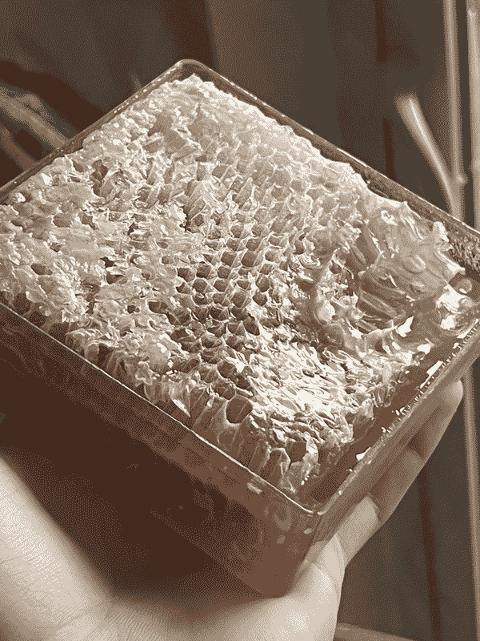
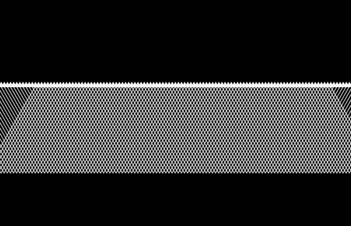

# 蘑菇（药物）教给我的关于生活和商业的知识

> 原文：[`thedankoe.com/letters/what-mushrooms-taught-me-about-life-and-business/`](https://thedankoe.com/letters/what-mushrooms-taught-me-about-life-and-business/)

在过去的几年里，我一直在尝试裸盖菇素、神奇蘑菇，断断续续的。

***免责声明：[在此插入关于不是白痴并在摄入可能改变你心理状态的化学物质之前进行自己的研究的免责声明]***

上个月我开始再次尝试。每周微剂量服用 1-2 次，因为我能欣赏这种物质的威力。

上一次，我学到了一个非常重要的教训。一个关于蜂巢和那些正直视你的无限机会的教训。这些机会让你能够欣赏、理解、掌握和货币化你周围的一切。

## **机会的冰山**

让我们从蜂巢开始。是的，蜂巢。那些毛茸茸的小飞虫的美丽而美味的副产品。上次我微剂量服用时，我去当地的农贸市场，被免费品尝原蜂蜜所吸引，并捡到了这个精美的样本。

1 磅蜂巢

现在，当大多数人看到这个蜂巢时，他们就止步于此。它看起来很美味，他们可能会买一些，但他们看不到它背后的*深度*。他们未能从好奇中获益，因为他们习惯于分心。被他们需要完成的下一个任务、需要检查的通知、持续的内心对话……等等。

*当你好奇时*，也就是说…当你全神贯注，没有被“头脑中的闲聊”、消极情绪或其他任何让你与正在成为的自己之间产生差距的事物所分心时（[根据上一封信](https://www.modernmastery.co/post/the-brainwashing-system-i-use-on-myself-to-be-happy))… *你向世界敞开自己*。你让你的内在直觉注意到你周围无限的 novel experiences。不是大企业用来让你陷入廉价多巴胺的链条中的虚构新奇事物（[根据上一封信](https://www.modernmastery.co/post/why-productivity-advice-is-ruining-your-life))）。

通过那份好奇心，你会发现蜂巢不仅仅是蜂巢。你质疑。你思考。你挖掘那些在你的大脑中创造突触的新奇事物。孕育出导致动机（好的那种）、激情、目标和可能的精通的化学物质。

创造蜂巢的过程是什么？它需要多长时间才能完成？这种特定的蜂蜜来自哪种植物、树木或花朵？养蜂人的角色是什么？他们是如何制造蜂蜜的？它是如何进入我的手中的？为什么人们应该吃蜂蜜？蜂蜜中糖分太多吗？糖对你有好处还是坏处？生物能营养是什么样的，为什么它促进大量糖分的摄入？咖啡中的蜂蜜味道好吗？咖啡是如何制作的？我能制作一种加入生蜂蜜的咖啡，为雷·皮特狂热者（生物能营养模型）打造品牌，并扩展到 1000 万美元？

机会的冰山

你理解这可以有多深吗？你理解不让自己被现代进步所分散的重要性吗？垃圾食品、无脑社交媒体、戏剧以及所有其他外部刺激？**因为你在压制你自然的——孩子般的——好奇心。压制你的潜力。**

*醒来。*

### **现实的无限潜力**

“机会的冰山”与你周围的一切都有关。不仅仅是有形或物质对象。思想、情感、知识等。在现实的所有平面上无限延伸。

蜂巢是一个冰山。白色蜂巢的细胞壁是一个冰山。“这个”词是一个冰山。你周围的一切都是一个包含着无限冰山的冰山。

冰山在 X 轴上

冰山在 X 轴上

你可以开始看到这有多深。你可以开始理解无限、真理、上帝、源头、万物等不可测的本质。

*现实的本质。*

冰山在 X 和 Y 轴上

冰山在 X 和 Y 轴上

这并不止于二维。我们可以添加一个 Z 轴。我们可以添加一个 ABCDEFG 轴。这说明了现实。在无限方向上跨越无限平面的冰山。当你处于当下时刻时，你渴望探索未知——不是投射到熟悉的过去或可预测的未来。不要被你的负面感知、意识形态、偏见、信仰以及你紧紧抓住的一切所蒙蔽。停留在同一个熟悉的舒适泡泡中。过着已经经历过的体验。压制你的直觉。过早的死亡。

### **通往无限未知之四条路径**

当然，你不能对所有事情都一头扎进去。你不想让自己感到不知所措。你不想活在潜在的未来中。那只会是精神上的自慰。

相反，我们想要与当下时刻发生性关系。播种并培育那些将孕育出我们想要的现实的种子。你可以通过追求你的人生工作来实现这一点。追求你的好奇心，让自然发挥作用（神经化学物质在目的和激情中起辅助作用），并继续实现自主和精通。

在这里，你可以选择四条路径。

**1) 欣赏** —— 不要无意识地行走，对生活中的一切都做出情绪反应，而是要欣赏事物所蕴含的深度。让其他人享受事物，因为他们看到了深度并选择追求它。对新事物持开放态度，因为它并不像你想象的那么肤浅。对当下感到敬畏。带着欣赏和感激之情在生活中流动。

**2) 理解** — 当你感到深入探索的冲动时，不要压抑它。**闪亮物体综合症**只存在于你完全放弃改进之路的时候。学习和理解某件事物将始终有助于生活的无限互联本质。我的故事就是直接的例子。理解所有方面使你比狭隘的单方面“专家”更有专业知识。理解——而不是不知道——意味着直接经验。

**3) 精通** — **理解** 使你成为万事通。精通使你成为万事通，精通一个领域。这是当今市场和社会的有利结果。这需要尝试、错误和小的风险。你通往精通的道路会改变。你唯一需要做的就是保持当下并走在正确的道路上。这是你的毕生事业。

**4) 赚钱** — [现在你可以将任何事物货币化。](https://join.modernmastery.co) 我在上面给出了一个例子，即针对生物能营养追随者的原生蜂蜜咖啡。如果我想的话，我可以把这个生意做到数百万的规模……但这不是我的毕生事业。这不是我的直觉引导我去的地方。

### **现在开始精通过程**

为了自我超越，你必须首先自我实现。为了自我实现，你需要玩金钱游戏。你需要足够的资本和时间去追求你的“使命”。什么最符合你独特的本质。

由于我们在这里经常谈论商业，我将给你一些步骤。这些是我与每一位成功人士交谈时，他们通过互联网建立杠杆作用的步骤。

再次强调，不是每件事都需要货币化。全力以赴去做一件事，直到你完成那个目的和人生阶段。

**1) 对一个冰山产生好奇心**。好奇心是潜力的火花。

**2) 自我教育**。利用互联网上可用的信息。阅读书籍、讲座、播客和其他内容。购买课程、辅导或其他具有证明结果的具体知识。**学习**。

**3) 开始一个真实世界的项目**。通过你选择的服务业务或商业模式获得实践经验。做免费工作，模仿你将为此获得报酬的工作。帮助他人，理解他们以及你为他们解决的问题。这将推进学习过程——你不能跳过这一步。（这**不**需要出于商业目的。只需在真实世界中**构建**一些东西。）

**4) 学习永恒的技能。** 信息：营销和销售。媒介：写作和演讲。所有冰山都在自身之内。从基础开始。这些将帮助你将你的知识打包成解决你正在解决的问题的解决方案。它们帮助你通过现代工具和平台展示和传达你的价值。（[我在两封之前的通讯中已经分解了这些](https://www.modernmastery.co/post/learn-these-skills-if-you-want-to-thrive-in-2022)）。

**5) 建立或购买分销渠道。** 我最喜欢的流量来源是个人品牌（在社交媒体上）。它让我能够追求我的兴趣，教授它们，并将任何与我生活方式相符的东西货币化。这就是我帮助他人建立的东西。从简单且可扩展的东西开始，比如 Twitter，然后扩展到其他平台。如果你想尝试付费广告、SEO 或其他流量来源，请随意。

**6) 推广你的“甜蜜”。** 你有一个产品或服务，你可以通过社交媒体免费分发，你有沟通你价值的技能——现在你只需要推广。

**7) 产品化并扩展规模。** 如果你想雇佣员工并扩展规模，那就去做吧，但不要低估一个人企业模式的威力。在线教育和个人力量正在增长，任何人都可以加入。一旦你有了结果，你就可以将你的知识打包成无限可复制的数字资产。你可以出售你是如何制作“甜蜜”的。你可以出售你是如何销售“甜蜜”的。只要价值超过成本，你可以出售任何东西。

如果你想获得个人品牌、社交媒体增长、营销、销售以及将自己发展成高价值个体的逐步课程和路线图，请[加入 MMHQ](https://join.modernmastery.co/?utm_campaign=The%20Mastery%20Letter&utm_medium=email&utm_source=Revue%20newsletter)。

### **最大享受**

追求你人生工作的生活方式和一个人企业的方法是你可以采取的最令人满足的道路（以我谦卑的观点来看）。世界正在向这种去中心化的模式发展，而你仍然处于早期阶段。那些重视自我教育、自给自足和个人责任的人将比其他人更成功。

我将在下一封信中深入探讨我对此的看法。我将以一种我尚未看到其他人做到的方式解构“创作者经济”。

通过理解这封信中阐述的概念，你可以开始从大多数人视为只是“甜蜜”的东西中为自己创造一个美好的生活。

因此，我给你留下这个最后的提醒。醒来，停止让随机的事情偷走你的注意力、专注力和多巴胺。

与自己“接触”以接触世界，宇宙，上帝，以及“甜蜜”之外的所在。

从这个当前状态出发，跟随你新发现的直觉，你的好奇心，深入生活的未知方面。

这是唯一一种你可以学习生活为你设定的教训的方式。

*最后一个问题……*

你怎么能感到“无聊”呢？

*丹·科*
