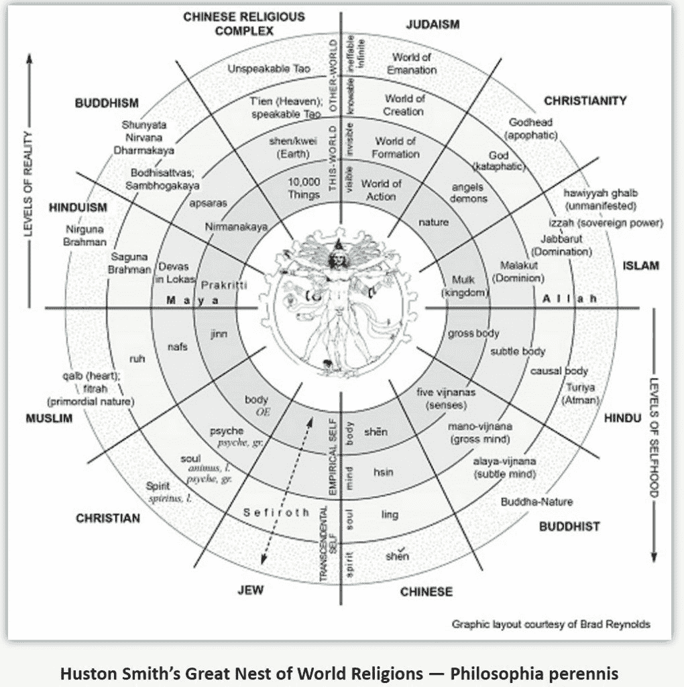
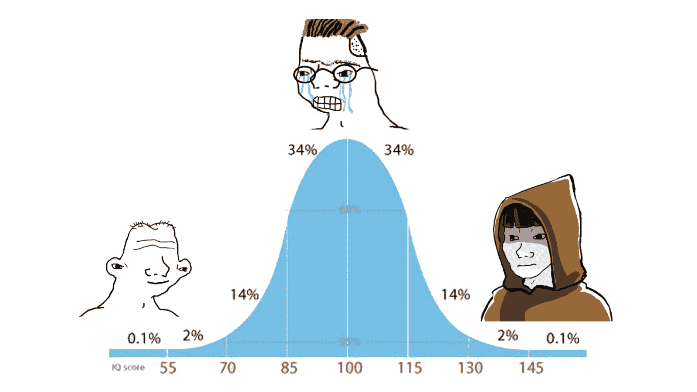
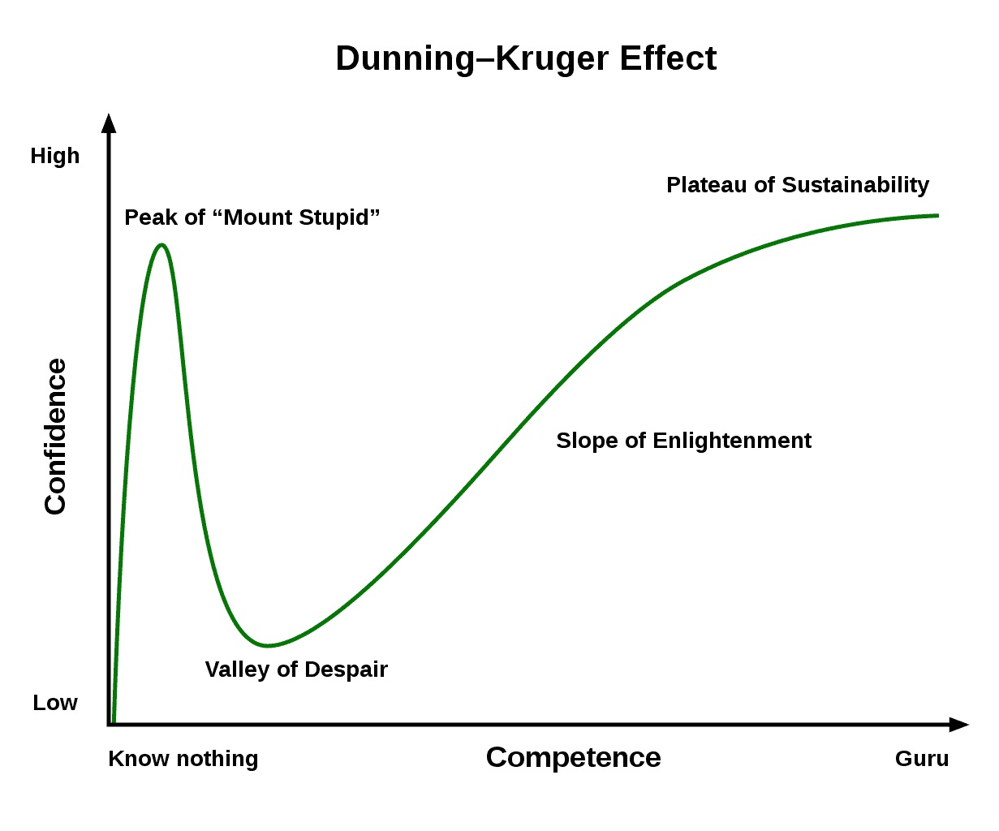

# 如何避免成为平庸之辈

> [`thedankoe.com/letters/how-to-not-end-up-mediocre/`](https://thedankoe.com/letters/how-to-not-end-up-mediocre/)

在我的一生中，我一直对剖析是什么让成功人士成功感兴趣。因此，我花了很多时间观察平庸的人，因为了解不应该做什么是理解应该做什么的前提。

通过多年的学习、观察和带着拼图完整的意图进行创作，我有一些观点想要与您分享。这些观点是通过我在灵性、哲学、商业、健康、表现、心态等多个领域的学术研究形成的。尽管我希望这是一个适合所有人的方法，但它可能并不适用。然而，我确实认为成功是直观的。问题是人们被现代的干扰所淹没，他们的直觉被削弱了。

这个论点可能会有缺陷。我鼓励您质疑它，研究它，并形成自己的观点。我写作的目的是为了理解。为了放下一个参考点。为了在我用所有内容构建的地图上照亮更多区域。这张地图会有漏洞，但这些漏洞将在我继续写这封信的多年里得到修补。

这个论点构成了我“现代精通”使命的基础。挖掘您的直觉，按照它生活，并利用您可用的现代工具 —— 而不是让它们摧毁您的生活。让我们开始吧。

## 顺应自然生活

在我之前关于[精神极简主义](https://www.modernmastery.co/post/an-argument-for-mental-minimalism-stop-thinking-start-doing)和[感知](https://www.modernmastery.co/post/the-brainwashing-system-i-use-on-myself-to-be-happy)的信件中，我已经讨论过这个话题。顺应“现状”并按自然规律生活。前几天我在散步时听马库斯·奥勒留斯的《沉思录》，注意到他经常说我们必须“顺应自然”。对我来说，这以前是不合逻辑的。现在，我有一些更强大的论据来为您解释这一点。

对于那些不熟悉整体论或整体理论的人来说，我将为您简要介绍。一个“整体” —— 这个术语是由肯·威尔伯提出的 —— 是现实的基石。它既是整体也是部分。一个原子是一个整体，但它也是分子的一部分。一个分子是一个整体，但它也是细胞的一部分。这些整体在现实的各个层面上无限地延伸。从上到下，从下到上。与其他整体形成亲密的联系。你是一个整体。宇宙是一个整体。一栋建筑是一个整体。一粒沙子是一个整体。万物都是整体。在我们深入探讨之前，我鼓励您暂停一下，对这一点感到敬畏。它延伸得多远？它上升得多高？

如下所示，这在宏观层面上反映出来，在主要宗教和哲学中都有注意到这些模式。如果你想深入了解这一切，我推荐从肯·威尔伯的《一切简明解释》这本书开始。

大全链

“全息”与 12 个与之相关的原则相关联。这些原则反映了它们的进化行为。现在，请理解我们是从自然到身体再到心智再到精神进化而来的。现在正在经历精神体验的植物、动物和人类。全息在带来之前的一切的同时出现和进化。在我们的根源——我们的存在——我们是自然。然而，我们有动物性的驱动力和特征。现在我们处于心智阶段。与自我、理解它并使其受控的同时，挖掘精神“领域”。

我知道这要么让你感到无聊，要么激发你探索更多，所以我会继续前进，让未知领域的探险者做他们的事情。在此之前，请理解自然是我们的根源。自然不是平庸的、坏的或邪恶的。当这些是由心智创造出的感知时，怎么可能呢？

## 像孩子一样的好奇

你作为一个孩子，离自然最近。你自信、好奇、有创造力、充满爱心、爱玩、真诚。你根据直觉和孩童般的冲动行事。当文化熏陶开始发挥作用，你的心智开始发展，你开始形成你的信仰、偏见、观点等。你开始掩盖你拥有的孩童般的好奇心。你的心智开始接管，你开始根据条件反射的冲动而不是自然生活。

这个论点的目的是说，爱、创造、玩耍和用你真诚的自信刺穿世界，这是你的生物学（自然）的一部分。特别是如果你想要达到新的高度并“出现”到下一个发展阶段（稍后我会详细说明）。

“但是丹，如果我们只凭直觉行事，我们可能会做一些愚蠢的事情。”

嗯，这正是重点。如果你本应朝着这个方向前进，为什么做愚蠢的事情会让你害怕？除此之外，这就是我们进化到心灵阶段的原因。这是一种生存机制。一个工具。你可以通过愿景、目标和优先级来调整你的焦点，做出有意识和积极的决策。当我们摆脱文化熏陶的负面影响，更接近自然时——我们的直觉变得更加准确。好奇心成为我们的指南。自我教育和自我依赖开始超越依赖。我们过着我们应该过的生活。

我想提出肯·威尔伯的预转换模型/谬误。这让我想起了为什么我相信研究形而上学、哲学和精神比阅读无穷无尽的书（尽管这些对短期赚钱策略有好处）更好。

你见过智商 Bell Curve 迷因吗？这是基于 Ken 的预转换谬误，它反映了生活中所有发展领域的。这就是为什么这个迷因总是让你想，“该死，这太真实了。”

智商 Bell Curve 迷因

你必须在生活的许多领域——以及生活的整体——的发展阶段（前理性、理性和超理性）中经历。就你的技能组合而言，你必须经历这些发展阶段，直到这项技能成为艺术。精英运动员通常认为他们的最佳表现是精神上的。这意味着他们已经将自己和他们的技能发展到超越思考它的需要。

这就是重点。你必须看起来像个傻瓜。你必须犯错误并让自己尴尬。你必须达到“愚蠢之巅”和“绝望之谷”，然后才能达到“可持续性之坡”。正如乔伊·贾维斯曾经说过，“一个人必须先感到尴尬，才能变得有基础。”只是为了再次感到尴尬。这是一种开悟的尴尬版本。

邓宁-克鲁格效应

许多古代教师、精神导师和现代思想领袖都得出了一个类似的结论，那就是你的总体生活目标。那就是“提升人类的集体意识”，“传承你的经验”，以及其他类似的表述。我们如何做到这一点呢？通过接触自然，倾听它，让它的所有积极品质引导我们走向我们的自然倾向，并据此创造。

当你剥去心灵的感知，给它带来秩序，并拥有好奇的开放心态时，你就让命运扮演它的角色。你意识到阻碍你的现代诱惑，并让好奇心主导一切。你相应地学习、使用和体验。提高你的意识、理解和意识。关于这一点，美妙的是，创造或经济正在蓬勃发展。现代在线业务已经成为人们可以分享他们独特和多样化（积极和自然）经验的地方，以大规模“提升人类的集体意识”。通过充满爱心、真诚和创造性的努力来影响世界，帮助人们在生活的所有领域发展。

## 专注框架

大脑渴望理解。它通过秩序来理解事物。制图、讲故事、概念、标签、符号等等。这就是你的现实。一层层的故事和概念，基于你从文化编程中形成的视角来观察世界的透镜。 

这不是一件坏事。这是一件你需要意识到的事情。心灵喜欢秩序，那么为什么不按照一种与存在和成为相一致的方式去整理它呢？自然和成长。有些人称之为心态，但我更喜欢将其视为“聚焦框架”。考虑到我们的注意力正通过现代的干扰被操纵和窃取，我们必须通过聚焦将我们的注意力引导到一个积极、自然的方向。

再次强调，这就是为什么《创造层级》和/或在《力量计划者》中的一致使用和迭代如此重要的原因。无论你是否知道你的愿景、惯例、目标、优先事项等是否“好”，仅仅写下它们就会开始训练你的大脑去关注它们。你会更加意识到更好的生活。你可以开始迭代你的愿景，因为这些事物充当了参考点。你的好奇心将会开始显现，因为你将注意到那些可能与你的愿景、目标、项目等相吻合的事物。然后，突然之间，就像是一位来自神圣的使者，你将感受到一种“拉力”，去全力以赴地做你真正想要做的事情。而不是你被编程想要做的事情。

如果你不想最终变得平庸，你需要整理你的心智——聚焦你的注意力——朝着卓越的未来。你需要写下你目前想要的东西。无评判地观察你不想拥有的东西。随着时间的推移，让你的愿景变得更加清晰。

你必须让你的心灵空无一物，除了对当下的观察、执行和存在（80%）之外，还要有对你愿景、目标和优先事项的微妙提醒，这些提醒能激发你的热情（20%）。这场战斗创造了紧张感。紧张感创造了故事。故事创造了意义。

## 停止在乎

最近，我越来越多地玩弄“不在乎”任何事情。这需要大量的练习和发展。我“不再在乎”健康，而是做出与我想成为的人相一致的有意识的决定。当决定已经做出时，我无需浪费精力去思考。我“不再在乎”商业，而是根据我的兴趣构建项目。如果我没有经历过过度思考的“理性”阶段，我就不会有足够的深度、细微差别或信息来让这些项目轻松地运作。

现在的生活已经更多地变成了用清醒的头脑去做我“真正想要”的事情，只是为了揭示我真正想要的路径——只是为了一遍又一遍地重复这个循环。这种紧张感在我选择发展的领域中，推动我朝着无限积极的方向前进，同时创造了意义。

在所有这些之后，我仍在摸索。我从所有研究中吸取的主要教训是，你应该用清醒的头脑简单地做你想要做的事情。

在这里结束这封信。如果你想发展你的心智、身体、精神和事业——[在此加入现代大师总部，获取经过验证的框架、系统、分步路线图和个性化帮助。](https://join.modernmastery.co)
