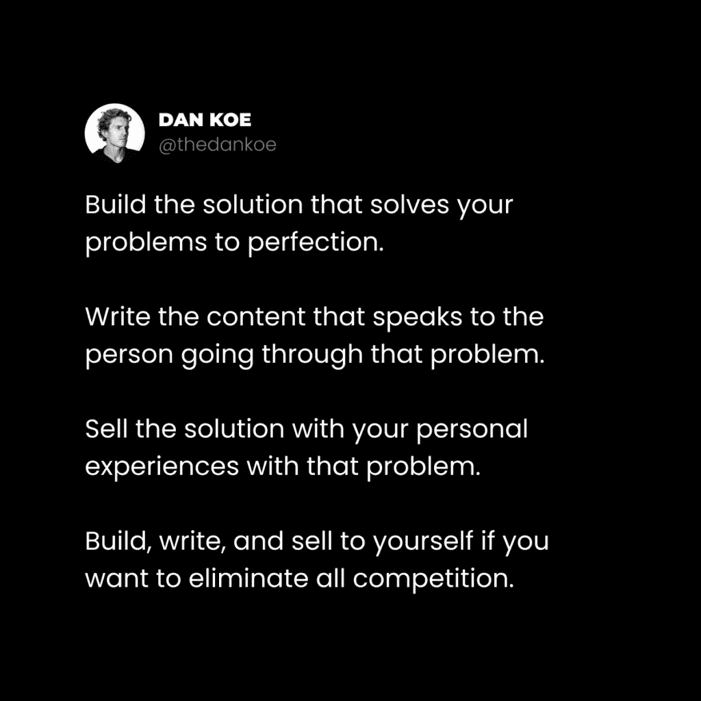
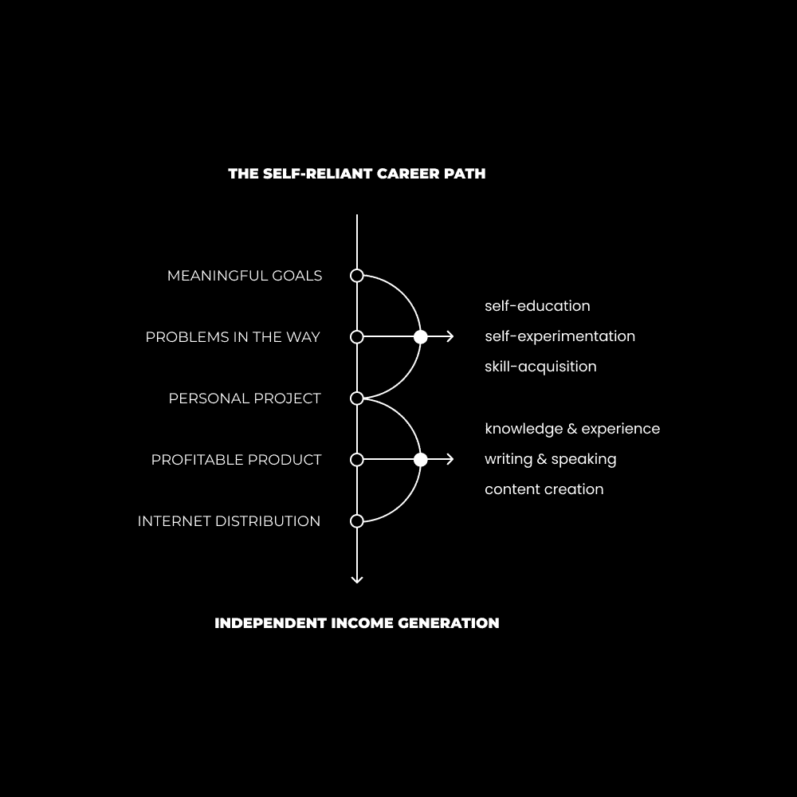

# 解决你自己的问题并出售解决方案

> 原文：[`thedankoe.com/letters/the-self-reliant-career-path-how-to-generate-independent-income/`](https://thedankoe.com/letters/the-self-reliant-career-path-how-to-generate-independent-income/)

创作者经济是一个去中心化的社会，在这里人们可以学习、教学，并为自己的生活创造更美好的未来。

我在过去十年中有了这个认识。

当我还是个孩子的时候，我不信任学校体系（或我的父母）能给我提供让我充分利用生活的必要知识。

相反，我消费了 YouTube 博主、博客作者和社交媒体账户上关于健身、商业和哲学的内容。

我购买了价格合理的课程，这些课程教给我的东西比昂贵的大学学位还要多。

我的大学学位让我得到了一份年薪 6 万美元的工作。

我的网络学习为我建立了一个业务，让我能在这个生活中做任何我想做的事。

教育只是创作者经济的一个方面。

我认为这是一个自给自足的乌托邦，它是人类欲望和进化的产物。

我还认识一个卖鞋的人。

我认识一个卖厨房用品的人。

我还认识一个卖防蓝光眼镜的人。

我还认识一个卖服装的人。

我还认识一个卖咖啡和补充剂的人。

我还认识一个卖新鲜香草、牛奶和肉的人。

所有这些都包含一种比今天肤浅的品牌和只想赚钱的大企业更深刻的哲学。

这个帖子是我所表达意思的一个典型例子：

> 这就是为什么我制作了 Sol 短裤
> 
> 一条经典的、短款、100%纯棉短裤，既灵活舒适，又时尚，搭配任何上衣都很合适。
> 
> 找不到，所以我制作了它。[`t.co/vB85NhzpCH`](https://t.co/vB85NhzpCH)
> 
> — 🌞 Sol Brah 🌞 (@SolBrah) [2023 年 4 月 22 日](https://twitter.com/SolBrah/status/1649604730426126338?ref_src=twsrc%5Etfw)

当然，我有很多个人，我可以从他们那里获取相关领域的专业知识。

如果我想学习股票或房地产投资，我可以以学位费用的一小部分获得这些知识。而且我会得到 10 倍的结果，因为教授它的人实际上有成果。

创作者经济是你：

+   找到有共同目标的人

+   精心打造你自己的社区

+   为那个社区提供价值

+   为你的贡献获得报酬

我的建议是从我们之前信件中学到的开始。

通过追求你的目标来创办一个教育业务（因为它启动成本极低，利润空间巨大）。

为自己创造一个独立收入。

然后，建立一个你真正想要建立的业务。

我的这个一人教育业务每年能赚大约 150 万美元。

我现在正在写一本书，开发软件，并规划我想在世界上留下的真正影响。我有做这件事的资金和资源，但仅仅是因为我从我所拥有的开始。

我没有幻想过建立一个价值十亿美元的公司，只是为了让我因为过度紧张和焦虑而瘫痪。

这正是你一点进步都没有的原因。

P.S. 这种商业风格（解决你自己的问题并销售解决方案）正是我在[数字经济学](https://digitaleconomics.school)中帮助的内容。

## 通过利润和目的解决问题

<picture fetchpriority="high" decoding="async" class="wp-image-1145"></picture>

我整个商业旅程都是自私的。

我所做的一切都是为了我自己，给自己写信，给自己销售。

当你是细分市场时，饱和和竞争就会消失。

如果你想要从你的目的中获利：

1.  识别你生活中的一个问题

1.  设定目标以揭示你的当前目的

1.  尝试不同的解决方案

1.  找到什么有效，并创建你自己的

1.  在公共场合谈论你的旅程

1.  以价格标签的形式提供你的解决方案

重复这个过程一直是我的生活指南。

从我能记事起，我总是有一个要建立的项目。

项目是实现目标（或目的）的一种有组织的途径。

几年前，我在生产力方面遇到了困难。

集中注意力很困难，我知道我可以做得更多。

那就是我意识到的那个问题。

因此，我将解决我生活中的那个领域作为我的目标。

我观看了 YouTube 视频，购买了补充剂，并订购了几种不同的计划者和日记。

我坚决要解决这个问题，所以我尝试了每一条我得到的建议。

几个月后，我取得了一些令人难以置信的结果。

因此，我坐下来创建了一个适合我的可持续生产力解决方案（因为其他方法中总是有一个小问题）。

这时，我设计和推出了数字动力计划者。

当时我并没有很多追随者，但我喜欢从我的生产力知识中谋生的想法。所以，我：

+   写了我所知道的关于生产力的内容

+   通过适当的策略扩大了追随者群体

+   将数字计划者作为免费下载推广

+   将教育资源添加到免费下载中

人们都喜欢它。

因此，我进一步发展并推出了计划者的实体版本。

现在情况不同了，但我的全部成功都是建立在解决我自己的问题和销售解决方案的基础上的。

我通过学习网页设计解决了我的职业问题（所以我建立了一个课程）。

我通过自由职业的成功解决了我的金钱问题（所以我建立了一个课程）。

然后，现代精通就诞生于我建立我所希望的一个社区和学习平台。

现在，我正在写一本书，并开发一个我可以卖给我的年轻自己（帮助他更快地实现目标）的软件。

这就这么简单。

每个人都是企业家。

有些人只是因为解决了问题而得到报酬。

## 自给自足的职业道路（如何开始）

<picture decoding="async" class="wp-image-1146"></picture>

> 这个星球上有近 70 亿人。我希望有一天，几乎会有 70 亿家公司。*——* 纳瓦尔

工作的未来是游戏，每个人都将成为企业家。

每个人都将被迫创造、贡献并向他们的社区提供价值，否则他们的生存方式将枯竭。

人工智能指向这个现实。

自动化指向这个现实。

互联网上的大多数事物都指向这个现实。

即使这不会成为大多数人的现实，但它可以成为你的。

### 1) 有利可图的兴趣

我们从生活方向开始。

你需要一个愿景、目标和你可以每天执行的重点任务。

这就是你在生活中获得经验的方式。

这就是你怎么获得知识、技能和方向，你可以将这些传递给同样道路的人。

所有燃烧的问题（在你和他人生活中）都落在永恒的市场中：健康、财富和关系。

自我提升是关于解决那些领域中的问题的。

商业是关于解决那些领域中的问题的解决方案。

通过以下方式：

+   设定一个有目的的目标来提升自己

+   自我教育，获取你身心和商业所需的技能

+   让你的好奇心引导你选择的方法和创造

你将获得必要的经验，帮助他人并从有目的的生活中获利。

好奇心是那里的关键接触点。

使你独特的，是你找到能够带来结果的知识的组合能力。

在商业中，有些人可能对电子商务或网站倒卖感兴趣。

有些人可能对个人品牌和数字产品感兴趣。

在健康方面，有些人可能对运动和最佳表现感兴趣。

有些人可能对健身和生物黑客技术感兴趣。

太常了，我们认为自己和别人在做同样的事情。

你的故事大不相同。

每个人都必须在同一个永恒的市场中追求目标。你无法逃避这一点。但追求这些目标的方式可以是你独特的，这就是你的经验能盈利的原因。

### **2) 项目到产品**

如果你不知道要卖什么，就卖你在旅途中想要的东西，或者你现在找不到但想要的东西。

当你开始追求一个目标时，实现它的最佳方式是：

+   研究基础知识以获得清晰度

+   开始一个真实世界的项目，这样你就不会陷入教程地狱

+   将项目构建到发现问题

+   购买课程、辅导或研究互联网内容以找到解决方案

+   将你所学的一切应用到项目中，直到完成

“项目”听起来并不适用于生活的所有领域，但请听我说。

当你开始改善你的健康时，只有当你将其转化为可衡量的个人项目时，你才能取得进步。

你去健身房。

你写下你的日常流程。

你记录下你每一次举重的细节。

如果你没有看到进步，你就研究并找到你知识中的差距。

也许是你对营养的依赖阻碍了你？

是时候跟踪你的卡路里摄入量了。

你的体格有所进步，但精力没有？

也许你会陷入一个关于牛肉肝是地球上最富含营养的食物的神秘兔子洞。

因此，你对此进行实验并记录结果。

当你将生活的每一个领域都视为一个以目标为导向的项目时，你就需要去实验。

通过自我实验，你创造了一套独特的经验，可以传授给他人。

在市场营销中，你是在销售目标（目标 = 目标 = 预期结果）。

你在销售追求该目标所带来的生活方式的好处。

在健康领域，有些人可能会向想要创建一个健康社交圈并参与社区活动的**20-30 岁的人**销售跑步产品。

其他一些人可能会向想要在健身房只锻炼 3 天就能变得强壮的商务人士销售体重训练计划。这样他们既有钱又有肌肉，可以过上有趣的生活。谁不会买这个（如果他们与产品的理念产生共鸣）？

我的写作产品，[2 小时作家](https://2hourwriter.com)，是我个人品牌建设和通过数字写作获得数百万粉丝的独特经验。

我在 2-3 年的时间里对想法生成、通讯稿写作和社交媒体内容进行了实验。

你不必等那么久。

我实际上建议立即启动。

你需要*数据*和*反馈*来了解如何使你的产品更好。

从有目的的生活中获得的益处是你帮助人们过上更好生活的营销火力。

也就是说，通过自我实验锻造的底层哲学是你如何从追求中产生创造性收入。

### 3) 个人分销中心

到目前为止，这一切听起来都很棒。

1.  研究你的兴趣以实现你的目标

1.  通过个人项目进行实验以获得结果

1.  将那个项目转变为一个有目的可以销售的产品

但大多数人都会卡在这里。

他们没有意识到你需要产品和人才能真正赚钱。

你必须建立*分销*。

这不是可选择的。

我最喜欢的方法是通过建立个人品牌。

第一，因为它正在成为一种必需品。

品牌、公司和雇主都在根据你的公开简历（你的个人资料）进行招聘。

其次，你获得的是杠杆。

你可以根据你的生活变化进行转型，并销售任何你想要的东西（只要你不把自己局限于一个狭窄的利基市场[`thedankoe.com/the-most-profitable-niche-is-you-how-to-create-your-niche/`](https://thedankoe.com/the-most-profitable-niche-is-you-how-to-create-your-niche/))。

第三，大多数其他形式的分销会让你一无所获。

付费广告和冷接触非常强大，但当你停止这样做时会发生什么？

你在过程中是否建立了受众或电子邮件列表？

你能休息一下吗？

你能否在你的品牌背后培养一种有意义的哲学，而不会在销售的产品上受限？

也许可以，但可能性不大。

通过以下方式建立个人分销中心：

+   将你追求目标过程中学到的教训传承下去

+   将你的想法、信念和观点写下来，以区别于他人

+   以有说服力的方式教授你所学的知识

真的就是这样。

有技术细节和[社交媒体增长的细微策略](https://sprints.digitaleconomics.school)……但这是一个你可以自己尝试的目标和项目。

(这就是你开始学习所有可销售技能的方法，通过建立你的业务并将你学到的知识应用到它上面）。

这就是未来的职业道路。

这就是如何将你学到的几乎所有东西货币化。

这就是仅通过生活就能获得报酬的方式。

未来属于那些将他们的宝贵经验传承下去，以改善他人生活的人。

这就是所有最优秀的企业所做的事情，只需看看你看到的下一个社交媒体帖子（从创作者的角度，而不是消费者的角度）你就可以自己验证这一点。

加入到自给自足且不断发展的乌托邦——创作者经济，稍后你会感谢我的。

– 丹
