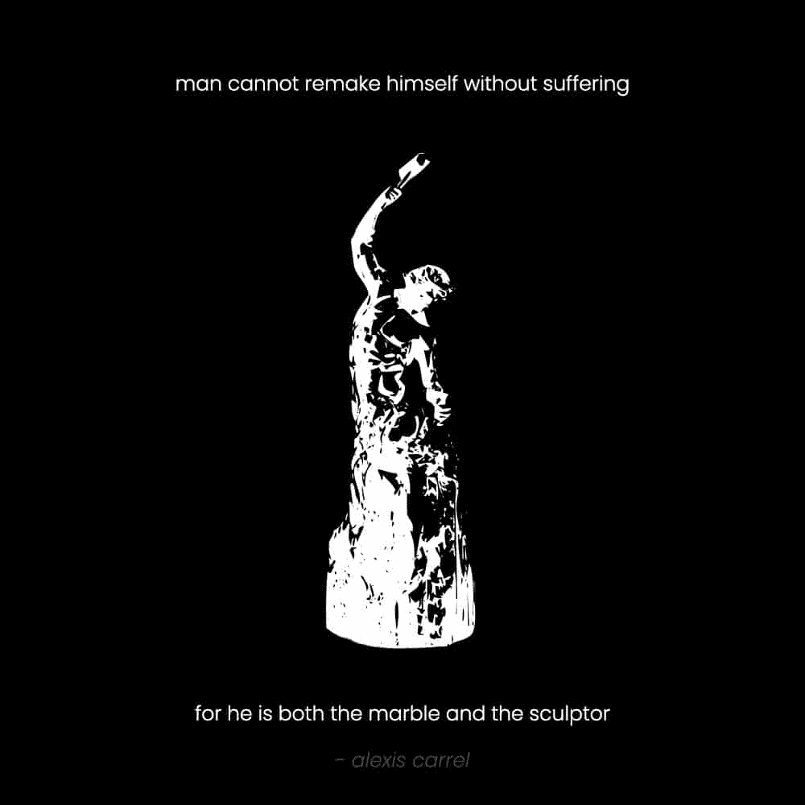

# 自我建筑的艺术（如何改变自己）

> [`thedankoe.com/letters/the-art-of-self-architecture-how-to-change-who-you-are/`](https://thedankoe.com/letters/the-art-of-self-architecture-how-to-change-who-you-are/)

生活是一场游戏，你的性格决定了结果。

你的性格是可塑的。

这是你必须做出的第一个认识。

你可以改变。

无论多么痛苦。

无论你的心灵告诉你什么。

无论你多么想紧紧抓住你当前生活中那些你认为比想象中造成更多破坏的舒适感。

你的性格是你对自己的概念：你认为你是谁。

你处理过的想法、信念、经验和信息的大杂烩，构成了你与现实互动的操作系统。

对于大多数人来说，他们的性格是被创造的。

在我们的童年时期，我们中的每一个人都是环境的产物。

人类学习的基本驱动力使我们能够吸收任何有助于我们生存的信息。

有了这个信息，我们默认地走上了平庸的轨迹。

就像一辆沿着轨道飞驰的火车，如果我们不学会引导自己的冒险，我们可能会走向死胡同。

人类的命运并非板上钉钉。

对于每一种生命形式来说，情况都是如此。

如果我们不做出明智和有意识的抉择，我们可能会从地球表面消失。

这是最坏的情况，但它的可能性却在不断增加。

我们的性格决定了我们的行为。

我们的行为对社会和文化做出了贡献。

社会和文化影响着其他角色的编程。

构成我们性格形式的想法、信念和信息将通过我们的选择传播，形成其他性格。

集体性格将决定自己的命运。

一切都始于一个人从平庸的轨迹中醒来，改变自己，让他们的行动影响世界的能力。

## 个人发展的悖论

生活是一场包含无限游戏的比赛。

有两个宏观游戏是最有成效的：

**1) 外部游戏**

外部游戏是你选择如何度过你的人生。

这是你追求的自发目标，它影响着人类。

这是你一生的作品（我在[数字经济学](https://digitaleconomics.school)中帮助你发现和创造）。

你投入时间、精力和金钱去构建的，作为价值创造方式的事物。

**2) 内部游戏**

如果你的外部追求没有哲学上的掌握感作为支撑，它们将保持表面化和无意义。

对于你追求的每一个外部目标，都有一个你必须解锁的内在教训。

这就是个人发展的悖论。

你在世界上推得越高，你就越深入地探索自己……如果你不迷失方向的话。

随着你自己的发展，你提高了你的心智水平。

在每个层面，你都能从上到下地看待你的过去经历。

你开始意识到你所玩（或允许玩你）的系统或游戏的架构。

一段内心的挣扎是达到你下一个心智层次的必要条件。

当你获得必要的技能或知识时，你就达到了解决你所面临问题的下一个心智层次。

就像我在 7 个不同的商业中失败一样。

我尝试过太阳底下的一切。

学会了我能学会的所有技能。

尝试过自由职业、直销、代理工作和社交媒体，但结果微乎其微。

没有事情发生，然后所有事情都发生了。

突然间，我一直在收集的拼图碎片在我脑海中拼凑在一起。

一场名为洞察力的雪崩冲击了我的心理。

我清楚地知道我必须做什么才能让我的下一次商业尝试成功。

经过多次这种现象的循环，我现在就在这里。

这就是为什么无论我给你多少免费的“游戏”，你仍然需要挣扎多年。

你必须与现实斗争，才能得到对你来说完全有意义的教训。

这不会瞬间发生。你必须终身致力于不确定的道路。

## 从表面到形而上学（向内雕刻）

> 问题解决者或价值创造者的道路是如何逃离可替代性的世界。爱上问题所提出的挑战，从表面到形而上学，你的理想未来将自行形成。这就是无限游戏。

这是我终于完成的书中的引用，《专注的艺术》，希望今年能出版。

要改变自己，你必须平衡和平与进步。

你必须向外推动有意义的目标，同时摆脱你已经形成的身份的坚硬外壳。

某些目标需要特定的性格才能实现。

如果你忽视了你外在旅程中的内在工作，你最终会陷入表面存在的陷阱：

一个没有健康的商人。

一个没有哲学的健美运动员。

一个没有价值观的搭讪艺术家。

自我建筑的技艺需要全面的发展。

当你实现更大更好的目标时，新的问题会在你的意识中浮现，但大多数人忽视了这些问题，这就是社会现状。

我们过去多次讨论过如何设定、追求和实现有意义的目标（[比如这封信](https://thedankoe.com/the-focus-formula-how-to-take-control-of-your-life/))，所以我们将专注于向内雕刻。

想象一下你是什么样的人，你的自我概念，是你随着时间的推移所构建的智力结构。

当你翻新房子时，你会直接从地基开始吗？

或者，你从一个小小的美容问题开始，以免整个房子都倒塌？

当你开始雕刻大理石板时，你会用尽全身力气敲打吗？

或者，你进行小心的、有计划的敲击，以免把它们变成灰尘？

同样的概念适用于改变自己。

大多数人想从深层次的、精神的和形而上学的问题开始，这些问题存在于他们的核心。

如果你甚至没有做过一点自我帮助的工作，比如：

+   去健身房或训练

+   改善你的营养和习惯

+   获取高价值的技能和知识

然后，你将面临一段糟糕的时间。

我会争辩说，那些试图“精神化”而不做表面工作的人，是出于表面原因。

他们利用精神作为高尚的牌，通过追求目标来避免以任何形式对人类做出贡献。

## 挑战：技能 = 目标：利润

> 当一个人的所有相关技能都需要应对情境的挑战时，那个人的注意力完全被活动所吸收。没有剩余的心理能量来处理除了活动提供的信息以外的任何信息。所有的注意力都集中在相关的刺激上。 —— 米哈伊·契克森米哈伊

这是通往最大享受生活之路。

这是你要遵循的过程：

**1) 追求一个足够具有挑战性的目标**

从小处着手，从表面开始。

改善你的健康、财务和心态。

跨入未知，让你感受到推动你采取行动所需的压力。

这给了你一个较小的目标去实现。

**2)** **获取** **实现目标所需的技能**

想象你可以在没有自我教育的情况下实现自我生成的目标，这是愚蠢的。

你需要让你的意识沉浸在将编程新身份（并给你提供攻击目标的知识）的信息中。

关注那些提供与您目标相关具体信息的社交媒体账号。

购买 1-3 本关于这个主题的书并阅读它们。

当你有一个心中挂念的目标时，你开始有目的地感知情境。

意图 = 你正在努力追求的东西。

信息变得对你的人生更加相关和适用。

你结束了无意识的干扰和消费循环。

如果你不知道要学习什么技能，考虑学习[高影响力写作](https://2hourwriter.com)。这可能是数字时代最有利可图的技能。我和我的学生已经证明了这一点。

**3) 猎取“为什么”以培养个人哲学**

如果你难以采取行动，那是因为你没有采取行动的**令人信服的、个人的和内在的**理由。

第一步是困难的，但你必须迈出这一步。

然后，当你在体验生活时，留心寻找你可以收集的原因。

我以前很讨厌散步。

我没有看到“重点。”

有一天，我决定减掉一些体重。

我变得比我喜欢的重了一些，并在心中形成了一个目标。

我开始消费信息，以拼凑一个减肥策略。

散步似乎是一个增加能量消耗的好方法。

因此，我开始每天走 10,000 步。

在那些散步中，我意识到：

+   我可以听讲座和书籍来充实我的思想

+   我可以生成想法并撰写内容

+   我实际上喜欢抽出时间出门，这有助于我的专注力

+   在我减重后，我的日常活动量更高，这样我就可以吃更多（赢）同时保持苗条。

+   我可以接听商业电话。

+   我可以在一年中的大部分时间保持一个不错的晒黑。

现在，我每天至少走 20,000 步。

当我无聊时，我会走路。

当我缺乏创造力时，我会走路。

当我需要去商店时，我会走路。

那最后一个观点实际上影响了我居住的地方。

我认为我永远不会因为城市带来的好处而选择住在无法步行的地方。

这不仅适用于步行，也适用于我生活方式中融入的每一个习惯。

如果你不知道“为什么”你要做某件事，那你为什么要做它？这是无意识的第一个迹象。

追求目标。

为每个人发展一种内在的哲学。

慢慢培养塑造你自己的习惯（因为你的选择意味着一切）。

**4) 将你的追求转化为有价值的贡献**

我们生活在一个可以分享你的知识在无限公共论坛——互联网上，并为此获得报酬来提升自己的时代。

这本身就是最好的、最成功的商业风格。

那种解决真实、有意义和改变生活的问题的类型。

大多数企业失败是因为他们试图解决的问题不是真实的。

通过解决你自己的问题，你知道它们是真实的。

你知道解决这些问题改变了你的生活。

现在，你所需要做的就是自我反思，创建一个其他人可以遵循的过程，并将其提供给他人（并给它标上价格）。

这就是如何将目标转化为利润。

– 丹·科
