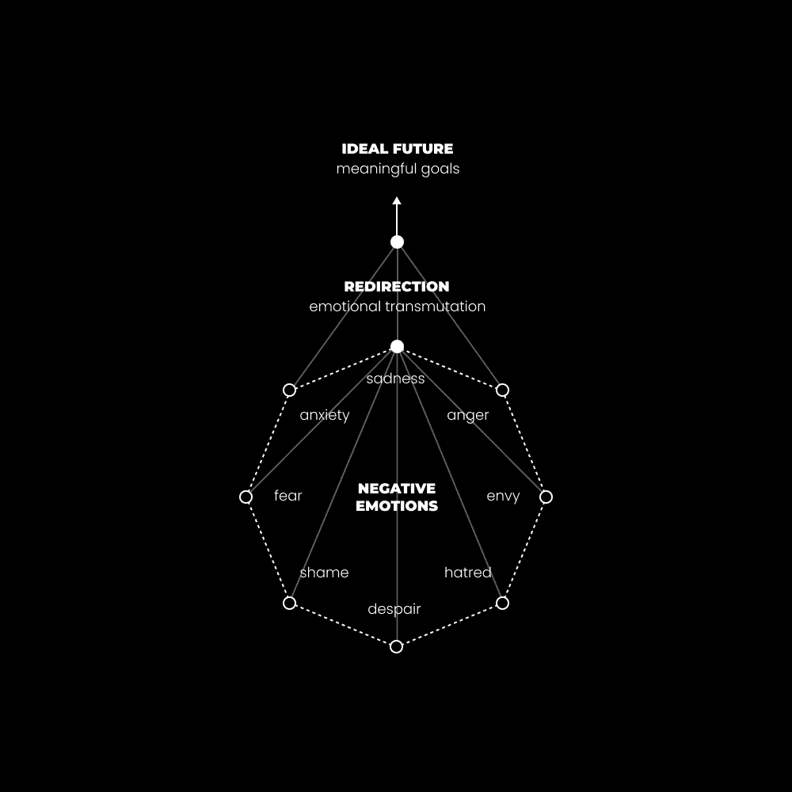

# 对你生活中的现状感到愤怒（为了超越 99%的人）。

> 原文：[`thedankoe.com/letters/get-mad-at-where-you-are-in-life-to-get-ahead-of-99-of-people/`](https://thedankoe.com/letters/get-mad-at-where-you-are-in-life-to-get-ahead-of-99-of-people/)

我生命中最美好的时光总是在我完全厌倦了取得的进展不足之后。

我开始理解“缓解”和“治愈”之间的区别。

缓解感觉良好。

它以廉价快乐、无脑娱乐和处方药的形式出现。

人类害怕改变。

因此，我们紧紧抓住外部世界所呈现的安全感的幻觉。

建议也是如此。

超越性别的色情。

更好生活的承诺。

有说服力的营销角度。

可能提供安全感的事物，但不是你自己的理解。

治愈是痛苦的。

它以厌倦生病，最终达到完全翻转的形式出现。

我的意思是，一个完整的、彻底的感知翻转。

想象一条从黑色到白色的渐变线，中间有灰色调。

然后，将这条线的两端连接起来，使黑色和白色相接触。

我们可以在日常生活中看到这种现实模式的例子。

一个如此愚蠢的人，反而变得有洞察力。

一套如此不时髦的衣服，反而变得时髦。

一个如此不好笑的笑话，反而变得好笑。

一个不信者如此被束缚，以至于他们变成了一个信徒。

或者，一个人对现状如此厌倦，以至于他们变成了一个完全不同的人。

## 性格孕育行动。

*身份限制视角*。

它提供了一个边界，这样你的思想就不会落入未知领域，威胁到你的整个存在。

*视角影响感知*。

任何给定的情况都有太多信息，以至于意识无法处理（我们每秒可以处理大约 50 比特的信息）。

你随着时间的推移培养出的身份或性格将限制你可以处理的信息，这些信息是你能够接触到的视角。

从那个信息中，你将与其他人不同地解释它。

我可以让你想一个“鸟”，你脑海中浮现的图像将不同于这个星球上的任何其他人类。

有些人会想到红雀，其他人会想到蓝松鸦，两者都有微弱的线条在你的脑海中形成图像。然而，*鸟是什么*的潜在本质是相同的。

对于像上帝这样的概念，人们会为了解释和“证据”而发动战争，而当概念所指的经验或本质是相同的，它就在你面前，但条件化的思想阻止你看到表面之下。

当说到像上帝这样敏感的话题时，让我们结合基督意识的例子。

基督的身份被扩展到他的视角所扩展的*一切*。

他能够整体地感知情况，并看到它们本来的样子。

我不是来向你宣讲宗教、意识形态或教条的，因为这正是我这里所指的反面。*小心你的僵化身份如何影响你对这些话的理解（因为我曾经是那个盲目重复“事实”的家伙，把我没有经历过的事情当作不可能存在的东西来评判）。*

我不认同任何一种观点，而是试图将所有真理整合到我的世界观中。我在这一点上远未完美，但很难否认，每个文化信仰体系都在指向同一个东西。你在研究不同观点时从模式识别中获得的具有意义的多巴胺是一个迹象，表明你正在朝着正确的方向前进。

*感知影响你在世界中的行动方式。*

与宗教、营养、商业或政治意识形态紧密相连的人几乎总是会按照由该意识形态结构分配给他们的目标行动。

寻求打开心扉，获得意识和理解的人可以做出有利于他们理想未来的决定。

行动总是指向一个目标。

你的身份中已经内置了目标。

问题是这些目标是否是自我产生的，还是由外部分配给你的。

一个不加质疑就接受父母信念的政治意识形态者会朝着由政党分配给他们的目标行动。

一个由热情和自学成才的健美运动员会设定自己的目标，并让他们的营养、生活方式和训练与该目标保持一致——否则他们会经历痛苦，这不是坏事，但是一个有用的指南，指向更好的方向。

性格创造行动，行动强化性格。

如果你想要改变自己，挑战你的信念。

让你的行动与*时间*（不是一天、一周甚至一个月，而是一生）相一致。

通过这样做，你创造了一个减少不自觉痛苦的生活。

## 故事中最有趣的部分

大多数人没有意识到生活*本身就是故事*。

故事象征着宇宙模式。

你可以在建筑、音乐、所有创造、经文、系统、环境、经济学以及你的生活中注意到这些模式。

这就是我们理解世界的方式。

大脑通过概念、故事、隐喻和符号来解释世界。

要理解一件事，我们必须对与之相关的一切有潜意识的理解。

没有手，杯子就没有意义。

没有力量或质量，重力就没有意义。

没有当前的社会和文化状态，你的生活就没有意义。

你所知道的一切只是包含数十亿个开/关信息的层叠故事，这些信息是为了你当前的理解水平而拼凑在一起的。

故事为生活赋予意义。

你的身份是你对自己讲述的故事。

如果你没有意识到，你将自动地活出这个故事。

在你的人生之书中，眼前展开的是什么单词、句子、段落、章节？

现在，我们必须引入极性的话题，以深化我们对意义的理解。

简而言之，一件事不能没有另一件事而存在。

没有悲伤的参照点，幸福无法存在。

没有手就没有杯子。

或者没有痛苦的生活。

关于最后一点，故事的高潮往往是记忆最深刻的。

当战斗达到顶峰时。

当你不确定未来会怎样时。

当象征性的反派即将获胜但英雄获胜时。

如果你生活中没有低点，它就会失去所有的意义。

它会变得平坦。乏味。线性。没有生机。机械的。机器人的。无知的。平庸的。

生活是秩序与混乱之间的舞蹈。

推拉。阴阳。阳刚与阴柔。

从个人到社会到文化再到宇宙。

如果你从未接受过战斗，失去阵地，并朝新的方向推进，你就无法达到新的高度，获得新的视角或意识水平。

## 情感转化。

> 转化（名词）：改变的行为或变成另一种形式的状态。

我在我的右前臂上有一个纹身。

一个奥菲罗斯。

这是炼金术的象征。

它是一个蛇以其尾巴形状吃自己的图像，形状像一个无限符号。

这是一个提醒，创造需要毁灭，而且两者不能单独存在。

它指向等价交换定律，该定律指出，对于任何收到的东西，你必须牺牲等值或更大的价值。

商业转化将创造转化为金钱。

情感转化是将你的情感状态转化为更强大的东西的行为。

就像使用像愤怒这样强大的东西来推动你向好的方向发展。

当然，这可以很快变得危险。

情感转化并不是成为那个情感的奴隶，让它支配你的行为。

我们想要像精神太极大师一样捕捉、感受和引导我们的负面情绪。我们想要利用，而不是被利用。

为了创造一个更好的生活，情感能量是燃料，有意的努力是载体。

通过在生活中达到低点，你直接接触到一个强大（但暂时）的燃料来源，大多数人却浪费了。那个低点是快速连接到神圣的。

当轮到你时，不要浪费它。

## 引导到建设。

当你达到那个低点时，你需要一些具体的东西来引导那种新发现的（并且超强大的）能量。

一个与愿景一致的项目。

你跌入的低谷的对立面。

从对消极的认识中，你可以轻松地识别出你不想从生活中得到的东西。从那里，你可以可视化一个更好的未来去努力。

如果你遇到了财务的低谷，也许现在是时候开始创业或找一份新工作。

如果你刚刚结束一段恋情，也许现在是时候将你的优先级转向健康和个人发展，在健身房锻炼。

我认识的大多数成功人士都是从对生活中某个情境的原始仇恨开始的。

他们恨通勤上班。

他们恨每周五天都穿猴装。

他们恨自己让一段关系继续下去，或者他们觉得自己不够好，无法保持他们想要的关系。

当他们感受到这种情感并放下想要抓住的欲望时，新的潜力显现出来，行动变得无摩擦。

大多数人认为，“仇恨”不应该存在，因为它只是爱的障碍。如果这个障碍没有被移除，仇恨就会抓住它并延长它的停留时间。

现在，这是通过我的直接经验形成的我的哲学，也是为什么你们中的许多人会阅读这些信件：

我认为整体创业是任何男人或女人平衡生活中混乱与男性追求自我生成、目标导向建设的元容器。

如果这让你感到困惑，让我解释一下现在的创业环境：

### 1) 每个人都是企业家。

几个世纪以前，每个人都在他们的部落或社区中承担着一种角色。

他们获得了适合他们社区“市场”的技能和兴趣。

### 2) 社交媒体不仅仅是一个应用程序，它是一个新的社会。

人们还没有意识到社交媒体的革命性。

那是我们学习（学校）的地方。

那是我们雇佣（职业）的地方。

那是我们教学（商业）的地方。

那是我们相遇（社交）的地方。

我们生活在这个虚拟世界中，就在这里和现在。没有我们已有的这个社会支柱，虚拟现实将无法存在。

忽视社交媒体就是忽视了一条通往你最大潜能的进化之路。

### 3) 我们通过解决问题的方式实现了“做自己喜欢的事情”。

进化是解决大小问题的过程。

我们直到反思十年以上的时间尺度才会注意到这一点。

天生的人类驱动力是追求你的好奇心和拥抱存在。

在这个社会中，没有钱（在一定程度上，但这是一个硬点）你无法做到这一点。因此，利用现代技术通过做自己喜欢的事情来赚钱成为一个人的终身事业。

你可以通过将你的个人兴趣与社交媒体（理解社会）的技能、写作、演讲、营销和销售相结合来做这件事。

我在[$1 百万美元技能栈](https://thedankoe.com/letters/the-1-million-dollar-skill-stack-learn-in-this-order/)中讨论了这一点。

### 4) 你是最有利可图的细分市场。

生活的意义是什么？

这是一个有争议的问题，但我相信最有意义的答案是提升集体意识。

帮助他人解决问题，这样我们才能超越表面，按照真实的生活。

你生活中的问题是心理的、身体的、财务的和精神的。

对其他人来说也是如此。

这些是我们必须个人解决以实现集体增长的问题。

我们作为人类，只有当我们最薄弱的环节强大时，我们才是强大的，而这个最薄弱的环节是平庸、无意识和破坏性的。因此，你必须为了意识而学习营销和说服。你不是推动你的世界观，你只是展示它，让它发挥作用。

*喂饱饥饿的人*。

那些已经满足的人最终会感到饥饿。

当你解决自己的问题时，意味着你可以传授一个解决方案。

这个解决方案是你在社交媒体上获得读者群（通过内容）和销售一个一次购买就能拯救世界的产品（通过教育）的方式([通过教育](https://thedankoe.com/letters/the-new-wave-of-micro-businesses-monetize-your-knowledge/))。

如果你不知道从哪里开始，[尝试 2 小时作家](https://2hourwriter.com)。

### 5) “创造者”不是一份工作，而是一种新的生活方式。

无论你信仰何种更高的力量、基本的形而上学结构，或对创造者的任何解释——很难否认创造的行为是纯粹的快乐，这是做更多次数的标志。

当你学习时，剖析、重新连接，并教授，你就是在锻炼你大脑的创造力，正如阿诺德所说的明智话语：

> 对我来说，泵的感觉就像和一位美丽的女人做爱并达到高潮。你知道吗？感觉太棒了。我总是在高潮，你知道！

创造力是心理健美。创造是精神上的性行为。

如果每个人都充分发挥自己的创造者本性，那么饱和状态就难以存在。

你的故事，或身份（你在创造者社会中展示的），与任何人的都不一样——即使你追求的是像“赚更多钱”这样的高级目标。

你一生中可以处理 1280 亿位的意识信息。

那是你的潜力。

在任何时刻，你都在通过分心或通过塑造一个能够为人类做出贡献的有意识的人格来浪费这种潜力。

感受你所处的情境。

将这种能量转化为目标。

获得实现那个目标所需的技能。

追求你的好奇心，以避免处方的机械性质。

交换你的知识、项目和解决方案，以换取关注和收入。

使用你的自我反思意识来识别你能力中的差距并修复它们。

你拥有资源。

这将需要时间。几年。

你可能现在不会开始，那没关系。

这封信在你当前的认识水平上可能甚至对你都没有意义。

根据你的经验水平，在现实中推进。

寻求对大局的理解。

不要陷入技术细节的陷阱。

享受你周末的剩余时光。

– 丹·科
