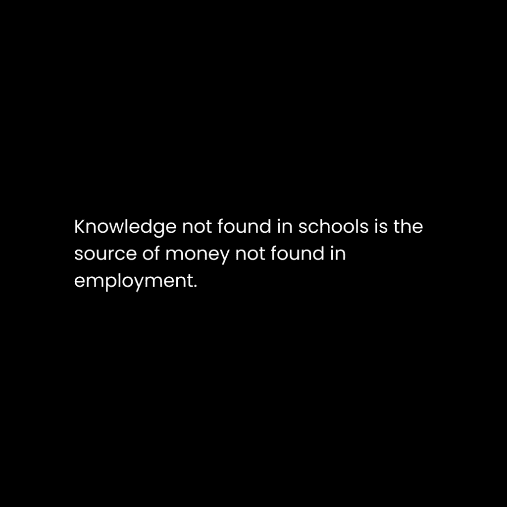
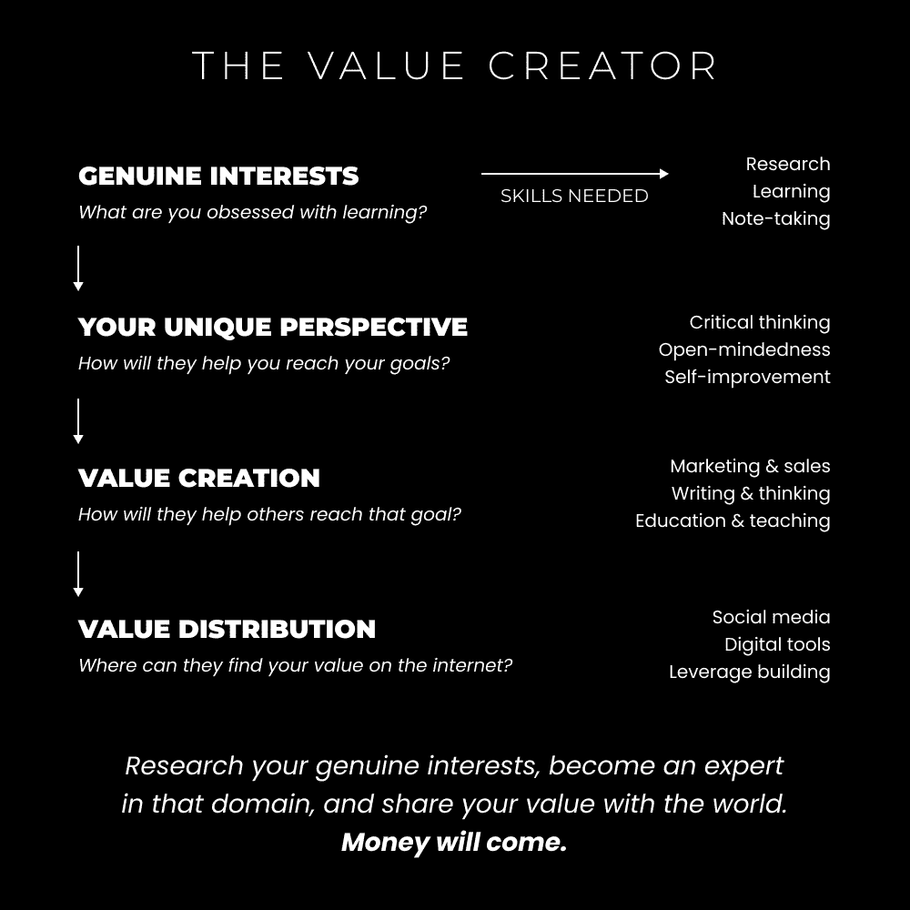

# 重新审视一人企业（将自己变成企业）

> 原文：[`thedankoe.com/letters/the-one-person-business-revisited-turn-yourself-into-a-business/`](https://thedankoe.com/letters/the-one-person-business-revisited-turn-yourself-into-a-business/)

一个新的社会已经出现。

一个虚拟的。

我们都认为“虚拟现实”离消失只有几年时间，它将由像苹果的新 VR 头戴设备这样的技术组成。

但进化并非如此运作。

进化是关于解决导致我们痛苦的问题。

这是一个缓慢的燃烧过程。

这个新社会的出现就像一颗爆炸的恒星一样快。我们称之为社交媒体。

人类生活中存在一些紧迫问题，导致程序员、愿景家和商人构建了一个大规模的解决方案。

交流是地方性的。

信息是地方性的。

商业是地方性的。

机会是地方性的。

几个世纪的地理限制在瞬间改变。

互联网允许社交媒体的出现。

社交媒体允许创作者经济的出现。

创作者经济允许去中心化的进步。

工业革命导致了支配性等级的不可持续发展——上层权力更大，人数更少，下层权力更小，人数更多。

随着创作者实现层次的发展，信息时代开始逆转这一效应。

创作者通过内容和课程教育、娱乐和激励他们之下的人——但没有任何东西阻止任何个人攀登到梯子的顶端。

让我们稍微分解一下：

### 什么是创作者社会？

随着互联网的发展，信息传播得无以复加。

这导致了更先进、全球化和可及的社会的发展。

社会由机构、有共同信仰的社区和文化观念组成。

最显著的方面是教育体系、劳动力、社会和商业群体，以及宗教机构。

社交媒体扩大并缩小了这些界限。

一切都变得更加整体化和互联，就像雨滴融入大海一样，正如宇宙分化和统一的模式所暗示的那样。

公立学校体系有许多问题：

+   聚焦式思维

+   分隔式学习

+   顺从胜过真实性

+   记忆胜过过程

+   失败是应该避免的

+   权威是不容置疑的

+   长期工作胜过效率和真正价值

+   智力由书本知识定义

+   只关注培训你进入可替代工作的十年前课程

创作者社会的新教育体系允许个人：

+   追求他们的好奇心

+   寻找他们最能从中学习的教师（创作者）

+   将学习视为生活的一部分，而不是一个令人烦恼的义务。

+   学习现代技能，让你能够快速适应快速变化的环境。

+   寻找有助于他们追求自我生成（而非分配）目标的特定知识。

+   将创业放在首位，因为这是那些想要从生活中获得更多的人的唯一合理终极目标。

新的教育体系是互联网内容。这一切都没有被标记。这只是虚拟生活的一部分。

宗教机构限制了其追随者的思想，并反对任何与他们自身观点相矛盾的观点。

现在，精神意识和教育在大多数创造者品牌中都是可获得的。

你可以打开你的思想，研究不同的观点，进行自我实验，直到你培养出一个适合你的哲学。

这不仅是为了精神成长，还包括精神、财务和健康相关方面。

### 创作者经济是什么？

商品交换自人类互动开始以来一直是社会的一个自然部分。

价值创造和交换是沟通和关系的基础。人类是深具社会性的生物。

金钱，或货币，是一种中立的价值形式。

个人会将其花费在他们认为有价值的事物上。

他们认为有价值的是依赖于他们的身份、观点、目标、当前的心态以及他们对问题的认识水平。

我们开始意识到营销和销售的重要性——因为它们是展示你所能提供价值的核心技能。

营销和销售会考虑上述所有因素。

如果你没有将产品或服务定位给一个具有特定目标（身份）的特定个人，该目标暗示了一个特定问题，那么你将不会赚钱。

创作者经济由个人组成，他们通过内容和产品形式分发价值。

他们教育他们的观众，传授有助于实现他们目标的技能和兴趣。

他们的产品或服务旨在产生结果，并帮助他们更快地实现目标。

## 我的个人商业哲学

> 这个星球上有近 70 亿人。我希望有一天，几乎会有 70 亿家公司。 —— 纳瓦尔

最好的企业能改变人们的生活。

转变造就了获胜的产品。

停止试图解决虚构的问题。

解决你的问题。

改变你自己的生活。

将方法打包起来。

给它贴上一个价格标签。

如果你解决了真实、有意义的问题，你失败的可能性会更小。

这就是大多数进入商业的人遇到的问题。

他们对营销、销售、心理学或一般进化没有理解。

当大多数人正遭受低意识问题（这些问题阻碍了集体自我从启蒙中解脱出来）时，停止试图登陆土星或建立一个价值十亿美元的技术公司。

从一个帮助人们解决生活中**真实**问题的[微型教育业务](https://thedankoe.com/letters/the-new-wave-of-micro-businesses-monetize-your-knowledge/)开始。

*这就是*你为人类的幸福和进化做出贡献的方式。

你通过理解永恒的市场：健康、财富、关系和幸福来实现这一点。

通过解决这些领域中的问题，你：

+   推动你自己的自我实现

+   创建一个包含你自己的故事的独特地图，你可以将其传承下去

+   通过帮助他人疗愈和实现他们的目标来赚取收入

从那里，每个人都处于更高的意识状态。

然后，我们可以用我们的时间做自己喜欢的事情，解决我们热衷于解决的更深层的问题（比如登陆土星）。

## 自我货币化的路径

社交媒体是一个新的社会。

个人品牌是这个社会的“人”。

不，这不仅仅限于有生意的人。

大大小小的创造者都在四处招聘。

品牌和公司正在招聘那些在公共场合展示他们价值的人。

社交媒体是一个公共的工作招聘板、公共学校、公共笔记系统，以及一个你可以找到朋友和培养商业关系的公共派对。

首先，你可以为其他创造者工作以获得新社会的经验。这是一个很好的选择，但你也可以直接开始建立自己的事情。

### 路径 1) 学习一项技能，出售一项技能

这是大多数人推荐你快速赚钱的方法：

+   学习创造者或品牌在其业务中使用的现代技能（如电子邮件营销、漏斗设计或内容写作）

+   围绕那个技能创建内容，以展示你的知识（坦白说，这不会吸引很多追随者。你的个人资料更像是一份简历）。

+   由于你没有受众在睡梦中销售产品，因此你可以为自由职业或咨询服务收取更高的价格。

要让这一切发挥作用，你必须[学习永恒的技能](https://thedankoe.com/letters/the-1-million-dollar-skill-stack-learn-in-this-order/)：写作、演讲、营销和销售。

### 路径 2) 在你的兴趣周围成为价值创造者

这很难表达，因为最常见的问题是，“我没有任何兴趣。”

所以让我们从这里开始。

你通过在目标上投入精力来创造对某个主题的兴趣。

这样一来，如果你没有实现它，你会觉得自己在浪费投资。压力让你负责。

真正的目标是基于追求自我实现的永恒市场。

你在旅途中学习的兴趣被应用于实现那个目标。

对于健康市场，我可以对营养、训练和心理健康等子主题产生兴趣：

+   健身

+   人类祖先的饮食

+   极简主义训练

+   瑜伽

+   正念

对于财富市场，我可以对商业、职业发展和金融的子主题产生兴趣：

+   自由职业

+   软件即服务

+   简历构建

+   面试准备

+   预算

+   上一节中列出的任何技能

对于关系市场，我可以对社交动态、约会和婚姻的子话题产生兴趣：

+   夫妻治疗

+   自信和魅力

+   白天游戏

+   如何接近

所有这些都帮助我推动每个领域的发展。这就是你成为一个现代文艺复兴人士的方式。

如果你想要真正不可替代，你必须成为一个终身自学者（自学成才的人）。

由于新社会中的互联网内容、课程和非传统教育，你可以以创纪录的时间学习任何东西。

### 路径 3）双重行动以获得最大效果

拥有一个个人品牌，你将不得不学习大多数现代技能以使其成功。

你将不得不自己建立自己的着陆页、漏斗、电子邮件、内容、个人资料设计、图形以及其他一切，以使你的品牌成功。

如果它不能帮助你的品牌成长，它也不会帮助他人，在这种情况下学习它也不值得。

当你为自己的品牌获得结果时，你就有知识去帮助他人。

你将基于你的兴趣销售产品或服务（以练习你的技能发展），这将基于你的兴趣。

你将围绕这些兴趣创建一个最小可行产品，提供自由职业或咨询服务。

随着你通过你生产的内容扩大你的受众，你最终可以将它转化为一个需要较少努力的可以销售的产品。

这是一个更长的路径，但非常值得。

你极大地提升了自己，你的业务比大多数人都更有杠杆作用。

## 6 位数的单人商业的 4 个支柱

单人商业模式可以有多个定义。

现在我有一个小团队，我实际上不能称自己为“单人商业”，但我将重新定义它，这样我就可以（哈哈）。

此外，我过度投入了一个我不关心的商业模式。我正在积极努力回到单人模式，也许再加上一个虚拟助理。我对由此带来的收入减少是可以接受的。

我已经意识到我想要的是什么（写作和创意挑战），这让我能够无情地消除阻碍（用时间）。

单人商业模式是将自己变成业务。

这是一种新颖且引人注目的说法，“*成为高价值并展示自己，直到足够的人知道你是谁，你做什么，以及你为什么这样做。机会会累积。”*

简而言之，这就是你真正需要做的以成功。

为了清晰起见，让我们深入了解单人商业的 4 个支柱：

### 品牌 – 你是细分市场

你的个人品牌是你在新社会中的“自我”或“身份”。

你的身份是塑造你观点的潜在故事。

你的观点包含目标，你从中感知情况。

这些目标可以分配给你（社会条件）或自我生成（与你的愿景一致）。

当你阅读一本书时，你的解读会与下一个人不同，因为你的目标作为你的视角是不同的。

如果我在生活的一个低财务点阅读《意识》这本书，我会吸收与实现我的财务愿景相关的想法（我可以在我的内容中传播）。

另一个人在生命中的关键时刻阅读这本书，他们可能从中一无所获，或者吸收一些有助于培养这种关系的想法。

你的品牌是你对未来的愿景（而且你的愿景随着你的成长而发展）。

你对未来的愿景意味着你已经拥有，或者正在学习实现它的技能和兴趣。

你的任务是展示这一点，让读者在任何可以接触你的地方都能看到。你所有的内容都将从你品牌的视角来写。

如果我的当前愿景/目标/目的是赚更多的钱……

我学到的或正在学习的技能是营销、健康和精神领域……

我的个人简介将是，“我写关于营销、健康和精神，这样你就可以建立一个全面的一人企业。”

是的，甚至健康和精神层面也可以被定位为帮助商业发展的方式。这就是大多数人混淆于如何将他们的兴趣融入他们感到有联系的狭小领域的原因。

你在引导人们走向何方？

这就是如何吸引追随者。

### 内容 – 记录你的思想

我喜欢将社交媒体视为一个公共笔记系统，你在其中记下：

+   你正在学习的内容以及它如何应用于你的生活

+   你对你技能和兴趣的看法和观点

+   你在生活的故事中学习到的教训

在不知不觉中，我们正在以可探索的方式在互联网上积极构建集体意识。

但是，你不能只是写些东西然后祈祷你的品牌能增长。

你必须学习营销、说服技巧，并沉浸于表现良好的内容中，以便你能注意到它们之间的模式。

我会推荐[数字经济学](https://digitaleconomics.school)着陆页上的免费课程 – 你只需在页面顶部输入你的电子邮件。

如果你还没有学习营销、销售或文案写作 – 现在就开始吧。它们将改变你的生活。在这封信中关于它们的内容太多（双重和我在之前多次讨论过它们，[这封信是一个好的起点](https://thedankoe.com/letters/value-creation-the-skill-that-built-my-one-person-business/))。

### 产品 – 公共个人项目

在个人企业哲学下，你通过解决自己的问题并销售解决方案来为新的社会做出贡献。

进展如下：

+   识别你生活中的一个问题

+   将其转化为一个个人项目以获得经验

+   将其转化为一个最小可行性产品

+   开始以 500-1000 美元的价格销售（自由职业或咨询）

+   在过程中通过内容建立你的受众

+   提高你提供的深度和复杂性

+   当你准备好时，将其产品化，这样它就可以在睡眠中销售

这可能需要 1-3 年。

如果你的目标是增加商业或职业生涯中的收入，你可以学习像电子邮件营销这样的技能。

如果你的目标是变得健美并增加你的吸引力与自信，你可以去健身房并调整你的营养。

一旦你做到了，你就可以开始将其作为自由职业或咨询服务来销售。

在电子邮件营销的例子中，自由职业者是明显的选择。

*教授*他人往往被忽视。

你可以教授其他创作者或品牌你在电子邮件营销追求中学到的知识——特别是*如果你将其应用于你自己的品牌，并在过程中看到了结果**。

“项目”在哪里发挥作用？

项目是你实际上在现实世界中解决问题的方法。

它们迫使你应用你所学的。

它们也是可触摸的，它们是你的成果。

你可以迭代它们，并随着时间的推移变得更好。

你可以反思它们，并使它们对下一个人更容易实现。

在电子邮件营销中，为你的品牌写一个电子邮件序列。你可以练习销售他人的产品（联盟营销），或者练习推广你最喜欢的书籍或产品。围绕它们构建一个有说服力的论点。

然后，为你的最喜欢的品牌做同样的事情。为他们构建一个电子邮件序列。

现在你有了现实世界的实践，你可以向那个品牌推销你的服务，或者开始帮助他人建立自己的。

教授是识别知识差距的方式。

那是你唯一能够填补它们的方式。

如果你没有通过构建项目和教授你所学到的知识，你的旅程将会缓慢而痛苦。

### 营销 – 向自己销售

如果你从不推广自己，你将一分钱也赚不到。

简单就是这样。

人们问我（处于压力、压倒性和恐慌的状态）为什么他们从他们的努力中没有赚到钱。

这是因为他们做了一切，但就是没有推广他们的产品或服务。

营销贯穿你的整个品牌，但最普遍的是：

+   你产品和服务的着陆页

+   你推广它们的电子邮件

+   你推广它们的内 容

+   在你的推广信息中，看看其他人是否适合他们

再次，我之前已经谈过这个问题，我在[数字经济学](https://digitaleconomics.school)中给出了我的确切系统，所以让我们回顾一下你可以练习的框架。

**确定他们的目标或期望结果**

你必须知道你的受众想要什么。

通过询问他们或在你的营销中说明目标，让他们牢记于心。

当你是细分市场时，这已经是一个你已经实现的目标。你应该已经通过自我反思知道什么对你的受众来说是可取的。

**确定阻碍你的因素**

为什么人们不能实现他们的目标？

为什么你没有在开始时实现目标？

在你的推广或询问你在推广信息中与谈话的人时写出来。

“是什么阻止你实现[他们提到的目标]？”

### 展示你的解决方案以解决燃眉之急

既然他们已经明确了目标以及阻碍他们的因素，你就知道他们是否适合你的解决方案。

如果他们不是的话，祝他们一天愉快，然后让他们独处。

如果他们是的话，询问他们如果能够实现那个目标，他们的生活将如何受到影响——这有助于揭示他们面临的问题。

从这里，你可以将你的提议作为一个潜在解决方案来展示。

作为初学者，为了更好地练习这个过程，请阅读这篇关于[非需求型网络过程](https://thedankoe.com/letters/how-to-network-with-millionaires-and-build-a-name-for-yourself/)的信件。

目前你所需要了解的就是关于单人商业模式的全部。

欢迎观看我 YouTube 上的[单人商业播放列表](https://youtube.com/playlist?list=PLB4ePXk6nBaeG3fD13NaRMsRsEc2iCsV4)的其余部分。

享受你余下的这一天。

– 丹·科
