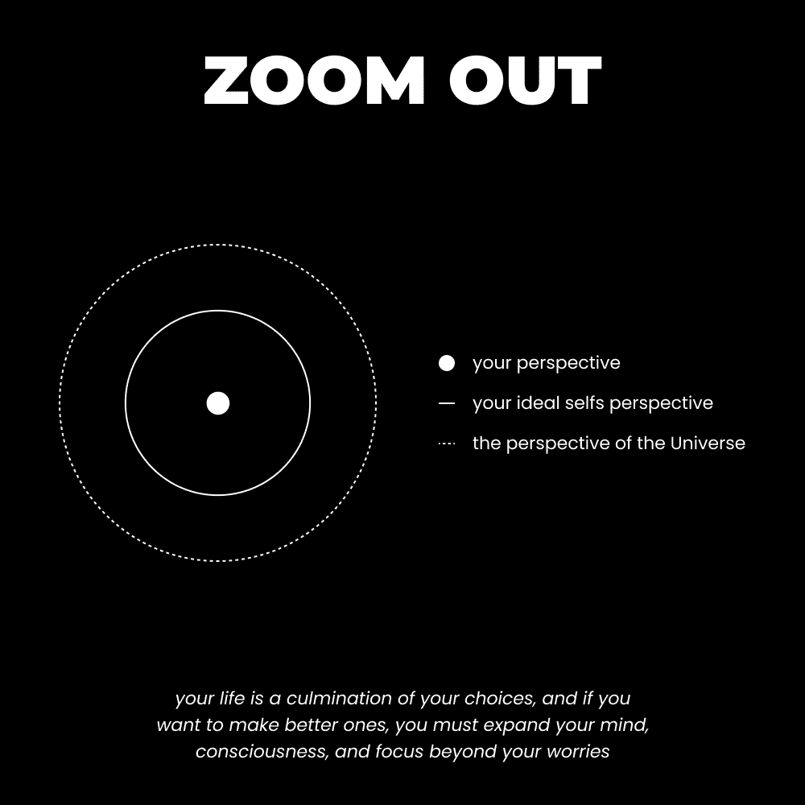

# 《全面重塑生活指南》（6-12 个月内）

> [`thedankoe.com/letters/a-full-guide-to-reinvent-your-life-in-6-12-months/`](https://thedankoe.com/letters/a-full-guide-to-reinvent-your-life-in-6-12-months/)

生活就像一个黑暗的房间。

有时，我们会找到一根蜡烛，以便我们可以看到，但不会太久。

蜡烛提供视野和方向。

但火焰会熄灭，在我们灵魂中激起恐惧，我们永远找不到出路……除非我们带着信仰移动，相信我们会找到下一根蜡烛。

人类的心灵在清晰和混沌之间弹跳。

混沌是我们的默认状态。

清晰是有序信息填充我们意识的结果。当我们关注的事物清晰时，我们的心灵就清晰。

这是对人类行为的解释。

这解释了为什么人们报告说他们一天中最痛苦的部分是在星期日下午 10 点到 2 点之间。

人们讨厌他们的工作，但工作能提供比独自一人与你的随机思想相伴更愉快的心态。

人类用活动来填充他们的日子，以构建他们的心灵。

我们总是想要做点什么。见人。玩游戏。写作。设计。创造。最好是将注意力投入到有用的事情上。

当我们独处时，精神熵随之而来。

我们只能连贯地思考几分钟，然后就会迷失在未知中。

我们的心灵抓取负面思想，它们就会倍增。

这种心态的解药是知道如何引导你的注意力。

冥想教你专注于你的呼吸。

元认知教你质疑你的思想。

学习独处就是学习在任何情况下都能让你的心灵有序，以便享受。

人们想要最大化自由，这很讽刺。

这与他们的愿望相反。

人们不想要自由，他们想要自治。

他们不希望有人强加限制，他们想要创造自己的限制。

你的自我是一个定义。

自我强加或接受的限制。

自我是你的精神身体。你不是物理的。

你是你根据编程认为重要的想法、信念和区别的混合体。

你的自我决定了你如何解读情况，这决定了你的行为。

你的自我决定了你的命运。

你可以自由地定义自己，但大多数人接受世界告诉他们是怎样的人。

如果你的自我是无限制的，那么你就会死亡，因为死亡是比喻性的。

这是意识中区别的破坏。

如果自我与他人的区别被消解，那么你的自我形式就死了。自我消亡。你与宇宙合为一体。大多数人想要这样，因为这听起来很酷。对他们来说，这是另一种地位游戏。

好吧，好吧，别再抽象了，让我们来点实际的。

清晰是享受的关键。

但乐趣不是谜题的唯一部分。

我们可以享受别人赋予我们的生活，但这并不带来满足感。

可持续、长期清晰的来源有两个：

1) 与有意识未来一致的自我生成目标。

2) 与无意识未来一致的由社会产生的目标。

一个是创造的，一个是分配的。

如果我们不想我们的生活成为他人愿景的产物，我们必须掌控自己的生活。

让我们深入探讨。

## 大多数人不需要动力，他们需要清晰。

动机就像站在峡谷的一边。

另一边看起来像是一个乌托邦。你想要的一切。美丽的人、音乐、汽车、房子，都在呼唤你跳入其中，但你没有越过峡谷的方法。

清晰是通往另一边的桥梁的第一块木板。

动机可以通过行为分子多巴胺来解释。

当某物“远离”我们时，我们更渴望它。

当我们获得某样东西——比如房子、汽车、漂亮的人、手表，甚至是像网络课程这样的东西——我们会在一段时间内感到良好。

但然后它变得正常。

我们将其称为“蜜月期”。

现在，多巴胺并不坏。*它是你生活中最重要的神经递质之一*。它是你梦想背后的驱动力。

问题是我们不知道如何利用它。

大多数人沉溺于动力。

他们看到许多触手可及的东西，尤其是在社交媒体上。

他们一次又一次地浪费了实现梦想最宝贵的能量来源。

即使他们也得到了他们想要的东西，比如一辆车，他们也不知道如何调整他们的注意力来维持对那件事的享受。

“此时此刻”的神经递质，如血清素、催产素、内啡肽和内大麻素，给你带来满足感和对面前事物的欣赏。

虽然有些人通过服用 molly 和大麻等药物来让自己进入当下（我不做评判，我也服用过），但还有更可持续的方法来做这件事。

**1) 正念与细节**

注意你的感官可以提供的细节。

当你在散步时，试着比以前看到更多。

从你无意识的“正常”生活中清醒过来。

注意树叶、草叶和汽车经过时灯光的华丽细节。

当你烹饪一顿饭时，注意质地、味道和感觉的差异。试着分析配料。

当听一首歌时，深入挖掘。你能听到背景中微妙的层次吗？这是创造者有意为之的。他们希望你能注意到它们。

你可以理解为什么美食评论家、音乐爱好者以及瑜伽士如此享受某些活动。因为当下是愉快的。

这是现实。一种不断流动的经验质量。

当你获得的东西接近无聊时，应用这个策略。你还有整个世界尚未发现。

**2) 培养内在哲学**

让我们想象一个年轻的健美运动员。

他们开始去健身房是为了虚荣，但留下来是为了治疗。

他们渴望一个强壮、美观的体格，这样他们就可以吸引伴侣并赢得尊重。

但是，一年或两年后，他们的进步急剧放缓。

他们已经打造了一个好身体，但接下来是什么？

它没有改变他们吸引的人数。也许它在社会等级上稍微提升了一点。但为了什么？一点更多的关注？这值得每周花 7-8 个小时在这上面吗？

所以，他们开始向内看。

这给我带来了什么？

为什么我每天都坚持出现？

我本可以花时间在哪里？

这对我遇到的人、我能进行的对话以及我面前的职业机会有何影响？

他们意识到他们的物质追求实际上是深层次的非物质。大多数人也是如此，但人们往往忽略了这一点。

他们对更好的追求给了他们一个身份，影响了积极的决策。这阻止了他们成为无脑的大众。

课程：

追求表面的事物，总比在生活中无所事事要好。你要么学会你不想做的事情，这样你就可以追求你想要的事情，要么在过程中找到深度、意义和精神。

**3) 学习与教育**

95%的人会对买新保时捷 GT3 的人嗤之以鼻。

那是因为他们只看到了表面。

他们无法打开心扉去思考，认为对方的身份不仅仅是他们生活中的一张快照。

如果买它的人是一个机械师呢？

如果他们从深入研究机械中获得了深深的满足感呢？

现在，如果平均的乔（Joe）做出了同样的购买决定，但决定学习一些新东西？而不是坐着获取更多的物质？

他们可以通过教育的方式深入到现实的更深层次。

他们研究汽车部件、历史以及如何更好地驾驶。

他们开始参观赛道，汽车成为他们生活方式的一个持续部分。它带来了享受和流畅感。

他们建立在物质基础上的意义之屋。大多数人只是继续打基础，却从未建造出值得保留的东西。

*有了这些知识，美好生活的关键在于在有意义的多巴胺来源和实现目标时创造满足感之间保持自律的平衡**。

## 享受 VS 快乐（明智地选择你的多巴胺来源）

享受来自于投入注意力。

快乐来自于投入注意力。

投资是长期的。

购买是短期的。

享受是关注过程。

快乐是关注结果。

享受是朝着长期目标前进的过程。

快乐是无需努力就能实现目标。

我们的目标是最大化我们日常生活中的享受。这就是每个人都在尝试做的事情。但他们没有足够地退后一步，以创造一个防干扰的视角。他们专注于什么可以立即带来快乐。

我们不想陷入刷社交媒体、进行无意义的性（不仅仅是身体上的）和赢得评论中的争论，这些争论除了浪费时间外，毫无意义。

我们想要采取行动实现我们的目标，在现实中构建一些有益的东西，并以一种给我们生活带来快乐的方式影响他人。

### 反愿景

我经常谈论对未来有一个愿景。

为什么？

因为在我人生的每一个取得实质性进步（并且享受每一刻）的时刻，我都决心实现我心中持有的愿景。

经历过的人都知道这种力量。

这也是为什么我如此频繁地写关于它。

我想要更深入地理解它。

我希望写出一个有助于更多人创造和实现他们自己愿景的过程。

我提出的一个概念帮助了许多人，那就是*反愿景*。

简而言之，这是你如何意识到你不想拥有的东西。

你讨厌的，不希望成为你生活一部分的事情。

这是否意味着你可以立即摆脱它们？

当然不是。

如果你围绕它建立了一个由责任组成的整个房子，你就不能只是辞职或搬出你的家乡。如果你辞职，涉及的不仅仅是金钱。要对此事明智地处理。这是一个长期的游戏。

要创建你的反愿景：

**1) 观察社会作为一种习惯** – 在任何情况下，密切关注你周围的人。他们为什么这样做？这会引导他们走向何方？他们是你要成为的人吗？

这可能就像观察他们篮子里的杂货，观察他们的身体，并意识到你不想通过你的购物习惯最终变得迟钝、超重和懒惰一样简单。

**2) 反思你的过去** – 你永远不希望再次经历哪些经历？你人生中最低谷的时刻是什么？是什么原因造成的？你做了什么来防止它再次发生？

让这成为你生活中的一个有意识的实践。

**3) 列出你不想拥有的东西** – 拿出笔记本，具体化。这份清单应该让你感到不舒服。

把这个放在一个安全的地方。当有新的想法出现时，就添加进去。

**4) 实现如果你继续做同样的事情你会变成什么样子** – 你是你自己的习惯。如果你在 10 年后保持同样的生活方式，你的生活会结束在哪里？

你想要吗？

**5) 将这种能量转化为充满激情的愿景** – 你每天需要学习、构建和执行什么，以避免你的反愿景？

如果你想要将你的愿景转化为品牌，将你的笔记转化为内容，以便建立一个真实的一人企业，[在这里查看 2 小时作家](https://2hourwriter.com)。

### 愿景

你的愿景是你的框架。

这是你放在心中引导你日常行动的东西。

这不是关于长期或短期关注，而是关于两者都要有。

现在你已经为你的未来创造了一个具体的反愿景，你已经为你的大脑做好了模式识别的准备。

是的，明确你想要从生活中得到什么是有帮助的，但我会把这个留给你。

抽出时间写下你反愿景的反面。具体说明你梦想的生活是什么样的。

通过这样做，你让你的大脑能够记录下你通常会错过的机会。

你的愿景可能“还不强”，但你不能改善不存在的东西。

在心中牢记你的愿景，通过教育、实践和构建来开始执行一个更好的未来。

## 如何学习与构建

学校无法，也不会教你如何构建你的梦想。

学校与政府、政治和经济紧密相连。它们的条件化过程（教育）被设定为维持这些事物的发展。

任何赋予个人权力的事物都是一种威胁。

自我教育是你旅程中的必需品。

很明显，你不能在你当前的发展水平上实现你的目标。

你将不得不学习实现它们所需的技能。

否则，它不会具有挑战性，对吧？

挑战在心流状态、享受和多巴胺中扮演着至关重要的角色——但只有当你接受的不是过于无聊或困难的挑战时。在你的水平上玩游戏，但尽量达到下一个水平。

如果你想要保留你所学的一切（或者至少是重要的事情，而不是噪音），那么你必须在学习的同时构建。

这是你需要做的：

**1) 列出 10-20 个具体技能、兴趣或主题，这些将实现你的愿景**

现在，我们需要明确我们每天需要做什么来实现我们的愿景。

大多数人未能取得有形的进步，因为他们没有意识到终身的教育、技能获取和实践是构建更好生活的方式。

这不是可选择的。

如果你每天没有抽出时间来*练习你的技艺，终身地*，那么你不会在任何有意义的领域取得成功。

生命本身是一种实践，人们并没有出现。

他们呆在家里，用无意义的娱乐来分散自己的注意力。

你没有你理想的生活方式，因为你现在没有生活在那种生活方式中，但规模较小。随着你在所做的事情上变得更好，你花在它上面的时间将会增加，金钱将变得不可避免。

所有这一切的关键在于具体性。

不要写下“网页设计。”

写下“如何创建对商业真正有用的着陆页。”

不要写下“健身房”。

写下“如何在 6 周内减掉 10 磅脂肪的饮食和训练原则。”

至少做 10 次。

如果你看不到技能或兴趣如何帮助你实现愿景，就移除它们。

**2) 通过模式识别和动力利用多巴胺**

在现实中连接想法或注意模式可以提高大脑中的多巴胺水平。

这也是为什么可卡因感觉如此好的原因（多巴胺），但这更加可持续。它是上瘾的。

这个过程随着动力的增加而变得更加强大。

将其想象成解决数独谜题。

你会想出一个答案——多巴胺增加。

然后，就像魔法一样，其他答案会突然出现，你无法停止解决这个谜题——多巴胺累积。

当你在晚上有一个想法，这个想法又引发了你 10 个其他想法，让你整夜无法入睡时，情况也是一样的。

当你注意到一个与你愿景相连的想法时，你的信号与噪声比会增加。

你的注意力集中在**更多**相关的信息上，你的思维因兴奋而发光。

*这就是为什么“有目的地生活”感觉如此美好。*

**3) 学习与构建 –** **消除** **无用信息**

每个人都在告诉你该做什么。

他们正在将他们认为重要的东西投射到你身上。

如果你的人生还没有达到你想要的状态，那么没有什么比你的目标更重要。

不是新闻，不是你朋友的感情问题，当然也不是谁当选。

在选举方面 – 为什么人们对油价和是否能够生育如此激动？

因为投票比改变你的生活更容易。

我并不是说这些问题对你不重要，我的意思是“投票”是处理这些问题的最糟糕方式。

放大视角。

创业，这样你就不用担心油价了。

建立一个观众群体，向数百万观众展示你的观点，这样你**实际上**对你的身体权利的投票产生影响。

将你的愿景变为现实唯一的方法是创造。

要创造，你需要为你的创造力设定边界（否则事情会变得过于混乱和压倒性）。

你需要将目标转化为项目，这样你就有具体的工作可以做了。这些为你学习和创造力提供了边界。

现在将你的愿景分解成目标。年度的、月度的、周度的。

将它们全部转化为你可以工作的具体项目的里程碑，比如一个[个人品牌或单人企业](https://digitaleconomics.school)。一个与你整体发展和进化相一致的东西。不是一个听起来太美好而不真实的静态商业模式。

在心中想着你的愿景和项目，开始构建和学习。

无论你是否知道自己在做什么，都要每天工作在你的项目上。

你不知道自己在做什么，因为你还没有遇到一个可以让你学习的问题。

这就是最好的学习方式。

遇到一个**现实世界**的问题。

研究具体信息来解决它。

保持从你的消费中稳定的信息流。

解决问题，享受多巴胺带来的快感，让势头带你进入一个充满活力的季节。

其余的都掌握在你手中。

– 丹
