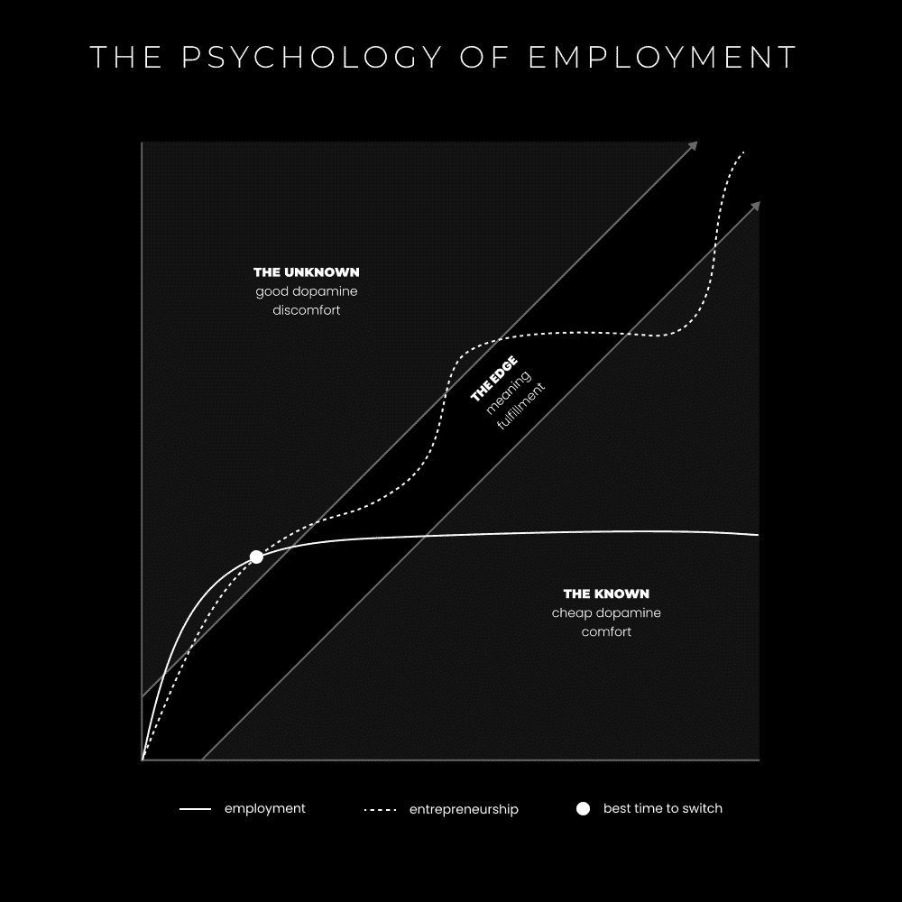

# 创业是现代生存之道（如何逃离工资奴隶制）

> 原文：[`thedankoe.com/letters/entrepreneurship-is-modern-survival-how-to-escape-wage-slavery/`](https://thedankoe.com/letters/entrepreneurship-is-modern-survival-how-to-escape-wage-slavery/)

这封信可能会让一些人感到不安。

因此，我要求你们保持开放的心态。

没有开放的心态，就没有机会以*帮助*你的生活的方式从他人的视角中接收哪怕是一粒真理的种子（无论多小）。

记住，那是我的意图。

帮助而不是伤害。

如果你误解了我的话，无论多么严厉，受伤害的将是你自己。

即使我的意图是伤害你，有些人可能会认为那是一种积极的东西。如果你选择受伤，你就会受伤。

如果你感觉到你的思维开始封闭，抵制冲动的冲动。你知道这种感觉。很难有其他想法，除了外部世界编程给你的负面垃圾。

就这样，让我们直接进入正题。

*你是一个奴隶。*

我是一个奴隶。

如果其他人也都是奴隶，奴隶们就不会意识到自己是被奴役的。

就算众所周知且人人痛恨的“奴隶制”已经不复存在，这并不意味着奴隶制仍然不存在。

不，我并不是在谈论性奴隶制，尽管许多色情滥用者可能属于这一类别。

我在说的是精神和财务上的奴隶制。

> 奴隶（名词）——被迫为他人工作并服从他人，被视为其财产的人。

那个定义中的关键词是“力”。

力可以有多个定义和上下文。

为了保持连贯性，我们将使用这个定义：

> 力（名词）——作为物理行动或运动的属性，力量或能量。

换句话说，有一种东西推动你去做一件事而不是另一件事。那个“东西”越强，你就越受奴役。

过去的奴隶可以逃跑，在某些情况下，但他们会因食物、水和住所耗尽而面临死亡。

话虽如此，奴隶制受到生存的影响。

正如我们之前讨论的，人类的生存不是物理的，而是概念上的。

人类通过形态、自我、自我或身份来生存。你可以用任何方式来标记意识中的区别。

一些常见的例子：

**政治意识形态**

如果你自认为是共和党人或民主党人，并且你的信仰受到挑战，你将感受到一种*身体压力反应*，这会促使你捍卫那些信仰。

你的生存感受到威胁，因为你认为一个想法是你身份的一部分，而这本身也是一个想法。

**体育队伍**

你有没有注意到，当人们争论哪个运动队会赢时，会变得明显愤怒？尤其是如果他们有赌注的话。

你的“团队精神”让你觉得自己是更大事物的一部分。这是你的精神。但这并不意味着它会让你心理健康状况恶化。

**你的身份**

你是咖啡鉴赏家吗？健康专家？高效的人？

如果有人告诉你停止喝咖啡，你感觉如何？如果有人告诉你生酮饮食最好，你感觉如何？你想要教育他们关于你“知道”的最好方法，或者你有经验吗？你附加在你身份上的意识形态，并感到需要生存？即使你知道这些笼统的陈述并不适用于地球上不同文化、不同资源中的每一个人？

如果你很有效率，你搬到一个新的地方，你感觉如何？你的日常习惯突然被破坏了。你通过努力、能量和习惯来维持你的生存形式。你需要一周或两周来“适应”，对吧？

这就是我经常成为奴隶的地方。对我的日常习惯。

**宗教意识形态**

即使人们说他们不关心将你转化为他们的信仰体系，他们仍然在无意识中这样做。因为他们被训练去繁殖他们的身份。

生存包括繁殖，我们通过交流传递给另一个人的任何想法都会影响另一个人的身份。

你的“自我”是一个概念。它是一张由想法和信仰构成的网络。这些想法和信仰会随着时间的推移而改变。你消费的任何信息都会影响你。

这就是为什么精神上的奴隶通常最终会失败。他们所做的只是消费自我贬低的梗，麻木自己的思想以避免面对他们情况的真相。

奴隶制之所以强大，是因为如果我们被训练去生存一个身份，比如一个工作头衔，如果我们考虑辞职，我们生存的威胁力量让我们继续留在这个职位上。

## 社会是一个关注力的金字塔骗局

如果没有得到关注，它就不存在。

如果它不存在，就必须投入关注才能让它生存。

这带来了两个认识：

**1) 你正在对无意识中的破坏做出贡献。**

巨型企业是如何成长和繁荣的？

他们从小做起，随着时间的推移形成了一个权力等级。

顶层的人少，权力大，底层的人多，权力小。

层级顶端的（公司和高管）之所以能做他们所做的事情，是因为大量的人从底层向上给予关注，关注任务、愿景和价值观。

底层由低技能的苦力工作组成，比如麦当劳的收银员，然后向上发展到市场营销和商业运营，直到达到顶层。

从本质上讲，大量的人不可能在这个等级制度中上升。

问题在于底层的人们对自己的工作所产生的影响是无意识的。

就像麦当劳如何通过他们的食物毒害人口（收银员有广泛的营养和健康知识吗？没有，否则他们就不会在那里工作，他们可能会在营养领域工作）。

或者军事程序员为无人机编写代码，这些无人机在国家的另一边执行杀人命令。

或者甚至是一个课程创造者的网页设计师，他们欺骗人们。

*“宽恕他们，因为他们不知道自己在做什么。”*

**2) 你可以将有意识的愿景变为现实。**

唯一的逃脱方式是建立你自己的东西。

但当你成为消耗你时间和精力的奴隶时，这变得越来越困难。

你花了 20 年、30 年，甚至可能 40 年才将自己钻进这个现实。但走出这个现实不应该花那么长时间，但请有点耐心。

脱离的方法是[成为价值创造者。](https://thedankoe.com/letters/the-value-creator-a-new-internet-career-path-for-intelligent-people/)

真正的价值是创造性的。

创造力允许变化和出现。

它允许形式、自我或身份进化成新的东西。

如果你唯一能提供的价值是物理的，你将陷入体力劳动的工作（而那些在顶端的人用他们的头脑赚钱）。

正如我们总是谈论的，你必须：

+   推动未知领域的边界。

+   在路上学习和发现新的潜力。

+   获得构建有目的产品的必要技能。

+   解决你自己的问题，这样你就能创造出一个真正有价值的问题。

+   以创业作为实现你对未来愿景的载体。

你必须创造自己的有意识层次，以最大限度地减少无意识破坏。

## 工资奴隶

我厌倦了争论的双方。

“9-5 的工人是奴隶！”

“约翰尼，如果你做 9-5 工作，你并不是奴隶。”

两者都是错误的。两者都是正确的。

两者都在试图获得最大的参与度和提升他们品牌的地位。他们没有退后一步思考人们是否真的是奴隶。没有深度和理解的观点对人类是一种伤害。

事实上，95%以上的 9-5 工人都是奴隶。

你的感受在这里不重要。如果你觉得屏幕上的文字让你感到威胁，那么我所说的可能有一些真理。向内看，看看你在隐藏什么。

大多数工人是奴隶的直白定义。

如果你不能停止为了生存而工作，没有立即开启其他选择的技能，并且你是某个公司的“财产”或*雇员*…那就是一个奴隶。

现在，这并不意味着你不能快乐。

每个人都以某种方式成为奴隶，我们都在生活中经历着快乐和痛苦的波动。

如果快乐是我们从世界的巨大不幸中分心时获得的感受，那么奴隶制可能会让一些人比非奴隶更快乐。

你可以在生活中（在某些时刻）快乐，同时没有意识到生活中的问题。

但一旦你真正意识到它们，你将感受到进化的拉力。

我不是来诋毁 9-5 工作的。

我认为它们是一个*必要的*垫脚石。

我还认为入门级商业模式，如代理工作、自由职业、辅导甚至数字产品，是你人生工作中的一块垫脚石。它们很容易让你成为奴隶。

然而，个人品牌并不是商业模式。它是你在发展过程中为任何你希望推广的产品或服务建立受众的方式。

个人品牌是你在数字社会中的性格。

许多人*会*陷入等级制度中的某个层次。也许那就是他们的命运。而且那也行。

虚拟现实，如视频游戏，有一个由 NPC（非玩家角色）构成的社会，这些 NPC 在互联网上是无意识的捣乱者、消费者和回复者。

事实是，大多数人将不会意识到他们对世界的影响。

我无法改变它们，你无法改变它们，但我们可以在自己的生活中改变我们所做的事情。

## 创业是现代生存之道

对于长期思考者来说，创业是唯一合理的选项。

如果你长时间待在 9-5 的工作中，你将变成一个格子间的猴子。

你的心理被编程为狩猎。

通过狩猎，你可以做出新颖的发现，这有助于你的生存。

想象我们的祖先每天经过一个光秃秃的灌木丛。它对他们未来的发展没有帮助。

但有一天，它长出了新的浆果。

有人经过它，注意到它，这种新奇性引起了兴奋。他们要么收集浆果，要么记住它们以便以后生存更长。

当你陷入 9-5（或新的 9-5，如代理或自由职业）时，你生活在永恒的已知中。你无法在已知中做出新的发现。

你感到无聊、抑郁，并认为生活毫无意义，因为你得到的多巴胺只来自表面来源。

你从不冒险，进入未知领域，发现新的知识、工具和潜力，这些都能提高大脑中的多巴胺水平。

你必须进化。

创业是一条充满不确定性的道路。

像在丛林中砍伐一样。

你需要学习学校里没有教授的技能。

你需要接受失败、拒绝和缓慢的进步。

你需要从你的错误中学习，明天再次出现，并一直努力直到找到金子。

作为一名企业家，你通过收集知识、创造有价值的产品并将其展示给可能从中受益的人来“狩猎”你的生存。

正如我之前讨论的，我这样做的方法是：

+   以个人品牌作为基础开始

+   在现实世界中解决你自己的问题（健康、财富、人际关系）

+   通过写作分发你的发现、观点和信念

+   从自由职业或咨询服务开始，并取得成果

+   销售需要投入较少时间（一旦你的受众增长）的实体或数字产品

+   通过坚持不懈和迭代，在 2-4 年内获得丰厚的收入

+   扩大你对未来的愿景，并建立你想要达到的一切（软件、宇宙飞船，等等）

这是我提供的整个流程，包括模板和教育，都在[数字经济学](https://digitaleconomics.school)内部。

## 技能与机会

我在生活中对许多事情都感到奴隶般的存在，但我希望相信我已经逃离了工资奴隶制。

如果我的业务从地球上消失，我仍然可以：

+   创建一个其他人需要的产品或服务。

+   打电话、发电子邮件、做广告和传播互联网内容，以推动流量到那个报价。

+   在第一个月赚 5-10K，并利用我所收集的数据来提高这个数字。

为什么我能做到而大多数人不能？

因为在过去 10 年里，我学习了图形设计、视频编辑、文案写作、心理学、网页开发、营销、销售、电子邮件营销、演讲、受众建设、广告、产品设计、课程创建、创意生成、生活方式设计、健身、营养等等，这些都是人们感到困难的事情。

即使身无分文，我也能创建一个教授人们如何创建销售着陆页的服务。

我会根据我想要如何构建报价来收取 1000-2500 美元的 4 次电话“训练营”费用。

我会针对那些拥有完整网站的新业务（因为那甚至不是销售产品或服务的最佳方式）。或者我会针对那些希望在就业之外学习有利可图技能的学生。或者我会针对那些希望在平台收入之外将品牌货币化的创作者。

我会在早上花 3 个小时与人 DM 和在线撰写营销内容。

人们会阅读这篇文章并试图复制它。

然而，他们会失败，因为他们不理解经验有多强大。有许多微妙的细微差别和思维过程，初学者必须努力重新编程。

当你去学校时，你会专注于几项选定的技能，这些技能会训练你成为一个可雇佣的职位。

在学校之外学习的每一项技能，我都能发现多个机会，让我在非工作状态下赚取收入。

这种效果会累积。

我已经培养的技能，我可以写出 50 种不同的产品，我知道在努力的第一个月内它们将会盈利。

在这里，技能是由经验决定的。

你不能只是了解他们并期望看到我在市场上能看到的东西。

你还没有失败到理解所有这些商业事务背后细微差别地步。

如果你想要逃离，这是你发现机会和培养实现它的技能的方法：

**1) 沉浸在新信息中，以编程你的思维**

大多数人都沉浸在与他们目标无关的信息中。

他们没有愿景、目标或问题来通过信息进行解读。

很可能你已经阅读了改变一生的信息，但它并没有在你的意识中留下印象。

当“摆脱工资奴隶制”的目标始终牢记在心时，你可以：

+   安排至少 20 分钟专门用于消费有助于实现该目标的信息。

+   购买书籍、使用你的 Audible 积分、保存播客、关注新的社交媒体账户，并在 YouTube 上添加新的“稍后观看”视频。

+   离开你的房子，在手机上打开笔记应用，在你沉浸在信息中时记下你的发现。

在你寻找更好生活的过程中，你会在大脑中感受到多巴胺。

**2) 研究你渴望构建的有目的性的业务**

现在你有了消费习惯，你需要一个更实际的目标来应用你所学的。

你要建立什么样的业务来摆脱工资奴隶的身份？

+   在心中记下你每天融入的应用和活动。

+   看看你是跟随谁，他们建立了哪些业务。

+   购买一本关于你感兴趣的具体业务模式的书籍或课程。

你必须发现一个你感到被吸引去构建的业务模式。

一个你可以着迷的。

哪一个都无关紧要。

*模仿* 帮助我建立了第一个成功的商业。

这帮助我识别了盲点。

那些盲点通常是阻止我看到成功的关键部分。

养成研究你想要成为的人的习惯，下载并购买他们提供的所有东西，并制作一个他们在线上所有内容的思维导图（社交媒体档案、网站、着陆页、电子邮件序列、产品、服务、吸引物、书籍等）。

反向工程那些使他们成功的原因。

如果你不知道接下来该做什么，我不知道该告诉你什么。

**3) 成为你的多巴胺经销商**

我和我的朋友前几天在讨论。

我会转述他说的。

*你知道吗，很疯狂……我记得问你为什么你的朋友们都不采取行动或跟随你的脚步。我现在明白了。*

*人们都是多巴胺上瘾者，即使是商人。*

*那些不采取行动的人不知道如何用商业**来替代他们从当前习惯中获得的多巴胺**。

*所以，他们要么根本不开始，要么在一周后放弃，因为他们无法获得刺激。*

这让我回想起并意识到是什么让它对我有效。

我一直在追逐那种美好的多巴胺，但方向是正确的。

所以，我的建议：

+   对你想要在生活中得到的东西（金钱、成功、和平、满足）有一个宽松的想法。

+   开始构建一些东西，任何东西，让它成为现实——当然，我会推荐一个单人企业，因为它具有长期性。

+   学习你最想学习的知识，以帮助构建它（技能、课程、网站、标志等），这样你就能获得多巴胺的刺激。

+   如果你感到无聊，不要害怕改变你正在做的事情。

我把我的独特成功归因于“闪亮物体综合症”。

我尝试过 7 种不同的商业模式，都失败了。[（https://thedankoe.com/letters/i-failed-at-7-online-business-models-and-turned-it-into-a-full-time-creative-income/）]

大多数人看不到的是，没有那些失败，我就不会在这里。

我学到的每一项技能都累积成了更好的机会。

没有文案，我的推文就不会是现在这样。

没有网页设计，我的网页就不会是现在这样。

没有 Photoshop 艺术，我的个人资料图片和品牌形象就不会是现在这样。

列表还在继续。

用能让你解脱的习惯来替代让你受奴役的习惯。

这不会立即发生。

对此感到满意。

如果你能够坚持在这条路上，你就赢了。
