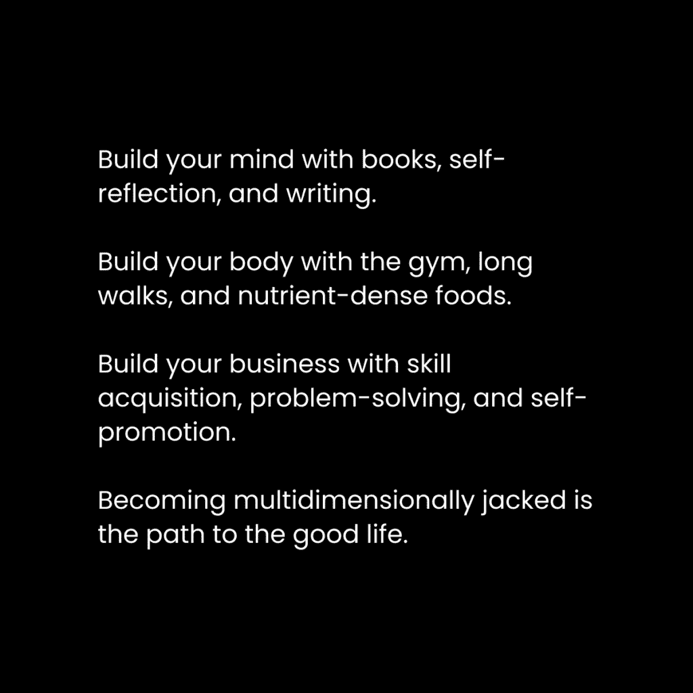

# 你之所以不成功，是因为你太在乎了（如何停止在乎）

> [原文链接](https://thedankoe.com/letters/you-arent-successful-because-you-care-too-much-how-to-stop-caring/)

当你信任自己的未来时，你就不再关心别人的意见。

这…有很多东西要理解。

缺乏自信是困扰大多数人口潜力的一个问题。他们太在意别人的看法。

假设你想开始创业，思绪开始涌来：

我的父母会怎么想？

我的朋友们会怎么想？

我配偶会怎么想？

这是否足以取代我的收入？

这需要多长时间？

当你真正开始建立业务时，甚至不要让我开始谈论那些想法。

人们失败的原因是他们无法承担实现他们设定的目标所需的情感负担。

对于每一个更好的生活的想法，都有 100 个想法把你拉回原点。

而那只是关于商业的想法。

我们一天中还有其他 60-80,000 个想法怎么办？

我们有很多事情要做。

当我尝试交新朋友时，我会显得奇怪吗？

如果我不能控制我的债务，我会在生活中走到哪里？

我今天早上喂狗了吗？想象一下，如果他们发现了，人们会认为我是一个多么糟糕的宠物主人。

培养自信并非易事。

更多信息，更多责任，以及更多未来的选择，将自信转化为成功，将焦虑转化为失败。

这是我们生活的现代环境。

我们如何开始培养那种导致自信的信任感？

## 自信的 4 个支柱

当大多数人想知道他们如何能变得更加自信时，他们会想起那种简单的建议：

“自信 = 能力。”

这是真的，但大多数人会将能力视为在特定技能上变得更好。

所以他们会学习，学习，再学习，从不采取行动，从不自我反思，也从不真正在任何情况下将自信作为一种技能来培养。这是最常见的结局。

那个简单声明背后有深度，很少有人能看到。

我们必须寻求理解这个声明，因为很明显，“自信 = 能力”作为一般建议并没有解决世界上最大的问题之一，反而使它变得更糟。

**支柱 1）观点**

当你进入一个你感觉不自信的情境时，焦虑会急剧上升。

这会使你的思想封闭，除了你的想法之外，其他一切都不考虑。

它们会倍增。

你完全从情境中退缩，成为你过去的奴隶。你之前经历过的经历。你仍然是同一个人。

你必须摆脱这种状态，并做出有意识的努力来重新编程你对情况的反应习惯。

要做到这一点：

+   当你进入一个情境，焦虑被激发时，请暂停。

+   放大视角，看看情况本身，只是一个正常的情况

+   将意识转移到与你处于同一情况的人身上

“转移意识”就是采用另一个人的视角。

大多数人只是像我们一样经历同样生活的人。

亿万富翁也有同样的问题。

健身模特也有和我们一样的问题。

你在心理上置于你之上的人也有同样的问题。

会使他们对你产生负面反应的唯一一件事就是将他们视为非人类。

不要将他们置于你之上。

记住，你正在形成一种习惯。

这需要重复和实践。

如果你不能对情况有观点，你就无法前进到其他支柱。

**第二支柱）感知**

你如何看待情况决定了你的行为。

这要求你在情况发生之前和过程中保持开放的心态。

如果你滑动社交媒体，没有将企业主的推文视为一个接触的机会，你就不会去接触。

如果你将其视为一个机会，你仍然可能会搞砸信息或者根本不发送信息，因为你误解了那个人。

这同样适用于结交新朋友或参与困难的讨论。

感知是双向的。

你会根据他们如何展示自己来以某种方式感知他人。

他们会根据你如何展示自己来感知你。

如果你没有“看起来合适”或者以某种方式表现自己，这会导致对方做出负面解读，事情就不会顺利。你会在潜意识中知道这一点。你不会参与那些因为你的外表和行为方式而让你自己处于失败境地的情况。

我非常内向，但人们经常告诉我，我穿着、走路和说话的方式看起来很有自信。

练习。

**第三支柱）实践**

你在某个方面的能力允许你更好地感知情况。

将技能获取视为提高你在人生游戏中水平的一种方式。

在一款视频游戏中，有“技能树”。

在玩游戏的过程中，你选择技能来帮助你以你想要的方式玩游戏。

当你练习这些技能时，你增加了你的经验，新的技能对你变得可用。

这里关键点是：

*你无法访问其他技能，直到你练习了可用的技能。*

你没有意识到有利可图的机会，因为你没有识别、选择和采取行动的技能。

当你朝着你的目标前进时，这将需要你教育和练习技能以达到那些目标。

如果你目标定得太高，你会感到不知所措，不知道该学什么。

你必须在你所在的水平上玩游戏，并获取达到下一级所需的技能。

随着你等级的提升，你会在你的工具箱中填满技能，这些技能允许你看到你所在的飞机，这比你在低等级时的视野更广阔。

我第一次成功的尝试是自由职业网页设计。

一个任何人都可以学习的单一技能。竞争激烈，争夺更高的价格。

我知道，如果我想做一些更有利可图的，比如为服务型企业制作漏斗，我就必须学习营销、文案写作和买家旅程等技能才能做好。

然后，当我追求创造者的水平时，我需要结合我所知，并添加新的技能，如内容写作（我在[2 小时作家](https://2hourwriter.com)教授你所需的所有技能）。

我的水平越高，我遇到的人越多，我在多个领域的自信也越强。

你能做的最糟糕的事情就是停止学习新技能，满足于你现在的水平。

**第四支柱）真实性**

真实性是做你想做的事情，不受外部思想、观点和信念的干扰，这些是你认为需要遵守的。

当我诅咒时，有人在评论中告诉我那是不专业的，我是不是要符合他们的相对信念（这并不是绝对真理）还是我要自己思考？

我不在乎是否专业。我不在乎被那些每个人都能以不同方式解释的词语冒犯。

通过真实性获得的自信是一场心理游戏。

你必须每天练习。

你必须暂停，获得视角，感知情况，并练习情况所需的技能。

真实性是你实施自信四支柱的方式。

## 不寻常的自信之路

<picture decoding="async" class="wp-image-1370"></picture>

创业是你的天性。

为了追求新的挑战，永远不要满足于现状，通过技能获取来扩展你的视野，并得到反馈，看看你是否实际上以金钱的形式为社会做出了贡献。

创业是创造。

而成为一个创造者是通过你的人类边缘引导神圣的行为。

你不希望陷入一个挑战不再存在的境地。

就像笼子里的猴子，你的心理会受到影响，即使你是顶尖的 1%的收入者，你也会 wonder 为什么你的生活并不令人满意。

个人成长是通往业务增长的门户药物。

而业务增长是不寻常的自信之路。

我在[数字经济学](https://digitaleconomics.school)中将两者结合，以便你可以提升自己，将自我产品化，并从自我中获利。这是一个自然的进步。

**1) 它要求你进化，否则就会死亡。**

大多数人在 25 岁时就死了。

他们得到了他们的工作。

他们得到了他们的配偶。

他们得到了他们的房子。

他们得到了他们的车。

他们得到了社会为他们所期望的一切。一个让人感到舒适、顺从，对他们试图生存的系统威胁很小的人。

生活是不断流动、不断演变的，如果你选择通过满足于次等生活来阻碍这种流动，那么你就死了。

死亡是象征性的。而所有理解都是隐喻性的。

如果生活是成长，而成长需要新的，那么死亡就是新想法、潜力、项目和实践的死亡。

如果你想在一个永不停息变化的世界中生存，创业将确保你不停止。如果你坚持到成功，那就是。

**2) 它要求你成为你所在行业的专家。**

如果你理解不足，你将得到次优的结果。

理解与知识不同。

理解是意识扩展向上的运动。

冥想是意识扩展向下的运动。

大多数神秘主义者和精神导师忘记了这种平衡。

这不是“或”创造力。

这不是“或”战士。

这不是“或”进步。

这不是“或”做。

这两方面都是。

这是生活。

二元性崩溃为了一体。

如果你只是堆砌理论而不付诸实践，你在这个行业中将会失败。

你需要日常教育和执行，而不是只有其中之一。

**3) 它要求你为自己和你的客户取得成果。**

如果你没有取得成果，你就没有价值。

简单就是这样。

如果你没有取得成果，那不是放弃的信号。这是一个改进的信号。真正的价值需要随着时间的推移而发展。

创业是你确保自己在现实中成为一个有价值的资产的方式。

**4) 它要求你在你所做的事情上表现不佳，以便你可以改进。**

认为你在开始时几乎不会在几乎所有事情上失败是愚蠢的。

这就是阻止大多数人采取行动实现梦想的原因。

一旦你克服了第一个障碍，你就会进入一个纯粹的进步季节。

**5) 它要求你改变你的工作、休息和娱乐习惯。**

你不能凭借达到第二级时的角色达到第三级。

成长需要改变，这就是为什么大多数人会早早地安定下来。

**6) 它要求你掌握心理学技能，以便理解你的内心。**

营销、销售、写作和演讲是商业成功的基础。

在当今世界，财富是通过代码和内容产生的。

代码是互联网的后端。

内容是前端。

结合两者，你就有了人和产品。

将人们推向产品，你就能获得利润。

你可以学习编码，这是极其有价值的，但除非这是你的热情所在，否则你最好学习内容。

你可以使用编码者构建的（如网站构建器、社交媒体平台和互联网上的所有其他东西）来分发你的内容。

内容需要自我理解。

你必须吸引注意力，保持注意力，并向这些注意力提供价值。

我在[《一百万美元技能堆栈》](https://thedankoe.com/letters/the-1-million-dollar-skill-stack-learn-in-this-order/)中讨论了这一点。

## 自我提升者的潜在进步路径

<picture decoding="async" class="wp-image-1371"></picture>

当你试图变得更加自信时，焦虑陷阱是危险的。

你会焦虑于接近新人。

你会焦虑于构建业务所需的改变。

当你感觉到它时，停下来。

（不，说真的，这需要有意识的努力……*暂停。*）

放大视角。

调整你的思维方式。

焦虑的解药是好奇心。

就这样。这就是调整。

当你担心开始创业时，你展望得太远，以至于无法清晰思考。你的大脑无法将你心理上所处的混乱情况整理有序。

将你的注意力转回到你现在可以做的事情上。

对你可以开始学习的内容感到好奇，然后去学习它。

当你在社交场合时，停止想象与那个人未来的每一个小细节。

将你的注意力集中在眼前的人身上。

有什么吸引你的东西？

向他们询问。

这里是如何利用好奇心来建立盈利业务的动力（自信作为副产品）。

**1) 从写作开始**

当你不自信时，写作是你最好的选择。

而且，这是任何和所有内容的基础。

推特、广告、视频、短视频等所有内容都是从撰写实际帖子或脚本开始的。

写作让你在别人为外表竞争时，可以展示你的智慧。

你不需要展示你的身体，甚至你的脸。([橙皮书](https://twitter.com/orangebook_)是我最喜欢的匿名作家之一。)

要成为一名优秀的作家，你需要理解心理学，以构建一个能够吸引、保持和传播注意力的信息结构。

要理解心理学，就要研究营销和销售。这样你才能学会在现实世界中应用你的心理理解。

如果我要给你指一条路，这里是如何开始写作的：

+   选择一个你感兴趣的主题，将其作为全职工作。

+   拨出 30 分钟来学习营销、销售或你的兴趣。

+   不要错过任何一天的学习。观看视频、播客、阅读书籍和互联网内容。

+   记录下那些让你印象深刻的想法。

+   从 Twitter（X）或 Threads 开始，开始发布你的想法。

+   将社交媒体视为一项技能，这样你就可以成长（我在[2 小时作家](https://2hourwriter.com)中教授所有这些）。

在 3-6 个月的课程中，你应该会获得相当数量的关注者。

足以让你有信心将其作为全职生意。

一旦你有足够的读者，你就可以创建一个产品或服务来货币化你的写作。

营销和销售的知识将在这一刻累积。

**2) 开始演讲**

大多数人不知道，但我的第一个拓展平台不是 Instagram，而是一个播客。

为什么？

+   它帮助我遇到高层人士，并获得更多机会。

+   你不需要视频编辑技能。这很容易从写作过渡过来。

+   它迫使你识别在与他人沟通中的盲点。

我没有使用播客来货币化或成名。

这在播客中是非常罕见的。

我用它来联系我想交谈的人。

人们非常喜欢参加播客。

我想和贾斯汀·威尔士谈谈，所以我让他做一期播客，这给我的品牌带来了新的视野。

我们关于一个人业务的讨论是我获得 YouTube 上 150k 订阅者的催化剂，用了不到 6 周的时间。

那是另一个下一步。

你可以直接用之前的写作内容去 YouTube。

你可以直观地看到在制作了 6 个月的视频后自信心的提升。

你会变得更加自然，更加简洁，更有影响力。

你的业务会随着你的自信一起增长。

**3) 创建一个产品或服务**

到现在为止，你正在扩大你的观众群。

你有人们。

希望如此。如果你没有，你需要退一步，意识到这是一个技能问题。你需要对社交媒体有一个大局观，以便无论以何种方式都能吸引到优质内容。

金钱需要人和产品。

“产品”在这里也可以包括服务。这是你卖给吸引到的人的东西。

这是赚钱的唯一方式。

你可以努力成为那些仅靠广告收入（来自社交媒体平台）就能生活的人之一，但你将成为算法的奴隶。

创建自己的产品或服务是你掌控收入的方式。

社交媒体作为一种技能，成为了一个你可以随时打开以赚取更多金钱的水龙头。

你知道如何吸引人们，你有一个能卖出去的产品。

（这两者都需要很多工作，你需要在两者上都有所提高。）

我已经对此进行了广泛的讨论，所以这里有一些信件来学习如何创建产品：

– [一个人业务模式的概述](https://thedankoe.com/letters/the-one-person-business-revisited-turn-yourself-into-a-business/)

– [即使是新手也能创建出优秀报价的最佳方式](https://thedankoe.com/letters/the-best-online-business-model-to-make-1-million-in-2023/)

– [如何将你脑中的 10 万美元知识产品化](https://thedankoe.com/letters/you-have-100000-of-knowledge-trapped-in-your-brain/)

建立产品或服务有助于增强自信的原因是：

+   你一开始会做得不好。这几乎适用于你做的任何其他事情。不要因为商业对你来说似乎很陌生就把它看作是可怕的。

+   你会直接得到关于哪些方面可以改进的反馈。人们可能会很严厉，但大多数人都是友好的。

+   如果你真的想赚钱，你需要真正提供价值。如果你没有继续扩大你的观众群或金钱 – 可能开始思考你真正有多有价值。

好了，朋友们，就到这里。

练习自信作为一种技能，让它成为你一生的习惯。

– 丹·科
