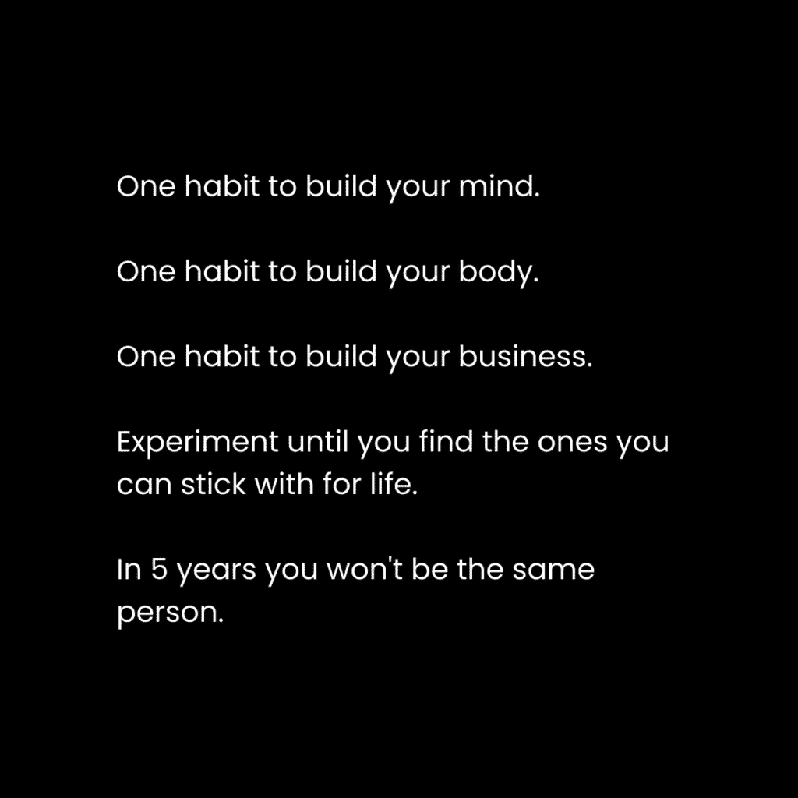

# 中庸生活的解药（成为多维度健美的人）

> [`thedankoe.com/letters/the-cure-to-a-mediocre-life-become-multidimensionally-jacked/`](https://thedankoe.com/letters/the-cure-to-a-mediocre-life-become-multidimensionally-jacked/)

由于某种原因，我总是有动力“最大化”我生活的每一个领域。

我把生活看作是一款电子游戏。

我的思维、身体、精神和财务是我获得经验的能力。

我想要成为一个多维度健美的人。

也许是因为我早早地开始质疑这条默认的道路。

也许是因为我注意到那些看起来不快乐、超重和痛苦的人。

也许是因为我观察到人们通过在人生中走一条特定的道路来限制自己的机会。

跟随大多数人做的事情是没有意义的，因为这会创造出一个大多数人都有的人生，而这并不美好。

生活中默认的道路问题在于专业化、分割化和细分市场。

我们被训练去关注一个点，而不是连接这些点的线条。

在学校，我们学习生物学、化学、数学、文学等等。我们参加的各个课程之间没有连接点。它缺乏整体性、创造力和那种能产生异常结果的实际性。

放学后，我们进一步将我们的思想局限于我们认为想要成为的人。

作为青少年，我们被期望在还没有开始真正的生活之前就选择人生中无限多条道路中的一条。我们怎么能确切地知道自己想要什么？专注于一件事情度过余生似乎比这更糟糕的痛苦配方。

这剥夺了我们的好奇心和创造力。

这导致了一个战士缺乏智慧而知识分子缺乏勇气的世界。

一个“哲学家”会忽视生活的实际方面，因为他们是知识分子。但哲学的主要问题是“一个人如何过上好生活？”如果一个哲学家不能建立企业、平静自己的心灵或成为一个社交达人，那么他们的哲学就没有意义。

科学家会把青蛙扔进搅拌机来检查它的各个部分。他们会发现一些东西，但如果他们整体研究，那么发现的东西将不会这么多。

而不是只看青蛙的各个部分，你可以研究它的环境、交配模式、决策和饮食，而不会忽略任何一个方面。

分隔学习的效应破坏了我们的个人潜力。

## 现代文艺复兴男子

出生时，我们被指定了一种生活方式。

去上学，找份工作，找个伴侣，尽量挤时间做些让生活变得美好的活动，65 岁退休，从此不再工作，因为工作本是生活中不可或缺的一部分，我们应该将注意力投入到我们认为有趣的事情上。

在学校，我们被告知要选择一个专业。

在商业中，我们被告知要选择一个细分市场。

因此，我们忽视了其他研究领域，我们的结果也受到了影响。

创造力是通往财富、精神和财务的途径，而创造力需要高度专注于解决特定问题的理解。

我们正处于第二个黄金时代的正中间。

互联网上有如此多的信息，以至于它变得令人压倒。你不可能学会所有东西，但你可以学会很多。

人们仍然生活在一个必须非常擅长“一件事”的范式里，因为在过去，这是环境对成功的要求。

现在，成功是为[价值创造者](https://thedankoe.com/letters/the-value-creator-a-new-internet-career-path-for-intelligent-people/)保留的。专业通才。新文艺复兴人。数字文艺复兴人。这样的人可以研究多样化的兴趣，从中创造价值，并维持一种愉快的生活方式，就像我在[数字经济学](https://digitaleconomics.school)中教授的那样。

我们生活在有趣的时代。

信息量很大，但对于没有目标或学习意图的人来说，这只会让人感到压倒。

创作者经济出现了，课程开始将信息浓缩成可操作的商业模式和人生建议。

内容、课程和书籍是现代世界的心理压缩包。

现在不再需要 4-12 年，4 万美元和一张纸来获得一份可替代的收入。

但，这暗示了个人责任。

没有人在那里牵着你的手。

这是你需要做的：

**1) 我什么都不是**

成为无标签的人。

成为一切。

成为一名设计师、作家、营销人员、社交者、跑步者、健身者、哲学家、科学家、心理学家和通才，他们知道如何维持他们强烈的求知欲。

订阅一种技能、意识形态或身份会限制你在每种情况下的潜力。

宇宙是一个变形者。它处于不断的流动中。海洋蒸发，在云中凝结，雨滴成水坑，水不可避免地找到它的归途。

没有什么是永恒的。

你的细胞与几年前完全不同。你的兴趣可以改变。你的思想可以改变。你可以改变。

成为宇宙。

**2) 好奇心指南针**

当我还是个孩子的时候，人们会劝阻“经历一个阶段”。

我有过我的情绪化阶段、健身房兄弟阶段，甚至我的狂欢者阶段。所有这些都塑造了我。

实验没有任何问题。迎合他人的 whims 完全有问题。

处方、路线图和长期课程并不坏，但它们限制了你的思维，使你专注于特定的结果，并给出达到那个目标的特定建议。

这很有用，但不应该被视为一次性的交易。这就是你如何陷入悲惨的生活。

我在自己和那些我渴望成为的人身上都注意到了一个模式：

他们不会将所学限制在一件事情上。

一切都相互连接。

通过追求你好奇的事物，你不仅会更有动力去学习，而且模式识别会增加良好的多巴胺，并巩固高级知识。

“专注于一件事情”是很好的建议，但只有当那一件事情是一个大、有肉、有意义的目标，需要你专注于大量的兴趣、技能和经验来实现时。

我的“闪亮物体综合症”让我有了今天的在线形象。我的品牌、内容和产品都是我技能和兴趣的独特综合。

对一个主题、技能或兴趣极度好奇 1-2 个月，将其添加到你的心理工具箱中是明智的。这将随着你经历生活而增加你对机会的认识。

当你细分领域（时间过长或过远）时，你就变成了一个缺乏深度和个性的美化版搜索引擎。

如果你想在公共场合分享你的好奇心（以带来职业机会和满足感的方式），请查看[2 小时作家](https://2hourwriter.com)。

**3) 投资你的教育**

在这个生活中，你拥有的唯一东西：你的思想。

其他所有东西都可以从你那里夺走。

学校系统做对的一件事是持续、每日的教育，希望有一个更好的未来。

但是，学校不重视好奇心，所以大多数人毕业后都讨厌学习。

学习是人类经历的基础。

在你的脑海中刻下这样的观念：你必须每天学习一些东西，任何东西。无论是一小时还是三小时，你的未来都取决于它。

如果你不首先了解它们，你还能如何发现新的机会？你将如何采取对你来说不存在的机遇的行动？

当你停止学习时，你的生活就会停止进步。你停止了成长。心理上的益处和令人愉悦的化学物质停止流动。生活变得平庸而重复。你变得机械和机器人般。

我们已经讨论了很多关于学习的事情，但如果没有建造，学习就没有意义。

## 成为一位建造者

在我的新书《专注的艺术》（即将推出）中，我有一个关于建造者哲学的部分。

我在生活中注意到的一个模式是，我总是抽出时间来建造一些属于自己的东西。

学校作业、客户工作以及我在工作中分配给我的项目都是必要的，但它们并没有给我带来我想要的满足感。

我的生活是通过一系列个人和商业项目构建的元项目。

项目为你的学习注意力提供了框架。

当你的注意力集中在你所建造的事物上时，你所接触到的所有信息都会通过那个视角进行过滤。

学习的源泉是挑战而非记忆。你必须遇到一个问题，发现那个问题的解决方案，并将其融入你的生活中。

为了确定一个问题，你需要一个目标。

为了解决问题，你需要创造一个解决方案。

为了创造一个解决方案，你需要一个项目，将你的注意力投入其中，为期 1-6 个月。

当我说项目时，我指的是可以衡量和记录的东西。它不一定要是实物产品。

这可以简单到拥有一个力量训练日志，跟踪你的食物，跟踪你的体重，以及研究健身信息以促进你的进步。

让我们从这里开始。

**1) 大的理性目标，小的非理性步骤**

大目标比小目标更好，因为它们给你提供了实现目标所需的愿景、动力和长期关注。

我对在一年内建立一个价值百万美元的企业比每天发送 10 条网络信息更兴奋。

我对今年夏天在海滩上看起来很瘦削比为一周准备餐食更兴奋。

要开始你成为多维度健壮的旅程，为你的生活主要支柱设定一个大目标。

+   **心智** – 你如何处理情绪和压力？你想要和其他人一样拥有平庸的心态吗？

+   **身体** – 你想要看起来和感觉如何？这如何影响你生活的其他方面（比如别人如何看待你，向你提供机会）？

+   **精神** – 你觉得生活缺乏意义、奇迹和满足感吗？你觉得生活是在发生给你，还是你在顺应生活？

+   **商业** – 你想赚多少钱？为什么？你想要这笔钱来自一个有目的的尝试，而不是 90%的工作？

我强烈建议你花 10-20 分钟在日记中写关于这个话题。它们如何影响你的生活？

问题在于人们在这里停止了。

他们只是精神上自我满足于他们的目标，却从未在实现这些目标上取得任何有意义的进步。

**2) 为生活的每个领域制定一个项目计划**

目标是“什么”，愿景是“为什么”，项目是“如何”。

现在我们有了对大目标的愿景和动力，我们需要获得清晰度。

项目有一个目标，一个过程，以及每天要完成的优先行动。

你每天可以做些什么来推动你的目标？

你需要了解哪些方面的目标，以便做出更好的决策？

你如何记录你的进度，以保持你明天回来的动力？

在你用来写下目标的笔记本中，为每个目标创建一个简单的项目：

+   **里程碑** – 记录具有现实时间表的具体里程碑。

+   **变量** – 列出每个帮助你实现目标的变量（对于健康：营养、训练、睡眠。对于商业：产品、流量生成、内容）。

+   **原则** – 那些能推动指针前进的优先行动。

+   **技能** – 你将需要获得以实现该目标。

这为改变你的生活带来了更多的清晰度。

**3) 先行动，再学习**

如果你想学得更快，就不要开始学习。

1.  制定一个项目计划。

1.  开始构建它。

1.  在路上学习。

太多人陷入了教程地狱，堆积了无用的知识，就像大脑迷雾一样。

开始，遇到问题，并尝试不同的技术来解决该问题。

当我学习 Photoshop 时，我会在开始之前试图了解这个软件的每一件事。

当我开始学习时，我感觉自己一无所知。

我不得不补充一些特定的教程和“跟我一起创作”的视频，直到我弄清楚如何创作我想要的东西。

我意识到解决一个问题的方法不止一种。

如果我想移除像树这样复杂的背景，我可以用笔工具、颜色通道、颜色范围或快速选择来完成。

快速选择是每个人都会做的，但往往会导致最差的结果。

当你在研究任何事情时，请记住这一点。

如果任何人都可以用容易获取的信息解决问题，那么可能还有更好的方法来做这件事，这会让你在竞争中占优势。

现在，我不想让你觉得除非你有问题，否则你**永远**不应该学习。

完全相反。

我强烈鼓励一个普遍的教育习惯。

每天沉浸在与你的目标相关的信息中 10-30 分钟。

观看一个你感兴趣的 YouTube 视频。购买一本畅销书。为你的下一次散步排一个播客（并且开始散步……我保证如果你不走出家门，你不会跟上这个学习习惯。太多干扰了）。

**4) 通过习惯形成的生活方式设计**

你和你想要成为的人之间的区别是你生活方式中组成的习惯。

仔细想想。

用心理、身体或财务上的方法来激励人们，他们是不是有一天突然醒来，就拥有了最好的头脑、身体和商业？

或者他们每天采取的小行动是否维持了他们的进步并朝着更好的未来迈进？

大多数人都会告诉你停止玩游戏、外出和分散注意力……我同意，但我不同意。

我偶尔还是会玩电子游戏。也许每周 5 小时。

我仍然和朋友出去，熬夜。也许每月 2-5 次。

我之所以仍然超过 99%的人，是因为我在早上提前安排了那些能够推动事情进展的任务。

在早上 5 点到 11 点之间我：

+   每周 3-4 天去跑步

+   写我的通讯和内容 1 小时（这维持了 95%的业务……记住，原则）。

+   开发一个新项目，现在是我的书和软件公司

+   每周 6-7 天去健身房

+   在所有这些活动之间散步

+   烹饪需要 10-15 分钟准备的高营养餐食（并且晚餐外出就餐相当多——我每天大约 4500 卡路里）

我知道不是每个人都能这样做，因为时间限制，但我过去也不能。

当你从你的努力中获得成果时，你在你所做的事情上会变得更加高效。时间会释放出来（因为那应该是你设定的几乎每个目标的子目标……这是一种衡量进步的绝佳方式）。

当你不确定时：

提前一个小时起床可以解锁无干扰的时间，这将解决你大部分的问题。

好了，朋友们，就到这里。

对于多维度的健身爱好者，

– 丹·科
