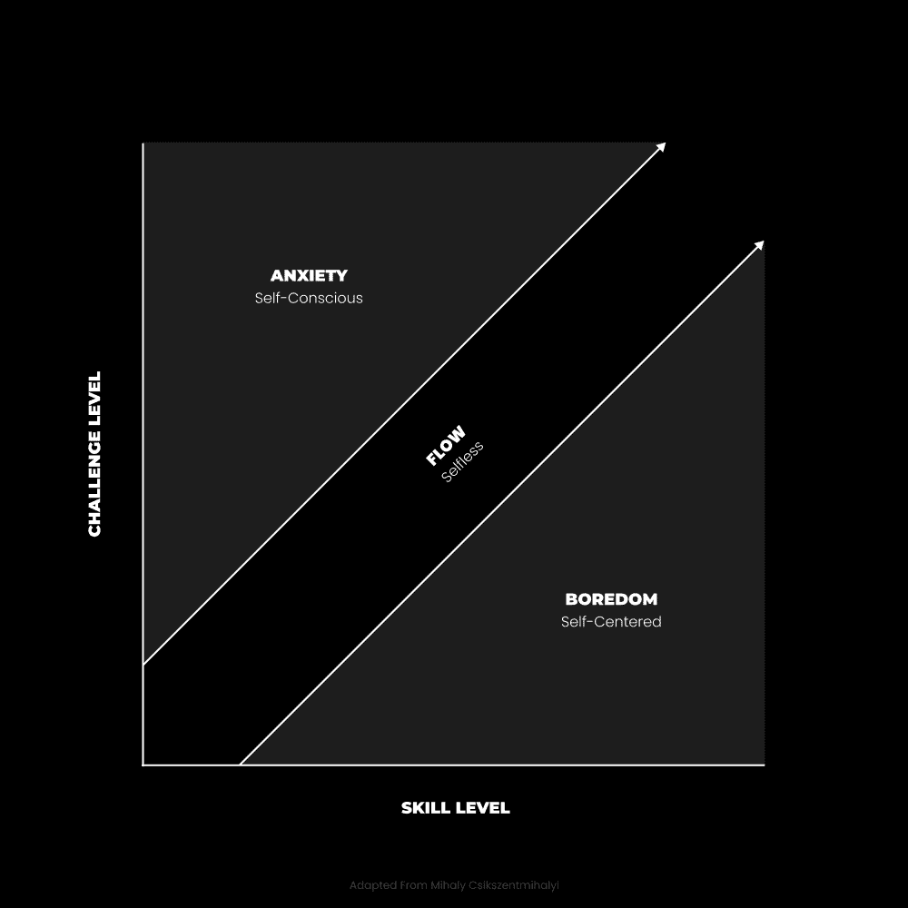
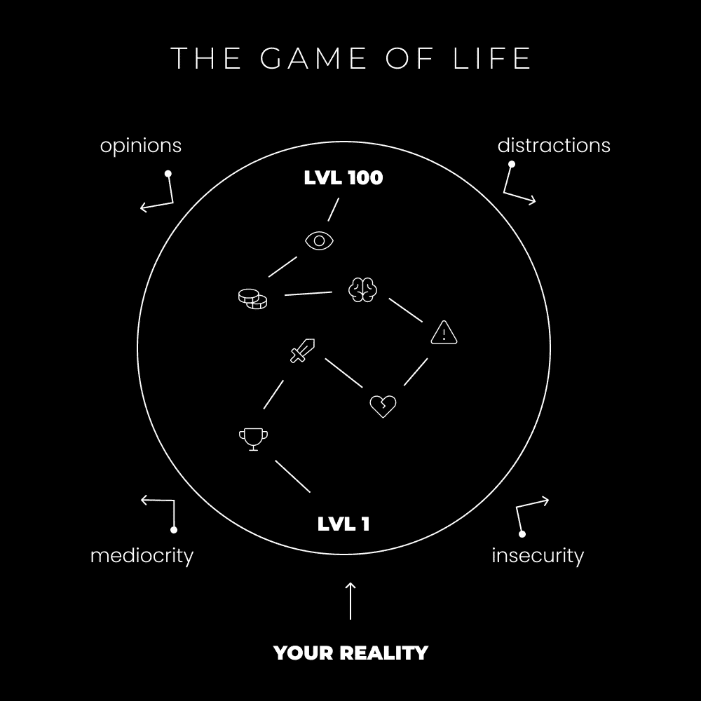
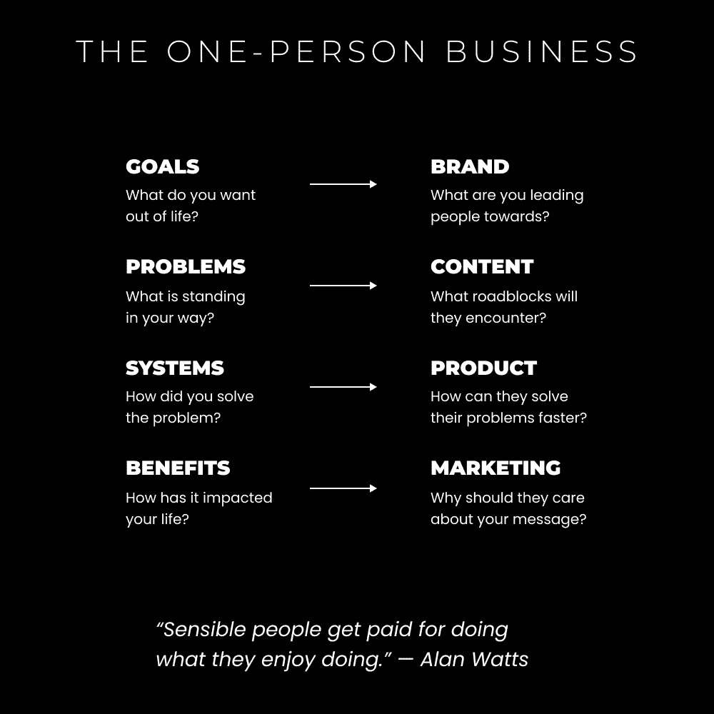

# 生活是一场电子游戏（你无法逃离矩阵）

> 原文：[`thedankoe.com/letters/life-is-a-video-game-you-cant-escape-the-matrix/`](https://thedankoe.com/letters/life-is-a-video-game-you-cant-escape-the-matrix/)

我记得我凌晨 3 点醒来，这样我就可以在我去上高中之前玩游戏。

从《光环 3》和《使命召唤》到《魔兽世界》和《英雄联盟》。

至少可以说，我沉迷其中。

提高我在电子游戏中的等级比提高我在现实生活中的等级更重要。

但我不会改变任何事。

我还能怎样写这封通讯呢？

心理学、形而上学、自助和现代商业都指向生活是一场电子游戏。

在比喻的意义上，当然。我并不是说宇宙的基本结构是一个外星人建造的巨大计算机，在人类存在之前……但我们将学到（我对这个想法并不完全关闭。谁*真正*知道呢？）。

我想分解每个观点，这样你就可以：

+   向你的目标迈进（并爱上这个过程）

+   理解如何进入最佳意识状态

+   停止对生活如此认真，创造你理想中的未来

+   重新塑造你自己或游戏中的角色

+   利用你的角色追求你的人生事业并赚取有意义的收入

游戏是有结构的情报流。

生活是一种信息状态，我们的生活质量取决于我们处理信息的能力。

当我们超出自己的极限，进入未知太远时，刺激过多。我们无法消化这种经历。信息积累并产生焦虑和压力。

当我们退缩得太远，远离自己的极限，太深入已知时，几乎没有新奇的事物让生活值得过。我们的心灵得不到刺激。信息容易消化，我们变得无聊。

有意识的大脑每秒可以处理 50 比特的信息。

无意识的大脑每秒可以处理 1100 万比特的信息。

随着我们处理信息或玩游戏效率的提高，我们的无意识变得更加强大，我们释放出有意识的注意力，投资于我们认为有意义的事情。

在电子游戏中，你有一张地图。意识的灯光揭示了你去过的地方和你的经历。这种知识让你在未来能做出更好的决定。

地图的黑暗是未知，你不会让自己离已知太远。

你必须慢慢地穿透未知，通过技能获取和情绪管理让经历正常化，并继续前进。

生活的目的是提升你的意识。

这只有通过生活在你的极限才能实现。拥抱生活的故事。高潮、低谷、成功和灾难性的失败。你可以处于的最糟糕的地方就是中间。

## 心理学：电子游戏如何让你沉迷于进步

> 最佳的内在体验状态是意识中有秩序。这发生在心理能量——注意力——投资于现实目标，并且技能与行动的机会相匹配时。追求目标会带来意识的秩序，因为一个人必须集中注意力在手头的任务上，暂时忘记其他一切。 —— 米哈伊·契克森米哈伊

流。

你以前听说过。

所有古代先知、神秘主义者和心理学家都通过他们的教诲指向的意识的最佳状态。

你在做或成为的过程中与周围环境融为一体。

你失去了自我意识，在生活中无忧无虑地生活。

看起来，美好生活的关键在于将注意力投资在我们认为有意义的事物上。但你所认为的有意义的是通过将注意力投资在你认为无意义的事物上发现的。这个过程是试错、高低、专注和分心的自然平衡，使生活充满乐趣。

但如果你陷入低谷，混乱就会随之而来。

### 心理熵

有序意识创造了流动状态的层次。

“秩序意识”是指将你的注意力集中在外部或内部的事物上。外部的是一项任务、情境或对话。内部的是一种思想、情感或感觉。

它们都有其好处，并改变了我们大脑的运作方式。

当我们分心于干扰时，我们增加了熵增——陷入混乱的机会。心理熵是指心灵倾向于无序的意识状态。

当我们给予生活或注意力给一个消极的思想时，它会倍增。

一篇关于鸡蛋会导致癌症的社交媒体帖子会让你想起你奶奶的健康，你的饮食选择，你是否实现了你的潜力，食物如何影响你的皮肤质量，你接下来要吃什么，等等。

当我们使用我们的能力放大视角，获得观点，并将注意力重新集中在带来成长的方向上时，我们可以逆转熵。

### 视频游戏秩序意识

通过分解视频游戏如何秩序意识，我们可以学到很多实用的课程。

这些课程可以用来增强我们的学习、技能获取和自信心。

当你刚开始玩游戏时：

1.  你不知道你在做什么。

1.  你通过教程进行，这样你不会一次性接触到所有内容。

1.  你在第一级练习，直到那个级别变得无聊。

1.  你将接触到更多技能、特质和能力来实践。

1.  你逐渐增加你承担的挑战，直到你决定停止玩游戏。

如果我们想在意识中保持秩序，就必须有一个技能挑战匹配。

如果挑战超出了你的技能范围，你会感到焦虑。

如果挑战对你来说太低，你会感到无聊。

因此，你首先学习游戏的规则。

“游戏”代表生活中的任何情况。特别是那些你缺乏信心，看不到自己能赢的情况。

然后，你练习游戏的机制。

有一系列步骤或任务，它们提供了一致的教育和实践。

当你面对任何新事物（或对当前的努力感到厌倦）时，请记住这一点。

如果你面临一个大的挑战，你需要在你自己的水平上学习和练习。

如果你对你当前的水平感到无聊，你需要让自己接触到下一级别的教育，练习新技能，并在超越你生活的下一阶段时享受多巴胺的双倍神经化学鸡尾酒。

### 自我意识作为指南针

技能与挑战的平衡是你必须练习的元游戏。

当你感到无聊时，你的大脑会开始漂移，想“我可以用我的时间做些更好的事情。”

你陷入自我中心。将你的注意力重新集中在给情况增加挑战上。

即使你的工作涉及重复的任务，你也可以通过*创造*更具挑战性的游戏来使其更有趣。

你可能认为日常散步很无聊，但如果你添加一些规则呢？试着在不踩到人行道裂缝的情况下走过去。

当你感到焦虑时，你的大脑会抓住你自己的负面方面。

“我做得还不够好。”

“人们会怎么看待我脸上的这个瑕疵。”

“我永远不可能用我的生意赚到那么多钱。”

你陷入自我意识，让负面思想倍增。

再次，暂停并放大。重新聚焦。

这需要有意识的练习才能养成习惯。

## 形而上学：我们生活在一个基于生存的模拟中

> 如果你玩电脑上的视频游戏，比如“毁灭战士”或“无主之地”，你会看到引人入胜的 3D 世界和 3D 物体。然而，信息完全是 2D 的，受屏幕上像素数量的限制。当你从电脑转向周围的世界时，情况也是如此。它也有像素，所有信息都是 2D 的。 —— 唐纳德·霍夫曼

唐纳德·霍夫曼是一位认知心理学家和作家，尤其以其著作《现实之辩》*而闻名**。

在他的书中（以及我狂热收听的[播客](https://youtu.be/dd6CQCbk2ro)）中，他论证说人类的感知是一个“用户界面”，它隐藏了现实的真正本质，这样我们才能生存。

自然选择并不青睐将现实视为其本来的生物体。

这与像特伦斯·麦肯纳这样的迷幻爱好者一致，他们说语言*就是虚拟现实**。感知是一个封闭系统，迷幻药物让你能够超越基于我们适应性的感知。

### 时间空间作为压缩算法

霍夫曼认为空间和时间是一个可视化工具。

它们是我们用户界面的操作系统。

想象一下桌面屏幕。

主观现实就像一个编程帮助我们看到我们需要看到的内容，以便我们能够做到的屏幕。

每个“物质”对象就像屏幕上的图标。

它很漂亮。它有属性和品质。我们应该“认真对待，但不要字面理解。”

你可以在屏幕上点击并执行特定的任务，这些任务会产生预期的结果。

这些期望的结果是“健身回报”。这些回报就像电子游戏中的分数。通过尝试和错误，我们学习如何获胜，如何进化。通过获胜，你的后代会进入下一个层次。

在现实世界的模拟中，看到真相的生物灭绝了。就像一只蚂蚁试图与玻璃瓶交配，因为它的感知被扭曲了。

### 移除界面

每个人都认为他们在看到真相，但更像是在同一个像《侠盗猎车手》一样的电子游戏中。

当我们看我们的电脑和运行这些程序的游戏机时，它们被包装得很好。

我们看不到那些将信息传输到屏幕上以创建内容的电线和二极管。即使我们看到了，它也不会服务于我们的生存。我们不会理解它，并且无法对这堆电子元件做出任何操作。

更进一步，我们看不到或理解运行游戏的代码。

我们可以将这个理论与非二元性、无限意识、心灵主义/唯心主义联系起来。

如果你移除了你的界面（使用像迷幻药或高级冥想这样的工具），你最终会发疯。你的自我会消解，你将以完全不同的方式“生活”和运作。你的物理身体或化身将停止玩游戏——你可能会很快死去。

人们不是每天 24 小时、每周 7 天都在服用迷幻药是有原因的。

我们还没有达到那个进化阶段，但谁知道未来会怎样。

现在，明智的做法是扎根于形而上学，并从更高的视角出发“物理”行事。

### 心灵作为容器

人类的大脑是一个容器，现实通过它流淌。

想象它就像一个投影仪。

投影仪发出的光线是意识。

胶片就是心灵。

光线照在胶片上，展示了人类所经历的各种体验。它框定了我们的感知。

## 自我帮助：如何重塑自我（你的角色）

生活是一场游戏。

堆积黄金。

获得技能。

获得经验。

解锁新层次。

最终，达到拥有实现任何你想要的事情的资源的地步。

当你的操作框架专注于实现你未来的过程时，你的专注力是坚不可摧的，你生活在自己设计的世界上。

电子游戏与现实生活之间的区别是虚拟风险和真实风险。

电子游戏与现实生活之间的相似之处在于学习、实践和成为多巴胺成瘾者。

电子游戏有教程、职业、任务和未知的领域去探索。

真实生活中有童年、职业道路、责任和潜力，这些你可能不知道——但一旦发现——会极大地改变你的思维方式、行为和工作方式。

一旦你理解了游戏和生活中所展示的模式的重要性，你就可以开始以有利于你理想未来的方式纠正你的行为。

### 提高自我复杂性

> 没有任何问题可以从创造它的同一意识中得到解决。 —— 阿尔伯特·爱因斯坦

要提高你的意识，你必须提高你的思想水平。

要提高你的思想水平，你必须开阔你的视野。

要开阔你的视野，你必须识别问题，接受挑战，掌握技能，并获得超越你以前身份所需的知识。

随着思想层次的提高，你的身份必须改变。

你在心中将知识、技能、信念和经验作为“自我”来排序，这决定了你拥有的机会。

在第 1 级，你可以接触到略高于你水平的机遇。你可以在意识中注册的机遇存在于一个光谱上。

随着你级别的提升，你可以接触到你下面的所有机遇，以及那些略高于你的机遇。

让自己分心，永远看不到你所能做到的，对你的生活是一种巨大的伤害。

### 创建你玩的游戏

如果游戏有一个期望的结果（获胜），一个达到那里的路径（进步），以及需要采取的习惯性行动（优先事项），那么我们可以从生活中的任何情况中创造游戏。

这个目的、过程和优先级的通用原则是人类行为的底层框架。

如果你没有目标，你就没有愿景。

如果你没有路径，你就没有清晰的方向。

如果你没有任务，你就没有专注。

你生活中的大多数问题都可以通过理解和应用这个原则来解决。

要创造一个游戏，你需要一个目标层次结构，它框定了你的注意力。

例如：

+   一个 10 年的目标（让你的愿景绽放）

+   年度目标

+   每月目标

+   每周目标

所有这些都应松散地保存在你的脑海中。它们不应成为你的主人，而应是你的指南。

只有从那里，你才能将你的教育和日常行动与它们对齐。

你取得的进步会增加大脑中有意义的多巴胺，感觉非常棒。

如果你能够将你的注意力锚定在这个目标层次结构上，你大部分的担忧就会消失。

你过于关注你生活中的负面部分，因为你还没有建立需要你关注的积极责任。

你投入目标中的注意力越多，它们的引力就越强。

### 所有变化都是行为变化

要改变你的生活，你必须改变你的行为。

要改变你的行为（朝正确的方向）你需要一个计划。没有其他方法。而且如果你不自己创造，别人会为你制定计划。

要坚持计划，你需要一个系统。

系统是有组织的改变行为。

要创造一个系统，你必须攻击你的目标，拥抱试错的本性，加倍你的成功，并坚持到“成功”成为你生活中每个领域的默认状态。健康、财富、关系和幸福。

## 商业：新的数字社会

> 最终，每个人都会进入创作者经济。 —— 纳瓦尔·拉维坎特

由于技术的进步，世界正在从企业主导转向个人力量。

这在自然界中通过分割与统一的原理得到体现。

一切都分割和重新结合，就像海洋到云到雨，创作者经济是这个现象的完美例子。

在文艺复兴时期，经济青睐多维度的人，博学者，拒绝限制自己能力的艺术家。那些对他们的精神、身体和精神发展负责的思想家、创造者、设计师、建造者和个人。

在我们正在经历的数字文艺复兴中，历史正在重演。

由于我们指尖上快速扩展的浩瀚信息，我们可以学习任何东西，做任何事，成为任何东西。

存在的内心空间（通过互联网）的扩展创造了一个无限潜力的领域。

沟通不再局限于本地。

商业活动不再局限于本地。

友谊不再局限于本地。

社会不再分裂。

创作者经济是虚拟现实。

你的个人品牌是你的性格。

在线商业是游戏和进步。

网络是建立强大部落的方式。

有目的的产品是你谋生的手段。

你在整个旅程中培养的内在哲学是吸引那些像你一样的人的营销火力。

你现在就是创作者经济的一部分。

问题是——你站在哪一边？

你是否在进行价值交换的互利？产品换钱？或者，你通过不生产任何东西来换取你所获取的价值，从而耗尽你的注意力，超负荷你的大脑，浪费你的创造力？

### 品牌——你是最有利可图的细分市场

你的品牌是你的在线化身。

强大的品牌有愿景。一个他们正在引导追随者向其前进的大胆的非理性目标。这个目标的重力——以及与之相伴的能量——是吸引人们到你身边的原因。

你的品牌是你最高版本。

这是你正在成为的人。

这是你的指路明灯，它让你能够通过一个他人可以从中获得巨大利益的实体，将你的行动与目标对齐。

你的任务是展示你在个人资料图片、图片、个人简介和网站中的自己。

你的风格塑造了你的设计。

你的愿景塑造了你的个人简介。

你的目标塑造了你作为品牌创建的内容、产品和营销的层次结构。

### 内容——完成任务学到的教训

你的内容是你追求具有挑战性的目标层次时获得的想法、思想、信念、观点、教训和建议。

你看到了其中的力量吗？

写作改变了我的人生。

它带来了自我意识、自我理解和组织思想——或者说秩序意识——的能力，使生活更加愉快。这就是我创建[2 小时作家](https://2hourwriter.com)的驱动力——教你什么是可能最有价值（且有利可图）的技能，这种技能永远不会过时——即使随着 AI 的出现。

你不需要花哨的内容框架和模板。

当然，它们有帮助，但最好的内容来自能量转移。

当你通过教育和实践获得知识和技能时——分享那些在你心中激发兴奋和共鸣的想法。

不要过滤自己。

这正是吸引了一群志同道合的读者，为你将一生的作品货币化奠定了基础。

### 产品——行为改变系统

最好的产品能激发积极的行为改变。

行为改变反映在永恒的商业市场中——健康、财富和关系。

向自己写作。

为自己而建。

向自己销售。

从你在旅途中获得的知识和技能中创造产品或服务。

是你现在真正需要的，或者真正能让你受益的东西。

创作者经济中有一些人出售课程、服装、补充品、蓝光眼镜、计划本、在多个生活领域的辅导、厨房用品，以及真正任何塑造像你这样的人生活方式的东西。

人们会反对，并告诉你“开始一个真正的业务”。

他们意思是，“我正在制造对人类没有益处的问题。不要围绕那些将提升集体意识的真实问题开始创业。”

与金钱关系不好的人认为销售和商业是邪恶的。

他们不理解商品交换是人类天性的一部分。

直到落入善良或邪恶之手，金钱是中性的。

一致地向你的意识目标迈进确保了你倾向于善良。

当你解决了自己的问题并出售解决方案时，你可以保证这些问题在宇宙尺度上存在，安心地知道你在做出改变。

### 营销——培养内在哲学

研究营销和销售是明智的。

它们是永恒的技能，背后是价值交换的心理和形而上学原则。

当然，这些技能中有一些是有瑕疵的。缺乏道德发展的人会利用它们做坏事，但像金钱一样，这些技能在未被运用之前是中性的。

在这些方面投资教育，但这样做是为了注意模式并识别塑造你表达和说服能力的原则。

从那里，在你玩游戏时运用你培养的内在哲学。

目标意味着问题，问题意味着斗争。

在这个旅程中，你将面临挑战，但学到的教训正是提升你心智水平的关键。

你追求背后的*原因*或*“为什么”*，是你如何将你创造的产品推广给你吸引的人。

你为什么开始在健身房训练或改善你的健康？

你为什么改善你的关系和社会生活？

你为什么通过商业、技能和专业追求来增加你的财富？

“为什么”是激发读者情感的原因。

从那里，你可以学习在商业中测试以增加收入的策略，但不要在这个过程中失去你的灵魂。

好了，朋友们，就到这里。

生活是一场游戏。

– 丹·科
