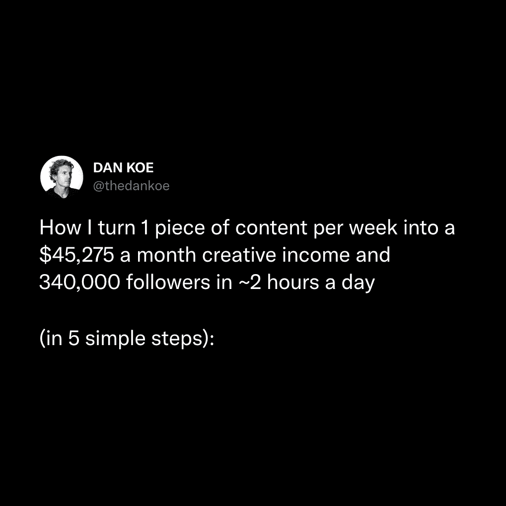
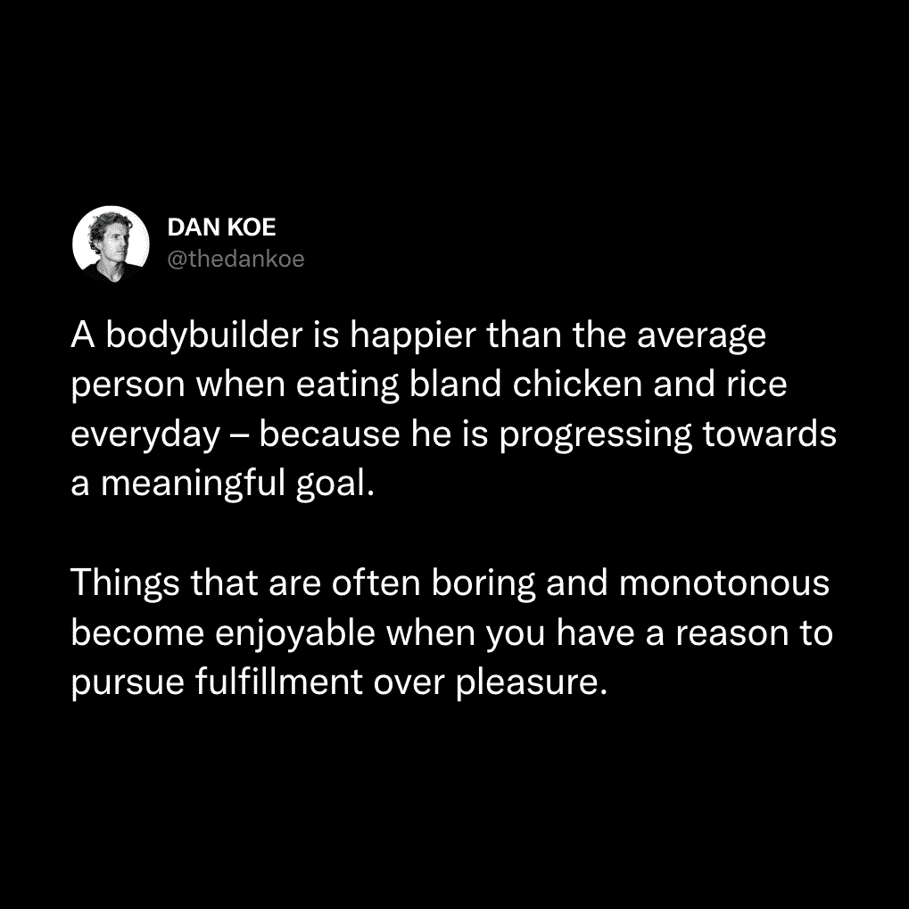
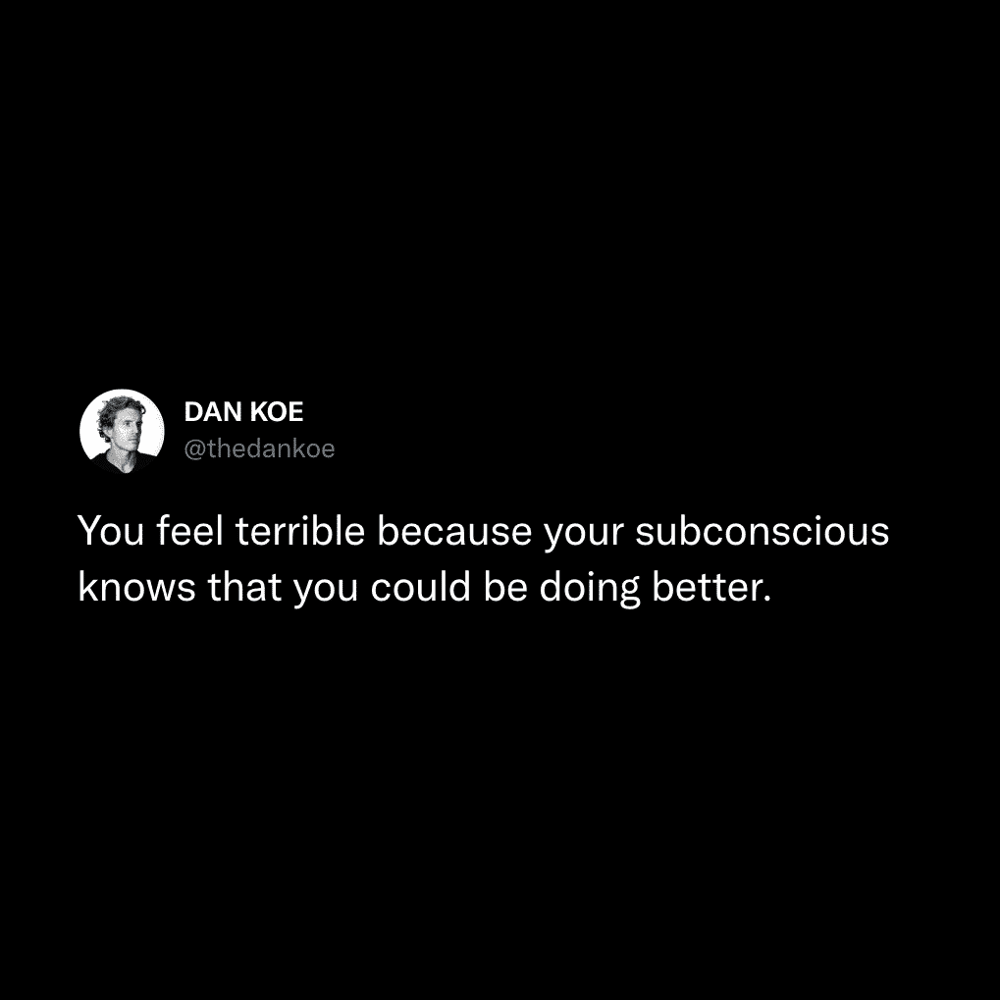
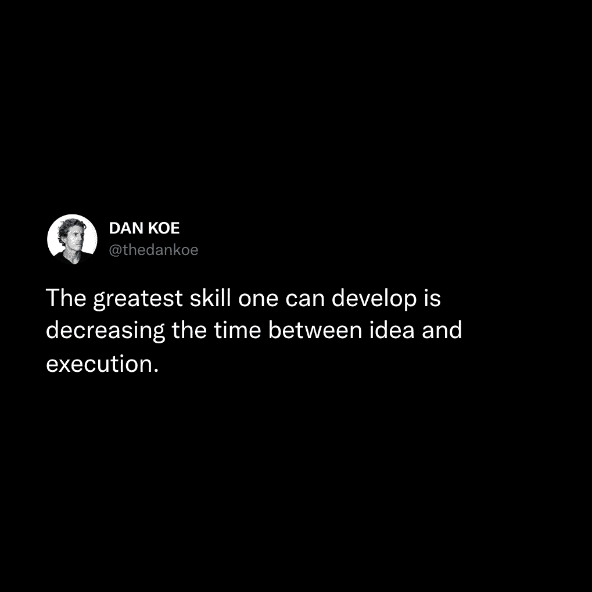

# 21 世纪最伟大的技能（前 1%的人利用这个）

> 原文：[`thedankoe.com/letters/the-most-important-skill-of-the-21st-century-only-1-use-it/`](https://thedankoe.com/letters/the-most-important-skill-of-the-21st-century-only-1-use-it/)

我要坦白。

我自己和[Justin Scott](https://twitter.com/iamjustincscott)正在进行一封时事通讯的写作比赛。

我们的目标是在 7 天内写 7 封时事通讯，以建立库存。

我甚至更进一步，每天都在录制 7 个 YouTube 视频。

今天的写作是在一个忙碌的日子里完成的，我正在准备 Sprint 课程电话会议。

所以……我直接从[数字经济学](https://digitaleconomics.school)（那里面的内容不到 1%）复制粘贴了这段话。

在我看来，这是你可以掌握的最重要的一项技能：**说服性沟通**。

这样，人们实际上会分享你的写作（这意味着你实际上在社交媒体上有所增长）。

作为额外奖励，我包括了一个下载链接到一个 PDF 文件（无需电子邮件），其中包含我们在这封信中讨论的内容。

[在新标签页中打开此 PDF，以免丢失。](https://www.dropbox.com/scl/fi/nhvzkqzbzlp6ro6ocb8a4/ContentPresentation.pdf?rlkey=8kpb8t3wgc21wu9acqg33c80v&dl=0)

我强烈建议你在写作内容时将其打开。

它包括 10 条参与守则和 32 种你可以仿效的帖子结构——我的个人 swipe 文件。

让我们深入探讨：

**人们不会记住你说的话，他们会记住你让他们感觉如何**。

这值得重复：

*人类是情感生物，而非逻辑生物*。

99%的人口还没有发展到摆脱或控制自己自我的程度。

这就是吸引和保持注意力的基础。

挑逗读者的自我。

让他们感到“好”=让他们感到“愉快”。

让他们感到“不好”=让他们感到“糟糕”。

如果你能让人们经历一场爱情、仇恨、兴奋、欺骗、平静以及其他任何最终以他们生活受益为结局的情感之旅——你就已经掌握了内容创作的艺术。

生活就是故事。

歌曲是故事（宇宙，一首歌）。

建筑、音乐、植物生命以及所有其他事物都遵循着创造/毁灭、成长/死亡等普遍原则。

人类通过故事来理解世界。

你的任务是利用文字的力量让人们*感到*某种情绪。

故事模仿情感的起伏。

在我们开始之前：

《专注的艺术》（我的书）现在可以[预订](https://theartoffocusbox.com)。

（这不是一个正常的书籍发布会，它很昂贵，而且有很好的理由。）

当纪念版 2000 份售罄后，平装版将开始发售。

## 丹的 10 条吸引注意力的守则

当你在浏览社交媒体或阅读一般内容时——尝试留意这些策略的使用。这是在脑海中巩固这些信息的最佳方式。注意当你的注意力被吸引时，并质疑“为什么”。

有很多种方法可以吸引注意力。我发现这些方法是最可复制和实用的（第 8 点是最重要的）：

### 1) 具体数字

在你的钩子、标题或推文中使用数字将使人们停下来看看这些数字与什么相关。

这些可以以以下形式出现：

+   **统计数据** — “地球上共有 70 亿人口”

+   **金额** — “苹果新的 1175 美元 iPhone 有这个新功能”

+   **指标** — “我发送了 322 封冷邮件”或“293 天后……”

+   **列表** — “7 个正在阻碍你的坏习惯……”

数字越具体，就越能吸引人们的注意。

如果你不能让它非常具体，那也行。不要担心。

这里有一个我自己的例子，这是许多人加入数字经济学（我的课程）的决定性因素：

<picture fetchpriority="high" decoding="async" class="wp-image-1469"></picture>

### 2) 模式中断

模式中断是打破人们正常条件化模式的东西。

如果有人在 X 上滚动，并且习惯了大量的政治评论，一个格式良好的列表推文将使他们停止滚动。

列表中的大多数内容都是模式中断。

### 3) 消极偏差

人类大脑天生就会记住并关注消极情绪。

这并不意味着你一直都要保持消极。

这意味着你需要使用负面的词汇形式。

如果你正在说一些积极的话，但用消极的形式更能清楚地说明问题，那就用消极的形式来说。

“你将取得伟大的成就。”

相比于：

“你将永远不会再次触底。”

第二种最为有效。我们记得消极情绪。这是许多人生活中最相关的一个方面。

即使是在利用读者的消极偏差的同时，它仍然可以是一个积极的信息。

### 4) 群体指出

这很简单，指出你正在与之交谈的具体个人。

+   如果你 20 多岁……

+   呼吁所有创作者、教练和自由职业者！

+   父亲是人类的一份礼物……

即使你的受众不属于你指出的特定群体，这也将使他们能够“选择一方”并将自己与你所说的话进行比较。

我前几天谈到了健身者。即使人们不认为自己是健身者，这也帮助他们描绘出一个他们可以与之产生共鸣的画面：

<picture decoding="async" class="wp-image-1470"></picture>

如果有人谈论做父亲，我仍然能够产生共鸣，因为总有一天我会成为父亲。我仍然会关注并采纳这些建议。

当是时候推广时，这也同样适用。你可以指出推广对象是谁，并描绘出他们正在努力解决的问题。

### 5) 问题指出

指出人们正在经历的不适或问题也会使他们与帖子产生共鸣。

大多数人在一生中都会遇到与其他人相同的问题或痛苦。

如果你能够准确地描述这种感觉，你就能轻松地吸引注意力。

你不必完全准确。仅仅描述痛点就会让人们试图将自己的经历与之联系起来。如果他们能够联系起来，他们就会参与进来。

这里有一个简单地将“感觉糟糕”作为痛点的例子：

<picture decoding="async" class="wp-image-1471"></picture>

### 6) 潜在的好处

与指出问题相反。再次，痛苦和好处。你的思维需要以痛苦和好处来思考。这是你写作的“什么”或“如何”背后的独特“为什么”。

### 7) 社会证据

这又是权威性的，暗示了信息差距。

当你炫耀你的成果或资历时，人们会自动假设你比他们知道得多。他们会更加认真地对待你的内容，并寻找他们“缺失”的信息。

当这不是一种“炫耀”时，效果会好 100 倍。

贾斯汀·韦尔士是这方面的当前王者：

<picture loading="lazy" decoding="async" class="wp-image-1472"></picture>

使用社会证据来说明你试图表达的观点。

### 8) 自信与信念

***这是这里最重要的观点。***

你可以仅凭自信就创建出极具影响力的帖子——它让其他吸引注意力的方面得以到位。

在这个时刻，关于你的目标、愿景、信念、价值观以及构成你对现实看法的一切，你都是正确的。

你的任务是对你的信念保持自信和信念，并有一个可信或清晰的论据来支持它们（如果你需要的话）。

每个人都在社交媒体上寻求以自信的方式被告知该做什么。没有人对自己的行为、选择和信念感到安心。他们正在寻找能够自信地确认他们并给予他们采取行动的清晰度的人。

你可以使用以下工具来听起来更有自信：

+   消除暗示不确定性的词语

+   尽可能地说绝对的话

+   夸大你的观点以增加能量

当然，不要为了吸引注意而滥用这些技巧。

而不是这样说：

*“如果有些人发展了他们的技能集，那可能很明智。”*

说：

*“地球上每个人发展他们的技能集是至关重要的。”*

只需保持自信，话语就会更加流畅，写作就会更有影响力。

我可以用统计数据或我心中的更多创意力量来支持那个论点。

这里有一个例子，展示了我对自己所说内容的自信：

<picture loading="lazy" decoding="async" class="wp-image-1473"></picture>

这条推文被一个大型的时事通讯特写，并引发了很多争议。

人们争论这是否是“最伟大的”技能。有些人提出了他们自己的“最伟大”技能。

这使得人们发表评论和引用推文，从而增加了参与度和印象。

我在迅速执行了一个想法的时候写了这条推文。这样做给了我很多快乐，所以我想要与他人分享这份快乐。这很有效。

它是 100%正确吗？不是。

当我根据我的视角，结合我的个人经验写下它时，它是 100%正确吗？

是的。当时我 100%确信那是最伟大的技能。

我继续在回复中添加细节。如果我在实际推文中添加了细节，它可能不会表现得那么好，也不会有机会被收录在大型通讯中。

你想要吸引的人不是那些“讨厌”你工作的人。

这里还有一个——稍微极端一点的——例子。你能感觉到屏幕上流动的激励和实用能量吗？

<picture loading="lazy" decoding="async" class="wp-image-1474"></picture>

顺便说一句，这类高能量建议帖子能吸引很多关注者。

总结来说——在你所说的话中要有一些信念。这不是一个需要训练的技能。这只是用最有影响力的方式写词语的问题。领导者不会绕过他们试图传达的观点。

### 9) 被动语态

被动语态意味着有一个故事。它使人们更容易接受你所说的内容。

被动语态通常很无聊，并且过早地泄露了“小故事”。没有期待让人们想要弄清楚接下来会发生什么。

当你练习撰写帖子时，查找一篇关于主动语态的文章，并使用它来编辑，直到你掌握它。

这也有助于人们认为你很自信。

### 10) 警告与忠告

当人们试图实现某事时，他们应该注意什么？

你能警告他们当他们试图达到你现在所在的位置时会遇到什么吗？

当你进行每周反思，或者只是反思你的生活时，你能帮助人们克服哪些障碍？

这条推文是最好的说明。我触及了一个热门话题，比如多巴胺，并警告他们另一个热门话题（然后自信地结束）。

这引发了很多争议，但我有研究来支持这一点，并在回复中提供了细节，以与我的观众建立更深的联系：

<picture loading="lazy" decoding="async" class="wp-image-1475"></picture>

## 什么是吸引注意力的因素？

一旦好奇心循环被打开，大脑就会致力于找出故事的其余部分。

这就是吸引注意力的原因——编织一个引人入胜的故事。

故事是隐喻、概念、观点和经验的层次，它们带领人们踏上旅程。

人们想要了解整个故事。他们想知道在给定事件之前、期间和之后发生了什么（从吸引注意力开始）。

在保持注意力方面，这里有 2 件事需要记住：

### 1) 结构

我们不再是高中生了。长篇大论的段落不再重要，并且会降低可读性。尤其是在 X 平台上——人们登录该平台是为了逃离专业世界。

你如何改进你所有内容的结构？

+   **项目符号列表**——使用数字、项目符号和其他帮助你分解你所说内容的策略。这些列表本身就构成了一个“故事”。

+   **换行符**——尽可能使用换行符，但不要仅仅为了换行而添加换行符。要有创意。使用换行符来强调特定的句子，并帮助你的写作流畅。

+   **开始简短精炼**——在内容的开头使用简短的句子或段落。用简短而有力的陈述来吸引注意力，然后放开手脚，让你的句子流动起来。

+   **拆分句子**——使用括号和“—”破折号在逗号上。这个句子太长了（直到我让人们想知道这些括号里有什么）。

以下是一个包含上述所有内容的示例：

<picture loading="lazy" decoding="async" class="wp-image-1476"></picture>

### 2) 新颖的视角

这需要你从书籍、播客或其他更长的形式内容中获取大部分想法，这些内容为某些想法提供了更多的细微差别。

新奇性可以提高大脑中的多巴胺水平。它为反复讨论过的想法带来了更多的清晰度。

如果你从 Twitter 上获取所有内容，同时试图在 Twitter 上成长——你可能会最终拥有与其他人相同的观点。

隐喻、个人经历和创造新概念是你实现这一点的途径。

这将是未来模块的重点，所以现在先紧紧抓住这个要点（但请记住，这样你可以在消费内容时开始建立联系）。

我在读一篇文章时，了解到一杯水可以产生一英亩的雾，并将这个观点应用到我的一个子主题——正念上。

<picture loading="lazy" decoding="async" class="wp-image-1477"></picture>

内容**消费**（或研究）很重要。具体来说，书籍、有声书、播客或文章。这些会给你提供关于你热爱谈论的事物的不同视角。

## 什么是创造参与感？

记住：***人们不会记住你说了什么，他们会记住你让他们感觉如何。***

艾伦·瓦茨可能在晚年酗酒并背叛了他的妻子——我对这一点有自己的看法——但他的作品彻底改变了我的人生。它给了我灵感、清晰度以及对生活的全新看法。

我可能记得他的一些引言，但我记得它们的原因是因为它们给我带来的清晰度。那种在世界上没有任何烦恼的感觉。当我想要再次体验这种感觉时，我会播放一个艾伦·瓦茨的讲座。

你只是生命改变信息的谦卑使者。

**1) 教育带来的感受。**

学习新事物或对生活中某些方面的清晰认识可以提高大脑中的多巴胺水平。

你通过新颖的视角、隐喻、故事、个人经历以及你生活中的其他部分来创造清晰度，帮助他人理解你的观点。

你的工作是“让特定群体的人理解”。

你通过分享某些主题对你来说有何意义来实现这一点。

**2) 来自灵感的感觉。**

灵感与动力不同。

你正在帮助人们自己连接点，给他们清晰度以做出自己的决定并改变自己的行为。

当人们认为自己想出了答案时，他们会感到很高兴——但还是会将这种感觉归功于你。

**3) 来自娱乐的感觉。**

你能加入一个笑话、梗图或有趣的观点吗？

当你看电影时，你会通过幽默、戏剧、故事中的情感部分以及激发你兴奋感的战斗来获得娱乐。

娱乐、教育和灵感是您内容的主要目标。

我希望你喜欢这篇文章。

如果你想成为一位通过互联网控制自己生活结果的数字作家，请查看[数字作家系列](https://thedankoe.com/blog/category/digital-writing/)中的更多内容。

丹·科

P.S. 《专注的艺术》现在可以预订。

精装书、全新的实体计划表、纪念币、现场活动的邀请、私人社区等等。

[在这里获取你 1/2000 可用的副本](https://theartoffocusbox.com)
