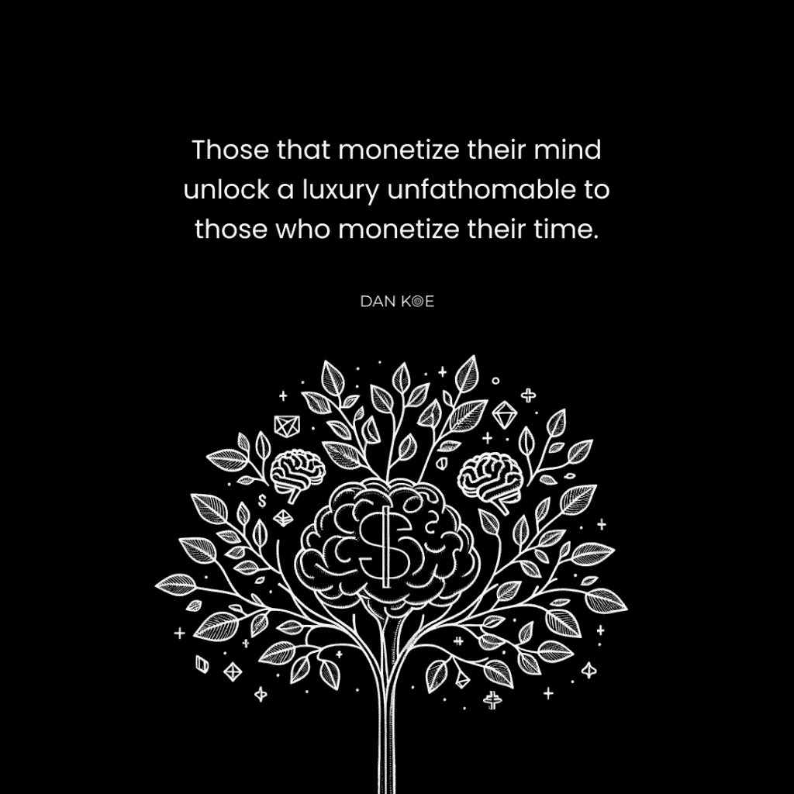
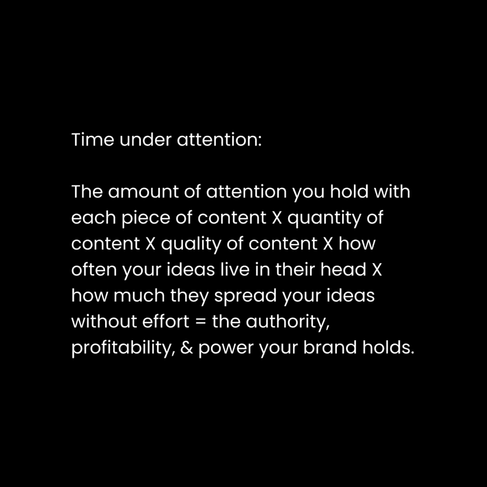
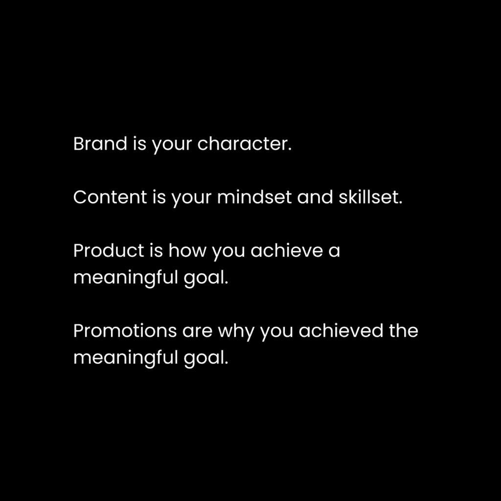

# 用你的思维赚取百万（将你的知识转化为商业）

> 原文：[`thedankoe.com/letters/make-millions-with-your-mind-turn-your-knowledge-into-a-business/`](https://thedankoe.com/letters/make-millions-with-your-mind-turn-your-knowledge-into-a-business/)

当我年轻的时候，我做出了一个关键的观察。

我必须用我的思维赚钱，而不是用我的时间。

我区分了劳动工人和创意工作者。

劳动工人会试图在特定时间内完成他们身体能够承受的最大工作量。

创意工作者会专注于解决那些能带来最多结果的问题，而不论花费多少时间。

劳动工人被锁定在一种工资和日程安排中，他们通过努力获得一定数量的金钱。

创意工作者根据自己的解决问题的水平来创造自己的工资和日程安排。

劳动工作并没有什么错。

但要明白，你是在用时间换钱。

而你的时间是有限的。

医生可以赚很高的薪水，但无论他们是否救了某人的命，还是告诉他们吃一些阿司匹林，他们的薪水都是一样的。

一个作家可以根据他们写的什么，他们的产品是什么，以及他们的写作传播多远来赚取他们想要的任何金额。

写作是这里的一个例子，因为我们将在信的后面讨论如何将任何你希望的东西货币化。

创意工作者和劳动工人之间的区别在于拥有自己的企业。

商业是解决一系列创意问题，直到你创造出你想要的收入和生活方式。

一旦你停止解决与产品和目标相关的创意问题，你的收入就会停滞，你将变成自己创造的工作的奴隶。

### 我的从时间到思维的演变

当我刚开始创业时，逻辑的选择是使用有价值的技能进行自由职业。

它看起来对初学者友好，而且启动成本为零。

经过多年的手工努力，随着责任的增加，我从慢慢建立业务中获得的乐趣逐渐减少。

我只能承担一定数量的客户。

我每天的时间是有限的。

除非我想继续过那种自己创造的自 9-5 的生活，否则我必须变得有创意。我必须进化。

创造力依赖于你思维的扩展。

因此，通过教育和让自己接触未知，我注册了新的机会来解决我的问题。

我开始在线写作以吸引新客户。

这消除了手动通过冷邮件、冷电话和冷信息联系潜在客户的耗时。

我建立了一个可以在我睡觉时销售数字产品。

这消除了我对客户工作的绝对依赖来维持生计。

我将我的自由职业服务转向了咨询服务。

这将我的客户工作时间减半。我可以收取更高的费用，做更少的工作，因为我是在帮助别人，而不是为他们做。

在这段时间里，我有一个发现改变了我的生活方向：

如果我能获得一个读者，我就能获得一百万个。

如果我能获得一个买家，我就能获得一千个。

2.8 百万读者和 2 万购买者之后，我的发现得到了证实。

现在，我的创造性问题解决能力已经超越了单打独斗的企业。

现在，我专注于构建[Kortex](https://kortex.co)，在不降低交付质量的情况下委派工作，并且不过度劳累自己。

在我们开始之前的一个教训：

你无法完全从你的生活中消除体力劳动。

这是一个缓慢而痛苦的过程，有时你会退步。

现在我承担起创办更大公司的责任，我的体力劳动显著增加，但我相信凭借我之前的经验，我可以很快将其降低。

### 我们将讨论的内容：

+   商业的宏量营养素

+   技能的渐进式超负荷

+   受关注的时长

+   如何重塑自我

+   在互联网上记录你的思想

+   如何创建能赚钱的品牌、内容、产品和促销活动

在我们开始之前还有一件事——我们为 VIP 和 Mastermind 项目增加了更多名额。如果你是一位创始人、创作者、作家或营销人员，希望直接与我们合作，在你的社交媒体品牌、内容和产品上工作……[在此申请](https://intake.kortex.co)。

这封信很长，但值得。

## 健身与商业建设

当你分解身心时，你可以在生活的多数领域中映射出加深你理解的模式。

通过创办一家企业，我们将通过这些模式将金融领域联系起来。

我们可以将思维视为我们的精神身体，就像我们在[Mental Aesthetics](https://thedankoe.com/letters/mental-aesthetics-how-to-build-a-beautiful-mind/)中讨论的那样。

我们也可以将你的企业视为你外部展示的身体或角色。

生意就是这样，一个价值交换的载体。

*个人成长是自我发展，商业成长是他人发展。*

在营养学中，有 4 种宏量营养素：

+   脂肪

+   碳水化合物

+   蛋白质

+   酒精

在商业中，有 4 个支柱决定了你的成功：

+   品牌

+   内容

+   产品

+   促销

在营养学中，有许多维持身体功能的微量营养素。

在商业中，有技能、兴趣、经验、知识、创造力和个性，这些决定了你努力的效力。

你的工作是给你的企业提供适当的创造性营养，以取得成功。

你可以选择商业生酮饮食，并将内容作为碳水化合物去除。

许多人选择直接响应式营销路线，只使用广告来推动他们的业务，但内容的好处使得这种方法（尤其是对于没有资金投资于犯错误来学习广告的初学者）变得不合理……[我就是这样艰难地学到了这一点](https://thedankoe.com/letters/my-story-the-untold-truth-of-dan-koe/)。

通过养成每日内容写作的习惯：

+   你可以将高绩效的想法作为内容用于你的广告或促销。

+   你可以保留你获得的受众。你并不总是需要烧钱来获取新客户。

+   你通过为所有意识水平的人写内容来逐渐创造客户。

你每年可以在广告上花费数十万美元。

或者你可以在一年内建立一个 10 万粉丝的受众群体，并获得相同数量的曝光。

或者你可以两者都做，由你决定。

### 技能与挑战的渐进式负荷

当你刚开始起步时，作为一个个体经营者承担太多是不明智的。

你必须成为市场营销、销售、运营和媒体部门。

为了创建品牌、内容、产品和服务，你需要至少学习以下基础：

+   市场营销与销售

+   图形设计

+   网页设计

+   文案写作

+   内容写作

+   电子邮件营销

+   社交媒体

这既是祝福也是诅咒。

如果你从未学习过任何现代技能，这需要一段时间。

当你想到一个你没有技能创造清晰未来的未来时，你会感到不知所措和焦虑。

但是社交媒体是你在学习过程中构建的完美载体。

在健美训练中，你通过随着时间的推移增加杠铃上的重量来逐渐增加肌肉的负荷。

如果你自大，加上了太多的重量，你将无法举起它，你可能会看起来像个傻瓜。

从小开始，随着时间的推移建立你的技能栈。

除非你开始构建，否则不要开始学习。

在你构建的过程中，购买课程、书籍，并寻找教授如何做好所有这些内容的资料。

创建一个项目。

设定一个目标。

学习一项技能。

做得很好，这样你就有精神能量去应对下一个。

重复。

**建立你的个人品牌**。研究社交媒体和图形设计（用于你的横幅和头像）。

**开始写作内容**。研究文案写作、内容写作、市场营销和帖子结构。

**构思一个产品**。研究市场营销、销售和提供。

**学习如何推广**。研究电子邮件营销、促销和文案写作。

在所有这些中，不要自满。

如果你停止看到第一次尝试的好结果后不再寻求更高的挑战，你会感到无聊。

无聊会导致你产生放弃的想法，因为你感觉好像有更好的事情可以做。

在健身房，一件好事是观察别人在做些什么来纠正你的姿势。你还可以观看在线上人们的视频。

模仿创作者空间中其他人正在做的事情。

从创作者的个人资料、内容和营销中汲取灵感。

但是——这是一个很大的但是——认识到比你更高级的人处于不同的水平。他们正在做的事情可能不是他们刚开始时做的事情。

这是一个长期的实验过程。

### 注意力下的时间

在力量训练中，有一个被称为“张力下的时间”的概念。

有些人认为这是肌肉增长的主要驱动力（与渐进式超负荷相结合）。

我想为商业提出同样的论点，但作为“**注意力**”下的时间。

这可能是你在用写作和内容建立受众时最需要注意的重要事情。

注意力是第三千年的货币。

你受到的关注越多，你的力量就越大。

作者、播客主持人和 YouTube 博主通常拥有最忠实的受众。

为什么？因为信息创造身份。

你保持的注意力越多，你提供的信息就越多。

你以有助于真正改变他们生活的方式编程你受众的头脑。

你可以整天写短帖子用于社交媒体，但那些能保持更多注意力的人总是会比你表现得更好。

James Clear 将获得更多的参与度和影响力，因为：

+   人们已经接受了他的世界观。

+   人们在他们自己的内容、通讯和播客中引用他。

+   每当有人在其他内容中发表与 Clear 相关的想法时，权威就赋予了 Clear，因为他在阅读你的内容时首先想到的是你。当他们在阅读他人内容时，Clear 仍然在保持他们的注意力。

这并不意味着像 X、Instagram 或 LinkedIn 这样的短形式内容是没有用的。恰恰相反，它们有自己的优点和用例。

在这里不要只考虑黑白，要全面思考。

我认为短形式平台是一种更快吸引广泛受众的方式，以支持那些可能更难增长的长形式平台。

我几乎总是推荐从短形式开始，以建立受众、建立网络，并验证那些你可以将其转化为长形式视频、通讯或将其全部结合成一本书的高绩效想法。

而且，你做得越久，你保持的注意力就越多。1-6 个月后放弃是愚蠢的。

50 年中的 1%是 6 个月。

如果你打算一生都从事这项工作，那么在教程阶段不要放弃。

如果我每年（在所有平台上）创建 365 篇帖子，并且这些帖子能保持 30 秒的注意力，那么在一年内每个读者在每个平台上都能保持 3 小时的注意力。

如果我每周创建一篇长形式帖子（无论是用于通讯、YouTube 还是播客，都一样），并且这些帖子能保持 20 分钟的注意力，那么每个读者在所有平台上都能保持 52 小时的注意力。

我会让你得出结论，为什么我会写一本可能被数百万人购买的书。

因此，重要的是你要正确看待短形式平台：

一种更快建立广泛受众、验证想法并将人们引导到各种产品和长形式内容的方式。

对于作家来说，我总是推荐使用 X 和通讯。

从一个短形式和一个长形式平台开始。

然后，当你真正看到足够的时间增长后，你可以将所有最好的短形式和长形式内容重新用于不同的平台。这就是我在[2 小时作家](https://2hourwriter.com)中教授的内容。

## 将你的自我转化为商业（精神货币化）

你的自我，或者说身份，是你的精神体。

“自我”是一个由概念、信仰、想法、经验和感知交织而成的网络，它使你能够导航这个世界。

从出生以来，你所学到的知识和使用的信息塑造了你的自我。

你的身份塑造了你的观点，而你的观点是你能理解和扩展的最重要的事情。

你的观点就是你的现实。

观点是由目标、问题和克服这些问题的技能组成的框架。

它还由信念、知识和经验组成，这些经验要么限制，要么有助于实现目标、解决问题和理解知识。

当我们没有意识到构成我们观点的目标或问题时，我们并没有选择我们的行为方式。目标是被赋予我们的。

如果我们没有克服问题以实现目标的能力，我们就会感到焦虑、不知所措，并变得消极，以至于会爆发。

当你不寻求理解他人生活中的目标，社交媒体、政治、宗教或其他方面时——我们很容易误解他们的处境，认为他们做他们所做的事情是愚蠢的。

事实上，我们缺乏观点。

我们无法打开我们的思想，看到我们不是唯一的角度。

构成你观点的目标和问题决定了你将哪些信息视为重要。

给予时间，你消费的信息要么加强了你现在的样子，要么通过扩展你的观点以包含更好的问题和有意义的自标来改变你现在的样子。

从那些有意义的自标中，你可以获得实现它们所需的一套独特技能组合。

**A. 有一个社会赋予他们的无意识目标。**

他们被说服相信，成为一名医生是他们生活中唯一的道路。

因此，无论他们是否意识到，所有信息、书籍、播客、社交媒体内容和对话都将被解释，以获取帮助他们实现目标的信息。

当他们试图实现目标时，他们的技能组合将由此信息形成。

这里还有更多影响解释的目标和问题——比如整天在手机上看搞笑图片，因为他们没有更强大的目标需要他们自我教育来实现。

**B. 有一个他们自己选择的有意识目标，这个目标是基于他们意识到的某个问题。**

这不仅使他们在实现目标方面取得成功，而且在更多方面为他们铺平了道路。

首先，它阻止了他们成为社会矩阵（从政府、学校和父母那里传下来的无根据的信息网络循环）的无意识产物。

其次，改变他们是谁，创造一条独特的人生道路，实现解决紧迫问题的目标，为他们设定了有意义、有钱和精通的生活。

### 在互联网上记录你的思维（并获得报酬）

现在我们理解了人类行为反馈循环的一个非常简短的描述。

身份影响观点，影响对情况的感知，影响选择，影响身份，并无限循环。

要将你的思维转化为商业，你的任务是改善你的行为，以便你可以改变他人。

**1) 品牌是你的在线角色或身份**

商业的前端是品牌。这是他们在网上展示给正确的人，并展示他们的数字身份的东西。

由于我们正在将*你的*自我转化为商业，你的任务是吸引你可以帮助最多的人：

像你一样的人。

与你的过去或现在自我有相同目标和问题，但没有技能去实现和克服它们的人。

你已经拥有了知识、经验和技能，可以传授给那些落后一步的人。这就是你开始创业所需的一切。

因此，在你的网站、社交媒体个人资料以及你的品牌展示的任何地方，你的工作是：

+   提出一个你帮助人们实现的有意义的目标。

+   提出一个你可以帮助他们解决的紧迫问题。

+   提出你教授的兴趣或技能，以弥合问题和目标之间的差距。

这创造了你的数字现实。

它为你和你客户之间创造了共享的框架，这样你们就可以交换知识和技能。

这不必在你的品牌中明确表达。

这必须在你的设计、写作和视频中暗示。

你的品牌是在关注下随着时间的推移而形成的，随着人们通过你的内容和产品更多地了解你。

我的品牌口号是：*少工作，多赚钱，享受生活*。

我的个人简介偶尔是：*我写关于人类潜能、写作和心灵掌控，这样你就可以做你想做的事*。

我不推荐复制这些，因为它们可能对你不起作用。我比你有更多的时间在关注下，有自由不那么明确。这需要更多地研究我的其他信件，如[价值创造](https://thedankoe.com/letters/value-creation-the-skill-that-built-my-one-person-business/)或[21 世纪最伟大的技能](https://thedankoe.com/letters/the-most-important-skill-of-the-21st-century-only-1-use-it/)。

**2) 内容是你的心态和技能**

当你意识到内容的力量时，内容就变成了必需品。

营销人员知道流量、潜在客户名单以及长篇写作或视频的力量——但其中许多人是在内容游戏上晚些时候才加入的（就像我自己一样）。

他们没有意识到，让你赚了百万的长期网络研讨会可以只是一个在 YouTube 上获得数十万观看次数的视频（一旦你掌握了社交媒体游戏）。

我明白网络研讨会漏斗或类似的东西可能更具有战略意义，但这并不排除写内容的其他好处：

+   **你提升了你的思考能力。**随着时间的推移，你的想法变得清晰，并影响到你生活的其他方面。如果你不先写出一个好想法，你就无法有一个伟大的想法。你的第一篇内容可能不会那么好，这是正常的。

+   **大多数时候它是免费的。**你可以自然增长，或者你可以通过联系大玩家并让他们分享你的帖子来将你的广告支出转移到付费增长（不要听信那些告诉你这不起作用的人，他们不了解它。它对他们不起作用，因为他们的品牌、内容和策略很糟糕）。

+   **你创造了客户。**与广告不同，你可以保持你的观众，并且可以在任何时候向他们重新营销。当你创建教育内容时，人们*成为*客户，因为你的信息塑造了他们的身份。

+   **快速验证和测试想法。**我可以发一条推文，如果它的表现比平时好，我就可以将其变成销售页面标题、YouTube 标题，或者我知道会卖得好的整个产品。

这就是我如何通过剖析他们的思维来帮助[我合作的人](https://intake.kortex.co)建立他们的品牌，将其转化为内容。

首先，回答这些问题（写下答案，这样你就可以用答案来写内容）：

1.  有哪些 5-10 个在你看来是“极端”或“疯狂”但对你来说却是正常的信念？（这就是你与众不同的地方，也是你成长的最大动力。）例如，我相信创业适合每个人，并且有心理学、力学、历史和哲学的推理来支持这一点。

1.  有哪些 5-10 个兴趣或技能能帮助你创造你生活的这种生活方式，并帮助你的追随者实现？

1.  为什么那些兴趣或技能很重要？它们帮助人们在生活中避免什么或获得什么？

1.  人们需要了解哪些基础知识才能理解那些技能或兴趣？（这让你不会过于高级或高深，从而真正与人们产生共鸣。）

现在，将这些与[10 Koemmandments of Engagement](https://thedankoe.com/letters/the-most-important-skill-of-the-21st-century-only-1-use-it/)结合起来，尝试将你列出的每一项都转化为内容。这也有助于理解我上面提到的价值创造原则。

在这个过程中，写到你认为一个五年级学生也能理解的程度。

我在这个领域看到的一个大问题是。人们用只有少数人能理解的词汇过度复杂化他们的信息，这不会吸引人们对你感兴趣的兴趣。

你不是在吸引已经感兴趣的人。你是在通过说服*制造*他们的兴趣。

最后，这里有几点人们容易陷入的陷阱：

*陷阱 1 – 他们过于关注促销或确保他们只谈论自己的产品。*

讨论你的信仰、观点，并教育人们了解成为你兴趣和技能领域 80%以上的人所必需的信息。适度推广。这就像用你的观众的好感度来换取现金。

*陷阱 2 – 他们不理解结构 VS 内容的重要性。*

这远远超出了为商业写作内容的范畴。这是一个形而上的原则。

现在，带着你的*想法*，使用高绩效的结构和框架作为训练轮，直到你真正发展你的写作能力。看看引言、通讯结构、帖子结构等等，并尝试将你的想法插入其中。

*陷阱 3 – 他们没有研究或使用高绩效的角度。*

任何想法都可以病毒式传播。但只有当它以一种吸引注意力的方式定位，娱乐、教育或启发时。

你是一个多巴胺商人。

通过教授他们新知识、提供新的观点、娱乐他们或向他们展示他们在生活中能够做到更多，你在读者的脑海中提高多巴胺水平。

研究你最喜欢的账户中最受欢迎的 X 帖子、Instagram 帖子、YouTube 视频，并开始训练你的大脑以高绩效标题的方式思考。

内容的教训：

*好的内容发生在你试图在 6-12 个月内将你的心态和技能集注入读者的过程中，而不是在一篇帖子中。*

**3) 产品是你实现有意义的目标的途径**

当你是细分市场时，人们跟随你是因为他们想要实现你所拥有的生活方式。他们想要做你所做的事情。

你通过你的内容正在教育他们如何去做。

内容和产品之间的区别在于便利性、清晰性和一个可复制的系统，它能带来结果。

*你一生中实现的最有意义的成就是什么？*

（我的例子：我通过写关于我的兴趣来谋生。）

（潜在例子：我通过不做有氧运动就获得了六块腹肌。）

（另一个例子：我通过解锁极端专注来建立我的副业。）

*人们需要采取哪些步骤才能达到那里？*

（我的例子：写作，建立读者群，说服，销售。）

（潜在例子：极简训练和间歇性禁食。）

*人们需要学习什么才能采取这些步骤？*

（我的例子：社交媒体，文案写作，内容。）

（潜在例子：训练和营养的原则。）

*这些人可以在他们的日常生活中练习和实施什么来达到那里？*

（我的例子：2 小时内容生态系统。）

（潜在例子：为忙碌人士的行政培训系统。）

（我之所以给这些系统起个花哨的名字，是因为在营销中它被称为“独特机制”。它是新颖的。新奇能吸引注意力，让人们想，“这可能就是最终解决我问题的东西！”）

嘣！这就是你产品的概要。

请注意，这些都是简短的平庸例子。要更具体。

一个“有意义的”目标，你帮助人们实现，是通过解决永恒市场中人类本质中的燃眉之急：健康、财富、关系和幸福。

如果你还没有以独特的方式实现一个有意义的，我将通过另一封信帮助你快速掌握新技能。

直到那时：

+   在你生活的某个领域设定一个目标。

+   在这个领域的知识和教育中沉浸自己。

+   将这些知识作为内容（教学是学习的方式，也是识别你不知道什么以便高效学习的方法）记录下来。

+   关键：尝试不同的技术（如培训计划、饮食、赚钱的方式等）。

+   识别不同技术之间的基本原理、真理和原则。

+   通过创造自己的方式去实现目标来达成目标。

然后，将这个作为数字产品分发出去，在你睡觉的时候也能赚取高额的利润。

从那里，你就有资源（读者群和收入）去建立你心中所渴望的任何其他业务。

**4) 推广是你实现目标的原因**

人们不关心功能，他们关心好处。

假设每个人都自私，因为他们确实是，即使这种自私来自于通过无私而感到自我良好。

市场营销是关于创造最强大的“为什么”。

“为什么”意味着一种转变。

转变是人们想要的。

就像体形转变之旅在 YouTube 上总是能获得很多观看量。

或者说，生活转变如何让你情感上投入并对这个人产生兴趣。

转变是一个故事，这正是我们的心智所倾向吸引、信任和连接的。

所以，你需要做两件事中的一件：

1.  告诉人们这个产品将如何改变他们的生活。

1.  告诉人们它如何改变了你的生活（因为他们会像改变自己的生活一样阅读它）。

我现在已经做了近 6 年的市场营销员。

这就是你需要知道的一切，实际上可以赚到一些钱。

一个故事或转变由三件事组成：

1.  一个紧迫的问题。

1.  一个期望的结果。

1.  一个清晰的解决方案。

那就是你的整个营销活动。

你将不得不测试每一个，直到你找到正确的定位，然后你就可以稳定一段时间。

这三个要素将在你通过电子邮件、着陆页、IG 故事、YouTube 推广或其他方式请求人们购买你的产品时被使用。

长篇推广就像一个完整的销售页面，你必须通过引导人们通过这个结构来填充页面（去读这封信的引言）。

短篇推广就像电子邮件中的行动号召：

如果你尝试了“最新和最伟大的”商业模式但没有成功（并且正在考虑接受一份日常工作），那是因为你陷入了策略的陷阱。

在[数字经济学](https://digitaleconomics.school)中，我教授构建有目的的企业的原则。

品牌、内容、产品和推广，这样你就可以谈论你的兴趣并赚取创意收入。

现在，当你撰写推广内容时，你必须知道你在和你的哪个受众群体对话。他们阅读你的内容有多久了，他们是否理解你的理念？

我经常看到这个错误。

人们有着非常高级的语言（比如实现与和平存在对齐的生活），而他们的受众对此并不关心。

如果你还没有对你的入门级听众定义“对齐”和“显化”，那么就不要这样写。

直接了当。简单明了。有影响力。

给予人们他们想要的东西。

不要给予人们你认为他们想要的东西。

就这些了，已经够长了。

希望你喜欢。

丹
