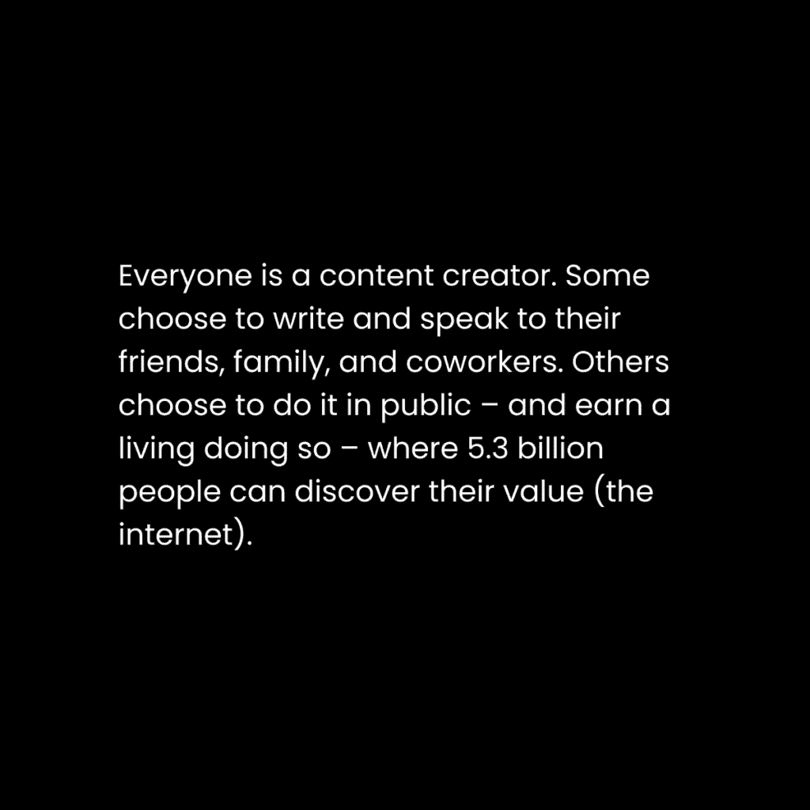
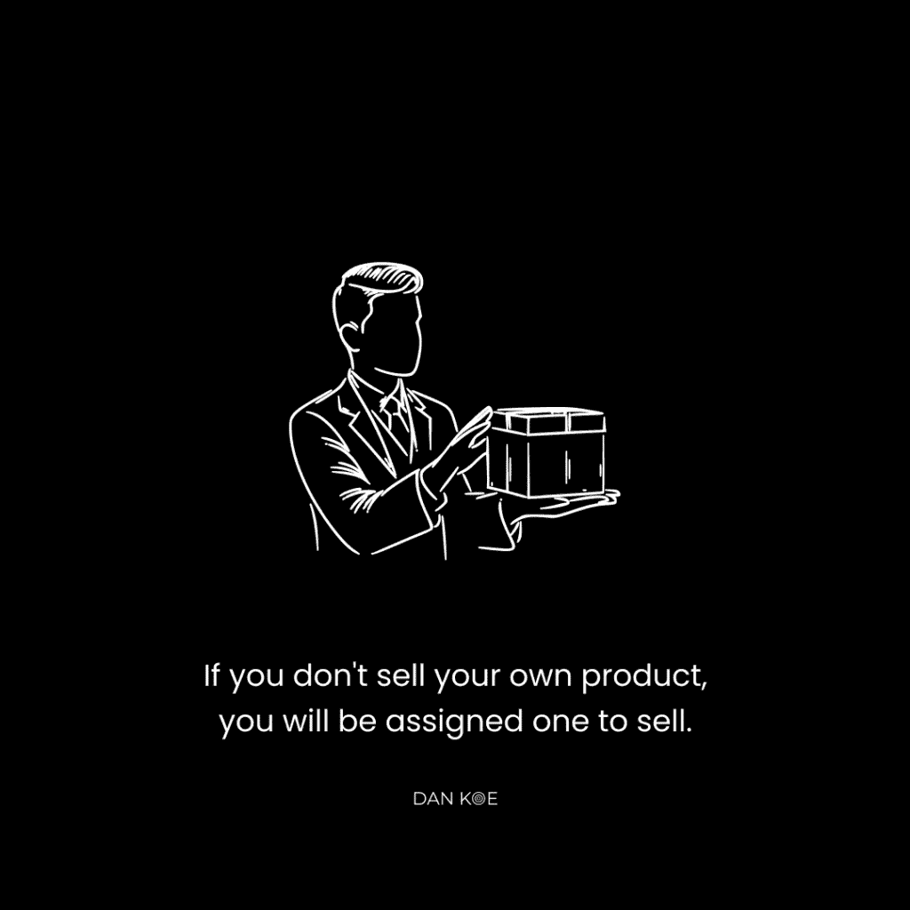

# 如何在 2024 年作为内容创作者赚钱（构建-教学-赚钱方法）

> [`thedankoe.com/letters/how-smart-creators-make-money-the-build-teach-earn-method/`](https://thedankoe.com/letters/how-smart-creators-make-money-the-build-teach-earn-method/)

**每个人都想成为内容创作者**。

这不是一件坏事。

尤其如果你能预测工作的未来走向。

摇滚一代会告诉你“找一份真正的工作”，而那些真正的工作在几十年后可能就不存在了。

他们没有意识到工业时代**创造了**那些工作。

他们也没有意识到信息时代**创造了**这些新的、更有利可图的职业。

利润决定了社会和经济的方向。

技术使得更多有利可图的行业成为可能。

创作者经济预计在未来 5 年内从 2500 亿美元增长到 4800 亿美元。

最大的问题是缺乏理解。

人们没有从大局的角度理解内容创作。

有一个原因让每个人都感到成为内容创作者的吸引力。

因为这是人性。

因为人们想做自己想做的事情。

因为人们天生就有追求好奇、成为价值载体和亲手创造的驱动力。你知道，学校和工作从你那里夺走的东西。

因为当你剥去层层面纱，这正是人类自然进化的方向一直指向的。

从时间的开始，我们就用技术解决问题，摆脱机器人化和耗时的工作，以便我们追求自我实现和超越。

让我们来定义内容和创作分别是什么。

**内容：**

*包含或包含在某个事物中的东西*。

换句话说，一切都是内容。

内容是有结构的情报。

信息是我们作为物种学习、成长和适应的方式。信息占据我们的头脑，塑造我们的思维，并从我们的头脑中产生。我们利用我们心理的结构来创造内容。

互联网的前端是内容。

你头脑的前端是内容。

互联网的后端是代码。

你头脑的后端是代码。

**创作：**

带入现实。

那是人类所做的事情。

他们创造。他们解决问题。他们构建解决方案。这是你的优势。

成为人类就是扩展、超越和创造。

成为机器人就是忘记你拥有这份天赋，让你的思维屈服于他人的学校教育和就业的任意摆布。

在其根本，内容创作只是做一个人类，而不是像过时的工作所认为的那样成为一个机器人。

每个人都是内容创作者。有些人只是选择有意识地去做，并在被称为互联网的地方得到报酬，在那里物理边界不会限制你的触及和潜力。

内容创作是您使您的写作和演讲更有价值的方式，因为您必须首先成为一个足够有价值的人，以便为（并从）全球数字社区做出贡献并获得利润，就像我们的祖先为他们的本地物理社区做出贡献一样。

**在我们开始之前：**

Koe 黑色星期五大促销开始了。

我的课程和产品最多可享受 50%的折扣。

我已经为您将所有内容组织到了各自的页面。

如果您一直在等待从我这里得到一些东西，现在就是您的时机。

[利用我在周一午夜之前遵守无用的假日的机会。](https://thedankoe.com/bfcm)

## 内容创作不是工作或业务 - 它是一块磁铁

让我们把事情带回现实（即使这并不那么有趣，也失去了它的激情）。

在商业中，您需要两样东西来赚钱：

1.  **人们** - 商业是价值交换，如果您想赚钱，您需要*其他人*以等价的价值来交换。

1.  **产品** - 产品（包括服务）是一种有价值的创造，无论是物理的还是数字的，最好能解决某人生活中的实际问题。

当然，这里还有一些更细微的方面，比如如何理解如何将产品营销给您吸引的人，但您绝对需要人和产品。这不是可选项。

因此，这是我们首先需要理解的第一件事：

*内容是您作为创作者吸引人们关注您产品的途径。*

您如何创建吸引人的内容？

通过分解您的思维并在互联网上分享其最佳部分。

大多数人在开始写作时都会遇到困难，因为他们稀释了他们所说的每一件事，或者他们试图过于复杂化。

下面是您需要撰写吸引像您这样的人的内容的要点：

### 1) 相关话题

成为内容创作者仍然是一个新事物。

人们仍然在应用过时和陈旧的商业和营销策略，希望他们的受众会变得庞大。

在您讨论的话题上进行细分

*“但丹，财富在细分市场！！！这是一个事实！”*

我明白，但人们误解了这意味着什么。

那么，如果我决定我想建立一个庞大的受众群并*创造*一个细分市场呢？

如果他们赚了同样的钱，我宁愿有一个 300 万粉丝的受众群，也不愿有一个 1 万粉丝的受众群。

前者为您提供了大量的不可见杠杆、灵活性和选择。

后者可能只需要再服务三个客户，就会感觉他们的生存受到威胁。

因此，在您的内容中广泛地写，然后在内容漏斗中缩小到您的专业知识。

您的漏斗顶部社交媒体账户应包括人们积极搜索和研究的主题，如生产力、心理学、心态、自由职业、技能获取、商业、营销等。

人们实际上*想要*跟随和学习这些事物。

不要对“电子商务店铺的自动响应机制”过于疯狂。

从社交媒体到时事通讯再到播客，让您的产品页面成为证明您权威性和深入细分领域的最后一环。

这种策略将需要你拥有一系列从入门到高级的产品。

如果你只有销售超级特定的高价服务的计划，这不适合你。

### 2) 有影响力的想法

如果你没有选择立场，你的帖子、句子、段落或你写的任何东西都不会产生影响。

如果你站在中间，人们可能会喜欢你，但你不会影响他们。

影响 = 写出如此有力的文字，以至于它们在他们的脑海中免费居住。即使他们的注意力不在你的内容上，它们也会占据他们的注意力。他们会告诉他们的朋友和同事你的想法，因为他们想加强他们共同持有的极端信念，以获得认可。

当你全心全意地选择一个立场并表达你的信念时，你才会写出有影响力的文字。

应该表达哪些最好的信念？

那些普通人会认为“极端”或“疯狂”的。

我们不希望那些致力于成为平凡的人跟随我们。

你的信念构成了你品牌的基石和认知。

经常谈论它们，并利用它们作为在大多数内容中提供观点、经验和例子的方式。

你认为自由职业是最好的初学者赚钱方式吗？

你认为素食主义者愚蠢，人们应该吃更多基于动物的食物吗？

你认为人们应该凌晨 3 点起床直接开始工作吗？

你的目标是 90%的人喜欢你，10%的人不喜欢你。

如果你不能与你的观众保持这种极性（就像你在一段繁荣的关系中做的那样），你就不会给人任何关心你的理由。

你需要推拉。

这不是写作建议，这是精神建议。

让你的写作变得直接、有力且易于消化。

移除并替换那些让你听起来不那么自信的词语。

写出有影响力的文字，但当你有人提出更好的观点时，要开放地改变你的想法。

保持坚定的信念，但不要过于执着。

### 3) 新颖的视角

大多数人只是重复相同的思想。

他们从未提供一种新的看待事物的方式。

新颖的视角是提供“良好”多巴胺冲击的主要方式，这有助于学习、理解和行动。

大多数创作者分发廉价的类似多巴胺的糖果，希望他们能建立一个忠实的读者群。

你通过探索未知来创造新颖的视角。

你通过个人经验（追求自己的目标和自我反思）以及在书籍、播客、文章和社交媒体账户中研究信息来探索未知。

人们不想要另一个想法，他们想要一个独特的观点。

就像这封信的序言一样。

我不得不停下来思考我想传达的想法，并将个人经验与塑造我的世界观哲学思想相结合。

将你的主题、信念和随着时间的推移获得的新颖视角结合起来，创作出不需要烦人策略就能吸引注意力的写作。

### 4) 写作结构

你可以拥有世界上最好的想法，但你必须注意你发布它们的地方。

当人们读书时，他们可以接受文本块。

当人们在社交媒体上时，他们需要在你写作的过程中得到引导（否则他们会滚动到下一个吸引他们注意的人）。

**使用换行。**

去看看我的任何一篇帖子，注意我如何在句子之间添加换行来提高可读性。

**研究高绩效的结构。**

看看流行的 X 帖子、IG 帖子、YouTube 标题和文章标题。

**多写列表。**

项目符号列表开启了一个好奇心循环。

人们可以根据你列表中的任何一项进行点赞、分享、关注或评论。

列表迫使你将每个项目符号压缩成有影响力的内容。由于这个原因，人们会在评论中添加自己的思考或细微差别（从而提高覆盖面）。

任何东西都可以变成列表。

去寻找一个想法，并尝试将其变成一系列原因、好处、痛苦或步骤。

我一个小时后需要发帖，所以我得赶紧找到一个想法。

好的，我回来了，这个想法是：从 Medium 文章标题中改变我生活的 10 个习惯。

这是我为 X 写的帖子：

> 如何清空你的思绪：
> 
> 走路更多。阅读更多。写作更多。倾听更多。举起更多。策略更多。建造更多。
> 
> 滚动更少。放纵更少。批评更少。沉思更少。坐着更少。拖延更少。
> 
> 清晰是留给那些不抗拒现实，而是与之互动的人。

我本可以将所有这些作为项目符号列出，但如果我将其用于所有平台，就不会适合帖子。

吸引点 > 正文 > 结论。

### 5) 眼睛与努力

大多数创作者犯了一个巨大的错误，那就是关心算法和最新的趋势。

他们缺乏对算法基于什么的理解：人性、心理学和机制。

每个原则：

+   预期结果。

+   燃烧的问题。

+   一个清晰的解决方案或系统。

当你能在内容中掌握每一个要素时，人们就会分享它。

如果他们不这样做，那么你并不像你认为的那么好的作家。你需要更多的数据、测试和写作的实验。

除了这些，创作者意识到算法会让人们看到他们的内容，以便他们可以成长，但他们没有意识到他们可以控制看到他们内容的人数。

你必须通过回复更大的账户（这些账户有观众可以看到你的回复并关注你）、与创作者建立联系以互相帮助，以及可能支付帮助来努力成长，尤其是作为一个初学者。

我在[如何在社交媒体上真正成长（即使你一个粉丝都没有）](https://thedankoe.com/letters/how-to-actually-grow-on-social-media-what-they-dont-tell-you/)中详细解释了这些。

## 你需要的是一个你实际上会购买并使用的产品

不欺骗自己，创建一个你实际上会购买、使用并从中受益的产品。商业中没有多少捷径，但这是其中之一。

当您是细分市场时，您不需要过分担心市场研究、产品市场匹配或制定完美的营销策略。

建立受众是一个现代的捷径。

您的内容是您测试将转化为您营销理念的方式。您已经知道它有效。

大约一年前，我在 X 上发了一条帖子，详细介绍了我是如何撰写文章和新闻通讯的，这些内容可以跨平台复用。

它表现得非常好，所以我将其变成了我的[2 小时作家课程](https://2hourwriter.com)。

由于他们已经接触到了您的大量内容，您的受众更信任您。您不需要拥有完美的以转化为中心的着陆页和文案，因为人们已经知道他们是否会购买。

您的内容随着时间的推移提高了他们对问题的认识。您的产品着陆页或销售页只是提供清晰度的最终推动力。

当我还是一个依赖冷 DM、冷邮件和推荐的自由职业者时，我对拥有最优化且能转化的网站文案感到神经质。

每次发送邮件时，我都感觉必须充分利用它。

我没有任何喘息的空间。

人们告诉您有两条路线可以选择。

第一个是等到您拥有足够的读者群以实现盈利。

第二个是立即盈利。

第一个选项是针对那些有稳定收入并已经发展了技能集的人。

第二个选项是针对那些*使用*社交媒体作为他们*载体*来创造独立收入来源并发展技能集的人。

我厌倦了听到人们说：“在社交媒体上建立业务，然后建立受众并盈利。”

没有更多的守门人。

过去并不是这样，但社交媒体是创业的一个可行途径来*启动*业务。

事实上，这可能是您可以采取的最有效途径。

如果您是绝对的新手，请使用“构建-教学-盈利”方法：

### 数字成功之“构建-教学-盈利”方法

在我开始作为创作者之前，我已经掌握了一些技能和自由职业业务。

这种方法帮助我更快地成功。

它包含了您作为创作者谋生的每一件事。

**1) 构建以学习高价值技能来盈利**

学习的最佳方式是在构建有形的东西（以便您有经验）的同时自我教育（以便您有知识）。

很少有内容创作者意识到，如今大多数企业都是一样的。

他们通过品牌、内容、产品和服务来在线获取客户。

意味着：

如果您学习了使*您的*创作者业务成功的技能，您可以使用这些技能以自由职业服务或数字产品的形式为其他企业提供。

建立创作者业务所需的每一项技能*都是*大家都在谈论的高价值技能。

在构建个人资料图片、横幅、网站图片、缩略图等时学习图形设计。

在构建你的着陆页、网站、社交媒体内容和新闻通讯时，学习文案和内容写作。

学习社交媒体（是的，它是一门技能）以建立你的追随者、网络和权威。

在构建你的产品或服务时，学习营销和销售。

在推广你的产品或服务以吸引买家时，学习广告和促销。

这还有更多，但每个单一的业务（至少是我们关心的那些未来能盈利的业务）都依赖于：

+   **漏斗顶部** – 社交媒体平台如 X、Instagram、YouTube、LinkedIn 等。

+   **漏斗中部** – 新闻通讯、吸引潜在客户的工具、直接消息以及任何其他培养读者的方式。

+   **漏斗底部** – 产品、服务、升级、降级等。

我会鼓励你慢慢学习每个能增强你作为创作者成功的技能。

从写作开始。

这就是产生最多流量和追随者的原因。

你可以通过练习我们上面或之前信件中提到的内容来提高自己，或者你可以跳过试错过程，直接使用[2 小时作家](https://2hourwriter.com)。

当你有流量和追随者时，你实际上可以销售你的产品和服务。

或者，你可以向其他企业收取高价，因为它们的主要问题是流量和潜在客户。

**2) 教学以增强你的学习并建立受众**

*学习第二好的方式是教授你所知道的知识，你所学习的知识，以及你所做的以实现盈利或有意义的目标。*

当你教授某事时，你会遇到……很多困难。

人们挣扎着去教学，并开始想，“我不够好。”

正确，你不是。其他人也不是。

教学上的挣扎是自我教育特定信息的良机，这些信息将填补你的知识空白。

要写内容：

+   教授你的技能集

+   教授你的心态

+   尝试从你的观点理解复杂的思想

+   教授你的极端信念，比如“每个人都应该成为食肉动物”，以及为什么。

不仅教学可以建立权威，还能让你成为价值创造者。

如果“价值”等于积极的行为改变，那么大多数创作者并不具有价值。

当你以内容创作者的身份开始一个[微型教育业务](https://thedankoe.com/letters/why-micro-education-businesses-are-the-future-zero-dollars-to-start/)时，你实际上是在为自己设定超高的盈利潜力。

**3) 通过帮助他人获得你所学到的知识来赚钱**

到目前为止，假设你已经建立了一个有价值的社交媒体账户，拥有 5-10,000 名追随者。

你完全有资格向他人收取帮助你技能集的费用。

大多数人都没有那些结果。

我不只是谈论增长追随者。我谈论的是导致这一切的原因。

假设你已经学习了：

+   内容写作

+   线索写作

+   个人资料设计

+   邮件订阅页面

+   新闻通讯写作

我真的看到在过去一周里，有人通过销售如何创建长篇 X 帖子（以及他们相对于账户规模来说赚了不错的钱）的咨询和课程赚钱。

在这一点上，从小处着手。

不要试图创造一些疯狂的产品，你可以为其收费 10-20K 美元。

找出你已经成为最擅长的领域，并且不要过度复杂化它。

如果你通过帖子或长篇帖子获得了结果——围绕这个结果创建一个产品或服务。

如果你擅长个人资料和内容设计——围绕这个设计创建一个产品或服务。

如果你专注于你的生产力系统，并且效果显著——围绕这个效果创建一个产品或服务。

*如果你已经做到了，并且它帮助了你的业务，这意味着它可以帮助在其他领域挣扎的人。*

*解决你自己的问题，并销售解决方案。*

这时，你开始大量吸收关于文案、营销和销售的知识。

这些技能将只会增强你销售的能力。

但要意识到技能获取实际上是技巧获取。

通过实验像帖子写作、帖子结构、大师班小组等技术，你可以提高你在社交媒体上的能力，直到你学会如何取得成果。

现在，卖的是*技巧*，而不是技能。

**3.5) 一个同样可行的路线**

商业和营销产品和服务销售得很好。

它们非常适合初学者。

最终，无论你卖什么，你都需要那些技能。

所以，如果你只是刚开始生活，没有任何其他技能或兴趣，就做我在第 3 步告诉你的事情。

你可以（并且应该）每季度（3 个月）至少创建和销售一个产品或服务，持续 2-3 年。

不要轻视这一点。

是的，这有很多。

但这正是我能看到的，与我那些做同样时间但收入只有 1/10 的人之间的唯一和确切区别。

建立迫使你进化和学习。

创建新产品不仅仅是创建新产品。

这是在构建产品、销售产品和改进产品时，你必须获取的技能和心态的新身份。

商业增长是个人成长的载体。

你可以采取的另一条路线是创建一个你愿意购买、使用并从中受益的产品或服务。

大多数人都会忽略的一个商业原则是“卖那些已经热销的产品。”

你现在不要试图创造新的市场。

你把手伸向那些已经流动起来的领域。

你最近买了哪些产品？

你每天使用哪些？

你参加了哪些课程，并从中获得了自己的成果？

当我开始在社交媒体上起步时，我创建并销售了一个网页设计和自由职业产品。

为什么？*因为我亲自购买了 5-10 门网页设计和自由职业课程。*

我知道它们会卖得出去。我没有选择那种市场已经饱和的愚蠢信念。

而且，我在自由职业方面也取得了成果。

随着我成长，我创建了 Power Planner。

为什么？因为我一直使用计划者，总是希望里面还有其他东西。

我也喜欢在我的内容中谈论生产力。

我在[《2023 年最佳在线业务：赚取 100 万美元的方法》](https://thedankoe.com/letters/the-best-online-business-model-to-make-1-million-in-2023/)中分解了如何创建一个最小可行产品（产品或服务）。

**4) 通过利用你的成果和受众来赚取更多**

好吧，我们现在到处都是。

到目前为止，你有了：

+   一个高价值的技能栈（解决有利可图问题的能力）

+   一个不断增长的受众或读者群（拥有有利可图问题的人）

+   建立和销售经验（更擅长解决有利可图的问题）

你正处于数字复兴时期最优化位置之一。

你有资源成为一个独立的思考者和赚钱者。

你不需要遵从你讨厌的政府议程。

你不需要向任何人汇报分配给你的工作。

从这个新获得的经验之地，你想要将你的成果产品化。

如果你曾通过自由职业或咨询帮助过他人：

+   写下导致你取得成果的*确切步骤*。

+   如果你没有步骤，现在就创建它们，并在进行中不断改进。

+   这些步骤是你的独特机制。这是你将解决问题的解决方案营销给某人，以达到他们想要的预期结果的方式。

+   写下他们生活中期望的结果（他们未来的愿景是什么？）你是在销售一种更好的生活。

+   写下他们生活中最糟糕的结果（他们未来的反愿景是什么？）你是在帮助他们避免痛苦。

那就是你的营销策略。

在你的着陆页上，首先详细写出他们的反愿景。

然后，谈谈他们能够实现的愿景。

最后，以解决差距的方式呈现你的解决方案。

模仿其他着陆页来理解标题、内容结构和结构，并将其作为你第一次尝试的训练轮。

随着你读者群的扩大，专注于低杠杆活动，如客户工作，是没有意义的。

如果你还没有计划雇佣团队并投身管理——逻辑上的选择是创建一个需要最少努力但利润率高的数字产品。

这就是一些单打独斗的创业者如何赚取数百万的原因。

他们明白，如果他们能获得一个追随者，他们就能获得一百万。

如果他们有一个不需要劳动就能满足的产品，他们可以将这 1000 万双眼睛转化为数千万美元。

我希望你喜欢这个。

直至下周，

丹
