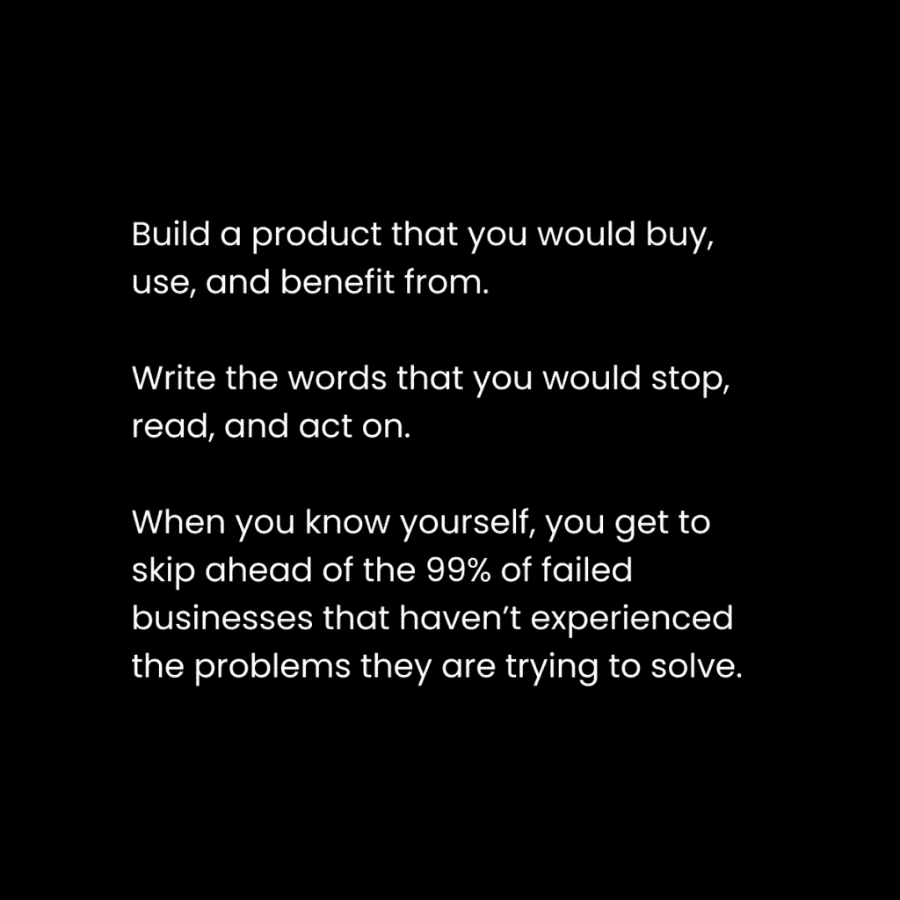

# 反利基（为什么无利基让你无可替代）

> 原文：[`thedankoe.com/letters/the-anti-niche-why-being-nicheless-makes-you-irreplaceable/`](https://thedankoe.com/letters/the-anti-niche-why-being-nicheless-makes-you-irreplaceable/)

<picture fetchpriority="high" decoding="async" class="wp-image-1652"></picture>

我在经历了多年的痛苦之后才意识到这一点。

当你开始你的自由个体之旅时，你将听到的第一条建议带来的痛苦是难以忍受的：

“利基化。”

就像社会矩阵一样，还有一个商业矩阵。

社会矩阵是一个没有根据的思想网络，它允许社会协同运作。

政府和文化影响着教育体系。教育体系为学生提供学习资源。学生不会质疑他们所学的。学生成为父母。父母传授他们所知，并将他们送到学校。孩子们交朋友，进一步适应以融入其中。孩子们长大成人，找到工作，成为教师，成为父母，成为政治家，并在线上线下创造影响文化的知识和资源。父母、学生和孩子们投票。这个循环继续创造我们生活的社会。

商业矩阵是那个让企业能够按照“应该”的方式运营的思想网络。

你是人类。你通过接触入门级知识，然后是中级和高级知识来学习。

问题是，谁从一开始就质疑了这种入门级知识？

我们绝对确定这是处理事情的最佳方式吗？

这是最有利于结果吗？还是它造成了更多的困惑，让人们过早地放弃？

那些摆脱矩阵的人可以随心所欲地做任何事情。

但你不能瞬间摆脱束缚。

在你开始自己的游戏之前，你必须理解游戏的规则并积累足够的经验。

### 这从未有意义。它从未奏效。直到…

当我开始我的商业之旅时，我从自由职业开始。

我认为这是最“适合初学者”的选项，因为我只需要“学习一项技能，出售一项技能”。

因此，我决定尝试使用几乎所有你能想到的技能进行自由职业。

视频编辑、平面设计、SEO、内容营销、Facebook 广告和网页设计。

当时我称自己为“代理”，因为这听起来比自由职业者酷。但那只是我。所以我不是代理，我是自由职业者。如果你没有雇员，那你也是。

（顺便说一句，人们不在乎你是代理还是自由职业者）。

我的痛点总是选择利基市场。

我会下载免费指南，并在“顶级 100 个目标利基市场”上进行无休止的谷歌搜索。

我的目标是牙医、健身房、建筑公司以及其他。

这种方法有哪些问题？

+   **我不在乎这些人。** 我会（并且确实）讨厌与他们合作。这不是对如此重要的事情（如你的生活工作）的可持续方法。你创业是有原因的，并不是为了仅仅有一个新的老板。

+   **我没有与他们业务的经验。** *大多数企业失败是因为它们试图解决他们没有经历过的问题。* 记住这一点。如果你忽视这一点并失败了，随时可以回来找我。

+   **它优先考虑*寻找*，而不是吸引或成为。** 你为别人学习一项技能。你无休止地寻找要联系的人，最终花费更多的时间在客户开发上，而不是建立杠杆。

没有什么奇怪的人不会坚持建立业务。

空间中环绕的商业理念已经主导了太久。

它们是肤浅的，并且缺乏对人性、心理学和满足感的关注。

我会给你一个更好的方法来创建一个细分市场。这是一种直观、有利可图且可持续的方法。

**一些能让你少受很多痛苦的教训：**

1) 强烈想要找到最佳细分市场的愿望是一个明显的迹象，表明你没有从大局出发理解商业。原则 VS 策略，“找到最佳细分市场”是一种策略。

2) 建立一个你实际上会购买、使用并从中受益的产品或服务。商业中很少有捷径，但这是其中之一。

这两个教训改变了我的一切。

## 《最赚钱的细分市场就是你》（将你的思维产品化）

<picture decoding="async" class="wp-image-1653"></picture>

大多数人没有意识到他们属于一个非常特定的细分市场。

你关注了各种兴趣的人，这些人塑造了你。

在创建你的细分市场时，这是第一个错误：

如果你的工作是针对一个特定的人，而你是一个特定的人，为什么你要专注于一个你想要围绕其销售产品或服务的特定兴趣？

不，这不会让你更有权威。

不，人们不会更信任你。

最好的情况是，你看起来像是一个“行动建议”的荣耀搜索引擎。

最坏的情况是，你限制了你的受众增长，无法利用更广泛的网络。

如果有人只谈论他们选择的细分市场，比如企业家和执行人员的培训计划，他们只会吸引那些人。

这并不坏，但样本量如此之小，这也不是付费广告，你可以精确地定位广告投放，让这些人看到。

当他们只与那个细分市场交谈时：

+   他们一开始的难度更大。

+   分享内容的人更少（他们无法接触到正确的人）。

+   他们可能一年内增长到 5,000 个粉丝，而一个结合了他们兴趣的人可能一年内增长到 20,000 个粉丝。

经过 3 年后，第一个达到 30,000，第二个因为复利效应达到 300,000。

“但是丹，那 300,000 名追随者对我的产品或服务不感兴趣。他们不是热线索。他们不会立即从我这里购买。他们是无用的。”

这里有很多东西需要解释。

首先，如果那 300,000 名追随者每人都能推荐 3-5 个人给你，那么由于网络效应，这将是一个 900,000 到 1,500,000 的受众。而那个有 30,000 名追随者的超利基化的人却在努力获得足够的杠杆来摆脱手动客户工作。

第二，他们不应该立即从你这里购买。这正是教育品牌的目的所在。你 *帮助* 他们随着时间的推移从初学者（内容）到高级（产品）。

第三，没有人是无用的追随者，你只是如此狭隘和受过时商业教条的洗脑，以至于你不理解人们可以学习到一些新东西，这些新东西可以改善他们的生活。

顺便说一句，我在[数字经济学](https://digitaleconomics.school)教授所有这些内容。

### “利基”是一种世界观或视角

<picture decoding="async" class="wp-image-1654"></picture>

让我们分析一下“利基”实际上是什么。

当你是利基时，而你又是不断变化的，你就没有利基。

你不会把自己局限于你将因人而成长的技能或兴趣中。

为什么你一开始就被要求利基化？

因此，你可以理解你的读者和客户的心态。

你被告知要创建一个客户形象，确定他们面临的紧迫问题，并向他们提供解决方案。（这个解决方案通常与任何其他产品相似，只是略有不同。关键是通过对他们有所了解，让他们觉得这个解决方案对他们有价值。**技巧**：重新创造已经存在的东西，但做得更好，不要过于复杂）。

那么，我们为什么不跳过所有这些，把自己当作客户形象，解决我们真正经历的问题，并建立一个真正对我们生活有益的解决方案呢？

这消除了赚钱的 99%的猜测。

此外，你不会与不喜欢的人共事。

从本质上讲，客户形象是你为某人创造或向其营销的思维、世界观或视角。

从结构的角度来看，世界观或视角由以下组成：

**1) 目标**

影响你每个行动的有意识或无意识的目标，比如向前迈出一步或去健身房。

自我设定的目标让你掌控自己的生活。

目标决定了你如何解读情况。一个被分配的目标是在 60 岁时退休的人，将把更少的商业机会视为机会，与那些通过 25 岁实现财务自由的人相比。

目标也决定了你（或你的读者）如何解读书籍和内容。具有不同目标的两个人将对书籍和内容有截然不同的重点。他们会注意到有助于他们目标的事情——无论他们是否意识到这一点。

**2) 问题**

阻碍你达到目标或理想生活方式的有意识或无意识的问题。

营销的基础是在一段时间内提高你读者对问题的认识水平。

如果你已经解决了自己的问题，并帮助你的受众也这样做，你处于一个很好的位置。

5 个意识层次是：

1.  **无意识** – 对他们的问题以及它如何损害他们的生活质量一无所知。

1.  **问题意识** – 了解他们的问题，但不知道如何解决它。

1.  **解决方案意识** – 了解他们的问题，并知道有解决方案、教育或知识可以解决它。

1.  **产品意识** – 了解他们的问题，并知道有一个简化的路径或系统可以解决它。

1.  **最清醒** – 他们准备好改变，只是需要立即改变行为的正确“为什么”。就像你在一本书中读到某个想法，它改变了你对生活的整个看法一样。

当你的世界观是你的细分市场时，你的工作是创造性地写作，以增加人们对问题的认识。这样，他们就会采取行动，朝着实现目标的方向寻求解决方案。

**3) 潜在路径**

世界观拼图中的最后一部分是清晰度。

当人们对自己的下一步没有清晰的认识时，他们会感到焦虑、不知所措或无聊。

这就是关系中的争吵、商业中的失调以及政党之间的斗争的原因。

与你持有不同世界观的人缺少了对方路径、叙事或系统的一部分，这使他们能够理解那种情况。

*因此，当你处于细分市场时，你的工作是创建一个全面、逐步的路径，你可以与拥有相同世界观、通常以你可以从中获得报酬的产品或服务形式分享的读者分享。*

这样他们更有可能取得成果并理解你。

我为什么的哲学沉思能吸引一大群新人进入商业领域是有原因的。因为我认为它比随处可见的肤浅的商业大师更有道理。

除了目标、问题和潜在路径之外，还有许多影响人们如何感知和行动的心理因素：

+   先前的经验

+   坚定和松散的信念

+   生活中所有领域的技能水平

所有这些都可以是有意识的、无意识的、已知的或未知的。

作为教育品牌，你的整个工作就是提高你受众的意识。

让他们意识到他们的目标和问题。

向他们展示他们生活中未知的潜力，并教育他们到他们知道的程度。

你的细分市场是你世界观中由大目标和紧迫问题组成的框架。

你的任务是编程你受众的头脑，让他们接受这种框架（或世界观），追求那些目标，并解决那些问题。

这是一项艰巨而充实的任务，是为了过上充满目标的生活。

它要求你在生活中发展自己，并承担起在你之下引导社区的职责。

领域应该是具体的，还有什么比这更具体呢？

一个能改变你生活（以及你的读者）的期望目标。

一个能减轻你（以及你的读者）痛苦的燃点问题。

一个清晰的路径、系统或解决方案，为你和你的读者带来清晰。

目标和问题几乎总是与别人的相似。

在永恒的市场中，每个人都有相同的目标和问题：健康、财富、关系和幸福。

但路径……

路径对你来说是独一无二的。

每个人都想要财务自由，但两个人*必须*走不同的道路。

你可以选择社交媒体和在线商业路线，包括电子商务以及与之相关的独特技能、心态和经验。

另一些人可能会选择投资和房地产路线，结合另一种独特的技能和兴趣组合。

记住，*你学习的每一个其他兴趣*也在你如何感知情况中扮演着角色。

即使是日记、散步或玩电子游戏这样的路径，无论它们在实现目标上多么直接，仍然在你实现目标的过程中发挥着作用。

路径创造了你。

在实现目标的过程中，你处理的所有信念、技能以及数十亿比特的信息构成了世界上独一无二的专业领域。

如果你能在你的数百篇帖子、通讯、产品和互动中描绘出你的路径，那么这就是你创造独特领域的方式。

你的工作是记录你在互联网上的生活，让真实性的回报发挥其魔力。

你的工作是吸引一个特定的群体。你通过以对你有意义的方式撰写想法来实现这一点。从你的世界观出发。从你的观点出发。这个特定的群体是你性格相同的人。这就是你如何为自己创造一个无需市场调研就能销售的产品。

### 《你的人生之书》——如何创造你自己的独特领域

当你在互联网上记录你的生活时，你创造了属于你自己的独特领域。

你的过去、现在和未来的自我心态和技能应该以有说服力的方式展现出来，以吸引那些性格相似但落后你几步的人，这样你才能真正帮助他们。

你将要概述你将写关于你生活的那本书的结构。

这将用于模式识别和内容创作。

使用这个提纲，在你获取信息时注意捕捉想法。

还可以将它用作内容计划，在 6-12 个月内撰写通讯、帖子/轮播和短篇帖子（这就是让你的受众真正熟悉你需要的时间）。

因此，就像你是在写给那些落后你 1-3 步的人一样，填写下面的书结构。

你可以使用这本书的提纲以及我的[2 小时作家](https://2hourwriter.com)课程来撰写真正能带来读者增长的内容。

**书籍引言：你的故事**

你的故事就是你的品牌。明确你的故事很重要，这样你就可以从一个独特的角度来构建内容。

你几乎可以用个人经历开始任何写作。这本身就让它与众不同，不像其他肤浅的写作。

+   你是从哪里开始的？

+   你经历了哪些挑战？

+   你的旅程的高潮是什么？

+   你实现了哪些其他人渴望的目标？

+   哪些主题、兴趣或技能帮助你达到了那里？

**第一部分：哲学**

你需要让人们与你站在同一条战线上。

你的哲学是你对“一个人如何过上好生活”这个问题的回答。

你必须不断地以引导你走向理想未来（或避免你品牌的“敌人”）的方式说明你相信和做的事情的重要性。

+   详细描述你的理想未来和生活方式。你正在引导你的追随者走向什么样的目标？

+   描述你的敌人。你想要避免的未来和生活方式是什么？

+   你有哪些别人可能会认为极端或冒犯的信念？

+   每个主题、兴趣或技能对你实现理想生活方式的重要性是什么？

在这个上面花点时间。大纲会相当大。

这些问题的答案将构成你大部分的内容想法，这些想法将带来大量的成长。

**第二部分：教育**

这就是建立权威的方式。

你的工作是教育人们关于技能或兴趣

事实上 *教授* 他们技能或兴趣以及你是如何学习的。关于这一点可以说的并不多。你并没有创造任何新东西。你只是在 *你的* 品牌下创建了一个信息库——这样人们就可以从你这里学习。

不要陷入这样的陷阱，“他们可以在网上其他地方学到这些信息。”

假设他们没有在其他地方学习的动力，而你必须提供给他们信息。

正如我们将在下一节讨论的，*人们会记住那些首先教给他们有用知识的人*。成为更多人的那个人。

**第三部分：实践**

创建逐步系统和实践，让你的读者可以使用它们来提高你的技能和兴趣。

作为额外的好处，把这些归功于你自己。

如果你想要重新创造像艾森豪威尔矩阵这样的生产力工具，那就去做吧。

不要教授那个概念或模型，而是拿过来，以可能获得更好结果的方式创建你自己的。

行为改变是权威和认可的动力。

当你在社交媒体上用时间写书时，你建立的品牌会超过 99%的人。

## 兴趣心理学——如何谈论你想要的一切并获得报酬

由于我开始改变在线商业格局，我几乎每天都会收到这个问题：

*“我想谈谈更多的兴趣，但万一参与度低或者我的观众不喜欢怎么办？”*

首先，理解内容和产品之间的区别。

人们认为内容都是关于推广的。他们认为他们应该只写那些能导致销售和推广的内容。

他们认为他们应该将他们写的每一件事都细分——而不是有一个**具体而有说服力的着陆页，一次就建立权威，这样你就不必总是在内容中谈论它**。

在这里尝试一些想法，以在你的内容中销售你的产品，然后使用这些想法来形成一个永远作为静态内容存在的着陆页，你可以链接到它。

我看到这种情况太多次了：

所有人发布的都是图片或产品的更新。

或者他们发帖说

他们从未表现出他们是人类。

他们从不教育、娱乐或激励（你知道，人们实际上在社交媒体上追随和出现的事情）。

他们只销售。

没有人关注公司账号。

人们追随教育家、娱乐家和激励者。

RedBull 有庞大的追随者群体，因为他们 Instagram 上没有一张产品的图片。它全部是关于人们因为 RedBull 而生活着的生活方式的有启发性内容。

如果你只谈论你的产品，那是一个永远不会让你的品牌增长、拥有参与度高的读者或看到收入指数增长的好方法。

个人品牌是您业务、产品或服务的最有力的流量来源。

所以，让我们从颠倒这一点开始吧。

如果你只谈论让你赚钱的技能会发生什么？

+   **你的参与度很低**。如果你的内容没有被分享，你怎么能增长，以便有更多的人来推广？

+   **你无法建立信任或权威**。停止认为你必须立即变现，开始思考你将在 12 个月内变现（这样做会让你更快地变现。）

+   **人们不喜欢你**。如果你想要转型并销售其他东西，你将无法做到。你被困在了你一直销售的那个细分市场。

人们有多种兴趣。

人们可以接受新的兴趣。

你可以让你的兴趣变得有趣，这样人们就会对他们感兴趣。

这就是将观众变成粉丝，再变成超级粉丝的过程。

某人可能因为某个兴趣而关注你，就像你在看过他主演的电影后关注道恩·强森一样。

现在，他们只是观众。

然后你或者分享他们另一个兴趣，或者被介绍到一些新事物，比如巨石强森在社交媒体上关于健身和营养的帖子。

现在，他们变成了粉丝。

然后，他们发现了构成他们心态的信念或价值观，比如巨石强森重视感恩和努力工作。

现在，他们变成了超级粉丝。

（顺便说一句，每个人都应该在他们的内容中包含心态，因为这是吸引广泛受众的原因，因为它适用于每个人）。

谈论多个兴趣是你变得不可替代的方法。

最好的个人品牌不费吹灰之力就做到了这一点。

他们只是发布他们认为对他们自己重要的事情，并试图向你展示这种重要性。

这是你可以开始这样做的方法：

**1) 专注于教育**

采用你过去自己的心态，一个绝对的初学者。

*他们*如何以更好的方式达到你现在所在的位置？

**2) 专注于理解**

放大视角，确定你追随者的知识差距。

*他们*需要了解什么才能与你站在同一页面上？

**3) 专注于重要性**

分析你的生活，并意识到你为什么这样做。

*为什么*你只有那些精选的技能和信念，而不是成千上万的其它可能性？*为什么*你选择了这条道路而不是另一条？

### 广泛的品牌，具体的产品（如何真正细分市场）

你可能会问，“丹，如果我不写任何与我销售相关的内容，我该如何销售任何东西？”

首先，你偶尔会写关于它，这样人们就会知道你在做什么。

其次，你对营销实际上是什么并没有一个稳固的理解。

你几乎从未直接谈论你销售的技能。

*你正在谈论它将如何改变他们的生活。它将如何引发变革。它将如何弥合他们目前的位置和理想未来的差距。*

你正在展示他们想要的生活，让他们意识到他们面临的问题，并展示一个作为解决方案的产品。

因此，这样思考细分市场：

你的品牌是一个吸引类似人群的广泛吸引器。

你的内容是让人们意识到他们生活中渴望的目标和紧迫问题的手段。

你的第一个和基础产品是这两者之间的桥梁。

你不必持续写关于你的产品，因为你有一种叫做着陆页的东西，它会在你的内容结束后继续发挥作用。着陆页是静态的数字地产，不会像内容那样消失。

因此，暂时成为一位疯狂科学家。

制定一份通讯稿、免费指南、低价值产品和高价值服务（如果你正在构建一个大型而非细分的市场，这是可选的）。

你的通讯稿都应该托管在博客上，这样你就可以为感兴趣的读者提供最好的阅读内容。

你的免费指南着陆页和内容教育人们成为你产品的客户。这是针对你受众中更具体的问题。

你的产品着陆页从你离开的地方继续，让人们意识到他们可以更快地解决问题。

这就是细分市场的做法。

你部署数字地产，撰写基于世界观的内容，并每天持续引导人们按照这个顺序关注你的通讯稿、免费指南和产品。

### 你的细分市场、品牌和产品的演变

解决你自己的问题，然后销售解决方案。

不仅仅一次，而是永远。

随着你生活中达到新的高度，你的品牌、内容和产品将不断发展。

随着旧产品失去吸引力，你将不得不创造新产品。这并不是坏事，实际上这让你能够维持并增加你的年收入。

自从 4 年前开始，我几乎每个季度都会推出一些新事物。

从网页设计到自由职业，再到市场营销咨询，再到实物生产力规划，再到社交媒体增长，再到自我提升，再到写作，再到商业大师班，再到短期小组，再到一本书，现在还有我从创建的系统中的软件（几乎没有人能够复制，因为他们的路径不同）。

你必须进行实验和迭代。

这就是唯一防止品牌熵增并避免社交媒体缓慢消亡的方法。你必须进化。

这封信就到这里。

希望这有所帮助。

丹
