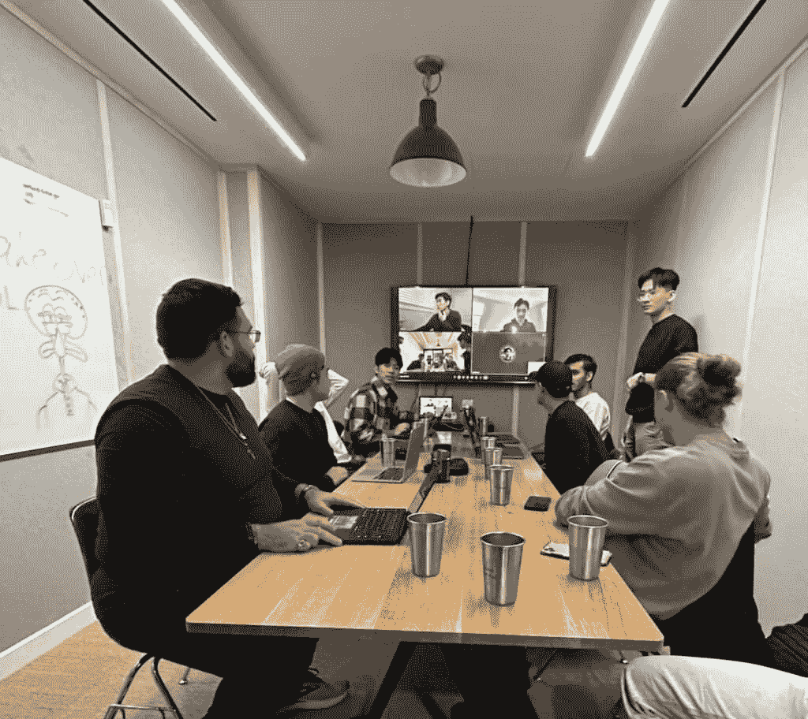

# 《合成器：好奇人士的数字职业路径》

> 原文：[`thedankoe.com/letters/the-synthesizer-a-digital-career-path-for-curious-people/`](https://thedankoe.com/letters/the-synthesizer-a-digital-career-path-for-curious-people/)

上周，我们的技术创始人兼 Kortex 的产品负责人马修·奥[Matthew Ao](https://twitter.com/TheMatthewAo)有了一个顿悟。

首先，对于那些不知道的人来说，马修是一个破坏者。

13 个月前，我和乔伊开始构建[Kortex](https://kortex.co)（原名 ValueVault）。

10 个月前，我们雇佣了一名（1）开发者来构建这个第二大脑应用程序。

但不仅仅是一个第二大脑应用程序。一个真正有用的应用程序。一个能带来结果的应用程序。一个能让你将你的知识库转化为内容、视频、播客、团队协作、学生项目等有影响力的写作的应用程序。最终让我们能够创造一种新的社交媒体。

大多数“第二大脑”应用程序只是被美化的笔记软件。

7 月 13 日，乔伊花费了 5 万美元——事情并不顺利。

我们的每周通话和更新缓慢而无聊。

我们对项目的热情迅速消退。

我们没有取得我们想要取得的进展。我不知道我们期望一个开发者能带来什么…但我们以前从未做过这件事。如果你了解我，你就知道我喜欢不管我知道多少就只是开始构建事情…而且这通常进行得相当顺利。

当时，乔伊正在帮助达科塔·罗伯逊管理他的代笔团队。

我参加了一个嘉宾通话，讨论我的写作过程。

在通话即将结束时，我提到我和乔伊正在开发一个应用程序。

马修打开了麦克风，“等等，是什么类型的应用程序？”

我们简要介绍了这个应用程序，他说他有一些想法，然后我们转向了私信。

简而言之，他说服我们摧毁 ValueVault 并重新开始。

我们聘请他作为创始人。

快进到现在，我们：

+   我们有一支由 10 名出色的开发者、3 名 KortexU 教育者、一个设计团队、销售团队以及有观众和影响力来推动这一切的创始人组成的团队（是的，一个人经营的业务已经不复存在了，但仍然是最佳起点之一）。

+   在我们的第一个月商业化中，我们产生了 18 万美元的收入（没有应用程序发布…没有投资者…另一个故事。我们只是做了我在商业信件中提到的事情）。

+   构建了[Kortex 大学](https://university.kortex.co)，使其成为互联网上构建合成师、创作者或作家数字职业的最佳新学校和项目。

+   访问了多伦多的开发团队并制定了未来的战略。

+   我们正在按计划在 1 月底推出应用程序的 0.0 版本，专门针对 Kortex 大学的学生，而不是公众。

+   没有计划接受任何风险投资或我们自身贡献之外的投资——我们将坚持我们的哲学，即利用技术和社交媒体的力量，比 99%的初创公司增长得更快。

这里是我们第一次面对面产品演示的场景（对于那些在加拿大的人）。

<picture fetchpriority="high" decoding="async" class="wp-image-1708"></picture>

哦...我正在[Kortex](https://kortex.co)内部撰写这封通讯邮件 🙂

所以如果你注意到大思想的融合和缺乏写作障碍，那就是原因。

好吧，回到马修的顿悟：

## 好奇心是你在未知中的指南针

<picture decoding="async" class="wp-image-1712"></picture>

> 做出伟大工作的方法是探索你的好奇心。因为历史上所有做出伟大工作的人都是那些创造足迹而不是跟随他人的人。 —— 马修·奥

马修足够真诚，提到这个洞见来自保罗·格雷厄姆关于[如何做出伟大工作](https://paulgraham.com/greatwork.html)的文章。

显然，如果你想得到未知的结果，你必须采取未知的路径，但人们太急于接受他人的梦想带来的舒适，而牺牲了自己的梦想。

好奇心是你在未知中的指南针。

好奇心是综合者的路径。

好奇心是发现和构建世界的方式。

社会创造了已知（并且严重过时）的路径，比如上学、找工作，并在 65 岁退休。

心灵渴望秩序，人们错误地抓住了社会为他们创造的秩序。

心灵渴望秩序，因为它要求你去做从无序中创造秩序的事情。那就是从好奇心中收集洞察力并用它来创造——那就是你的人类优势。其他生物不会像我们这样改变进化的方向。

过多的秩序、确定性和生活在已知中，随着时间的推移对你的心理变得危险。最终，它会渴望无序。如果你“度假”时间过长，它就不再是度假了，你想要回家工作。

这是宇宙的推拉之力。

一切都像叙事一样展开在章节和阶段中。你的生活、你的想法、你的自我、你的城市、你的社区、你的企业、社会、文化，一直到宇宙。试图在一生中停留在同一个章节中是导致情感动荡的配方。当你的心灵试图冻结时间时，生活仍在继续。

学校和工作有其优点，但长期遵循这条已知路径会让你陷入一个不可避免的平庸螺旋，即熵。

追求好奇心的人正在收集创意火力，以不断在他们生活中创造一个不断进化的秩序。

熵定律表明，一切都有向无序发展的趋势。这就是进化。我们抓住的秩序不是永久的，比如一份工作，随着时间的推移会分崩离析。大多数人接受这一点，并以一种悲伤的状态度过余生，而不是通过创业推动个人进化。

为了作为企业家生存下去，你必须持续坚持、迭代和进化。

查尔斯·达尔文、埃隆·马斯克、爱因斯坦和其他伟大的人追求他们的好奇心。

*他们是经验综合者，为了未来的愿景。*

他们不是通过遵循规定的课程，而是通过综合他们在好奇心道路上发现的东西来实现突破。

他们的好奇心引导他们进行了跨学科的学习。

没有人相信他们，因为他们看到了别人看不到的东西。

他们被那些意识低下和已知道路的人嘲笑——因为他们没有，也无法复制来自好奇心的信息。

我在自己的生活中也注意到了这一点。

当我停止学习商业（但在跟随他人道路后对原则有了牢固的掌握）时，我的商业成果飙升。

然后，我学习了哲学、形而上学和心理学科。

我能够从那些领域注意到相同的原理，但从一个更高的视角来看，并因此提升了我的商业成果。

模式识别给我的生活带来了意义，提供了动力来源，并让我对所有领域有了更深入的理解（因为它们都包含在生活领域之下）

哈姆扎前几天在电话中问我是什么导致了我的成长，我能想到的（不是到处都能得到的无聊建议）就是，我解释了从追求好奇心中获得的视角。我不仅仅重复了别人告诉我的东西，我还为了更好的理解而重新包装了它。我用我自己的话写了它。

大多数人无法知道，也永远不会知道，塑造我从追求好奇心中获得视角的信息。这就是为什么你是这个细分市场。你是你经验的综合者，以帮助他人理解。

**你必须对你的想法和发现有绝对的信心。**

当所有人都错误的时候，你必须是对的。

你必须忽略那些源于缺乏理解的意见。

如果你在一个已知领域选择了一条罕见的道路，他们无法看到你所看到的。

很少有人意识到，你可以通过注意他人道路和自己的道路之间的模式来*创造*一条可行的道路。

由于这个原因，我无法提供一个低级战术计划来给你带来确定性。

然而，我可以给你一个宏观指南：

+   放大视野，与你的理想自我咨询

+   意识到你的目标以产生愿景和清晰度

+   通过那些目标的视角来感知情况，以在情况中找到信号

+   收集信息，写下来，用它来构建，用它来影响他人

+   创造力是利用你的经验来实现目标

如果你想掌握一个领域，就要在元领域获得一般知识。

如果你想掌握商业，就要在传播、价值创造、形而上学、人性、心理学以及其他任何价值交换的粘合剂领域获得一般知识。

但是，你必须真正构建业务，以消化从这一追求中获得的知识。

你不能整天学习，却期望取得进步。

## 综合者：多面手和自我提升者的新职业道路

这条职业道路假设你雄心勃勃，努力提升自己，并享受跨学科学习。

这是为了那些厌倦了现代工作和商业模式的人。

你看到大众在工作中和生活中缺乏意义。

你看不到一条摆脱默认路径的方法。

你对自己的未来并不满意，但喜欢学习和自我教育。

我们帮助人们在 90 天内将他们的好奇心转化为数字职业，通过[Kortex 大学](https://university.kortex.co)。

### 什么是合成器

合成器是一个以好奇心为指南针，选择一条独特路径，将想法联系起来实现自我生成目标，并将他们的综合分析分发给有相同想法的人以实现类似目标的人。

合成器是一个沉迷于现实探索的人。他们明白现实不能像生物学、化学、哲学和文学这样的学校课程那样被分割。他们明白这些现实方面的内容已经被很好地记录下来，如果我们想要取得更好的结果，我们必须将现实视为一个相互关联的整体。合成器为有利可图的难题创造整体解决方案。

合成器是一个[价值创造者](https://thedankoe.com/letters/the-value-creator-a-new-internet-career-path-for-intelligent-people/)。这是一种在社交媒体上专注于教育和理解，而不是表情包和过度娱乐的创作者。

合成器是一个 DJ，但拥有想法。

合成器是一个去中心化的媒体公司。

当人们会写作并出版书籍时，只有少数人会上电视现场推广。

现在，他们只是在社交媒体上发帖，并参加播客巡演。

每个人都可以成为自己的媒体公司，通过做自己喜欢的事情来谋生。

作者可以在没有出版商的情况下建立受众并写出一本成功的书。

音乐家也可以做到这一点，无需唱片公司就能制作出音乐作品。

创意人士也可以做到这一点，无需成为公司的雇员就能销售产品。

合成器的道路允许你做你喜欢的事情（并且可以赚取你想要的任何金额），因为你不依赖于“上司”提供薪水或佣金，你的收入潜力取决于你的技能、受众规模和创造力。

### 合成器世界观

要成为你不想成为的人是困难的。

如果你没有合成器的思维方式、价值观或信仰来塑造自己，那么要利用你面前的机会将会很困难。

你可以通过逐渐接触并消化新信息，通过学习和实践来改变自己。这种改变不会立即发生。

你将不得不摒弃旧信念，并为那些告诉你“找一份真正的工作”的婴儿潮一代发展出厚脸皮，因为他们根本不知道这条工作线比几年后不会存在的旧工作更安全、更有利可图。

当你阅读书籍、浏览社交媒体内容，并围绕你的未来进行对话时 - 尝试与合成者的这份价值观和信仰列表建立联系：

+   金钱是构建你想要的东西的工具，但它本身并不存在。

+   你生活在一个可以创造自己的职业，而不是被分配职业的时代。

+   在去中心化的经济中，个人责任决定了你生活的结果。

+   你不会用平均的目标得到平均的结果。你会用罕见的目标得到罕见的结果。

+   好奇心、现实探索，以及对一项技艺的最终痴迷是你通往伟大的关键。

+   自我教育是一个基石习惯，你必须每天都要做，无论学习什么主题。

+   人类注定要扩展、超越和创造。不断的自我提升和进化是不可避免的。如果你作为一个个体停滞不前，你的努力也会如此。

+   有一种方法可以用技术和互联网构建你想要的生活。如果没有方法，就创造它。

通过重复和训练你的思维，你可以将这种世界观作为你自己的，一旦这样做了，成功就会变得难以避免。[你的思维是一个帮助你实现目标的系统](https://thedankoe.com/letters/you-wont-be-the-same-person-in-6-months-master-anything-fast/)。

### 技术合成者的技能

> 学会销售，学会构建，如果你两者都能做到，你将无所不能。 - 纳瓦尔

现在，你不能只是“追求你的好奇心”并希望一切都会顺利。

这正是你成为一位挨饿的艺术家的方式。

正如纳瓦尔所说，你必须学会销售和学会构建。

从大局来看，这归结于人性（销售）和技术知识（构建）。

从这个角度来看，我们可以将技能分为三个阵营：

**1) 永恒的技能**

研究“人性”是一项艰巨的任务。

这可以通过观察和提问来实现，这应该是你的习惯之一，但我们可以使它更加实用。

人性可以与机械和心理联系起来。两者的原则帮助你理解和预测人类行为。

人类行为归结为对问题的认识，设定目标以克服它，并制定实现目标的计划。这可以是自觉的，也可以是无意识的。许多人被社会分配了问题和目标，如果社会是一个行为系统，这就解释了为什么大多数人既舒适又痛苦。

永恒的技能包括[写作](https://2hourwriter.com)、演讲、营销和销售。

它们共同代表了互动、沟通和价值交换。

这些技能是你综合想法的边界。

如果你不知道如何以有影响力的方式分发你的想法，你的想法将如何产生影响？如果你不了解构建受众的技能（沟通和价值交换），你将如何建立受众？

购买课程，沉浸在书籍和播客中，像你的未来取决于它一样学习永恒的技能，因为确实如此。

**2) 技术技能**

技术的发展极大地造福了个人。

你可以学习编程，这是一条非常可行的道路，但我们也有访问工具，允许我们在不学习编程的情况下构建。

以前需要多个员工完成的工作现在只需要一个人和一些自学。

你可以在一天之内建立一个网站、着陆页或漏斗。

你可以写一封电子邮件并立即发送（而不是使用驿马快递）。

你可以下载 Photoshop，让 AI 生成令人难以置信的品牌资产。

建立数字房地产已经变得无缝。

我建议几乎每天练习那些永恒的技能。

在根据你的个人兴趣构建项目的同时，我建议你学习技术技能。

简而言之，你必须学习与现代商业建设相关的每一个技术技能。

图形设计、电子邮件营销、社交媒体上的内容写作、产品托管以及像日程安排软件这样的服务工具。

这在当今时代相当容易，但要让它成为第二天性需要一些时间。

**3) 个人兴趣**

你打算如何学习这些技能，并确保你选择了一条值得传承给别人的独特道路？

再次强调，通过追求你的好奇心。

为了开辟自己的道路，你必须通过你选择的技能来写作、演讲、营销和销售。

个人兴趣为你的项目提供了方向。

个人兴趣源于意识到你生活中的问题——而不是无意识地将其扫到地毯下。

如果我真正意识到超重正在阻碍我的潜力，我的意思是真正意识到它如何影响我生活的方方面面，那么我自然会开始对健身感兴趣。

从那里开始，当我在这个领域进行实验时，我对某些饮食、训练方式和生活方式选择产生了兴趣。这本身就创造了一条独特的道路。

现在，如果我想给这项事业增添意义，我会选择将其货币化。因为商业是一种有目的的生活的载体。我可以通过将我的成果和经验传授给他人，利用互联网大规模提高人类的福祉。

要做好这些，健身现在成了我构建和销售永恒和技能的工具。

### 综合家的习惯

如果你想要成为一个综合家，你必须成为一个综合家。

这没有太多意义，所以让我解释一下。

你没有得到你想要的结果，因为你不是会得到这些结果的人。

“你是谁”由你的世界观或视角组成。

你的视角影响你对情况的认知（是的，我经常重复这一点，因为它是最重要的，决定了你生活的结果。）

你对情况的认知决定了你可以做出的选择，然后你做出一个有利于有意识或无意识目标的决策。

随着时间和有意识的练习，这些决策变成了习惯。

因此，*你是谁*是观点和习惯之间的舞蹈。

你不会一夜之间就采纳我们上面分解的世界观作为你的观点。

你慢慢地将习惯引入你的生活，这些习惯会推动你进入未知领域，并让你接触到积极的反馈，这些反馈会加强你试图塑造的身份。

如果你想要成为一个综合家，你必须采用综合家的生活方式——在更小的范围内。

这适用于你生活中的任何东西。它必须体现在你的日常生活中。

随着时间的推移，当你得到允许这样做的结果时，你将增加在这些习惯上花费的时间，使其成为你的全职生活方式。

你必须首先成为一名兼职综合家，然后在你准备好时全职工作。

我们可以将这些习惯简化为两个简单的块，你可以随着时间和结果的增加而增加：

**习惯 1）生产力阻塞**

生产力阻塞用于构建、创造和维护。

在这 30-90 分钟内：

+   进行专注的工作

+   写内容以建立读者群

+   为那个读者群构建一个提供价值的产品

就这样。这些都是杠杆。你必须留出时间来建立一个可能盈利的项目，以取代你的收入来源。你还必须为该产品获取客户，以便你能够过渡到全职。

关于这一点——新的[FOCI 计划者]现在可以订购了（https://thedankoe.com/planner）。我知道你们很多人都在等待一个实体计划者。

这包含了我用来构建我专注工作块的精确系统：

+   为未来创造一个最小可行愿景

+   将其分解为月度、周度和日目标

+   从下往上设定优先任务以实现那些目标

+   随着你了解你做什么和不想做什么，迭代你的愿景

这个过程本身就为习惯 2 创造了清晰。

**习惯 2）创意阻塞**

创意阻塞用于捕捉和连接可用于创作的想法（这些是 Kortex 应用中的 3 个标签）。

在这 30-90 分钟内：

+   **去散步**。远离干扰，利用这段时间观看视频、收听播客、读书或按照你的愿景阅读。

+   **寻找灵感**。为了保持创造力，你必须收集那些吸引你的新颖想法，这样你就有东西可以综合到你的写作或构建中。

+   **沉思**。休息并让你的默认模式网络激活。将你的注意力转向内部，在你沉思和连接它们时，让想法跳跃，为你的写作和构建创造新颖的视角。

对于一个综合家来说，生产力和创意阻塞是必不可少的。这是你必须每天做的两件事。

### 综合家的主要杠杆

你是一个作家。

几乎每个人都是。

越早意识到并接受这作为你身份的一部分，你就越能擅长它。

写作是你：

+   发送电子邮件

+   写内容

+   写视频脚本

+   写广告和促销

+   发送网络私信

+   明确你的想法以增强你的演讲（在短信、对话、视频和其他任何东西中……写作可以并且应该首先进行）。

我不是在谈论技术或学术写作。

我在谈论有影响力的写作。

基于说服、营销、销售、人性和心理的写作。

（好的）写作是将文字转化为价值的方式。

你不能“随便写”你想要的任何东西，任何时候都可以。

你必须围绕你读者的心理基础来写作：

+   燃烧的问题——暗示或陈述他们想要解决的问题。

+   可取的目标——最好是来自你愿景的目标，这样你可以吸引像你一样的人（那些你可以帮助最多的人）。

+   跨越差距的路径——从个人经验出发，你的系统来实现那个目标。

我之前在[价值创造信](https://thedankoe.com/letters/value-creation-the-skill-that-built-my-one-person-business/)中已经分解过这一点。

写作是将想法综合成有形的东西，这样你就可以随着时间的推移来改进它们。

没有写作，你的想法不会变得更好，你的结果也不会。

并且，你不会做那一件能让你在别人面前展示价值的事情。

### 合成器的货币化路径

作为作家、创作者或合成器，你的货币化路径和收入来源是无限的：

+   写一本书

+   销售数字产品

+   销售实体产品（如计划本）

+   销售辅导、教练或咨询

+   使用写作或其他任何常青/技术技能或个人兴趣进行自由职业

所有这些路径都是低成本（除了实体产品）并且允许你通过做自己喜欢的事情谋生。

你可以观察创作者经济，看到人们几乎可以用任何可想象的兴趣从中获利（不要陷入一个回音室，认为只有某些东西比其他东西卖得更好）。

建立你的读者群，然后建立你想要的任何东西。

一旦你有了允许的现金流和读者群，你就可以建立你想要的任何类型的业务，就像我们正在建立 Kortex 一样。

最后，一个推广。

如果你想在 90 天内成为合成器，[申请成为 Kortex 大学少数学生之一](https://university.kortex.co)。

注意下一期开始日期。

感谢阅读，祝您周末愉快。

丹
