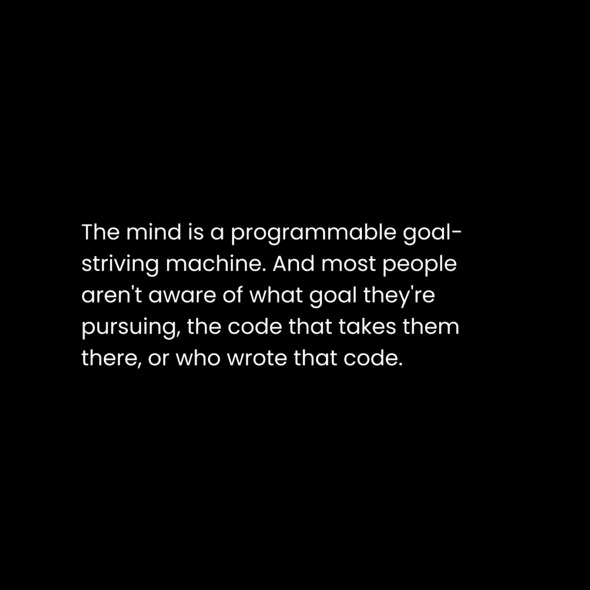
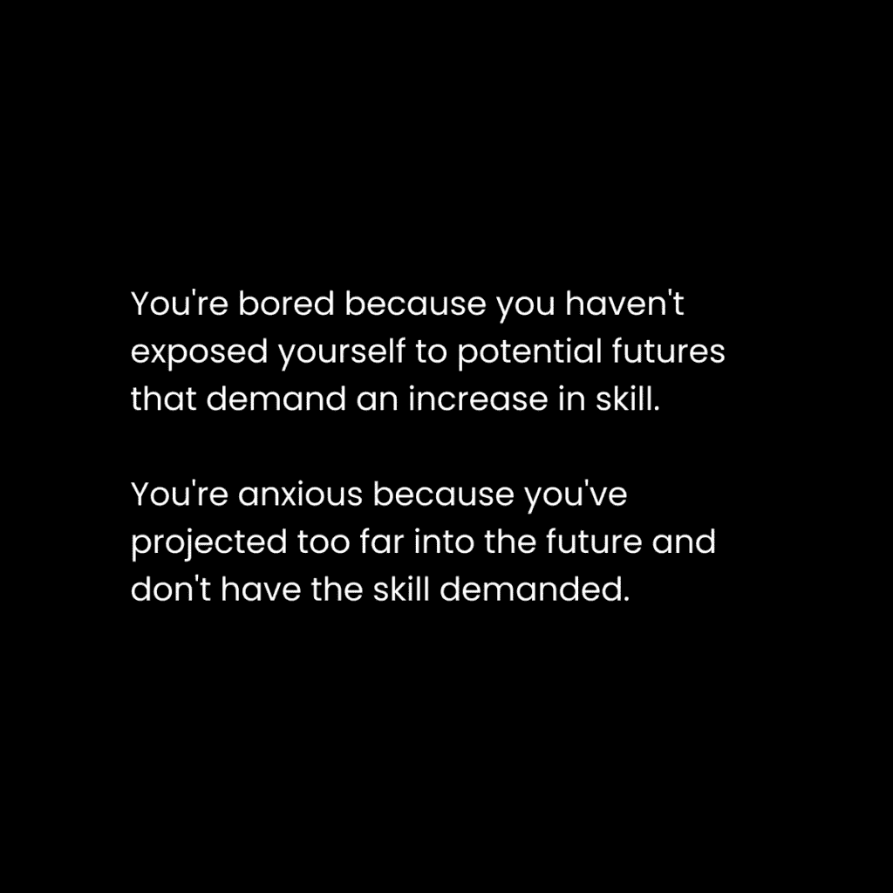

# 停止在自动驾驶上浪费你的生命（4 种改变你未来的方法）

> 原文：[`thedankoe.com/letters/society-is-a-behavior-system-how-to-escape-the-matrix/`](https://thedankoe.com/letters/society-is-a-behavior-system-how-to-escape-the-matrix/)

你的头脑是一套复杂的系统，随着时间的推移，它在实现其采用的目标方面变得更加高效。

你的头脑是解释现实的容器。

当你出生时，你的头脑几乎是一张白纸。

你有生存的生物目标，所以你的大脑会在你饥饿时、想要关注时，以及在你尿布上放任自己后感到不适时发出信号。大多数婴儿出生时都在哭泣，因为他们刚刚进入了一个名为生活的巨大刺激和未知的游戏。

随着你变老，你开始发展出一个感觉版本的自己。

即使你看不见自己的脸，你的父母也会唱儿歌，指向他们的身体部位来帮助你了解自己。

“眼睛，耳朵，嘴巴和鼻子。”

很快，你开始爬行，玩着来自你文化的玩具，走路，并试图理解你父母说的这种外语。

你想要生存。你想要融入。你的头脑是一个模式识别机器。行为和语言系统在你潜意识地测试、失败和成功于社会的代码时被编程进你的头脑。

一个系统是一个实现目标的过程，社会系统被注入你的头脑，这样你从孩子时期就不会失去理智。

我在我的新书《专注的艺术》中讨论了所有这些。

### 从沉睡到清醒

到我们 30 岁的时候，普通人已经陷入了他们自己创造的监狱。

不是社会的创造，而是他们自己的。

是你未能质疑社会强加在你身上的限制。

你没有挣扎地接受了它们。

大多数人成长后过着单调的生活，一次又一次地重复，用借口、辩解和认同来强化他们狭窄的头脑。

> 被冒犯。责怪所有人，但不是你自己。将你的自我价值与激进的思想联系起来。接受一切表面价值，不质疑。期望仅仅因为存在就能得到免费的东西，不劳而获。做当局告诉你的事情。上学，找工作，在某个成熟的时候退休，没有任何保证，只有足够的货币来生存到死亡。 —— 专注的艺术

每个年轻人的生活中都有一个转折点。

你可以选择继续成为你头脑中编写代码的奴隶，或者你可以经历学习它、解构它和重新编程它的痛苦过程。

3 个广泛认可的道德发展阶段：

+   **前传统** – 一个尚未社会化的年轻人类，他们通过服从来避免惩罚，并出于自我利益行事。

+   **传统**——人类通过自身和他人形成信念、价值观和标准，通过符合社会来学习。他们试图维持社会秩序。

+   **后传统**——人类对社会提出问题并反思，从更高的层次观察它，然后通过批判性思维对其进行批评或改革。普遍原则发挥作用，导致“啊！佛教徒是对的！”这样的洞察。

危险在于陷入先前阶段。

人们在这些阶段依附于意识形态，并宣扬这种世界观为“正确”而其他人则是“错误”。

你可以在那些对他们的幻想上帝畏缩以避免惩罚的圣经敲击者中看到这一点。

你也可以在那些相信一种模型或做事方式是绝对的商业人士中看到这一点。

为了稍微打破一下哲学性格——那些达到创造者发展后传统阶段的个人会意识到[你是你的细分市场](https://thedankoe.com/letters/the-anti-niche-why-being-nicheless-makes-you-irreplaceable/)，并从普遍原则出发经营他们的业务。

这封信将作为催化剂，唤醒一些好奇的人。

## 矩阵是一个思想的网络。

> 文化是一种大众幻觉，当你走出大众幻觉时，你会看到它的价值所在。 —— 特伦斯·麦肯纳

你如何知道关于现实的一切？

你如何知道什么是真的，什么是假的？

你如何知道你应该做什么，不应该做什么？

*这是社会中的另一个人告诉你的，他在社会中学习过。*

你所知道的 99%都不是通过你自己的测试或实验发现的。

别人从哪里得到他们的信息？从别人那里。

*你获得的所有信息都是来自那些出生时一无所知的人。*

在你学会走路和说话之后，作为孩子你下一步要做的就是上学，所以让我们以这个为例。

学校董事会决定在学校应该教授什么。但是父母对学校董事会有重大影响。父母从哪里得到关于学校应该或不应该教授什么观念的？从他们的教育和父母那里。

随着你通过公立学校的学习，你会从其他学生和老师那里学习习惯，完善你的行为，并发展你的语言。学生和老师从哪里学习他们的习惯、行为和语言？

到现在为止，你几乎是一个进入正规教育系统的克隆体。

让我们快速地过一遍这一点…

大学中的学生和教育者来自学校。在学校教孩子的那些人来自大学。那些在大学教人的那些人也是来自大学。你能看到这是没有根据的，是循环的吗？

社会通过科学期刊和出版物确定信息为真。要发表，你必须符合出版物的偏见。谁创造了出版物？那些通过博士教育形成的偏见的人，他们由拥有博士教育背景的人教导。

当你在学校时，你是如何完成你的作业的？当文章来自大学时，你会研究像维基百科这样的网站。你通过像谷歌这样的搜索引擎找到维基百科页面。

谷歌根据最盈利或最受欢迎的内容来决定显示什么。谷歌根据链接和链接权威性赋予页面权威。谷歌更重视来自大学的链接。

学校系统只是这个例子之一。

药企资助大学的大片区域。

银行系统是社会每个锚点之间的润滑剂。

你必须借学生贷款来资助你的教育。

货币是矩阵的生命线，如果某个地区的货币停止流动，它就会像你失去手上的血液一样死去。

社会的结构依赖于自身而存在。

有些人可能会称之为金字塔计划。

## 注意锚点 —— 负面反馈条件塑造你的思维

> 如果你选择的话，你可以生活在这些知识结构之中，也可以在其中死去。但好奇的人……通常会对传统的答案感到不满意。 —— 特伦斯·麦肯纳

社会是一个思想网络，它允许你的心智理解世界，避免疯狂。

在这个意义上，想法是心智能够理解并标记的任何事物。想法是一切。如果我们想变得疯狂一点，现实中的每一件事都是心智中的想法。现实是心理的。

思想是整体部分。它们层层叠加。它们允许彼此存在。它们是有层次的。

就像单词到句子到段落到章节到一本书，那本书也是书架的一部分，而那个书架又分解成像木头这样的部分，木头来自树木，而树木深入生态系统，使许多其他事物得以存在。

这个社会网络包含着诸如教育、媒体、经济、政府和文化等锚点，这些都是居住在其中的人所创造的。

社会是一个反馈系统，它惩罚那些不符合社会规范的人，作为纠正行为的负面反馈机制来实现社会的目标。

当孩子们不遵守矩阵规则时，父母会责骂他们。

教师给差成绩以鼓励记忆和服从。

当你做些与众不同的事情时，同龄人会取笑你。

社会是一个系统。

你的思想是一个系统。

你的身份是一个系统。

从宏观到微观，现实是一个复杂的巢穴——或者说是一个层次——的系统。现实是一个巨大的心智。

从下往上，除非你做出有意识的重新编程选择，否则你的身份是由社会编程和塑造的。

编程类似于条件反射或训练。

随着时间和重复，你会养成习惯，学会你的语言，并形成可能与你的理想生活方式一致或不一致的世界观。系统在你的脑海中作为与社会深度互联的网状结构。

一切都始于注意力。

你的大脑渴望秩序、安全和确定性。社会提供了这些。所以你的注意力几乎被迫集中在社会为你设定的系统上。

你的身份承载着你试图实现的意识或无意识的目标。

如果你是一个在社会中运行的项目，一个 NPC，你的目标是得到一份高薪工作，你的大脑不会把创业视为重要的事情。

表面上看似无害，因为“并不是每个人都需要创业”，但这远比这要深。

### 解构游戏

游戏很有趣，但只玩一会儿。

如果你不再继续追求升级所需的挑战，它就会变得无聊。

如果你尝试玩一个新游戏，但不是从第一级开始，你会感到焦虑并放弃。

游戏是一个系统。游戏是一个故事。它模仿现实的起伏。

大脑喜欢游戏，因为大脑喜欢秩序。它喜欢事物有道理，讨厌它们没有道理。

一个游戏包含了一系列目标，这些目标组织了思维，导致了专注、流畅和满足——但只有在你在游戏中进步的时候。

社会是一个从下到上的目标游戏：

+   上学，这样你就能和其他人一样进入同一个无形的页面

+   找一份工作，这样你就能为社会运作做出贡献

+   按照虚构的文化道德规范结婚

+   被你不在乎的责任（因为社会告诉你这么做）所束缚

+   被迫关注琐碎的问题，这样你就浪费了时间，永远不会通过追求自己的事情和自由思考来威胁社会

+   在你能够退休的任何年龄，带上一点钱，就像计划中的一样退休

+   希望永远不再工作，永远度假（我们都知道结果会怎样）

学校生活有些吸引人，但当你达到社会游戏的职业追求时，无聊慢慢地抓住你的理智，让你成为一个寻求快乐的机器人。

这是 99%的人的结局。

如果你不去创造自己的游戏，你就会被困在玩别人的游戏里，这会变得无聊……让你陷入永恒的压力和狭隘的循环中。

## 如何逃离矩阵

我写这篇文章并不是为了把社会描绘成邪恶的。

这主要是一个无意识的生存过程。

这是一个必要的游戏，我们必须玩到更多的人醒来，为孩子们创造一个更清醒的游戏，这可能需要几十年甚至几个世纪。

然而，对于正在阅读这篇文章的人来说，有一些一般的步骤可以帮助你逃离这个矩阵。

这不是快速修复。

这是一种生活方式。

这是你的生命工作：

看看你的能力。

### 1) 掌握你的生存与找到目标

> 你的问题是紧密相连的网络，将你束缚在当前的情况中。问题不是孤立存在的。 —— 专注的艺术

你不喜欢的生活状况有原因。

你还没有意识到让你停留在那里的问题的存在。

你还没有扩展你的思维去超越你的问题，获取解决它们所必需的知识和技能，并解决它们以巩固新的思维层次。

你感到迷茫，因为你没有目标。

为了简单起见，你的目标是你为了实现目标而解决的问题。大多数人被分配了一个不发展的目标，他们永远被困在狭隘的、充满压力的状态中，推动着社会目标。

当你掌握了生存技能，你就不再需要不断担忧。

你为创造力、灵性和有意义的工作腾出了空间。

你不在乎这些事情，因为你无法在乎它们。

你还没有解决摆在你面前的那些问题。

你超重吗？你的饮食很糟糕吗？你讨厌你的工作吗？你忽视你的关系吗？

这些是相互关联的问题，而不是孤立的。

你的工作可能占据了你一天中的大部分时间，以至于你没有精力投入到生活的其他领域。你的营养可能正是导致这种能量缺乏并影响到你人际关系的原因。

掌握生存技能就是掌握永恒的市场：健康、财富和人际关系。

没有巧合这些是商业中最有利可图的垂直领域。每个人都有这些问题，通过解决这些问题，你获得了将你的经验货币化的经验，并做你热爱的事情。

我在[Solve Your Own Problems & Sell The Solution](https://thedankoe.com/letters/the-self-reliant-career-path-how-to-generate-independent-income/)中讨论了这一点。

当你实现了自我提升的微小目标时，你才能发现更深、更有意义的目标。

当你没有解决自己的问题时，不要试图解决世界的问题。

### 2) 从去中心化的学校系统学习

你没有意识到你的潜力，因为你还没有接触到它。

你没有接触到它，因为你的环境完全已知。

未知是可能性的土地。

你必须让自己接触新的职业道路、健康观念和社会圈子。

认识到你必须获取的知识和技能，以改变你的生活。写作、营销、销售、健身、营养、沟通以及其他。

一个好的起点是[2 Hour Writer](https://2hourwriter.com)，因为写作是学习任何其他技能的基础。

当你这样做时，你会感到不舒服。你的身份会受到威胁。这需要时间来积累。

创作者经济是去中心化的学校系统。

创作者正在解决他们自己的问题，开辟新的道路，创造新的工作，并通过内容传授他们所学。

+   突破你的舒适区

+   跟随那些传播改变生活信息的新人

+   投资于非传统教育以获得非传统成果

+   发现你生活中的新潜力并采取行动

生活变得有意义是在已知边缘。

当你发现新颖的信息时，你的大脑会发出信号，表明你遇到了一个有意义的事件。

不要忽视这一点。

完全追求它。

对教育的狭隘领域着迷。

这就是如何打开你的思维，整理你的思维，并训练你的思维成为一个新的思维——一个不受社会限制的思维。

### 创造你自己的无限游戏

> 创业是长期思考者的唯一合理选择。 —— 专注的艺术

如果你想要停止玩社会的游戏，你必须创造你自己的。

一个具有无限进步和演化的游戏。

不是那种把你困在某个水平上并使生活变得无聊的东西。

这是通过培养你对未来的愿景，迭代一个计划来创造那种现实，并选择一个允许你做到这一点的载体来实现的。

注意我说的是“培养”一个愿景和“迭代”一个计划。

这是一个持续的过程。它不会结束。你的愿景不会保持静止。你的计划也不会。就像生活中的一切一样，它们会变化。

+   展示你未来想要的一切

+   展示你未来不想要的一切

+   创建一个目标层次结构以实现目标

+   获得必要的知识和技能

+   用经验作为反馈机制来调整你的计划

你可以在一个空白笔记本上做这件事，或者使用我为这个过程创建的[FOCI 计划者](https://thedankoe.store/products/the-foci-planner)。

当你感到无聊时，不要放弃，要转变方向。追求一个更高的挑战，利用你已掌握的技能。

例如：如果你对自由职业感到无聊，尝试电子商务。这不是闪亮物体综合症，这是智慧。

当你感到焦虑时，在你和试图实现的压倒性目标之间设定一个更明确的目标。

### 利用数字社会

我认为工作是一个垫脚石，而不是死刑判决（尽管对许多人来说确实是）。

对于大多数人来说，直接进入创业是不切实际的。

由于矩阵的本质，人们会在早年承担一些束缚他们的责任。

账单、家庭、住房和一份能消耗你精力去做任何事情的工。

请不要误解我，我并不是反对工作。

工作对于培养有价值的技能集非常有用，但它们提供的满足挑战可能会很快消失，如果你工作占据了生命的 1/3，但消耗了你其他 1/3 的能量，而你其他 1/3 的时间都在睡觉……这是需要改变的第一件事。

互联网和社交媒体创造了一个数字社会。

创作者和品牌是新的教育体系、媒体、政府（在线空间中的政府……人们互相指责以保持空间清洁）、宗教（每个人都推动一种意识形态）和经济（每个人都卖东西……不，这不是坏事，这是生存）。

这个社会是去中心化的。你不会被强迫走任何一条路。你有追求你想要的东西的选择，如果你陷入僵局，你要对你的缺乏批判性思维负责。

我的建议：

+   使用你的技能组合在互联网上的创作者或品牌下找到一份工作

+   选择一个能让你有自由时间追求自己事情的工作

+   使用你新学的技能来建立自己的事情

你的个人资料是你的公开简历。

我们教授所有这些内容，帮助你 90 天内开始在[Kortex 大学](https://university.kortex.co)的数字生涯。

你写内容来展示你的价值。你建立人脉以加入一个社区。你利用这个社区寻找机会。最终，你使用你获得资源，比如观众，来建立自己的业务并过上自由的生活。

你不可能立刻做到这一点，就像你花了 18 年以上时间才成为社会中的一行代码一样。

解构你正在玩的游戏。

理解在你脑海中运行的代码。

创建你自己的游戏。

并且享受你剩余的星期。

丹
