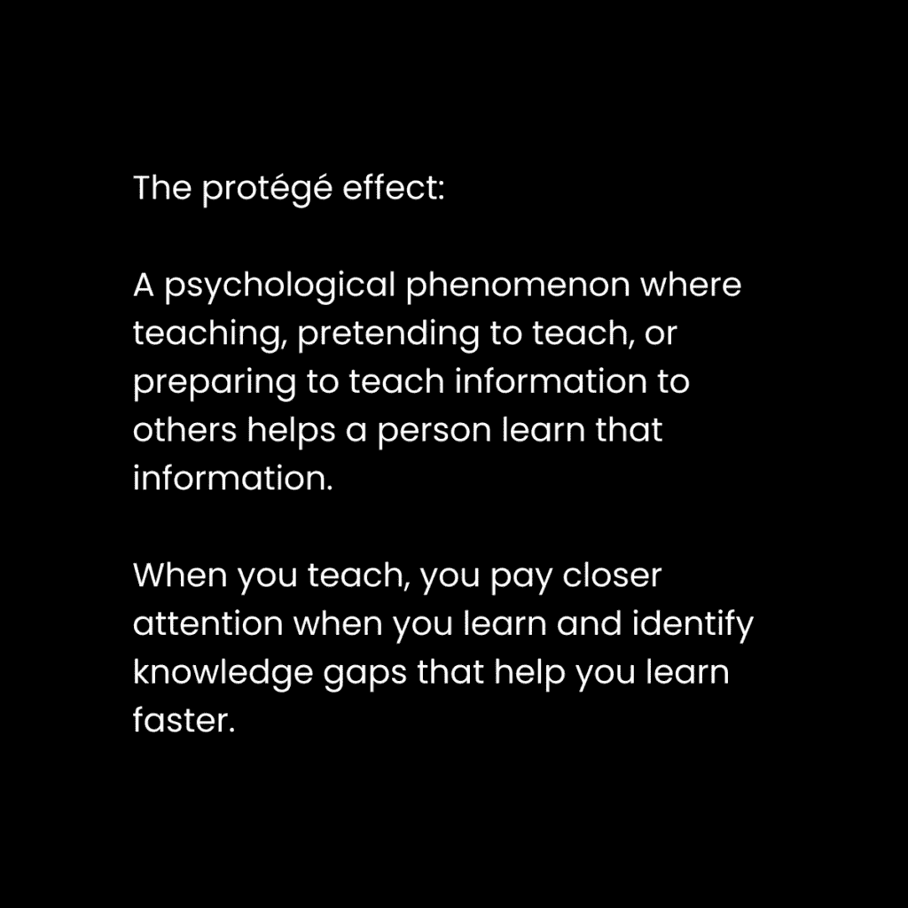
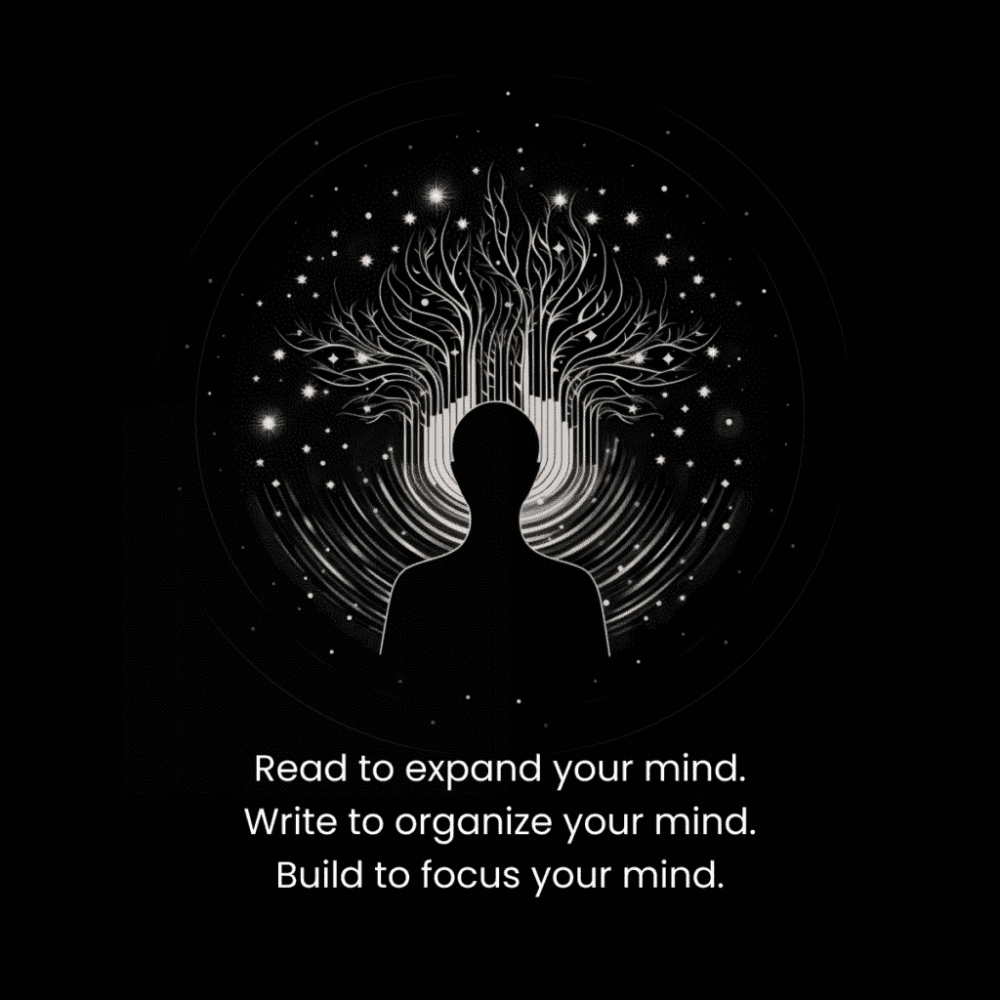

# 你应该感到不知所措（如何快速学习任何技能）

> 原文：[`thedankoe.com/letters/i-discovered-a-way-to-learn-10x-faster-reality-metabolism-universal-thinking/`](https://thedankoe.com/letters/i-discovered-a-way-to-learn-10x-faster-reality-metabolism-universal-thinking/)

人们认为他们不应该感到不知所措。

+   你感到轻微的不适

+   你的心智讨厌这种感觉

+   你还没有训练你的意识

+   你瞬间回到舒适和快乐中

+   你封闭了自己，无法拓展、成长和理解

当我尝试学习新事物时，这一切都没有意义。

我感到不知所措，感觉自己是在退步而不是进步。

事实上，我正在为我的心智进行模式识别的预备。当我接触新材料时，我的潜意识像海绵一样吸收信息。

慢慢地，然后突然，一切都变得有意义。

“咔哒”的声音。

“啊哈！”的时刻。

被称为洞察力的雪崩冲击到你的心理。

但只有当你与不适相处，深入感受它，并允许你的超级计算机般的思维将一切拼凑在一起时，才能做到。

没有发生任何事情，然后一切事情都发生了。

如果你想了解将你所学转化为有意义职业的完整哲学和步骤，请从亚马逊购买[《专注的艺术》](https://theartoffocusbook.com)。

## 现实新陈代谢——心智肥胖的成因

你感到不知所措，因为你无法快速消化现实。

你无法处理这种不知所措，因为它消耗了你的注意力。

你所能关注的只是你脑海中关于它不会奏效、你会失败以及你可以用你的时间做更好的事情的负面想法。

在健身中，你通过增加食物摄入量、用抗阻力训练挑战你的身体，以及充足的休息来恢复来增加肌肉。

在路上，你可能会获得一些脂肪，但如果你想要看到明显的成果，这是不可避免的。

在心智构建中，你通过增加信息摄入量、用具有挑战性的概念挑战你的心智，以及休息以便你的潜意识能够咀嚼复杂问题来构建知识。

当你学习新事物时，它是新的。

你的心智尚未发展出使其无缝运行的系统。

你并不总是知道如何走路、说话、吃饭、开车、发短信、整理床铺、扔橄榄球，以及你为工作、休息和娱乐所做的一切。

你训练了你的心智新陈代谢，使其轻松消化现实的那一方面。你已经建立了心智肌肉，以承担做那些事情所带来的情感劳动。

那时和现在之间的区别是你已经接受并作为你身份一部分的界限。

当你的心智没有被正念所控制时，它会在不适的第一丝迹象面前退缩。

而当你听从并服从那个不想对你最好的思想时，那就会成为你的默认状态。你变成了一个自我编程以避免任何痛苦的机器人，即使那种痛苦给你的生活带来了意义、满足感和目的。

### 在你能力的边缘生活

如果你消耗过多而创造过少，你的思想就会变得肥胖。

如果你创造过多而消费过少，你的思想就会变得瘦弱。

我们都不想要。

当你的生活中通过消费和创造的平衡使信息流最大化时，你将遇到有意义的事件。

你将*感受到*对未来充满兴奋，对现在感到满足，对过去感到感激。

这些感觉应该被视为一个机会，记录你生活中可以与他人分享的重要部分。

当你读一本好书并偶然发现一个激发兴奋的教训时，把它写下来。

当你因为取得的进步而在当下感到满足时，把它写下来。

当你因为过去带给你这个时刻而感到感激，尽管你有错误，把它写下来（比如在[Kortex](https://kortex.co)上）。

随着你的信号笔记增长，你有了可以复制那些经历的数据。

你可以训练你的思想，使其占据这些意识状态作为基础。

你的生活质量提高到一个高度稳定的状态。

## **通用思维 – 解决你大多数问题的方法**

你感觉不好，因为你的未来自我正在观察你的每一个动作，而且他们不喜欢他们看到的东西。

解决你大多数问题的方法：

放大视角。采用你理想自我的视角。打破把你困在消极思维混乱循环中的狭隘关注。

理解你现在在哪里，选择你想要去的地方，并通过教育与执行来弥合差距。

大多数人生活在一种封闭的心态中。

他们成为了焦虑、压倒性和压力的受害者，这阻止了他们看到问题之外的东西（因此他们可以解决问题）。

人们关注的是糟糕的歌词，而不是好歌。

人们关注的是丑陋的像素，而不是美丽的图像。

你错过了情况的背景，误解了它，所以你陷入了困境，无法学习。

你必须训练你放大视角、采用更高视角并感知情况对你最终目标有利的能力。

形成这个习惯：

当你感到压倒性时，暂停并打破反应周期。

通过打开你的心扉，提升你的视角：

**1) 你的当前视角** – 对你的当前情况进行盘点。

**2) 你理想自我的视角** – 你最高版本的自我会做什么？

**3) 宇宙的视角** – 超越所有限制，从最高角度来看，我们的大多数担忧都是不合理的和无意义的。

这三个阶段在我的书《聚焦的艺术》（[The Art of Focus](https://theartoffocusbook.com)）中的 FOCI 符号表示。

当你足够远地放大视野时，你才能发现潜力、联系、方向和创意想法，让你学习到比你已知更多的东西。

普遍思维是从中可以注意到模式和从大局出发理解主题的心态。

可以注意到健身、心智建设和商业建设之间存在着巨大的相似性——比如渐进式超负荷、紧张状态下的时间以及适当的营养——这些都能增强每个方面的结果。

在普遍层面上，你可以注意到肌肉、思想和产品的诞生与消亡——帮助你与你的身体、心智和商业的流动和平共处——或者做出导致指数级增长的决策。

## 如何以 10 倍的速度学习

当你学会如何学习时，你可以在 6 个月内实现 5 年的成果。

让我们把上面学到的所有东西与实际步骤结合起来。

### 1) 创建一个清晰催化剂

在我的生活中，有几个时刻我在学习、理解和进步方面取得了巨大的飞跃：

+   撰写我的书

+   构建我的产品

+   撰写这些通讯

它们有什么共同之处？

我把它们当作一个项目来对待。

一个项目有：

+   一个大纲，这样你可以从日常生活中记录下要填写该大纲的想法。

+   里程碑，这样你就有方向和清晰度，知道下一步该做什么。

+   一个真实世界的截止日期，迫使你采取行动，否则你的生存将受到打击。

+   通过实验、尝试和错误，你可以将失败转化为教训。

这提供了一个完美的环境，以进入心流状态。

有新颖性和多巴胺的识别模式，里程碑带来的清晰度，截止日期带来的挑战，以及现实带来的反馈。

确定你想要学习的内容。

创建一个真实世界的项目，你将发布给其他人观看。

如果你不知道要创建什么项目，看看别人都做了什么。

如果你想学习 Photoshop，你的项目可以是任何从图形到数字艺术场景的东西。

如果你想学习如何健身，你的项目就是你的身体、营养计划和训练计划。

你的项目大纲不必完美。它可以从一个杂乱无章的想法列表开始，列出你认为必须做的事情和要学习的内容。

一个项目是一个经验锚点。

现在你有了一个地方可以写下想法、知识和技巧来尝试。

当我写我的书时，我的书的大纲让生活变得有意义。我遇到的几乎每一个想法都可以添加到大纲中。

我感觉像回到了童年。我变得着迷。

所有的东西都通过一个新的视角来看待。我的项目视角。

### 2) 在构建中学习

如果你没有在构建，你就不在学习。

如果你没有将所学知识积极应用于你心中的问题，你只是在堆积即将被遗忘的无用知识，形成脑雾。

当你开始构建某样东西时，你只需要知道几件事：基础。

你现在还没有资格研究高级策略。

基础知识将带你前进 80%（对于大多数人来说，那就是数百万美元、健硕的体格或无压力的生活）。

新的策略将带你前进的 20%，但这个心理带宽应该保留给痴迷、精通以及你少数几个特定技能和兴趣的终身事业。

当你有一个要构建的项目时，做以下一项或两项：

+   购买该主题的入门级课程。

+   观看 YouTube 上教授基础知识的概述视频。

研究它们，直到你对下一步要做什么有清晰的了解。然后，去做，当你遇到问题时：

+   回顾课程或视频的部分内容。

+   研究如何直接解决这个问题。

+   观看那些构建与你类似项目的教程，看看他们是如何克服那些问题的。

学习是解决问题，而不是尽可能多地囤积知识。

### 3) 教你所学的

我当然推荐通过写作作为[个人品牌](https://thedankoe.com/letters/the-one-person-business-revisited-turn-yourself-into-a-business/)（或你的公开简历）来公开教学，这样你也能在学习的同时吸引高薪机会。（这就是我在[2 小时作家](https://2hourwriter.com)中教授的内容）。

+   在公共场合写作，并让人们批评你。

+   教你的朋友制作，以使对话更有趣。

+   在这个主题上做笔记，但要以你自己在教自己的方式来写。

教学几乎强迫你理解信息。

你必须构建结构，解释它，并确保你没有提供错误的知识。

当我写这些通讯时，我并不是无所不知。但我可以保证，写作 4 年加速了我对所爱主题的学习，远远超过了被困在教程地狱中能学到的东西。

当你建立一个品牌（不是在商业意义上，而是在向世界展示你的外部展示意义上）时，构建和教学就会融入你的工作中。

你的生活变成了一系列有意义的问题解决过程，学习如何解决问题，教别人，并通过这样做来赚钱。我相信这是进化所允许的：人们因为互联网而能够无障碍地做自己喜欢的事情。

关于冒名顶替综合症：

简单——要诚实。

不要编造你的经验。不要对你所知的内容撒谎。从你学习的角度来教学。

就像“我在 23 小时内阅读了《专注的艺术》，这里是我加入新富行列学到的改变生活的教训”这样简单且引人注目的话，是诚实地反映了你在学习旅程中的位置。

就像营销产品一样，不要承诺你无法实现的结果。

### 4) 扩展到新的思维层面

到这个阶段，你可能仍然感到不知所措，或者觉得你学不到很多东西。

这是一件好事。

你的大脑已经准备好进行模式识别。

所以：

+   **投身于未知** – 沉浸在你想要学习的文化、环境和信息中。

+   **通过重复和接触来调整你的心态** – 慢慢理解那些在该领域取得成功的人的语言、词汇和技能集。

+   **让你的思维在不适中扩展** – 最糟糕的事情是在你感到成长的痛苦时放弃。

你没有看到结果，因为你不是那个会看到结果的人。

这个过程通过让你的旧版本死去，让你成为一个新人。

就像当你养成新习惯时，你必须摆脱那些助长了你的坏习惯的旧环境。

为了使这更加实用：

+   **阅读书籍** – 书籍让你在 6 个小时的阅读中获得了 10 年的努力。

+   **消费讲座** – 长篇文章和视频让你在 20 分钟内获得了 3 天的努力。

+   **跟随新的人** – 这更多是关于训练你的思维去融入那个群体的内容消费，而不仅仅是消费短形式的内容。

买三本书。

一本畅销书，一本技术书，一本历史书。

燃烧他们，不要让你的热情熄灭。

这可能看起来是一个漫长的过程，但我们并不是试图在表面层次上学习某样东西，我们是在尽可能快地成为大师。

### 5) 建立联系以巩固理解

当你掌握了一件事，它就会变得更容易掌握其他事情。

原理是普遍的。它们相互重叠。

当你掌握了健身，你可以在一半的时间内掌握商业，然后在另一半时间内掌握人际关系。

大多数人从未掌握他们生活中的一块领域，所以他们从未经历过指数级个人成长。

当你觉得自己对想要学习的主题有了稳固的理解时：

+   **退后一层** – 从“Photoshop”到“平面设计”再到“创意工作”。

+   **注意信号** – 当你的大脑发出重要信息时，把它写下来。

+   **构建更好的项目** – 从一个新的思维层面，构建一个能带你看到你想要的成功的新项目。

在我自己的经验中，我的知识在我从网页设计剥离到市场营销，再到内容创作，最后到形而上学的过程中得到了累积。

这也是开始你个人业务的一个好方法。

从在一个领域学习、教学和构建开始，然后随着受众的扩大而扩展。

我们帮助你这样做，并在 90 天内开始在[Kortex 大学](https://university.kortex.co)的数字职业。

现在，去学习，去构建，享受你的周末吧。

丹
