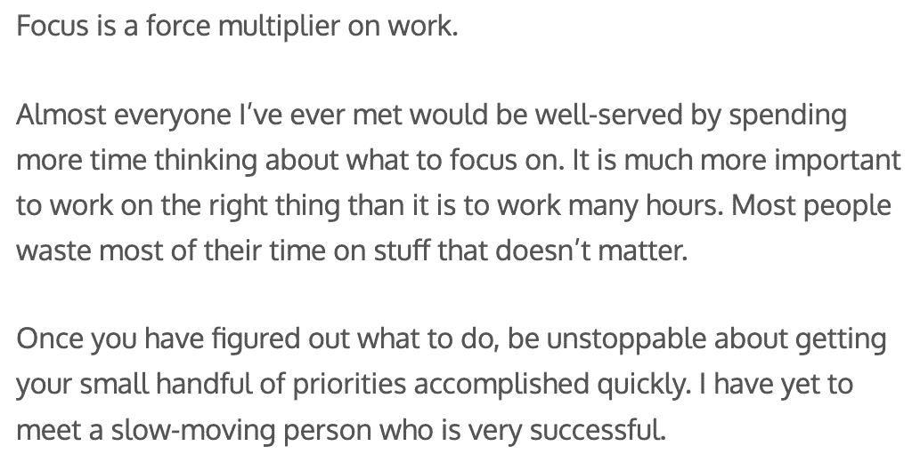
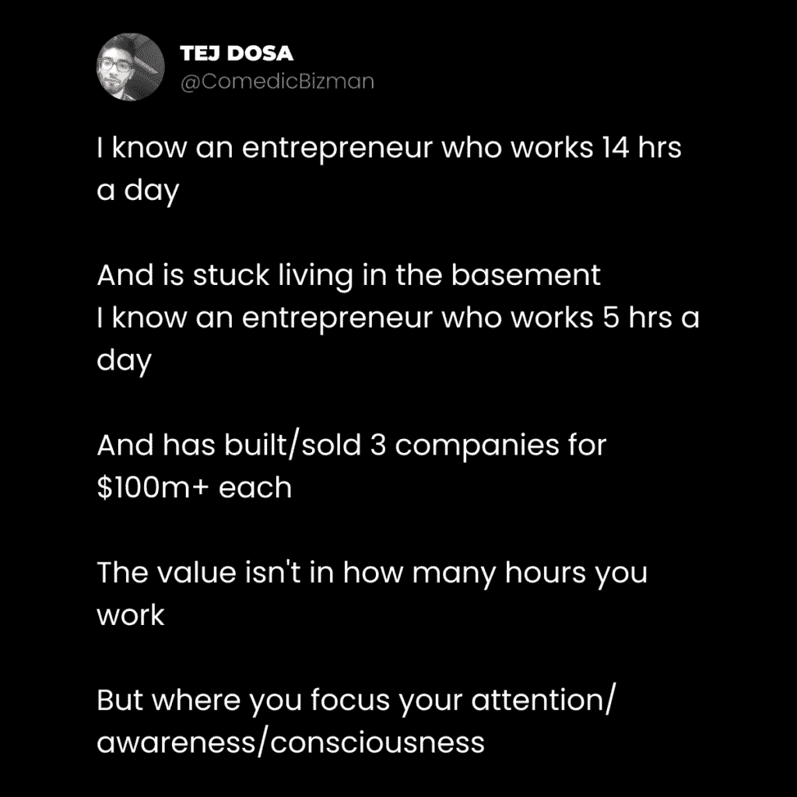
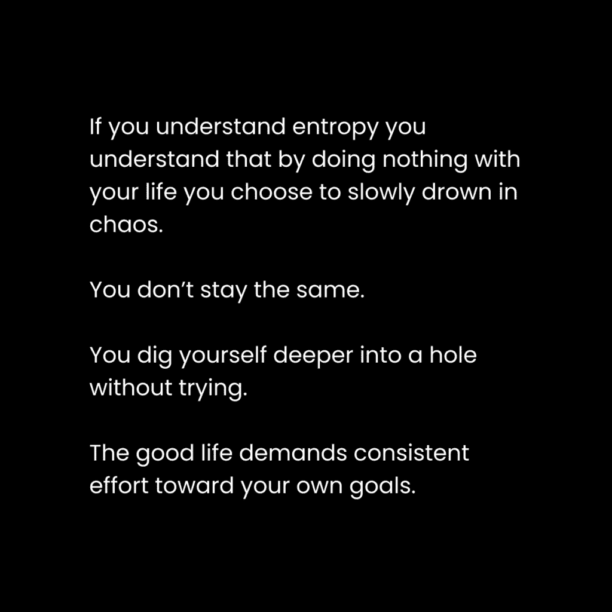

# 如何按需解锁超凡的专注力（4 小时框架）

> 原文：[`thedankoe.com/letters/my-1-million-productivity-framework-the-4-hour-workday/`](https://thedankoe.com/letters/my-1-million-productivity-framework-the-4-hour-workday/)

每天留出 1 小时。

专注于一个有意义的项目。

为你的未来设定一个愿景。

一次只过一天。

你不需要更多动力，你需要更多清晰。

你不需要更多时间，你需要更多专注。

这封信将教会你如何命令式地解锁超凡的专注力。

大多数人认为他们需要像百万富翁一样工作才能实现他们的目标。

但大多数人并不理解大多数百万富翁是如何工作的。

两个例子：

第一种，来自 OpenAI 的萨姆·奥特曼。

第二种，特杰·多萨。一个低调的文案作家，擅长写优秀的 X 内容：

第三，我自己。

所以，不，你不需要比你现在拥有的更多的时间。

*每个人都是从某个地方开始的。人们不会从假装的百万富翁的例行公事开始。他们从他们拥有的开始*。

除了构建新项目，*我很少每天工作超过 4 小时*。

尤其是在我开始的时候，还有其他责任。

我每天有 1-2 小时，休息日会更多一些。

那些工作更多企业家是做出了这个选择，通常是在他们自己的心理代价上。

生产力就像健身，你不会每天训练 8 小时而不吃饭或睡觉，还期望有所进步。

有两种类型的工作：

1.  **构建** – 当你在构建新事物的基础时。比如产品、服务或品牌。**这需要大量的前期工作**。

1.  **维护** – 当你用高效的生产力系统为你的基础加油时。比如写内容、营销自己、建立受众或履行你的产品或服务。**这取决于你的技能水平或*选择*的工作，每天需要 1-4 小时**。

试图改变生活或辞职的人常常因为需要投入大量时间去*构建*而感到沮丧。

他们不能退后一步，意识到一旦建成，你的工作会急剧减少。

专注会累积。

你会随着时间的推移在所做的事情上变得更好。

就像学习走路一样，一开始很难。从你现在所在的地方走到你想去的地方需要更多的时间。

但当你尝试、失败，并让你的自我纠正的大脑重新铺设新的神经通路时，你可以走得尽可能快……或者只是冲刺。

如果你想了解我关于专注生活的完整哲学，请读我的书《专注的艺术》（[The Art Of Focus](https://theartoffocusbook.com)）。

专注的工作只是改变你生活的一部分。

## 你的大脑是一台超级计算机，正在运行生命游戏。

你的大脑是一台超级计算机。

你的注意力就像是 RAM。

思想、遗憾和任务是减缓你表现力的程序。

写作、正念和专注是你可以随时访问的重启方式。

RAM —— 或“随机访问内存”——是计算机最重要的部分之一，它决定了性能。

当你使用不同的程序、打开的浏览器标签以及运行中的性能要求时，你使用的 RAM 越多，你的性能就会越慢。

这与你的专注力，你意识中的注意力所持有的东西没有不同。

人类每秒可以处理 50 比特的信息。这加起来就是你一生中 1250 亿比特的信息。

大多数人同时运行多个高需求程序，消耗着他们有限的创造性能量。

+   对过去错误行为的悔恨

+   对未来压力事件的思考

+   饥饿和娱乐的欲望，以逃避这些想法

+   内心的呼声，想要打破他们习惯的生活方式

+   一份需要完成的混合优先级任务列表

+   他们本应完成但忘记的任务的开放循环

列表就这样一直继续下去。

现代心灵默认会将注意力分散到无限的方向。

我们生活在压力和接近疾病的状态中。我们不是生活在当下的单一关注和无忧无虑的心态中，而是相反。生活在由分散的注意力创造的虚假现实中。

当我们意识中包含太多的过去或未来时，就会产生混乱。心灵趋向无序。如果我们不加以控制，我们就会失去对生活的控制感，这会导致快乐。这是通过有控制的意识实现的。

## 心理熵：分心的危险

*熵是宇宙的最高法则。*

如果你不通过投入能量去解决问题来维持系统的秩序，那么这个系统就会陷入混乱。

如果你不对你的书架进行维护，书籍最终会散落在你的房子里、你的朋友家里，并引发小规模的混乱。

如果你不对整理房间的系统投入努力，它就会慢慢地变得越来越脏，直到你生活在令人厌恶的污垢巢穴中。

这就是大多数人的心理状态。

*一个令人厌恶的污垢巢穴。*

心理熵是心理（或心灵）自然趋向混乱和无序的过程。

你不 productive，因为你没有清晰度。

你不 productive，因为你专注于一个分心的事物，不纠正自己，慢慢地被你心中的混乱所淹没。

分心是你生产力系统中必须解决的问题，如果你想解锁激光般的专注力。

有两种方法可以识别分心并纠正自己：

**无聊和焦虑。**

如果你正在完成的任务的挑战性低于你的技能水平，你会感到无聊。

如果你正在完成的任务的挑战性高于你的技能水平，你会感到焦虑。

**无聊**源于自我中心。

你的注意力被打断，一个新的欲望出现在你的脑海中，相关的想法开始占据你的注意力。

如果你厌倦了这项任务，你会开始想些更好的事情可以做。

**焦虑**源于自我意识。

你的注意力转向内部，消极的思想涌入你的脑海，关于你不够好的想法。

如果你照镜子看到一颗痘痘，那将是你一整天都在想的事情。它会影响你生活的其他方面。

你的心理超级计算机的 RAM 将被流氓程序消耗，直到你的整体表现受到影响。

由无聊或焦虑引起的混乱只能通过清晰来解决。

你必须重新集中你的注意力，不仅关注眼前的任务，还要关注你生活的整体理想结果。

当你拥有与任务挑战相匹配的技能和知识时，生活就变成了你喜欢的游戏任务。

## 四小时工作制——创建你的生产力系统

人类在故事中找到意义。

人类喜欢玩游戏。

为什么？

因为它们提供了一个清晰的目标层次结构，我们的心灵可以将其作为不可分散的框架来接受。

他们遵循宇宙的“好奇 > 强度 > 一致性”循环。

首先，你会感到迷茫。然后，你会感到好奇。然后，你会着迷。然后，它就成为了你生活中一个不需要额外努力就持续存在的部分。

大多数人会迷失方向，专注于干扰，从未努力去实现一个目标（即使他们还没有看到其中的意义），从而无法扭转他们自己挖的坑。

理解到没有什么完美无缺。

就像故事一样，你会经历低谷，但正是这些低谷让高峰存在。成功没有失败是不存在的。

就像一款视频游戏，你需要通过完成一系列任务来从新手升级到高级。这需要时间。

如果你想在工作中获得最大的乐趣和专注，这些指南将帮助你为你的生产力系统创建一个目标层次结构。

你坚持的时间越长，它就越有效。

### 身份——解决生产力问题

从我能记事起，我总是有每天工作 4 小时的目标。

朝九晚五的工作是我存在的噩梦。

+   我观察了社会，并意识到我不想要的生活。

+   我观察了成功的人，并意识到我想要的生活。

随着时间的推移，这个视角塑造了我的身份。

我对那个欲望产生了依恋。

大多数人告诉你欲望是坏的，但在我眼里，只有当欲望本身是坏的时候，它才是坏的。

你的目标是痛苦的轴心，你可以选择为了什么而痛苦。

视角是一切。

它让你能够识别问题和机会，当这些问题得到解决时，将有助于实现这一视角的目标。

这是到达今天这个地步的自动决定。

任何威胁到我 4 小时工作日的东西都被记录为问题。

我能够发现像社交媒体、数字产品和受众建设这样的机会来解决这些问题。

大多数人的身份和观点是由社会塑造的，以社会的目标为目标，所以他们从未识别和解决导致异常结果的问题。

### 项目 – 构建你的潜力

你的身份是由你对未来的愿景塑造的。

你的愿景是你生命中追求的全面目标。它在你的等级制度中处于最高位置。一切都在其之下。

现在，你需要一个项目，将指针推向那个未来。

你需要一些东西来*构建*，这样你就能接触到你必须解决的问题。

你需要清晰的工作目标，以便你能集中注意力。

如果你阅读了[最后一封信](https://thedankoe.com/letters/i-discovered-a-way-to-learn-10x-faster-reality-metabolism-universal-thinking/)，你就会明白构建项目是学习新知识和技能的最佳方式。

1.  **创建大纲** – 将你*知道*的应该包含在项目中的所有内容都脑图出来。随着你构建，你将添加到这个大纲中。

1.  **创建里程碑** – 将项目分解成你可以在 1-4 小时的工作会议中实现的可管理目标，具体取决于你当前的责任。

你的项目应该是什么？

我不能告诉你。

但它可能应该是一个企业，因为那是你目的的载体。它是打破机器人生活的美好生活的催化剂。创业是现代生存，你的心理被编程去狩猎。你不是注定要在格子间里当猴子。

与此同时，你的健康和人际关系是重要的项目，可以增强你的商业成果。

### 截止日期 – 拖延者的优势

你之所以不高效，是因为你没有公开。

在社交媒体上建立互联网业务的一个另一点。挑战和截止日期的流畅状态要求已经内置。

当我为产品设定发布日期并接受预订单时，一旦第一个人付款，我必须在截止日期前构建产品。

无论它有多好或多坏。

我可以在事情发生后改进它，因为我已经做了些事情，让我的生活有了意义。

另一件事：

拖延并不是坏事。这是人的本性。

大多数成功的创业者都很懒惰。

他们等到最后一分钟才完成工作。

但在最后一分钟，他们进入了他们一生中最愉快的季节。他们的思维变成了磁铁，充满了想法。他们最好的工作发生在这些着迷和强烈的时期。

他们别无选择，他们的生存受到威胁。

### 时间块与休息 – 管理你的专注力

> 专注力是一块肌肉，成功是为那些训练它的人保留的。 – 专注的艺术

身份、项目和截止日期缩小了你的注意力。

时间块更进一步，使进入流畅状态变得容易。

设置一个 45-90 分钟的计时器。

以强烈的专注力工作。

然后，休息一下。

去散步。吃饭。看看 YouTube。玩个视频游戏。我不在乎你做什么。

你的注意力是有限的。你需要在你的一组之间休息。

个人来说，我[在两个 60 分钟的时间块里写作](https://2hourwriter.com)。这就是构建我整个业务的方式。

### 利用——做正确的事情

我要为你节省很多痛苦：

选择一个允许 4 小时工作日的工作。

开始一个[单人企业](https://thedankoe.com/letters/the-one-person-business-model-how-to-monetize-yourself/)。成为一个[价值创造者](https://university.kortex.co)。利用互联网做你热爱的事情。

学习实现这一点的技能。

进化是解决逆转熵的问题的过程。

劳动工作以及漫长的工作日是一个巨大的问题。人们都讨厌它。因此，社交媒体、互联网和人工智能应运而生。

人工智能将解决过度工作的问题。可能在本生（尤其是如果我们解决了衰老问题）。

现在，你一天的工作应该包括 3-9 个推动项目发展的关键任务。

有些人能处理更多，有些人则较少。我在[FOCI 计划者](https://thedankoe.store/products/the-foci-planner)中帮助你构建这一点。

### 日常——变得高效

你有一个日常。

即使你的日常是“没有日常”。

我们在[改变我生活的日常](https://thedankoe.com/letters/the-daily-routine-that-changed-my-life-4-focus-habits/)中讨论了这一点。

日常是你如何训练你的大脑在新系统上运行的方式。

如果你想要巩固一个新的身份，你必须开始、完善并坚持一个日常。

在第一个月，构建你的项目会感觉不舒服。

你应该感到不知所措。这意味着你的思想正在扩展到一个新的身份。

慢慢地，然后突然，一切都会顺畅地流动。

你开始取得指数级的进步。

你从强度过渡到一致性，并让结果累积。

### 休息——伟大的秘密

> *“聪明人可能工作得更聪明，而不是更努力，”他们说，但创造者根本不工作。”——亚历克斯·苏桑-金·潘*

我一直对西方的工作文化有一种厌恶。

+   80 小时的工作周。

+   高压环境。

+   很少有时间休息和恢复。

这对我来说从来都不“正确”。

为什么我想浪费我整个一天，知道我的工作质量在 2-3 小时内会受到影响？

这已经是一个讨论了很长时间的话题。我相信它已经开始塑造创作者经济和远程工作。

古罗马人、古希腊人、史蒂夫·乔布斯、查尔斯·达尔文以及无数有远见、策略家和创新者都将他们的成功归因于出奇低的“工作时间”。

来自多个领域的作家，如海明威和塔伦蒂诺，他们的大部分时间都在游泳池边闲逛，和女孩们闲聊，做除了他们认为的“工作”之外的所有事情。

工作 1-4 小时。

然后，停下来。

这可以说是你一天中最困难的部分。

在我的工作时段结束后，我去健身房作为一种“过渡”到休息的方式。

这使得默认模式网络开始工作。我的潜意识开始咀嚼与工作相关的问题。

当我回到早晨专注的工作时，我拥有了休息和创造所需的资源，使这 4 个小时比那些让他们的精神肌肉疲惫不堪的时间更有力量。

我希望你们喜欢这封信，我的朋友们。

丹
