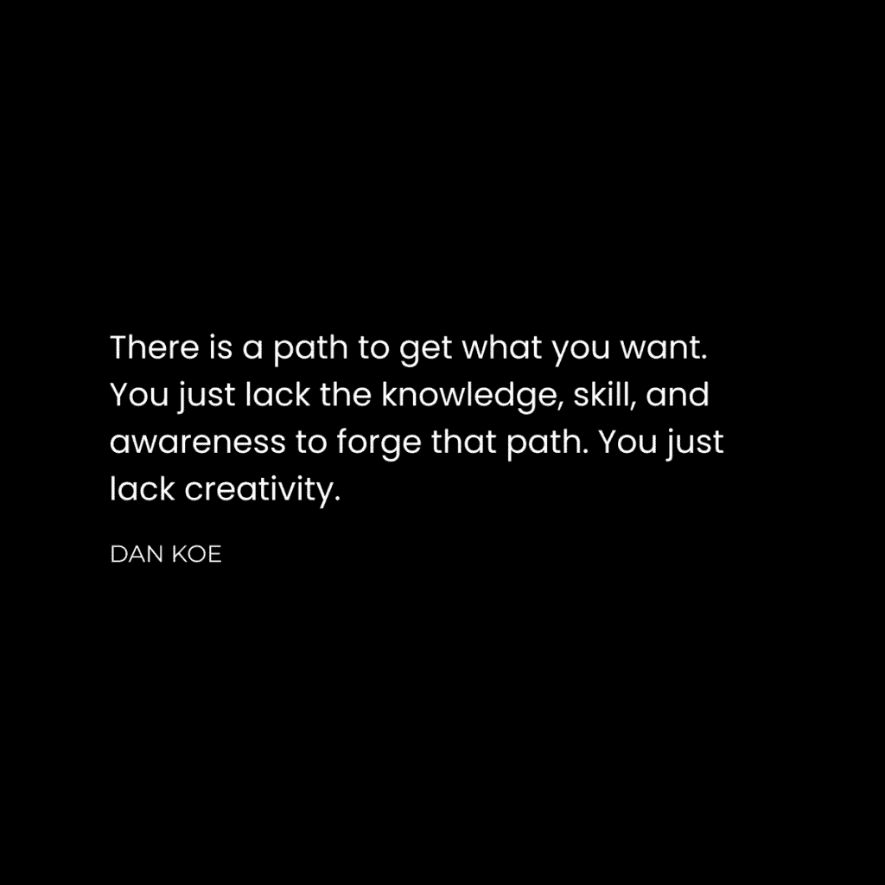
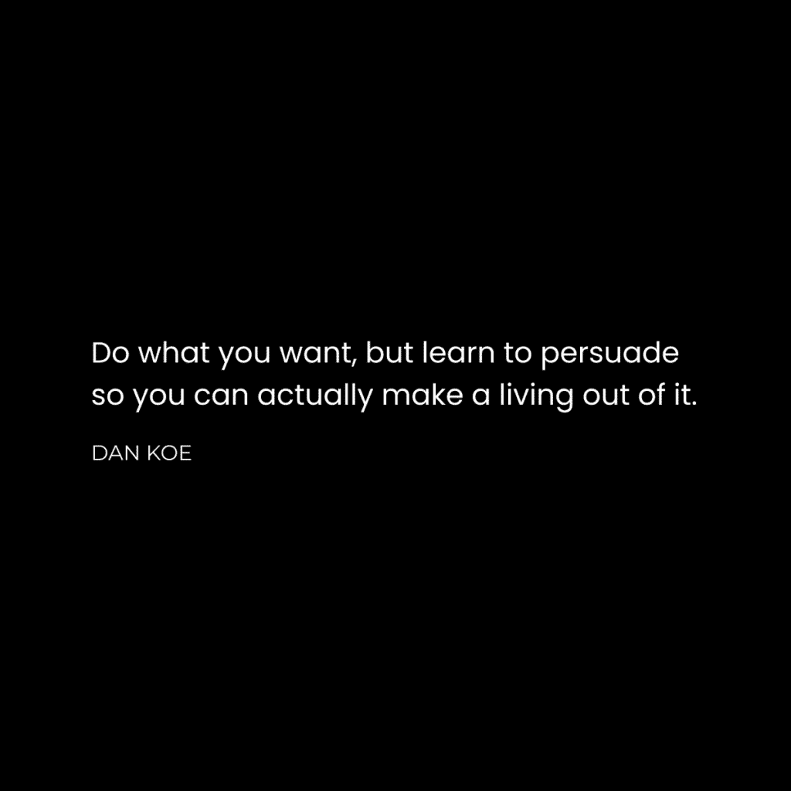

# 努力工作的错觉（以及为什么它不会让你致富）

> 原文：[`thedankoe.com/letters/the-7-traits-of-the-irreplaceable-how-to-secure-your-future/`](https://thedankoe.com/letters/the-7-traits-of-the-irreplaceable-how-to-secure-your-future/)

你可以努力工作任何事情，但这并不意味着这对人类进步有用。

这是努力工作的错觉。

你可以投入 4 年的工作来获得学位。

你可以投入 10 年的工作来攀登企业阶梯。

而且你得到的报酬远远低于你想要的。

因此，与其让他们自己掌握未来，你抱怨和抱怨。

“我应该得到更多的报酬！”

“我努力工作了 14 年，这就是我得到的回报？”

“我几乎没有时间陪伴家人。我没有足够的钱去度假。我在隧道尽头的黑暗中辛勤工作。”

世界上所有的抱怨者都缺少一个关键的拼图：

劳动价值论是说你应该得到你工作的报酬。

感觉自己像跳过圈圈一样。

感觉你应得某物。

但现实并非如此。

金钱是价值的单位。价值是衡量人们对你所做的事情关心程度的一种方式。

你的价值 = 你解决的问题的规模，你创造的解决方案的结果，以及你让人们关心你的创作的能力。

如果你对自己的收入不满意，可能到了残酷地诚实地审视你对世界所做贡献的时候了。

根据一个人所做的工作量来支付报酬是没有意义的。根据一个人解决问题的水平来支付报酬是有意义的。

为什么？

我可以努力工作 1 年写作成为作家，但 1 年不足以证明 10 万美元的报酬。

你能赚多少钱取决于其他人*关心*你在那一年里所做的事情。也就是说，你的创作如何帮助他们，以至于他们使用它来解决问题，改变他们的生活，并为人类进步带来进步。

抱怨得不到足够的报酬是不会让你得到报酬的。事实上，这可能会让你被解雇或忽视。或者被你接触到的任何人所憎恨，因为他们会想，“好吧……你打算*做什么*来解决它？”

唯一的选择是掌握自己的命运。

## 不可替代的个体

<picture fetchpriority="high" decoding="async" class="wp-image-1890"></picture>

你担心 20 年后什么会有价值，因为你依赖于除了自己以外的每个人来获得成功。

成功的人不担心，因为他们理解是什么让任何人成功。

最高收入者是世界的思想家、策略家和创新者。

最高收入者不是那些努力工作或聪明的人，而是那些利用了他人的人。

如果你想要确保你的未来，你需要那些让你在任何环境中都能成功的特质。

这些特质构成了“不可替代的个人”：

+   **自我实验** – 通过试错解决复杂问题并得出自己的结论。

+   **自我反思** – 理解你内心动机，以便理解他人的动机。

+   **自我发展** – 培养有助于他人的有价值的心态和技能集。

+   **自力更生** – 通过对生活结果负责来获得你想要的东西。

+   **自我教育** – 获取、理解并利用未知主题信息的能力。

+   **自给自足** – 维持理想生活方式并获取实现这一目标所需资源的能力。

+   **自我掌控** – 对导航现实的坚定不移的奉献。

当你掌握了自己，你就掌握了世界。

如果你想要变得不可替代，你必须变得有价值。

如果你想要获得高薪，你必须说服人们看到这种价值。

随着世界的变化，价值的感知也在变化。

随着 AI 的出现，我们可能不知道价值未来的样子，但我们知道价值将会存在。

人类可能不会用美元支付，但可能会用声望、地位和其他任何能够推动人类经济的东西支付。

美元可能不会持久，但从你的创造中获利的能力将会。

## 如何保障你的未来

如果没有人知道或关心你的技能集，那么它就没有价值。

这里有两个问题。

如果没有人知道你创造了什么，那么它就没有价值。

如果没有人关心你的创造，那么它就没有价值。

在商业中，你需要一个产品和一群足够关心这个产品以至于愿意购买它的人群。

你可以在互联网上把你的产品展示给人们，但如果他们看不到它如何改善他们的生活，他们就不会关心它。

你可以拥有你认为最有价值的商品，但如果你不将它展示给人们，他们就没有机会去关心它。

在人际关系中，你可以将自己展示给一群潜在伴侣，但如果他们看不到你如何融入他们的生活，他们就不会关心你。

你可以相信自己是最发达的个人，但如果整天待在家里，潜在伴侣就没有机会关心你。

### 1) 成为企业家

只有当你意识到创业是唯一实现这一目标的途径时，你才能完全控制你的时间和收入。

在工作中，你不对产品、分配给你的任务或客户获取过程负责。

换句话说，你的雇主负责支付账单的一切。因此，他们负责你生活的方方面面。

有些人的要求比其他人宽松，临时工作没有错，但我是在写给那些最终想要自由的人。

### 2) 建立分销渠道

创业中有一个大陷阱。

我陷入了 7 次。

这也是我为什么在创业初期失败了 7 次的原因。

我对正在学习的技能着迷。我只想整天构建项目。我喜欢成为商业的建筑师。

网站、着陆页、标志、作品集，但我很少真正尝试吸引客户。你知道……那些付钱给你的人。

当我开始学习如何吸引客户时，是通过手动外联或付费广告。想想冷邮件、冷短信和我不具备资金运行的 Facebook 广告。

时代不同了。

您可以通过成为一个单人媒体公司来建立潜在买家的观众。

每个人都在社交媒体上。那就是现在的注意力所在。您的客户不会看电视。您的客户不会听收音机。您的客户不会看报纸。

您的工作是将您的业务放在现在的注意力所在之处。这可能在将来改变，但不会很快。而且当它改变时，您必须能够适应。

通过内容在教育、启发和娱乐中建立观众是当今创业的最佳方式。

您可以在公众面前证明您的价值，吸引不需要付费的追随者，并将产品展示在他们面前，这样您就可以得到报酬来做您想做的事情。

研究那些正在做您想做的事情的人。我保证他们在社交媒体上发帖，为自己建立名声，并销售某些东西（因为他们不再为他人销售东西了）。

### 3) 学习写作

不可替代的个人的最大技能是写作。

这一举三得：

1.  它教会您从读者反馈中阐述您的价值。

1.  这是媒体的基础（如何通过让您的写作被分享来建立分发）。

1.  这是构建任何项目的早晨习惯。

帖子、线程、电子邮件、大纲、模块、广告、直接消息、书籍、视频脚本以及其余的都始于写作。

另一个好处是，写作是一种元技能。

通过元技能，我的意思是您可以从无经验开始，并在其下堆叠技能。

您不需要展示您的身体。您不需要拥有英语学位。您每天用文本和消息写作。

通过演讲或视频，您需要编辑技能和自信，不要在您的词句上绊倒。您需要即兴思考。

写作教会您在家中（或咖啡馆）舒适地清晰地思考。

这也是为什么我建议您从 X/Twitter 开始您的旅程。

一旦您掌握了增长分发（您的观众）的技巧，您就开始创建一个通讯来加倍您的效果。然后，您构建一个书面产品并从中获利。

顺便说一句，我们在[Kortex 大学](https://university.kortex.co)内引导您通过这个过程，随着您通过综合器、权威和构建者等级的进展。

### 4) 学习销售

<picture decoding="async" class="wp-image-1891"></picture>

销售 = 生存。

如果您不销售自己的产品，您将被迫销售他人的产品。

你可以整天抱怨“现在每个人都在卖东西”，但你错过了这一点背后的意思。

是的，每个人都在卖东西，因为他们必须这样做，如果他们（1）想要生存（2）为人类做出贡献（3）并获得回报。

另一个观点：

人们只投资于他们关心的事情。

销售和说服是相辅相成的。

如果你没有学会销售，当你把你的产品放在一群蝉鸣的人群面前时，你可能会感到失望。

销售是你说服人们看到你所提供的东西的价值的方式。说服是激励人们为他们的生活做出良好决定。

销售过程本身并不低俗。

它是引导人们通过一个故事，因为这就是人类如何联系和确定价值的方式。

1.  你让他们意识到一个问题。

1.  你让他们意识到如果这个问题得不到解决，它将如何影响他们的生活。

1.  你引入一个解决方案（你的产品）来解决这个问题。

1.  你通过见证或个人经验向他们展示改变是可能的。

1.  给他们清晰的行动方向，继续新的道路。

这就是你怎么写一个着陆页，进行“销售”电话，直接消息人们，或者让人们像我在这里一样阅读你的时事通讯。

如果你不喜欢销售，你可能没有意识到你每天都在向人们推销你的信仰、思想和世界观。

从盲目操纵人们转变为有意识地帮助人们。

### 5) 学习构建

> 学习销售。学习构建。如果你两者都能做到，你将无所不能。 – 纳瓦尔

每天留出一小时来构建一个实现你理想未来的项目。

那是唯一避免为他人构建项目的办法。

要构建，你需要技术知识。

你必须要么学会编码，要么学会使用你拥有的技术。

曾经需要 10 个人来做的事情现在只需要 1 个人。

曾经需要 10 小时的东西现在只需要 1 小时。

曾经需要 10 美元的东西现在只需要 1 美元。

你生活在一个美好的时代，人类可以利用技术来构建他们想要的东西。

网站构建者、电子邮件营销软件、人工智能、社交媒体、课程构建者等等。

你的工作是通过对互联网的学习和构建来创造和分配价值。

如果你不知道要构建什么，从以下开始：

1.  你已经使用的东西，但让它变得更好

1.  你在生活中解决过的问题

1.  构建你想要看到的世界

我们在上周的信中讨论了这一点。[上周的信](https://thedankoe.com/letters/the-future-proof-skill-stack-learn-in-this-order/)

把你的逆境变成一个好故事。把你的故事变成一个品牌。把你的旅程变成一个产品。

享受你劳动的果实和剩余的一天。

丹
