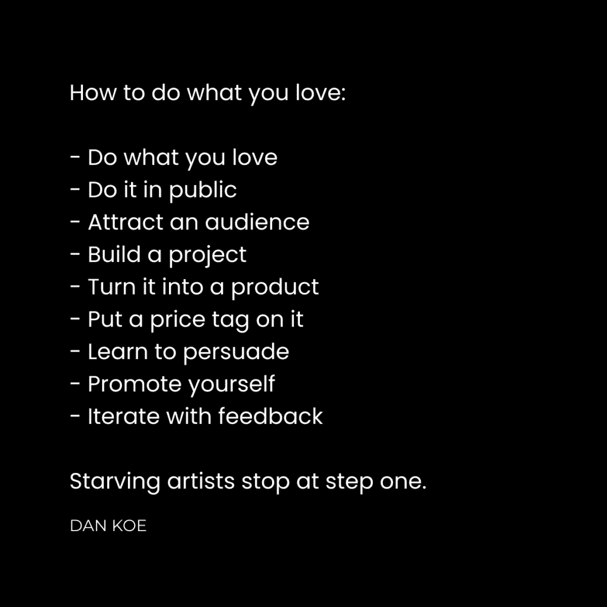

# 如果你聪明，你头脑中有 10 万美元被困着

> 原文：[`thedankoe.com/letters/if-you-are-smart-you-have-100000-trapped-in-your-head/`](https://thedankoe.com/letters/if-you-are-smart-you-have-100000-trapped-in-your-head/)

控制你收入，因此控制你生活的唯一方法就是创造一个产品。

从你出生的那天起，你就被教导去上学，找工作，存钱直到你可以退休，最终做你想做的事情。

你被训练去服从权威。学习你不在乎的事情，这样你就可以为那些你不在乎的人工作，最终过上你关心的生活……通过对社会进行简单的观察，那一天很可能永远不会到来。

你没有意识到，你被编程成社会中的一行代码，为别人销售产品。

你的一生都在为别人的梦想而奋斗，而不是自己的。

好消息是，时代正在改变。

工作的去中心化已经开始。

机会比以往任何时候都多。

远程工作是常态。

自 2020 年以来，自由职业者的比例从工作人口的 36%增长到 46.6%。

创作者经济预计到 2028 年将从 2500 亿美元增长到 4800 亿美元。

多亏了互联网，力量正在回归个人。

我很早就意识到了这一点。

当我上高中时，YouTube 正在兴起。

我注意到，大多数人都在围绕他们的技能和热情创造内容。他们教授他们在旅程中学到的知识，他们的个性使他们变得独特。

这使我尽我所能去做同样的事情。

我开始创建 YouTube 频道，并尝试了如直销、自由职业和代理工作等商业模式。

我在学会编码并在一家网页设计公司找到工作后辍学了。在那里学到的知识，我开始自己的事业。

但有一个问题。我想要自由。我很快意识到客户工作与 9-5 的工作非常相似。

我在做一些我不在乎的项目，为我不在乎的人工作。

这使我转向了社交媒体和 Twitter。

在那时和现在之间，我已经摆脱了客户工作，平均每天工作 2-4 小时，去年通过个人品牌创造了 410 万美元的收入，利润率极高。

## 数字杠杆

<picture fetchpriority="high" decoding="async" class="wp-image-1899"></picture>

社交媒体为任何人去做他们热爱的事情创造了条件。

不相信这一点的人只有纯粹的消费者。那些 doom scroll，在生活中制造更多问题的人，以及那些囤积信息但从不采取行动的人。

每个人都是创作者和消费者。

你给朋友发短信。你进行对话。你有想法。你每天都在创造。

你购买产品。你消费内容（就像我们从报纸和广播以来所做的那样）。你每天都在消费。

你必须消费以创造，但如果你不保持平衡，你的大脑就会变成一个充满压力和焦虑的混乱，这会让你看不到你的潜力。

社交媒体现在是注意力集中的地方。这可能会改变，但原则仍然适用：

如果你想要掌控你的生活，你必须创造和分发一个有价值的产品，让注意力集中在这里。你必须比从人类那里获取的更多贡献。现在，那是在社交媒体上，认为你不应该在这个新游戏中竞争是愚蠢的。

美妙的是：

+   你不需要启动资金

+   你不需要很多经验

+   你不需要很多关注者

+   你不需要担心饱和

+   你不必对利润率、运营成本或供应链感到神经质。

技术已经发展到你可以以 90%以上的利润率和每天 2-4 小时的工作时间经营一个单人业务。

这就是导致我建立[数字经济学](https://digitaleconomics.school)的原因。

## 建立分销

你需要一个观众。

现在，它是在社交媒体上。

大多数人把社交媒体看作是他们手机上的一个愚蠢的应用程序，然而他们的大部分生活都在上面度过。

你还没有意识到这实际上是经济、商业、学习和生活中一个巨大的部分。

我们祖先在他们部落中扮演的角色时，拥有的小众观众。

随着世界通过印刷机、广播和电视的发展，我们获取观众的方式发生了巨大变化。

重点是这样的：

你需要一群人了解你做什么以及它如何帮助他们。这就是你工作的公司所做的事情。这是成为你生活 CEO 的唯一方式。

你不需要挨家挨户地敲门。你不需要发送数千封冷邮件。但你仍然需要为你的作品进行分销。

现在，你可以在像 X 这样的应用程序上发布你的写作，让一个更大的账户转发你的作品，并在一天内获得数百个关注者。

大多数人认为他们无法建立观众，因为他们没有花时间去学习写作和说服的主权技能。

他们认为自己做不到：

+   通过模仿有效的方法来写一篇有影响力的帖子（我们所有人都是从模仿者开始的，你还能怎么学习？）

+   给一个大型账户发一条私信，提供一种价值（知识或金钱）来建立联系。

+   说服他们用他们想要的东西（社交媒体上的转发）来交换你想要的价值。

+   或者，写一个关于某人的帖子，希望他们转发，因为这增加了他们的社会证据（[前几天的一个例子](https://x.com/hosun_chung/status/1772277469648720274)，他让别人转发了这个帖子，当我最后一次检查时，这让他接近 700 个关注者。）

+   让成千上万的人看到你的帖子，其中许多人会关注你。

+   继续这个过程，直到你拥有一个渴望付费的观众。

+   推出一个产品并获得自由。

随着你练习技能，看到结果所需的时间会减少。

起初可能会很困难，就像所有事情一样，但你的投入时间将减少到每天 1-2 小时的[写作和自我推广。](https://2hourwriter.com)

大多数人陷入了奴隶的教育，学习一项特定的职业技能，为余生执行一系列特定的任务。

他们会依赖于那种技能，拒绝学习任何能提高他们潜力的东西。

不要成为那样的人或女孩。

如果你想要掌控自己的未来，你必须通过写作和说服力来建立一个受众——这些技能自从我们开始在岩石上刻符号的那一天起，就是自由职业者的工具箱中的东西。

## 打造一个产品

你可以成为一名自由职业者。

你可以成为一名教练。

你可以开始一个代理机构。

但你仍然无法实现你开始创业时设定的那个一个大目标：

完全掌控你的时间。

这就是服务型企业的陷阱。它们可以作为起点很有用，但我最近改变了我的看法。

在过去，我建议人们从服务型企业开始，随着受众的建立，逐步过渡到产品。

许多人通过这种方法取得了成功，但更多的人失败了。

他们采纳了错误的想法，认为你可以在几小时内学习一项技能，并通过欺骗客户交付糟糕的结果来替代你的收入。

如果你有正确的头脑，无论如何，开始一个服务型企业，赚一些钱。

如果你丝毫没有发展自己，你最好玩长期的游戏。

+   提升自己

+   在公共场合记录你的旅程

+   将你的改进变成一个产品

+   帮助他人实现你设定的目标

对于想要完全掌控自己时间的人来说，产品是最高杠杆的游戏。产品在你睡觉时自我满足并销售。

这就是为什么我们从建立受众开始。

+   你保持长期的心态

+   你是出于正确的理由进入的

+   你为自己设定了几十年的成功

+   你通过产品帮助更多的人取得成果

+   你的内容感觉不再受限和狭隘

+   你写内容来发现你的受众想要什么（基于参与度）

+   你可以用这个作为火力，让你的产品取得成功

你有 10 万美元的想法被困在脑海中。

你如何提取它？

首先，了解人们为什么购买产品。

他们想要看到一种转变。他们想要看到他们在生活中某个领域的轻微或显著改善。

他们希望通过技能获取、生产力和自我提升来提高他们的市场价值。

他们想要赚更多的钱，节省时间，提高生活质量。

因此，我们从永恒的市场开始。健康、财富、关系和幸福。

这就是我们对任何我们销售的产品进行定位的方式。

现在，遵循以下步骤：

+   将自己变成你的客户形象

+   列出你的兴趣

+   列出你的目标

+   列出你的问题

+   列出确切如何克服问题并实现目标

现在你有一个品牌信息，几十个内容想法，以及一个有利可图的产品起点。

对于潜在的想法，这些可以是与营养、训练、心理健康、灵性、技能获取、生产力、心理学或任何你在生活中可以学习和受益的东西相关。

如果你生活中还没有取得太多成就，那就是第一步。

是的，你必须离开你妈妈的地下室，培养一些形式的价值。令人震惊。

如果你已经在生活中实现了一个目标，你就已经成功了。把实现那个目标所需的一切打包成数字产品。

一门课程、辅导、小组、研讨会、模板、清单、系统、教程、项目、跟踪器或任何你看到其他品牌或创作者销售的东西。

你可以销售实体产品或服务，但在我看来，每个人的最终目标应该是销售一个高利润的数字产品，这种产品需要最少的维护，在你睡觉时也能销售。毕竟，我们都想要自由，但你需要有一个观众来实现这一点。

如果它已经上市了，那就好。不要假设每个人都了解它。用你能找到的最独特的品牌来销售它——你的品牌——并且第一个向人们介绍这个产品的重要性。它会卖出去的。

向你的过去、现在和未来的自己写信，以吸引观众。

创建一个你之前使用过但更好的产品。创建一个你想要但不存在的产品。创建一个解决你生活中问题的产品。

通过说明它如何影响你的生活来推广产品。个人经历是你与他人区别开来的东西。没有人可以复制它。

我们在[Kortex 大学](https://university.kortex.co)通过模板、任务和个人指导教授这种进步。

大多数企业失败是因为它们试图解决他们没有经历过的问题。不要成为其中之一。

## 模仿，然后创新。

你是一个跟风者。

你头脑中的每一个想法要么是你观察到的，要么是通过你之外的东西学到的。

你通过自我反思所做出的发现，正是因为这个原因才成为可能的。

认为不应该模仿别人是非常愚蠢的。尤其是如果他们在做的事情有效的话。

模仿是我们生存的方式。

每个人都是模仿者和创新者。

创新者创造并测试新的想法。

模仿者将那些想法付诸实践，并将它们传播到全人类。

显然，你不会只是复制粘贴别人的东西。那样你会成为一个局外人。用你的大脑思考一下长远。

如果你不知道要写什么或创造什么，你必须沉浸在你所爱的人的写作或创作中。

最好是找到很多来源，直到你的大脑被压得快要爆炸。

那就是创造力的本质。紧张释放导致突破。

创建一个你喜欢的写作数据库。

基于有效的方法练习写作，但加入你自己的想法。

购买与你想要创建的类似数字产品。研究你自己的结构和填补差距。

当我创建了一个教授网页设计技能的数字产品时，我了解了很多，所以我概述了该产品。

但是，我不得不购买其他课程，发现我遗漏了哪些部分。只有这样，我才能完成产品并确保它是体面的。

其余的都是来自迭代。

你必须发布一些糟糕的写作和产品。

你必须看起来像个白痴。

你必须得到反馈，以了解你的创作是否有价值。只有这样，你才能改进，否则你不知道如何改进。

写作以建立受众。

推出一个产品以赢得你的自由。

享受你剩余的一天。

丹
