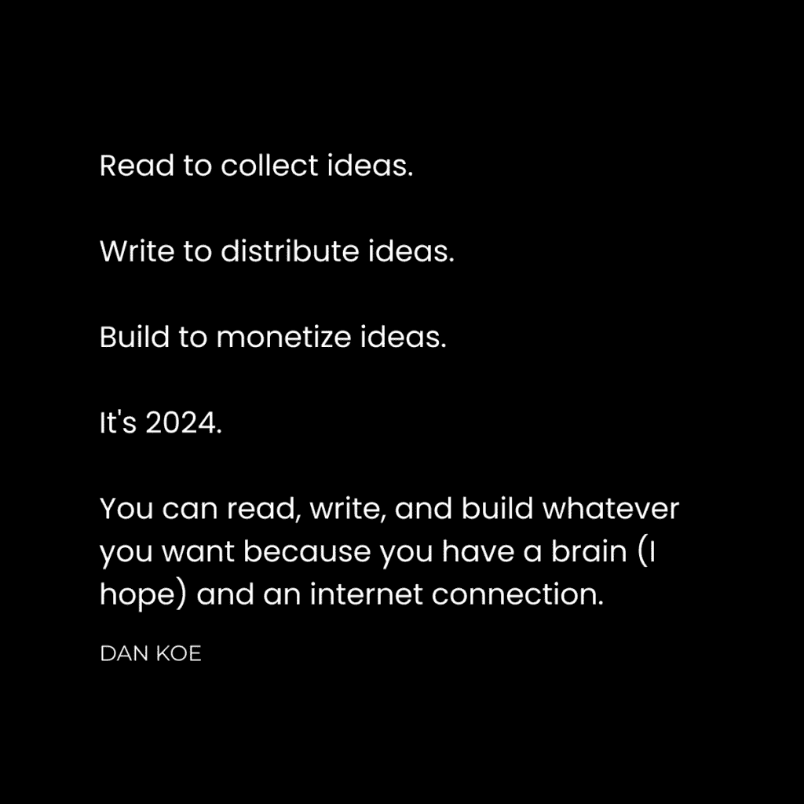

# 我的创业公司如何在 6 个月内（未公开发布）赚取 759,900 美元

> 原文：[`thedankoe.com/letters/how-my-startup-made-759900-in-6-months-without-launching/`](https://thedankoe.com/letters/how-my-startup-made-759900-in-6-months-without-launching/)

上个周末，我访问了在加拿大多伦多的我的开发团队。

在[Kortex](https://kortex.co)我们做事的方式有些不同，我想和你分享我的脆弱之处。

我想在公共场合记录我们构建创业公司的情况，这样你可以从我们的失败和成功中学习（相信我，我们已经有很多失败了）。

我想谈谈我们如何在 6 个月内没有公开发布的情况下赚取了 759,900 美元。

问题在于，大多数人梦想着建立一个庞大的公司，但其中大多数人都在错误地行事。

+   他们认为他们需要创业资金。

+   他们认为他们需要投资者和风险投资资金。

+   他们认为他们需要大量资金投入营销。

+   他们没有考虑如何获取用户，或者最初的想法是否好。

我们采取了完全不同的方法。

我们的方法的好处是任何人都可以做到。

我们的方法的坏处是它需要时间。

当我抵达多伦多时，我想问我们的核心开发者，他们在构建 Kortex 的过程中最大的教训是什么。

我没有预料到他们会给出这样的答案。

我认为你会从他们的言论中受益。

我们将从那里开始，然后，我会告诉你如何提出一个有利可图的创业想法，并无需外部帮助来资助它。

## 不完美，高效率的人，从头开始构建

我会从我的最大教训开始。

我没有意识到软件开发可以有多复杂和昂贵。

它只是一个笔记应用，对吧？

错误。我们对待我们使用的软件太过轻视。我们不会选择便宜的无代码路线，向你们提供糟糕的产品。

我们的烧钱速度接近每周$30,000。

我们已经移除了 3-4 个主要功能，这些功能花费了开发人员数月的时间和精力。

我们添加了一些我们没有计划的功能。

我们已经在进行应用 V2 的设计工作了。

建立这个应用一直是一连串的问题，而且我不会以任何其他方式。

我们不知道我们在做什么，因为不可能预测下一个会冒出什么问题。

**所以，我最大的教训是：**

对做事情不完美感到满意。

是的，我们的成本可以更低（如果我们没有招募顶尖人才）。是的，我们可以推出一个我们并不自豪的 MVP。是的，我们可以做很多事情，但 boy are we gaining valuable life experience that will pay off 10-fold down the road.

我们的心态可以改变，但我们的目标现在并不是获取。我们想要构建我们想要在世界看到的那个应用。一个像它已经对我的生活产生的那样，每天都能让人们受益的应用（真的，我已经上瘾了）。

**第 2 课）成为高效率个体的必要性**

**第 3 课）学会与独行侠团队合作**

**第 4 课）从零开始构建比在一家成熟公司工作需要更多努力**

## 建立观众群体的重要性

大多数人在开始创业时甚至不会想到社交媒体。

他们看不到这是通往成功的最大“捷径”。

我们不是在 21 世纪建立业务。技术已经进步。你不需要投入艰苦的时间进行直接销售、冷门推广和手动寻找潜在客户。

社交媒体是你：

+   通过将内容转化为营销和销售产品的想法来测试（而不需要花费任何钱）。

+   当你推出产品时，建立一个想要购买产品的观众群体（因为大多数初创公司都无法获得用户）。

+   在构建产品之前，通过销售低边际成本的数字产品来获得结果并验证你的创业想法。

+   如果你想要走这条路，招募开发者、团队和投资者。

许多人认为我只是为了写内容而写内容。

这部分是正确的，但我已经写了 40,000 条推文，在其他平台上发布了 3,000 多条，发送了数百份新闻通讯，并在 YouTube 上发布了数百个视频。

正因为如此，我有**数据**。

我确切地知道哪些想法能吸引追随者，吸引注意，引发争议，吸引客户，并促进参与。

我有一个想法数据库，可以用作产品，在我的产品中，在我的销售页面上，以及在我的推广中。我无需进行任何手动市场研究，也无需投入时间来构建产品以测试其是否畅销。

通过在社交媒体上写作和建立观众群体，我可以跳过大多数初创公司和企业必须经历的艰辛。

这里有一些简单的步骤来开始：

### 1) 创建你的主题树

列出你所有感兴趣、有技能和想要讨论的想法清单。

不要担心具体化，担心的是让人产生共鸣。

不要一开始就过于细分领域。从广泛且适用于大多数人开始。

适用的话题示例是你经常在网上看到的内容：生产力、自我提升、健康和健身、社会动态、技能获取、职业建议、商业等。

如果你的主题是“团队和高级管理人员的领导力”，将其转变为“自我提升”或以能够惠及更多人的方式来构建（而不会剥夺吸引你想要的具体受众的潜力）。

你不必指出团队和高级管理人员，他们就能与内容产生共鸣。为他们写作，但要以其他人也能从中受益的方式。

记住，这是社交媒体。它不是针对性的。它是随机的。你必须从广泛开始，并将人们引导到你的专业知识领域。

如果你只有 100 名关注者，你的主题又很细分，那么让你的内容出现在足够多的人面前将很困难。

你需要一个更大的受众，他们能将你的名字传播出去，以接触到你想要的具体人。你的受众是否完全由潜在买家组成并不重要。

我宁愿有 10 万人能将我的名字传播到他们网络中的特定人，也不愿有 1000 个人确切知道我做什么。特别是如果我正在建立一个初创公司，我需要我能得到的所有杠杆、资源和联系。

顺便说一句，如果你想首先获得 Kortex 的访问权限，我们正在举办一个仅限 500 人的写作训练营。

我们教你如何在社交媒体上写作以建立你的业务、工作或职业生涯的受众，你将获得 Kortex 一年的访问权限。

第一期训练营将于 5 月 13 日开始。[在这里查看。](https://bootcamp.kortex.co)

### 2)制造噪音并关注信号

现在，只需开始写作。

谈谈你的兴趣。

谈谈你的观点。

谈谈你的专业知识。

谈谈你的信仰。

教授人们你拥有的技能，看到你所在领域成功的思维方式，以及你所教授的事情的好处。

你写得越多，你就有越多的数据点。

模仿那些有效的方法。

建立一个你希望写过的想法的滑动文件。

研究表现良好的帖子和管理层的结构。

在你写作时，真的让 10-20 篇你最喜欢的帖子在你旁边打开。

不要试图盲目地写你的想法。你需要用可读性、影响力和平台习惯的风格来写作。

所有创作者都谈论类似话题的原因……因为它们有效。这偶尔会改变，你需要顺应市场的需求。

从那里，坚持 3-6 个月。

审查你所有的帖子，看看哪些表现更好。

将这些想法变成你品牌的一部分。更频繁地写关于它们，因为它们会继续做得很好。将它们包含在你的营销、促销和产品创意中。人们想要更多这样的东西。

当你通过内容验证了足够多的想法后，你可以进行下一步。

## 如何为你的初创公司筹集资金

最后，回答你的问题，我们如何在还没有推出应用的情况下，在 6 个月内几乎赚了 80 万美元？

这相对简单，而且这是我几乎在每一封商业通讯中都提到的事情。

我们有一支由 9 名开发人员组成的团队在构建 Kortex 应用，还有 6 名创作者（包括我自己）在构建 Kortex 大学——这是我们教授写作的部门。

我们将 Kortex 的首要任务定为产生现金流，这样我们就不必承担投资者或继续挖自己的钱（我投资了 50 万美元作为初始保障来推动发展）。

我们使用在我们之前验证过的想法构建了一个数字产品。

我们开始构建 Kortex 的社交媒体和电子邮件列表。我们的 X 和 Instagram 账户的粉丝数几乎都接近 10000 人。我们的电子邮件列表也接近 10000 名订阅者。

数字产品在构建和分发上成本非常低。我自己品牌下已经构建了多个，所以我了解如何快速完成。

简而言之，我们构建了一个教授写作的项目，并用社交媒体流量为其提供动力。

但是，我不会建议你在创业公司下首先这样做。我会建议你在自己的品牌下这样做，然后，在建立现金流并拥有构建创业公司的技能之后，你可以在创业公司的品牌下重复同样的过程。

这里是你要采取的步骤：

### 1) 写内容，构建项目，并开展客户工作

你需要现金流。

当你开始构建个人品牌并使用内容测试想法（如上所述）时，你将开始了解你可以帮助人们什么。

将你的专业知识转化为帮助人们完成你所做的事情的项目。

作为一名作家，我帮助人们进行写作。

作为一名健康达人，你可以帮助人们进行健身。

作为一名生产力专家，你可以帮助人们提高生产力。

是的，在你能帮助人们进行商业活动之前，你需要真正擅长某件事。

你的工作是构建一个课程，并通过每周的通话、工作表和任务来一对一地引导人们，以获得结果。

当你没有大量受众时，现在出售产品还不合时宜。你需要向每位客户收取 1000-5000+美元。

我将在未来的信中讨论这个过程。

### 2) 获得结果，扩大受众，并产品化你的服务

随着你的受众增长，你拥有更多的议价能力。

我们在[《作为个人企业家的零到一百万》](https://thedankoe.com/letters/zero-to-1-million-as-a-one-person-business-while-working-2-4-hours-per-day/)中讨论了这种进步。

在这些步骤之间，你的全职工作是改进你的项目，以为你客户获得更好的结果。

与他们紧密合作，研究他们的问题。

结果就是一切。你的结果将导致更多客户和有利可图的创业想法。

此外，由于你已经围绕这个主题建立了一个受众群体，你不必过于担心获取初始用户。你的客户、顾客和读者对你从建立自己的品牌中产生的创业想法已经足够验证。

你的受众中有更多的流量和潜在客户，所以将你项目的一部分转化为一个更多人可以访问的课程是合理的。

你可以通过两种方式来做这件事：

1.  **基于团队的课程** – 你有一个课程大纲、社区和现场通话来帮助引导人们完成项目。你可以为这种结构收取更高的费用，并且每 1-3 个月启动一个团队。

1.  **常规课程** – 这就是你仅仅将课程大纲作为课程出售的地方。好处是你几乎不需要做什么工作。缺点是，你只启动一次，并且收费较低。

在我的品牌下，我已经对我的产品进行了迭代，直到《2 小时作家》成为我的最畅销课程。

我有一群我帮助过的作家和创作者。

仅在《2 小时作家》中就有近 15,000 名学生，使用我的系统构建一个写作应用来帮助他们改善流程是有意义的。

### 3) 构建你的初创公司并重复这个过程

你现在有了：

+   数千条社交媒体帖子，从中提取有效数据。

+   有几十个客户，你亲自帮助他们提高了他们的技能。

+   数百或数千名学生可以从你的初创公司想法中受益。

+   一个高盈利的数字产品业务，有足够的现金流来开始构建你的产品和团队。

你解决了大多数初创公司都面临的问题：

他们可以构建一个不错的产品，但他们无法获得用户。因此，他们无法赚钱。他们也没有自己的现金流生成业务，既验证了他们的初创公司想法，又允许他们为其增长提供动力。

在这一点上，为你的初创公司重复这个过程。

建立社交媒体账户。

开始测试与你的初创公司相关的内容相关的想法。

从客户工作开始构建你的价值层级。

为那些初始客户获得结果，并将产品进一步产品化到一个群体或课程中。

为品牌的发展和教育方面聘请一个团队，这样你就可以比以前更快地完成它。

虽然如此，我们仍然可能失败。Kortex 可能完全无处可去，但我们对此并不介意。所有这些建议都取决于你的技能，而不是运气。

我希望这能帮助你提供一个构建你初创公司的大纲路线图。

当 Kortex 被构建起来时，我会更多地谈论我们是如何构建 Kortex 的。

感谢您阅读，祝您周末愉快。

丹
