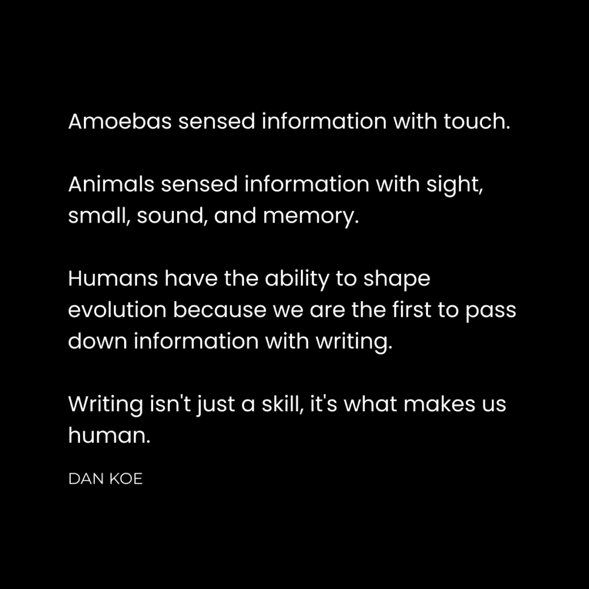

# 在社交媒体上成长的最佳方式（从零粉丝和经验开始）

> 原文：[`thedankoe.com/letters/the-best-way-to-grow-on-social-media-from-zero-followers-experience/`](https://thedankoe.com/letters/the-best-way-to-grow-on-social-media-from-zero-followers-experience/)

我一直梦想着成为一名 YouTube 博主。

但在我看到一丝成功的迹象之前，我失败了多年。

这就是我在这封信中想要谈论的：

+   为什么我失败了（以及你可以学到什么）

+   即使缺乏自信，不是十全十美的超级模特，如何开始

+   如何利用他人的权威来建立自己的（这将导致最快增长）

+   为什么将社交媒体视为一款游戏是成功的关键（这将导致可持续增长）

在高中时，我放学回家，去健身房，然后在晚上花时间观看健身创作者们以他们热爱的事情为生。

那些创作者甚至不知道我是谁。

他们没有意识到他们对我的未来产生了影响。

他们不知道，一个完全不同地方的我，正在实施他们的建议，模仿他们的举止和用语，成为一个不再受我所成长环境编程的人。

社交媒体的负面影响是显而易见的。

但很少有人谈论找到与你深深共鸣的人，他们正在做你想要在生活中做的事情，这是多么改变生活的事情。

如果你不知道自己想要在生活中做什么，你可以找到那些做着你不曾想过可能的事情的创作者（因为你一直以为你想要的只是去上大学，获得一个能带来高薪工作的学位）。

没有什么奇怪的，为什么 30%的美国儿童和 54%的成年人表示他们想要成为 YouTube 博主作为职业。

这不是某种不切实际的幻想。这是进化引导我们走向的方向。人们想要做自己喜欢的事情，当你剥去层层面纱，发现社交媒体实际上是什么——任何人都可以吸引观众关注他们热爱的工作——你就会意识到，这是一条几乎每个人都可以走的道路，用以塑造未来。

工作正在数字化。教育正在数字化。商业正在数字化。社会正在数字化。随着自动化和人工智能颠覆了我们认为安全和可靠的一切，我们在社交媒体上生活的第二人生表明了更大转变的发生。

交流、教育、价值、意义以及成为人类的意义都发生了演变。

如果你正在阅读这封信，我假设是因为你看到了这种潜力。记住，并不是每个人都订阅了这个列表。小心假设每个人都持有这种心态。

不，所有的工作不会很快消失。而且我猜你除了工作之外还有想要做自己热爱的事情的抱负。所以，在社交媒体上建立受众可以说是你可以采取的最安全的道路。

在我们开始之前，我们在 4 天内就卖光了作家训练营。如果你错过了，请在这里[加入下一个的等待名单](https://bootcamp.kortex.co)。（如果你错过了这次，没有例外）。

## 1) 从写作开始

<picture fetchpriority="high" decoding="async" class="wp-image-1967"></picture>

我在成为 YouTube 主播的梦想上失败了。

为什么？

因为我根本不知道我在做什么。

我实际上从未学习过构成社交媒体技能的技能。是的，社交媒体是一种包含说服、营销、销售和心理学技能的技能。

这就是大多数人失败的原因……在创造任何东西时，都要站在读者的角度上。

我发布了关于心态、食物挑战和健身博客的视频。

这是在大约 7 年前。

我认为这很简单，就是发布内容。错了。

时间过去了，我尝试了大多数商业模式（如直销、代理工作、品牌建设、SEO、数字艺术和摄影），但都失败了。

我看到自由职业网页设计取得了足够的成功，以至于我辞去了工作，那时我发现了 Twitter。

简而言之：

+   我看到其他人通过手动推广或广告，就能建立观众群并吸引网页设计客户。

+   我注意到他们不仅仅在谈论网页设计。他们在谈论他们的生活方式、兴趣，*以及*网页设计（或你想要货币化的任何技能）。

+   我注意到，使他们与众不同的不是他们企业的价值主张，而是他们的个性。他们独特的兴趣和观点的混合。

+   我注意到 Twitter 是基于写作的。他们没有花时间在视觉或视频编辑上。他们不需要展示自己的身体。他们用他们的想法而不是外表来建立业务。

+   我研究了他们所做的事情，并意识到我可以写出相同的内容。我拥有非常相似的知识，是什么阻止我去做他们做的事情？（提示：是我的自我限制信念）。

所以，我决定冒险一试。

每当我看到一篇我可以写的帖子时，我都会从自己的观点出发写下来。

每当我看到一篇我不同意的内容时，我都会写一篇关于这个主题的自己的观点。

每当我看到一篇结构良好的帖子（包含项目符号、钩子、换行和流畅性）时，我就会尝试将我的一个想法插入到这种结构中。

换句话说，我注意到了什么有效，并做了同样的事情。

我在这里那里上了一些课程，并尝试了这些策略。

在我的第一年，我获得了 10,000 名关注者（这对大多数人来说都是可行的）。

然后，复合增长开始发挥作用，我在近 5 年的时间里增长到了 435,000 名关注者。

没有发生任何事情，然后所有事情都发生了。

## 2) 选择控制你的增长

我在 YouTube 上失败的第二原因是，我喜欢谈论我想谈论的内容，而不是算法想让我谈论的内容。

当我发现写作和 Twitter 的力量时，我意识到这可能是我最终在 YouTube 上成长的途径。

+   YouTube 没有私信或人们实际点击的转发按钮（手动控制流量很难）。

+   推特有私信、论坛式回复、无摩擦且鼓励转发，以及引用帖子的能力。

+   YouTube 需要很多技巧和努力才能掌握视频制作的各个方面。

+   推特就像用 2-3 分钟写一篇帖子然后发送出去那么简单。

我在这里谈到了[社交媒体增长的唯一方法](https://thedankoe.com/letters/how-to-actually-grow-on-social-media-what-they-dont-tell-you/)。这涵盖了所有你可以用来增长机制。

通过写作，我能够快速测试想法，并让我的网络分享它们。通过写作，我能够控制我的增长。

我意识到，如果我能用推特建立一个观众群体，我就可以在我准备好认真对待它的时候，将那个观众群体引导到 YouTube 上。

现在 YouTube 已成为我最大的平台之一，人们认为我是从那里开始的…但实际上，如果我从推特开始，我才能成长。

不仅如此，在我能制作一个视频的时间内写 50 条推文是非常强大的。

在那 50 条推文中，肯定有一条是好主意。

如果你没有关于拍摄的好主意，那么制作一个视频就毫无价值…它不会表现良好。

因此，通过在推特上发文，你可以建立一个好想法的数据库，这些想法可以*转化为*表现优异的 YouTube 视频。只需创建一个关于推文主题的视频即可。

虽然推特可能慢慢成为我最小的观众群体，但它仍然是质量最高的观众群体，它是我开始的地方，没有它，我的其他观众群体就不会建立。没有其他社交平台能让你测试想法并与更有人情味的方式互动…我的意思是，看看 Instagram 上的评论。甚至没有个人头像。它感觉平淡无味。你上 Instagram 是为了麻木你的思维，而不是扩展它。推特感觉像是一场对话。

## 3) 用想法成为 DJ

<picture decoding="async" class="wp-image-1961"></picture>

作家是带着想法的 DJ。

DJ 们从多个来源取歌和声音，创造出新的东西。

作家们从多个来源取想法，并将它们串联成自己的东西。

你的社交媒体账户是你的 Spotify 个人资料，你的工作是发布值得聆听的音乐。

电子舞曲或数字音乐的美丽之处在于没有限制。有一系列无限的混音可以播放。写作也是如此。

艺术家们互相混音歌曲，并完全改变歌曲。

这很重要。

艺术家、DJ 或制作人都有自己的“声音”。

我们都喜欢某些艺术家，因为他们那种声音。

在电子舞曲（EDM）中，Excision 与 RZRKT 非常相似，但他们有一些细微的差别，使他们变得独特。

现在，如果 Excision 制作了一首乡村歌曲，我很难相信他的大部分粉丝会听那首歌。他们想听 Excision。

作为一名作家，你的“声音”是你的世界观。

你的声音是通过你的目标、问题和经验来阐述你的想法。

这就是为什么你是这个细分市场。

你收集和综合的所有想法都应该从你的世界观来写。

两个人可以以不同的方式来框架个人责任的想法。

有情绪管理问题的人会写关于个人责任来解决那个问题。

有商业目标的人会写关于个人责任来实现那个目标。

这就是如何将想法转化为你自己的。

不要复制，混搭。

## 4) 利用权威

当你没有经验或权威时，作为一个初学者你该如何成长？

先策划，再创作。

利用他人的想法和权威来启动你的成长。

唯一可持续增长的方式是吸引人们从他们已经所在的地方来到你的观众。

他们在哪里？

其他人的观众。

你知道为什么人们会在其他流行的 YouTube 上制作视频吗？这样视频就会被推荐给那个观众，他们就会观看。

你知道为什么大多数 YouTube 标题听起来都一样吗？因为他们试图在流行视频的“推荐视频”部分中出现，带有那个标题。

你知道为什么人们会告诉你多在别人的帖子下评论吗？因为他们有观众会进入回复，看到你的（希望是精彩而不是无聊的）回复，并关注你。

你需要让你的帖子出现在其他人的观众面前，而不是依赖于算法来传播它们。

有几种方法可以做到这一点：

+   写关于他们的想法并给他们加上标签。当人们引用他们时，他们会喜欢，并希望与他们的观众分享你的帖子。

+   创建一个包含来自其他人的多个想法的帖子，并给他们所有人加上标签。有些人会重新发布你，大多数人会参与。

+   在一个权威人物上创建一个帖子，并使用他们最好的想法来创建一个表现优异的帖子。

这里有一个例子：

这里的问题是 Naval 或 Rogan 可能不会看到或重新发布那个帖子。

因此，选择在平台上活跃的人来写关于他们是很明智的。

如果你确实写关于超级名人，你需要让你的网络分享帖子给他们的观众，以便它做得好。

我在[2 小时作家](https://2hourwriter.com)中教授这个策略，但我会在未来的一封信中写关于它。

## 5) 掌握钩子和主题

在社交媒体上成长并不像写任何你想要写的东西那么简单。

你的增长 95%将来自两件事：

+   选择正确的主题来写。

+   完善钩子以吸引人们阅读更多。

你的 YouTube 视频、时事通讯或帖子有多有价值无关紧要。如果人们不点击阅读更多，它就不会被阅读。如果人们不关心你谈论的内容，他们就不会点击。如果人们看不到它如何使他们的生活受益，他们就不会点击。

社交媒体的增长不是线性的。

有时，你会在一周内看到零增长（尤其是作为一个没有受众的初学者，无法实现持续增长）。

有时，你会在几周内看到微小的增长。

但一旦你击中了神圣的三合一（主题、钩子、流量），你一天就能翻倍你的追随者。没有发生任何事情，然后一切就发生了。但大多数人没有耐心或技巧来坚持自己事物的起伏。

社交媒体的增长是随机的。你没有为将你的写作放在你选择的具体人口统计数据前面而付费。

因此，你需要选择一个具有广泛适用性的主题。你需要假设 95%阅读你内容的人都是初学者。

即使你有特定的目标受众，这仍然有效。

不要写关于“作为创始人如何领导一个 50 人的团队”，而是写关于“能让你从 10 万美元到 500 万美元的技能”，并使用领导一个 50 人的团队作为阐述你正在教授的教训的方式。

这是同样的想法，只是重新定位以触及和教育更多的人。

你仍然会吸引你的目标受众，但你也会吸引一个更大的受众，他们可以将你的作品传播到*更多*的目标受众。过于具体可能会阻碍而不是帮助。我宁愿有一个 10 万的受众，其中 1 万是我的目标受众，也不愿只有一个 1 万的目标受众。更多的杠杆、影响力和机会。

当你选择正确的话题时，钩子就变得容易写了。如果钩子难以编写，在你花费大量时间写作之前，你可能想要选择一个不同的主题。

你如何写一个好的钩子？

+   检查你的写作中最有影响力的部分，并做好笔记

+   通过痛点与好处暗示一种转变，以开启好奇心循环和信息差距

+   使用概念、大想法和过程（如艾森豪威尔矩阵或一人企业）来创造独特机制的效果

+   尝试设定一个时间框架来实现结果，比如 2 小时、30 天或 6 个月

+   重要：研究其他钩子，并让你的大脑以那种结构思考

现在，将这些作为清单来完善你的钩子：

+   **相关性** — 它与他们的日常生活有多相关？解决了痛苦或潜在的好处。对读者有什么好处？

+   **意识** — 对于你想要达到的意识水平，它是否足够简单或复杂？他们会理解你即将展示给他们的是什么吗？

+   **努力** — 他们将以多快的速度收到结果（教育、娱乐或灵感），并且是否容易获得？

下次你写帖子钩子、推文、YouTube 标题、缩略图文本或电子邮件主题行时，再次运行这个过程。

## 6) 全球视频游戏

社交媒体既是多人游戏，也是单人任务。

作为单个玩家，你必须不断丰富你的技能集。你应该至少对构建业务所需的每一个技能有一个一般性的了解。营销、销售、网页设计、平面设计、视频剪辑、写作、营销、产品等。观看 75 小时以上的 YouTube 视频是必需的。

其他一切都是多人游戏。

你需要其他人的观众来增长。

你需要有人对你负责。

你需要一个群体，人们可以在数字社会中（社交媒体）将你与之关联。

你需要重新创建你团队的语音聊天，以确定敌人的位置，分享策略，并帮助你的团队获胜。

你需要一个智囊团：

多个头脑共同为一个共同目标而努力。

在实际操作中，你需要：

+   给你想要“组队”的人发私信

+   评论你想要与之相关联的人的帖子

+   与人们建立群聊以分享策略

+   分享彼此的最佳帖子以吸引更多流量

这应该被视为控制你的增长而不依赖算法的少数几种方式之一。

这创造了群体。

当你登录社交媒体并看到你喜欢的账户时，你也可以想到 4-5 个他们与之相关且你也喜欢的人。

人们跟随那个群体是因为他们想加入它。他们也想为实现目标而努力。

这并不像你加入的一些“参与小组”那样肤浅。这是你的互联网朋友群，这是建立你想要建立的业务所必需的。

这封信就到这里了。

感谢您阅读，希望这有所帮助。

直至下周，

– 丹
