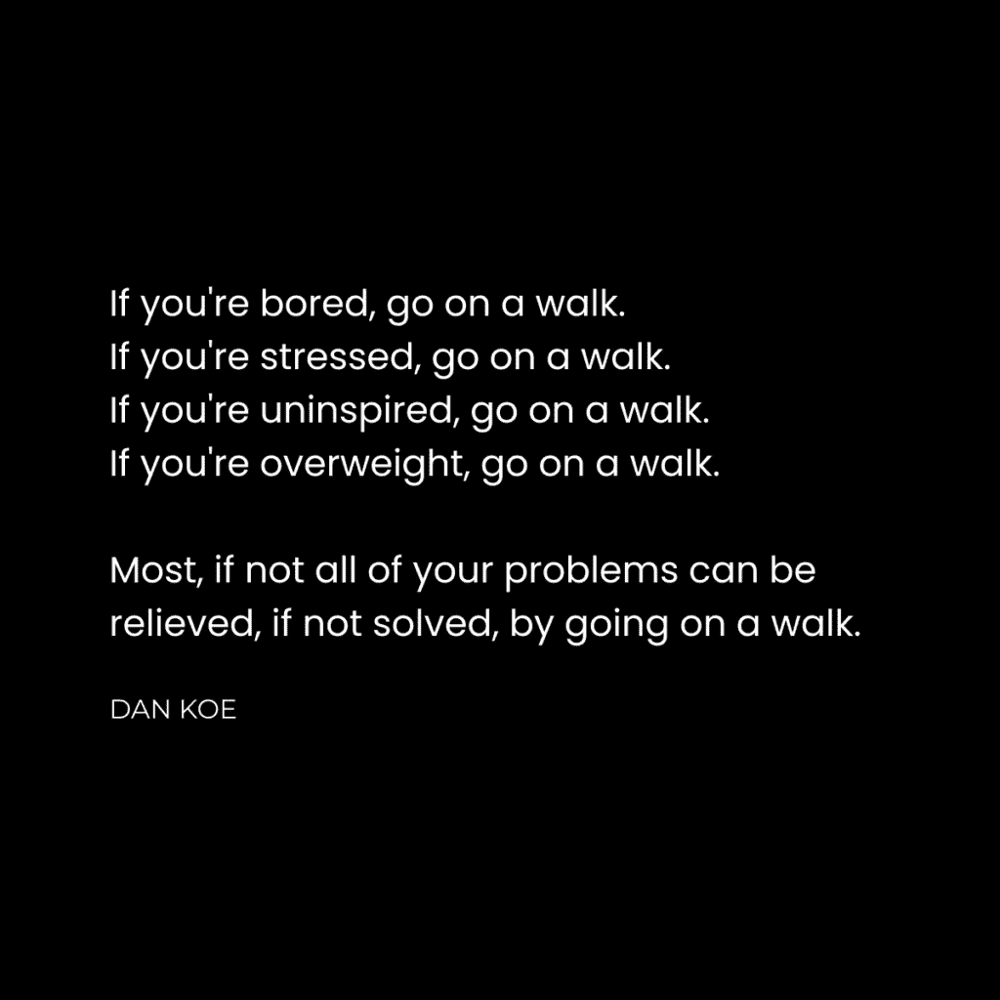

# 长步走的威力（每天 15000 步改变了我的人生）

> 原文：[`thedankoe.com/letters/the-power-of-long-walks-daily-walks-will-change-your-life/`](https://thedankoe.com/letters/the-power-of-long-walks-daily-walks-will-change-your-life/)

<picture fetchpriority="high" decoding="async" class="wp-image-2026"></picture>

我曾经***讨厌***走路。

我的意思不是说我以前只是讨厌散步。

我讨厌去任何地方散步。我就是懒惰的化身……也许“高效”这个词更合适。我喜欢去健身房和经营我的小生意，但除此之外，你会在我的沙发上、床上或办公椅上找到我，玩电子游戏。我总是那种只做最基本的事情的人，这让我在某种程度上受益。

我会找任何借口去散步或开车去某个地方。

为了设定场景，我开始使用尼古丁，因为 Juul 变得流行（是的，我就是那些不知道更好的孩子之一，并且随波逐流）。最终，这种尼古丁使用转变为使用 Zyns 来集中精力工作。Zyns 是无尼古丁的尼古丁烟包，现在非常流行。

在 2019 年某天，我意识到我滥用尼古丁正在损害我对他人的注意力。我总是感到疲倦。在谈话中我说得不多。而且如果有一段时间没抽过烟，那我就只会想这件事。

（对于那些好奇的人，我仍然因为它的各种好处而使用尼古丁，并且经常一周或两周休息一次）。

大概就在那个时候，我不知道是怎么了，我看到了一条关于散步益处的社交媒体帖子。它与“为夏天变得苗条”和用散步代替无休止的有氧运动有关。

星星都排成一线，我决定冷 turkey 戒掉尼古丁。每当我有渴望的时候，我就决定去散步 10 分钟，然后嚼健身房。

前几次散步很无聊，但它们有效。戒掉尼古丁相当容易，我总是可以用燃烧卡路里的方式来合理化这种小小的痛苦。散步成了我“感觉”自己在燃烧脂肪的方式。这让我更想散步。

在一个月的时间里，我每天都走那所谓的 10000 步。

结果是，我完全爱上了散步。

5 年来，我从未有一天走的步数少于 10000 步。当我住在奥斯汀时，我平均每天走 20000 到 25000 步。现在我平均每天走大约 15000 步。

有些人甚至说，我的名字已经与“散步”同义，考虑到我谈论它的重要性。我的意思是，甚至有一个与丹尼·米兰达合作的播客被称作“[丹·科——散步之王](https://youtu.be/3Rwr8cK9aQ0?si=-b7UG8JUtVEgLEIu)“。

类似于查尔斯·达尔文和史蒂夫·乔布斯将散步视为他们生活和工作的关键部分，我也发现了同样的道理。

有些人会问，“如果你一天要走几个小时，你怎么完成工作？”

我建议你读读 NN Taleb 的《反脆弱》第七章，或者读读我的[4 小时工作日](https://thedankoe.com/letters/zero-to-1-million-as-a-one-person-business-while-working-2-4-hours-per-day/)哲学。

简而言之，我尽量不做任何我不需要做的事情，因为这是自然界内置的机制，用于从噪声中过滤信号。太多的人整天忙碌，却没有什么可以展示的，因为他们陷入了那些无法让他们取得任何进展的任务中。

此外，如果不是因为步行，你可能不会阅读这封信。

我的想法不会相同。我的内容不会相同。我的身体不会相同。我的身份不会相同。

我想与你分享：

1) 步行的原始力量，让你有多个“为什么”来维持这个习惯。

2) 如何将步行变成游戏，以便你可以无缝地形成这个习惯。

我写这封信的愿望是希望通过一个简单的习惯来改变你的生活。

让我们开始吧。

## 心灵、身体、精神、商业——全面的生活习惯

我希望我能把这一点说明白：

你每天的时间是有限的。

意味着你可以采纳的习惯是有限的。

也就是说，你选择实施的习惯至关重要，因为它们创造了你的未来，并影响了你的生活质量。

大多数人无法控制他们选择的习惯，所以他们的生活轨迹是他们没有设定的，而且越来越难以改变自己。

习惯不仅仅是身体上的，也是心理上的。

你通过在手机上滑动来分散自己的注意力。

你的注意力跨度缩小，因为你的大脑习惯于每 30 秒接收新的信息。

因此，你无法专注于有意义的对话。你无法专注于建立商业。你无法专注于穿上鞋子去健身房。

你的大脑几乎对几乎所有事情都做出反应，用其他人编程进你大脑的梗和随机片段。你无法认真对待任何事情。你认为任何有价值的东西都是个笑话。同时，你感到沮丧和绝望，但因为没有解决方案，因为你的大脑被困在表面跳来跳去，试图看到一点。

解决你大多数问题的方法就是：

你必须重新获得你的专注力，以便你可以实施新的习惯。

你必须实施新的习惯，因为你只能选择少数几个。

你选择的习惯必须是高杠杆、高影响和高乐趣的。

你选择的习惯将你的注意力重新集中在生活的深度上。

你把注意力集中在哪里，就会编程你的大脑，塑造你成为谁，并决定你的未来。

步行作为一种习惯涵盖了所有方面：心灵、身体、精神和商业。

让我来展示给你看。

### 步行冥想

我过去对冥想持怀疑态度。

我曾认为这是嬉皮士和新新人类保留的，他们认为自己在引导某种形式的能量，变得像《阿凡达》中的最后一任土著人一样强大。

结果表明，就像我大多数不喜欢的事情一样，我只是没有理解冥想是什么。

冥想是解放你思想的行为。

冥想是减少你对思想的依恋。

冥想是实践与现实的统一，而不是对未来的期望或过去的经历。

换句话说，通过持续的冥想练习，生活变得更好，因为你正在经历它。

大多数人没有意识到他们的生活有多么表面化。他们在头脑中跳来跳去，创造出不存在的问题，并失控地陷入深深的焦虑和混乱状态。

他们的生活被过去的有压力的情况所统治，这些情况影响了他们对未来的看法。昨天对你大喊大叫的老板让你今天害怕去上班。昨天糟糕的写作让你担心明天无法完成，你继续投射到一个未来，在那里你无法完成任务，你的副业失败，而你开始制定 B 计划，却没有意识到你正在用你的思想创造那个现实，因为你的行动将随之而来。

你将自己困在狭隘的痛苦状态中，而你唯一的出路是通过冥想重新编程你的思想。

问题是我总是无法形成坐姿冥想的习惯。我总是忘记或者发现当我早上不做那件事时，我的其他工作（如写作）会受到影响。

我们稍后会讨论如何步行冥想。

### 步行与健康

这个并不难理解。

**步行 = 增加卡路里消耗。**

我不知道这是否真实，但我读到过，无论你是走路还是跑步相同的距离，你燃烧相同数量的卡路里。所以，如果一个人走了一英里，另一个人跑了一英里，他们燃烧相同数量的卡路里。我敢肯定两者之间有微小的差异。主要差异是你完成这个距离的速度。

我喜欢散步，因为在跑步时我无法真正倾听、阅读、捕捉想法或写作。

因此，如果你在减肥方面有困难，散步是一个可以形成的可持续习惯。

**户外 = 阳光和缺乏蓝光。**

蓝光不仅会损害你的睡眠，还会破坏你的健康，并导致慢性疾病。

大多数人都听说过安德鲁·休伯曼早上第一件事就是晒太阳的建议，但即使是他也承认这只是冰山一角。

我在这里不会深入探讨这个问题，因为需要包括的信息量相当于一本书，但我将提供一些资料供你深入研究：

[分析 & 优化](https://x.com/Outdoctrination)

[杰克·克鲁斯](https://x.com/DrJackKruse)

[Grimhood](https://x.com/Grimhood)

日光对你的健康比你知道的更重要，你可能害怕它，因为你认为你会得皮肤癌（而实际上日光有助于逆转皮肤癌 – [起始信息](https://x.com/zaidkdahhaj/status/1798381439479943612) 和 [另一个](https://x.com/zaidkdahhaj/status/1796966480640381210) 出于各种原因，根据你的好奇心深入挖掘）。

大多数人被中央教条深深地洗脑，要保护自己免受阳光的伤害，而阳光现在是许多疾病的主要原因。

作为参考，我可能是你见过的最白的人。我总是害怕太阳，在我高中暑假做救生员的时候，我每天不得不涂抹 4-5 次防晒霜。

通过正确的饮食和协议，我在阳光下不会晒伤。

我每天大约走 15,000-20,000 步，其中大部分是在亚利桑那州的 UV9-UV10 高温下，但我不会晒伤。

对于那些想要深入了解的人来说，开始搜索像“如何建立你的太阳能茧”这样的信息，并从那里研究你不了解的概念。

请理解，我的思想不是他们的。我在分享我认为有用的信息，而不是他们的意识形态作为要采纳的一种。我不赞同他们说的许多事情，但这并不意味着我不能从中获益。

### 步行激发创造力

如果我能将我的写作和创作者的成功归因于一件事，那将是散步。

对我来说，散步是我的创造力障碍。这是我在哪里：

+   听有声书和长 YouTube 讲座（[actualized.org](http://actualized.org)是我最喜欢的）

+   阅读实体书籍（是的，我早上带着一本书散步，边走边读）。

+   记下我想写的想法（使用我在这个免费课程中的[天才想法过程](https://7daystogeniusideas.com)）。

+   保持沉默，让我的大脑解决问题，缓解压力，或为我的目标或愿景带来清晰。

不要轻视“创造力障碍”的概念。

你有专注工作的生产力障碍，但为了使那些有独特的或原创的贡献，它们需要与创造力障碍相平衡。

换句话说，如果你不花时间通过思考和解决问题来培养和发展想法，你的工作很难达到卓越。

因为面对现实……

你可能很难形成阅读或冥想习惯，因为你被困在室内，而那里充满了干扰。如果你的意图是阅读或思考，但你选择了专注的工作，即使是那也是一种干扰，而且你缺乏自律。

当你外出散步时，你唯一的选择就是做你打算做的事情。

## 通过将其变成游戏来形成愉快的步行习惯

为什么我们会如此沉迷于电子游戏？

1.  有一个清晰的目标层次（如何获胜+任务）

1.  对于进步（升级+里程碑）有明确的反馈

1.  有规则可以缩小你的注意力并消除干扰。

1.  有教程帮助你快速掌握游戏。

1.  根据你的技能水平，会有相应的挑战，这样你就不会感到焦虑或不知所措。

简而言之，视频游戏之所以上瘾，是因为它们推动我们进入流感状态。

流感状态的特点是绝对的清晰。零干扰。纯粹的进步，这种感觉在世界上无与伦比……而且你可以通过大多数习惯，尤其是步行，进入这种状态。

你知道你需要做什么，如何做，何时做，这并不容易或众所周知，所以它是有意义的。

新奇带来的额外多巴胺也不会有害。

因此，为了形成这个新的步行习惯，我认为将其变成一个游戏是明智的。这就是我不知不觉中做的事情。4 年后，我不再担心体重过重、不健康，或者难以想出创意点子，让我能比大多数人更快地建立企业。

### 第 1 步）明确你为什么步行

视觉和反视觉。

我总是谈论这些，因为它们真的很重要。

如果你没有将你所采取的每一个行动与你理想的生活方式对齐，你就迷失了，你无意识，你被编程了。你没有做出自己的决定，你的思想容易无意识地服从他人的意愿，甚至没有注意到。

深入思考步行是如何成为一种全面的习惯，可以彻底改变你的生活。

+   你想从戒掉坏习惯中获得的好处吗？步行可以替代那个习惯。

+   你想在工作中更有创意吗？你总是挣扎着写作或想出能改变你未来的想法吗？你能看到简单的散步如何改变你的人生方向吗？

+   你想减掉 10 磅脂肪，晒黑，并从持续的阳光照射中获益吗？如果你的心理健康状况糟糕，这不是值得一试吗？

列出你现在生活中不喜欢的一切。

从那里，列出你希望一年后生活中拥有的一切。

然后，思考每天走 10000 多步如何有助于实现这一点。

### 第 2 步）设定每日目标并将其分解

所有行为都始于一个有意识或无意识的目标。

你所采取的每一个行动都可以映射到你正在追求的目标。问题是：你是否设定了那个目标？或者你是被媒体、你的父母、你的老师和朋友悄悄编程了吗？

一个简单的习惯并无不同。

设定一个每日目标，并从小处着手。

我觉得，如果人们现实地重组和优先考虑他们的生活，10000 步对大多数人来说是可以实现的。你可以早点起床，早点睡觉，告诉你的配偶这对你很重要——这种“步行”的好处可以渗透到你的整个生活中。

如果你一天走 10000 步会让你焦虑，那就降低目标，就像你在视频游戏中做的那样。如果 10000 步是 100 级，那么选择 2000 步作为 1 级，然后逐步增加。

现在，将其分解为个人步行的子目标。

+   你打算在一次散步中完成所有的事情吗？

+   你打算分散它们吗？

+   你打算在散步中走哪条路线？

+   你打算走到一个特定的地标或地点吗？

+   你打算走到当地的咖啡馆去专注工作吗？

通过坚持这些目标直到大约一个月后它们变得自动，来为新习惯带来清晰性。

### 第 3 步）为散步制定规则

现在，为了进一步集中注意力和增加散步的乐趣，我们需要制定规则。

如果我们不这样做，你的大脑会倾向于抱怨。

“我不喜欢散步。”

“外面太热/冷了，呜呜，我需要我的舒适的空调箱。”

“我不住在一个适合散步的城市。”

所有借口。即使你不想走路，你也能走。你走进桑拿房，不在乎它有多热。你的期望和限制性信念正在毁掉你的潜力。

这里有一些你可以尝试的规则：

+   散步时永远不要踩到路上的裂缝。

+   带着从一本书或有声书中得到的 3 个写作想法回来。

+   让你的身体两侧都晒上 15 分钟太阳。

+   交替进行 5-10 分钟的行走冥想和 5-10 分钟的学习。

+   完成一本书的一章或一个课程的模块。

+   写你通讯的一节，或者写几篇内容（就像我在[2 小时作家](https://2hourwriter.com)中教授的那样）。

尝试一下。

### 第 4 步）进行散步（并有一个触发器）

散步是最容易的部分。

让自己去散步是最困难的部分。

如果你有一个触发器，比如我有了尼古丁渴望并想要戒烟，那么就用那个时刻立即出去开始你的散步。

如果你没有任何动机或触发器，你需要引导你的大脑走向你现在能采取的最低摩擦的行动。

你能走进衣柜拿你的鞋子吗？

如果这太难了，问问自己为什么你甚至无法控制自己的身体走几步。

同时，进一步分解。

你能走到你的房间吗？

不？

你至少能站起来吗？

不？

好吧，移动你的脚。

仍然没有？

我无话可说。

到这个地步，没有人能救你。

（如果你真的不能走路，因为你没有腿或者它们不起作用，忽略我，因为我确信你会告诉这些人他们应该感激自己能走路的能力）。

就这样。

开始散步。

周末愉快。

– 丹
