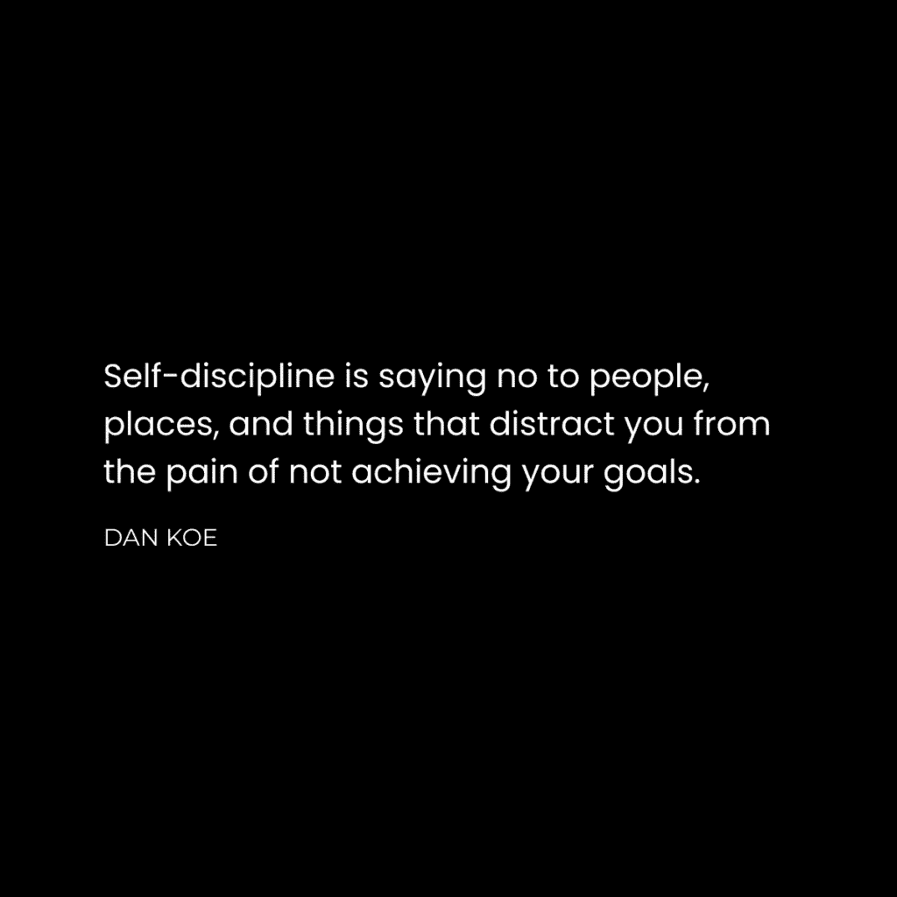

# 停止如此关心（它正在毁掉你的生活）

> 原文：[`thedankoe.com/letters/stop-caring-so-much-its-ruining-your-life/`](https://thedankoe.com/letters/stop-caring-so-much-its-ruining-your-life/)

环顾四周。

每个人都压力山大。

我们都想要实现伟大的事情，但集中注意力去实现这些伟大事情变得越来越困难……因此它们从未完成。

我们的大脑充满了：

+   追求你自己的目标而不是父母（或朋友、伴侣或老板）为你设定的目标的*风险*。

+   被告诉应该关心什么——要学习哪些技能，要支持哪些国家，要避免哪些食物——而这些人的目标与你的目标并不一致。

+   关于你必须出席的工作、你将要浪费的时间以及你将无法完成的所有事情的想法。

+   如果你决定走自己的路，掌控自己的生活，人们会怎么想？他们会怎么想？

这些不是容易处理的想法。

如果你的朋友或父母不支持你——甚至试图阻止你——那可能会变得非常痛苦。你可能会失去生命中的一些人。你可能会失去一部分自我。这很痛苦。

问题在于他们不知道你知道的。

他们没有接触到相同的信息、教育和潜力，因此他们看不到机会。

他们的思想仍然被服务于过时目标的信念所编程。他们很难相信你的新事业会成功，因为他们所知道的可能的就是他们所做的事情。

父母在这方面非常擅长。

他们一出生就被分配了目标。他们追求这些目标并看到了结果。他们的身份和思想都得到了塑造。

如果他们没有在成年后继续扩展他们的思想，他们的思想就会变得僵化。与他们所知道的不一致的事情没有意义，人们讨厌他们不理解的事情。

这是你必须做出的第一个认识：

没有人会给你许可去做你想要的事情。

他们没有接触到你所接触到的信息。

他们没有你对自己讲述的故事。

除非他们足够成熟，能够打开心扉接受这个故事，否则你必须在某个时刻跳出巢穴，相信你可以学会飞翔。

更进一步，你每天能投入到目标中的注意力是有限的。

人们生活在持续的压力状态中，这并不奇怪。

我们无法集中注意力。

我们过于关注他人的目标，以至于没有剩下多少注意力关注我们自己的目标。

一旦我们醒来，我们就拿起手机，用新闻、建议、末日预测以及比我们做得更好的人的信息来充斥我们的头脑。唯一的缓解方式就是不断滚动，让自己感觉自己在取得进步。

大脑渴望秩序。这就是为什么你感觉如此糟糕。

你的注意力没有集中在未来某个强大到足以抵御干扰的单一愿景上。

你只有一个选择。

深入感受你的处境。

认识到你继续走这条路，你的生活将如何结束。

对你取得的进展不足感到极度厌倦。

利用那种负面能量，专注于你一直推迟的有意义的目标……你知道，那个不断在你耳边唠叨的内疚感。

+   “你本应拥有比这更多的东西。”

+   “你有成功所需的全部。”

+   “你不必像其他人一样结束。”

严肃地，*感受*你的情况。停止回避。你必须增加你想要实现的事情的重量。

达不到目标所带来的痛苦必须超过舒适生活的痛苦。

你必须移除那些让你从成为你注定要成为的人的痛苦中麻木的干扰。

## 自律源于清晰，而非强制

大多数人都不理解自律。

这不是一件应该困难的事情。

这是知道你想要什么并对自己不满足的副产品。这是有序思维的副产品。也就是说，保持你对未来的清晰愿景，并用教育和行动填补清晰度差距。

人们之所以在自律上挣扎，是因为他们被从重要的事情上分心。

+   他们忘记了他们想要成为的人。

+   他们忘记了他们的能力。

+   他们忘记了他们想要产生的冲击力。

你之所以缺乏自律，是因为你不是那个能够无缝实现他们设定的目标的人。

一个真实身份是健身者的人不会觉得吃健康食物和去健身房有困难。他们只是做了。

一个真实身份是作家的人不会觉得为创意生成、长时间散步和写作腾出时间有困难。

一个真实身份是游戏玩家的人不会觉得在网上捣乱、持有末日心态、每天在屏幕前 8-10 小时损害健康有困难。

健身者会把那种生活方式看作是活地狱。对他们来说，不疯狂地恨他们的生活，就几乎不可能采用游戏玩家的生活方式。他们会残酷地意识到他们没有实现的目标。

每个身份都有其权衡。它们各自需要牺牲，以便实现他们选择的目标。

这就引出了我们成为自律的第一步：

**1) 移除干扰**

问问自己：

你知道你为什么在做你现在做的事情吗？

你在上个月问过自己那个问题吗？

你为什么要上学？为什么要做那份工作？为什么要建立那个企业？为什么要做那个锻炼？

是你的选择吗？还是说这是一个由你的父母、朋友或文化在你脑海中编程的目标？

审视你的生活，找出你不知道自己在追求的目标。

拿一本笔记本，写下你正在做的每一件事以及你为什么要做它。

如果你没有好的答案，那就是一个干扰。你正在将情感能量浪费在别人的梦想上，以至于你没有足够的精力去追求自己的梦想。

如果你需要帮助获得清晰，并且是笔和纸的粉丝，请获取我的[FOCI 计划](https://thedankoe.store/products/the-foci-planner)。

**2) 生活如游戏**

我一直对反目标这个简单的概念着迷。

反目标**不是**你不想实现的目标。

它们是你不愿意为了实现目标而做出的牺牲。

以我为例，如果我想建立一个价值十亿美元的公司，我愿意为了达到这个目标放弃什么？

大多数有如此宏伟目标的人很少关注他们在路上失去的东西：他们的健康、他们的家庭和他们的理智。

另一方面，我知道在保持健康、拥有良好的人际关系和保持心理健康的同时，可以建立一个价值十亿美元的公司。

是的，这需要更多的时间和努力，但除此之外你还能做什么？让你的生活在你面前燃烧，因为你没有足够的自制力或纪律来承担更多的责任？

这就是反目标美妙的地方。它们将生活变成了一场有趣的游戏。

它们满足了众多实现“心流”的要素——这是我们沉迷于电子游戏的主要特征。

+   **挑战** – 一个触手可及的目标，可以测试你的技能。

+   **技能** – 如果你的技能不足以应对挑战，你会感到焦虑。如果太高，你会感到无聊，这表明你需要选择一个更大的或更小的挑战，而不是放弃。

+   **清晰** – 从大到小的目标层次结构使你更容易朝着你对未来的愿景前进。

+   **反馈** – 你确切地知道你在取得进步，这感觉很好。你不会感到被困在重复的任务循环中，这些任务没有任何结果。

+   **规则** – 规则或界限定义了你如何看待世界。你的大脑有更多的空间来注意到有助于实现你目标的信息。

当你将生活变成一场游戏时，你会对进步着迷。

**3) 重新塑造自我**

所有的变化都是行为的变化。

所有的行为变化都是身份的变化。

因此，所有的变化都是身份的变化。

你就是你所反复做的事情。

你对那些此刻在你的脑海中免费存在的目标有纪律性。

你发现整天躺在床上，看 Netflix，玩电子游戏并不困难。

对于许多高绩效者来说，这是世界上最困难的事情。他们无法想象这样做。无法朝着使他们成为他们自己的目标前进的痛苦会吞噬他们。

有了这些，你的旅程将会痛苦。

你正在让你的旧自我死去。

你不会想要摆脱那些阻碍你的信念和习惯。

这是第一步。意识到困难是一个好迹象。一个继续前进的迹象。

第二步是重新编程你的大脑，使其朝着新的目标运行，从而创造一个新的身份。

+   投身于一个与你想要成为的人相符的新环境。

+   让你的思想沉浸在想法、信息和教育中，这些会让你接触到新的目标和实现这些目标的方法。

+   以你理想生活方式的视角看待每一个情况，并据此做出决定。

投身其中，并学会游泳。

大多数人不会因为恐惧而迈出那一步。

那就是为什么我们需要谈论自信心。

## 成为一个自信的人的不寻常之路

我开始写作后，我的生活发生了改变。

不仅在私人日记中写作——这非常有帮助——而且在一个面向我未来大目标的公共日记中。

通过写作帮助我在思想和生活方向上变得自信，方法是：

+   面对公众的批评，迫使我审视我的信念。

+   找到有共同目标的伙伴和联系，所以我不再觉得自己是个局外人。

+   练习一项技能，并每天看到它的进步。

+   经常失败使我保持谦逊，并给我指明了一条我通常不会找到的新方向。

写作不是发展自信心的唯一方式，但人们对写作的理解都错了。

他们认为这是一种技能或爱好。

他们不认为这是使我们成为人类的东西。

我们是唯一一种可以通过用写作记录知识来传递信息，帮助那些后来者避免危险和进化的物种。写作是我们作为个体和集体走这么远的原因。

写作始于洞穴中的雕刻，并已成为互联网上的想法。

雕刻几乎看不见，但有了互联网，你就有能力改变自己的生活，以及成千上万人的生活。

写作是目标和利润的交汇点。不要低估这种力量。

### 1) 分解你的目标

你不自信，因为你没有在你失败的组合中投资。

你在别人的生活道路上过于舒适地居住了太久。

你未能摆脱大众，独立思考，设定自己的目标，并无论需要多长时间都要实现它们。

你不自信，因为你除了已经完成的事情之外，在其他任何事情上都没有结果。

与你的思想相伴。

你真正想要从生活中得到什么？

是不是和所有人一样，都是一条无聊的道路？

不是吗？

然后唯一的选项就是：

+   通过观察大多数人的行为以及那些行为带来的结果，注意你生活中不想要的东西。

+   如果你想从生活中得到更多，就做与别人相反的事情。

+   想想你的未来，将其分解为你必须实现的目标和必须采取的行动。

+   每天用有助于你实现那些目标的学习材料来教育自己。

+   为专注于构建你未来愿景的工作留出时间。

那么，就开始吧。

自信心来自于一次又一次地做你认为不舒服的事情，并意识到最初它并没有那么糟糕。

### 2) 开始创业

如果你真正思考你想要的生活，那么开始一项业务是不可避免的。

你想要自主权，喜欢的工作，以及能够影响世界，这样你才能满足你作为人类对成为对人类有价值的贡献的需求。

一家公司不是一种资本主义追求，为了拥有私人飞机和豪宅。

一家公司是你如何解决问题的。

一家公司是你如何建立自己的东西。

一家公司是你通过价值交换对人类做出的贡献。

一家公司是你如何重新掌控自己的生活。

一家公司是你如何在你的兴趣和专长中建立自信。

大多数人对“企业”这个词都有负面的反应。

“这太难了。”

“金钱是邪恶的。”

“这只是表面追求。”

然后他们继续做所有最困难的事情：

他们通过贬低任何可能破坏他们甚至不知道自己上瘾的舒适感的任何人或任何事物，来逃避实现他们潜能、自我实现和自我超越的欲望。

他们继续成为一家销售产品的企业的齿轮，赚取数百万。他们抱怨大多数企业都是不道德的，然而他们却在其中工作，没有意识到对抗的唯一方式是开设自己的道德企业。

他们说这是表面的，然而，每当他们有时间时，他们就会分散注意力。他们从未逃离表面。他们从未将企业视为探索生活提供的未知路径深度的载体。

一家公司是你价值的店面。

这是你自己的公开展示，你的目标，以及你的价值观。

企业是你自己的延伸。

### 3) 公开写作

写作是一种超级力量。

+   你可以更快地实现你的目标。

+   你可以吸引志同道合的人。

+   你可以从零经验开始。

+   你会习惯于人们看到你的想法。

此外，写作是媒体的基础。

你在网上看到的每一件事，从帖子到视频到广告，都是从写作开始的。

媒体是注意力所在的地方。

如果你想在生活中做任何有价值的事情，你需要你自己的注意力来源。

你不能再依赖你的老板来吸引注意力，吸引客户，并分配给你一些微不足道的任务，以一定的金额完成产品或服务，以满足那些客户。

你必须做所有上述事情。

对于没有资金或经验的初学者来说，公开写作是第一步。

写作是一个零门槛的商业模式，它允许你为任何你感兴趣的事物建立受众。

+   选择 2-3 个你想要写的主题，你想要学习的主题，你想要建立自己的名字的主题，并将其转变为有意义的事业。

+   通过观察学习。看看那些话题中的人都在写什么，他们是如何写的，以及他们为什么这样说。

如果你认为，“我本可以写出这个”，那么就写下来……在互联网上你不需要许可。

如果你不知道从哪里开始，考虑报名参加[2 小时作家](https://2hourwriter.com)。

### 4) 结交新朋友

精英团队：

多个头脑共同努力实现一个共同的目标。

在过去，你需要努力工作才能建立联系，使你的业务成功。

现在，你只需点击一下按钮就可以接触到任何人。

你的成功不再由你的社会经济地位和物理位置决定。

这取决于你与谁联系以及他们可以提供的机遇。

你如何找到这些联系？

设定一个你想要实现的目标。

你如何吸引人们关注那个目标？

以实现那个目标为使命创办企业。

你如何接近那些关系良好的人？

在公共场合写作以传播你的想法。

这与自信有什么关系？

嗯，这有点明显。

如果你不去挑战自己的极限并失败，你就不会培养自信。

目标、业务和写作——按照这个顺序——是你继续无限重复这个过程的途径。除了你自己设定的限制之外，没有其他限制。

你最终会在工作中遇到天花板。有人负责你能够达到的极限。

如果你没有通过在虚拟现实（互联网和社交媒体）“开店”与科技、人工智能和互联网一起进化，他们将会使你过时。

你通过在线出现并与人们交谈来交朋友。

就像你在派对上做的那样。

在互联网上，通过你的品牌和想法，你可以增加你的社会证据。

在互联网之外，你通过汽车、外貌和物质收购来提高你的地位。

很明显，哪一种方式能带来更好的生活。

经过 4 年的写作，我几乎可以给任何人发信息，如果我有他们想要的东西，就可以与他们合作。

例如，戈登·拉姆齐关注我。

我不知道我需要从他那里得到什么，但谁知道，将来可能会有所作为。

### 4) 发布你的作品

要理解自信，我们必须理解故事。

故事=转变。

你之所以缺乏自信，是因为你陷入了别人的故事中。你没有机会变成你本应成为的人。

你无法完全控制自己逃离故事的低谷、达到高潮和有一个幸福的结局的能力。

从低谷中走出来的道路是试错，这是生活的本质。

你第一次尝试写作将会很糟糕。

你第一次尝试推出产品将会很糟糕。

你第一次尝试交朋友将会很糟糕。

99%的人极度缺乏自信的原因是因为他们无意识地认为，你只需不做任何培养更稳定自信形式的事情，就能变得自信。

自信是进步。

发布你的写作并被称为白痴。

发布你的产品并收集负面反馈。

把自己放在外面，让人们揭露你的缺点。

只有在你意识到问题之后，你才能知道需要改进什么。

你无法改进没有发布的东西。

如果你没有意识到问题，你就无法改进。

在舒适的黑暗洞穴中死去阻止了你做这两件事。

你决定在那里停留的时间越长，建立自信所需的时间就越长。

你可以阅读这些内容，但你的生活却可以不做任何事情，因为你“不知道如何开始。”

或者，你终于可以迈出一步，将你的生活奉献给学习和建设，而不是期待一切都被给予你。

今天就到这里。

享受你剩余的一周时光。

– 丹
