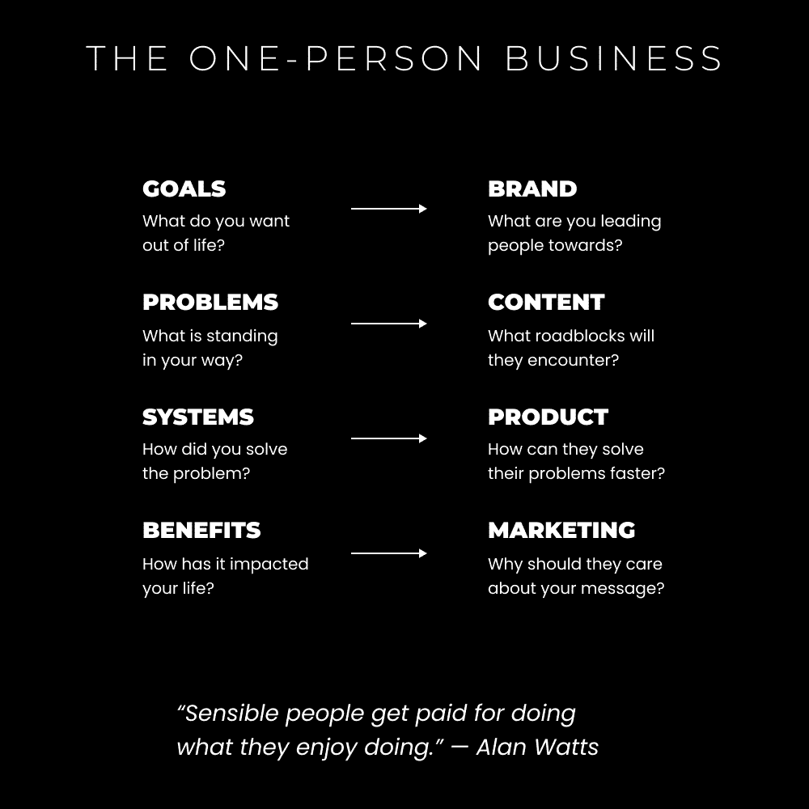

# 工作的未来（掌握这个技能栈）

> 原文：[`thedankoe.com/letters/the-future-of-work-acquire-this-skill-stack/`](https://thedankoe.com/letters/the-future-of-work-acquire-this-skill-stack/)

2022 年，埃隆·马斯克以 440 亿美元收购了 Twitter。

此后不久，他解雇了 Twitter 80%的员工。这超过了 6000 人。

这不是科技裁员或裁员的一般案例的唯一例子。头条新闻充斥着公司决定裁员、剥夺人们生计并让普通大众担心他们是否是下一个被裁员的报道。

此外，还有一些其他有趣的预测。

1.  自 2020 年以来，自由职业工作已从劳动力中的 36%增加到 46.6%。

1.  预计到 2028 年，创作者经济将从 2500 亿美元翻倍至 4800 亿美元。

1.  显著人物预测到今年年底将出现通用人工智能（AGI）。

现在，有人说由于成本高昂，开发速度正在放缓，可能需要 2 年或更长时间才能达到 AGI。

无论我们活到 500 岁，还是在未来 4 个月或 10 年内让机器人做我们的家务，唯一的解决方案就是自己动手。你本应该从一开始就做的事情。

没有 wonder 为什么人们如此担心被取代。

他们的技能正在过时。他们正站在失去生存手段的边缘。他们的家庭、生活方式和找到新工作的能力都处于危险之中。

所有这些都加在一起。

我们理解这三个要点至关重要。

理解他们将对你的未来有益，即使它们不直接适用于你。

### 1) 入门级职位正在灭绝。

获得入门级工作变得越来越困难。

无论它是编程还是营销，AI 都能（或非常接近）在大多数领域执行基本的专业工作。

现在，这并不一定意味着入门级职位正在消失；这只是意味着门槛正在提高。

以前是入门级职位，现在变成了初级——很快就会变成高级——职位。

> 对于软件开发者来说，这是一个非常悲伤的结局。
> 
> 我已经说了 6 年。
> 
> 10 年后，其中 90%的人将不会得到他们以前的工资水平（经通货膨胀调整）。
> 
> 解决方案：立即成为独立制作人。
> 
> 即使你失败了，你也会获得软技能，这些技能可以让你在以后被公司雇佣。[pic.twitter.com/TXVpHtYA41](https://t.co/TXVpHtYA41)
> 
> — 约翰·拉什 (@johnrushx) [2024 年 6 月 28 日](https://twitter.com/johnrushx/status/1806682114290541049?ref_src=twsrc%5Etfw)

现有的劳动力将由具有某些特质的技能高超且收入丰厚的人组成。

那么，这些“高技能”个体有哪些特质是你没有的？

初学者如何赚钱？

开发者、作家、营销人员、销售人员、设计师和其他创意和技术工作者如何生存？

### 2) 人们没有受过教育。

> 如果你没有创造一个目标，你将被分配一个。 —— 《专注的艺术》

人们曾预期奴隶在其一生中只完成一项任务。

他们被教导了特定职业的技能，比如种植小麦、放牧羊群和骑马。

我们当前的教育体系反映了奴隶的教育。

今天，我们被教导要成为有用的工人。

我们被教导要服从权威。

我们被训练出因为害怕惩罚而取得好成绩。

**一个自由人应该有一个目标，并学习实现它所必需的一切。**

一个目标是一个对他人有积极影响的目标。

大多数人没有选择自己的目标。他们在年轻时就被编程成有雇员心态，做他们被告知的事情，并且只在那个狭窄的领域学习。

一个目标意味着必须学习知识和技能，以解决阻碍你实现目标的问题。

如果你没有选择自己的目标，你也没有选择你要学习的内容或你要解决的问题。*你的思维默认是狭窄的，因为目标本身是狭窄的。* 你的命运已经被决定了，因为你所知道的唯一潜力就是你被分配的那一个。

那么，我们学到了什么？

以及我们如何保护自己免受 AI 危险的影响？

### 3) 工作的未来属于个人企业。

> 这个星球上有近 70 亿人。我希望有一天，几乎会有 70 亿家公司。 – 纳瓦尔

一个企业是一个法律结构，它允许你：

1.  建立你想要的东西

1.  解决有价值的问题

1.  从中获利

为什么我要告诉你这些？

因为我对人们认为“商业”或“创业”只为那些有启动资金或特定性格的人所保留的想法感到厌倦。

就我而言，停止把赚取独立收入视为创业。把它看作是变得有价值，打包这种价值，并参与价值交换——这种行动从穴居时代就有，而不仅仅是当法律要求成为一件事情的时候。

社交媒体、创作者经济和技术使得一个人能够吸引和货币化一个受众，一个分销渠道。

这不是一种新的时尚商业模式，这是现代世界的现实。

你有能力在互联网上学习任何东西，在互联网上建立任何东西，并从互联网上的任何人那里接受付款。

并且是的，你可以从 0 开始。

我们还有很多东西要讨论，因为我们只是刚刚设定了场景。

在接下来的章节中，你将学到以下内容：

1.  如何成为一个深度通才，以保障你的未来。

1.  你必须学习哪些技能，才能用任何兴趣或激情谋生（以及如何快速学习它们）。

1.  为什么 AI 并不像你想象的那样特别，它只会取代那些应该被取代的人。

1.  如何将自己变成一个个人企业，这样你就可以掌控自己的命运。

1.  如何在每天平均工作 4 小时的情况下，从 0 到 10 万美元，再到 100 万美元。

在历史上任何其他时刻，这一切都不可能实现。

欢迎来到工作的未来。

## 未来保障的技能栈

> 传统教育和高度专业化是使人们服从主导范式/系统的一种方式。研究自然的普遍原则，成为一个深度通才。 —— 丹尼尔·施马赫滕贝格

我想向你介绍一位认证的天才、发明家和哲学家。他设计了球面圆顶，这种结构在保持极强稳定性的同时，也具有轻便的特点。

他的名字是巴克敏斯特·富勒。

在他的著作《地球宇宙飞船操作手册》中，他描绘了一个关于伟大海盗的隐喻。

伟大的海盗就是这样，他们是海盗，理解了许多事物，如地理、天体导航、生物学、他们船上的水手、船只本身、历史和科学，因为这些都是成功进行贸易和统治的必要话题。

他们带去船上工作的人故意很愚蠢。海盗们不希望他们理解他们的策略并密谋超越他们和他们的财富。他们被期望无条件地服从命令，他们确实这样做了。

海盗们拥有全球知识，因为他们可以航行到不同的土地。他们是通才。陆地上的统治者只知道他们自己的土地以及海盗告诉他们的信息（海盗可能会说谎）。他们是专家。

这给了海盗巨大的权力，并使陆地统治者依赖他们进行贸易和获取知识。

海盗们影响了陆地统治者，让他们在自己的王国中将显赫的角色赋予最聪明的大脑，以此保持他们的狭隘。他们会给聪明的大脑分配像“皇家历史学家”或“财政部长”这样的角色，这样他们就会整天研究这个单一的领域，使自己只对陆地统治者和海盗有用。就像海盗船上的水手一样，这阻止了陆地上的聪明人超越海盗，因为他们是专家，而不是通才。

*聪明的大脑对声望感到满意。*

*陆地统治者对有“智慧”的人为他们服务感到满意。*

*海盗们对在多个土地上拥有控制权感到满意。*

经验教训：

学校的建立是为了通过承诺专业化的声望来奴役最聪明的大脑。这样，他们保持狭隘的思维方式，不选择自己的目标，因此没有学习到能够让他们推翻那些指定他们目标的人的多种兴趣和技能。

这解释了为什么专业化仍然被高度鼓励。这也解释了为什么“高薪工作”是青少年在思考他们未来要做什么时的首要考虑。

你已经被编程去被取代。

让我们学习如何逆转已经造成的损害。

### 如何成为一个深度通才

> 做好每一件事。
> 
> 成为作家、设计师、营销人员、电影制作人、健身者、跑者，或者 whatever your curiosity desires
> 
> 互联网赋予了个人几乎学习任何事物的能力，快速获得结果，并从多样化的兴趣中获得成果。
> 
> 你正在经历第二次文艺复兴。
> 
> — 丹·科伊 (@thedankoe) [2024 年 5 月 8 日](https://twitter.com/thedankoe/status/1788225509593149750?ref_src=twsrc%5Etfw)

动物和人类之间的区别在于，动物会专业化，或者说是缩小领域以生存。

问题在于，过度专业化导致某些物种灭绝。

就像长嘴鸟可以够到浅水中的鱼一样，所以它们就留在那个环境中。然后，它们繁殖，最长的喙存活下来，但喙变得如此沉重以至于它们无法飞翔，而孩子们的喙变得如此小，以至于没有食物留给它们。

另一方面，人类通过制造工具来弥补自己的不足。

在过去，我们学会投掷标枪，这样我们就能吃东西。今天，我们学会在手机上给我们的社交圈发短信，这样我们不会被看作是局外人。你周围的所有技术进步都是为了防止人类灭绝。

这里有一个问题：

你是否在构建一些有价值的东西来防止自己被取代？

或者你满足于作为一个在他人机器中等待灭绝的齿轮的单技能？

人类是自然通才。他们在重叠领域的交汇处蓬勃发展，可以通过制造工具、获得新技能或学习新信息来适应新的领域。

我要告诉你确切的学习内容，以成为一个深度通才。

我即将分享的是一系列技能，从宏观到技术细节，这将使你能够做出自己的决定，独立思考，并确保你的未来。

在德文·埃里克森看来，七门文科（或他称之为“解放艺术”，因为它们与文科学校教授的几乎无价值的知识大不相同）是，引用如下：

+   **逻辑**：如何从已知事实中推导出真理

+   **统计学**：如何理解数据的含义

+   **修辞学**：如何说服，并识别说服策略

+   **研究**：如何收集关于未知主题的信息

+   **（实用）心理学**：如何辨别和理解他人的真实动机

+   **投资**：如何管理和增长现有资产

+   **代理**：如何决定要追求的课程，并主动采取行动去追求它。

如果你想学习这些技能，你必须在你深入未知领域时将它们牢记在心。

如果你以未来为导向做好准备，你认为未来可能有利可图或有用的任何技术技能都是无关紧要的，因为你可以根据需要做出调整。

要学习解放艺术，这是我获得的一些技能：

+   **市场营销与销售**——如果你不知道如何吸引和说服，你就永远不会得到你想要的东西，你唯一的选择就是由雇主（或政府）提供给你。（修辞学，心理学）

+   **写作与思考**——在独特的思维中传达价值的技能。站在他人面前的基础。（逻辑，研究）

+   **创业** – 将我的未来掌握在自己手中，寻找我的生存，并构建我想在世界看到的（别人也关心的）产品。（统计数据、效率、投资）

创业可能不是一个“技能”，但它是一种元技能。它教会你成为高效率的人，识别问题，销售解决方案，系统化你的工作，并培养使你受雇并不可替代的其他特质。

现在，没有人能告诉你如何写作、思考、营销和销售。他们只能告诉你他们是如何做的。

意味着，要学习这些技能，你必须接受自我实验的心态。

你的任务是：

+   **研究其他人已经取得成功的流程**。 阅读书籍，使用谷歌搜索，观看 YouTube 教程。自我教育必须成为每天 30-60 分钟的习惯。这不是可选项。

+   **尝试各种技术**。 实施你学到的流程，并尝试获得结果。

+   **识别模式和原则**。 注意它们之间的相似性，并加倍关注它们。

+   **创建自己的流程**。 将你所学的内容调整到你的独特生活方式和情况。

+   **通过传承来为真正的教育做出贡献**。 提供在学校无法教授的、以批判性思维为基础的教育。

以创业作为你的载体，你为真正的教育和主权设定了场景。

通过写作和思考，你不断地创造、测试和迭代你提供的价值。

你需要学习实用的心理学 – 营销和销售 – 来理解自己和客户的想法。

你随后通过说服，而不是强迫或欺骗，来激励人们关注你提供的价值。

### 技术知识 & 个人兴趣

在未来证明的技能堆栈的基础上，下一步是适应时代的技术技能。

在这个数字复兴时期，这意味着：

+   **社交媒体** – 建立你的名字作为你创造价值的店面。你业务的指挥中心。

+   **内容** – 写作、设计或视频，以教育、娱乐并激励人们看到你的价值。

+   **电子邮件营销** – 新闻通讯或序列，以培养你获得的受众。

+   **视觉设计** – 展示你品牌的氛围，激发观众的情感。

+   **漏斗构建** – 创建着陆页、网站，并利用其他技术技能如内容、电子邮件来推动它们。

随着人工智能对行业的冲击，学习这些技能的要求必然会改变。它们不会很快消失，但由于获取这些技能的便捷性，一般竞争将会增加。

如果你只学习这些技能 *而不* 学习之前的营销、销售、写作和创业，这些技能将失去效力。

这些技术技能是你作为企业家开始建立自己的事情的方式。

现在你提出的问题：

+   我要写些什么？

+   我要推广和销售什么？

+   我该用电子邮件、设计，还是利用技术技能做什么？

*你忍不住要告诉别人的兴趣。*

你无法自拔的书。

淹没你搜索历史的想法。

你梦想中的项目，但你似乎找不到——请原谅，*制作——*时间来构建。

如果你想了解我的写作或构建产品的系统，你可以在我的网站上找到《2 小时作家》和《心智变现》[链接](https://thedankoe.com)。

你是最有利可图的细分市场。

创作者经济——不要与影响者经济混淆——的特点是个人追求他们的兴趣并记录他们的知识。

创作者吸引人们关注他们的愿景、故事和目标。AI 没有好奇心。你必须给它愿景、故事或目标的环境才能工作。好奇心和通才能力是你吸引有共同问题、你在生活中已经解决的问题的志同道合的人的优势。

商业和价值是解决问题。这就是你赚钱的方式。

没有人想跟随一个总是谈论同样事情的自命不凡的搜索引擎。

许多创作者告诉我他们害怕拓展到新的兴趣。他们很难看到这将如何运作。

你只需要看看你关注的每个人。他们在谈论*一件事*吗？他们真的在吗？

或者他们是在提供他们的观点、信念、知识和他们生活经验的片段，打包成有影响力的内容？

“但是丹，那我该卖什么呢？”

我们很快就会谈到那一点，不用担心。

你不是“找到”一个有利可图的细分市场。你通过说服创造一个有利可图的细分市场。你为你的兴趣写有说服力的论点，说明你的兴趣如何让他人受益，你销售与该兴趣一致的产品，你通过社交媒体、电子邮件和设计等技术技能来交付。

如果你理解了未来证明的技能，以及因此人类的天性，你就会明白你可以控制你对兴趣的认知。

兴趣被激发。兴趣被编程。你之所以对特定事物感兴趣，是因为你的成长环境和接触到的信息。

你对他们的兴趣有原因。这意味着其他人可以通过在社交媒体上巧妙地写作来对他们产生兴趣。这以前发生过。去滚动时间线，告诉我有什么东西没有说服你改变你的行为。

你在你的兴趣上花费时间、注意力和金钱。这意味着如果足够有价值，其他人也会在你身上花费同样的资源。

自由的人不会细分市场。

### 但关于 AI 呢？

让我们做一个思想实验。

你是一个企业家，而不是一个雇员。

你想在一生中构建多个产品，无论是退休前还是死亡前（因为你会发现退休是一种错觉，工作是休息的必要平衡，如果我们从不工作，我们会很痛苦。我们只是专注于错误的事情）。

为了构建这些产品，你需要：

+   一个有使命、愿景和哲学的，针对理想客户的品牌。

+   写作、演讲、广告、视频、设计和电子邮件来吸引和培养客户。

+   一个有说服力的营销信息能帮助你从众人中脱颖而出。

+   一个基于反馈持续迭代的产物。

+   并且更多，贯穿你计划构建的所有产品。

目前人们在社交媒体上问的常见问题是这样的：

*“如果人工智能可以写一个着陆页或论文，作家会被取代吗？”*

*“如果人工智能可以构建应用程序，程序员会被取代吗？”*

答案是，是的，其中一些，如果他们不控制愿景的话。

计算机是超级专家。人类是深度通才。这是一个很好的组合，但单独来看并不太有效。

计算机只会取代那些应该被取代的人。

人工智能可以帮助你更快地写论文、创建设计或编辑视频，赋予使用人工智能的个人更多权力，使一人的 1000 万美元企业成为可能，但仍然需要有个体来协调通往未来愿景的道路。

对那些担心被取代的人的基本误解在于，总会有问题需要解决。你不知道如何狩猎。你被困在别人分配的重复性任务中。显然，你是一个理想的被取代候选人。你没有成长或进化。没有新意，没有迭代，也没有朝着实现愿景的方向发展，而当你停滞不前时，你无法找到可解决的问题。

如果你依赖别人给你一个要解决的问题，你将会被取代。

你需要目标、机构和创造力。

人工智能可以写一本书，但只有当它是为某个更大的目的而写，面向市场，并分发给认为这本书有价值的受众时，它才有价值。

尝试让人工智能为你写一本畅销书。

我会等待……一段时间……因为畅销书不仅仅是关于写作的。

你需要钩子，与拥有分发渠道的公司、品牌和创作者建立联系。而这只是冰山一角。

同时，利用人工智能更快地完成你的雇佣工作，这样你就有时间摆脱现状。

我已经知道你要问什么了。

我该做什么来摆脱现状？

## 产品化自己——一人企业模式

*“如果你在生活中解决了问题，你就有资格开始创业。”*

不只是任何企业。

一个教育业务。

作为一个人。

零启动成本。

无论你的经验水平如何，你都需要利用你头脑中的知识。

大多数人试图建立一个“初创公司”或者在他们和朋友喝完酒后想出的疯狂想法。

他们认为他们的想法会改变世界，但他们通常都是幻想的，因为他们没有任何先前的商业经验。

如果你没有任何经验（意味着你的大脑只能有这么多好主意……你没有建立任何能带来更好想法的东西）的话，我可以几乎保证有人已经尝试过并失败了。

当然，也有一些特殊情况，但在这里押宝运气并不是一个好主意。

人们解决健康、生产力、职业、金钱、关系和生活方式问题而赚取数百万的原因是：

因为每个人都有自己的。

因为 AI 可以帮助传播工具和知识，但它实际上无法改变个人的行为。这正是来自有相同想法的个人（创作者）通过教育所做的事情：写作、信息、系统和产品。

因为它们阻止了普通个人做他们唯一想做的事情……享受生活。

有什么比解决你每天经历的问题更好（且更有利可图）的问题呢？

### 0 到 100 万美元，每天工作 4 小时

> 让我们把这个一个人经营的事情变得简单：
> 
> 1) 为自己而建
> 
> 2) 写给自己
> 
> 3) 卖给自己
> 
> 有成千上万的人有相同的兴趣、问题和欲望——你只需要找到其中的一小部分。
> 
> 最有利可图的细分市场是你自己。
> 
> —— 丹·科伊 (@thedankoe) [2022 年 10 月 22 日](https://twitter.com/thedankoe/status/1583750513862098945?ref_src=twsrc%5Etfw)

如果你通过健身取得了成果，就卖一个健身计划。

如果你通过专注力取得了成果，就卖一个生产力课程。

如果你通过一项技能取得了成果，就卖一个教程。

如果你通过心理学取得了成果，就卖一个日记提示。

如果你通过灵性取得了成果，就卖一个冥想。

列表还在继续。

你可以看到人们每天都在做自己热爱的事情谋生，因为这是为数不多的不可替代的道路之一。AI 正在解决人类不想解决的问题，留给我们一个选择：通过用我们独特的天赋为人类做出贡献来享受自己和找到意义。

“丹，现在每个人都在卖信息产品……这看起来像是一场骗局。”

再次提到缺乏远见。你没有经验，无法理解行业。你不理解信息和教育是*一切*的基础。学习是人类经历的基础，而大多数人并没有很好的体验，主要是因为他们没有教育和提升自己。

与其打开你的心扉，改变你的生活，你会有一个立即的程序化反应，关闭你的心扉，停留在原地。你不想改变，这是显而易见的，但至少要诚实地面对自己。

它还表明你不懂商业 101：卖那些已经卖得好的东西。尤其是如果你刚开始。不要追逐蓝海，那里没有钱流，你也不比大自然更聪明。

学校体系正在失败。

教育是人类的基础。

创造者是去中心化的学校体系。

你总是抱怨“[在这里插入任何现实世界问题]应该在学校中教授！”

现在它（在互联网上）的成本只是正规教育的几分之一（如果不是免费），你却称之为骗局。

唯一真正的骗局是你没有利用学校之外的大量信息来为自己的未来承担责任。

在我看来，一人企业是为那些重视自力更生、时间自由和地点自由的人准备的。

我们使用：

+   社交媒体用于建立杠杆、吸引志同道合的人，并为我们自己（从无到有）建立名声

+   用于数字房地产、产品托管和电子邮件列表（无法像社交媒体那样被拿走）的无代码工具和软件

+   生活方式设计，以创建最适合个人的工作日程——通常开始时每天工作 2-4 小时，如果你进入状态，有时会更多

这是一个令人难以置信的活着的好时光。

互联网让每个人都有能力成为企业家，选择自己的工作时间，并围绕自己的痴迷赚取收入。

没有两个人会对现实中的同一缝隙产生痴迷。随着你不断进化和获得更多经验，没有两个人会对他们通过行动和做事获得的现实缝隙产生痴迷。

如果做得正确，没有饱和……

### 3 种零经验开始一人企业的路径

最大的杀手是人们不相信商业适合他们，或者他们没有足够的经验。

首先，停止把商业想得比价值交换更多。商业是一个法律结构，用来建立你想要的东西。我们的祖先有商业，他们只是不需要法律结构来交换价值。你得到一些有用的东西，我得到一些有用的东西。如果你想真正在围绕金钱的世界中留下印记，放下你的高尚慈善行为。*为了让自己感觉良好而表现得无私只是自私的另一种形式。*

如果你曾经帮助过你的朋友或家人了解你在生活中学到的任何主题，你就有了足够的经验。

更重要的是，你认为你是如何获得经验的？

我要告诉你一件事，你不进入竞技场是得不到经验的。你在现实世界的环境中练习你的技能来获得经验。

如果一个自由职业者可以以零经验（为了*获得*经验）换取金钱来接触客户，为什么你不能发布一些有价值的内容而不期待任何回报？

让它有意义。

你的冒充者综合症是自我欺骗。

如果有帮助，不要把你的写作看作是教学。人们会自然而然地受教育。相反，把它看作是公开做笔记，或者分享对你影响最大的想法。不同目标和个性的人会找到不同的想法有影响，所以，仅仅通过分享你的想法，你就很独特，因为你的思想是这个星球上最独特的东西。

这里有你可以选择的 2 条路径：

**路径 1) 技能型**

这是人们告诉你要采取的最常见路线。

1.  学习一项技能

1.  教授技能

1.  销售技能

这很棒，但正如我所说的，你不想最终变得一维。你不想成为无法扩展的客户工作的奴隶。你不想追求其他东西，却没有任何成果。这种情况经常发生。自由职业者通过冷邮件和推荐获得收入，当人性发挥作用，你想改变方向时，你又要从头开始。

你可以开始作为一个自由职业者，但你应该建立一个多元化的受众群体，以便吸引客户，并在你有足够的传播时从中发展出来。

**路径 2) 基于发展**

这第二条路线更符合我的风格。

它基于 4 个永恒的市场。

4 个永恒的市场是存在燃烧、盈利问题的领域。它们是人们有宏伟目标，你可以帮助他们实现的地方。

+   健康

+   财富

+   关系

+   幸福

人工智能无法解决人类问题。它可以为我们提供工具，但无法治愈我们缺乏意义、清晰以及其他源于意识混乱的内在特质。我们正进入一个目的/人类经济时代，我们超越基本需求，拥有专注于成长需求的精力——挑战、理解和意义。

路径 1 只关注财富。可销售技能帮助人们赚更多钱。默认情况下，你建立了一个一维的品牌。

在路径 2 中，你实际上是在追求自己的人生目标（品牌），在追求这些目标的过程中解决问题（内容），并创建一个帮助他人做到同样事情的体系（产品）。

这就是如何成为你自己，提升你自己，并从中获利。

“但丹，我刚开始！”

然后？

你不必写关于“我是如何在 3 天内赚了 100 万美元”的内容。如今越来越少的人关心这个。他们会在心里把它当作骗局。

品牌和内容都是关于视角。或者说是营销中的“定位”。你所要做的就是保持诚实。

哪个会表现得更好？

“我是如何在 3 天内赚了 100 万美元”

或者

“我计划如何在 5 年内赚 100 万美元”

你会点击哪个？你会跟随哪个？你会与哪个最有共鸣？你会*相信*并为自己实施哪个？

自我意识和行为改变是品牌成功的重要决定因素。你是否意识到作为一个局外人你会如何看待你的品牌或内容？你是否在发布能够真正改变人们生活的内容？

**路径 3）两者**

单人企业的美妙之处在于，你被迫成为一个通才。

你**需要**学习使任何企业成功的所有技能。你默认成为未来-proof。

+   为你的网站、个人照片和横幅设计

+   为你的个人资料、内容和网页进行说服和营销

+   为你的产品、服务和网络活动销售

+   通过将整个流程系统化到每天几小时的工作中来进行运营

当然，还有写作，这是任何商业成功的基础技能（我在[2 小时作家](https://2hourwriter.com/)中教授）。你用它来制作内容、电子邮件、通讯、广告、视频脚本和几乎一切……因为最终你只是在电脑上打字来构建这个事物。

为什么这很美？

因为你会谈论你的兴趣和目标来建立受众。通过建立受众，你拥有了可以收费的市场化技能。你还有一个愿意为达到你同样目标的方式付费的感兴趣的人的受众。换句话说，你可以以多种方式货币化你的广泛技能或知识——这是强大的。

以 Jose Rosado 为例，他通过销售个人横幅获得了全职收入，然后转型为网页设计，并赚得多个六位数。然后再次转型为数字产品。单人企业模式有利于你的个人发展。这就是你与他人不同的地方。

如果你看不到机会，那是因为你不在竞技场上。机会无法在你的意识中注册，因为你陷入了教程地狱，并且没有开始、失败和改进 3-6 个月。

生活中任何美好事物的入门门槛是半年的失败。

### 单人企业的四个支柱

对于那些想要做他们想做的事情并帮助那些他们最能帮助的人——传统的品牌建设、市场营销、内容创作和提供创造将引导你走向错误的方向。

个人品牌是我们这个时代最强大的店面。它建立了人与人之间的联系。

传统的商业模式将引导你创建一个基于你可以解决的有利可图的问题的客户形象。

我的做法，体验模型，将你变成客户形象。你的经验和故事使你成为细分市场。

这样，你可以解决你自己的问题，吸引与你处于相似路径的人，并帮助他们做同样的事情。

另一个好处是，你不必花费无数小时进行市场调研来了解什么会畅销。

这有意义吗？

你追求一个目标，实现它，谈论它，吸引有相同目标的人，并为他们提供一个更快实现目标的解决方案（产品或服务）。这就是你赚钱的方式。你帮助那些你能帮助的人改进，但比你自己更快。

### **第一支柱）品牌建设**

> 在商业中，停止试图找到一个“问题”来解决。
> 
> 相反，理解人们试图实现的“目标”。
> 
> 然后，成为解决阻碍人们实现目标的问题的专家。
> 
> 帮助他们尽快实现目标。这就是他们想要的。
> 
> — 丹·科伊 (@thedankoe) [2022 年 10 月 3 日](https://twitter.com/thedankoe/status/1576922278700490753?ref_src=twsrc%5Etfw)

你的品牌是你是谁，你做什么，你在做什么。

你正在朝着什么**目标**努力？

你为什么朝着这个目标努力？你试图实现的目标是什么？这就是人们会跟随你的原因。

关于品牌，它不必在许多地方直接陈述。也许在你的网站上，你可以解释你的品牌信息，但除此之外——人们将通过你的内容来了解你的品牌信息。

### **第二支柱）内容**

初学者需要理解这一点：

你的品牌（尤其是在社交媒体上）是通过 1-3 个月的内容形成的。

内容会累积。我说的不是在观看或覆盖面方面，而是在人们心中，你的信息会累积，直到你的整个信息*点击*。

人们不会仅仅通过一条推文、一个视频或一篇文章就理解你。

如果你想在游戏中有一丝权威，你需要时间。

现在，你该写些什么？

你撰写关于你计划掌握的兴趣、技能和主题。那些能以你独特的方式帮助你实现目标的主题。

记得上面的推文吗？关于不是寻找问题，而是设定目标的那条？

所有内容（以及人类的一般注意力和行为）都围绕着问题。问题是你的内容起点，但你和你的追随者必须为这些问题设定相似的目标，这样这些问题才具有相关性。

每个人都可以有“过上美好生活”的相同目标，但你将如何实现这一目标？

对于我来说，是通过研究人类心灵、哲学和创造性工作。

对于另一个人来说，可能是网页设计、心态和健身。

另一方面，它可能是自动化、营销和生产力。

*如果你让 5 个人站在山脚下，问他们如何到达山顶，他们都会画出不同的路线。*

这些主题的独特组合就是你的细分市场。

它们很广泛，因为我们想建立一个庞大、可利用和灵活的受众群体——而不是把自己局限在一个框子里，限制我们谈论的内容。

如果我想要转向健身，把我的训练计划（我已经实验了多年）变成一门课程，并从中获得收入，我可以。我会以对他们最有吸引力的方式向我的受众（他们和我有相似的目标和兴趣）进行营销。

但是，你该如何撰写关于这些主题的文章？

在[数字经济学](https://digitaleconomics.school/)中，我教授关于掌握领域。

你选择 3 个*广泛的*主题，然后你可以将其分解为原则、灵感导师和子主题。

然后，你可以研究书籍、播客、文章和社交媒体帖子，看看其他人是如何讨论这些主题的。

这不仅仅是商业。这是你通过提升自己、学习如何思考和创造有意义的生活来获得报酬的方式。

理解这只是一个起点，让你*前进*。当你意识到你真正想做的事情时，你会进行转型（因为你之前没有意识到这一点）。

在开始时，你的任务是模仿有效的方法。

你需要通过撰写保证增长时间的内容来在讨论的主题上建立权威，这些内容是初学者级别的。

去看看你最喜欢的 YouTube 博主。

他们是否在开始时通过有趣的小 vlog 来增长他们的观众？

或者，他们是否将其作为全职工作来教育他们的观众，并教他们关于新技能和兴趣？

### **第三支柱）提供**

不，你不需要等待开始盈利。我厌倦了听到这种废话。守门人心态。

你需要一些可以迭代的东西。你需要一些可以构建、改进和使其更有价值的东西。

提供是你的产品或服务。它是人们用金钱交换的东西。

你的第一个报价一定会很糟糕。这是无法避免的。你应该立即推出第一个糟糕的迭代。

*你不能改进一个不存在的东西*。

你需要了解销售的感觉。你需要一个现实世界的平台来应用你所有的营销和销售学习。

“好的丹，但我该卖什么？”

让我向你介绍**最小可行产品（MVO）**。

MVO 可以是：

1.  单一技能自由职业服务，你可以以$500-$1000 的价格出售。

1.  单一兴趣/技能咨询、辅导或教程服务，你可以以$500-$1000 的价格出售一组 4 个电话。

如果你是加入创作者经济，我几乎总是推荐选项 2。我不会从耗时的工作开始，让你感觉你没有时间创造内容。

（而且，如果你像我一样，你喜欢自己学习和实验。大多数，而不是所有，创作者都是这样。我不喜欢别人为我做事）。

健康、生产力、心态和商业咨询是理所当然的。

但是，如果你想销售一项技能而不是兴趣，你只需将其定位为“辅导”。

你可以辅导或指导人们如何建立网站。

你可以辅导或指导人们如何写作。

你可以辅导或指导人们如何开始电子邮件营销。

从一个 MVO 开始有什么美的地方，尤其是如果它是一组 2-4 个咨询电话？

**1) 你可以立即开始盈利**。

如果你理解销售流程，就不需要着陆页。你只需要能够发私信、问卷软件和日历预订链接就足够了。（当然，还需要一种发送发票的方式）。

你参加电话会议，帮助人们解决问题，并致力于研究那些问题的有效解决方案。你不需要一开始就拥有所有答案，你只需要比其他人更多的时间。他们没有时间自己解决问题。这就是他们支付你服务费用的原因，速度、便利性和责任感。

**2) 你可以根据取得的结果构建一个可扩展的产品。**

为了提高你的 MVO 的价值，你需要制定某种课程大纲，以帮助组织通话的结构。你还应该创建像工作表和 Notion 仪表板这样的东西，以帮助你的客户获得更多成果。

这些可以转化为随着受众增长你可以销售的产品。产品买家可以引导到你的咨询，并成为客户。

这意味着，你将花费更少的时间在寻找潜在客户上，如果你选择减少你接受的客户数量（当然，你的价格也会飙升。）

### **第四个支柱：营销**

让我们假设你创建了自己的 MVO。

你想销售编程辅导，教人们如何编码。

现在，你需要建立权威和信任，以便销售这项服务。

因此，你写一篇关于初学者编程主题的每周通讯（这样它可以触及更多的人，市场 90%的人都是初学者）。

你与编程空间的其他人建立联系，以便他们的观众可以看到你的内容。

如果你在一个帖子的底部推广你的服务，并且你的帖子获得了 10 万+的浏览量（在低端），你几乎可以保证你的第一个客户。

嘭！有了正确的策略，并且不听从你头脑中的限制性信念，你刚刚赚到了平均工资的三分之一。如果你每周都这样做，三个月内你就可以超过大多数工资。

与自由职业者不同，你在旅途中也在建立受众。你的内容和推广不会浪费。随着你的成长，你有未来潜力销售新产品。

重点是，你需要持续地**推广**自己。

如果你不去推广你的产品，你就不会赚钱。

简单到这种程度。

### 每天工作 4 小时从 0 到 100 万美元

作为一个人工作 4 小时或更少的时间达到 100 万美元的道路：

+   不要工作超过 4 小时

+   从客户工作开始

+   取得成果，赚钱

+   建立你的受众

+   将你的工作产品化

重复步骤 3-5，直到你达到 100 万美元。

然后，不要停止。

> **科伊定律：*创造性*工作会随着完成所需时间的增加而获得更多收益**。这要求创造力、成长和技能获取，以解决阻碍这种发展的难题。

我们都听说过帕金森定律。

这项工作会扩展到填满完成所需的时间。

但那只是第一层。你的工作会扩展，但你的收入不会。

四小时工作日已经是我多年的哲学。

人们没有意识到的是，有了技术，你可以在同样的时间内工作，同时赚取你想要的任何数额的钱。

问题在于人们陷入了商业理念。

他们从自由职业者开始，这就是他们所知道的，他们偏袒自由职业，并抱怨当他们不能通过足够的收入逃离丰俭交替的周期时。

因为他们自认为是自由职业者，他们的思维无法超越这一点，无法感知到可以利用他们的技能集的机遇。

他们离开了朝九晚五的工作，追求自由，为自己创造了一个新的朝九晚五。

让我们分步骤分解科伊定律是如何工作的，从每年 10 万美元进化到每月 10 万美元。

**阶段 1）从客户工作开始**

作为没有观众的个人，客户工作是最好的选择。

你可以使用手动客户获取策略，并且每个客户收费在 1000 美元到 10,000 美元以上。

你只需要 2-3 个客户就能取代你的收入。

在我看来，最好跳过自由职业者阶段，直接进入辅导、咨询或家教，就像上一节所展示的那样。

在 4 小时的时间框架内，你的时间分配如下：

+   每天花 1 小时寻找新客户

+   每周 3-5 小时的销售通话

+   每周 2-4 小时与客户通话

+   每天花 1 小时为观众和客户撰写内容

+   其余的都是来自这些来源的溢出。

关键是保持你心中的进化意图，这样你就不会陷入这个阶段。

**阶段 2）建立观众并进化一层**

作为一家客户业务公司，你只能通过 4 小时的工作来接受这么多的客户。

如果你想要保持个人身份，你需要找到一条路线，让你在不雇佣员工的情况下保持工作时间。

我已经为你找到了这条路线，所以你不必经历多年的试错。

+   **通过写作建立观众** – 不要浪费时间在视频编辑和图形上。使用[社交媒体和通讯](https://2hourwriter.com)来建立观众。如果你需要这方面的例子，只需看看我的 Instagram、LinkedIn 和 X。

+   **使用新的客户模式** – 创建一个项目、教程或课程，并在团体辅导环境中接受更多的客户。这将你的客户工作减少到每周 1-2 小时。

+   **进化你的履行** – 稍微降低定价，移除像一对一通话这样的时间消耗者，引入群聊或社区，并尝试重新构建你向客户提供服务的方式，同时不减少任何价值。

现在，多亏了科伊定律，你在同样的 4 小时工作时间内，你的收入潜力从每年 10 万美元增加到 30 万至 50 万美元。

**阶段 3）利用观众增长进行产品化**

分发 = 自由。

观众 = 分发。

你可以在任何时候将你的客户工作转变为数字产品，以获得额外收入（以及可能需要在你雇佣之前学习的更多客户），但这不会是你的主要收入来源。

在这个第三阶段，你：

+   **创建一个基于团队的课程** – 你收取的费用低于以前，但客户数量更多。得益于更大的受众群体，你在相同的工作时间内比团队客户模式赚取更多。

+   **构建一个独立数字产品** – 使用你的教学和客户工作的成果来构建一个成功的产品。你只需构建一次，在睡觉时也能销售，从而增加你的收入。

+   **如果你愿意，可以离开客户工作** – 你可能会在开始时看到收入下降，但新分配的时间用于多元化平台、增加收入和提高受众增长速度。

再次强调，得益于科伊定律，你的年收入潜力从 30 万美元增加到了 100 万美元以上。

这就是快速迭代发挥作用的地方。你必须摆脱体力劳动，并完全依赖你的创造力。

你的时间分配到：

+   每周花费 1-2 小时完成你的团队项目

+   每天花费 2 小时来撰写内容以促进增长

+   每天花费 1-2 小时构建能让你更进一步的项目

你可以构建新产品，从单打独斗的业务中拓展，或者简单地享受生活一段时间，直到提前退休让你感到无聊，再次开始有意义的构建。

你已经建立了如此多的杠杆和分销渠道，以至于你可以卖任何你想要的东西。

招募一个团队来开发软件。

与产品开发者合作推出一个实物产品。

写一本书来巩固你在该领域的遗产。

然后再次这样做，因为金钱是构建你想要的东西的工具，但它本身并不存在。忽略任何告诉你你不需要赚更多钱的人。尤其是如果最终结果是促进社会进化。

– 丹
